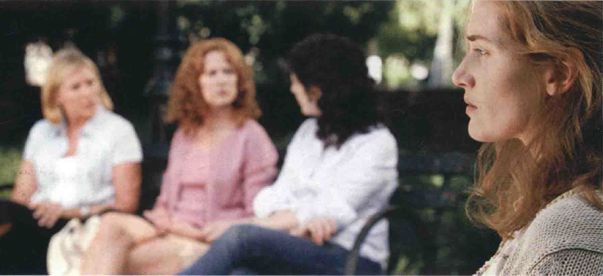
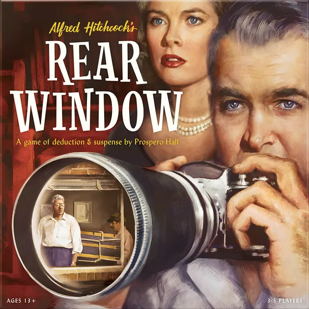

# 场面调度（1）
* **场面调度**（mise en scène）一词借自法国剧场，原意是“舞台上的布位”，在剧场里泛指在固定舞台上一切视觉元素的安排，这个区域包括**围绕舞台的前方**，或**表演区延伸到观众席中**
  * 舞台上的演员与布景陈设、走位，均以**三维空间观念**设计，而不论舞台导演强调舞台与观众是多么不同的世界，舞台与观众实际是处于**同一空间**
* **电影**的场面调度观念颇为复杂，混合了**剧场和平面艺术**的视觉传统；在拍摄过程中，电影导演也是将人与物依**三维空间观念**安排，但经过摄影机后，即将实物转换成**二维空间的影像**
  * 电影内的空间已与观众成了**两个世界**，只有影像仍与观众存于同一空间，有如画廊中的画一般；因此，电影的场面调度在形式与形状上，和**绘画艺术**一样，是在**景框**（frame）中的**平面影像**
  * 但是，电影亦保有**戏剧传统**；电影的场面调度也是一种**视觉元素**的流动韵律，可象征构想的戏剧性或复杂性
  * 场面调度是一个复杂的名词，它事实上包括了**四个不同的形式元素**：(1)**动作的安排**：(2)**布景与道具**；(3)**构图方式**；(4)**景框中事物被拍摄的方式**；场面调度的艺术与**摄影艺术**息息相关
## 景框
* **景框**内的**空间**，即是电影的世界，景框将电影与黑暗影院中的真实世界**区隔**；但是，电影不是如绘画或照片一般**静止不动**，相反，它类似戏剧，**是空间也是时间的艺术**，其视觉因素不断在**变动**，构图不断被打破、重新安排、重新定义
  * 有时为了评论需要，我们会**孤立**出某个画面做分析，但是观众看电影时，却必须同时考虑其**戏剧与时间因素**
  * **导演**常在想影像的**景框**，有人会随身带**手持观景器**，或用**手指**圈出画框，如此他们就可在大面积景观中取景，确定演员在影像中的位置

* 景框是电影影像构筑的基本，电影导演不但必须顾及景框内的构图，而且还得让景框符合**长宽比例**；其长宽比例亦有不同种类，我们通称为**画面比例**（aspect ratio）
  * 画面比例有许多种，尤其是在20世纪50年代早期**宽银幕**（widescreen）出现以后；在宽银幕未发明之前，一般比例是**1.33：1**，虽然在默片时代，也曾有不同的比例，现在大部分电影的画面比例有两种：**1.85：1**（标准银幕）及**2.35：1**（宽银幕）
    * 宽银幕对有**复杂动作**的电影特别有效，比如**歌舞场面**，或此图的**功夫打斗场面**；许多动作戏**剪得很碎**，带来片断性及场面失控的感觉，这类镜头如果在宽银幕中，就可容许动作**不致超出镜框外**，让观众觉得主角**控制局面**，将对手如挥苍蝇般挥开

    * 宽银幕也可以用来表达更**含蓄**、具心理效果的意念，比如此片主角是烦闷疏离的家庭主妇，她带孩子去公园玩，却孤寂又处在**万事边缘**，从不是中心；注意图中其他太太**焦点模糊**，与她的私人空间相距甚远

  * 但宽银幕电影在商业放映过后，常会被**裁剪**成标准规格的比例；最常见的例子是35毫米的电影被转拷成16毫米，送到校园或非盈利场合放映
  * 宽银幕影像运用得愈好的电影，在这种过程中往往**伤害**愈大；通常**三分之一的影像会被切掉**，造成荒谬的结果：比如被安排在景框边上的演员会不见踪影，或是演员对一个看不见的东西做反应
    * 宽银幕最适合捕捉场景的**广袤无垠**，如果影像被裁剪成标准银幕比例（b），则空间的**空旷性**即被牺牲，我们的眼睛又习惯**自左而右移动**，所以图a的构图，使我们感觉航天员有滑入无尽空间的危险，但万一该图被倒转过来（c），则航天员似乎是安全回归太空舱

  * 宽银幕比例的电影在转成录像带时会遭遇一些问题，有几个**解决方法**，但各有缺点
    * 最粗鲁的方法是**去边**，集中在画面的中央部分，这必须是在中央部分是焦聚之所在的假设下；不过若以此图来说，可能这么做两个人的脸都会被切到，显得很挤

    * 第二招是“**横摇及取镜**”（pan and scan），当一个人物讲话时电视摄影机就拍他，换人讲时就转移，如同拍网球打来打去一般
    * 类似的方法是重新用电视摄影机**剪辑**，将人物对话画面直接用**切接**，而不用横摇方法，使人物单独存在于独立的画面；但是这个镜头的本质需要**两个人物同时在同一画面**中——因为剧情张力在于两人之间的微妙反应，若以剪辑方法，则真谛尽失
    * 第四种方法是“**信箱法**”（letter boxing）——将画面全部**缩放**在电视画面上，上下银幕则**遮黑**；有些人抱怨这个方法使电影画面在原本就很小的荧光幕上变得更小，只剩约一半
* **录像带**和**电视**基本上是两种不同的媒介
  * 录像带可能是电影或剧场**转换过来**的媒介，换句话说，录像带是**二手纪录**，多少会**损坏原始的形式**；然而，有机会看录像带中的电影或话剧，总比没机会看电影好
  * 电视有它**自己的艺术形式**，包括它的荧光屏比例和20世纪50年代以前的电影银幕类似；注意此画面中的喜剧场景拍得**很紧**，电视摄影机的是中景大小，而演员必须在小小的**几平方英尺**的空间内表演，如果把它放大到大的电影银幕上，尽管演员的表演非常精彩，画面可能变得**很挤**，且**粗糙无比**

* 在传统视觉艺术中，景框的观念往往**为题材的本质所牵引**；比如说，一幅摩天大楼的画，可能形状便是垂直的，配的框架亦是长方形的，相同的，宽广的景观亦会采取水平的面向
  * 电影的长宽比例都是**固定的**，但却不表示影像会**缺乏变化**；电影工作者反而像十四行诗的诗人，选择制律最**严谨**的形式，而在形式及题材的张力上创作，当技法和题材合一时，美学趣味也提高了
  * 为了追求稳定与和谐，导演通常会运用**对称的构图**，如此，画面中许多元素的安排无论在数量还是重量上，均是**对称平均**的；两杯啤酒是视觉透视焦点，两个人、两扇窗、两对窗内的男女、中央的画与地上的狗，都以平衡的姿态出现

  * **三的原则**在设计里、景观中以及所有视觉艺术中都存在，三个在视觉上比单个（强调独一无二）或双个（强调平等）有趣多了；本片是多多少少根据唱片界的The Supremes合唱团故事改编成的音乐剧，戏剧化地讲述了赫德森这个角色其实是三人中最有才华者，但最终因为碧昂丝角色外表更耀眼玲珑而被挤出，注意此图，碧昂丝的**中心站位**令她成为合唱团的主导人物

* 由于一般电影的规格都是**宽扁形**的，要制造**垂直的影像**较为困难，创作者于是用**遮盖法**（masking）来改变银幕的比例与形状
  * 例如**格里菲斯**（D.W.Griffith）在1916年的《**党同伐异**》（Intolerance）中，就用遮盖法来使银幕两边与景框外的黑暗连成一片，成为长方形的**垂直银幕**，以强调一个士兵由墙上掉下来；同样的，他也会遮盖银幕的下三分之一部分，造成**宽银幕效果**，遮盖法亦可用来营造倾斜的、椭圆的、圆形的画面

* 默片时代，**圈入圈出**（iris，指以圆形或椭圆形圈入或圈出银幕上的一部分）常被**过度使用**；但这种方法到了大师手上，往往会成为**有力的戏剧意义**
  * 例如**特吕弗**（Frangois Truffaut）在《**野孩子**》（The Wild Child）中亦用此法来显示从原始丛林来的小孩面对文明的**紧张注意焦点**；遮去的黑暗部分象征他如何不明了外在的社会环境，而只注意紧靠他周围的事物

* 从美学上来说，景框的表现方式有许多种，感性的导演会同时重视**景框内外的事物**；景框亦负担有**选择**的功能，基本上，它是由众多混乱的现实中选择部分给观众看，所以它是一种“**孤立凸显**”的技法，能使导演引导大家注意可能被忽略的事物
  * 景框亦能转换成多种**隐喻**，有些导演将之视为**偷窥意象**，比如**希区柯克**；他的众多电影中，景框被当成窗户，提供观众偷窥角色私人生活的途径，如《**精神病患者**》（Psycho）和《**后窗**》（Rear Window）都以这种偷窥母题为主

  * 希区柯克自认是**形式主义者**，擅长以极精确的方式**计算**，以达到他想要的效果；他相信没有经过设计的现实是**凌乱且不具意义**的，演员身边的空间必须依逐个镜头的需要而安排，此图场面调度的安排与女主角受困的境况相**模拟**，对话在这种情况下可以处理得相当**中性**，因为心理上的**紧张受迫**已透过摄影机的位置，以及演员在空间中的安排，巧妙地传达出来

  * 其他导演则不强调偷窥母题，如让·雷诺阿的《金马车》，景框成了**剧场的舞台**，使整部电影中“生活似舞台”的主导隐喻显得格外适切

  * 空间和意义息息相关，上下两个镜头差别极小却有意义；由当今我们犬儒又多疑的眼光来看，这男人铁定对少年**图谋不轨**，由图2-3d可佐证，画面将两人圈在**亲密的空间**中，外面的世界被隔除在外，但看2-3c的图片，取镜就**松散很多**，外面的世界占了较多空间，他俩在**较开放**（安全）的环境中

  * 画面里**谁站哪里**是重要的信息来源，其**空间位置**是观众理解内容的重点；比如较近的构图（2-5a）我们看到警察与平民两个角色**紧张地交谈**，电影里真正的镜头如2-5b，权力关系则清楚多了，强悍的警官将移民父亲推至墙边，他的儿子则焦点模糊地站在后方，怕得无法帮助父亲，注意警官如何站在画面中间，老头被挤在画面边缘，此场面调度是画面“**表意**”的很好例子

  * 电影的景框可以**分隔**画面局部和外在空间，**含蓄地评论**其题材；《**战士奇兵**》记述了一个受创妻子的状况，画面宛如象征性的牢狱，将妻子与其暴力的丈夫囚禁在同一空间，注意丈夫如何主控了大部分的画面，使她被挤至画面右端，害怕地退在墙边

  * 这几种画面，绘画和剧场中都不会出现，因为这些媒介的画面是一种**中性的**题材环境，在视觉上是**封闭的**；而电影中的景框（暂时性的）提供给我们的是**暂时的定格真实**，它很快会溶入另一个构图中
* 景框中的特定位置都有其**象征意义**，换句话说，将人或物放在景框内的某个部分，即代表导演对该人或物的**意见或评价**；一般来说，景框内分中央、上、下、边缘几个区域，每个部分都能代表隐喻和象征意义
  * 银幕的**中央**往往是视觉上**最重要**的，也是一般认为的**注意焦点**；我们给人照相，喜欢将人物放在**观景器**（viewfinder）的中央，从小我们也被教导说，绘画时中央是**透视焦点**，因此，我们会期待中央是主导的**视线焦点**
  * 也因为如此，中央的区域显得较理所当然而**不戏剧化**；**写实者**喜欢以中央为**主导**，因为四平八稳，在景框上不会干扰观众，使观众能专注于题材，不致被非中央的东西转移注意力，而**形式主义者**则以银幕中央的构图来支配一般的**说明性镜头**
  * 景框的**上部**往往象征了权力、权威和精神信仰，放在这个部位的人或物，似乎控制了下方，例如拍摄**王公贵族或名流**往往以这种方式；这种方式也常用于拍摄**皇宫或高山**
  * 一般而论，若在上部的人物**其貌不扬**，给人的感觉即是**危险而具威胁性**，然而，这只适用于在其他人物比这个主要人物小或同样大时
  * 但这种象征法**亦非一成不变**，比如说，当我们拍人物中景时，其头部一定在景框的上方，这当然**并不代表象征意义**；而场面调度，本是用于**远景或大远景**的艺术，因为镜头近了便无法让导演在视觉因素的选择上有较大发挥，象征意义也较难表现，因为象征在某些程度上较依赖景框内**各种元素的对比**
  * 景框的**下部**则代表服从、脆弱、无力，放在此部分的人或物似乎都“弱”于上部，而且靠外缘的黑暗太近，也常具“**危险**”意义；如一个画面中不止一人，那么在景框下的人物往往似**被**上部之人**支配**
    * 这个镜头中所有构图元素都有助于“**受困**”的概念，主角在此刚得知女儿尸体在森林中寻获，疯狂地向遗体直冲，他被两排警察团团围住，他们抓住他不让他破坏尸体周边之证据；这场动作戏画面**构图很紧**，摄影机镜位稍微**拉高**，强化**被困之感**，这影像可称为“没有出路”

  * **左或右的边缘部分**看起来都**不太重要**，因为它们离中央太远，靠近**景框外的黑暗**，许多导演好用黑暗象征缺乏光芒，也与未知的、未见的、可怕的意象相关；通常银幕外的黑暗部分象征**被湮灭**，甚至死亡，一般来说，不重要、被忽视、无名的人物都较靠“不重要的”边缘
    * 这张宣传照有什么问题？首先，主角**不在画面正中**，影像也**不对称**，右边空的空间使**视觉不平衡**，视觉艺术家常用这种“负面”空间来造成**影像的真空**，好像有什么东西不见了，或有什么话没说；此片的女主角刚怀孕却被情人抛弃，这个男子不值一文，可是难以解释也有点变态的是，这女人仍爱着他，他的离去在她生命中留下**一大片空白**

  * 也有导演将**重要视觉因素**完全放在景框外，尤其是那些与黑暗、神秘、死亡相联的角色，这种方式很有效，因为观众对看不见的东西总是**心存害怕**；比如**弗里茨·朗**的《**M**》一片的前半部，杀小孩的凶手一直是躲在框外的黑暗中，仅偶尔让我们警到他墙上的影子和听到他怪异的哨声

* 此外还有两个景框外的空间具有象征性：一个是**场景后的空间**，另一个是**摄影机前的空间**；例如导演不让我们看到紧闭着的门后发生了什么事，让观众产生好奇心，因为他们会替这段空白填上生动的影像
  * 希区柯克《**美人计**》（Votorious）的最后一个镜头就是很好的例子，男主角帮女主角通过一群纳粹特务的监视走到等待的车上，而具同情心的反派（克劳德·雷恩斯饰）则掩护他们，并希望不会引起他的同僚的怀疑；在这个**深焦远景镜头**（deep-focus long shot）中，男主角爬上阶梯，与这些神秘的特务再进入房子，他们在他之后关上门，希区柯克并没有让我们知道门内发生了什么事
  * **摄影机前的空间**也可产生使人**心绪不宁**的效果，例如在**约翰·休斯顿**（John Huston）的《**马耳他之鹰**》（The Maltese Falcon）中，我们看到一场不见凶手的谋杀，摄影机以中景拍摄被害者，枪则从摄影机前的景框伸出，直到电影结束我们才知道凶手的样子
