# 场面调度（2）
## 构图和设计
* 虽然电影在拍摄中是以**三维空间**安排，但是导演和画家一样须顾及一些**绘画般的元素**，如形状、色彩、线条、质感
  * 在**古典电影**中，这种平面的安排通常会倾向平衡、和谐和均势
    * 在《**四兄弟**》中，领养来的四个兄弟在餐前祈铸时把手握在了一起，注意灯光装置是如何对应四个角色的位置的；这种场面调度暗示了一种平衡和协调的感觉
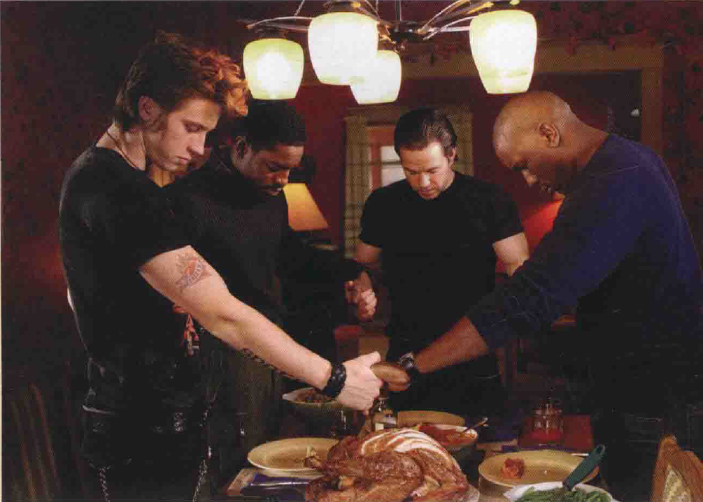
  * 不过，这种平衡原则在电影中不尽为真理；许多导演会刻意制造**不平衡的画面**来寻求**戏剧效果**，比如说，电影中有偏执的角色或事件时，导演便会故意违反和谐的构图，又如全景中，原本将角色放在中央即是平稳的画面，但导演可能会将之放在景框边缘，造成心理效果
    * 《**恶狼**》的血腥场面故意在构图上失衡，重伤之被害人慢慢往下滑出镜外之黑处，杀手的身体也可看到部分，挤在左下角；整场戏笼罩在蓝色荧光中，镜头画面丑陋又不和谐
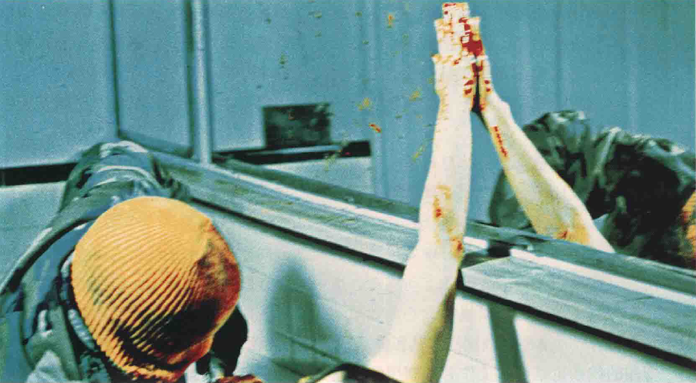 
* 事实上，人眼相当**敏感**，能同时观察**七八种构图因素**的运用
  * 导演常会指引观众视线到**对比最强的区域**（dominant contrast），因为该区域会在其他较含蓄对比的区域凸显而出；在**黑白片**中，导演常用**光线对比**来指引观众，对比强处常比对比弱处先吸引观众的目光
  * 其次，我们的眼睛会注意到**对比次强的区域**（subsidiary contrasts），创作者往往将它用来**平衡整个构图**：即使是在绘画和照片上，人眼也很少停驻于固定区域
    * 例如这张图片，我们的眼晴先被**麦克白夫人的脸部**所吸引，因为它的光线对比非常强，并且被其他黑色区域包围；然后注意到麦克白夫人与她丈夫之间的**空白**——次亮的区域，之后才是**麦克白若有所思的脸部**——光源更晦暗的部分
    * 本图中视觉的焦点与**影片的内涵**相呼应，因为麦克白夫人逐渐陷入疯狂边缘，并在精神上觉得与丈夫愈来愈疏离
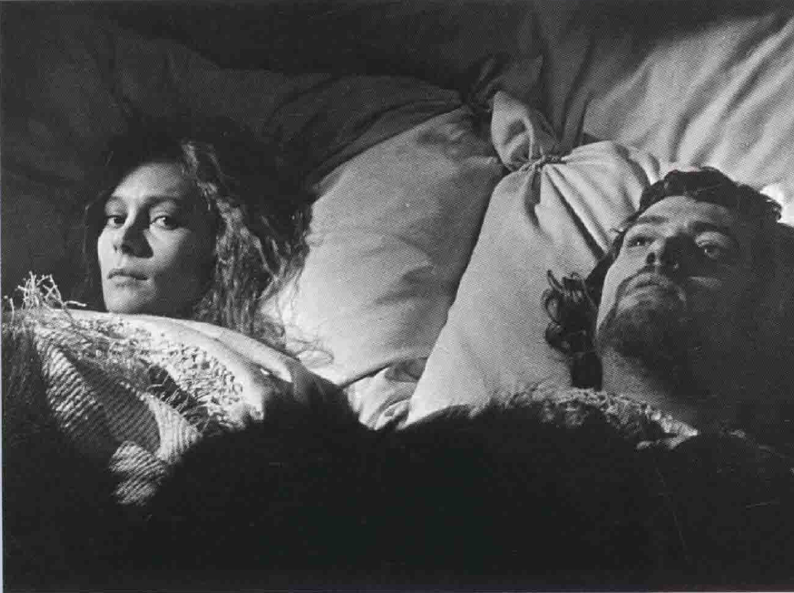
* 一般来说，**对比最强的主导因素**往往与**戏剧趣味**相关
  * 由于电影的时间因素与戏剧因素同样重要，有时主导对比的即是“动作”本身，也就是美学家所称的**内在趣味**（intrinsic interest），即观众在剧情过程中，知道有时**视觉上不吸引人**的地方，事实上在故事的**戏剧性**方面**很重要**
  * 因此，一把**枪**在画面上所占的比例不大，但我们知道它在戏剧性方面很重要，虽然其位置不明显，却仍将是**焦点**所在
    * 现实主义者与形式主义者用不同的视觉技巧方式解决不同的问题；**波兰斯基**运用**写实手法**来呈现麦克白夫人的精神状态（如演技和灯光效果），**威尔斯**则采用较**形式主义**的手法以外在的道具形式来传达人物内在世界的状态，此图中铁栏杆产生像刀片的光柱，似乎要刺穿麦克白夫人的身体，在此，栏杆的效果并非写实，而是有其功能：威尔斯主要是拿它来作为象征意义，模拟她内在的混乱
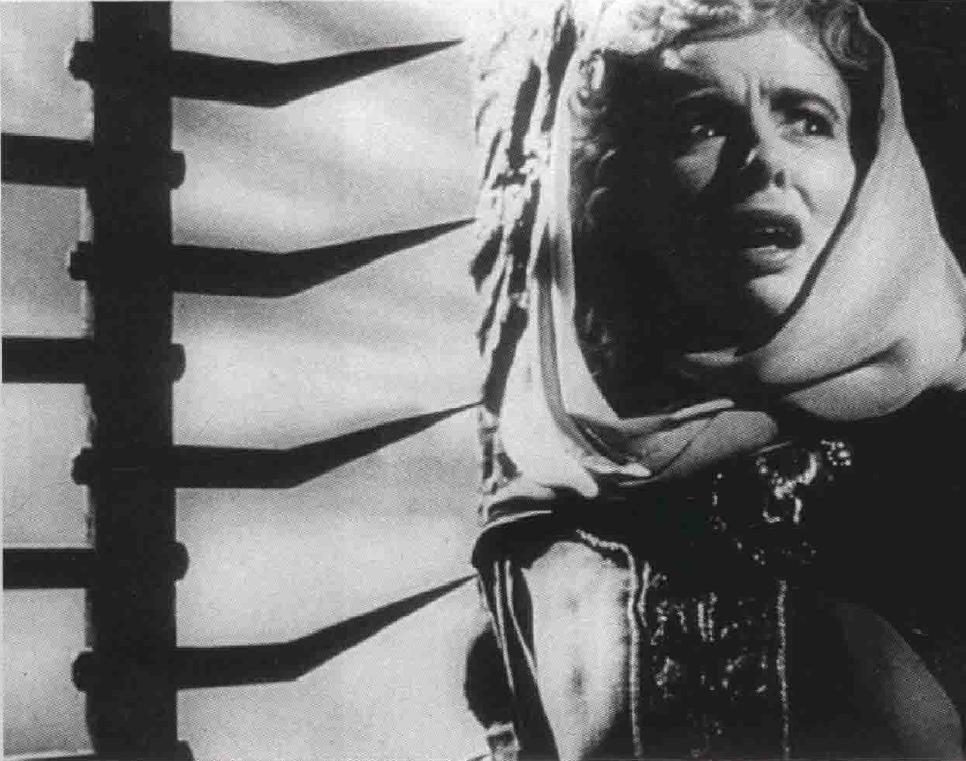
* 即使三流导演也知道用“**动作**”来吸引观众的目光，因为动作永远是最自然而然的**对比最强**的区域
  * 也因为如此，许多平庸的创作者会**忽略影像的丰富潜力**，**仰赖动作**来吸引观众；此外，有些导演会**改变对比因素**，有时强调动作，有时则以动作为辅
  * 动作的**重要性**也依镜头而不同：在**远景**中，动作显得较不吸引人；在**特写**中，动作则极为凸显
* 不过，如果构图内有八九种因素在运作，就会对观众产生**困扰**；有时导演会故意利用这种困扰，制造**戏剧效果**，如战争场面
  * 一般说来，我们的眼睛会极力**整合不同的元素**，例如，在一个复杂的设计中，眼睛会结合相似的形状、颜色、质感等等；如果形式上的元素一再重复则代表**经验的重复**，这种关联形成了**视觉上的韵律**，让眼睛跳过设计的表面，而理解到**整体的平衡**
    * 她是个艺术和情感都封闭的作家，此镜头充分显现她的紧绷感，无法解脱，也无力重拾创作活力；奥宗如此构图，将主角深埋在红白红条中，宛如一幅抽象画
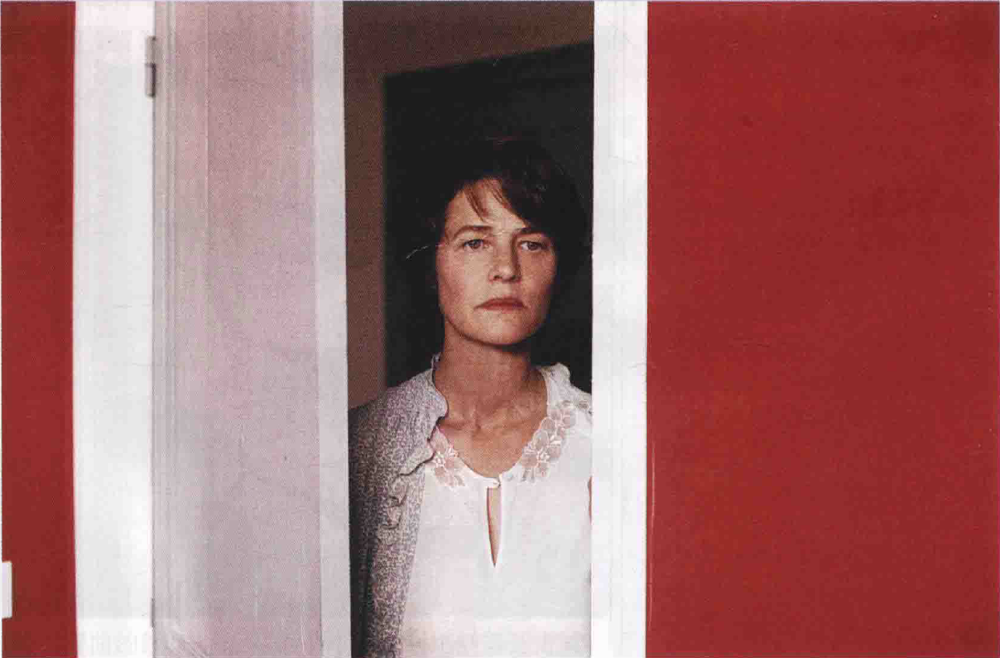
* 视觉艺术家有时会将构图因素称为“**重量**”；一般艺术家会将“重量”**平均分配**，以取得**平衡感**（尤其是在古典电影中），但完美的对称是很少发生的
  * 在**完全对称**的设计中（剧情片不可能有这种情形），视觉的“重量”分配得很**平均**，构图的中心是**轴心点**；而大部分的构图都是**不对称的**，甚至两种不同元素的“重量”也会相抗衡，例如形状的“重量”和颜色的“重量”相抗衡
  * 心理学家及艺术理论家认为构图的特定部分有其本质上的“重量”；如德国艺术史家**沃尔夫林**（Heinrich Wolfflin）就认为人眼在观看时，习惯上是**由左而右**，所以左边的“重量”往往会**加强**以取得平衡，尤其是在古典构图中，这种情形更普遍
  * 构图的**上半部**永远比下半部重，因此，导演常对垂直的摩天大楼、柱子略略**仰角拍摄**，使上端显得较细小，压迫感也不那么重
  * 如果影像的**重心较低**，画面也会显得较为**平稳**，所以水平景观的地平线往往会比画面中心点**略低**，不然天空会产生太重的压力；但像约翰·福特或爱森斯坦等史诗片导演，恰恰会运用天空的压力，制造对平原及人物的**压迫感**
    * 当导演想强调角色**毫无防备的脆弱**时，地平线通常就会更下面一点，而有时候**重量最重的视觉元素**会摆在**角色之上**；例如图中这幅巧妙设计的宣传照，主角克拉克（Clark Kent）的父母被自已领养的小孩的超能力吓坏了——他们觉得自已可能有生命危险
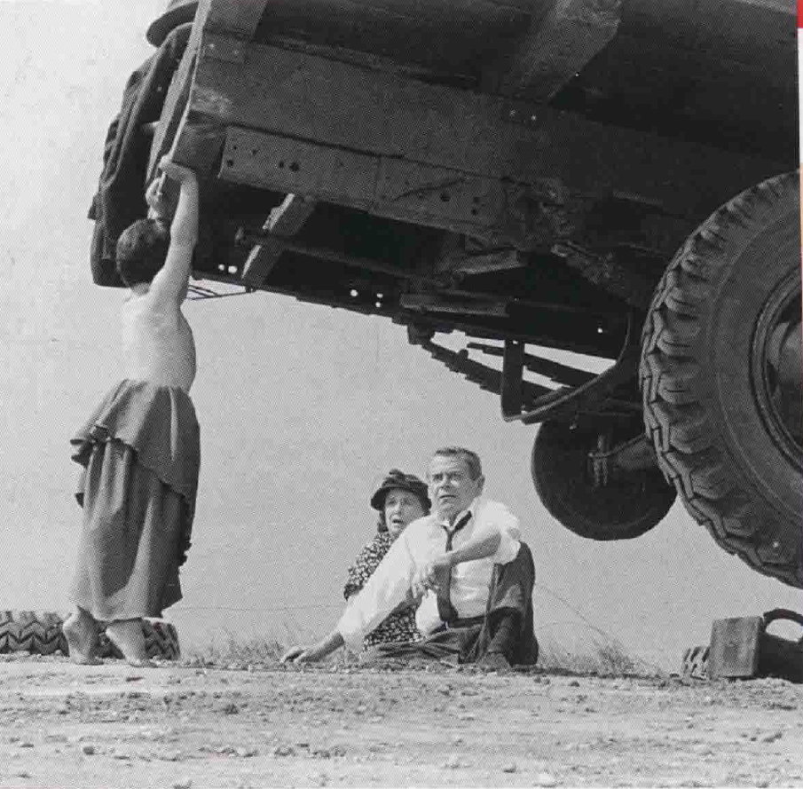
  * **单独的人或物**也会比群体**显得重**，所以有时导演会孤立出个人角色与群众；虽然两者在人数上不成比例，但人物的孤立会使两者在心理上的重量看来相似，如黑泽明《**用心棒**》（Yojimbo）中著名的场景即为一例
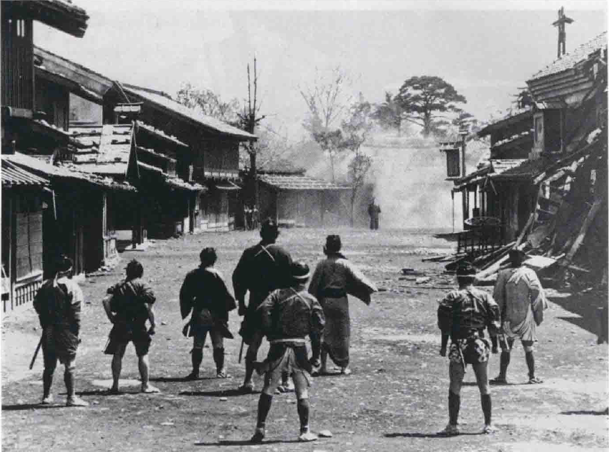
* **线条的运用**亦能产生一些心理效果
  * 从运动的方向来说，**水平线**给人**由左到右**的感觉，而**垂直线**则予人**由上而下**的运动感觉
  * **水平或垂直线条**看来**稳定**，**斜线或歪线**却具“**动感**”；许多导演即利用斜线制造**心理效果**，比如说，他可以利用斜线使角色显得**浮躁不安**，即使场面本身不具戏剧性，其影像和剧情间仍能营造张力
  * **弯曲的线条**也是电影工作者常利用的表达方式；多年来证明，S、X、三角形和圆形是艺术家最喜欢的形状，这种构图通常都运用得很**简单**，因为大家认为这些线条的**差感**是与生俱来的
  * 视觉艺术家也常用特定形状来凸显象征概念；比如，**双边对称**的结构强调平行——几乎每两个镜头就暗示成双或双重倍数共享一个空间，**三角结构**则强调三个主元素之间的强烈互动，**圆形**则暗示安定、封闭和女性特质
    * **平行**在设计中代表相似、和谐、相互扶持；此片的许多笑料来自这两人的差异，两个活宝闹的笑话却一致，可改名为“天生一对”
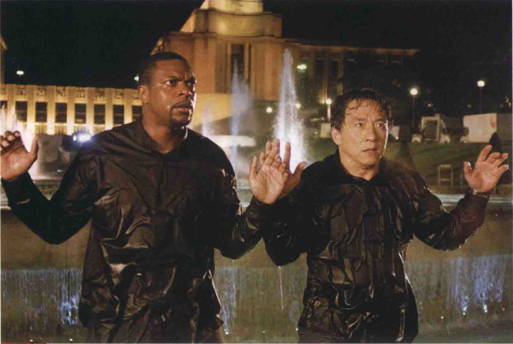
    * 一群女人在健康俱乐部一起健身、聊天和欢笑，而她们的男人在家里准备晚餐；**圆形的构图**强调了女人之间的**同盟情谊**，如此画面的设计具体化了她们彼此所分享的经验及互动的联结
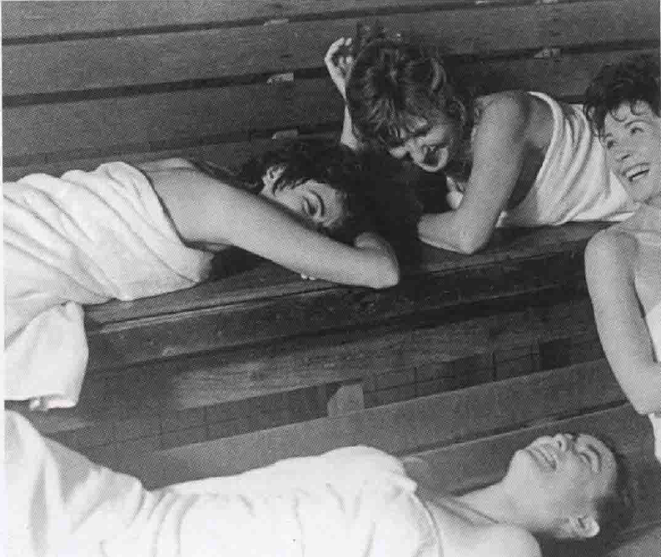
* 设计通常与**主题的理念**配合，至少在一些绝佳的电影中是如此
  * 像在《**朱尔与吉姆**》中，特吕弗不断用**三角形的构图**来象征主角的**三角关系**，片中三人的关系就是经常变动而且总是彼此纠结的；此片的影像象征性地使用了浪漫的三角形来表现戏剧性的内容，三角构图的设计强化视觉，让三人的关系失去平衡，不断产生变化
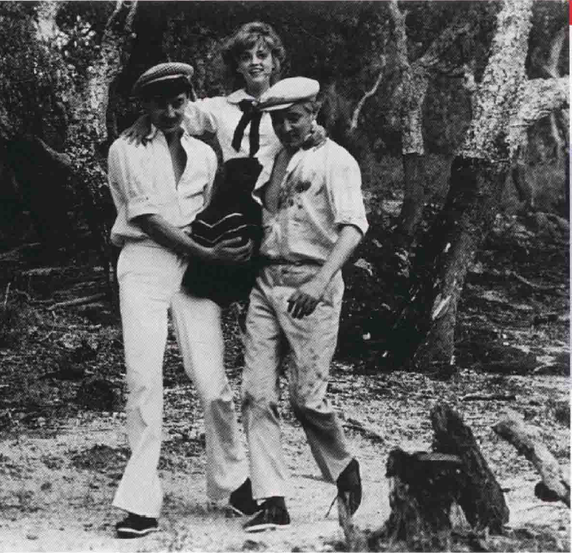
  * 一般而言，以三、五或七为单位制造的构图较具动感和不平衡感觉，而二、四、六单位的构图较为平稳、安定、均衡
## 区域空间
* 以上讨论的只涉及**二维空间**的场面调度，但由于大部分电影影像都处理到想象上的**深度空间**，导演必须在心理上以此考虑来构筑视觉效果；平面安排形状、线条、色彩、质感固然重要，但电影影像同时得兼及人的故事
* 导演为避免影像**趋于平面**，往往会**丰厚**其影像，于是构图至少需顾及中景、前景、背景**三个层次**；这种技法不仅赋予影像**纵深感**，也大幅改变**主导对比的焦点**，给予影像含蓄或明显的特色
  * 一个站在**中景**的角色，其**前景**往往会“**评论**”（comment）其意义；有些陪衬背景，会暗示主体与环境本质**合而为一**
  * 前景的**轻纱**可以象征神秘、色情和女性化，**交错的窗槛**则暗示了自我分裂等等；这种原则亦适用于**背景**，虽然背景的影响意义远不及中景和前景
  * 通常摄影机与角色间的空间会保持**净空**，使我们能无阻地看到角色，但有时导演为了呈现戏剧化或心理观点，会**故意阻隔观众的视线**；此处，男主角内心的焦虑和紧张经由某种形式技巧表达，**斜线的网**叙述了他内心的激动，而**过紧的特写景框**、**模糊的背景**和**带有阻挠意味的前景铁网**，暗示他哪里也去不了
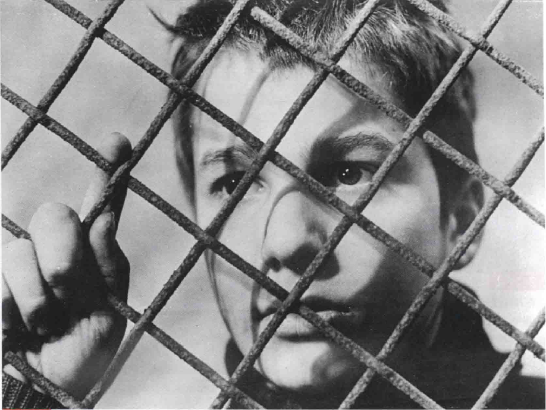
* 用什么**镜头**来拍摄什么题材，是导演最基本也最重要的工作之一
  * 这可不是小问题，因为**景框内的空间**会影响到我们对被摄物的反应；导演必须用**不同的镜头**来决定**空间之大小**，但多大的空间才恰到好处正是问题所在
  * **景框内的空间**是表达的一个重点；生活中其实与艺术一样，我们都是在**固定空间**中对某些事物做反应，当空间的传统被**破坏**时，我们本能地会提高警觉
  * **洛伦茨**在他的《**论侵略**》（On Aggression）一书中提到，动物（包括人类）往往会划地“**自保**”，如果这个空间被侵犯，会感觉到压力、紧张、焦虑，可能导致侵略或暴力的行为，甚至领土的战争
  * 学者又据研究发现，人的空间观念与**权力阶层**有关，主导性越强，拥有的空间也越多；在特定的区域里，一个人的**重要性**也会影响他所占的空间大小
* 在电影中，空间是一项重要的**沟通媒介**，可告诉我们角色的**心理和社会关系**
  * **主角**通常拥有**较大的空间**——除非电影谈的是他的**失势**或对社会的**无能为力**
  * 角色所占的空间不见得代表他的**社会地位**，主要还在于他的**戏剧重要性**；如皇亲贵族原本应比农夫占的空间大，但若电影是以农夫的故事为主，农夫便会主导电影空间
  * 构图短暂地诠释了影像的**心理空间**，在切割过的宣传照中，莫瑞似乎是一夜缱绻后初睁开眼，但此影中的全景，他却像要被枕边人生吞了；她占了2/3空间，手如鲨鱼口般咬着他的脸——心理学家称此为有齿阴道（vagina dentata）焦虑症
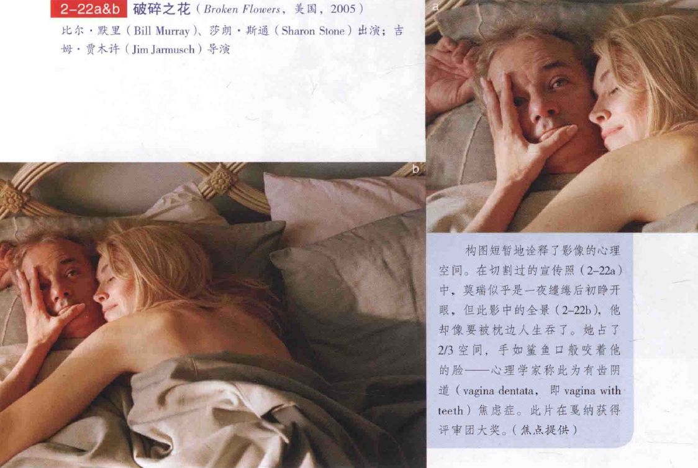
  * 一个画面可被视为一个意识形态细胞，构图即可说明人物的**权力消长**；人物不仅仅是因为美学因素而被摆在画面中，人是有**领域性**的
    * 库萨克演的角色具有强烈的恋母情结，两人经常在**斗争主导权**，此图即可说明谁在主导，在一个白色为主的画面中，**颜色较深**的（在此是黑色）物体即是主导，而画面的**右边**会比左边重，即更主导，**站立的人物**主导坐着的人物；画面的**上方**（即安洁莉卡·休斯顿的领域）控制了整个中央及底部，她是一个凶手
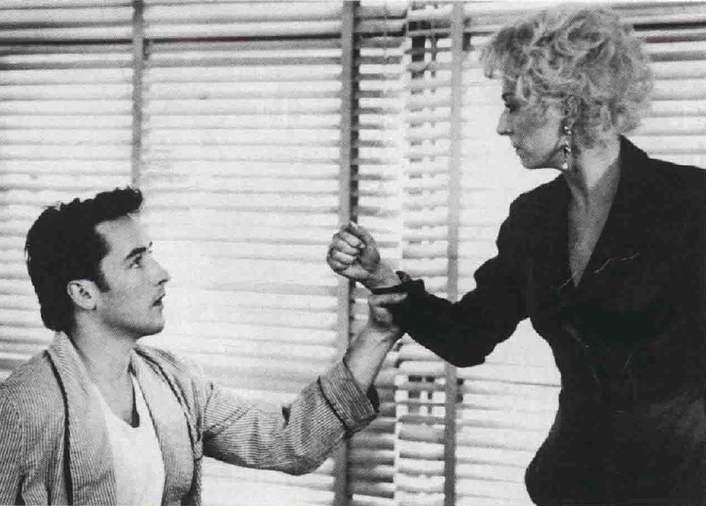
* **电影景框**也是空间的一种，虽然是**暂时性**的，仅存于每个镜头
  * 景框中的空间是导演（场面调度者）运用的**重要因素**之一，因为他可以轻易利用不同的空间传统来定义、调整、改变角色的心理和社会关系；而且，当关系建立后，导演可以改变摄影机的镜位来继续发掘其他更深的意义
  * 像某些大师就经常在同一个镜头内**改变**角色之间的空间、画面景深、景框中的视觉重量关系和演员相对于镜头的运动方向，从而改变其**心理和社会的基调关系**
  * 在观众和观众**所认同的人物**之间，突然（在画面的前景）插入一个**具有敌意的人或物**（在此为班克劳夫特），观众会觉得相当**不安全**或有被孤立的感觉
    * 在这场戏中，我们的主角，应届毕业生**本杰明·布拉多克**即受到了威胁。他在想，一个比他年纪大的女人可能正想诱惑他，而这个女人是他朋友的母亲；他受困以及被侵犯的感觉并不是从**对白**而来，因为他表现得又口吃又窘，而是透过**场面调度**的元素而来，班克劳夫特半裸的身体挡在他的前方，背后窗棂更把他困在里面——是电影画面中的框（房间）中之框
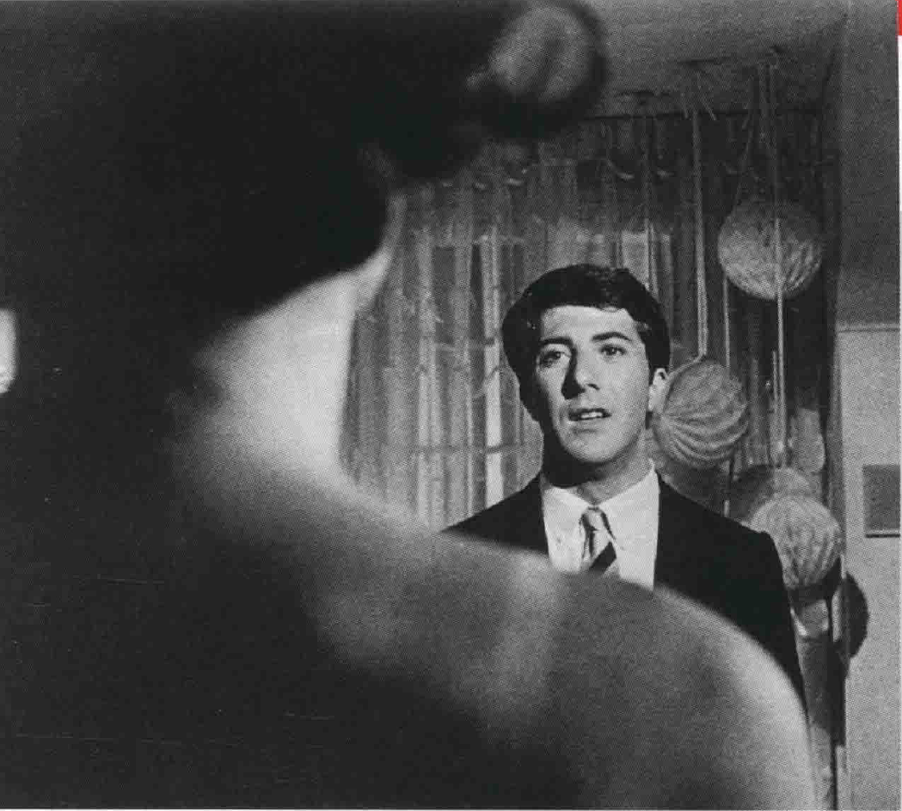
* 摄影机拍摄人或物一共有**五种基本方位**，从心理学上看，每种方位都代表了不同的隐喻：（1）**完全正面**（full front）——面对摄影机；（2）**四分之一侧面**（quarter turn）；（3）**侧面**（profile）——人物注视右方或左方；（3）**四分之三侧面**（three--quater turn）；（4）**背对摄影机**（back to camera）
  * 如果观众**认同**摄影机的镜头，那么演员的位置和摄影机的关系就决定了我们的反应；如果能见到演员的脸，观众会觉得**亲密**，反之，则感觉**神秘**
  * **完全正面**的方位是**最亲近**的——人物面对我们，邀请我们参与他的一切；通常演员都会**忽略摄影机**（亦即忽略观众）的存在，而观众的位置正好让我们**毫无阻拦地观察**他的所作所为；如果演员因摄影机的导引而**察觉观众的存在**，那么亲密感就**更深**了，但这种情形很罕见
    * 完全正面的镜头使我们和角色**较为亲密**，尤其是在使用**特写镜头**时：我们可以检视他们脸上的**精神状态**；像此图如此复杂的画面，我们有权理解比剧中角色更多的信息，在这里，控制欲强的母亲不能确定自己是否还能继续控制想挣脱她的儿子
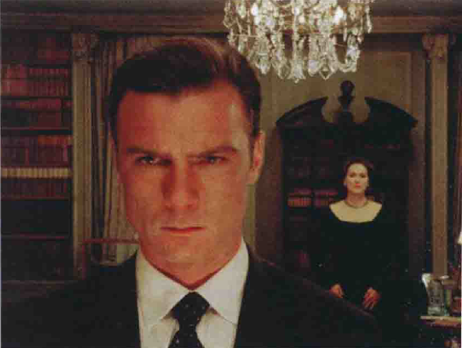
    * 完全的正面镜头也可带有**对抗性**，因为角色面对我们毫不退缩；有什么比此图更能表现一群僵尸走向摄影机（我们）攻击人更可怕？这群无灵魂的怪物由最前面的大个儿领军，正要生吞狂杀活人
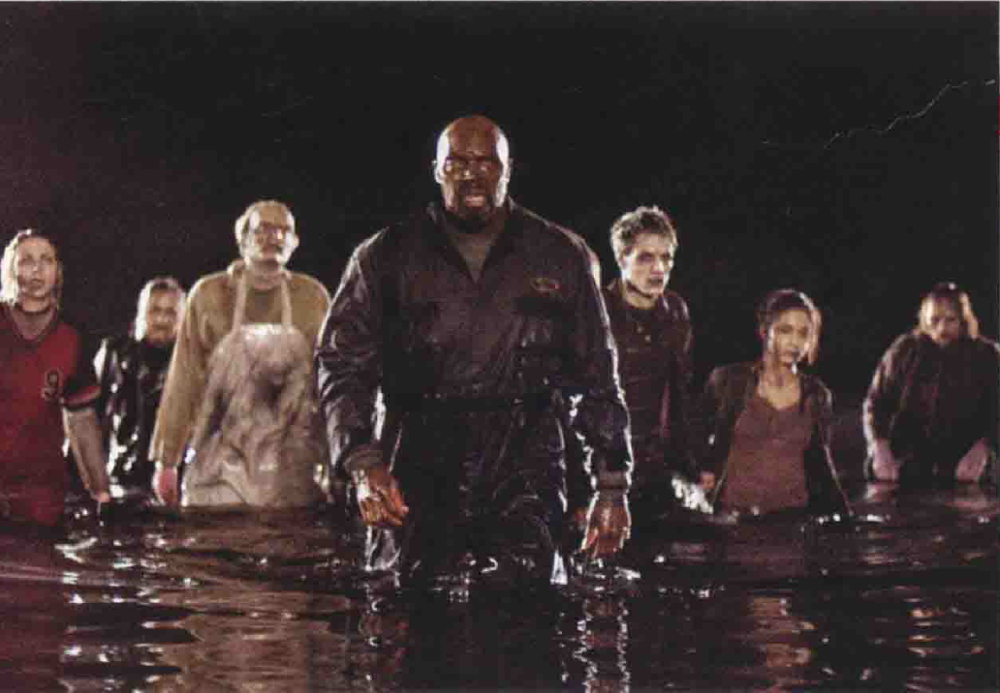
    * 演员几乎很少**直视镜头**，但是也有些例外，尤其是**喜剧演员**，当今如**艾迪·墨菲**（Eddie Murphy），过去则属**哈台**为个中翘楚；每当**劳莱**做了蠢事（通常是让他们的同伴出丑），哈台就会面对镜头——面对观众——尝试压住怒气，仿佛他是比较聪明的家伙，希望获得我们的同情
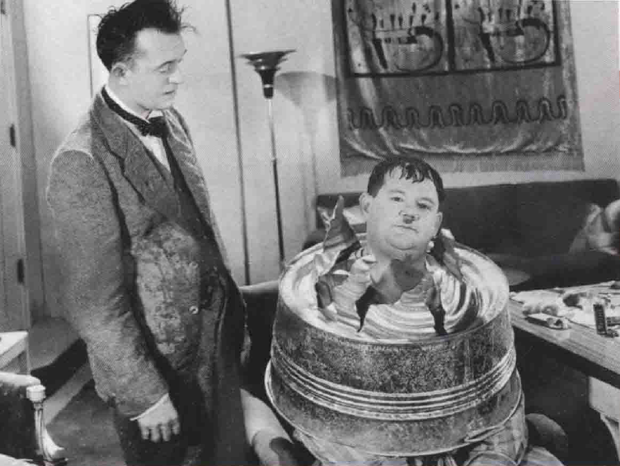
  * 大部分导演常用**四分之一侧面**的位置，因为它**亲密感**很强但**参与感**弱于完全正面的位置
  * **侧面**则较**疏离**，人物**并不知道**他被观察；这种镜头比正面或四分之一侧面位置**少点亲密性**，也较少情感，观众可以由一个不介入、**中立**的观点来看这些角色
    * 摄影机选择在侧面位置拍摄，角色看似瞧向左右景框之外，没意识到镜头的存在，这使我们可以不受干扰地**尽情观察角色**
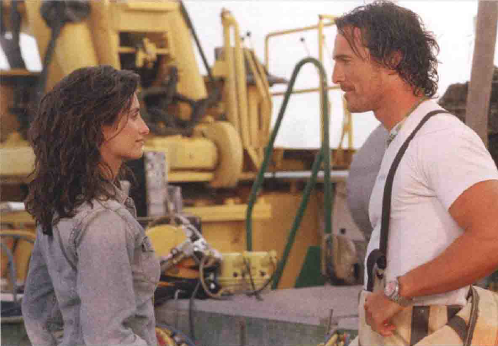
  * **四分之三侧面**的位置**更疏离**，通常用来表示人物的**不友善**及反社会的情感，人物的背有部分对着我们，拒绝我们的关心
    * 四分之三的背影镜头是**对镜头的拒绝**，不配合我们想多看一点的欲望，这种安排倾向使观众好像是在**偷窥角色的生活**，角色则好像希望观众**走开**；这场家庭晚餐的场景，演员的肢体语言和**迈克·李**的场面调度带着深刻的疏离味道，每个角色似被囚禁、活埋在自己的一块小空间中
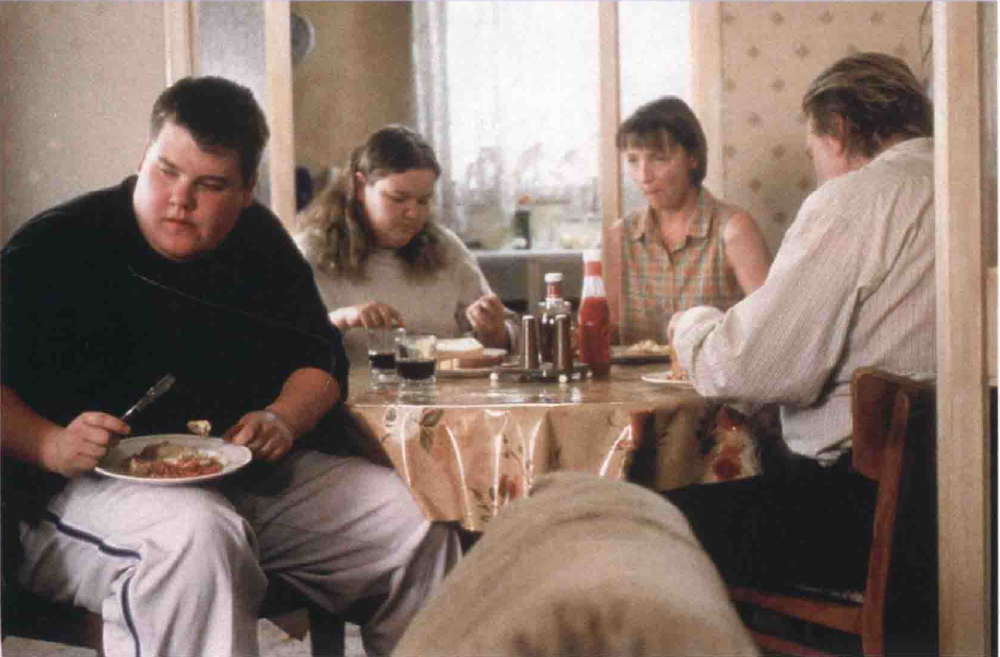
  * 当人物完全**背对**摄影机时，我们只能猜测发生了什么事，这种位置常代表人物与这个世界的**疏离**，它也用来表达**隐匿而神秘的气氛**；当人物背对镜头，他们似乎在**拒绝观众**，或完全不知我们的存在，我们渴望分析他们的表情，但似乎无法获得许可
    * **安东尼奥尼**是场面调度的超级大师，他可以用少数的对白，运用其他视听元素来表达复杂的关系；本片女主角刚从精神崩溃中恢复，但她仍然焦虑不安，甚至是对她自己的丈夫，图中她似乎显得相当困惑，像一只受伤而疲惫不安的动物，困在她的丈夫及丈夫的同事之间，注意红漆被暴烈地喷洒在墙上，宛如出血般地象征她的精神状态
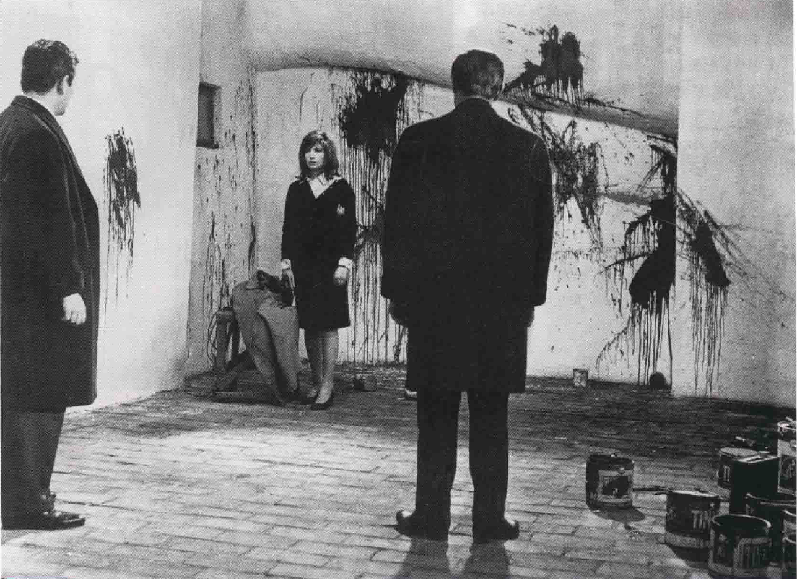
* **空间的大小**可以用来象征不同意义
  * 一般而言，镜头越靠近，被摄主体的**限制感**亦越大，这种镜头我们称为**紧的取镜**（tightly framed）；相反的，镜头越远即为**松的取镜**（loosely framed），象征了**自由开阔**
  * **牢狱电影**因此喜用**中景与特写**，如**罗贝尔·布莱松**（Robert Bresson）的《**死囚越狱**》（A Condemned Man Escapes），镜头几乎就全集中在主角**铐了手铐的特写**上；主角一开始就在准备逃亡，布莱松利用紧的画面来强调主角不能忍受的封闭感，这种空间张力直到片尾才放开，当主角翻墙逃入黑暗中时，布莱松用的是**松的远景**（全片惟一的一个远景），来象征他的心理和精神解放

  * 空间的大小在**不同场景**下的含义也不同；《**十全主妇**》根据真实故事改编，背景是20世纪50年代俄亥俄州小镇的家庭主妇故事，她有十个小孩，丈夫酗酒粗暴，孩子们耗尽了她的精力，却也是她生命中最大的支柱和爱；这帧照片**构图很紧**，显示出她抚着孩子的亲密行动：孩子拥着她，抵御着外面的敌意世界，这里的紧构图不是围困，而是**保护层**
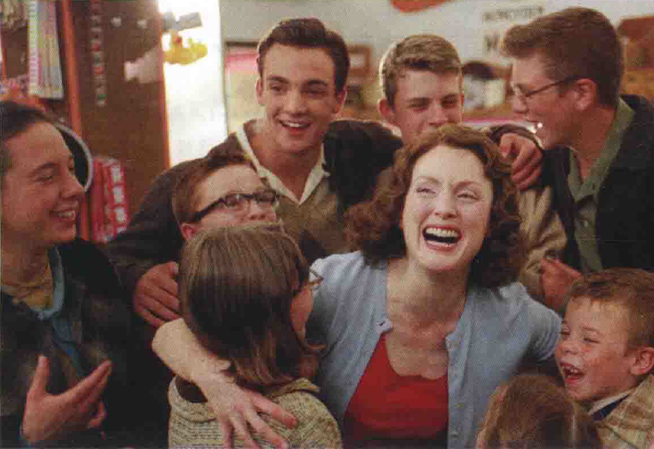
  * 导演也常常会用**完全中立的物体和线条**来象征人的受困，换句话说，用物体来**笼罩**一个形象
  * **画面的密度**与画面的内容**细节多少**相关，大部分的电影都以光影投在人事物上做谨慎的处理，有些稀疏，有些紧密，密度与人在所处的世界中的生活质量相关；《**蓝天使**》中，低俗的酒吧场景是又嘈杂又拥挤，烟雾迷漫，充满品味俗艳的装饰，而《**五百年后**》的未来世界则苍白、空洞
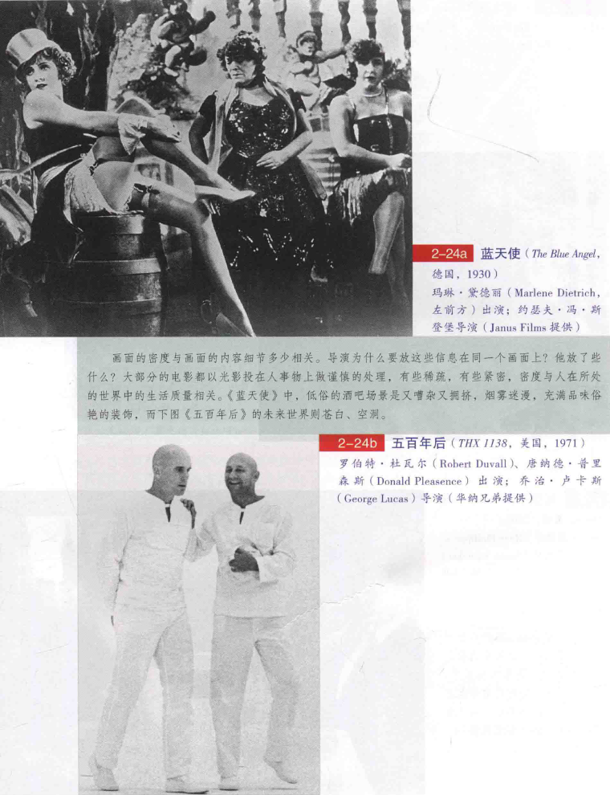
  * 虽然均是一男一女的对话，但每一景都以**不同的距离**，暗指**不同的基调**；《**街头嘻哈克**》的亲密距离充满**情色活力**，角色几乎是脸贴着脸；《**情归新泽西**》的两个主角虽然**互相吸引**，但保持着**审慎的距离**，彼此尊重对方的空间
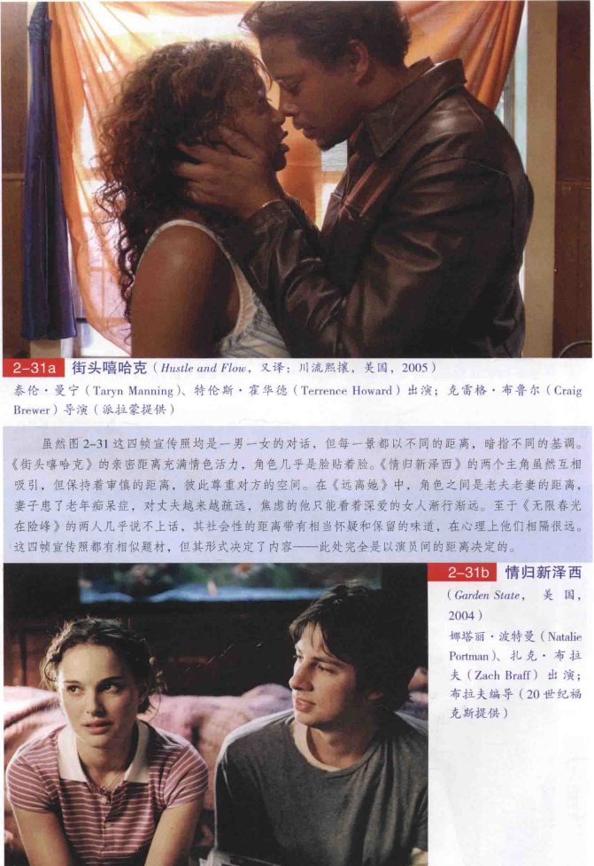
* 空间也可用做**复杂的心理变换**
  * 当一个人物离开画面时，镜头可以**稍移动**，比如用**横摇**（panning）来调整空白空间造成的**不平衡感**，亦可**静止不动**，捕捉画面的**失落感**
  * 强调两个角色的**敌意**时，我们可以将二人置放于**画面边缘**，中间隔着大的空间，或者让一个角色**侵入**另一个的空间
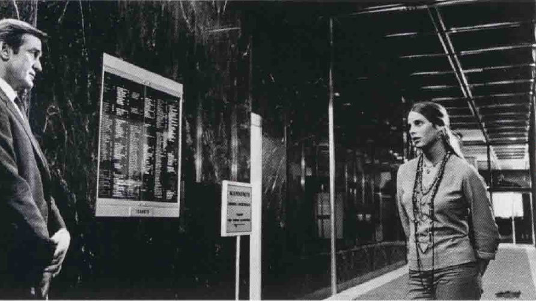
    * 一个青少年面对他崇拜、景仰、挚爱的父亲，但他父亲向家里及社区撒谎，冒充另一个人；这个对立是空间也是语言的，青少年入侵了父亲的私人空间，强烈要求父亲披露过去的真相
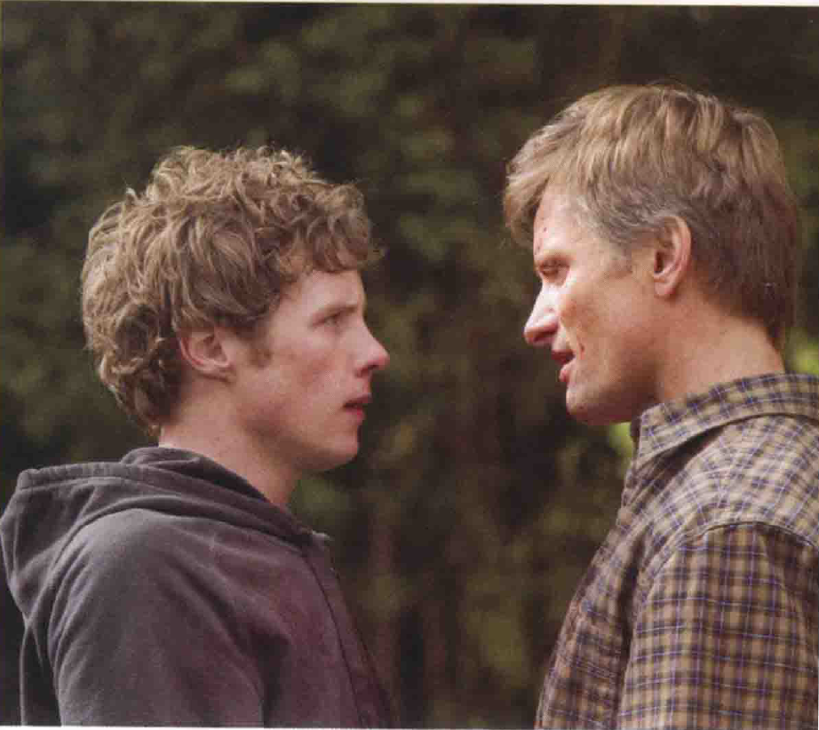
