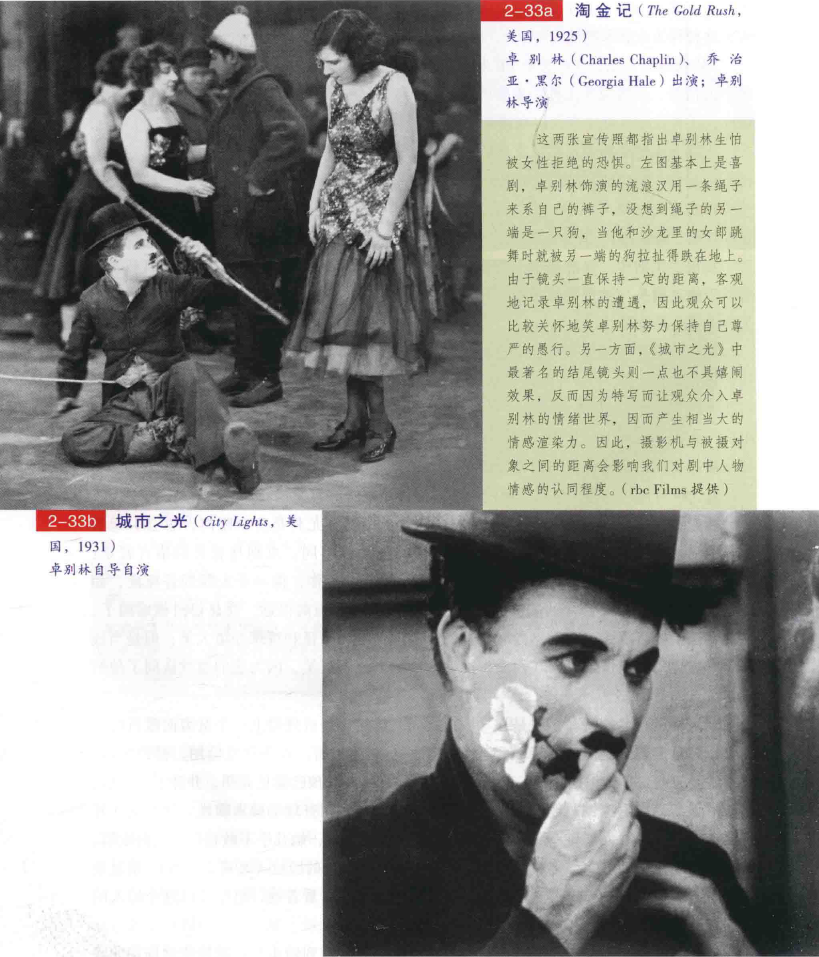

# 场面调度（3）
## 距离关系
* 空间的传统在不同的文化有着不同的意义
  * 人类学家**爱德华·霍尔**（Edward T. Hall）在他的著作《隐藏的维度》（The Hidden Dimension）及《无声的语言》（The Silence Language）中亦提及，**距离关系**（proxemic patterns）——在固定空间内的有机关系可以因外在环境，如天气、噪音及光线而改变人的空间距离关系
  * **盎格鲁一撒克逊**和**北欧文化**比**热带地区**的文化用的空间大些，而噪音、危险、黑暗均会使人相互接近
* 霍尔将人类使用距离的关系分**为四种**：（1）**亲密的**（intimate），（2）**个人的**（personal），（3）**社会的**（social），（4）**公众的**（public）
  * 霍尔以距人的皮肤**46厘米左右**远称之为“**亲密距离**”，这种距离有人与人间身体的**爱、安慰和温柔**关系；这个距离若被陌生人侵入，则会引起**怀疑或敌意**的反应，在许多文化里，亲密距离关系若在公众场合表现，会被认为**失仪而粗鲁**
  * “**个人距离**”大概是**46厘米至1.2米**的距离（约手臂长），个人彼此间碰触得到，较适合**朋友与相识之人**，却不似**爱人或家人**那般亲密；这种距离保持了**隐私权**，却不像亲密距离那样**排斥他人**
  * “**社会距离**”约为**1.2米至3.6米**，这通常是非私人间的公事距离，或是社交场合的距离，正式而友善，多半是**三人以上的场合**；如果两个人的场合保持这种距离就很不礼貌，这种行为也表示**冷淡**
  * “**公众距离**”则是3.6米至7.6米或更远的距离，这个范围**疏远而正式**，若在其间呈现个人情绪，会被视为**无礼**；重要的**公众人物**通常会在公众距离出现，因为其空间涵盖较广，手势及嗓音都须夸大以利清楚表达
  * 当然，**社会因素**也支配距离观念；比如在很挤的**地铁**里，每个人都在**亲密距离之内**，但彼此的态度却是“公众的”，身体有接触，却互不交谈
* 在现实生活中，显然每个人都得遵守某些**空间距离**，但在电影中，这种距离观念也被用于描述**镜头与被摄物的关系**；虽然镜头不一定按以上距离呆板规划，但其距离远近是会暗示心理效果的
  * “**亲密距离**”比较接近**特写和大特写**：“**个人距离**”约是**中近景**；“**社会距离**”约在**中景和全景**距离内：而“**公众距离**”则在**远景和大远景**内
* 镜位的远近也限定了我们**与被摄物间的关系**
  * 特写通常是**亲密关系**，使我们关心、认同被访者；如果被访者是个恶人，再对他用特写，他似乎便侵犯到我们的亲密距离，使我们生出**憎恶情绪**
  * 摄影机离被摄物愈远，我们观众的态度就愈**中立**，尤其是公众距离，总会引起某种**疏离感**；相反的，越接近一个角色，**情绪感染力**越不同
    * 《假面》这场戏中几乎没有对白，伯格曼在此利用空间来传达他的意念——景框内的空间，以及被摄对象与镜头（即观众）之间的空间；图中女主角在医院的病房内看电视上的越战新闻（a），突然间，她看到画面转为和尚自焚抗议战争暴行，她躲到房间的角落（亦即景框边缘）（b），伯格曼立即剪到一个近景镜头，欲加强我们情绪的介入（c），女主角惊恐的反应更以大特写（d）传达出来，紧密地引领我们进入她的世界

  * **卓别林**著名的格言就是：“喜剧用远景，悲剧用特写”，像一个人踩到香蕉皮，如果是**近景**，我们会**关心他的安全**，不会觉得好笑，但若**距离很远**，就显得**滑稽嬉闹**了；卓别林是个中高手，当他用远景时，我们会为他的古灵精怪和荒谬处境大笑；但是当他突然切进特写凸显情绪时，我们会发现好玩的地方不再可笑，因为我们忽然认同了他的情感
    * 这两张宣传照都指出卓别林生怕被女性拒绝的恐惧；左图基本上是喜剧，由于镜头一直保持一定的距离，客观地记录卓别林的遭遇，因此观众可以比较关怀地笑卓别林努力保持自己尊严的愚行，另一方面，《城市之光》中最著名的结尾镜头则一点也不具嬉闹效果，反而因为特写而让观众介入卓别林的情绪世界，因而产生相当大的情感渲染力

* 镜头的选择会取决于**实际拍摄的考虑**
  * 导演会先考虑到镜头是否能传达这场戏的**戏剧动作**（dramatic action），假如这种距离关系的效果和接下来的戏相冲突，大部分的导演会选择后者，并由别的意义来达到情绪上的冲击；但镜头的选择也经常不依实际上的考虑，导演会有许多种选择来决定距离关系