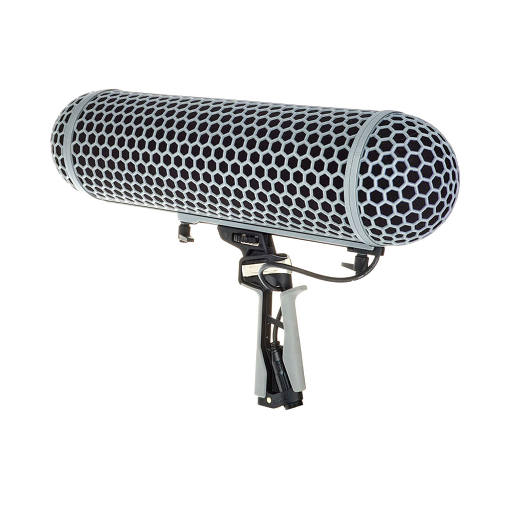
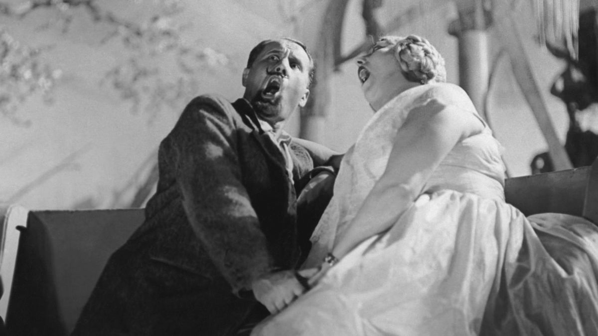
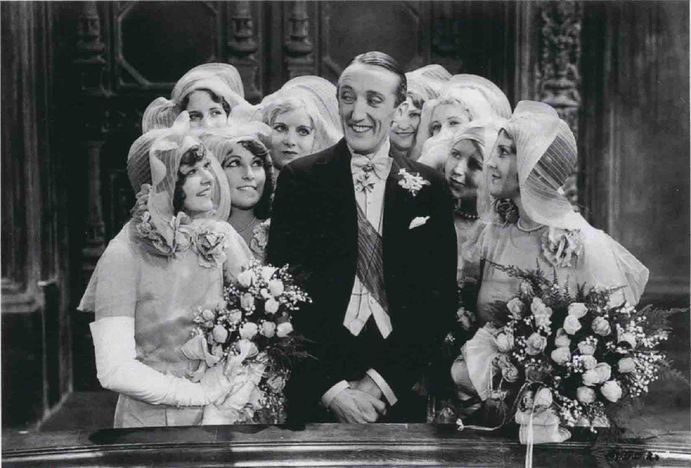
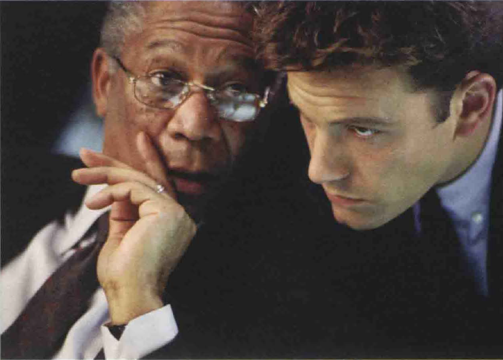
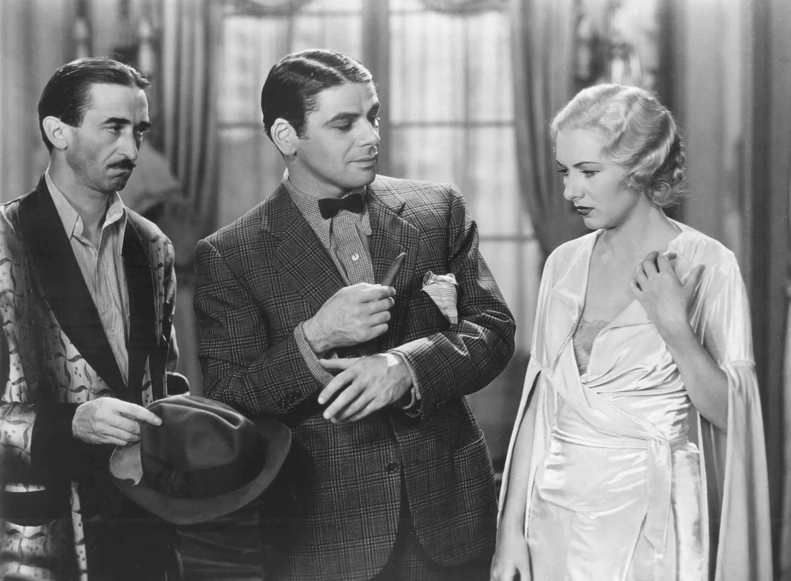
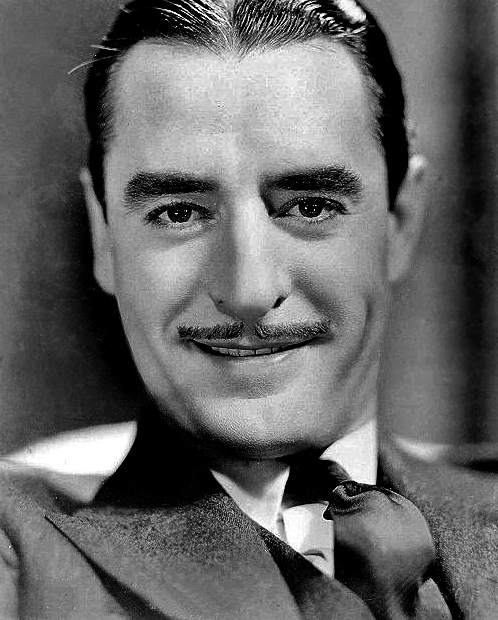
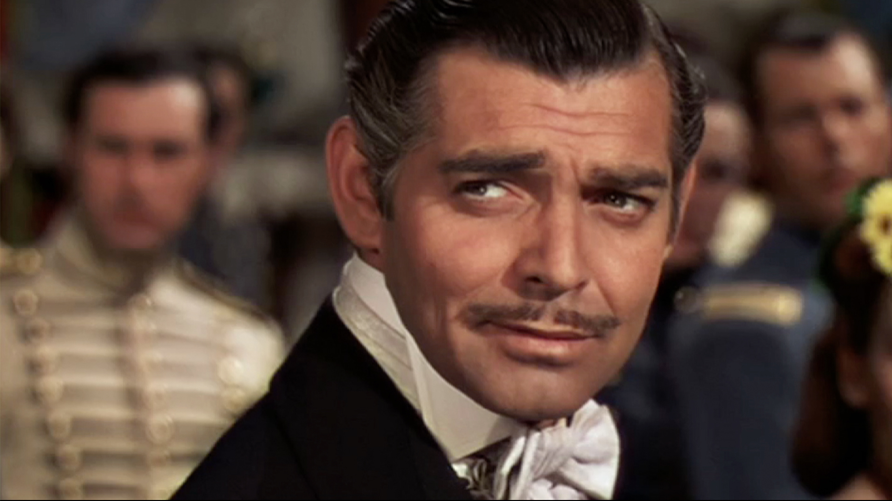
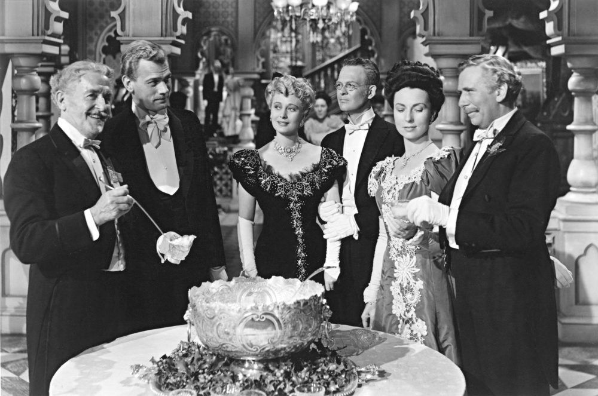
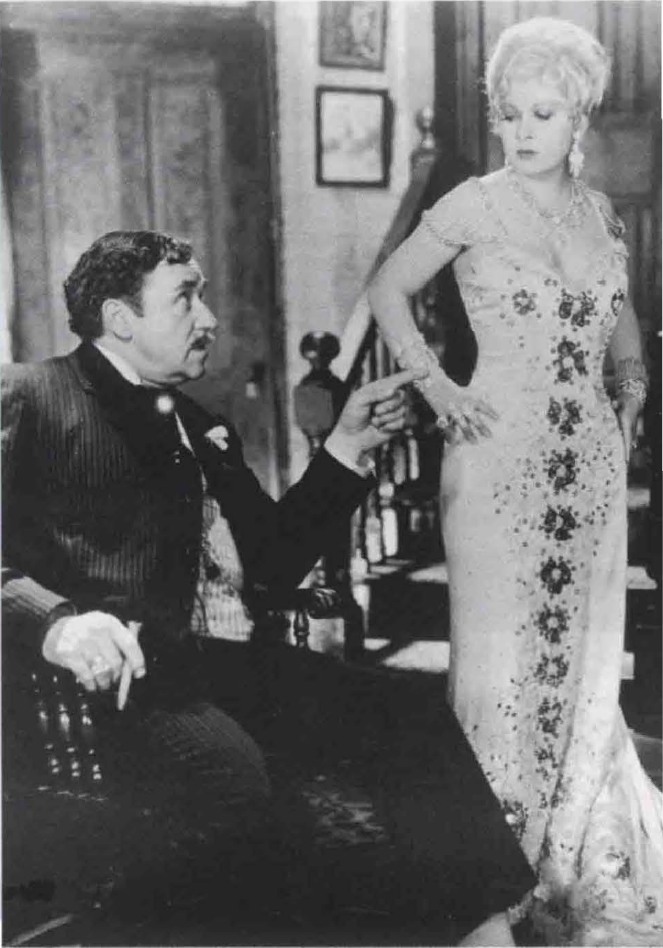

# 声音（1）
## 历史背景
* 1927年，《**爵士歌手**》使电影进入**有声**（talkie）时代，当时许多评论者担心声音会摧毁电影；但事实证明，**声音**是至今电影艺术意义最丰富的环节之一

  * 在这部影片之前其实已有一些**尝试同步发音**的影片，只是不像这部影片造成这么大的风潮，华纳兄弟公司以**歌舞片类型**做了开端；事实上，这部影片大部分还是**无声**．只有乔尔森唱歌以及一些对白部分才是同步发音
  * 即使在1927年以前，电影也很少完全无声的，电影院有**现场音乐**伴奏，既能提供情绪效果，又可遮掩观众嘈杂声，尤其是在进场的时候；小的电影院或用风琴、钢琴，大都市的电影院甚至有**管弦乐团**伴奏
  * 大部分早期号称“百分之百有声片”的影像都非常乏味；当时，拍片设备必须**同步**（synchronous）记录**声音与影像**，摄影机被限制在某小块地区，演员也不敢离麦克风太远而随意走动，剪辑更回到最原始的功用——连接场景与场景
  * 不久，富冒险性的导演开始尝试新设备，**隔音罩**（blimp）出现了，摄影机终于可以自在无声地四处移动；不久，录音人员又发现可用**不止一个麦克风**录音，**杆式麦克风**（boom）更能随着演员自由走动

* 声音虽然有以上这些优点，**形式主义**导演却一直对写实（同步）的声音有敌意
  * **爱森斯坦**尤其憎恶对白，他预言同步声音会使电影退回其**舞台剧**的原点，认为其摧毁了**剪辑的弹性**，也扼杀了电影艺术
  * 至今，**希区柯克**仍相信，最电影化的场景是**默片**——比如说追逐戏，只需要一点点**声效连续性**即可
* 有声片初期的优秀导演较喜欢用**非同步**(non synchronous) 配音
  * 法国导演**雷内·克莱尔**（Rene Clair）与俄国导演一样赞成不可毫无节制地选用声音；耳朵对声音有**选择性**，所以声音也应似影像一样选择性地剪辑，甚至对白也不必与影像同步
  * 克莱尔拍了许多音乐片来印证他的理论；例如在《**百万富翁**》(Le Million) 中，**音乐和歌曲**总是取代对白，语言和非同步的影像并列，许多场面以**无声拍摄**，等蒙太奇段落完成之后再加以**配音**

  * 美国早期的导演也尝试做声音实验，如克莱尔一样，**刘别谦**即用**音画不同步**的技巧制造很多机智讽刺的对比
  * 像歌舞片《**蒙特卡罗**》中，女主角（**珍妮特·麦克唐纳**【Jeanelle MacDonald】饰）乐观地欢唱时，刘别谦在技巧上尝试了新的表现手法。他在女主角所乘的火车高速行驶的镜头中，切入急速转动的车轮特写，并以音乐中的切分法捆入火车行进时的喷气声、轧轧声及汽笛声

* 声音上愈来愈写实也使**演出风格更自然**，演员不再因无法对话而在视觉上做些补偿；电影演员就如舞台演员一般，可以用声音来传达意义上的细微差异
  * **摄影机的移动**也对电影演员有利；例如拍特写时，他只要低声喃喃自语，就可做得很**自然**，无须像舞台演员在台上喃喃自语时那样声音必须传遍全剧院

  * 有声时代开始后，已经是全球速度最快的美国片**节奏**就更快了；20世纪30年代的大师**霍克斯**和**卡普拉**都要求说对白时比平常快30%-40%，**黑帮电影**这种令人喘不过气的急迫感更是有效，使之在经济恐慌时代特别受欢迎

  * 在默片中，导演得用**字幕**来传达**非视觉性的信息**：对白、解说、抽象概念，等等；在某些影片中，这往往会破坏影像的韵律，例如德莱叶的《**圣女贞德受难记**》经常插入恼人的说明性字幕或对白字幕
  * 有声片的出现摧毁了许多默片时代的明星，如**约翰·吉尔伯特**，据说他因为**音调太高**所以不能演出有声片；不过原因当然比这复杂，默片明星的演技通常较**风格化**，为了弥补无声而夸大肢体动作，即使以默片的标准而言，吉尔伯特也是有名的表情丰富，动作突出

  * 有声片带来新的纪元及一群新演员，男主角如**克拉克·盖博**（Clark Gable）在镜头前的从容自若．显然更适合有声片的**新写实要求**
  * 
* 进入**收音机时代**后，**奥逊·威尔斯**是重要人物；他的《安倍逊大族》（The Magnificent Ambersons）更将声音**蒙太奇精致化**，不同类主角的对话采取**相叠**的方式，语言本身的意义远不及声音引起的情绪效果
  * 《安倍逊大族》中有一场**舞会戏**的处理就相当令人折服：画面采用**深焦摄影**及**表现主义式的灯光方式**，不同组的主角说话**互相叠映**，造成难忘的**诗化效果**；不同的人有**不同的说话方式**，中年的一对说话小声、缓慢而亲密，年轻的一对却快速而大声，家族的其他成员又不断打断他们的谈话；整段戏在视听方面都细心地安排结构：**背光的黑影**如优雅的幽灵滑进滑出景框，声音也像在空中飘荡回响

  * **语调**比文字更能传达**人物的想法**，这是影痴们喜欢外国片以**原声**出现的原因，如**梅·蕙丝**的性感通常是由她的声调而来；也因此电检人员坚持察看她出现的镜头，惟恐一句平白无奇的台词会被她以“猥亵”的方式演出，事实上当时的美国民众疯狂地迷恋她**无礼和机灵的俏皮话**
