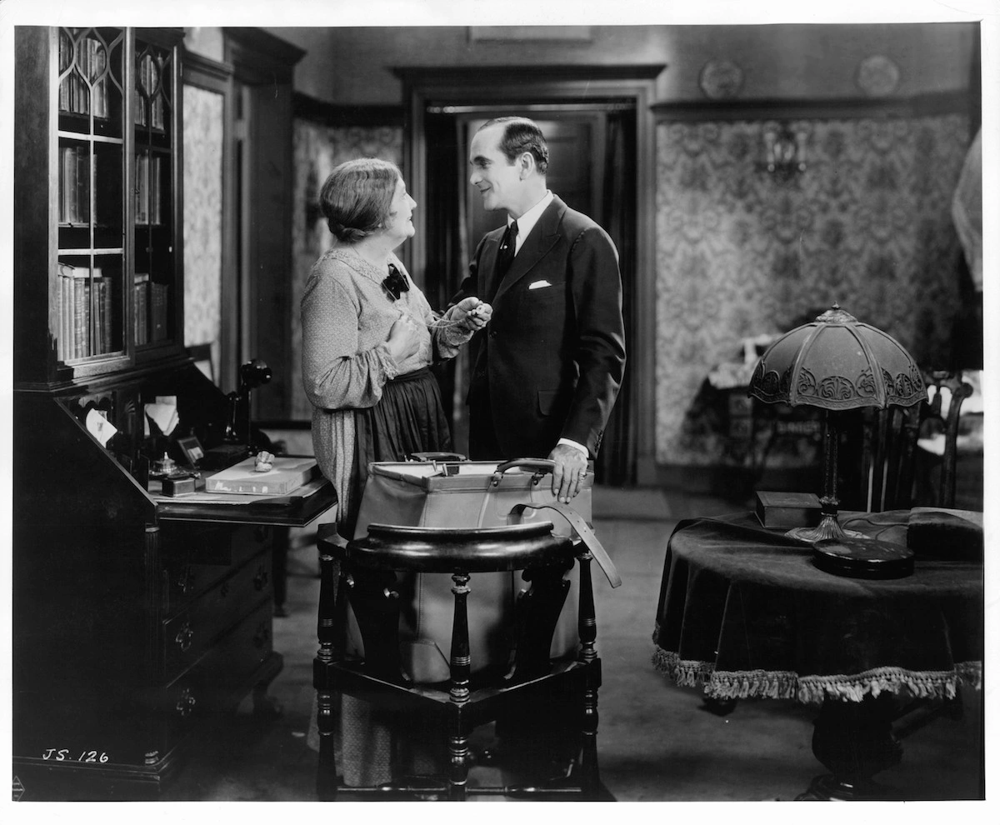

# 声音（1）
## 历史背景
* 1927年，《**爵士歌手**》使电影进入**有声**（talkie）时代，当时许多评论者担心声音会摧毁电影；但事实证明，**声音**是至今电影艺术意义最丰富的环节之一

  * 在这部影片之前其实已有一些**尝试同步发音**的影片，只是不像这部影片造成这么大的风潮，华纳兄弟公司以**歌舞片类型**做了开端；事实上，这部影片大部分还是**无声**．只有乔尔森唱歌以及一些对白部分才是同步发音
  * 即使在1927年以前，电影也很少完全无声的，电影院有**现场音乐**伴奏，既能提供情绪效果，又可遮掩观众嘈杂声，尤其是在进场的时候；小的电影院或用风琴、钢琴，大都市的电影院甚至有**管弦乐团**伴奏
  * 大部分早期号称“百分之百有声片”的影像都非常乏味；当时，拍片设备必须**同步**（synchronous）记录**声音与影像**，摄影机被限制在某小块地区，演员也不敢离麦克风太远而随意走动，剪辑更回到最原始的功用——连接场景与场景
  * 不久，富冒险性的导演开始尝试新设备，**隔音罩**（blimp）出现了，摄影机终于可以自在无声地四处移动；不久，录音人员又发现可用**不止一个麦克风**录音，**杆式麦克风**（boom）更能随着演员自由走动

* 声音虽然有以上这些优点，**形式主义**导演却一直对写实（同步）的声音有敌意
  * **爱森斯坦**尤其憎恶对白，他预言同步声音会使电影退回其**舞台剧**的原点，认为其摧毁了**剪辑的弹性**，也扼杀了电影艺术
  * 至今，**希区柯克**仍相信，最电影化的场景是**默片**——比如说追逐戏，只需要一点点**声效连续性**即可
* 有声片初期的优秀导演较喜欢用**非同步**(non synchronous) 配音
  * 法国导演**雷内·克莱尔**（Rene Clair）与俄国导演一样赞成不可毫无节制地选用声音；耳朵对声音有**选择性**，所以声音也应似影像一样选择性地剪辑，甚至对白也不必与影像同步
  * 克莱尔拍了许多音乐片来印证他的理论；例如在《**百万富翁**》(Le Million) 中，**音乐和歌曲**总是取代对白，语言和非同步的影像并列，许多场面以**无声拍摄**，等蒙太奇段落完成之后再加以**配音**

  * 美国早期的导演也尝试做声音实验，如克莱尔一样，**刘别谦**即用**音画不同步**的技巧制造很多机智讽刺的对比
  * 像歌舞片《**蒙特卡罗**》中，女主角（**珍妮特·麦克唐纳**【Jeanelle MacDonald】饰）乐观地欢唱时，刘别谦在技巧上尝试了新的表现手法。他在女主角所乘的火车高速行驶的镜头中，切入急速转动的车轮特写，并以音乐中的切分法捆入火车行进时的喷气声、轧轧声及汽笛声

* 声音上愈来愈写实也使**演出风格更自然**，演员不再因无法对话而在视觉上做些补偿；电影演员就如舞台演员一般，可以用声音来传达意义上的细微差异
  * **摄影机的移动**也对电影演员有利；例如拍特写时，他只要低声喃喃自语，就可做得很**自然**，无须像舞台演员在台上喃喃自语时那样声音必须传遍全剧院

  * 有声时代开始后，已经是全球速度最快的美国片**节奏**就更快了；20世纪30年代的大师**霍克斯**和**卡普拉**都要求说对白时比平常快30%-40%，**黑帮电影**这种令人喘不过气的急迫感更是有效，使之在经济恐慌时代特别受欢迎

  * 在默片中，导演得用**字幕**来传达**非视觉性的信息**：对白、解说、抽象概念，等等；在某些影片中，这往往会破坏影像的韵律，例如德莱叶的《**圣女贞德受难记**》经常插入恼人的说明性字幕或对白字幕
  * 有声片的出现摧毁了许多默片时代的明星，如**约翰·吉尔伯特**，据说他因为**音调太高**所以不能演出有声片；不过原因当然比这复杂，默片明星的演技通常较**风格化**，为了弥补无声而夸大肢体动作，即使以默片的标准而言，吉尔伯特也是有名的表情丰富，动作突出

  * 有声片带来新的纪元及一群新演员，男主角如**克拉克·盖博**（Clark Gable）在镜头前的从容自若．显然更适合有声片的**新写实要求**
  * 
* 进入**收音机时代**后，**奥逊·威尔斯**是重要人物；他的《安倍逊大族》（The Magnificent Ambersons）更将声音**蒙太奇精致化**，不同类主角的对话采取**相叠**的方式，语言本身的意义远不及声音引起的情绪效果
  * 《安倍逊大族》中有一场**舞会戏**的处理就相当令人折服：画面采用**深焦摄影**及**表现主义式的灯光方式**，不同组的主角说话**互相叠映**，造成难忘的**诗化效果**；不同的人有**不同的说话方式**，中年的一对说话小声、缓慢而亲密，年轻的一对却快速而大声，家族的其他成员又不断打断他们的谈话；整段戏在视听方面都细心地安排结构：**背光的黑影**如优雅的幽灵滑进滑出景框，声音也像在空中飘荡回响

  * **语调**比文字更能传达**人物的想法**，这是影痴们喜欢外国片以**原声**出现的原因，如**梅·蕙丝**的性感通常是由她的声调而来；也因此电检人员坚持察看她出现的镜头，惟恐一句平白无奇的台词会被她以“猥亵”的方式演出，事实上当时的美国民众疯狂地迷恋她**无礼和机灵的俏皮话**

## 音效
* 尽管音效的功能主要是**制造气氛**，但也可以成为电影**细微意义的来源**
  * 电影的声音是**混合而成**的：**多重音源**在**录音室**中混音，而非实地录制，大部分电影的声音甚至在拍摄时**还没产生**；这些声音经常和银幕上的对应物**毫不相干**
  * 比如，在《**终结者2**》（Terminator 2：Judgment Day）中，刀刃划过一名保安人员的头颅所发出的嘎吱声，其实是小狗咬狗饼干的录音

* **音效剪辑师**为一部电影收集**各种不同的声音**，其中大多数是预录并储存在**音效库**中，诸如打雷闪电、门扇吱吱声、狂风怒吼等等
  * 好莱坞最普遍的**音效设计原则**就是“看到狗，就听到狗吠”，也就是说，当银幕上出现一只狗，观众就会听到传统中有关于狗的声音如狗链的当当声或狗吠
  * 接着混音师会决定**每个声音的大小**，以及从**哪个音轨**或以**立体声**出现；大多数电影院配置**五个喇叭**，分别是中间、左前方、右前方、左后方和右后
  * **杜比音响**在20 世纪90年代日趋完善，拥有**六至七个分离式喇叭**
* 论者将银幕上的声音分为剧中人能听到的“**故事内的**"（diegetic，又译：叙境的）声音，若剧中人听不到的则为“**故事外的**"（nondiegetic，又译：非叙境的）声音
  * 最明显的对比就是**电影音乐**，如果剧中人听得到剧中的音乐，那就是“故事内的”，反之就是“故事外的”
* 观众并非经常都能意识到**声音对他们的影响**．但他们其实一直受到**声音的操纵**
  * 例如《**益智游戏**》（Quiz Show）中，当主角享受名声时，老式照相机的闪光灯声音无害地响起；当主角失意时，同样的声音则带有侵略性，制造出令人提心吊胆、惊人的效果

  * 在《**精神病患者**》里，女主角**珍妮特·李**（Janet Leigh）在大雨滂沱中开着车，我们听到雨声中夹着雨刷划过车窗的声音；不久，她在汽车旅馆淋浴时，同样的音效又出现，直到凶手冲进浴室，我们才明了它预示着凶刀戳向女主角的声
* **音效**的声调、音量、节奏均能强烈影响我们的反应
  * **高调**会使听者产生**张力感**，尤其当该声效又延长，其尖锐的刺耳感会令人焦躁不安；因此，这在**悬疑场面**，特别是**高潮前或高潮中**都十分管用
  * **低频率声音**则较厚重，不紧张，常用来强调**庄严、肃穆**的场景，例如《**七武士**》末尾的男性合音；低音也暗示**神秘及焦虑**，悬疑场面也常利用其作为开始，再逐渐提高其音调
  * **音量**影响也差不多；**音量大**的感觉紧张、爆裂、威胁，而**音量小**则显示细致、迟疑和衰弱
  * 音量很大时，声音就变成了**武器**，用“吼”的而不用“说”的对白成了一种**攻击**；《**发条橙**》中从头到尾其邪恶的主角（麦克道尔饰）都像绑着铁链的猛犬，朝他的敌人咆哮嘶喊，让他们在他的侵略恐惧中忐忑不安

  * 声音通常显露出**空间的大小**，如果声音与空间**不统一**，效果会令人害怕困扰；《**驱魔人**》中，恶魔占据了女孩的身体．小女孩的声音又大又有回声，制造出令人毛骨悚然的**战栗效果**，宛如小女孩小小的身躯暴长了数千倍，被许多恶魔所占据

  * **节奏**也一样，越快越令人紧张，例如**弗里德金**的《**法国贩毒网**》中，追逐戏就精彩地运用了这项原则；在追逐戏渐渐趋近高潮时，汽车的轮子吱声与地铁的轰隆声都渐大、渐快、渐尖锐

* **画外音**也能使观众想象**景框外的空间**
  * **声效**能在悬疑及惊悚片中制造**恐怖效果**；我们对看不见的东西总是特别害怕，导演有时就用画外音制造**焦虑的效果**
  * 鬼片、惊悚悬疑片以及超自然电影类型里，**画外音**（off-screen sound）常常会制造躲在画面外的恐怖效果；《**小岛惊魂**》这部可怕的心理惊悚片中．阿梅纳瓦尔就将恐惧的来源一直放在景框外．用景框外的声音来吓我们，强迫我们和那个企图保护子女且被吓坏了的母亲住在孤独的维多利亚式大宅里；此片充分说明杜比音响使用多重声源，分隔出不同区域的声音．所谓“**多普勒效应**”（Doppler effect）的作用使奇怪的声音自不同影像中跳出，经常来自戏院后方喇叭，提供环绕观众和角色的惊骇感觉

* 声效的**象征意义**也可以很明显，通常是由**戏剧性的文本**来决定
  * **伯格曼**的《**野草苺**》（Wild Strawberries）中，老教授做噩梦，在**超现实**（surrealistic）的环境中，一切**寂静无声**，惟有心跳提醒老教授时日无多
* 自20世纪60年代以来，许多导演为了更写实而保留声带上的杂音，他们受**真实电影**（cinema verite）中**纪录片学派**的影响，往往**避免过滤杂音**
  * 如在《**男性——女性**》（Masculine-Feminine）中，戈达尔在声音上用得非常大胆，他坚持用**自然的杂音**（全是在拍片现场录下的），吓坏许多影评人，他们称其为“刺耳的聒噪声”
  * **电影的最后一场戏**通常是最重要的，它往往代表**导演的结论**；在**埃尔曼诺·奥尔米**（Ermanno Olmi）的《**工作**》（Il Posto）中，他以**嘲讽的音效**削减了“快乐结局”的效果
    * 电影叙述一个害羞的蓝领青年为了得到城市里低下的店员工作而奋斗，最后终千成功，男孩非常高兴能有一个稳定的工作为生；片尾呈现一幅单调乏味的诡谲画面：男孩受感动的脸部特写配上单调却越来越大的油印机声

* 音效也可表达**内在情感**
  * 例如**罗伯特·雷德福**（Robert Redford）的《**凡夫俗子**》（Ordinary People）中，忧心忡忡的母亲替情绪不稳的儿子准备法国吐司，虽然那是他最喜欢的早餐，但他因太紧张而吃不下，他和母亲之间的矛盾是主要问题；母亲因不满儿子的冷漠，一把抓起碗盘丢进水槽中，把吐司塞到垃圾桶里，这些声音是她激动生气的象征

  * 黑泽明是声音的大师，在《**乱**》这部改编自莎剧《李尔王》的作品中，和图中复仇心重的阴森角色**枫夫人**比起来，麦克白夫人反而显得有如《欢乐满人间》里的仙女保姆玛丽·波平斯般慈爱；枫夫人即透过**有力的声音**制造出**阴森的性格**，尤其是当她穿着的丝绸衣服在平滑的地板上滑行而过发出声时，有如眼镜蛇准备作出致命一击一样令人不寒而栗

  * 《**不朽的园丁**》中，**费因斯**饰演的英国外交官悲伤于妻子的残酷死亡，他如所有外交官一样擅于**隐藏情感**，但他的忧伤由**诗化的雨声**暗示及笼罩．仿佛天公也为他悲泣；费因斯是英国最优秀的演员之一．银幕与井台上一样出色．能模仿多种口音．也适合多种时代背景

* **完全寂静**也有其作用；它给人的感觉是**真空**，好像有什么事要发生，要爆发似的
  * **阿瑟·佩恩**的《**邦妮和克莱德**》即有此技法；男女主角下车帮助朋友（其实是线民）修车，他迅速钻入车底，然后有长时间的寂静，男女主角焦虑困惑地对望着，突然，机关枪声四处扬起，躲在草丛里的警察用乱枪解决了两人
  * 和**定格**一样，在有声片中**突然的无声**也常象征**死亡**，因为我们常将声音与活的世界联结

  * 像黑泽明的《**生之欲**》（Ikiru），男主角知道自已被诊断为绝症后，走出医院大门，四周一切无声，当他差点被疾行的卡车撞倒，四周车水马龙的嘈杂声才把他拉回真实的世界
