# 声音（2）
## 音乐
* 音乐是相当抽象、纯粹的形式，要务实地谈音乐的“题材”，有时是相当困难的事
  * 有**歌词**时．音乐本身的意义就比较**明晰**；歌词和音乐本身固然都能**传达意义**，但**方式不同**
  * 无论有没有歌词，**音乐与影像配合**时，意义就更容易传达
* 电影音乐的理论**变化很大**
  * **爱森斯坦**和**普多夫金**坚持音乐应有自己的意义和尊严，影评人**保罗·罗沙**（Paul Rotha）甚至认为有时候音乐应**主导影像**
  * 某些导演坚持**纯粹说明式**的音乐——如**米老鼠配乐**（mickey mousing，因迪斯尼早期动画的配乐而得名）；这种配乐法使音乐和影像**完全相等**
* 导演不见得要对音乐内行，就如**艾伦·科普兰**（Aaron Copland）所言，他只要认清所需的**戏剧性**，然后就由音乐家来将戏剧性溶入音乐中
  * 导演和音乐家合作的关系不一而足，有的音乐家是看了**粗剪**（rough cut，初剪）后就开始工作，有的则坚持看完**细剪**再作曲
  * 作曲家不一定需要迁就导演；在《**亚历山大·涅夫斯基**》中两位苏联艺术家合作无间，由此图可看出音乐如何与画面构图（士兵的动作）搭配
    * **普罗科菲耶夫**反对纯粹的音乐表现（如米老鼠配乐），有时他以视觉为主，有时以音乐为主．结果是呈现爱森斯坦所称的＂**垂直蒙太奇**”，五线谱上的音符如果由左至右移动，则画面内的动作也是一样由左自右，而如果影像线条由左下往右上移时，音符也如此配合，如果影像扭曲动作，音符也随着不平地跳动

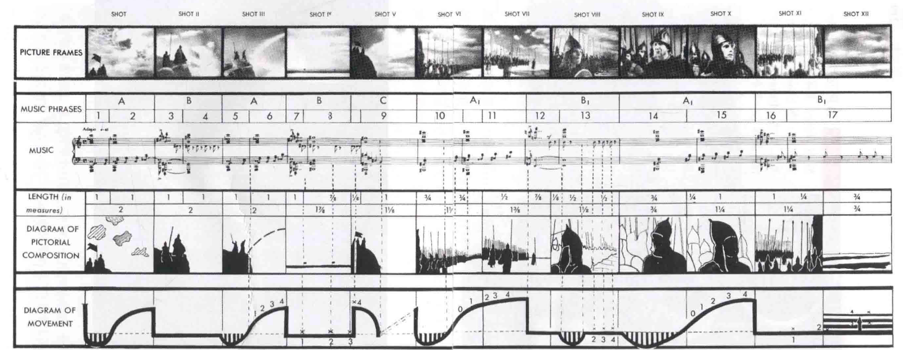
  * 大部分**歌舞片**的导演都是**尚未开镜前**就开始与音乐家合作；片中歌曲经常都是事先在录音间录好，之后由表演者在舞蹈时**对嘴**
* 音乐的作用很多，在电影字幕升起时的音乐就宛如**序曲**，能代表电影**整体的精神和气氛**
  * **约翰·艾迪生**（John Addison）在《**汤姆·琼斯**》开头的音乐就颇**诙谐**，是以18世纪盛行的**大键琴**演奏的，大键琴即点出影片的背景在18世纪，偶尔插入的**爵士乐**则暗示影片拍摄时的20世纪
* 电影的**节奏**常会经由配乐产生
  * 《**周末夜狂热**》这部由**巴德姆**导演的著名歌舞片中．用了**比吉斯**令人振奋的迪斯科乐曲"Staying Alive"作为场面和剪辑的节奏；他说：“每次我们拍一个镜头，我们就放那首曲子，所以所有银幕上的状态都和那首曲子的节奏一样”

* 有些音乐能暗示**环境、阶级**或是**种族团体**
  * 比如**约翰·福特**的西部片擅用简单的民谣，如《**红河谷**》（"Red River Valley”），或19世纪西部开拓时代的宗教赞歌如《**聚集生命河畔**》（"Shall We Gather at the River”），这些带有浓厚乡愁意味的歌曲通常以**开拓者的乐器**演奏（如哀伤的口琴或某种手风琴）
  * **意大利电影**也运用抒情、情绪丰富的曲调来反映这个国家的**歌剧传统**，尤其以**尼诺·罗塔**（Nino Rota）的作品最具代表性，如泽菲雷利的《**殉情记**》和科波拉的《**教父**》一、二集
  * 《**为所应为**》背景在布鲁克林区的非裔美国人区里，故事是关于黑人小区与意大利裔披萨店老板之间的冲突；两个**族群的特色**除了生活形态之外，还以音乐表现出来，黑人听灵魂、福音歌曲及饶舌音乐，而意大利人则听弗兰克·辛纳屈的民谣歌曲
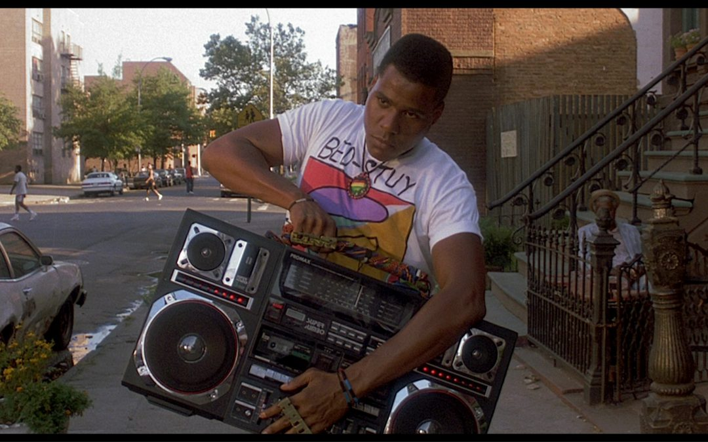
  * **摇滚乐**之部分魅力来自对传统道德和中产妥协的反抗；《**摇滚学校**》片中主角想当摇滚歌星，却在私校任代课老师，他教学生“摇滚让你解脱”的观念．要他们听Ramones、Led Zepplin、The Who等乐队的音乐
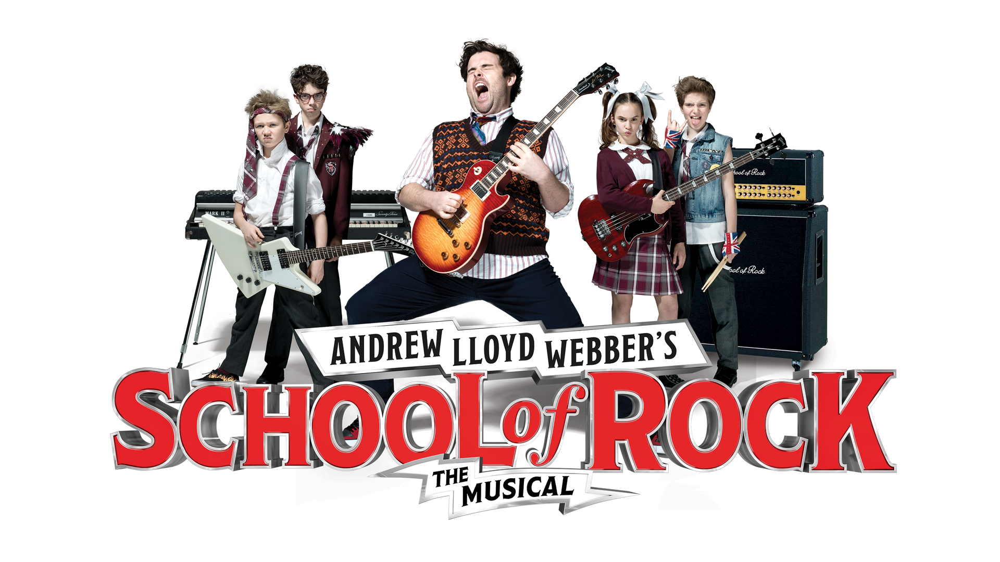
  * 音乐亦可用来预示**即将发生的事**，让导演能事先给观众警告（如希区柯克的作品），通常都配上带“**焦虑性**”的音乐，有时它只是虚惊一场，有时却爆发为一个高潮
  * 有时角色得约束或隐藏情感，音乐也常能暗示他们的**内心状况**；**伯纳德·赫尔曼**（Bernarrl Herrmann）为《**精神病患者**》所作的配乐，就不乏这类手法

* 音乐也能使主导的**情绪中立**或造成**相反的效果**
  * 《**邦妮和克莱德**》的抢劫戏却配以**乡村式的五弦琴音乐**，使场面变得**轻松有趣**
  * **乔恩·布里翁**（Jon Brion）为**保罗·托马斯·安德森**（Paul Thomas Anderson）导演的《**爱情鸡尾酒**》（Punch-Drunk Love）所作的略带神经质的配乐，就经常在平静的背景下传达激动的情绪

* **音乐母题**有时用来代表**角色的个性**
  * 在费里尼的《**大路**》中，忧伤而简单的小喇叭旋律，正与女主角（**朱丽叶塔·玛西娜**饰）的单纯不谋而合
  * 角色塑造的音乐配上**歌词**就更明白；在《**最后一场电影**》中，20世纪50年代的歌曲分别与各个主角相联，当放荡的杰姬（**西碧尔·谢泼德**饰）接受男友（**杰夫·布里奇斯**饰）时，女孩配上《**冷冷的心**》（"Cold，Cold Heart”），男孩则配上《**傻瓜如我**》（“A Fool Such as I”）
* **库布里克**用音乐的大胆是最受争议的
  * 在《**奇爱博士**》（Dr.Strangelove）中，他讽刺地将**薇拉·林恩**（Vera Lynn）感伤的第二次世界大战歌曲《**相逢有日**》（“We‘ll Meet Again”）配上核战浩劫后的影像——冷酷地提醒我们第三次世界大战后恐怕是无法再相逢
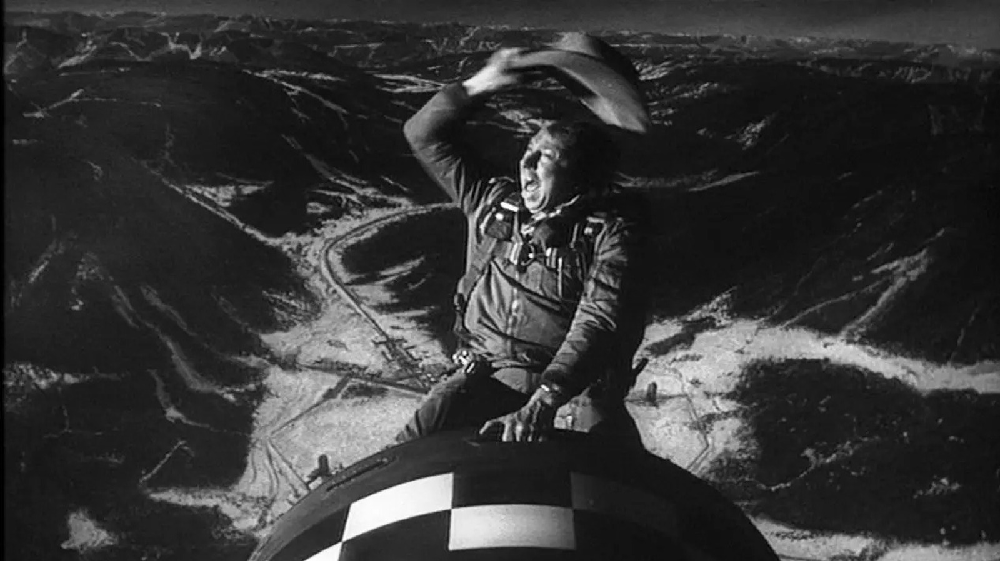
  * 在《**2001太空漫游**》中21世纪的宇宙飞船在无边太空中滑行时，音乐却是19世纪施特劳斯的《**蓝色多瑙河**》，象征着人类的微薄科技在浩翰宇宙中的命运

  * 《**发条橙**》里，音乐象征一切事物，特别是暴力场面，当帮派械斗时，配上罗西尼（Gioacohino Rossini）温文而诙谐的《**鹊贼**》（The Thieving Magpie）序曲，削弱了真实感；在残暴的强奸场面，配的却是甜美的《**雨中曲**》主题曲《**在雨中歌唱**》（"Singin’ in the Rain”）
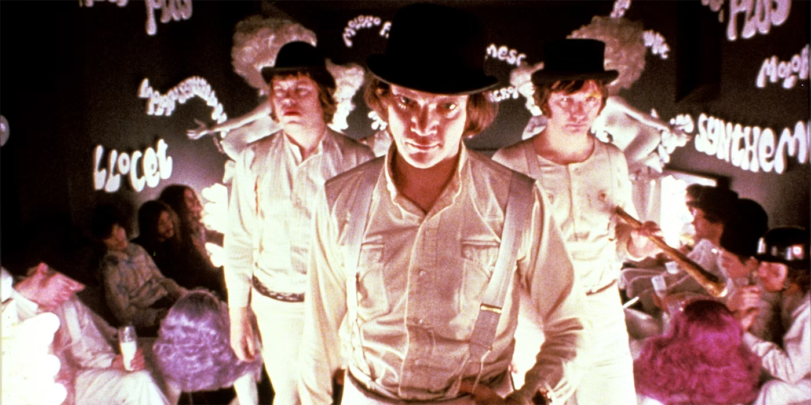
  * 科波拉在《**现代启示录**》这部具有超现实氛围的越战史诗片中显露他大师的技法：声音的混音充满**怪异的嘲讽**
    * 这段影片中，美军直升机在天空盘旋呼啸如同机器上帝，配合**瓦格纳**的音乐《**女武神**》（"Ride of the Valkyries"）向越南丛林丢炸弹，此时音效部分还加上雷声；当丛林内的村落居民纷纷寻找掩护时，美军却在火药味四溢的战火中准备趁浪高冲浪
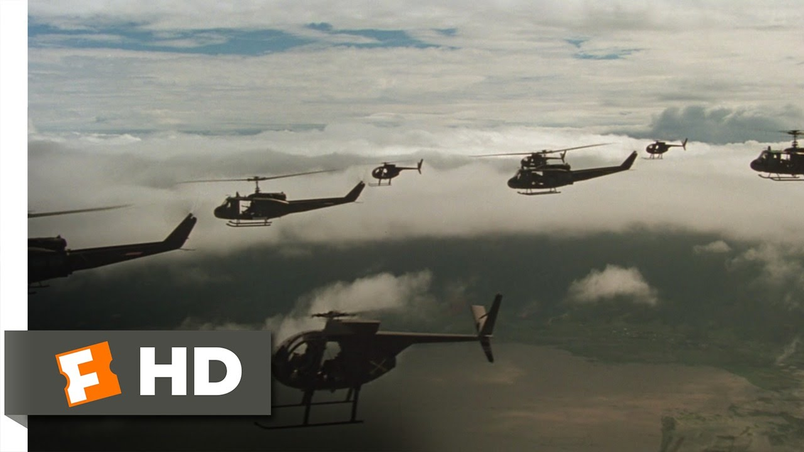
* 音乐一般被认为是用来**补救**低劣的对白及贫乏的表演，但有的电影却能将音乐与对白做最好的配合
  * 比如说，奥利弗《**哈姆雷特**》的作曲就用了精确无比的音乐，在王子独白“To be or not to be"时，音乐精巧的配合为奥利弗复杂的独白增加了若干层次
* 有些（非常少）电影**完全不用音乐**，赋予**沉重乏味**的效果
  * 《**四月三周两天**》中一名女学生想借助大学室友帮助非法堕胎，这是发生在20世纪80年代齐奥塞斯库统治下的罗马尼亚的故事，当时节育和堕胎都是违法的；电影无配乐，摄影风格平实无华，全片阴冷，焦灼也残酷
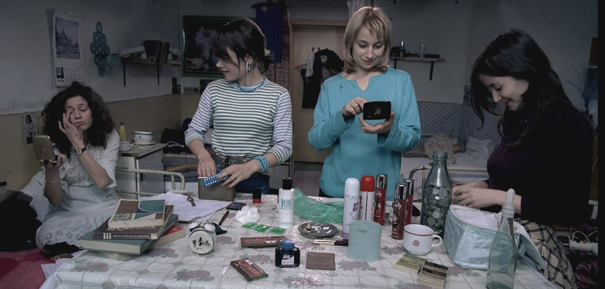
## 语言
* 电影的语言常会造成许多**误解**，很多人以为电影的对白不可能如文学那般含蓄、复杂；不过，**莎士比亚**搬上银幕就很成功——在语言和视觉上都**未被攻击**
  * 事实上很多重要导演的作品都不是很有文学性；这并不是说电影无法表现文学的特性，而是有些导演希望强调**其他观念**
* 从某些观点来看，电影的语言运用可以比文学**更复杂**
  * 首先，它与剧场一样是**口说**而非书写的形式，而表演的演员常能利用声音的**高低抑扬**甚至**断句**造成**不同的结果**
  * 口头语言**内涵之丰富**，绝非书写文字之**粗糙**可比；因此，"I will see him tomorrow"这句话字面的意思很明显，但如果强调某些字则会完全改变其意义
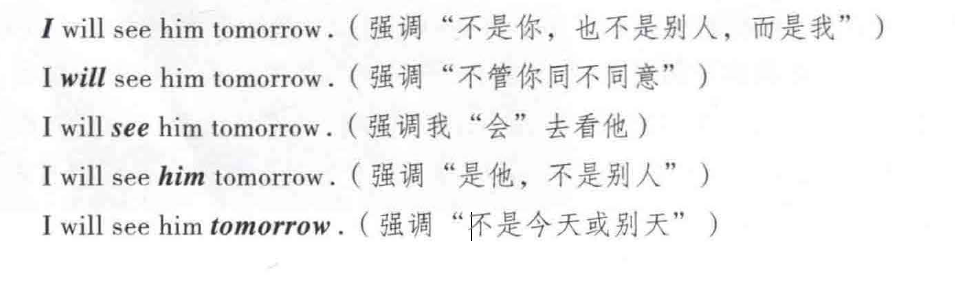
  * 小说家和诗人当然可以用**斜体字**来表达，但他们不像演员能在每句话中都做**强调**；换句话说，演员经常得视其语言而决定要强调哪个字，或哪个字得“丢弃”
* 书写上的**标点**同样是**口语韵律的简化**
  * 口语中停顿、迟疑及含糊的部分**只有一部分被标出**

  * 但是，如果没有标点，要怎么捕捉所有的意义呢？即使是专业的语言学家，也会用许多**发音记号**来记录语言，认清这些符号是最基本的步骤，虽然它们也只能捕捉人类微妙声音中的微小部分
* 一般说来，说话的方式如果偏离官方的规定，则被视为**不合标准**
  * 在电影中，方言包含了许多**丰富的意义**（在生活中也是）；因为方言通常流通于**低下阶级**，传达他们具有**颠覆性的意识形态**
  * 某些劳工阶级的摇滚乐队如**滚石**及**披头士**亦广用**伦敦口音**及**英国中部工业城**（如利物浦）的方言；而许多欧陆导演也常利用方言的多样性，尤其以**莉娜·韦特米勒**（Lina Werlmliller）最有名
    * 韦特米勒对**方言在意识形态上的寓意**最为敏感，她的多部喜剧作品便是针对意大利南方劳工阶级的方言词句与意大利北方官方话（T11，can，托斯卡纳语）的差异大做文章，制造不少笑料；然而在翻译时，粗鄙但有趣的文句都转变成无味的字眼，如“闪啦！“经常变成“走开啦！”或“请离我远一点”等温吞的说法
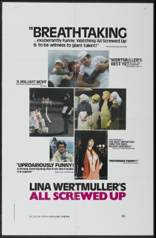
  * **南方口音**是美国话中最抒情的方言之一。也许是因力很多的优秀美国作家都来自南方；《**百万金臂**》由萨兰登所饰演的角色旁述（是个北卡罗来纳的英文教师），由于言谈之间充满天马行空、才思敏捷的言辞，常使片中的男主角惊异得无言以对

  * 语言往往在**意识形态**上十分明显，它可以立即透露出阶级、教育水平和文化偏见；大部分国家的地方性语言被使用**官方语言**、（统治阶级语言）的人视为次等，尤其英国，方言深深绑在**阶级系统**上，有权力的统治阶级讲的是体制语言，多半在那种训练统治阶层的私立学校里学来，另一方面，像《**猜火车**》主角所说的苏格兰工人阶级方言，很清楚地说明他们是没有权力和威严的．他们位卑人微，是局外人和低层人士，所以生活中尽是酒、吸毒和百无聊赖

  * 当扮演**古文**里的角色时，英语演员通常都采用“**泛大西洋**”口音，这种口音仅在银幕及电影中存在，是**没有任何地区口音**的英语，所有子音都得清楚发出，母音也有规定，任何一种英国、现代美国及澳大利亚的口音都得避免，而采取没有任何地区特色的**中性发音**
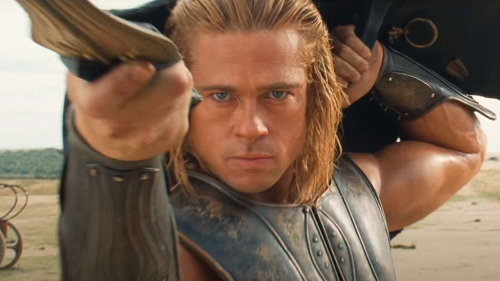
* 电影及剧场还享有书写文字欠缺的情绪、意念**次文本**（subtext，又译：潜台词）
  * 次文本能传达文字、剧本”背后”的**暗示**
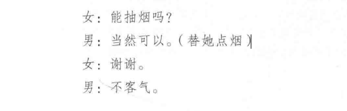
    * 单从字面看，这几句话并无特殊的情绪变化，但依戏剧文本，可暗示别的意念，不完全取决千字面的意思；假如这个女人想挑逗这个男人，她的语气会比上班女郎还冷淡，假如他们互相试探，则语气又不同了，如果这个男人想挑逗充满敌意的女人，又会有另一种说法
  * 任何被演出的剧本都有**次文本**，即使是**优秀的文学作品**
    * 泽菲雷利的《**殉情记**》就是最好的例子；在片中，**茂丘西奥**（Mercutio）是一个神经质的年轻人，对现实有一种**危险不稳定的认知**，这种与传统手法相左的诠释令许多专家不满，但在影片的上下文中，它加强了罗密欧与他的好友之间的同盟情谊，并说明了当提伯尔特杀了茂丘西奥后罗密欧冲动（且具自毁性）的报复行为
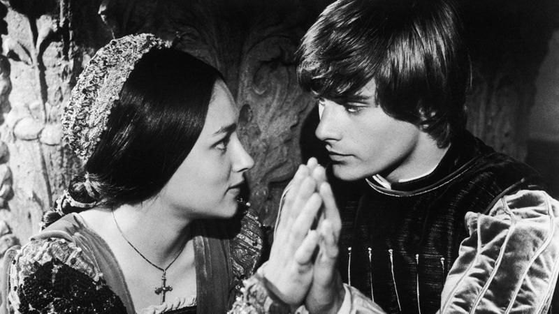
  * 某些现代电影工作者常故意**中立语言**，宣称**次文本**才是要追求的
    * 名剧作家哈罗德·品特最爱强调次文本意义，品特认为语言往往是“交叉”的，借以遮掩恐惧和焦虑；**次文本**的技巧配合**电影特写**，往往能比剧场更含蓄地传达字句后面**真正的意义**
* 电影与文学的搭配在语言上有许多优点——有很大一部分是由**剧场**而来
  * 电影是一种**并置的艺术**，可用**和影像对立的对白**来延伸语言的意义
  * 任何的并置**都有可能**，但影像也可能减轻话语的分量，甚至**相互抵消**；并置的影像可以是一个**反应镜头**（reaction shot），强调叙述对听者的效果
* 同样地，**音乐及声效**也会改变**话语的意义**
  * 同样的一句话经过**回音**处理，或是以**耳语轻声**方式处理，意义都不同；同样的语句、配以雷声，或鸟叫或风声，效果也不同
  * 由于电影是**机械式的媒介**，声音也可在录音时经过**扭曲**而改变；简言之，电影的**声带处理**，可以因演员的嗓音变化、视觉强调的不同以及所配的音效，而有**无数种意义**，这都是书写文字达不到的效果
* 电影的语言分为**对白**与**独白**两大类
  * **独白**用得最多是在**纪录片**中的**旁白技巧**，由画面外的旁白来提供观众依附视觉的事实信息；拍纪录片的人均同意这种技巧最需**避免重复影像信息**，沦为提供补充，简言之，观众得到了两种形式的信息，一是**具象的**（视觉），一是**抽象的**（口述）
    * “**真实电影**”的导演（如法国的让·鲁什）往往将这种技巧延伸到访问中，被记录对象（贫民窟居民或学生）的声音可以代替匿名的叙述者出现在**声带**中，而**影像**可以停在这个人物或其他人物上
  * 独白亦可以用在**剧情片**中，尤其是**浓缩事件及时间**时最常用
    * 这种旁白亦可以变成“**全知**”（omniscient）观点，来反讽影像；如改编自18世纪菲尔丁的英国小说的《**汤姆·琼斯**》，**约翰·奥斯本**（John Osborne）的剧本——如原作者一般，用了聪明、入世的**全能观点旁白**，不但解说故事，提供角色的粗略背景，也转接场景，批判主角
  * 旁白使电影有**主观色彩**，且通常有**宿命意味**
    * **比利·怀尔德**的许多作品都是由一个死者做旁白，**倒叙**（flashback）的影像让我们知道他为什么以及如何步向死亡，具体的事件经过则退居**次要地位**
    * 《**日落大道**》是由一个死者**威廉·霍尔登**（William Holden）的旁白开始，倒叙镜头告诉观众他是如何被杀；**诺尔玛·德斯蒙德**曾是红极一时的默片明星，她因为遭威廉·霍尔登遗弃而崩溃，并将他射杀，当记者与警察围上来时，她还以为是工作人员及摄影组要来拍摄她东山再起的复出表演
      * 霍尔登最后的旁白相当富诗意，而且如此温和：“终究，摄影机再度转动起来。命运之神竟以如此奇异的仁慈来对待诺尔玛·德斯蒙德。她曾一度如此渴望的梦想现在已将她团团围住。”
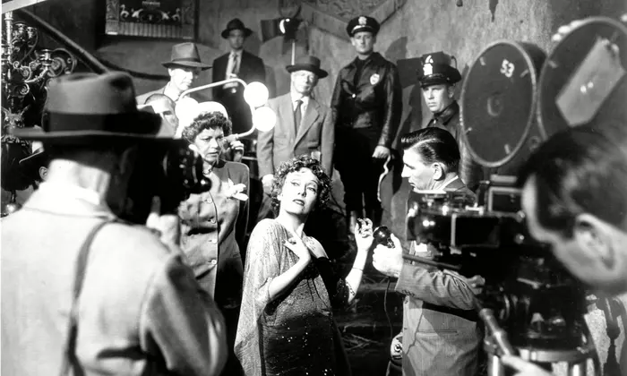
    * **并非**所有旁白叙述都是全知的；《**穷山恶水**》就由斯贝西克所饰的一个无聊愚钝的十来岁少女叙述出整个故事，她丝毫不知使她命运如此恶劣的原因是什么
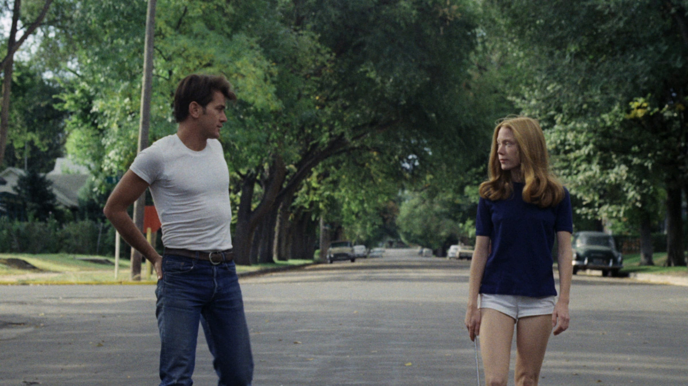
* **内心独白**是电影工作者最有价值的工具之一，因为它可以传达角色的思想
  * 内心独白原是取自**文学及剧场**的技巧，在电影中，它可以有新的变化；像奥利弗的《**哈姆雷特**》中，讲念哈姆雷特的内心独白时，不似传统般站在那里自言自语，反而用**旁白**（voice-over）的方式，使这些字句变成他内心的“想法”
* 电影因为有**特写**，可传达**最细微的变化**，空间的弹性也大，演员不必有太多负担，可以平常心及**日常语言表达**
  * 由于影像可以传达许多意义，电影中的对白就可以像日常生活的对话般**写实**，如《**百万美元宝贝**》
    * 有效的对白不一定来自咬文嚼字的剧本及语意清的语言，在**伊斯特伍德**的电影中，语言总是被**简要处理**；他最擅长表达他到底在想什么，他的表情远比他所说的话更能表达他的思考，因为他常常话不多，只讲事实．没有废话的单调音调，对他而言．少即是多
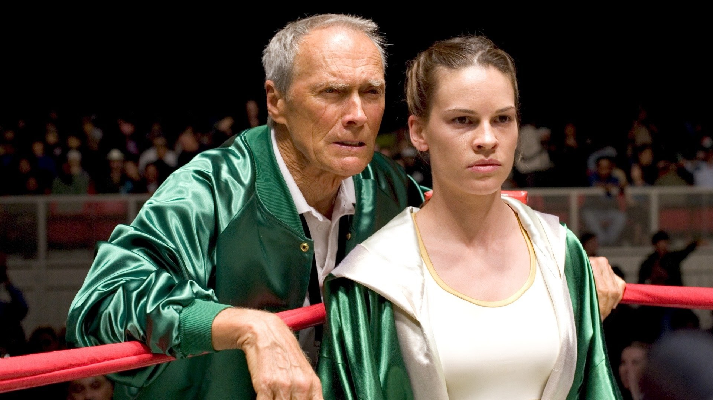
  * 电影对白**无须配合**日常对话，假如对白以**风格化**的方式处理，则影像亦应配合
    * 《**落水狗**》这部风格化的黑帮电影，角色对话和他们的行为一样**暴力**；事实上，他们满口脏话反而带来奇特的喜剧效果，为片子添加了怪异的腔调
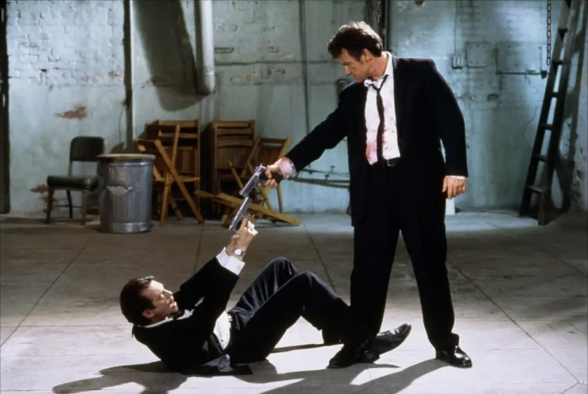
* 外国电影上映时通常会配上**当地语言**，或打上**字幕**；这两种方法都有其**限制**
  * 配音较**呆滞**，而且都用逊于原版的演员配音，此外声音和影像**很难配合**，特别是演员唇形不易同步；即使是双语系的演员用非母语替自己配音也会有**些微差别**
  * 反过来说，配音电影让观众能**专心看影像**，不会被字幕干扰；毕竟，没有人会喜欢“读“电影
  * **动物配音演员**常因其声音之“个性”而入选，这个特性能展现多层意义，演员不需现身即可达到；像**赛克斯**本人是编剧、单口相声谐星和演员，她以声音特殊、尖锐反讽以及带有嘲弄闻名
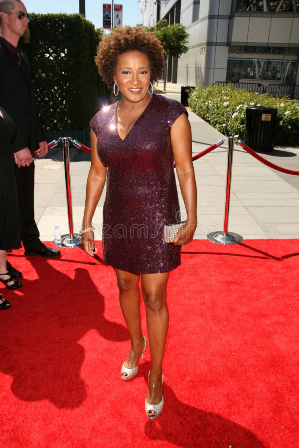
  * 虽然字幕很累赘，但有经验的影迷还是喜欢字幕；有些观众**精通外国语言**，能听懂大部分的对白（欧洲观众多半会第二种语言，有的人甚至懂三四种语言），**演员的声调**比对白还重要，有字幕的电影能让观众察觉声音上的些微差距
* 声音的优点，使其成为电影艺术家**不可或缺的工具**
  * **雷内·克莱尔**就曾预言，声音事实上提供给电影导演**更多视觉空间**；由千语言能透露一个人的阶级、宗教、职业、偏见等，导演无须再浪费时间来解释许多基本的事