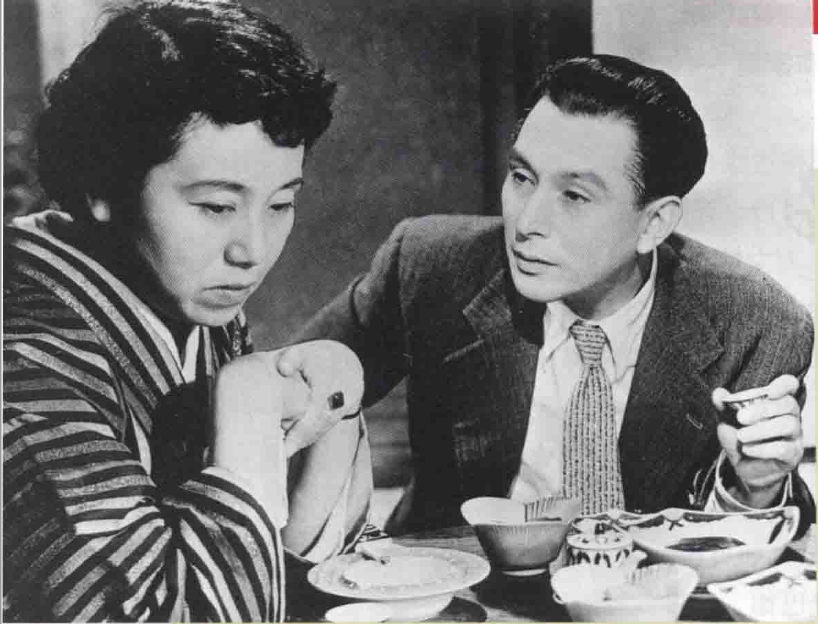

# 意识形态（1）
1. **意识形态在电影中的体现**：
   - 意识形态被定义为反映**社会和个人需求**的一组观念，与政治、政党有关，但也存在于电影中作为**隐藏的价值体系**
   - 电影传递着角色的**行为模式、道德立场和负面特质**，从而表达某种**特定的意识立场**
   - 每部电影倾向于某种意识形态，因此可能**褒扬或贬抑某些价值观**

2. **电影的教诲和娱乐功能**：
   - 艺术，包括电影，具有**教诲和娱乐**的双重功能
   - 电影可以采用**直接的宣传手段**，如电视广告或宣传片，例如《十月》或《意志的胜利》
     - 希特勒委托**莱妮•里芬斯塔尔**拍摄的纪录片《**意志的胜利**》是为了庆祝**1934年的纳粹党员大会**，影片通过其华丽风格和美学影响力将希特勒描绘成一个**上帝般的领袖**
     - 战后，里芬斯塔尔因参与纳粹宣传而被**监禁四年**，尽管她辩称自己只是为了**谋生**

   - 抽象的**先锋派电影**则似乎与道德价值无关，主要提供**视觉愉悦**

3. **电影意识形态的分类**：
   - **中立（Neutral）**：**逃避主义和轻娱乐电影**，如《猎豹奇谭》（Bring Up Baby）和先锋派影片《诱惑》和《第21号节奏》，几乎不涉及意识形态，重在美学
   - **暗示（Implicit）**：正派和反派主角代表**不同价值系统**，但**道德教训不明显**，如《美人鱼》（Splash）和《奇遇》
     - 即使是《**塔拉德加之夜**》这样如此轻松的**娱乐片**，在意识形态上也很突出
       - 电影《塔拉德加之夜》通过**戏仿和讽刺的方式**，批判了美国纳斯卡赛车中由**男性荷尔蒙驱动的文化**以及那种赢得比赛不择手段的**反运动精神**
       - 影片中的主角，一个典型的运动电影角色，被他父亲教导的座右铭“如果你不是第一，那就是最后”所驱动，反映了不计后果、全力以赴的态度最终导致的失败

   - **明示（Explicit）**：**明确表达主题**的电影，如爱国电影、纪录片和政治电影，比如《刺杀肯尼迪》和《街区男孩》（Boyz N the Hood）
     - 通常**一个角色**会突出某些价值观，如《卡萨布兰卡》中的鲍嘉
     - 极端形式是**宣传片**，如《华氏911》
       - 美国导演**迈克尔·摩尔**的左翼纪录片《**华氏911**》针对布什总统及其政策，在美国和全球取得了巨大的票房和多个奖项，甚至在**2004年美国大选前**发行，目的是为了**影响选情**
       - 这部纪录片以其**开放性、偏向性和操弄议题**而闻名，同时也展现了**热情、洞察力和幽默感**，如通过捆绑美国众议员这一桥段来讽刺支持军事干预伊拉克的政治家们

1. **电影中的意识形态展现**：
   - 剧情片通常属于**暗示类**，主角不直接陈述信仰，观众需要**深入探索**其背后的价值体系
   - 美国电影利用**明星制度**引导价值观，例如**约翰·韦恩**，而演员如**丹尼尔·戴-刘易斯**可扮演**不同意识形态的角色**
     - **约翰·韦恩**的银幕形象和真实生活中的角色常常体现出他作为**知名右翼分子**的意识形态，如在电影中扮演**战争将领、西部英雄**等，同时在私生活中也是**直言不讳的保守派**，强烈支持权威、家庭价值和军事至上的爱国观念
       - 尽管在**越战**期间，这种立场使他遭到**政治左翼和中立派的批评**，韦恩仍坚持他**对军事的重视和相关的政治观点**

     - **格里高利•派克**在大部分电影中展现了他的**左翼倾向**，尤其以在《**杀死一只知更鸟**》中扮演的**南方小镇律师**角色最为人所称道，这一角色也被认为是他个人的化身
       - 派克在银幕上和私生活中都以其热情、尊严、宽容和敢言的**自由派价值观**而闻名，同时他也是一个**和孩子感情深厚的父亲**，这一角色的表演在美国电影史上被广泛崇拜和赞誉

   - **美貌和性吸引力**也影响观众对角色的看法，例如汤姆·克鲁斯和朱莉娅·罗伯茨

1. **电影角色的价值观分析**：
   - **负面特质**（自私、恶毒等）常用于描绘**反派角色**，但大多数电影角色都是**正负特质的混合**
   - 分析角色的意识价值往往困难，尤其当**角色和导演的意识形态不同**时
   - 例如，法国导演**戈达尔**常处理不同意识形态的角色，使观众难以判断其立场

2. **电影中意识形态的隐性与显性表现**：
   - 意识形态可以通过**对话、剪辑风格、服装布景和空间**来表达
   - 例如，苏联蒙太奇影片《**战舰波将金号**》中的**敖德萨阶梯**一段戏展现了意识形态

   - 电影角色很少突出其**政治信念**，但其**日常言论**可以揭示其意识价值和立场

3. **意识形态的影响与局限性**：
   - 意识形态是影响我们看待事物的**重要因素**，影响我们对性、工作、权力等的看法
   - “左一中一右”的**三分法**有助于判断电影的意识形态，但需要结合**感性和常识**使用
   - 意识形态是一个**标签**，它很难触及人类信仰事物的复杂层面

## “左一中一右”
1. **民主与阶级的对比**：
   - 左翼强调人的**相似性**和**社会资源的共享**，认为社会权力应属于**技术管理阶层**而非在本质上优越于他人的群体，如电影《人间的条件》和《皮修特》所展示
     - 小林正树的《**人间的条件**》**三部曲**是对日本军方**在第二次世界大战中的暴行**的深刻指控，特别是描绘了**日军在战俘营中对中国人的虐待和压迫**，引发了日本国内的激烈争议
     - 这部由**理想主义社会主义者主角**叙述的作品，通过其最终**被苏联军队逮捕并杀害**的命运，揭示了政治专制的**普遍残酷性质**，无论是独裁统治、等级制度、对外国人的蔑视还是对个人的极端敌视

   - 右翼强调**个体差异**，认为**智慧和能力较高者**应享有更多权力和资源，社会体制应被**强力领袖**指导，大部分的机制应该**私有**，如电影《亨利五世》中所体现的观点
     - 在莎士比亚剧作《亨利五世》的电影改编中，**场面调度和构图中心**突出了主角亨利王子的**领导力和英明决策**，通过将他放在前景并正面全身挥剑朝向镜头，表现了其君王价值观和成长为领袖的故事
     - 在这样的场面中，亨利王子被伴随着他的两个弟弟格洛斯特公爵和贝德福德公爵，强调了他作为中心人物的**地位和影响力**

1. **宗教与世俗的对比**：
   - 左派认为宗教是**私人事务**，不应受政府干涉，支持**多元信仰**，有些更**公开批评组织化的宗教系统**，认为它们只是保护经济利益的另一个社会机构，电影如《阿基尔，上帝的愤怒》表现这一点

   - 右派强调**宗教和传统的重要性**，尊重**祖先和出身的优势**，认为宗教是**道德的仲裁者**，如电影《处女泉》所示
     - 梅尔·吉布森的《**基督受难记**》原被认为是票房毒药，因其使用拉丁文和古犹太语对白及宗教主题，但吉布森坚持**自费拍摄**并针对**保守派和基督徒群体**进行营销
       - 这部电影最终在全球取得了**巨大成功**，以6.75亿美元的票房成绩跻身**史上最赚钱电影之列**

     - 英格玛•伯格曼的作品《**处女泉**》探讨了**基督教信仰的复杂性和困难**，表现了一个**神秘且非逻辑的上帝形象**，反映了他作为**严格路德派牧师之子**的冰冷成长经历和深刻的宗教观念
       - 他的电影描绘了**基督教教义的极端荒谬性**，强调上帝的判决与人的行为无关，人们**生而有罪**，且无法消弭这罪，若上帝决定让人受苦，人只能无奈接受

1. **大环境与遗传的对比**：
   - 左翼主张人的行为**受环境和社会条件影响**，可以通过**改变环境**来改变行为，如电影《吉米·布莱克史密斯之歌》所描述
     - 电影《**吉米·布莱克史密斯之歌**》讲述了吉米·布莱克史密斯这位**半白半土著混血儿**的故事，他被白人传教士夫妇**从困境中救出**并**按照白人礼仪教育成人**，揭示了**种族歧视**在经济和性关系中的根深蒂固
     - 影片通过传教士夫人劝吉米娶白人女子以**减少“黑色血统”的情节**，以及白人对土著人的**剥削**和对其**性威胁**的担忧，展现了当时社会的**种族偏见和歧视**

   - 右翼认为行为和性格**由遗传决定**，强调出身和血统的重要性，如电影《晚春》和《秋日和》中的主题

1. **相对与绝对的对比**：
   - 左派认为道德和价值观**应有弹性**，应根据每个案例的**特殊性**来判断，主张在宽松环境下培养**孩子的自我表达**，如电影《狗脸的岁月》所展现
     - 《**天才一族**》这部**古怪的黑色喜剧**将家庭描绘为一个**充满破碎、扭曲和怨怼的专制独裁机构**，其中由哈克曼饰演的**父权式家长**对他那令人烦恼、失败的孩子们进行召集和训话
     - 这部电影的基调**苦涩、神经质且令人不安**，展现了一个功能失调家庭的内部冲突和紧张关系

   - 右派坚持**道德和行为的绝对性**，认为孩子应接受**严格的教育和训练**，尊重长者和传统，如电影《木偶奇遇记》所体现

1. **未来与过去的态度**：
   - 左派看待过去为充满**剥削和冲突的时期**，对未来持**乐观态度**，认为未来**充满进步的可能性**，如电影《厚望》所示
     - 在20世纪80年代撒切尔夫人统治下的英国，**迈克·李**这位自由派艺术家通过其作品《**厚望**》对当时英国社会的物质主义表示了强烈的厌恶，他以**嬉皮夫妇**这一角色来讽刺**贪婪、虚伪和过度消费主义**
     - 这部影片广泛挖掘并批判了当时英国社会关注**阶级问题和保守派政治氛围**下的各种现象

   - 右派则对过去**持有敬意**，认为现在是**黄金时代的失落**，对未来持**怀疑态度**，电影如福特的《双虎屠龙》反映了这种悲观主义

1. **合作与竞争的价值观**：
   - 左派认为社会进步来自**合作**，政府的角色是**保障基本需要**，如电影《十月》所反映
     - 爱森斯坦的电影《**十月**》是一部赞扬**1917年俄国大革命**的作品，充满了**宣传性质和对未来的希望**，同时将沙皇时代描述为**黑暗时期**，电影中的英雄是被戏剧化描绘的**苏联国父列宁**
     - 尽管电影在意识形态上表现得**非常明显**，但爱森斯坦特有的“**辩证剪辑风格**”使得影片中的并列影像呈现出**惊人的美感**

   - 右派强调**市场竞争和个人自由**，认为社会进步源于**个人的野心和欲望**，如电影《最后安全》和《欲海情魔》所示

2. **局外人与圈内人的观点**：
   - 左派倾向于**支持边缘群体**，将局外人和叛逆者**浪漫化**，电影如《邦妮和克莱德》和《侠盗王子罗宾汉》体现这一观点

   - 右派则认同**体制和权力**，强调**领导权的重要性**，电影如《第一滴血》系列和《亨利五世》展现了这种立场

3. **国际主义与民族主义**：
   - 左翼倾向于**全球观点**，重视人类的**普遍性和多元价值**，电影如《心灵与智慧》表达了这种观点
     - 电影《**与狼共舞**》倡导**自由派价值观**，讲述了一个美国军官在南北战争期间逐渐**融入并尊敬**印第安苏族的故事
     - 在宣传照中，科斯特纳作为**苏族的客人**，被置于**构图的边缘**，象征着他对苏族的尊敬以及他对他们在道德和文化上超越白人社会的赞美

   - 右翼强调**爱国主义和民族优越感**，电影如福特的《原野神驹》和《侠骨柔情》展现了这种立场

1.  **性开放与一夫一妻制**：
    - 左派支持**性自由和个人选择**，认为性关系是**私事**，电影如《七美人》反映了这种观点
    - 右派**坚持一夫一妻制**，**反对性自由**，电影如约翰·福特的《愤怒的葡萄》传达了这种传统家庭观念
      - **弗兰克•卡普拉**的电影作品强调着**美国传统价值观**，如睦邻友好、信仰、领导责任和家庭价值，代表了**美国保守伦理**
      - 他倡导的是努力工作、节俭、健康竞争和慷慨智慧等**中产阶级理想**，其中主角的财富并非以收入，而是以**家庭和朋友的支持**来衡量，展现了一种美国小镇紧密家庭和互助邻居组成的**浪漫理想**

## 文化、宗教及种族
1. **文化多样性与电影**：
   - **社会文化**包括传统、机制、艺术、神话和信仰的特质，不同国家展现**不同文化特质**，如多元化社会的以色列和美国，和同质化的日本和沙特阿拉伯
   - 归纳文化特质时需谨慎，**避免刻板印象**，尤其在艺术领域，很多作品故意与文化普遍现象不同，如小津安二郎的《晚春》和《秋刀鱼之味》

2. **文化影响下的电影特征**：
   - 日本电影多半**保守**，强调**社会同质性和家庭价值**，小林正树和成濑已喜男的作品却站在**被文化压迫者**一边
   - 美国电影强调**个人立场对抗社会**，浪漫化**弱者和叛徒**，**性内容**和**节奏较强烈**，造成美国人在外国文化中的刻板印象
     - 自1927年以来，奥斯卡最佳影片中**有41%由外籍导演**获得，反映了美国作为**机会之地**的特质，其中许多著名导演如弗兰克·卡普拉、希区柯克等原本是外国人
     - 例如，讲述印第安纳州青少年成长故事的《**告别昨日**》，尽管是典型的美国生活描绘，却由**南斯拉夫移民**史蒂夫·特西奇编剧和英国人导演，体现了美国电影业**对外国才艺的开放和接纳**

   - 日本片的角色**较少在公共场合争辩**，谈话时**少有长时间的互相注视**

3. **不同国家电影的文化特征**：
   - **英国电影**因文学和舞台剧传统而强调**文艺腔**，多来自文学戏剧改编，如**莎士比亚的作品**
     - 《**赎罪**》这部电影改编自**伊恩·麦克尤恩**的畅销小说，讲述了一位出身富有的女子（由奈特莉饰演）和一位管家出身的穷人（由麦卡沃伊饰演）在二战前、中、后期的**恋情**
     - 电影中这段**悲剧性的爱情故事**不仅反映了英国长期存在的**阶级意识**，也象征着**战争对个人命运和英国世界地位的影**响，最终成为战争的牺牲品

   - 英国电影的**反文化**由左翼强调**工人阶级**，**现代背景**，**松散剧本**等，如《厚望》
   - **瑞典电影**受**路德教派**影响，如伯格曼的作品所示
   - **第三世界电影**关注新殖民主义、未开发经济、女性压制和贫穷问题
     - 巴本科的电影《**皮修特**》聚焦于探索贫穷文化，讲述了巴西街头弃儿皮修特**悲惨的生活故事**，代表了**数百万同样命运的街童**
     - 皮修特的扮演者，来自圣保罗一个贫困家庭的**达·席尔瓦**，拍摄电影七年后**因持械抢劫而被击毙**，终年仅17岁

1. **多元文化与次文化在电影中的表现**：
   - 在**多元文化社会**中，电影常展现**次文化与主导文化的冲突**，如《愤怒的葡萄》中的农民与加州社会的冲突
     - 《**愤怒的葡萄**》这部电影，基于**约翰·斯坦贝克**的同名小说，由**约翰·福**特导演，将原著中的**马克思式控诉**转变为强调**基督教人文主义**的作品，讲述了一个农民家庭从俄克拉荷马州迁移到加州的艰难旅程，并突出了家庭中**坚韧母亲的角色和家庭的凝聚力**
     - 福特作为一名**保守主义者**，通过这部影片展现了他对**女性在社会和家庭中重要角色**的认可和赞赏

   - **美国电影**强调**生活方式的次文化**，如军旅生涯、嬉皮文化、嗑药青年，以及同性恋关系，电影如《夺宝大作战》、《逍遥骑士》、《杂货店牛仔》和《长久伴侣》

1. **时代与历史对电影意识形态的影响**：
   - **不同时期**的美国电影反映**不同的社会价值观**，如30年代的新政左翼价值、60至75年间的暴力、冲突、反权威主题，以及80年代里根时代的右翼转向
   - **宗教价值**在不同国家的天主教表现**不同**，如欧洲的保守派、意大利的戏剧美学性、拉丁天主教的解放神学运动
     - 欧洲和美国常将罗马天主教会视为**保守机构**，其中妇女在教堂政治中通常扮演**较次要的角色**
     - 但近年来一些**非传统的修女**，如海伦修女（由萨兰登饰演），通过她的书《**越过死亡线**》中描述的**为死刑犯提供精神慰藉**的行为，挑战了这一观念，展示了她不顾传统男性期望，按照自己良心行事的决心

2. **种族与社会族群在电影中的呈现**：
   - 少数民族电影强调**与主流文化的张力**，如澳大利亚原住民的压迫历史和《来看天堂》中日本移民的集中营经历
   - 美国电影史上**黑人形象的变迁**，从早期的刻板印象到西德尼·波蒂埃的突破，以及斯派克·李对黑人社区问题的探讨
     - **斯派克·李**作为非洲裔美国人故事的银幕拓荒者和种族议题的领军人物，开创了机会，使众多**有色人种艺术家**得以在电影界崭露头角
     - 他的作品风格**鲜明、犀利**，充满**布鲁克林特色**，尤其擅长在**运动、娱乐和政治领域**展现黑人文化，如他拍摄的纪录片《**喜剧之王**》帮助四位单口相声专家获得名誉和利益

   - 少数民族电影制作者偏爱**现实主义风格**，因其制作成本低，能展现社会学意义的真实场地和细节，如《为所应为》和《丛林热》

## 女性主义
1. **女性在电影历史中的地位**：
   - 在好莱坞的**黄金时代**，女性在电影行业中的**地位低下**，难以在高级管理、导演或制片方面取得地位，尽管在**表演领域**有所突破
   - 女明星虽然能获得一定的**名声**，但面临的问题包括**片酬不如男性、影龄短暂、难以扮演主导角色**，如琼·克劳馥和贝蒂·戴维斯晚年的角色限制
     - 女性主义影评经常提到“**男性的注视**”这一概念，指的是电影中以男性视角**对女性的物化和性化展现**，这种观点通常忽视了女性自身的欲望和全面人性
     - 当电影的创作者是**女性**时，可以提供一种**新的视角**，从女性的角度探讨两性或同性之间的关系；例如，在电影《**名利场**》中，女主角贝基被描绘为一位在男性统治、帝国主义和仇视女性的英国阶级体系中**精明求生的人物**，这种描述**更具女性主义和同情心**，展现了女性在严格社会体系中的斗争和胜利

2. **女性主义在电影中的影响和挑战**：
   - 女性主义学者如**安妮特·库恩**（Annette Kuhn）指出电影中女性常被视为**男性的“他者”或性客体**，缺乏独立的故事和深度人物塑造
   - 女性角色通常**支持男性角色**，罕见展现聪明、野心、独立等特质
     - 女性主义者反对将女性**仅降为性客体**，尤其在电影中，她们要求除了性感之外，**人性的其他特点**也应被重视
     - 例如在**007系列电影**中，女性常被描绘为**性感笨蛋**，这种刻板印象**影响了许多年轻男性**，使他们将女性视为**性工具**，这一点受到女性主义者的**强烈批评和质疑**

   - 女性友好的电影类型包括**爱情片、家庭剧、浪漫喜剧**等，最重要的类型是**女人电影**（women's pictures）——通常是**家庭通俗剧**，强调女明星和“典型”的女性问题，但通常仍以**婚姻和家庭**为女性的终极目标，选择**事业**的往往**吃尽苦头**，如《欲海情魔》的女主角

3. **女性导演和现代电影中女性角色的变化**：
   - 现代好莱坞约有二十名**女导演**，她们的作品带来了电影中**女性角色的变化**
   - 相比20世纪60年代，现代电影中女性角色**更为多元和丰富**，不再局限于传统的性别角色和刻板印象

4. **全球性别歧视问题**：
   - 在许多第三世界国家，女性仍面临**极端的性别歧视和压迫**，尤其在**南亚和非洲地区**
     - **梅赫塔**的电影三部曲之一《**水**》，设定在1938年的英属殖民时期的印度，揭露了**小女孩被迫与老人结婚**以及**寡妇被送入寡妇院**的悲惨命运，这被认为是她们**前世罪行的惩罚**
     - 这部影片因其对印度传统的**所谓“负面”描绘**而遭到印度右翼媒体的**强烈批评**

   - 恶劣的社会习俗如**女性割礼**普遍存在，例如非洲的8000万女性行割礼，被视为“纯净”仪式，剥夺女性性愉悦权利
   - 妇女**健康和教育问题**严重，如**生产问题**是第三世界育龄妇女的头号杀手，全球**文盲**人口中女性占多数
     - 《**万福玛利亚**》讲述了一位17岁的**拉丁美洲少女**，因经济困难被粗暴的男朋友抛弃并怀孕后，为了**帮助家庭**，决定成为一名“骡子”即**毒品走私犯**，冒着生命危险吞下62个装满海洛因的橡胶小袋子前往美国
     - 电影情节**紧张惊悚**，而其拍摄和剪辑手法则采用了**纪录片的方式**，增强了故事的**现实感**

1. **伊斯兰社会中的女性地位**：
   - 在许多**伊斯兰国家**，女性的社会地位与男性**不平等**，例如不被允许开车、投票、工作或独自外出
   - 在极端情况下，如**塔利班政权下的阿富汗**，女性受到严重限制，包括**禁止工作和接受教育**
     - 在经历了内战、饥荒和与苏军的游击战后，**阿富汗**在**塔利班政权**的铁腕统治下，女性遭受了极端的残酷对待，如被**禁止工作**只能乞讨
     - 《**奥萨玛**》讲述了一位母亲在家中男性成员战死后，无奈将女儿**伪装成男孩**以求生存的故事，展现了充满悬念的情节和小女孩对被发现身份的恐惧，影片凭借其出色的摄影、表演和剪辑赢得了**金球奖最佳外语片**

   - 尽管在某些伊斯兰国家（如约旦、伊朗）女性有**更多权利**，但总体上仍然存在**严重的性别不平等**
     - 在伊朗，由于严格的**电检制度和伊斯兰教法规**，电影中对女性的描绘受到**重大限制**，如在公共场合必须**遮住头发和身体曲线**，甚至在电影中夫妇角色之间也**不能有身体接触**，除非他们是现实中的夫妇
     - 因此，**现代欧美主题的电影**内容在伊朗几乎**无法进口**，女演员在电影中即使在家中也**必须遮住头发**，这些规定极大地限制了电影内容的自由表达

1. **日本和其他文化中的女性地位**：
   - **日本社会**长期以来对女性的期望集中在**家庭角色**上，职场上女性仍面临歧视
   - 日本女性电影传统通常聚焦于**家庭不公**，导演如沟口健二和成濑已喜男专注于此类题材
   - 女性主义运动专注于寻求**基本条件平等**，如同工同酬、性骚扰问题和女性团结，虽有进步，但仍面临挑战
     - **成濑已喜男**的电影作品常以**日本传统家庭制度下边缘化的女性**角色，如寡妇、艺伎和贫穷家庭的女性，作为其创作的基本材料，这些女主角被视为**困在理想与现实之间的普通人**的象征
     - 尽管女性主义**对日本社会的影响不大**，成濑的女主角通常不会对社会或制度提出抗议，而是以**接受的态度**面对生活中的困境，如电影《**晚菊**》中的退休艺伎主角对老情人的访问作出平静但无奈的反应

1. **女性导演与女性主义的关系**：
   - **不是所有女导演都主张女性主义**，且**并非所有女性主义者都是女性**
   - 有些女性导演的作品**以男性为主角**，例如莉娜·韦特米勒的电影，或在性别表达上**保持中立**，如兰达·海恩斯的《悲怜上帝的女儿》（Children of a Lesser God）和《再生之旅》（The Doctor），以及彭妮·马歇尔的《飞进未来》（Big）和《睡人》（Awakenings）
     - **韦特米勒**作为一名女导演，虽然在是否是最伟大的女导演上存在争议，但她以**反讽和嘲弄**的方式支持女性立场，常被一些女性主义影评人批评她对女性的**粗鄙暴烈描绘**
     - 在她的代表作《**七美人**》中，她**讽刺了男性的荣誉感**，将电影中的暴力角色比作**父权黑社会和法西斯**，展现了她对女性角色的**强悍和独立的个人身份认同**的描绘

1. **女性主义导演的创作目标**：
   - 女性主义导演，无论男性或女性，致力于通过电影**克服性别偏见**，呈现**不同于传统的新观点**
   - 这些导演试图提供给女性角色**更多元和丰富的选择**，以反映女性在真实生活中的多样性和复杂性
     - 《**末路狂花**》通过探讨两位好友之间的**亲密友情**和她们的横跨美国的**冒险之旅**，涵盖了婚姻、工作、独立、女性情谊和大男子主义等主题，并巧妙地融入**幽默元素**
     - 虽然电影受到**女性主义运动的影响**，但其结构和表达方式却借鉴了**传统的男性电影类型**，如**哥们儿电影和公路片**

## 同性恋解放
1. **同性恋解放的起源与“衣柜”隐喻**：
   - 同性恋解放运动受**60年代革命性团体**如女性主义和黑人解放运动的启发
   - 同性恋者经常**隐藏**自己的**真实性取向**，这种隐藏被称为“**衣柜**”（in the closet），表明他们**伪装成异性恋**以适应社会的偏见和压力
     - **玛琳•黛德丽**在20世纪20年代在**柏林**出道，当时这座城市在欧洲以**对性的开放和性感**著称；她**公开的双性恋身份**一度在好莱坞引起轰动，但导演们也巧妙地利用了她的性倾向来塑造角色

     - **罗克·赫德森**以扮演动作冒险英雄、爱情片男主角和轻喜剧演员而闻名，他**英俊的外表和阳刚的举止**使他深受广泛欢迎，尽管他在电影圈内的同性恋身份为人所知；直到1985年他因艾滋病临终前**公开了自己的性取向**，这一事件促使美国社会开始更加严肃地关注**艾滋病问题**

1. **同性恋的科学研究与社会观念**：
   - 关于同性恋的起因，学者有不同观点：弗洛伊德认为性行为是**模仿**的结果，而其他学者认为同性恋**天生**
   - 无论观点如何，都认同性别认同**在发育前期被塑造**，且同性恋者的性向对他们来说与异性恋者一样**自然**

2. **同性恋在电影史上的存在与隐匿**：
   - 电影史学家**维托·拉索**指出同性恋在电影史上的存在**长期被忽视**
   - 在20世纪60年代前，电影中明显的同性恋情节**几乎不存在**，但在**次文本**中有暗示，如《马耳他之鹰》和《吉尔达》

   - 后来电影逐渐**普遍展现**同性恋主题，尤其是美国和欧洲，同性恋角色被描绘得更多层次
     - 《**断背山**》这部被称为“同志电影”的作品，尽管其大部分工作人员和观众**都不是同性恋**，却意外地获得**巨大成功**，全球收入达1.65亿美元，成为文化现象和晚间娱乐节目的热门话题
     - 这部电影在同性恋题材中获得**极高评价**，提名了**12项奥斯卡奖项**，导演李安和编剧分别赢得了最佳导演和最佳改编剧本奖

1. **坎普趣味与同性恋文化**：
   - **坎普趣味**（camp sensibility）与男同性恋文化紧密相关，表现为**喜剧、嘲讽和艺术化**
     - 《**沙漠妖姬**》这部喜剧电影以三个对嘴表演者（两个男同性恋和一个变性人）为主角，通过他们的**夸张幽默**表现了坎普风格的魅力，彰显了“好品味是永恒的”这一理念
     - 这部电影的内容和风格在莫里斯·迈耶的著作《**坎普的政治与诗学**》中得到了探讨和分析

   - 电影中常用**过度艺术化的处理**，比如华丽的布景和服装，舞台隐喻以及崇拜某些女星为偶像，如琼·克劳馥和拉娜·特纳

1. **同性恋在电影中的演变**：
   - 20世纪60年代后，同性恋电影**越来越普遍**，尤其是随着好莱坞制作法规的废除和新的分级制度的实施
     - 英国著名演员**伊恩·麦凯伦**在广播、电视、电影和舞台上都有杰出表现，曾获托尼奖并多次提名奥斯卡和艾美奖，他最著名的角色之一是《**指环王**》三部曲中的魔法师**甘道夫**
     - 1988年公开“出柜”的麦凯伦以其**机智和激进的同性恋言论闻名**，他曾表示自从公开身份后虽然事业起飞但难以回归平静生活，因为很多其他演员也在“出柜”

   - 同性恋电影早期常展现同性恋角色为**歇斯底里、性执迷**的人物，但逐渐转变为**更真实和多元**的表现，如《热天午后》和《歌舞酒吧》

## 基调
1. **电影基调的定义和影响**：
   - 基调是导演对戏剧素材所**采取的态度**，决定了电影的**气氛**
   - 如大卫·林奇的《**蓝丝绒**》（Blue Velvet），基调多变，使观众**难以把握事件的意义**，例如一场戏中劳拉·德恩和凯尔·麦克拉克伦的对话中，光和音乐的运用嘲弄了角色的天真

2. **不同元素对基调的影响**：
   - **表演风格**可以显著影响电影基调，如伊德里萨·韦德拉奥果的《天问》采用非职业演员，使表演风格写实，强化了电影的客观、实事求是的基调
     - 《**天问**》这部获得戛纳电影节评审团特别奖的电影讲述了非洲村落中一段**三角恋爱导致家庭破裂**的故事，影片以其**非戏剧化和简洁的风格**呈现，最终以**悲怆的结局**收尾
     - 影片中朴素而辛酸的音乐是由著名爵士音乐大师**阿杜·易卜拉欣**（Abdullah Ibrahim）创作

   - **旁白**能提供与电影戏剧内容不同的观点，增加对比，如《日落大道》的反讽旁白、《与狼共舞》的同情旁白、《发条橙》的犬儒式旁白
   - **音乐**是设定电影基调的重要元素，不同风格的音乐能创造不同气氛；如斯派克·李的《丛林热》中，不同族裔的戏剧使用不同风格的音乐以强化其文化背景

3. **类型对基调的设定**：
   - 不同的**电影类型**有其**特定的基调**
   - **史诗电影**通常展现尊严和大于生活的姿态，如《搜索者》（The Searchers）
   - **惊悚片**通常是强硬、恶毒的，如《双重赔偿》（Double Indemnity）
   - **喜剧**的基调则是轻佻、好玩的

4. **意识形态的误导性分析**：
   - 不理电影基调而用**机械化方式**分析意识形态可能会产生误导
   - 以《猎豹奇谭》为例，表面上似乎**无意识形态**，但实际上映射了30年代美国电影中的**有钱人生活和奢华背景**
   - 电影展现了**中产阶级的工作哲学**，将其描绘为**无趣和枯燥**，与女主角的**奢华生活**形成对比
   - 电影**并未直接展现**政治问题，而是聚焦于主角的魅力和冒险，使其政治背景成为**次要**
   - 女主角的生活方式强调其**吸引力**，而非工作或社会责任

5. **电影意识形态的观念性分析**：
   - 在分析电影时，考虑其明显的意识形态程度、角色的道德立场、技巧中的意识形态、主角是否代表导演观点、文化和宗教角色、种族和性别描述等因素