# 戏剧（1）
* “**演出**”（enactment）的意义：自古以来，戏剧叙事均由**行动**（action）和**反应**（reaction）展开，而非说出的对白；对白看不见，但行动可以
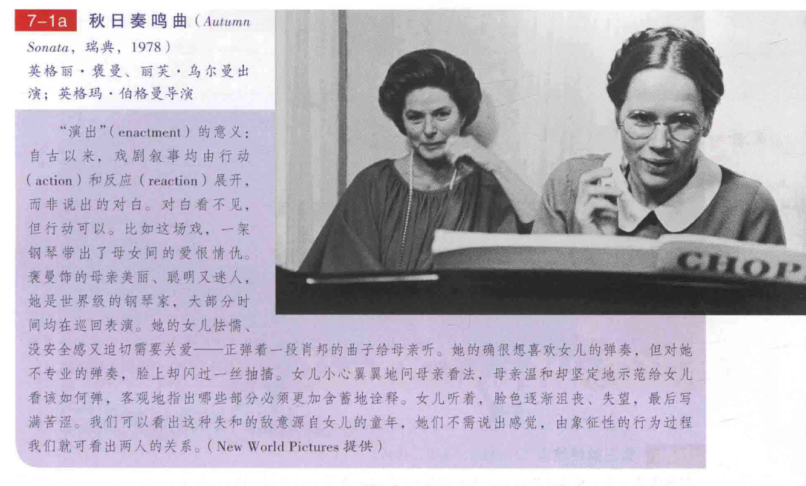
## 时间、空间及语言
* 电影的**时间**比舞台时间**有弹性**
  * 剧场中演出的单位是“**场景**”，一个场景的演出时间和其内容情节发展的时间长度**大致吻合**（当然，有的舞台剧剧情也可能包含很多年的变化，但这“很多年“通常都是在幕与幕之间过去的）
  * 电影的基本单位则是**镜头**，平均每个镜头长**十至十五秒**（甚至可短到一秒），可以比较不着痕迹地把时间**缩短或延长**；所以说舞台剧往往是在幕与幕或场与场之间切掉（或跳过）大段时间，电影却可以较自由地把时间在几百个镜头之中延展或浓缩
    * 许多导演喜欢用**录像方式**作为正式拍摄时的检查工具，因为胶片时代胶片昂贵，又无法立即检查回放；用录像机录下一场戏，导演可以考虑如何修正场面调度，演员可以检查表演有无过于含蓄或空泛，摄影师也可以看看打光及摄影表现，当每个人都满意了，就可以用胶卷拍
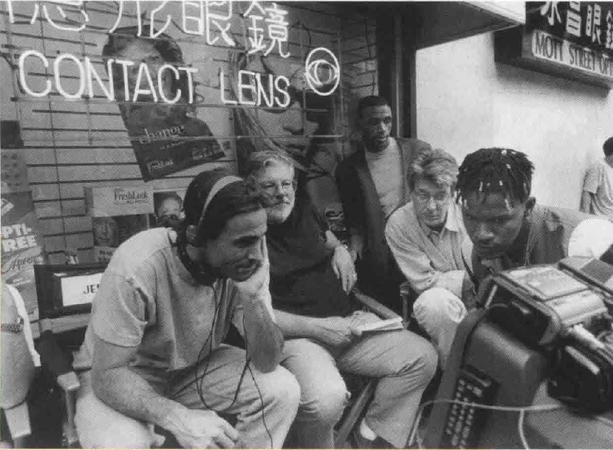
  * 剧场的时间通常都是**连续**的，像倒叙就很少出现，不过电影中经常有**倒叙**
* **空间**在剧场中虽然也是靠基本单位的“场景”来划分，但其实所有的戏剧动作都在一个**限定的范围内**进行——由**舞台框架**所限
  * 剧场通常是**封闭式**的，我们无法想象在舞台两侧及化妆间的动作
  * 电影的框架则是**景框**，电影可能组合了许多**不同空间的片段**，甚至有时还能表现出同一空间中各种特殊部位的**不同观照**；例如，特写就比远景详细，而在剧场中很难达到这种效果
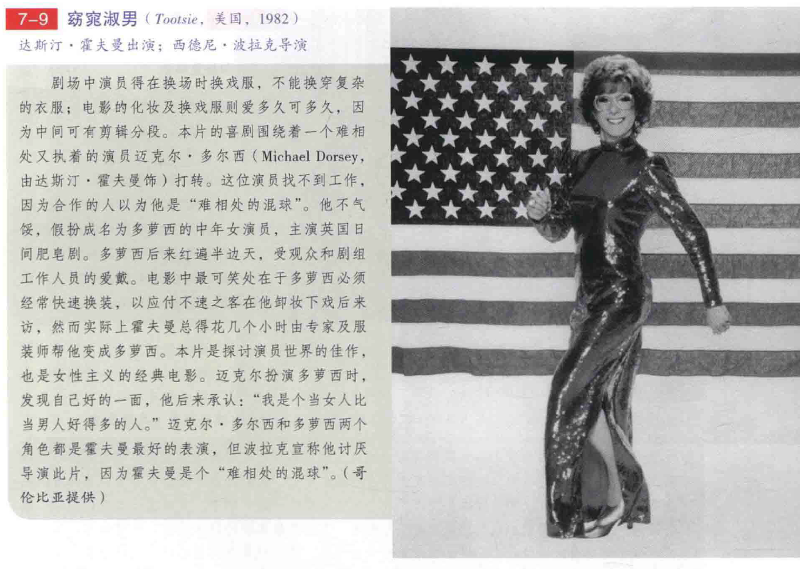
  * 在**剧场**中，观众是坐在**固定的座位**上，虽然演员偶尔会向前或退后，但舞台和观众的距离**大致不变**
  * **电影**就不一样了，电影观众的视野可以随着镜头向各种方向**自由移动**而又远近自如，近的如**大特写**可以细数睫毛，远的如**大远景**可以鸟瞰方圆数英里
    * 《**第三类接触者**》中的这个镜头在舞台上不会有大大效果，观众会离戏剧视野太远而无法投入；但在电影上，这个镜头会充满悬疑，因为场面调度全由景框大小决定，其前景即是**张力十足的特写**，舞台导演的空间是**受限而一成不变**的，电影导演则可以**极近极远伸缩自如**
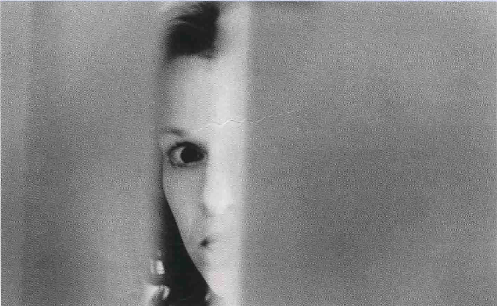
  * 电影中**人物占据多大画面**事关紧要；舞台剧导演可以让一名重要角色移动到舞台前方，靠近观众，但这名角色的**身形大小**并不会跟后方的其他演员产生多大差别；而电影导演在这方面则可以通过更为巧妙地操控**场面调度**，享受到更大的自由度
    * 在这个镜头中，注意**女性反派角色**（布兰切特）几乎占据了**半个银幕画面**，这样一来，被抓捕的主角反而退居**相对次要的地位**；两名角色占据的银幕空间成了他们之间**谁更占有优势**的象征
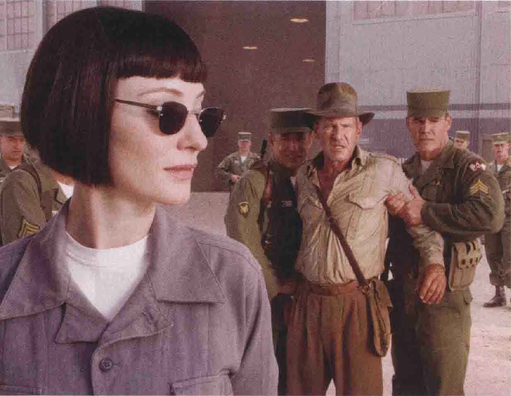
  * **剧场**是**三维空间**的，人与物是真实的、可触及的，较具写实性，我们对其空间的理解，是和**真实生活**一样的；舞台剧现场演员和观众的**互动关系**是银幕电影演员无法进入的领域
  * **电影**是**二维空间的影像**，演员和观众之间**没有互动**，因此影片中的裸体较不会引起争论；但在舞台上，裸体是真实的，而在电影中“只是图片”
  * 舞台演员与观众的互动建立起**和谐的亲密感**；而电影演员则被固定在银幕上，无法亲近观众，所以他们和观众的关系**远不如舞台演员**
  * 电影有**时效性**，因为过去的表演风格**不一定适合**新演员；舞台演员则可能使两千年前的老戏**呈现新貌**，台词虽然一样，但**不同的诠释方法**可适应当代的表演风格
* 上述这些空间运用倒是造成了剧场和电影的另外一种差别，就是**观众的参与程度**
  * 一般来说剧场观众是**较主动**的，他必须自己在整个舞台上找出较重要的信息；在剧场中**语言**虽然很重要，但戏剧是一种**低视觉度的媒介**，观众必须替一些**视觉细节**弥补意义
  * 而电影观众往往是**较被动**的，经由特写及剪辑的并置，提供各种**必要的细节**；电影是**高视觉度的媒体**．观众不怎么需要自己幻想或补充什么细节
    * 在舞台上，重要的小道具（如皮夹）得借由**强光**提醒观众它的存在；但在电影里，小物件却可轻易地**从环境中独立出来**；图中，**布莱松**用特写捕捉扒手如何身手敏捷地在地下铁中从受害人身上扒出皮夹，这种如拍照般的特质在舞台上很难表现出
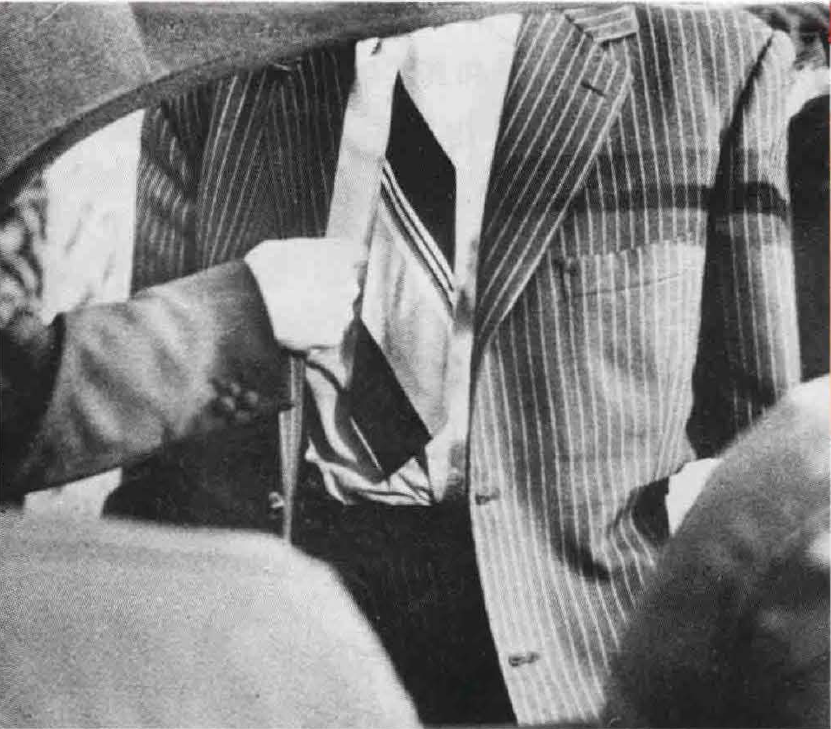
* 虽然电影和戏剧都是可以丰富灵活运作的艺术，但是一般来说戏剧较偏重**对白和语言**
  * 戏剧通常被认为是**写作者的媒介**，其文本的表现使其成为**文学的分支**
  * 在剧场中，我们的**听觉**会比视觉灵敏；导演**雷内·克莱尔**就注意到盲人在剧场中可抓住大部分信息
  * 而电影较偏重于**视觉**．被认为是**导演**的创作园地；克莱尔观察到聋人看电影较投入，但这并不是定论，**威尔斯**的电影就是例外
* 既然舞台剧是以**语言**为主，通常在把一个舞台剧搬上银幕时首先碰到的主要问题就是，**保留多少原剧对白**，才真正适用于以视觉为主的电影媒介
  * 像**乔治·库克**所导的莎翁名剧《**罗密欧与朱丽叶**》，就是一部非常保守的改编作品，它保留了**全部的舞台剧对白**，以至于视觉影像沦为语言的陪衬，显得琐碎而了无新意，甚至无法表达此剧原来在舞台上的流畅
  * 导演**泽菲雷利**对这个剧本的改编就比较成功，文字的部分几乎全用**视觉影像**取代，大部分诗文保留在影片中，但是通常都不用同步（或同旨意）的画面来呈现，以至于达到**扩张**——而非复制——语言的效果
  * 简单地说，泽菲雷利技术上虽**不忠于原著**，在演出效果和精神上，却远比库克的版本**更贴近**莎氏
* 剧场和电影都是**视听媒介**，但它们所**强调的**不同
  * 剧场中信息的主要来源是**动作和对白**，在剧场中，我们会注意他们说了什么及做了什么；剧场中的动作以电影术语来说局限于**远景**，动作越大越有效果，比如哈姆雷特和雷欧提斯的决斗及《**玻璃动物园**》（The Glass Menagerie）中阿曼达帮劳拉穿衣
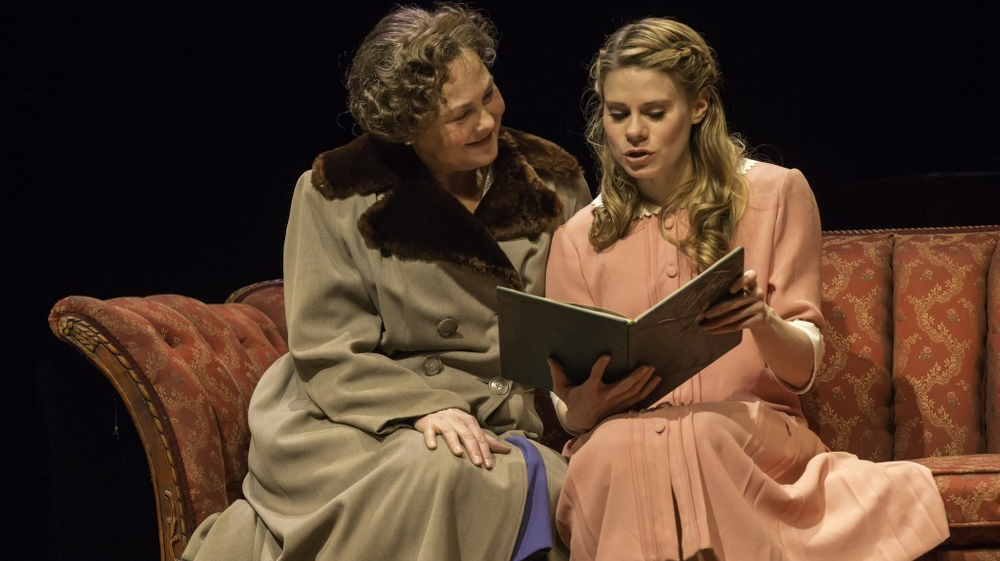
  * 剧场中的**大远景**必定是**风格化**的，莎剧的史诗战争场面放在舞台上就有点荒谬；剧场中的**特写**只有前几排的观众会注意到，除非演员的动作**夸张或风格化**，此外，除非是非常私密的剧场，否则剧场中的特写多以**言语**表之
  * 因此，舞台演员**多以语言表意**，例如我们从哈姆雷特的独白和对白中得知他对弑父夺母的叔叔克劳狄斯的态度；舞台上的特写是“说”出来的，而不是做出来的
  * 由于以上这些视觉上的限制，大多数戏会避免**庞大或琐碎空间的戏剧动作**，通常限于**全景或远景**；如果必须用到极大或极细琐的空间，则会朝**非写实**的方向走：譬如当芭雷舞或风格化的场面遇上了大远景式的剧场动作，或者以口白为主的戏遇上了特写镜头式的剧场动作
  * 但是电影则能够轻易**游走于大远景到特写间**，因此能把舞台上无法搬演的场景呈现出来
    * 像这种**勇士穿梭火窟的奋战场面**只能在电影中，上百个技术人员在旁看顾演员的安全
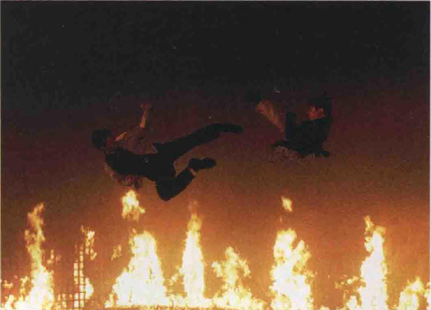
* **剧场美学**总是**以人为中心**：话要由人说出来，冲突也要由演员来加以具体化
  * **电影**对人就不这么倚赖了；电影的美学根基于**摄影**，任何可拍摄的元素都能成为电影的题材
    * 电影适合处理**人和自然的关系**——在倾向**内景为主**的舞台上则少有这个主题；《**雪岭传奇**》由**托马斯·哈代**（Thomas Hardy）的伟大小说《**卡斯特桥市长**》（The Mayor of Caster bridge）改编，背景在北加州冰雪覆盖的1867年，淘金热刚过去，大自然像发疯似的雪火反扑．人在其中显得微不足道
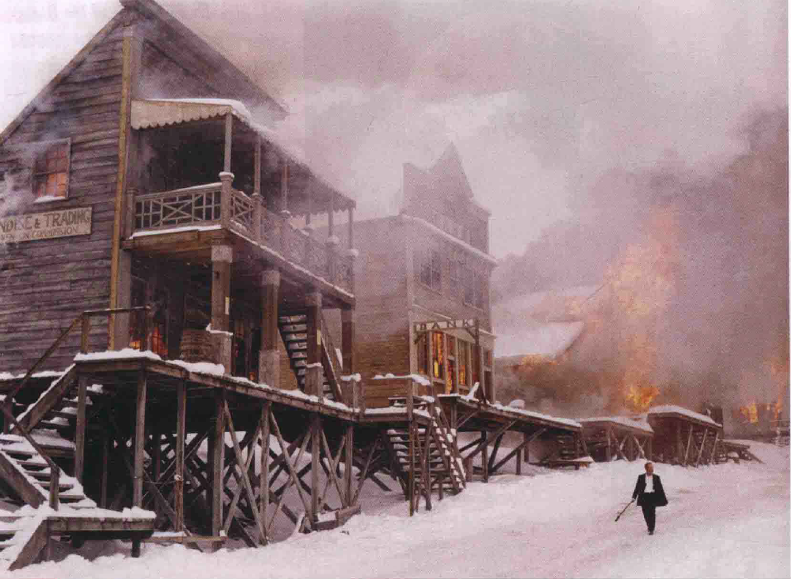
  * 因而，**把舞台剧搬上银幕**虽有难处，但绝少完全行不通的；**电影改成舞台剧**时，反而会困难重重，例如以外景为主的电影就施展不开
    * 上千舞台剧搬上过银幕．而甚少成功；但电影改在舞台上最成功的有迪斯尼卡通经典《**狮子王**》（The Lion King）和《**美女与野兽**》（Beauty and the Beast），也许是因为它们比真人实境的电影容易再创造吧
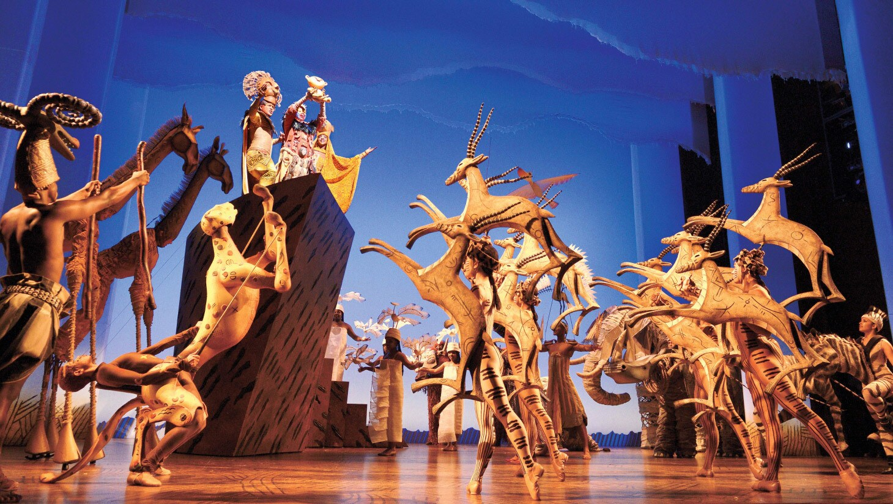
  * 把舞台剧加以“**扩大**”（例如把内景都换作外景），却也不见得是把戏剧改成电影的最好方法；电影并非就等于大远景、大幅度摇镜以及快节奏剪辑
  * **希区柯克**就发现，许多由舞台剧改编的电影之所以失败，原因是电影导演改编舞台剧时，用了**不适当的电影技巧**把原剧“撑大”，因而失去了原剧**结构上的紧密**
## 导演
* 在20世纪50年代中期，法国《**电影手册**》推广了**作者论**（author theory），强调**导演**在电影艺术中的重要性，认为**负责场面调度者**即为“真正的作者”，其余合作的人，像剧作家、摄影师、演员及剪辑师等，都只是这位作者在技术上的助手
  * 作者论无疑**夸大了导演的权力**；尤其是在美国，因制片厂制度注重的是**团队合作**，而非个人的表现，曝光的是**明星**而非导演
  * 即使是今天，**大部分的好电影**（不论哪个国家）都是“**导演**”的电影；说一部电影除了导演手法外，其余样样都好，就好像说一出戏除了剧本外样样都好一般矛盾
  * **伯格曼**为电影大师，也是瑞典最著名的舞台导演，他数十年创作生涯中非常多产，与同样的演员合作宛如**电影的剧场作风**；他的低成本杰作多为**家庭电影**，许多在家中拍摄，演员互相熟识，与他合作甚笃，能不费时间精力及金钱便达到他的需求
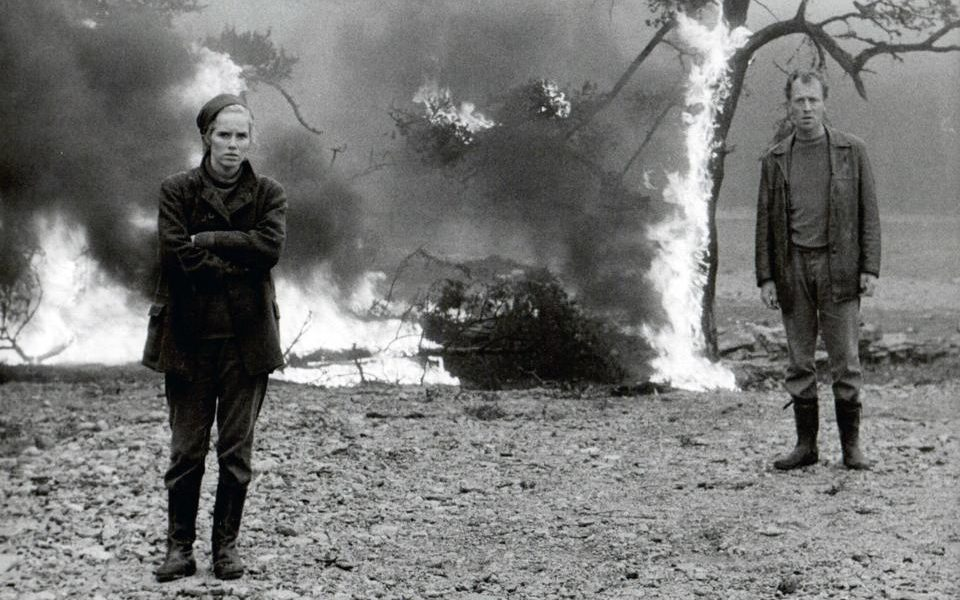
* 舞台上的导演基本上负责的是**诠释的艺术**，如果我们看了一出很糟的《李尔王》，我们不会怪莎士比亚的剧本写得不好，只会怪导演的诠释有问题
  * **剧本**是戏的灵魂，剧作者已替导演能做的事设了限，舞台上导演所司的各种视觉元素，与剧本相比都是**次要的**
  * 剧场导演和剧本的关系，正如同演员与其所扮演之角色的关系：演员能让剧本生色不少，但这些贡献通常**不及剧作本身**
* 舞台导演是**剧作者和工作人员**之间的桥梁，负责**各部门沟通**的工作，对诠释剧本定出一个大方向，再引导演员、设计师等进行各部门诠释工作
  * 舞台导演在**排演**时最有影响力，等幕一升起，导演对舞台上的种种就**无能为力**了
* 相形之下，电影导演对最后成品的控制就**大得多**；电影导演对作品的要求可以**非常精确**，这在舞台上是办不到的
  * 电影导演可以**完全照他们想要的样子**来拍摄人与物，而且可以**一再重拍**；电影靠影像来传递信息，而导演决定了所有视觉上的元素：镜头之选择、摄影机角度、灯光、滤镜之使用、光学效果、构图、摄影机之运动以及剪辑
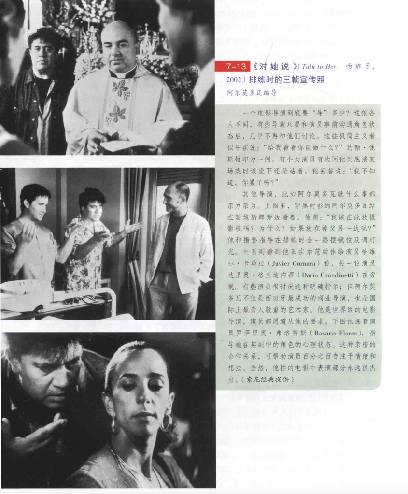
* 舞台本身的**三维空间**，使得导演必须运用特定的概念，才能对空间作清晰的界定；拿传统式的**马蹄型舞台**来说，观众得假装是从**被移开的第四面墙**向屋内窥视
  * 如果是伸入观众席、三面开展的舞台，演出者就必须顾及**环绕周围的三面观众**，而不能只对一方表演
* 电影导演则以**二维空间**来呈现立体的三维空间；即使运用**深焦摄影**，所谓的“景深”也依然是假的
  * 由于摄影机可以**随意安置或移动**，电影导演自然不受限于场景或舞台概念的空间；水平视线的**远景镜头**，多少对应了传统马蹄式剧场观众的视野，但电影中用到**特写**时，并无损于空间的延续性
  * 摄影机以**景框**界定出“特定的空间”，景框就如同舞台上的“墙”；于是每一个镜头都意味着一个新的被界定空间，也都自有其暂时的各种向度
  * 因此，演员可以从**任何方向**入镜；而摄影机的**推拉或升降**，更能把观众带进场景之中，让静止的物体从观众身边流过
  * **亚里士多德**说戏剧就是“**动作**”（action），这是他公元前350年的《**诗学**》讨论戏剧时定的第一规则，电影里，这个规则更重要；舞台常将动作的结果戏剧化，电影却专注于动作本身，比如像《**天国王朝**》这部十字军东征时基督徒与穆斯林之间战争的惊险电影，导演剪辑版光碟比原片长约一小时，许多影评人认为比故事断裂、人物苍白的公映版好很多
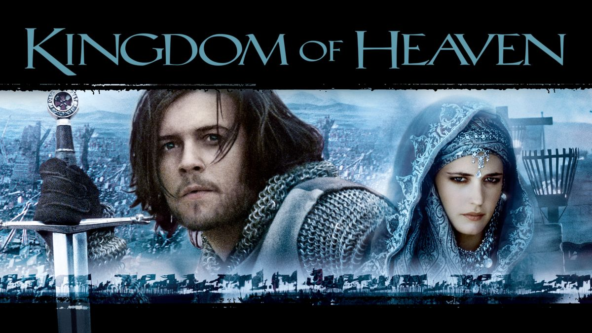
* 舞台导演的场面调度**受限于场景**，多少得做**某种程度的妥协**，既要追求**表现**，又必须求其**清晰**，这对写实取向的戏而言是很困难的
* 电影导演因为可以**运用镜头**，在这方面也就较不需要妥协，有些电影可以用到**一千个以上的镜头**，导演也可以用五六个镜头**拍同一件东西**——有的镜头是为了把这东西清楚地呈现，其余的镜头则是为了效果的表现；又或者演员可以**背对摄影机**，而声带却让观众能清晰地听见演员说的话
* 将舞台剧改编成剧本时，导演通常有**上千个选择**，甚至将原著改成剧作家想象不到的样子；如果是**古典作品**，导演也可以强调其心理、社会或史诗特性，这可由电影中的**空间运用**来决定
  * 如何将舞台剧“扩展”为电影并无硬性及简单的规则，有时最好别画蛇添足；伊利亚·卡赞改编**田纳西・威廉姆斯**（Tennessee Williams）的名剧《**欲望号街车**》时，原想添加场面，把舞台上忆及的猥琐事件拍出来，用以戏剧化地形容脆弱的布兰奇，但他的实验并不成功，他承认**多不如少**：“该剧的力量完全来自其压缩的处理：布兰奇被困在两个小房间，逃也逃不出去。”卡赞决定把全片放在两个拥挤的房间拍摄，电影大获成功，得了许多奖

  * 另一方面，《**为黛西小姐开车**》电影的成功，是因为它把舞台剧扩展了，**阿尔弗雷德·乌里**（Alfred Uhry）的半古装剧原来在舞台上仅是三个简单角色的素描，既无布景，演员也仅是虚拟象征性地与道具表演；但乌里自己改编的电影，增加了事件、角色，也有实景，评论者均认为电影优于舞台剧，因为它质地更丰富，时空更明确，此片获得了奥斯卡最佳影片大奖，乌里自己也获得最佳编剧奖
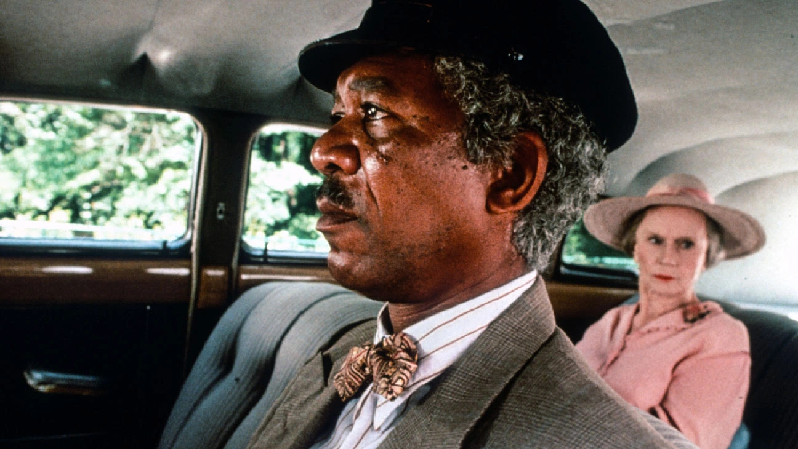