# 戏剧（2）
## 布景与装置
* 在最好的影剧作品中，布景都会成为**主题与人物的延伸**
  * 布景可以**传达许多信息**，尤其是在电影中；舞台上的布景无须像电影搭景那么**周密细致**，因为剧场的观众离舞台太远，无法看清细节
* 舞台导演能使用的剧场**空间有限**，所以总是得一再地迁就其布景
  * 舞台导演所能用的空间有一定的大小，通常是像“远景镜头”的范围；当舞台导演想暗示戏中的空间极大时，他可试着**以小喻大**，也可以用画了天空的景片来帮助观众想象
  * 至于舞台导演为显示空间之局促，而将表演区域划得很小时，必须注意长时间把演出局限在一小块区域，会使观众很不舒服
* 电影导演在使用布景上有**较大的自由度**
  * 电影能在室外拍摄，是电影的一大优势，许多大导演的主要作品都以外景戏为重
  * 实景拍摄吸引人，当然是因为比较**便宜**，也赋予电影**真实感**；《**铁面无私**》此部禁酒时期芝加哥背景的帮派电影主题是恶名昭彰的帮派头目之没落，德帕尔马在片中还对爱森斯坦《战舰波将金号》的“敖德萨阶梯”一场戏致敬
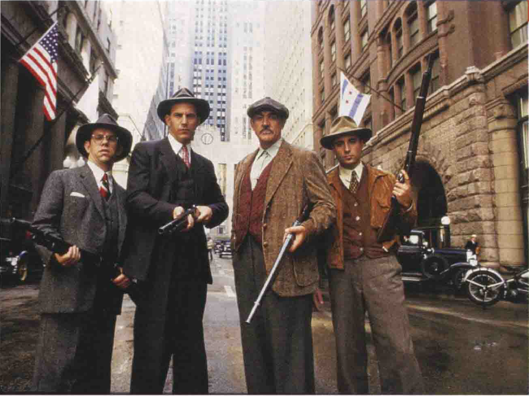
  * 勇夺最佳影片、最佳导演等九项奥斯卡大奖的《**末代皇帝**》是根据溥仪一生真实故事改编，他三岁登基，在紫禁城中孤寂过日，晚年在社会主义中国的20世纪60年代怡然当园丁；贝托鲁奇是首位被允许在紫禁城中拍戏的西方导演，紫禁城实景大大襄助了本片的真实性和情调性
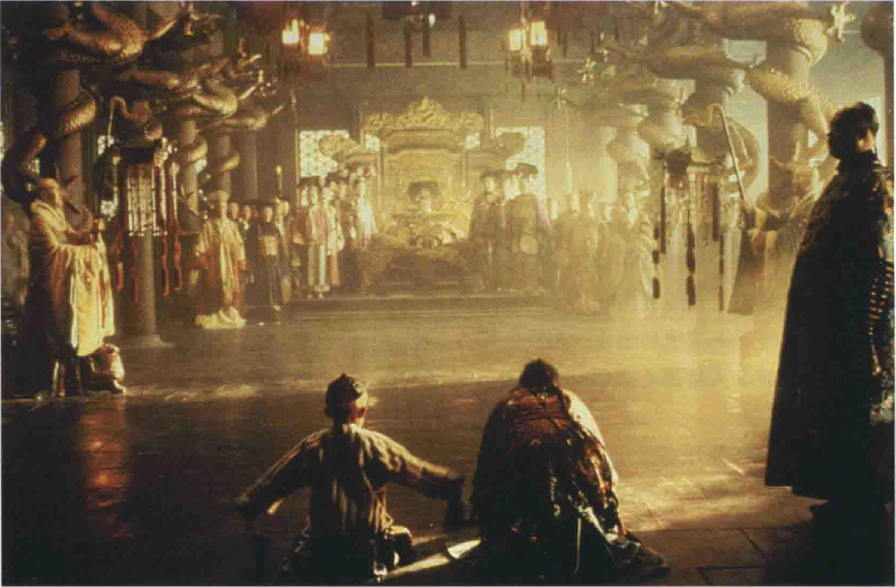
  * 其他类型，尤其是高度风格化、故意脱离现实的类型，则多半是制片厂内搭景拍成的，像歌舞片、恐怖片及大部分时代电影等
  * **蒂姆·伯顿**是当代电影最重要的表现主义导演，他是将灯光、色彩以及神话和想象幻化成神奇世界的魔术师；《**剪刀手爱德华**》场景全在封闭的制片厂制造，远远离开杂乱乏味的现实场景
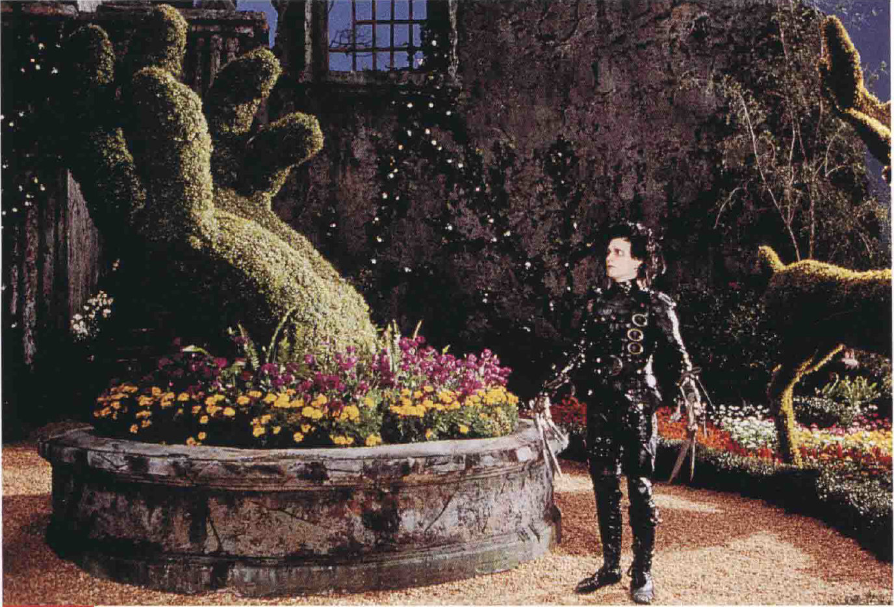
  * 表现主义的布景以奇幻招徕观众进入**想象及意识外的世界**，《**亲爱的，我把孩子缩小了**》中家中四个小孩子意外被激光缩小至蚂蚁般大小，像名著《格列弗游记》中一样改变大小，也改变了每日生活的视角，靠特效这种奇效得以实现
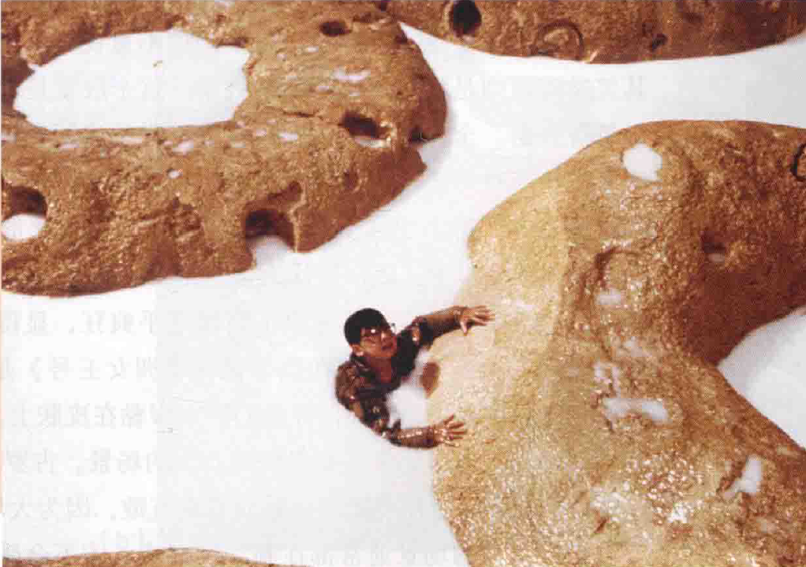
* 场景设计如电影的其他方面一样，也依传统被简分为**现实主义**及**形式主义**两种
* 现实主义这个名词并不单纯，它有**多样的风格**；某些评论家则用些修饰性的名词如“诗意现实主义”（poetic realism）、“记录现实主义”（documentary realism）及“制片厂现实主义”（studio realism）来做更好的区分
  * **形式之美**在**诗意现实主义**中是个重要的成分，约翰·福特在犹他州的纪念碑谷等地拍了九部西部片，是由于其景观美
  * 在其他现实主义电影里，传统上**较不重视美感**；像蓬泰科尔沃的《阿尔及尔之战》其美学价值则是特意造成粗糙的效果
  * 现实主义通常被视为无风格之风格，一种不惹人注意的呈现方式，但也不一定总是如此；**斯科特**是电影史上的大风格家之一，他营造的烟雾弥漫的气氛著名到电影界老手称之为“**雷德利·斯科特样貌**”（Ridley Scott look）
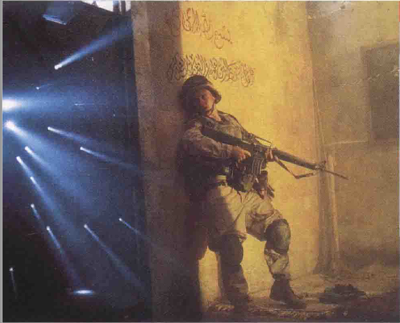
  * 素材在道德上的力量远比形式上的考虑还重要，场景之美在于**真实**；这类电影中，风格被认为是美化（扭曲），是一种虚伪的形式，因而是丑陋的
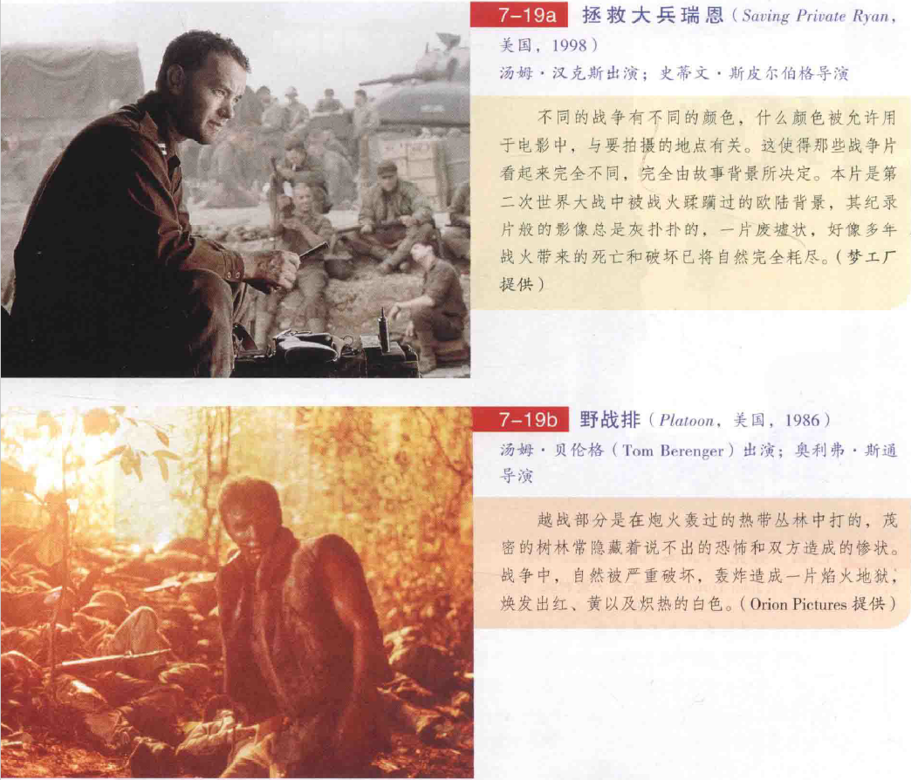
* 形式主义的场景通常都在**制片厂**搭成，才不会受到现实的污染渗透
  * **梅里爱**是个典型的例子，他被称为“电影界的凡尔纳”，因其变戏法的表演风靡了大众
  * 梅里爱总是画布景，通常用“**假像**”（trompeloeil）透视法暗示景深；他融合剧场演员和奇特的布景来制造**梦幻般的气氛**，用动画、微缩模型（miniature）及光学诡技，使观众如痴如醉
  * 形式主义场景引起我们对神奇感觉的兴趣，意大利著名设计师**多纳蒂**（Danilo Donati）的作品就是一例；在费里尼的《爱情神话》（Satyricon）、《阿玛柯德》（Amarcord）及《卡萨诺瓦》（Casanova））中，夸大的服装及场景都是纯想象的产品——费里尼的作品就如多纳蒂的作品
  * 例如《**阿玛柯德**》是费里尼少年时家乡小镇雷米尼（Rimini）的风格化回想（其片名在罗马方言中的意思是“我记得”）；但费里尼是在制片厂拍这部片子的，而不是外景，他希望抓住的是感觉，而不是现实
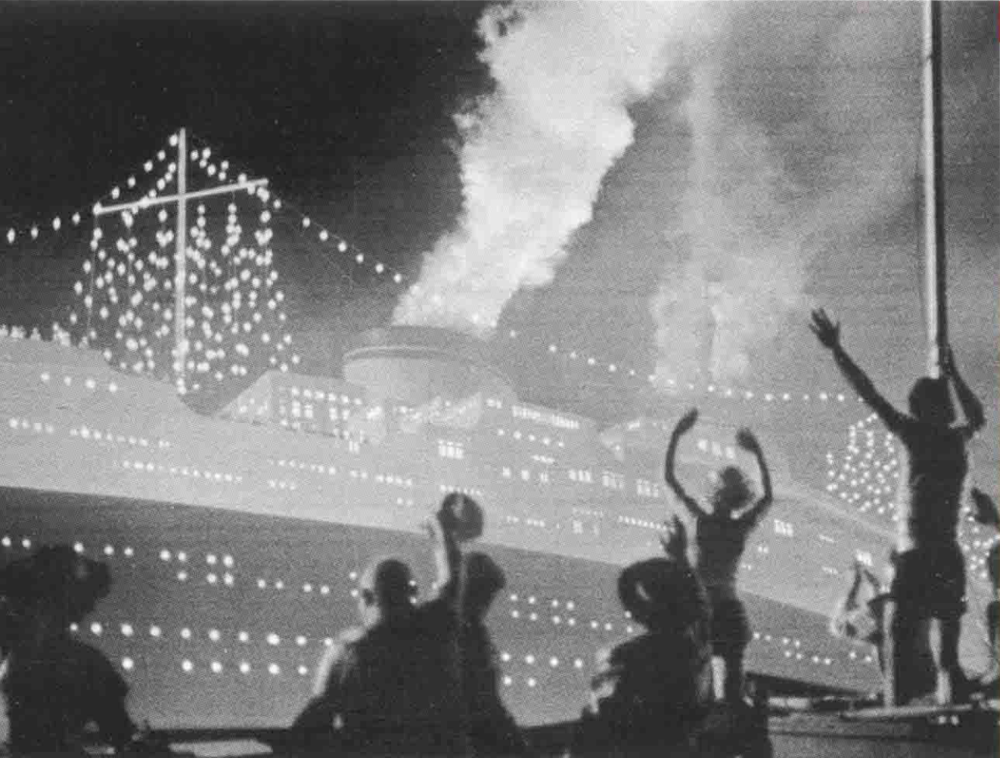
  * 第一次世界大战后，德国兴起一股**表现主义风潮**，认为**视觉设计**的重要性凌驾一切，这个运动影响了剧场、平面艺术及电影，是种沉浸在**焦虑与恐怖**中的风格
    * 所有场景蓄意人工化：平板、明显用画的、颠覆传统的透视与比例大小，目的在于呈现人如梦似幻般的心智状态，而非某个实际地点；灯光与布景也小心安排，刻意制造阴影，以扭曲形状，塑造如幻觉般的气氛；画面上绝对避免出现地平线与垂直线，尽量布满斜线以制造不稳定感及视觉的障碍；演员夸张、扭曲如机械般的表演风格传达了人格解体的企图
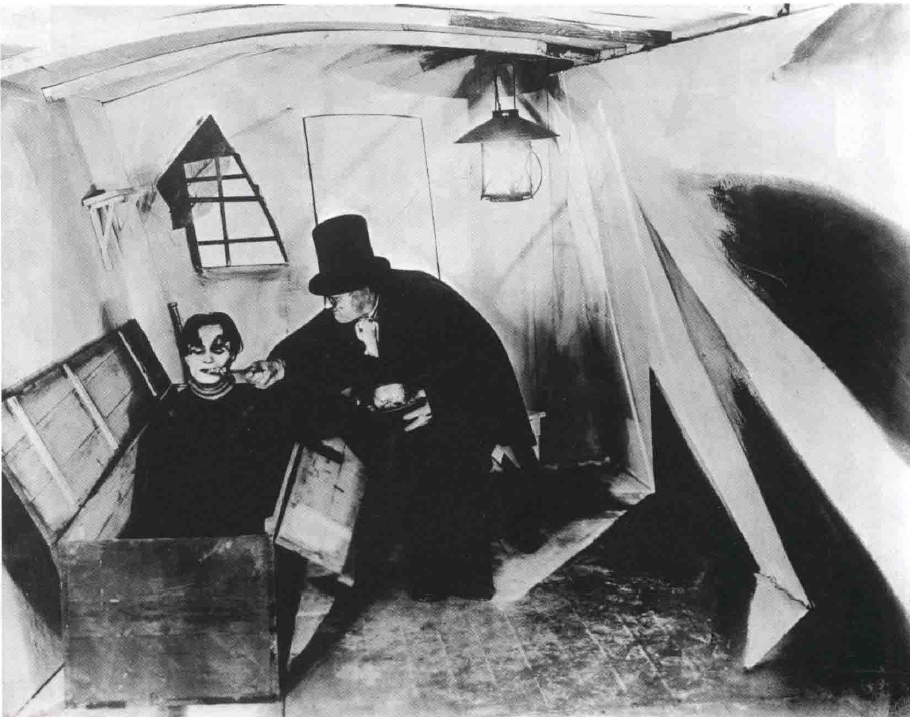
  * 《**巴顿·芬克**》这部有时代背景的电影有多重乐趣，其中之一即其绝佳的“**新装饰艺术**”（Art Deco）风格的布景及陈设；这种风格在1925年至1945年支配了整个欧洲和美国，流线型的线条、简单的装饰、优雅的曲线、顽皮的锯齿状曲线，被视为近代设计的前锋，事实上，这种风格在美国20世纪30年代新装饰艺术的巅峰期就被称为“**现代派**”
    * 其不俗的流畅形式善用现代工业材料，如塑料（在20世纪30年代被称为酚醛树脂或卢塞特树脂）、铝、铬和玻璃金板等材质；光源经常是间接的，从墙上的装饰品后面或由透明的玻璃墙后透出，弯弯曲曲的线条反抗方方正正的严谨形式；风格化的雕像，通常是修长的女性裸像或男子肌肉发达的半裸像，展现了前卫的魅力和超酷的风格
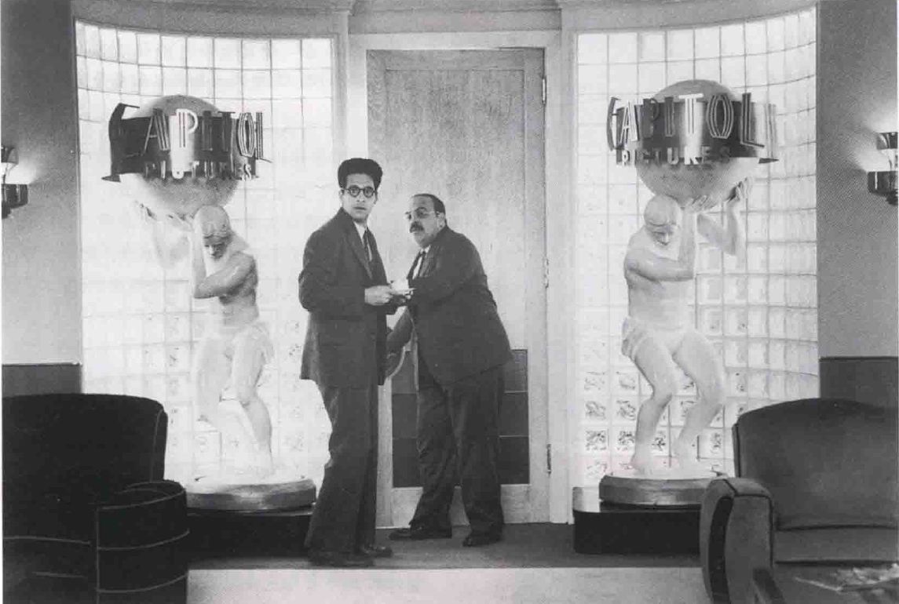
* 在好莱坞制片厂的黄金时期，每一个大制片厂都有其**特殊的视觉风格**，这大都是由每个制片厂的设计师决定
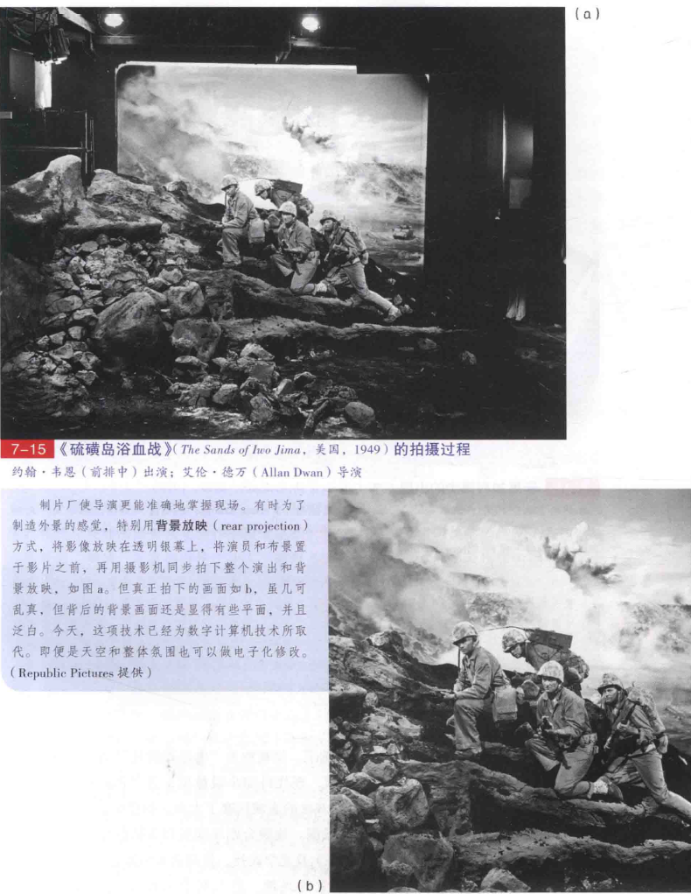
  * 某些人被称为**美术总监**（production designer）、**美术指导**（art director）或是**布景设计师**（set designer）；他们的工作是决定每部片子的“外貌”（look），他们和制片及导演需要密切合作来决定场景、装置、服装及摄影风格的统合，以制造统一的效果
  * 例如，米高梅擅长于迷人、豪华及奢侈的制作，它的美术指导**锡德里克·吉本斯**（Cedrie Gibbons）使每部电影都有米高梅的风格
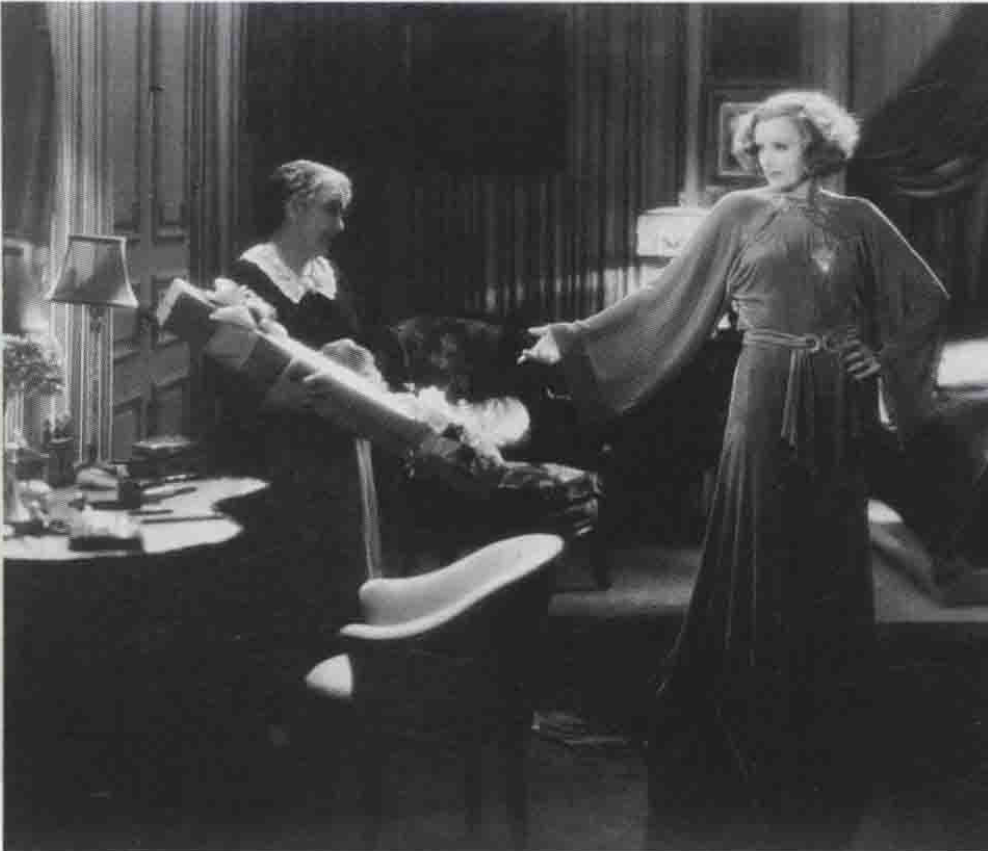
  * 华纳兄弟公司的美术指导**安东·格罗特**是个设计脏乱的、现实主义场所的专家，华纳宣称他们的场景是“从今天的头条新闻上撕下来的”，这是他们的宣传广告词
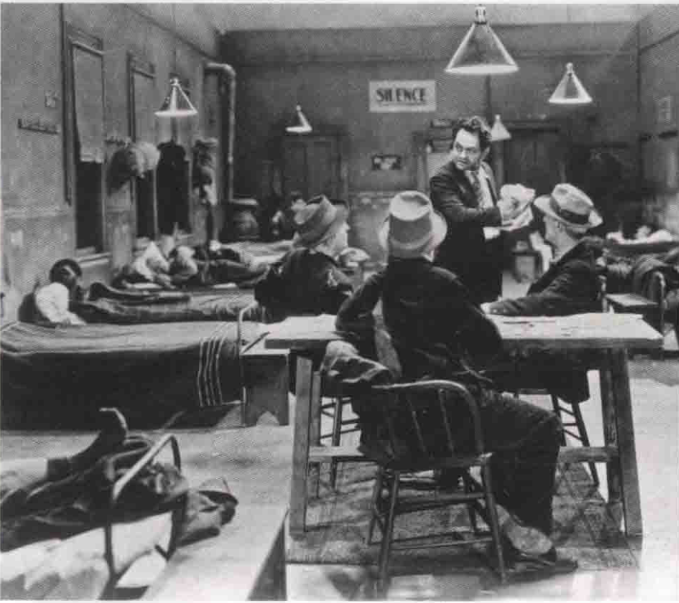
* 有时候在特定的要求下，制片厂会建造永久的**户外搭景**（back-lot set），可以一用再用；当然，他们都可用新的家具使其看起来每次都不一样
  * 假如一部电影需要庞大的场景——像《青山翠谷》中的矿村——都是建在离制片厂有几英里路的地方；同样的，大部分制片厂都有西部边陲小镇、大农场及中西部农场坐落在洛杉矶城郊

* 场景也能帮助**剧情的展开**
  * 费里尼的《**大路**》（是他最现实主义的电影）就利用自然景观的改变呈现了人物内心世界的转化；主角和他单纯的助手快乐地穿州过府卖艺，但后来他抛弃了她（助手），朝山里走，景色慢慢地变了：树叶掉了，遍地雪污，天空灰暗；这改变是主角心情的写照：大自然也为孤独濒死的助手悲哀
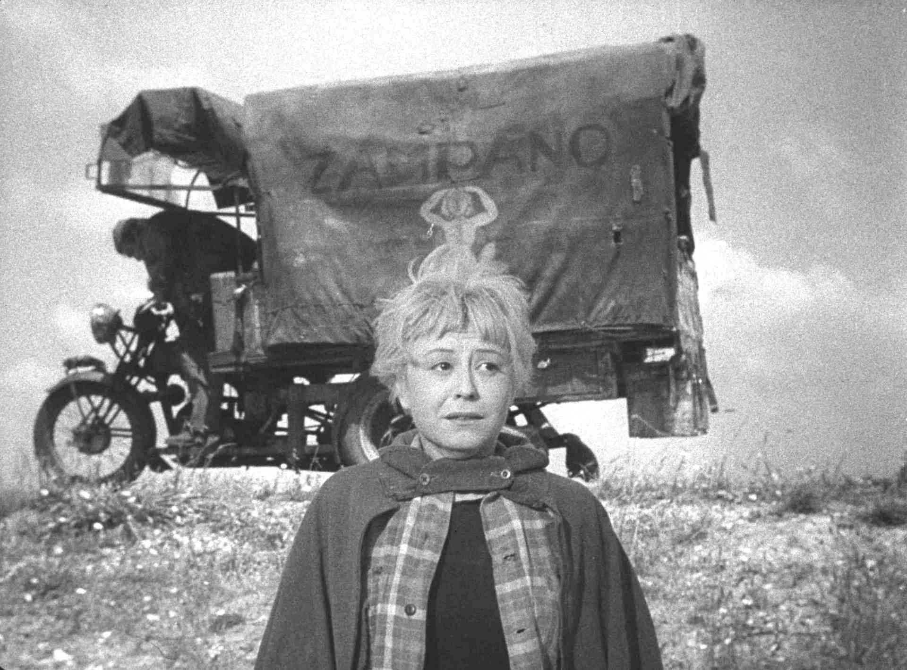
* 舞台的景只在**幕启时**受到瞩目，一旦演员上台，立刻就被观众忽视了，电影导演则可**随时**把观众的注意力带到布景上，提醒观众这布景所具有的意义；电影导演能根据需要（考虑其主题及心理因素），以**一连串的镜头**来呈现一个景
  * 在洛西的《**连环套**》中，一截楼梯成了片子主题的象征；主仆两人在楼梯上的相对位置不断显示了主仆间势力的消长，楼梯成了两人权力斗争的心灵战场，而梯上的扶手柱也被洛西转化为监禁主人的牢狱之柱

  * 即使房里的**家具**也能为**主题或心理情境**服务；爱森斯坦在授课时曾大谈一场戏中的一张桌子，这次课堂练习主要谈论的是改编巴尔扎克的小说《**高老头**》，这场戏发生在晚餐桌上，照巴尔扎克的描写，这张饭桌是圆的，可是爱森斯坦令人信服地说明了为什么拍成电影时，圆桌并不适合：因为圆桌意味着平等，每个人都是圆周的一分子；为了要表现一栋公寓里高度层级化的阶级体系，爱森斯坦建议改用一张长方形餐桌，公寓的女主人坐在上首，她喜欢的房客在靠近她的两侧落座，而卑微的高老头则孤零零地坐在桌子下首
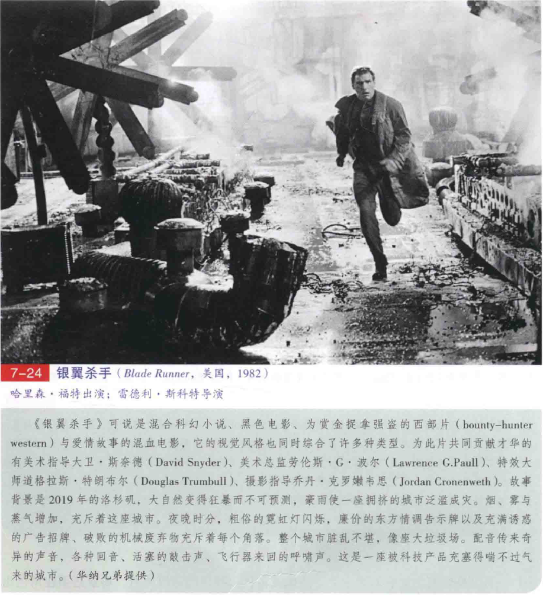
* 像这种细致的考虑，正显示了大师与技匠的差别；一部电影的景可以强到成为整部片子的**中心焦点**
  * 库布里克拍《**2001太空漫游**》时，用了大部分时间拍宇宙飞船、太空运输站以及那绵延无尽的外层空间；几名剧中人几乎成了配角，比起片子真正的重心一景，剧中人实在显得极为无趣
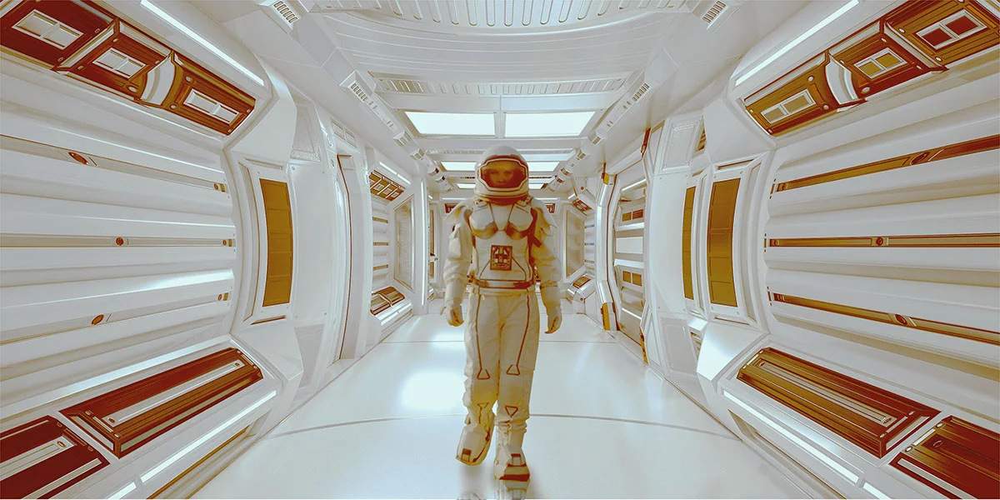
  * 要把这部片子搬上舞台是不可能的，其影像语言根本不能转换成剧场的规格；库布里克的电影就如巴赞所形容的，电影的功能是“**展现舞台无法处理的细节**”
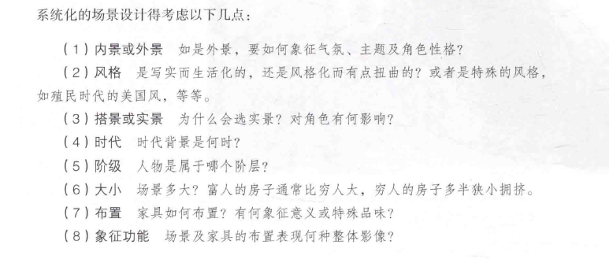

# 戏服与化妆
* 在电影和剧集中，戏服和化妆不仅仅是为了营造视觉效果，而是作为**表现主题和人物性格**的重要元素；它们可以通过各种方式来表现人物的社会阶层、心理状态和个体特性
  * **维斯康蒂**是一位**马克思主义信徒兼贵族**，擅长通过历史片中的服装和道具展示**政治立场和象征意义**；在《**豹**》中，他严谨地展现了维多利亚时代的**奢华和矫饰**，以批判上流社会的**非实用性奢侈和对底层劳动力的掠夺**

  * **张艺谋**的电影《**满城尽带黄金甲**》以10世纪为背景，展现了奢华和史诗般的**视觉场面**，融合了多种艺术和文化元素，但其华丽服装的**实用性**受到质疑
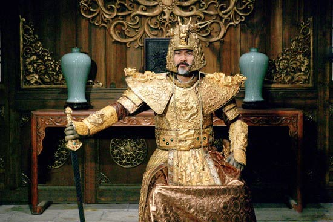
  * 《**玛丽·安托瓦妮特**》是一部描述18世纪年轻奥地利贵族少女成为路易十六王后的故事，她过着奢华的生活，尽管与国王的关系并不和谐，并最终在法国大革命时期赴断头台；影片突显她对**华丽服饰**的偏爱，由卡尼奥内罗（Milena Canonero）设计的衣服奢侈昂贵到足以解决巴黎所有穷人的温饱问题
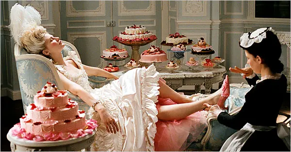
* 戏服和化妆的设计可以依靠**色彩、线条和剪裁**等元素来表达特定的性质和心理现象
  * 泽菲雷利的《**殉情记**》里的服装则以**色彩**作**象征式的运用**
    * 朱丽叶的家族是**活跃的暴发户**，他们的颜色趋近于“热”的红色、黄色、橙色；罗密欧的家族则是**古老权威**，但正在衰败中，他们的服装多为蓝色、深绿及紫色；两家仆人的服装正呼应了这两种安排，让观众能在打斗的场面**分辨双方**
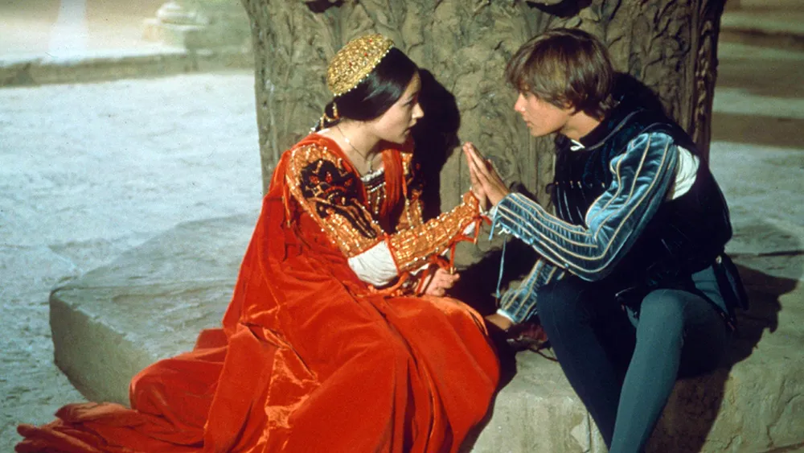
    * 服装的颜色也可用来**暗示转变**，朱丽叶的服装开始时是活泼的红色，但她和罗密欧结婚后，变成了冷的蓝色系
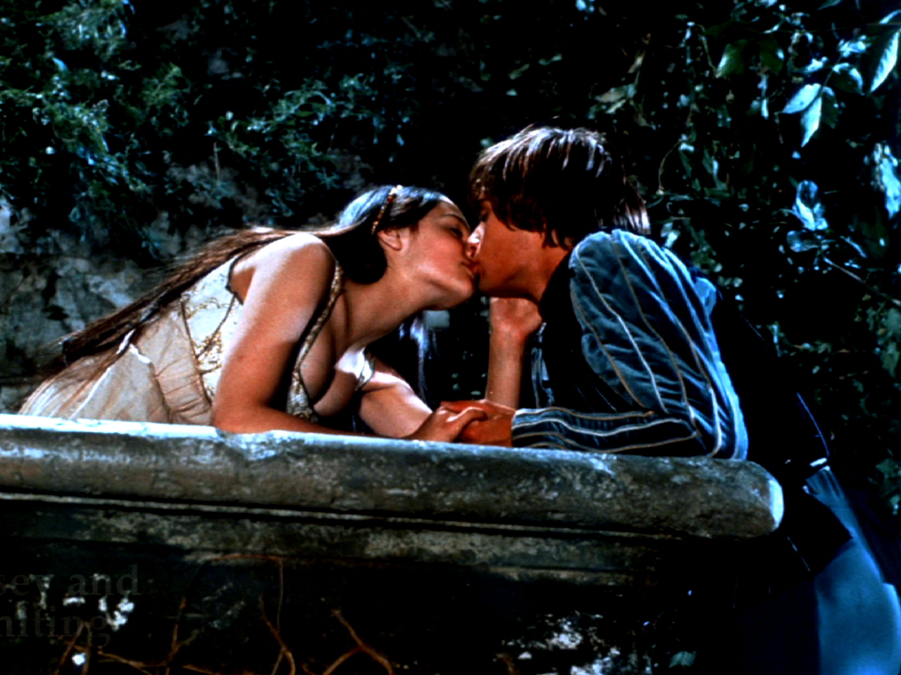
    * 线条也可暗示**心理现象**，垂直线强调庄严及尊贵——如罗密欧家的蒙太古（Montague）夫人，水平线则强调粗俗及滑稽（如朱丽叶的奶妈）
  * **卓别林**的流浪汉服装是对其角色性格和社会地位的一种象征
    * 小胡子、帽子加上手杖，摆明这是位又麻烦又爱漂亮的家伙，尤其那根手杖更点活了他的**自鸣得意**；然而他特大号的裤子，靠条绳子拴住，过大的皮鞋，加上过紧的外套，处处表明了卓别林的**卑微贫困**
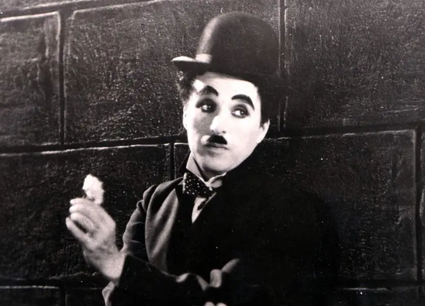
    * 这套服装象征了卓别林对人的看法：自欺、徒劳、荒谬，以及最重要的，令人伤感的脆弱
  * 在电影《**蝙蝠侠：黑暗骑士**》中，**诺兰**和已故的演员**希思·莱杰**共同将小丑这一角色塑造成一个**黑暗且神经质**的人物，而非传统的滑稽角色
    * 莱杰通过自行设计的混乱血红色嘴唇、悲伤的小丑白粉和黑洞般的眼眸，成功展现出一张令人恐惧、疯狂的“小丑”脸，加强了角色的**神经质**和**不按牌理出牌**的个性
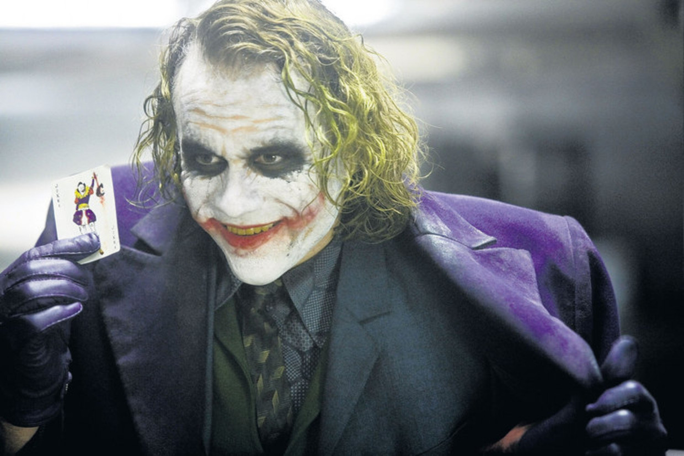
  * 在电影《**坎大哈**》中，一位阿富汗出生的加拿大记者变装返回受塔利班统治的故乡，试图拯救即将自杀的妹妹并揭露妇女所受的压迫
    * 在这片背景下，穿着**全身黑袍**的妇女如炼狱中的幽灵般在场景中移动，身份难以辨认
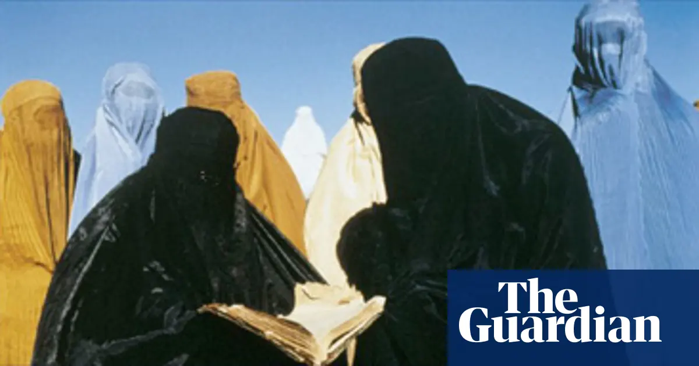
* 服装不仅要体现演员的**身形特点**，而且在**古装片**中还需强调演员身上的**某些特点**来配合角色性格
  * 如果**演员身材**上有什么特性的话（如黛德丽的腿、梦露的胸脯、施瓦辛格的胸肌），服装师必须强调这些特点
  * 电影《**永远的蝙蝠侠**》中的戏服设计巧妙地强调了**男性肌肉线条**，赋予角色**强壮而性感**的视觉效果，但实际穿着体验**繁重且不适**；这种设计目的在于**塑造角色的身形**，使其看起来更加符合观众对超级英雄的期待，尽管这增加了演员的负担
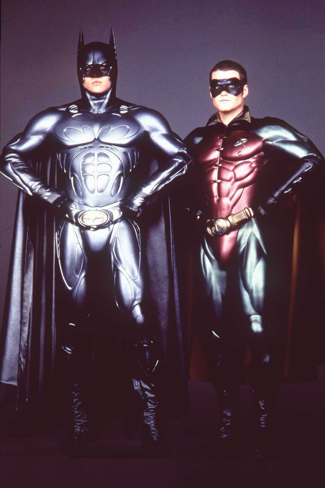
* 而在好莱坞的大制片厂时代，往往会强调明星的**天生丽质**，有时这种强调甚至会与电影的时代背景**产生冲突**
  * 即使像**约翰·福特**这样大牌的导演也无可奈何；在他1946年的《**侠骨柔情**》（My Darling Clementine）中，背景是荒凉的边城，但福克斯公司的红星**琳达·达内尔**（Linda Darnell）却化着撩人的浓妆并梳着20世纪40年代的发型，虽然她演的是廉价的墨西哥妓女，但看起来却好像刚踏出蜜丝佛陀的美容沙龙
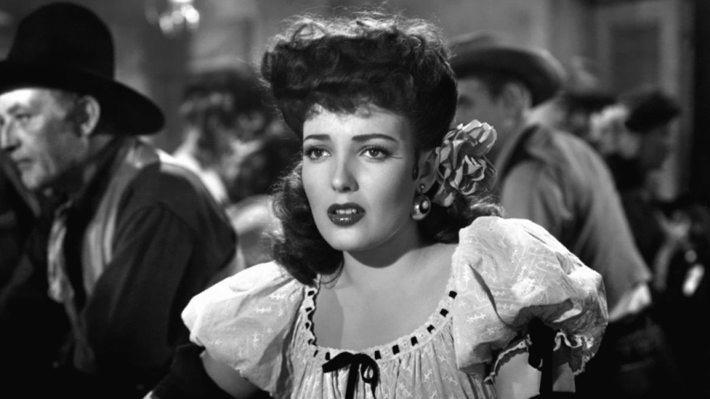
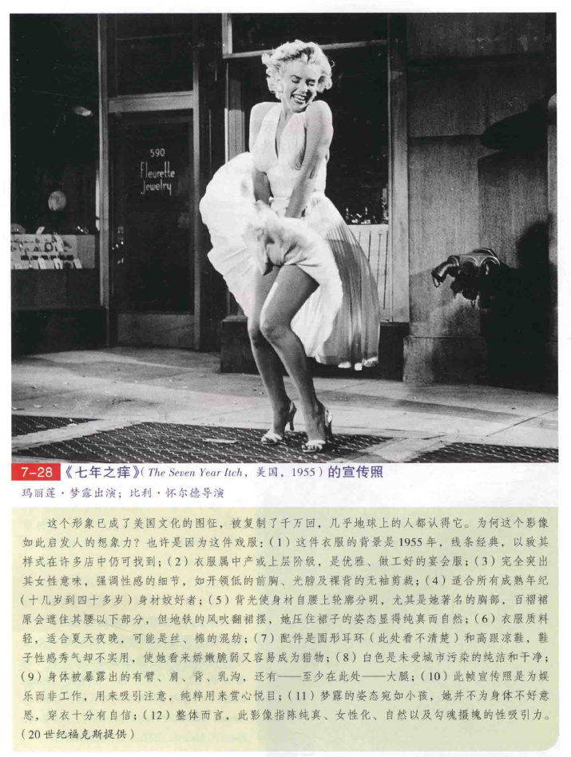
* **现实主义电影**中，服装设计往往要**舍弃个人风格**，更多地考虑角色的**社会阶层和生活背景**，比如用旧衣服来体现角色的贫困状态
  * 《**码头风云**》描述的是码头工人和劳工阶级的生活，服装就必须破旧；服装师**安娜·希尔·约翰斯通**（Anna Hill Johnstone）在码头附近的旧衣店买了不少衣服
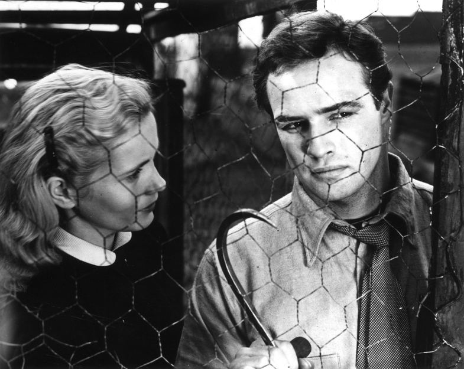
* 服装是电影的**另一种语言**，就像其他的电影语言一样，是**传达复杂感情的媒介**
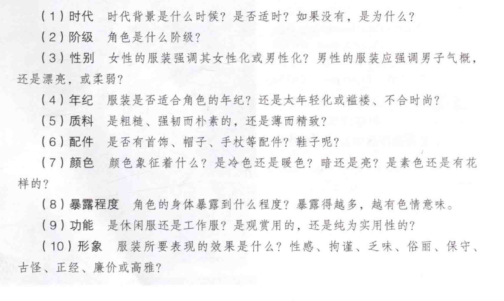
* **舞台妆与电影妆**的对比：
  - 舞台妆通常更**浓重**，突出五官特征
  - 电影妆更为**收敛**，但有例外，如卓别林在拍摄远景时仍使用舞台妆
  - 电影中**细微的妆容变化**也可以传达重要信息
    - 例如《**罗丝玛丽的婴儿**》（Rosemary's Baby）中**米娅・法罗**（Mia Farrow）面色的逐步变化，暗示她腹中魔胎对她身体的逐步侵蚀
    - “**再生**”在英国文化和基督教中有重要性，它不仅是追求第二次机会的象征，也是很多移民和女性通过时装和化妆**寻找新生活和自我变革**的表现；而电影《**扬帆**》中的**贝蒂·戴维斯**则是这一“再生”主题的杰出代表，她的角色从一个被压抑的老处女变成了一个有自主权、迷人的女性
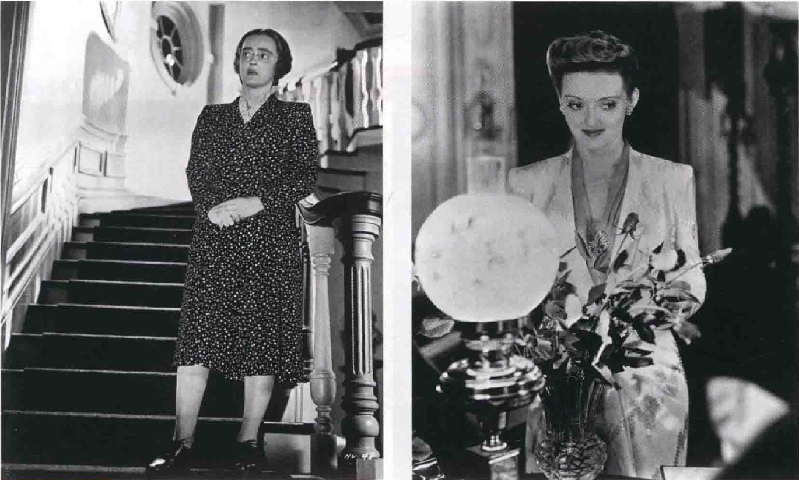
  * 电影妆在不同电影中的应用：
     - 《**汤姆·琼斯**》中的**城市人和乡下人**的化妆风格对比，表明不同的社会背景和性格特征
     - **贝拉斯通夫人**的浓妆象征其矫揉造作和堕落
     - **索菲·韦斯顿**的自然妆容代表其质朴的性格

* 电影妆与**表演者类型**的关系：
   - **明星**倾向于选择**增强个人魅力**的化妆，例如玛丽莲·梦露和玛琳·黛德丽
     - 在拍摄《**八点钟晚宴**》时，著名大制片厂米高梅利用其旗下闻名远播的女星以及服装设计师**阿德里安**的专长，展示了令人惊艳的女性服装设计，其中包括巧妙地遮掩身体缺点和突显优点，还有性感的**斜线剪辑设计**，使衣服性感地贴紧臀部；为了保持衣服的完美状态，制片厂特地设计了一种**靠架**，使女星在拍摄间隙可以站着靠着它阅读剧本，而不是坐下
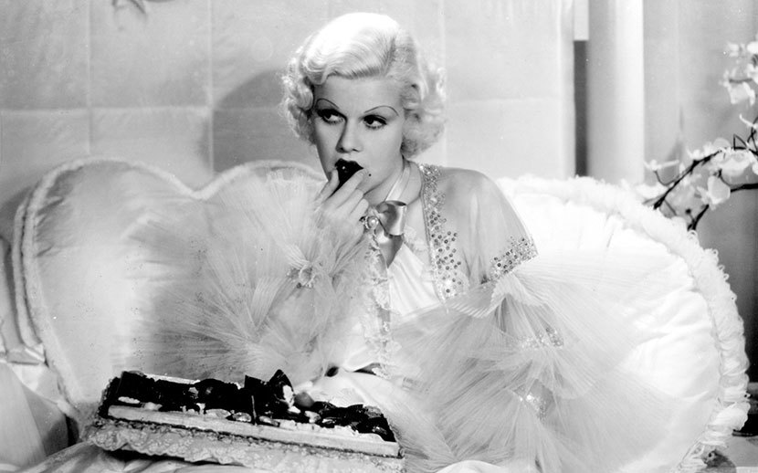
   - **专业演员**更注重**呈现角色的身份**，甚至使用化妆来掩盖本人的特征，如白兰度和约翰尼·德普
   - **业余演员**倾向于使用**淡妆**，强调外表的真实性和趣味性
- 探索**电影中的戏剧层面**：
   - 自问电影的**时间、空间和语言**有哪些特色
   - 考虑舞台改编作品的**场景处理和空间利用**
   - 分析**导演的主导权和布景选择**
   - 研究角色的化妆所传达的信息和**选择的妆容风格**
