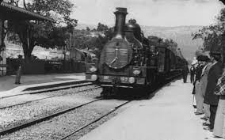
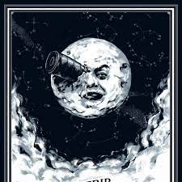
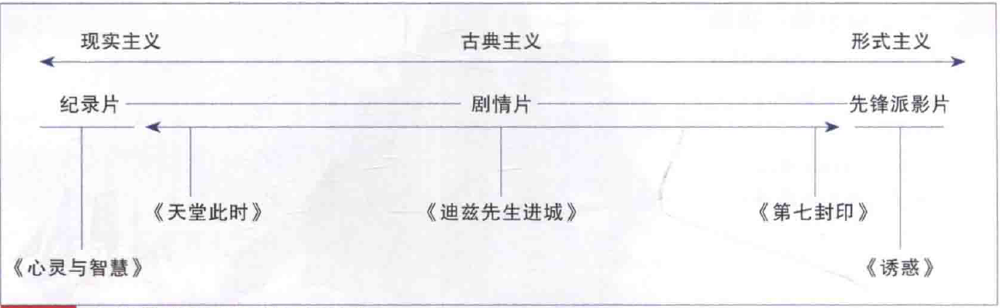
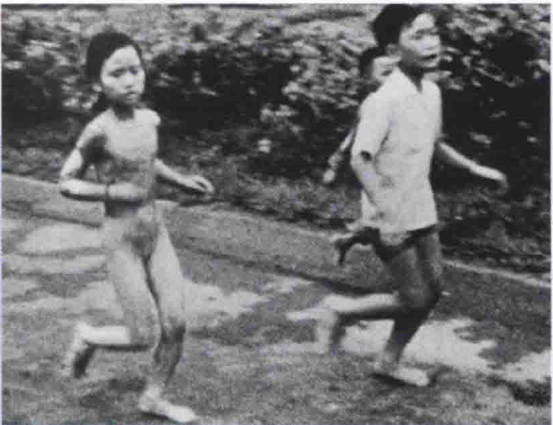
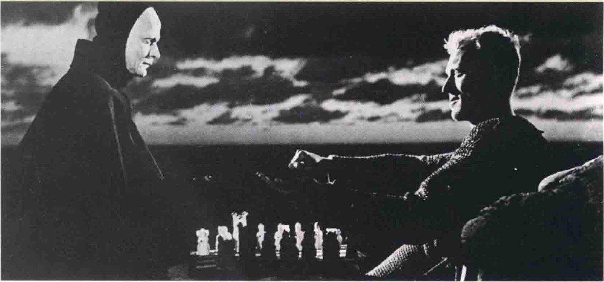
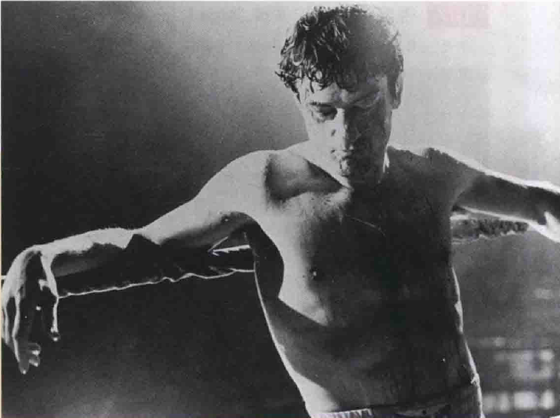
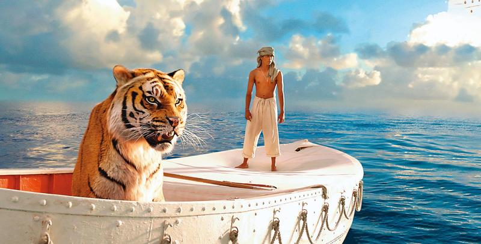

# 摄影（1）
## 现实主义与形式主义
* 早在19世纪末，电影已朝两个方向发展，即**现实主义**（realistic）和**形式主义**（formalistic）
  * 19世纪90年代中期，法国的**卢米埃尔兄弟**（lumiere Brothers）就用短片记录每日所发生的事，借以娱乐观众；诸如《**火车进站**》（The Arrival of a Train）等影片，会使得观众着迷，主要便是因为这些影片捕捉了事件流动、自然的影像，宛如随处可见的**真实生活**

  * 约莫同一个时期，**乔治·梅里爱**（Georges Melies）也拍了一连串强调纯属想象的奇幻影片；诸如《**月球旅行记**》（A Trip to the Moon）等电影，都典型地混合着**幻想**式的叙事和奇巧的摄影

  * 长久以来，我们都认为卢米埃尔兄弟是电影**写实传统**的建立者，而梅里爱则是**形式传统**的始祖
* 现实主义者较想保持一种幻觉，即他电影中的世界是未经操纵而较**客观地反映**了真实的世界
  * 评论家和理论家都称扬电影是所有艺术中**最写实**的，因为它能捕捉经验中**真正拟真的声音和影像**；电影现实主义的这种**临场效果**比任何其他艺术媒介或呈现方式都强，观众可以不用真正陷入危险却体验到其刺激
  * 现实主义的风格大致来说**并不醒目**；大部分现实主义者认为**内容**比形式和技巧重要，题材本身永远是最重要的，任何分散对内容的注意力的方法都值得怀疑
  * 摄影机的运用是相当保留的，它基本上是被当成**记录的工具**，尽可能不做“评论”地复制表面可见的事物
  * 某些现实主义者的目的常是**粗糙的视觉风格**，在形式上并不求完美；其最高准则是简单、自然、直接
  * 不过，这可不是说现实主义电影缺乏艺术性，因为最好的现实主义艺术擅长的便是**隐藏其艺术手段**
* 形式主义的电影风格就花哨许多，导演所关切的是如何表达他对事物**主观和个人的看法**，使其“世界”与真正可见的物质世界**大不相同**
  * 形式主义者通常是**表现主义者**（expressionists），形式主义的**自我表现**（self-expression）至少和题材本身一样重要，其内在的精神面、心理的现实，都可经由**扭曲**外在现实世界的表面达成
  * 摄影机被用来**评论题材**，是强调本质意义而非外在现实的方法
  * 形式主义的电影有相当程度的**操纵**和对“现实”**风格化**的处理
* 写实电影的极端会倾向**纪录片**（documentary），强调人与物的真实摄像；形式主义电影极端的例子往往可在**先锋派影片**（avant--garde）中看到，强调技巧与形式，这些电影非常抽象，其纯粹的形式（即非具象的色彩、线条和形状）构成了惟一的内容；大部分**剧情片**（fiction）都居于这两个极端之间，一般称之为**古典电影**（classical cinema）

  * 三种风格——**现实主义**、**古典主义**（classicism）和**形式主义**一之间的关系可以被视为一个延续性的光谱，而不是三个截然的范畴；相同的，三种电影基本类型——**纪录片**、**剧情片**和**先锋派影片**也只是为了区别的方便，因为在电影中它们经常彼此重叠
  * **纪录片**带给观众的震撼力通常来自其**真实**而非其影像之美；戴维斯的《**心灵与智慧**》这部控诉美国侵略越南的影片，主要是由电视新闻片组成，这是一张几个越南儿童在一场小区爆炸中逃离现场的照片，他们身上的衣服被汽油烧毁，几乎衣不蔽体

  * **现实主义电影**往往取材自**社会底层人物**，也往往探索**道德问题**，更倾向于强调**生命的基本经验**，其风格胜在让我们对他人同情，美丽的形式经常不及现实的质感和平常的感觉重要；一般而论，故事材料似松散地组织，也带有许多似与推进剧情无关之细节，仅增加了**真实感**
  * **古典叙事电影**通常避免极端的写实或形式主义风格，而比较倾向于带有一些**表现风格**，但影像的表面仍采取十分**具可信度的处理手法**，这类影片通常拍得不难看，但很少吸引观众注意到影像的风格；画面的取舍是由它们与**故事**或**人物**之间的关系来定，叙事线经常屈从于类型的惯例，剧中人物常会被塑造为独具魅力，甚至被**浪漫化**
  * **形式主义电影**作者的**个人标志**通常非常明显，故事基本上是导演个人情感的抒发，影片充满**高度象征性**的元素，情感均借形式传达，如《**第七封印**》这张宣传照中高反差的灯光设计；对客观现实的忠诚一般而言不是导演的考虑，艺术上**高度风格化**的影片类型如歌舞片、科幻片，都是形式主义的电影，这类影片通常专注于处理**不寻常的人物与事件**，并且以**处理概念**为胜——政治的、宗教或哲学上的——是喜欢抒发意见型的艺术家较常用的形式

  * 在**先锋派影片**中，题材通常以**抽象形式**出现，并强调**形式之美**，通常**非常个人化**，不易与外界沟通，并且经常沉溺于**图像式**的表现；很多先锋派艺术家都是从**绘画界**转入电影创作，因为着迷于影像具时间性及物理上具动感的层次
* 甚至“形式”和“内容”这两个名词也不是那么**壁垒分明**；一个镜头的**形式**——即一个题材如何被拍摄下来——即是其**真正的内容**，不一定与现实中该题材给人的印象相同
  * 传播学理论家**马歇尔·麦克卢汉**（Marshall McLuhan）曾经指出，一种媒介所传递的内容实际上即是另一种媒介
  * 比如说，用一张照片（**视觉影像**）描述一个男人吃苹果（**味觉**），内里就牵涉到两种媒介，每种媒介传播内容的方法亦不同；要用口语描述一张吃苹果男人的照片又会牵涉到另一种媒介（**语言**），其传播信息的方式也不一样
  * 这三种方式所传播的**确切信息**均被**媒介**决定，虽然，传播的**内容**是**相同**的
  * 著名的法国评论家**安德烈·巴赞**（André Bazin）提出了**组织形式**的理论——形式与内容在电影中是**相互倚赖**的
* 无论在电影或现实生活中，“现实主义”和“现实”都常被**滥用**，我们用这两个字眼表达如此多种不同的概念
  * 应当注意“**现实主义**”（realism）和“**现实**”（reality）的分野；现实主义是一种特别的“**风格**”（style），而“现实”则是所有电影（不论写实还是表现）的**原始素材**
  * 大家经常赞许《**愤怒的公牛**》的拳击场面相当“写实”，意思其实是说拳击场面拍得强而有力、紧凑且生动，而不是说它真的在风格上是写实的；事实上，片中的拳击场面**极度风格化**，整个场面以如梦似幻的慢动作、诗意的升降镜头和奇特的音效（类似嘘声外加丛林嘶吼声）所组成，影像和声音以断奏（staccato）的手法剪辑

  * 与此大相径庭，《**少年派的奇幻漂流**》的**电脑合成图像技术**（CGI）是如此奇特地写实，要是我们不深究的话，几乎相信那些都是真的
