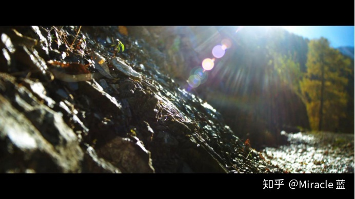
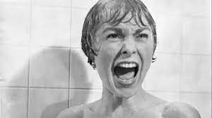

# 摄影（3）
## 光与影
* 一般来说，**摄影师**（cinematographer，亦被称为**摄影指导**（director of photography），简称D.P.）在导演的指示下，应该负责安排和控制电影的**灯光**和摄影的**质量**
* 很少有创作者会忽视电影的灯光，因为灯光能准确地**表达意义**，经由灯光方向和强度的变化，导演能**引导观众的目光**；但是电影的灯光很少是稳定不变的，只要摄影机或被摄物稍有变动，灯光就得**改变**
  * 拍电影所花的时间大部分都耗费在**调整**每个镜头复杂的灯光，每个**镜次**（take），摄影师都得考虑其内部的运动；不同的色彩、形状、质感，都会反射或吸收不等量的灯光，如果拍摄的是**深焦镜头**，情况就更复杂，因为打光时也必须考虑**景深**
* 艺术史家通常会区分“绘画”和“线条”风格，这种区分对影像艺术亦然
  * **绘画风格**线条柔和、感性，也浪漫，最具代表性的是**莫奈**（Claude Monet）的印象派风景，和**雷诺阿**（PierreAuguste Renoir）的人像画，其**线条不明显**，色彩和质感在强光的环境中**如雾般模糊晕散**
  * 相反的，**线条风格**（linear style）强调**分明的线条**，较不重色彩和质感；在绘画中，线条风格的代表艺术家如**波堤切利**（Sandro Botticelli）和德国古典派的**安格尔**（Jean-Auguste--Dominique Ingres）
  * 电影亦可有绘画或线条派摄影，视其打光、镜头和滤镜而定
  * **柔光**是**散射光**，由更大、距离更远的**主光源**形成的，用来照亮物体，被摄体上的投射光线不明显，它几乎**不产生阴影**；加上大量的**填充辅助灯**，以及对整个画面而不是特定点的聚焦，这种技术最适合描绘充满**希望和温暖**的场景，充满**浪漫的抒情效果**

  * **硬光**是**直射光**，将光源集中照射在**较小范围的主体**上面，同时**减少**周围的**辅助光线**，一般会打出很硬的**轮廓线和阴影**；这种形式的灯光通过在画面周围创造黑暗的阴影，制造**悬念和戏剧效果**，将人们的注意力吸引到画面的特定部分

* 当被摄体与摄影机的位置确定后，根据光源的投射方向同摄像机之间所形成的角度划分**光的投射方向**

  * 当光源与摄影机高度接近，处在同一水平面上，光线投射方向与摄影机方向一致时即为**正面光**；顺光照明可使被摄体**受光均匀**，其投影被自身所遮挡，不能够被看见，被摄物体**没有阴影**，但正面光不利于表现被摄体的立体感、质感和空间感，使画面显得**平淡**
  * 光源投射方向与摄影机拍摄方向成45度角左右的光线为**斜侧光**；被摄人物具有**较大的受光面**和**较小的背光面**，既能看清全貌，又具有一定的立体感，有显著的**明暗差别**，能较好地表现质感和形态感

  * 光源投射方向与摄影机拍摄方向成90度角左右时的光线为**侧光**（又可称**全侧光**）；全侧光照明会使画面**明暗对比明显**、反差较大，缺乏明暗过渡细腻的影调层次，但必要时可用来造成某些特定的光效，创造特定的光线气氛，如将脸放在半明半暗中，用于象征角色的**分裂**内在

  * 光源投射方向与摄影机拍摄方向成135度角左右的光线为**侧逆光**；运用侧逆光照明可较好勾画景物的**轮廓**，其正面**暗部面积较大**，形成特殊的气氛，也有利于表现**多层次景物**

  * 光源投射方向与摄影机拍摄方向成180度左右时的光线为**逆光**；它能勾画出景物轮廓，使被摄主体与背景分开，适合表现多层景物与大气透视以及空间深度，造成景物或人物的剪影、半剪影等不同效果
    * 任何位于**强光前面**的人或物都有些**恐怖的暗示**，因为观众总会将光与“安全”相联，任何阻挡此光源者，都威胁了这种安全性；但从另一方面来说，如果这种**背轮廓光**用来拍**外景**，反而会带有**浪漫柔和**的效果

* 灯光的风格有很多种，而且往往与电影的**主题**、**气氛**及**类型**（gere）有关
  * 喜剧和歌舞片，灯光的风格就较趋**明亮**，阴影较少布局，常用**高调**（high key）的风格，这种布光是通过提亮**主体上方的主光线**而形成的；高调打光的对比度较低，而且整个镜头的曝光更加均匀，可以把角色塑造得很有**亲和力**
  * 悲剧和通俗剧较常用**高反差**（high contrast）灯光风格：亮光处特别明亮，而黑暗处也相当有戏剧性
    * 高反差的灯光具有**戏剧侵略性**，能赋予被摄物体张力和视觉焦虑感，这场对决戏因发光的剑挥过黑暗而更具**动感**，同时也刺破了大面积的黑暗；高反差的打光在犯罪片、通俗剧、惊悚片和侦探片类型中甚为典型，这些电影中的暗光**象征**未知、骗人的外表以及邪恶本身

  * 一般而言，悬疑片、惊悚片和黑帮片则较趋**低调**（low key）风格，阴影均采用漫射式，亮光也带有气氛；通过将光源置于**拍摄对象之下**，这种灯光通过创造可怕和不祥的效果来设定可怕的角色
  * 每种灯光只有一种风格，而某些影像包含不同的灯光风格，例如，背景的灯光是低调，而前景中灯光却有些高反差
  * 一般而言，**摄影棚**内的灯光打法较为**风格化**及戏剧性，而**外景灯光**因为多采用自然光源，比较有**自然风格**    
* **黑色电影**（film noir）主要是根据灯光打法而定义出来的电影风格，是美国电影于20世纪40年代到50年代之间出现的一种类型；“黑”表示一个只有夜晚与阴影的世界
    * 它的大环境通常是在**城市**中，画面上都是一些**阴暗的街道**，在昏暗的酒吧里袅绕着香烟的**烟雾**，再搭配着象征**脆弱**的景物如窗棂、玻璃及镜子等，共同组成它的视觉风格
    * 场景大部分都设在**短暂停留的地点**，如临时租赁的破旧客栈、码头、巴士站和铁道，以及象征被困的窄巷、地道、地下铁、电梯与火车厢；画面充斥着**丰富的摆设**，如被霓虹映照的街道、沉积厚厚一层灰的百叶窗，以及寂寞的窗口中所露出的淡淡光影
    * 人物都是禁锢在移动的雾或烟影之中，视觉设计上强调**硬光**的打法，制造强烈的反差、不规则的形状及重叠的影像
    * 黑色电影的调性是**宿命**以及**偏执**，充满了**悲观**的语气，凸显人类处境的黑暗面，主题则围绕着暴力、爱欲、贪欲、背叛与欺骗

* 灯光既有**写实**也有**表现**色彩
  * 现实主义的人喜欢用**自然光/环境光**（available lighting），尤其是**外景镜头**
    * 不过，即使在外景，大部分导演仍得用些灯及反光板来**加强自然光**，或者使太阳强光**柔和**些，也有导演利用**感光较敏感**的底片，或者特别的**镜片**（lenses），而完全不用人工灯光
    * 自然光会使影像有**纪录片**的感觉，光的质感较**粗糙**不圆润；不过，也并非所有的外景光均显得刚硬，比如约翰·福特和黑泽明就会利用**特别的滤镜**，使外景地的光线带有柔和浪漫的**怀旧色彩**
    * 在室内摄影时，现实主义者喜欢利用**明显的实物光源**如窗户、灯架来打灯；或者，他们也会用**扩散式**的打灯法，以去除人工化和高反差效果，简言之，现实主义导演不喜欢用太显著的灯光，除非该景有明显的光源
  * 形式主义的导演则较偏向象征性的**暗示灯光**，他们常常以扭曲自然光源的方式强调灯光的**象征性**
    * 从被摄体上方投射来的光线为**顶光**；如果光源从**脸部上方**罩下，则会造成**天使般的效果**，因为这种光源暗示神的光泽降临，这种“神迹”般的灯效常会变得**老套**

    * 从被摄体下方投射来的光线为**脚光**；**比如说**，从演员**脸部下方**打的光，即使演员脸上没有表情，也会使他显得**阴险邪恶**

    * 至于**背光**（backlight，近似背轮廓光），会使影像**柔和优雅**；**爱情场面**以光晕效果拍摄恋人的头部会有浪漫的效果，背光用来强调女性的金发最恰当
      * 《**卡特教练**》根据一位真实教练的故事改编，他鼓励一群喧闹无纪律的篮球员成为赢球队伍；教练后面的光带给教练“精神”气氛，仿佛沐浴在上天的慈光中

    * **聚光灯**能使明暗产生**激烈对比**，乍看之下，这类影像显得变形、撕裂；形式主义的导演运用这种强烈的对比，营造出心理及主题上的效果
    * 创作者亦可将**光圈**放大，产生**曝光过度**（overexpose）的效果，使画面的表面充满**苍白的光**，梦魇和幻想的段落可常见这种处理法；有时这种技巧亦可用来**夸大情绪**

* 好莱坞大制片厂时代发展出**三点打光**（three-point lighting）技巧，至今仍在世界上通用
  * 这种打光法中，**主光**（key lighting）是光线的主要来源，制造影像之**主导性**（dominant），也就是说光照的地方造成强烈的光线光影对比，会首先吸引我们的目光；通常这一区亦是在外表和心理上最大戏剧性所在和动作焦点
  * **辅助光**（fill lights）没有主光那么强烈，作用在降低主光的强硬，显露一些**次要细节**不被黑暗吞噬
  * **背光**（back lights）则在分别前景和环境，赋予**三度空间纵深**的幻象
  * 三点打光的方法在**低调打光**的画面中最具**表现性**，如此图；相反的，当打光法是**高调**时，这三种光源会在影像上**平均分配**，造成较**柔和**的效果

* 自有人类以来，光的明暗就带有**象征性的意义**；《**圣经**》里充满了明暗的象征，画家**伦勃朗**（Rembrandt）以及**卡拉瓦乔**（Caravaggio）也喜欢用光影营造心理气氛
  * **希区柯克**以令人吃惊的方式扭转了我们对光亮明暗的认知；在希区柯克的电影中，每一个邪恶、隐晦的阴影都似乎在威胁主角的安全，然而却没有任何事发生，等到了光天化日之下，最大的危险却凌空而来

  