# 摄影（5）
## 镜片、滤镜和底片
* 相较于肉眼，摄影机的镜头不过是**机械装置**，因此电影中某些惊人的**扭曲效果**可以借由拍摄的过程来制造，尤其在形状大小及远近上；镜片不会做心理上的调适，仅**记录下一切**
  * 例如**靠近摄影机的物体看起来比远的物体大**，要是咖啡杯放在镜头前，而人物远离镜头，那么人物会完全被杯子遮掩
* **现实主义**导演喜欢用**标准的镜头**，避免造成扭曲，这种镜头使被摄物与人眼所见者相似；**形式主义**的导演则偏爱用**滤镜**（filters），企图改变表面的真实，这些光学滤镜会强调或压缩某些特质
* **镜头**的种类很多，大致可分为**三种**：不扭曲的“**标准镜头**”、**望远镜头**和**广角镜头**
  * **望远镜头**通常用来拍**远距离的特写效果**，其效果类似**望远镜**，由于具**较长的焦距**，我们有时称它为**长（远）镜头**（long lens）
    * 比如说，为了保障摄影师安全，我们可以用望远镜头摄取**狼的特写**；或者为了不引人注意，在远处摄下**行人甲的镜头**，避免行人朝摄影机瞪眼；有时摄影师亦可藏在车中，**透过窗户**摄取特写
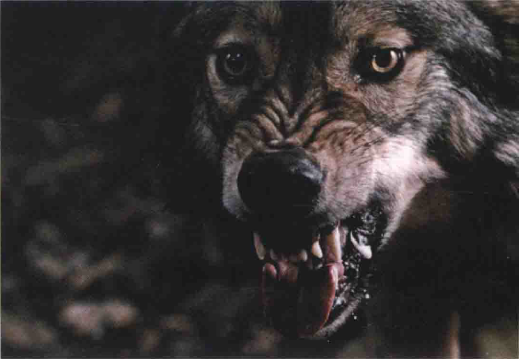
    * 望远镜头有时会造成**心理效果**，因为其焦点仅在**远处**，前景或背景往往会**失焦而模糊不清**，形式主义导演尤其爱用；镜片的焦距越长，对距离就越**敏感**，距焦点很近的事物亦可能**模糊**，这种在前景、背景或两者都模焦的方式可产生**显著的摄影效果**或营造气氛的效果
      * 有些望远镜头能将焦点准确地放在**动作的小细节**上，注意此图中沃克受伤的枪与背景均**模糊**，所以我们的目光就被迫专注在角色生死攸关一刻的**脸**上
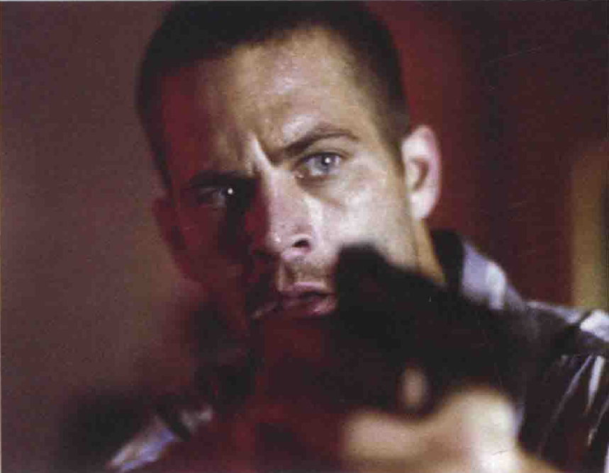
      * 望远镜头常用来加强影像的**抒情性**，此中模糊的背景与这些主角及他们之间**几无关联**，望远镜头成为两人只关注对方的证言

      * 身居高位的政治人物必须与属下任警察的情人分手，镜头**强迫**观众注意他的表情，而他的情人则几乎被柔焦**抹杀**，不被看重；如果导演要我们注意**她的情绪**，瑞姆斯就会失焦，而她清晰可见，如果导演要**两人都被强调**，他会用**广角镜头**使两人焦点都清晰
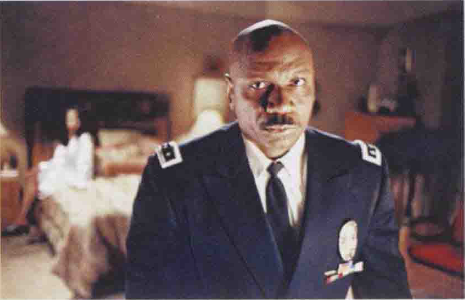
    * 长焦距的镜头在拍摄时可以调整，以指导观众的视线，这种技巧我们称之为**变焦**（rack focusing）或**选择性焦点**（selective focusing）
      * 在《**毕业生**》（The Graduate）中，导演**迈克·尼科尔斯**（Mike Nichols）**用变焦来取代剪辑**，使观众的注意焦点先在**女主角**身上，接着模焦，将焦点转至几英尺外的**母亲**身上；这个技巧一方面显示两者间的**因果关系**，也表示女主角突然了解男友的情妇竟然是自己的母亲

    * 长焦距镜头也会使影像“平板”，减少不同地点的**距离感**；在望远镜头之下，两个相距几码远的人，可能看起来相距咫尺，在这样紧密压缩的距离中移动，其**动感**亦会平板化而显得**没什么变化**
  * **广角镜头**或所谓的**短焦距镜头**（short lenses），即是深焦摄影中所有，目的在使镜框内所有的人或物都有**清晰的焦点**
    * **深焦摄影**一般而言是**客观的**、实事求是且不浪漫的，前景不见得比背景重要
      * 《**辛德勒的名单**》是讲述一个德国企业家（尼森饰）辛德勒，在第二次世界大战时从纳粹大屠杀中解救了成千上万的犹太人；因为深焦摄影可以使画面中**视觉母题**（visual motifs）的重复无限延长，斯皮尔伯格用这个来象征全欧的犹太人都被群聚在一起，但只有辛德勒名单中的犹太人才能幸运脱离死境
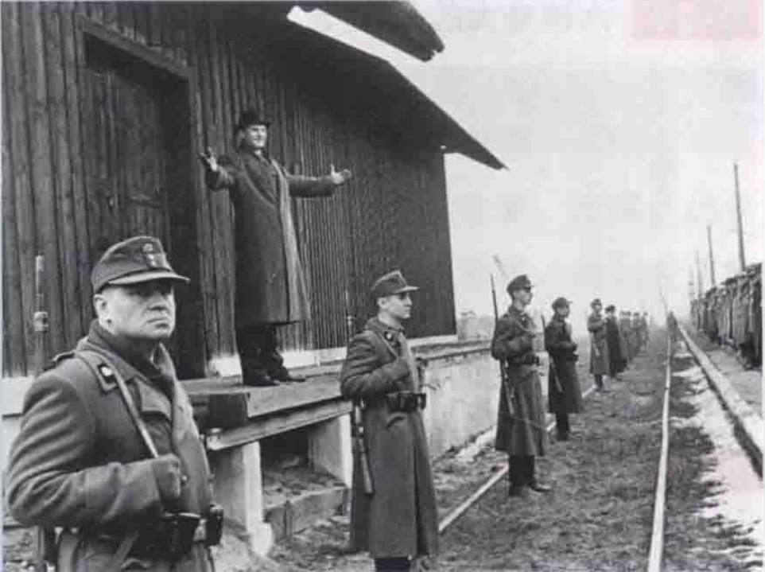
    * 广角镜头会造成线条和空间的**扭曲**，角度越广，线条形状就扭曲得越严重，尤其是影像的**边缘**
    * **距离**也会被**夸大**，有时银幕中两人只离一英尺远，感觉却像有几码远；朝镜头**纵深**走，几步路会显得有几丈远，特别可用来形容角色的奋力、无情和掌权
      * 超广角镜可以**夸张**不同纵深的距离，成为有用的**象征技巧**；成龙此图用广角镜来扭曲影像，使他的拳几乎如头一样大，脚简直在另一个地方

    * **鱼眼镜头**”（fish-eye lens）是广角镜头中**最极端**者，其线条已**扭曲至边缘**，好似我们在透过一个水晶球看世界
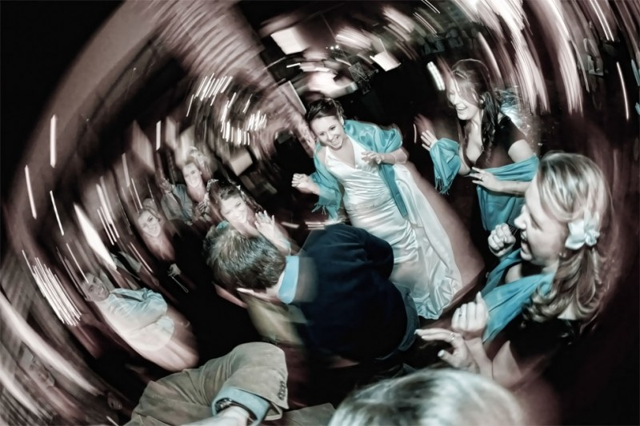
* **滤镜**的种类甚至比镜头还多，有些能捕捉、反射光芒，造成**钻石般**的光型（**十字镜**），有些滤镜能**压缩或扩张某种色彩**，对外景特别有用
  * **约瑟夫·冯·斯登堡**（Josef von Sternberg）有时会在镜头外罩一层**透明丝袜**，使影像带上一层浪漫、轻柔的色彩；有些具有魅力的女演员在上了年纪之后，甚至在合约中注明特写镜头只能用**柔焦镜片**，柔焦能遮掩住脸上的皱纹和皮肤的粗糙

  * 在**罗伯特·奥尔特曼**（Robt Altman）的《**花村**》（由维尔莫什·日格蒙德摄影）中，滤镜也发挥了大作用，外景用蓝、绿滤镜，制造**冬日飒冷之气**，而黄、橙滤镜用于内景，制造贫瘠地区木屋内的**温暖气息**

* **电影胶片**的种类也多，大部分分成两大类：**感光快**及**感光慢**两种
  * **感光快的胶片**（fast stock）对光线**敏感**，有时现场无灯光辅助，即使在**夜间**，仅靠有限光源亦能拍摄影像
    * 感光快的胶片传统上较与**纪录片**相联，因为它对光线敏感，能在事件发生的**当下**捕捉影像，不必浪费时间在**烦琐的灯光架设**上
    * 也因为它感光快，线条较为**模糊**，色彩也好似**被水洗过**，影像粒子粗到像**绘画**而非线条风格；尤其是**黑白片**，**光影反差**特别大，中间灰色的层次也往往**丧失**
    * 从20世纪60年代初期开始，许多**剧情片**的导演都喜欢用感光快的胶片，使电影显出纪录片般**紧迫的现场感**
      * 在《**阿尔及尔之战**》中，**莲泰科尔沃**耗尽精力记录阿尔及利亚人民与殖民的法国人奋战以争取独立的战役；原先许多观众以为此片为**纪录片**，是将像图中这种片段与许多纪录片片段组合而成，这些片段粒子粗砺，摄影摇晃，产生写实的印象，其实此片没有一寸底片是纪录片，全是**重新拍的**
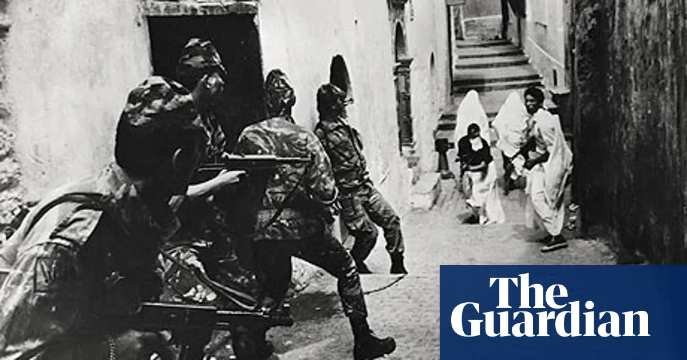
  * **感光慢的胶片**（slow stock）则对光线**不敏感**，有时甚至需要有比用感光快的胶片**十倍的灯量**才能使影像显现
    * 在传统上，感光慢的胶片能够显现**清晰而明确的细节**，线条**明朗**，色调**质感强**，对色彩也能捕捉其**真实的色调**
## 特殊效果
* **计算机制造的影像**（CGI）所创造出的奇幻美丽的新世界，已使魔幻奇妙的事物成为日常普通之事；这种在**20世纪90年代**趋于完美的电子科技，已经将特效做了**革命性的改变**
  * 在计算机影像发明之前，拍电影的人主要仰赖一种被称为**光学印片机**的东西来制造大部分**特效**（电影界用FX来代表特效），比如说，这部电影用了**重复摄影**（chronophotography，又称定时摄影）技巧，使两个舞者的动作停伫重叠，制造出**复影效果**（stroboscopic effect），如视觉诗篇般；如今光学印片几乎**已不存在**，全被数字和计算机技巧取代
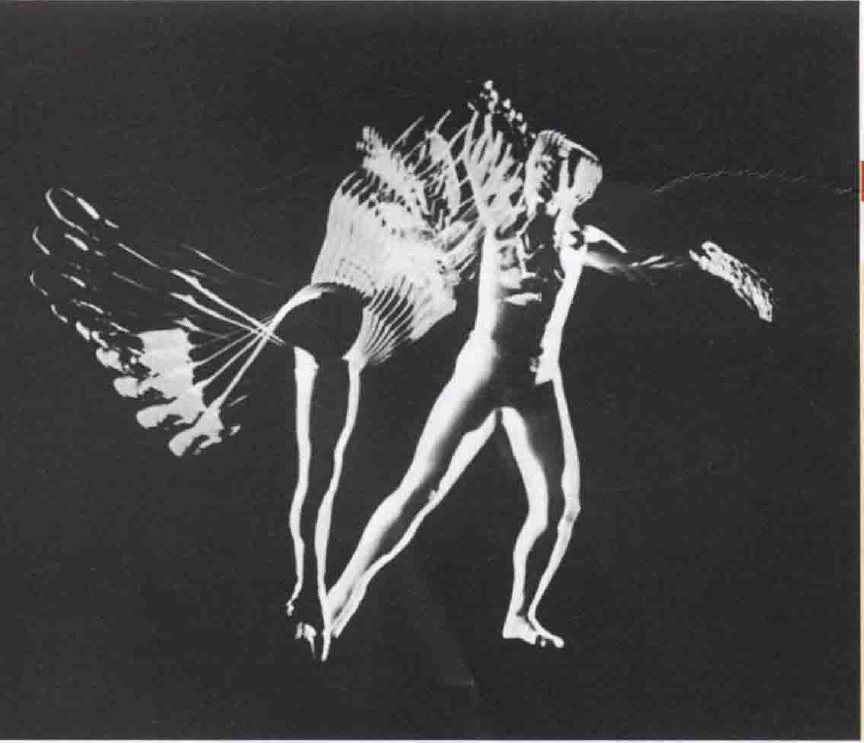
* 过去因为技术的不足，很多戏得**重拍**，比如说，如果在古装片中出现现代建筑或汽车，这场戏就得剪掉或重拍；如今这些细节可以用科技**移除**；同样的，不小心出现在画面中的麦克风，甚至演员脸上的汗，都可以被**特效人员**（F/X technician）除掉
* 计算机特效可以用于**未来**，电子科技可以修改新戏服、新背景、新前景，或完全不同的气氛，就像在《**指环王**》三部曲（The Lord of the Rings Trilogy）中出现的魔幻景观；事实上，有时场景都**不需要搭建**，因为在计算机上可以直接建构
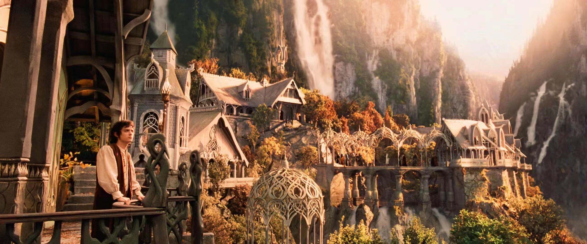
  * 《**黑客帝国**》在奥斯卡拿下四个技术大奖，自1999至2003年共拍了三部曲，由香港武术大师**袁和平**任武术指导，特效指导则是**约翰·加埃塔**（John Gaeta）；三部曲中充满**反地心引力的特效**，比如说角色回旋于空中，跑上墙，快动作行动，以及半空中对打
    * 有场戏中，战斗在半空中被“冻结”而摄影机环绕动作打转；特效小组也发明一种所谓“**子弹时间**”的特效，即角色在超慢镜头中躲避子弹
    * 《黑客帝国》三部曲结合了**各种形式的影响**，比如漫画、香港功夫片、西方动作片、东方神秘主义、童话、电玩游戏、日式卡通、计算机游戏和传统科幻片（如《**银翼杀手**》）；整套企划构想全出自**沃卓斯基姐妹**的点子，她们将三部曲维持一贯的统一视野
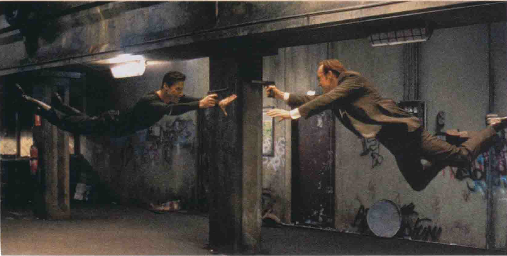
  * 乔治·卢卡斯的公司“**工业光魔**”（Industrial Light&Magic）仍是特效世界中最大也最大胆的领导者；《星球大战》满二十周年时，三部曲完全用**数字重做**
    * 当年他拍首部时**预算有限**，特效也嫌**简单**，太空站Mos Eisley看来**窄小**；经过数字技术处理，太空站看来**变大**也热闹很多，特效小组加了新的生物、机器人和其他角色，使外景看来**拥挤**，也比原版**危险**多了
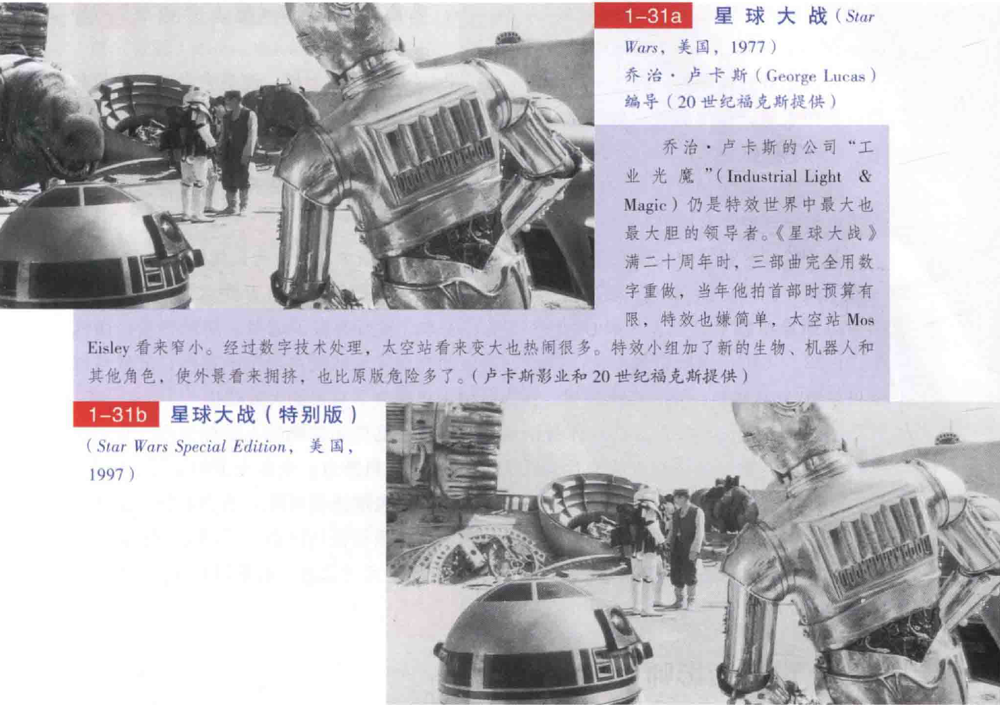
* 连**写实电影**亦可受惠于科技；《**阿甘正传**》（Forrest Gump）中，一小撮临时演员被电子技术扩增为数千人，在《**钢琴家**》（The Pianist）这部极端写实的第二次世界大战浩劫电影中，导演**罗曼·波兰斯基**（Roman Polanski）用计算机科技特效制造了若干第二次世界大战的景象——炮火蹂躏过的街道，一个角色由高楼中坠下，以及飞机横过上空
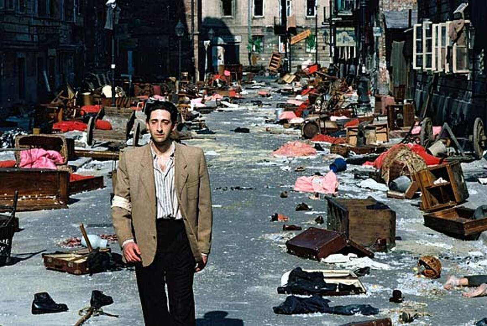
  * 计算机艺术家制造的**电影现实**和外在世界扯不上关系；评论家**斯蒂芬•普林斯**（Stephen Prince）则认为计算机影像的前卫技术把电影理论传统中电影的现实主义和形式主义界定**破坏无遗**
* **传统动画**耗时的**手工绘图**，现在已全被计算机的**电子影像**取代；计算机特效也为动画创作带来新风貌，细节较少，立体感较多，更制式化，比如《**怪物史瑞克**》（Shrk）、《**极地特快**》（The Polar Express）和《**超人总动员**》（The Incredibles）的**流线影像**
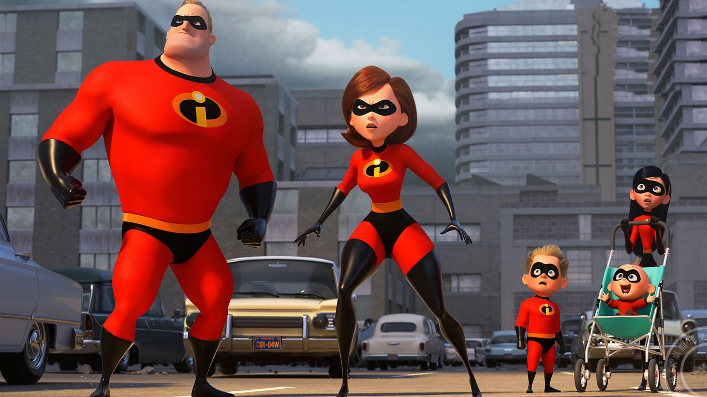
* **表演**也被科技影响，而且不见得有正面效果；《**星球大战**》里，演员常常要在**特效蓝幕**前**单独表演**，与他演对手戏的演员部分事后会再由计算机特效人员加入，有些评论家抱怨此等表演**冰冷又机械化**，不像演员能真正互动时那么有人性的细致婉转处
  * 在《**金刚**》中，**沃茨**要与高7.6米重363公斤不存在的**银背猩猩**演对手戏；**金刚**全由电脑和蓝幕特效制造，栩栩如生
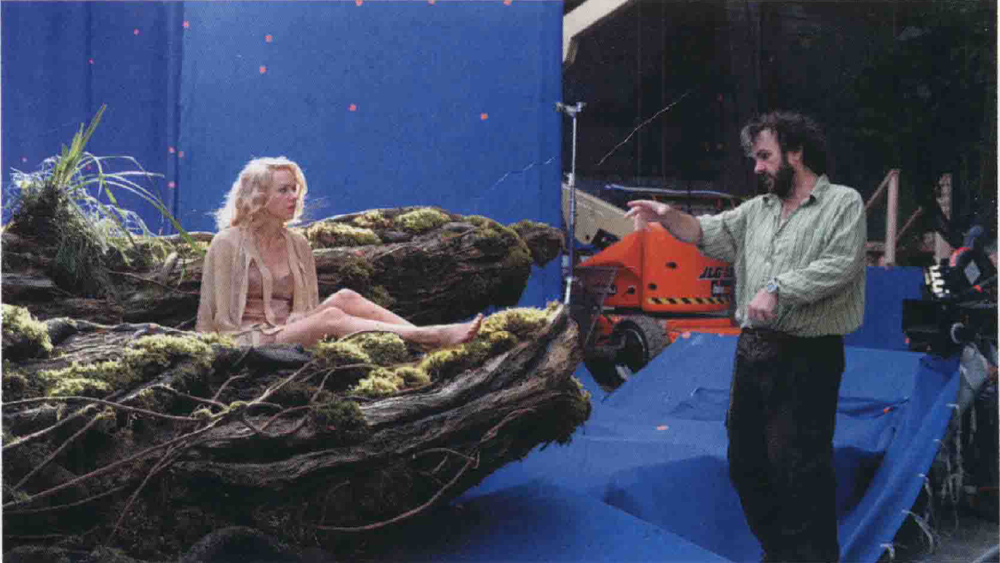
* **计算机剪辑**也比传统方式容易得多，新的剪辑师不再真正碰底片和动手剪，他们只需用手按**计算机键盘**即可
* 此外，计算机特效会使电影**发行和映演**便宜许多
  * 如今，一个**拷贝**约值美金两千元，一部主流美国片可能同时在两千个银幕上放映，光**拷贝费**便是四百万美元了；拷贝很重，用汽车、火车、飞机**运送所费**均不赀
  * 未来，电影可以预录在**数字光盘**上，如DVD只花几元成本，发行商省了运费；以后一片轻的光盘几块钱就可送抵电影院，放映器材也只是**DVD放映机**，不是巨大昂贵、在发行史上已矗立了百年的**大放映机**
* 当然，**科技的危险**是让那些浑身铜臭、艺术敏感度低如蚊蚋的人掌握生产
  * 世界电影里现在充斥着没有灵魂的声效和暴力，全是无谓的追车、爆破、暴力、超速、爆炸及更多爆炸，故事多为**陈腔滥调**，表演**乏善可陈**，情感更是**阙如**，**只有特效无懈可击**
  * 简言之，喜欢特效的电影艺术家必须和任何风格、类型或运用某些科技的艺术家一样**有才华**；要看他们用科技创造出什么艺术才算数，而非只看科技本身