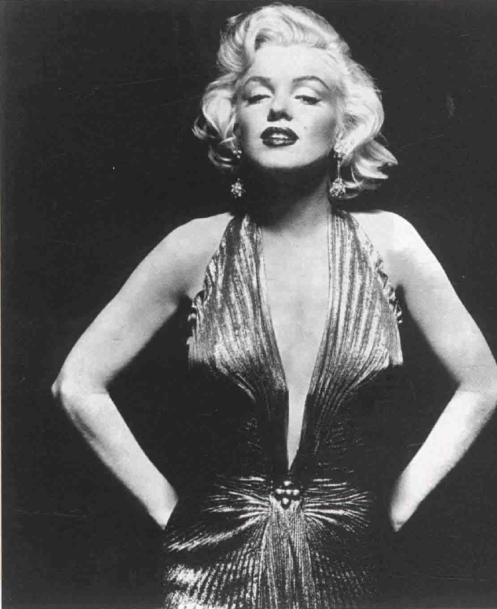
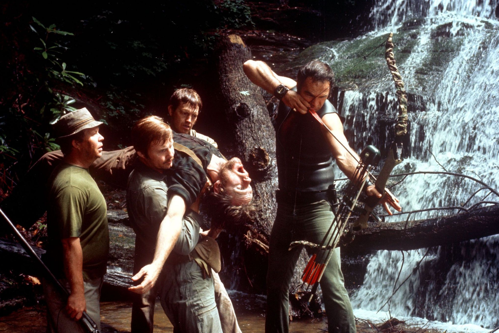
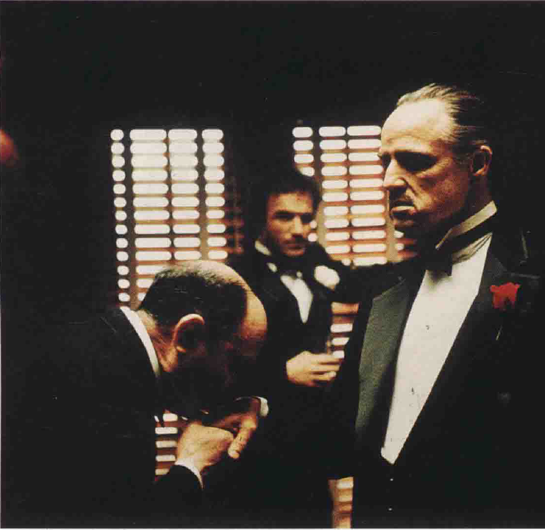
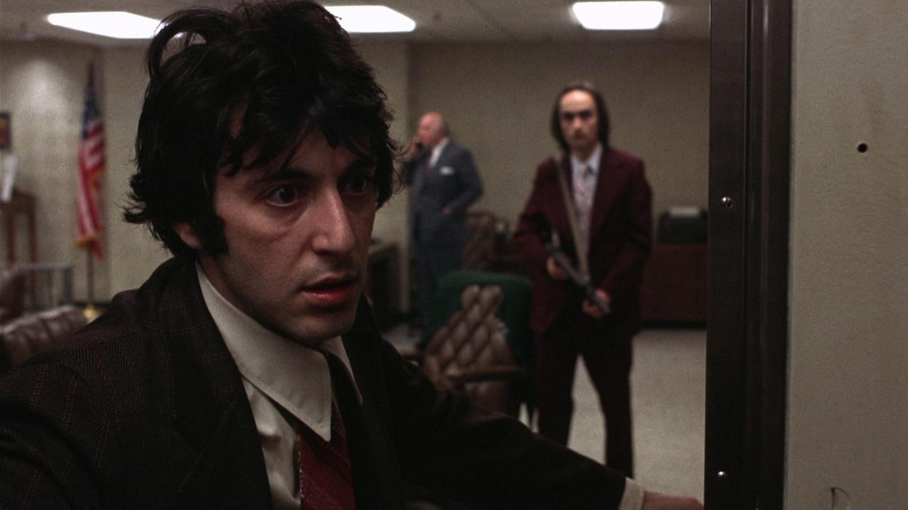
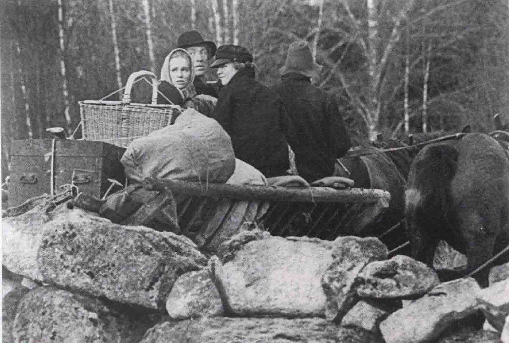
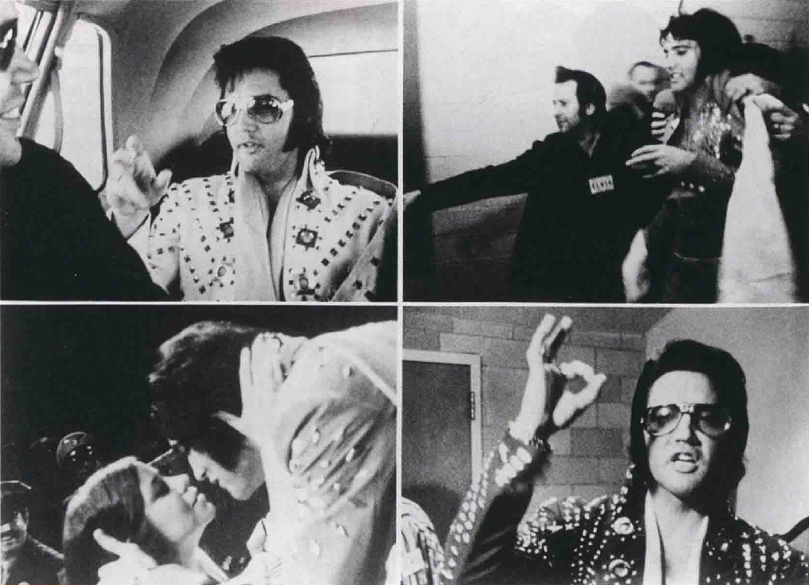
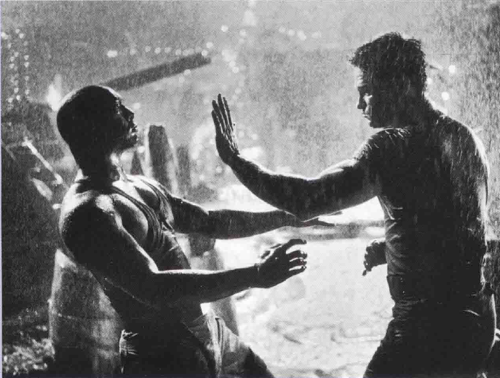
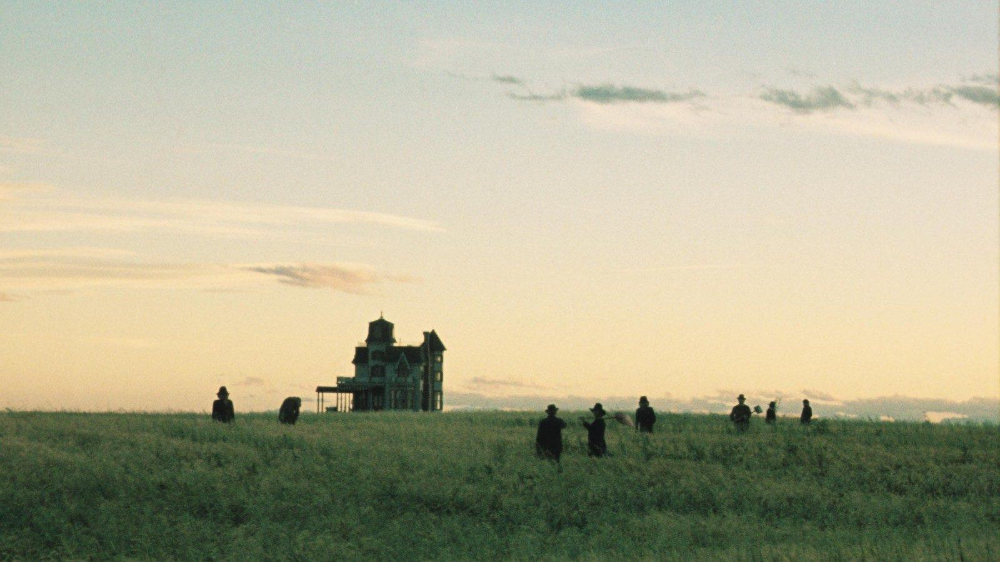

# 摄影（6）
## 电影摄影师
* 电影是集合不同艺术家、技师以及商人共同努力的**合作事业**；由于每部电影个人的贡献均不同，我们很难决定一部电影哪个人的功绩如何
  * 较世故的观众明了**导演**是大部分好片子中最重要的人，因为他的拍档（如演员、编剧、摄影师）均遵从他的**指示**行事
  * 但是有些电影，其他人的影响反而比导演重要——例如著名的**明星**（star），或某个技艺高超，能将导演的“**毛片**”（footage）剪出特色的**剪辑师**
  * 有些导演是看也不看**观景器**（viewfinder），而将构图、角度、镜头的细节选择一股脑儿交给**摄影师**
    * 一般来说，导演最起码会**咨询**摄影师的意见；如果他完全忽视这些视觉因素，就是自己放弃**视觉表达**的机会，这样只会使他变成**舞台式的导演**，只重戏剧性（剧本、表演），而不关心影像本身
  * 有时候，摄影师的成就也被过度赞扬，真正的功劳也许属于**导演**
    * 比如**希区柯克**的电影，几乎每个镜头均有草图详细绘制（即**分镜表**）（storyboard），他的摄影师仅是**执行其意念**而已；希区柯克若说他从不看观景器，意思其实是他假设摄影师会遵照他的指示行事
* 要大略评述**摄影师的功能**几乎是不可能的，因为每部影片的状况及导演都不尽相同；但在实际操作中，大多数摄影师都同意**摄影风格**应与电影的故事、主题及情绪**搭配**好
  * **威廉·丹尼尔斯**（William Daniels）便以在米高梅片厂**塑造明星的魅力**出名，他的外号是“**葛丽泰·嘉宝**（Greta Garbo）的摄影师”

  * 但是，当他和**埃里克·冯·斯特劳亨**（Ericvon Stroheim）合作拍摄尖锐的**现实主义**电影《**贪婪**》（Greed）时，风格又有所改变；他也帮过导演**朱尔斯·达辛**（Jules Dassin）拍摄《**不夜城**》（Naked City），风格又蜕变成**半纪录片式**，为他赢得一座奥斯卡奖

* 某些人在镜头下**特别好看**，有些人即使长得很好，在镜头下就是**逊色许多**
  * 前者如**玛丽莲·梦露**，这样的演员在摄影机前就很少表现得不自在；事实上，她们在摄影机前更知道如何**展现自己**，吸引观众的注意力
  * 摄影师**理查德·埃夫登**（Richard Avedon）这么形容梦露：“她非常了解摄影，甚至知道怎么拍出一张好照片——这并不是指她熟悉技术层面，而是她对内容的一种自觉，她在摄影机前仿佛比任何地方都自在”

* 在大片厂时代，大部分摄影师相信电影的**美学元素**应该无限放大——景美人美是其目标；如今这种看法被视为**僵硬刻板**，有时，对某些素材而言，影像毋宁**粗糙**一点更好
  * 比如，名摄影师维尔莫什·日格蒙德拍《**激流四勇士**》（Deliverance）时可不愿将森林美化，因为视觉上的美丽与主题达尔文**优胜劣汰的理论**不合，他想捕捉的是**丁尼生**（Tennyson）所形容的“**魔爪獠牙的大自然**”；于是他尽量拍东西**遮住明亮的蓝天**，也避免水中倒影，怕大自然因此显得**怡神诱人**

  * 摄影师**戈登·威利斯**（Gordon Willis）曾说：“有时你看不到的会比看得到的更有效”，他以**低调打光风格**在美国电影界普遍得到尊敬；他拍出了三集《**教父**》，都是传统保守分子以为太黑太暗的作品，但他追求的是**诗**而非现实主义
    * 他大部分的内景光线都相当**黑暗**，暗示邪恶和悬疑的气氛，电影界有一条由来已久的惯例：摄影师必须保证演员出现在画面中时，观众能看见他的**眼睛**；威利斯对此不以为然，他认为观众在看不见演员的眼睛时，才会更加感受到黑手党（马龙·白兰度）的**凶狠**，起码在处理“生意”时便该如此

  * 威利斯的低调灯光对当代电影有**莫大影响**；不幸的是，许多当代导演不顾题材的需要，以为低调灯光本质上较“严肃”和“艺术性”，他们拍出一些根本**不必要如此黑暗**的电影，在电视上用录像带或光盘方式播放时，经常看起来**暖昧难懂**
    * 较为在意的导演于是总亲自监督将电影转成录像带的过程，因为**不同的媒介**会有不同的灯光强力；通常，低调灯光的影像必须在转成录像带和光盘时**提高亮度**
* 有些导演对摄影机的技术层面**置若罔闻**，全数交由摄影师处理；也有些导演对于摄影机的艺术**了解透彻**
  * 比如**西德尼·吕美特**以描述真实的电影如《**十二怒汉**》（12 Angry Men）、《**当铺老板**》（The Pawnbroker）、《**热天午后**》（Dog Day Afternoon）和《**冲突**》（Serpico）著称，他总会做“镜头图表”或“镜头剧情”

* 有些摄影工作上的杰作，在银幕上却不易为人辩知；比如**现实主义**的导演就希望他们的作品在风格上不要太突兀
  * 早期**路易斯·布努埃尔**（Luis Bunuel）的作品，在摄影上的表现只能用“职业水平”形容；布努埃尔不喜欢形式美——除非用来嘲弄
  * 至于**卓别林**（Charles Chaplin）常用的摄影师**罗兰·托德罗**（Rollie Totheroh）只是架好机器，让卓别林尽情表演；换句话说，卓别林的电影让人记得的镜头，都是因为卓别林**杰出的表演**所致，只要卓别林出了镜，该镜头便**乏善可陈**
  * **现实**与**写实**（一种艺术风格）不同，现实主义者从众多纷乱的现实中**选取素材**，经过**删减或强调**，在视觉上造成不同的**重要性**；例如图中，前景的石块比人占的**空间**大多了，在视觉上，了无生气的石块会比人的**吸引力**还大，坚实不动的石块象征**分离和隔绝**，如果石块与主题无关，扬·特洛尔会从现实中**去除**这个因素，而强调其他与戏剧框架有关的因素

* **纪录片**工作者经常边走边拍，摄影机通常没空细磨灯光，但必须在任何失控情况下**尽量捕捉影像**；很多纪录片均是用最能移动的**手提摄影机**和**快感光底片**拍摄，如此只需有少数光即可捕捉到影像
  * 这类影片价值不在于**形式美**（基本上被忽略或视之不存在），而在于其**真实自然**；它们可让我们有特权**靠近某些人**，也更**震撼有力**，因为影像并非虚构，而是完全真实的

* 摄影**很重要**，但它并不能决定**电影的好坏**——只能**加分或减分**
  * 比如说，《**穆里尔的婚礼**》全片是在外景用**有限灯光**拍摄，摄影**表现平平**，如此镜头中主角身上打着主光，但背景太乱，光也使得影像层次模糊；不过，该片仍**享誉国际**，大受评论家青睐，归功于科莱特的细腻表演、滑稽的剧本和霍根活泼的导演手法，没有人会抱怨这部电影的摄影无力

  * 另一方面，《**兵人**》的**摄影大胆**，具戏剧性、质感饱满，注意为大雨打的**灯光**（这是必需的，否则在银幕上将看不见雨）赋予其如梦般的水族箱环境气氛，风格化的灯光加强了两人身躯的边线，强调了他们如雕像般的**性魅力**；这个镜头铁定得花好几个钟头打光，但电影本身是个**大失败**，不论对观众还是对大部分评论家

  * 简言之，**摄影好**不保证是**好电影**，好电影的摄影也不见得都好；许多电影——尤其是现实主义电影——都**平铺直叙**，它们不希望观众注意到摄影的存在，要你专注在拍出的东西上，而不是注意它是怎么拍的
  * 也许理想的一种综合体是像《**天堂之日**》这种电影，马利克这部有关人性弱点和堕落的震撼**寓言**，是以朴素、诗意的语句写成，演员一流，表现了人们**在宿命的脆弱中的动人处**；摄影是因本片得到奥斯卡最佳摄影的**内斯托尔·阿尔门德罗斯**（Nestor Almendros）
    * 电影背景是20世纪初，德州某处寂寥麦田，马利克希望将场景拍得像**伊甸园**或**失乐园**；阿尔门德罗斯说整部电影几乎全在“**神奇时光**”（magie hours）拍完，这个名词是摄影师用来说明黄昏光，即**太阳下山前最后一个钟头的光**，这种时候，**影子柔和**而且有**拉长效果**，光线从**侧面**而非头顶上照下来，边缘都有光，整个景观也沐浴在光辉下
    * 当然每天只拍一小时又贵又浪费时间，但摄影师抢到了他们想要的镜头，无论是蝗虫在麦秆上大嚼农作物，还是夕阳下的远景；其影像**抒情动人**，当主角必得离开牛奶和蜂蜜之地时，我们都感到一阵辛酸
