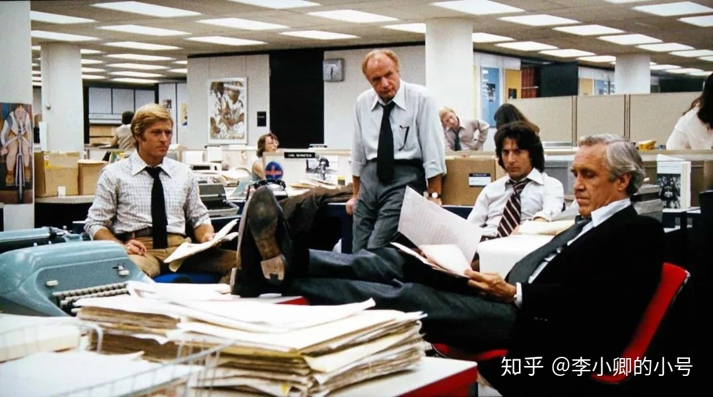
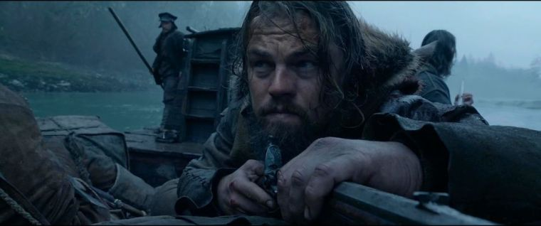
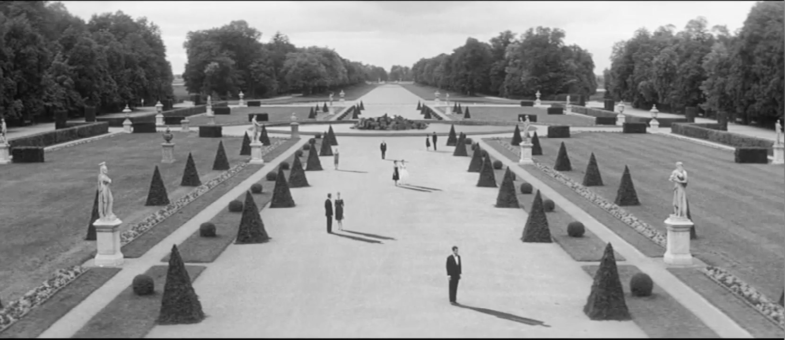
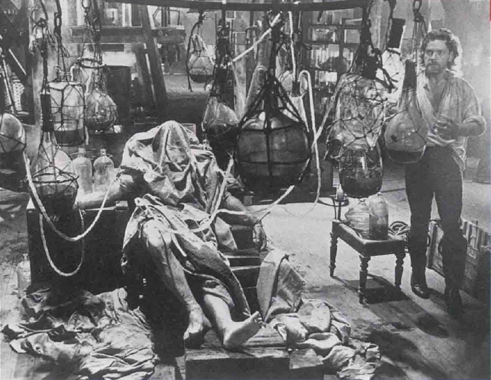
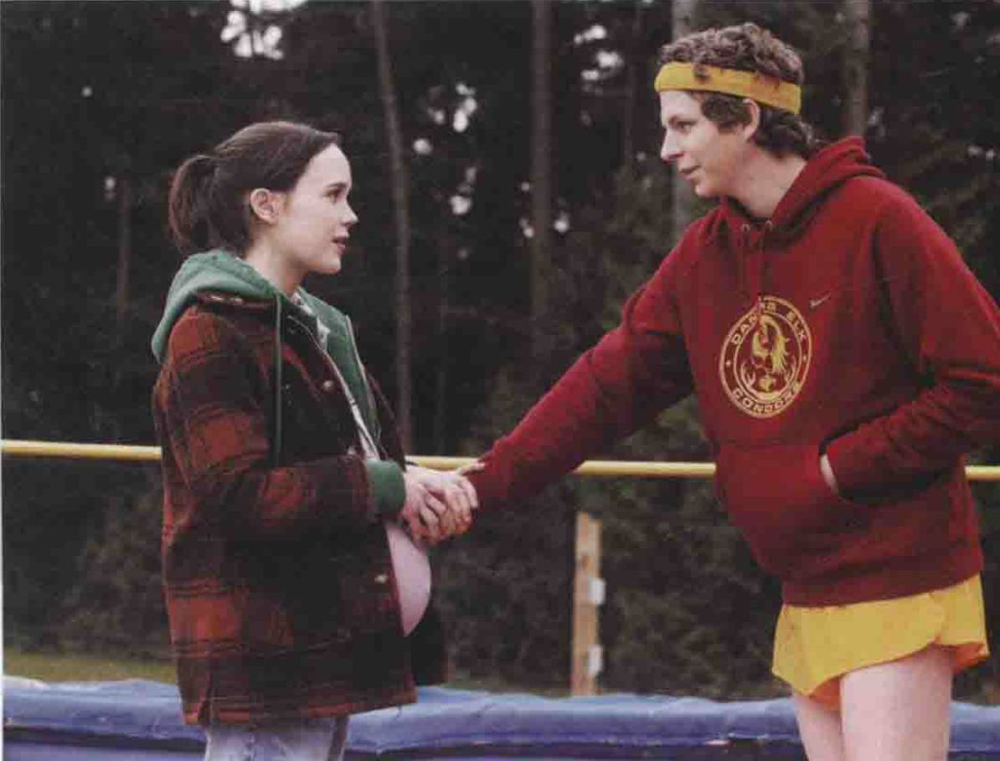
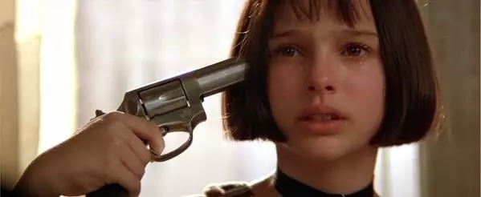
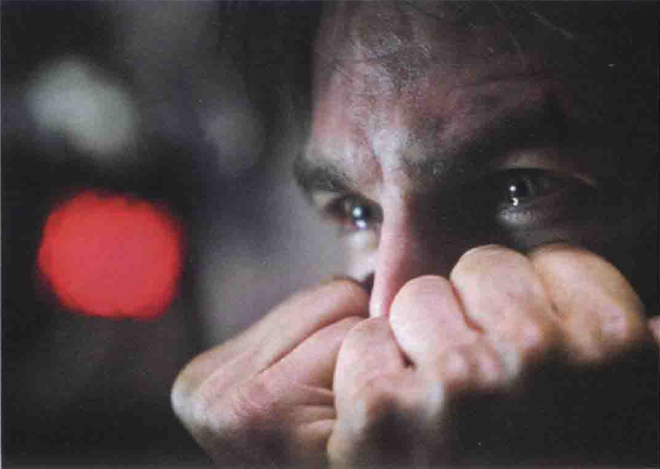

# 摄影（2）
## 镜头
* 电影**镜头**（shots）的差异通常是**视景框**（frame）内能容纳多少素材而定，此外，镜头越长，就越难区分；一般而言，镜头多半由**能看见一个人物多少部分**，而非由摄影机和被摄物的距离而定
  * 有时候，某些“镜头”会扭曲距离感，比如一个**望远镜头**（telephoto lens）能够在银幕上造成特写，实际上，该摄影机却离被摄物相当远
* 镜头的种类有许多种，我们大致可分为六类：（1）**大远景**（extreme long shot）；（2）**远景**（long shot）；（3）**全景**（full shot）；（4）**中景**（medium shot）；（5）**特写**（close--up）；（6）**大特写**（extreme close--up）
  * 此外，**深焦镜头**（deep--focus shot，又称景深镜头）则是远景或大远景的变形，有时被称为**广角镜头**（wide-angle shot），因为拍摄时需要**广角镜**（wide-angle lens）；可使前景、中景和背景都处于**对焦状态**，在电影构图中，往往寻求**最大景深**，清晰地把所有细节都在镜头里毕露无遗
  * 这种镜头**同时捕捉**被摄对象的远、中、近距离，也最能维持空间的完整性；深焦镜头的被摄物总是小心地被安排在**水平线上**，用这种镜头时，导演能引导**观众的眼光**在远近距离上移动，通常，观众的眼光总是由近而远移动

  * 与深焦镜头不同，**深度空间**（deep space）是指场面调度在前后景同时发生，而不管这些前后景**是否在清晰的焦距内**

* **大远景**多半是从远自**约400米**的距离拍摄，人物身高占画面高度1/5或更小，其多半是**外景**，而且可以显现场景之所在；大远景也为较近的镜头提供**空间的参考架构**，因此也被称为**建立镜头**（establishing shots，又称交代镜头）

* **远景**镜头可能是电影中最复杂也是最不精确的名词，一般而言，远景的范围大致与观众**距正统剧场舞台的距离**相当；远景最远可容纳的空间与**大电影院的舞台**差不多
  * **远景打光**一般而言很贵又花时间人力，尤其是如果采用**深焦摄影**时，如图中实验室看起来恐怖阴森，但也得够清楚，让我们看到场景深处；更麻烦的是，每当导演要剪到较近的特写，灯光就得**重新调整**，使切割转换间不至于突兀不顺畅

* 远景最近可和**全景**相当，可以**容纳角色的整个身体**，人物的头部接近景框顶部，脚则接近景框底部
* **中景**囊括了人物从**膝或腰以上**的身形；一般来说，中景是较重**功用性**的镜头，可以用来做说明性镜头、延续运动或对话镜头
  * 中景有不少种类，如**二人镜头**（two shot）包括了两个人从腰以上的身形，**三人镜头**（three shot）包括了三个人，超过三个人以上的镜头即是所谓的**全景**，除非其他的人物是在背景中；**过肩镜头**（over-he-shoulder shot）通常可有两个人物，一个背对摄影机，另一个面对摄影机
  * 中景适合用于拍摄两人浪漫或不浪漫的戏，一般来说，两人的**中景焦点一分为二**，其构图强调的是**对等**，两个人同享**亲密的空间**；二人镜头是浪漫喜剧、爱情故事和“哥们儿电影”类型中的主流

* **特写**镜头很难显示其场景，常常将重点放在**很小的客体**上——如人的脸部等；由于特写会将物体放大为几百倍以上，因此特别会夸张事物的重要性，暗示其有**象征意义**

* **大特写**是特写镜头的变奏；它不是人的脸部特写，而是更进一步的眼睛或嘴巴的大特写，传递**强烈情感**或显示**重要细节**
  * 镜头越靠近，情感越**紧张**；比如这个大特写中，紧张的主角宛如被逮着走投无路的动物，背景中模糊闪动的红点仿佛影像不时爆发的情绪，倒不失为他情绪崩溃的迫切象征

* 