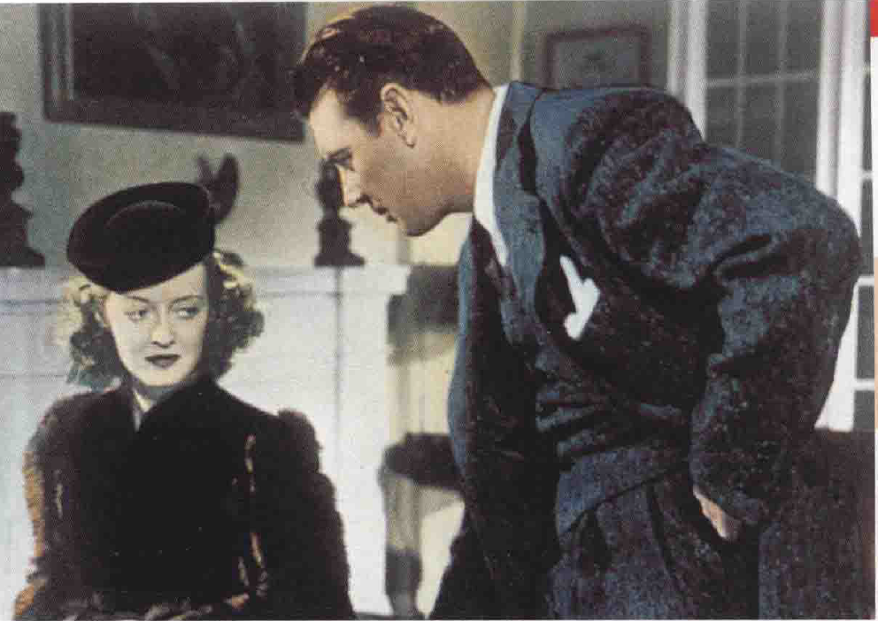

# 摄影（4）
## 色彩
* **彩色电影**虽到了20世纪40年代才在商业范畴中流行，但在此之前，已有很多影片在色彩上进行实验
  * **梅里爱**就曾用**人工着色**的方式，让每个画师负责一分钟胶片的着色
  * 《**一个国家的诞生**》（The Birth of a Nation）最早的版本是印在**染色的胶片**上，借以表示**不同的情绪**：亚特兰大大火一场戏是红色，夜景是蓝色，外景的爱情戏是淡黄色；许多**默片导演**也用这种技巧来表示不同的情绪

* **20世纪30年代**的彩色片非常**矫饰**，主要的问题在于色彩会**修饰**每样东西，对于**歌舞片**或**豪华历史片**的效果最适中，因为色彩会**增强美感**
  * 早期好莱坞的彩色片通常有**华丽的人工布景**，但彩色不适合用在**现实主义**的影片上；早期的彩色片也强调**添加的装饰**，**色彩顾问**的工作是使服装、化妆及布景的色彩能和谐
  * 此外，每部彩色片都有一个确定的**基本色调**（通常是红、蓝或黄色），因而光谱上其他颜色都被**扭曲**了
  * 这些问题到**20世纪50年代**才被解决；不过，与人眼的色彩辩识能力相比，如今电影的色彩无论多准确，仍然**十分粗糙**
* 在心理方面，色彩是电影中的**下意识元素**；它有强烈的**情绪性**，诉诸的不是意识和知性，而是**表现性和气氛**
  * 心理学家发现，人们喜欢“解释”构图线条，却消极地接受了颜色，容许它象征心境；也就是说，线条常与**名词**相联，色彩则与**形容词**相联，线条是阳刚的，色彩是阴柔的
* 色彩的**象征意义**事实上自古已存，而且往往与**文化**有关，虽然在不同的社会中会发现惊人的**相似之处**
  * 一般而论，**冷色**（蓝、绿、浅紫）代表了平静、疏远、安宁，在影像上较不凸显
  * **暖色**（红、黄、橙）代表了侵略、暴力、刺激，在影像上十分张扬
* 彩色片中的**黑白片段**通常用来营造**象征意义**
  * 有些导演在黑白片中**插入彩色片段**，但这种技巧的问题是其象征显得过于**表面化**；而在彩色片中**插入黑白段落**的方法有时过于**造作及明显**
  * 比较好的方式反而是尽量**少用颜色**，让黑、白色凸显；像《**美丽人生**》，电影开始是个闹剧，色彩**温暖明亮**，背景是典型地中海风味；但当主角被逮捕送上火车并开往集中营，此时色彩开始**泛白变淡**，几乎所有颜色都被从影像中**剔除**，仅有偶然几抹苍白的肤色色调点缀集中营和其中的囚犯

* 20世纪80年代计算机科技日新月异，可让黑白电影“**彩色化**”，这引起部分电影人及评论家的抗议
  * 将**某些类型**的电影着色（如时代片、歌舞片及娱乐片），对影片的破坏并不严重；但如果像《**公民凯恩**》（Citizen Kane）这样**精致的黑白片**（其黑色电影的灯光风格及出色的深焦摄影），着色后就是场浩劫了
  * 着色这种技巧也破坏了某些片子**构图的平衡**，产生了新的**支配力量**（dominants）
  * 例如在《**黑暗的胜利**》中，乔治·布伦特的**蓝色西装**非常醒目，虽然它与戏剧性的主题没关联；在这部影片的黑白版中，**贝蒂·戴维斯**的地位较重要，她深色的衣服和白色的壁炉成强烈的对比
  * 这种削弱戏剧冲击力的方法**扰乱了视觉感**，我们会认为布伦特的西装一定很重要，但那仅仅是对计算机而言
