# 故事（1）
* 故事的吸引力与叙述形式
   - 亚里士多德《**诗学**》中的**两种叙事方式**：**模仿**（现场剧场）和**叙事**（文学史诗和小说）
   - 电影：**结合**两种叙事方式，是**复杂的媒介**
## 叙事学
* **叙事学**（Narratology）简介
   - 20世纪80年代崛起的**跨领域研究方法**
   - 分析叙事**原始素材、结构、策略和象征意义**
   - 关注与“**修辞学**”（rhetoric），即传送信息者与接收信息者沟通使用的形式相关的方面
- **电影中的叙事传送模式**
   - 难以确定**明确的信息传送者**
   - **集体创作剧本**的普遍现象，涉及制片人导演和明星的合作
   - 著名导演（如费里尼、黑泽明、特吕弗）偏好与人合作剧本
- 电影叙事中的**旁白（voice--over）技巧**
   - 旁白者的**角色与作用**
   - 叙述者不见得要**中立**，也不必担任**导演的代言人**
   - 有时旁白者就是**故事主角**，仿佛小说的**第一人称**（first person）
     - 电影《**肖申克的救赎**》是由角色**瑞德**通过旁白叙述的，这样的叙述方式使观众能够和瑞德一样在电影结尾处才完全揭示安迪的真实计划和故事的大转折
     - 选择瑞德作为叙述者不仅能保持故事的**悬疑和惊奇元素**，同时也让观众**更加深入了解**瑞德这个平凡却又复杂的角色，使故事呈现出**更丰富的层次和情感深度**
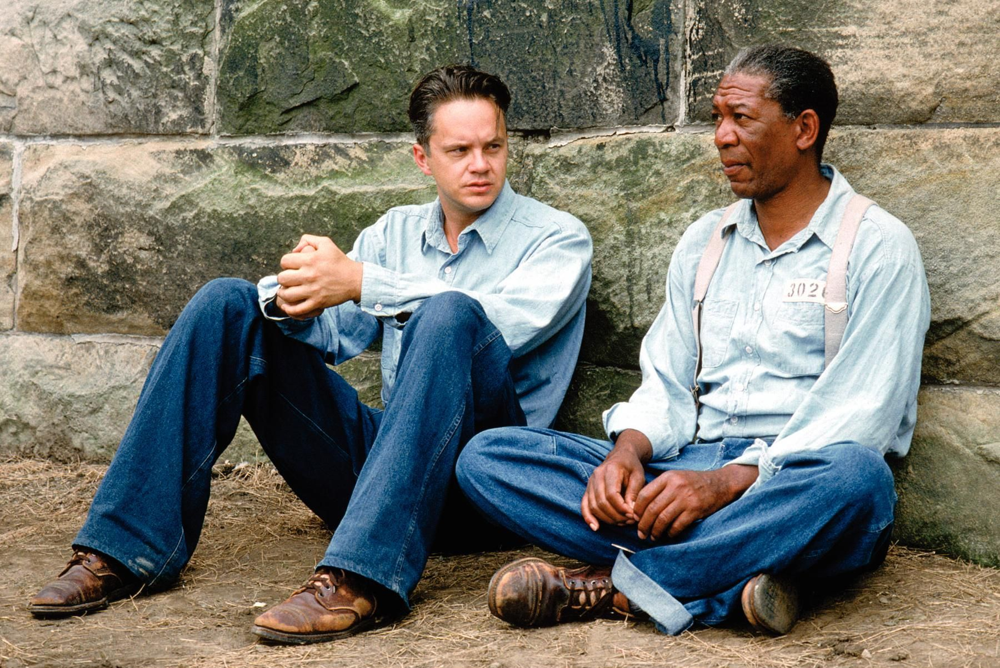
- 电影叙事的**风格和结构**
   - **写实电影**：作者隐形，事件自然呈现
   - **古典叙事结构**：可察觉的故事操控手，对故事进程的审慎筛选
     - **史诗故事**通常呈现**英雄式结构和重要主题**，通过主角反映特定群体或文化的**理想特质**
     - 以电影《**阳光情人**》为例，它反讽性地展示了一个犹太家族在多个历史时期（奥匈帝国、纳粹占领和共产党执政）中努力生存和保持信仰的故事，突显了历史的残酷和悲剧性
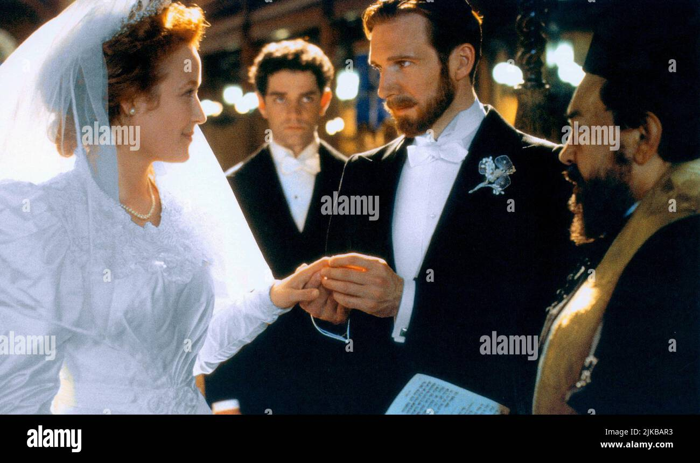
   - **形式主义叙事**：明显的故事操控，有意打乱时序或重新组织事件来凸显主题
   - 实例：奥利弗·斯通的《**刺杀肯尼迪**》（JFK）即为典型的形式主义叙事，故事**完全主观**
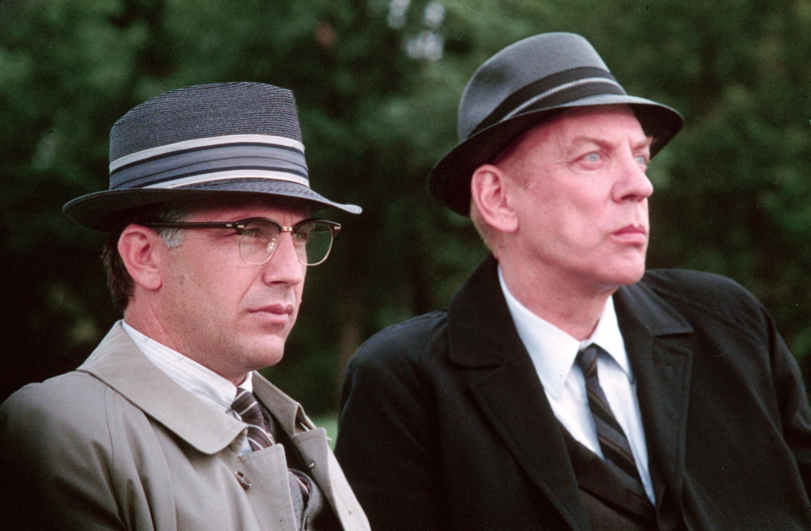
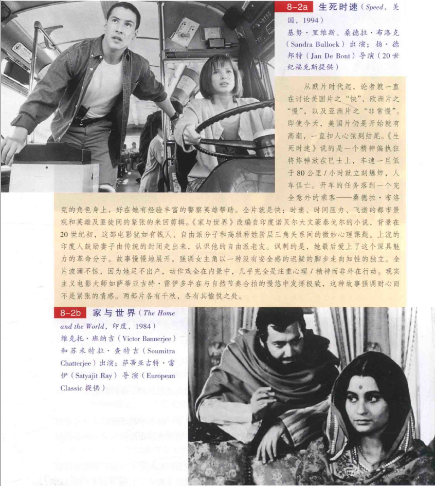
- 叙事学的**词汇和术语**
   - **抽象和复杂的词汇**
   - 使用**外来语**描述传统概念，例如“histoire”、“discours”、“mythos”、“logos”、“fabula”、“syuzhet”
   - 美国学者常用的术语：“**故事**”（story）和“**叙事**”（discourse）及其替代词汇
- **故事与情节的区别**
   - 故事：前后**顺时序**的戏剧**原始材料**，一般素材
   - 情节：包含**创作人**给予故事的**结构和形式**，包括潜在作者**赋予角色动机**，提供**因果逻辑组织的事件场景**
     - 电影《**撞车**》通过**角色驱动的双层叙事结构**在洛杉矶这座大城市的背景下，展示了角色**内在的复杂性**和他们之间的**交叉关系**，强调了人性的复杂和多元
     - 其中一个场景描绘了**狄龙**这名警察的角色复杂性，他既有种族歧视的行为又展示了英雄般的救人一面，使人们对他的性格产生深度的探讨
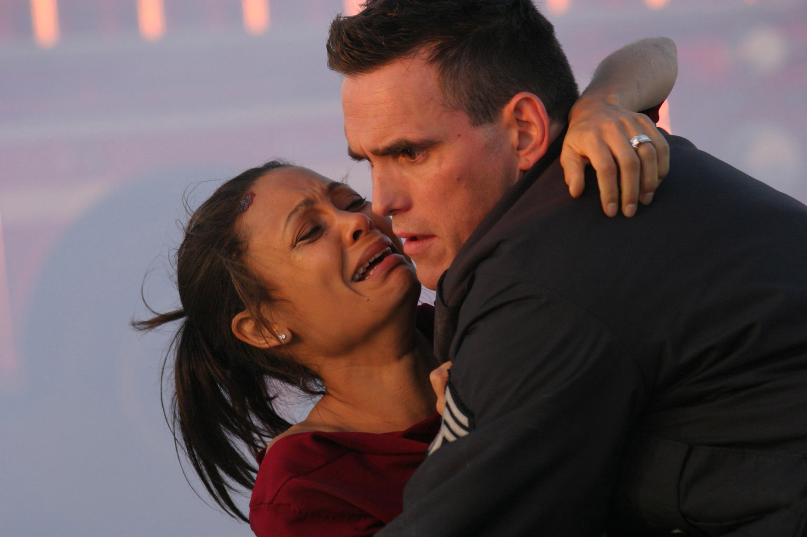
* **彼得·布鲁克斯**（Peter Brooks）对情节的描述
   - 情节是**叙事的设计和意图**
   - **引导**观众**理解故事的意义**
   - 包含**作者的观点**和**美学形式的场景结构**
     - **戈达尔**将自己的电影制作方法比作通过拍摄来**创作论文或小说化的论文**，他强调**即兴和自然的表现形式**，摒弃传统剧本，倾向于捕捉**某时某刻的真实**，并通过这种方式对**古典电影霸权**进行挑战
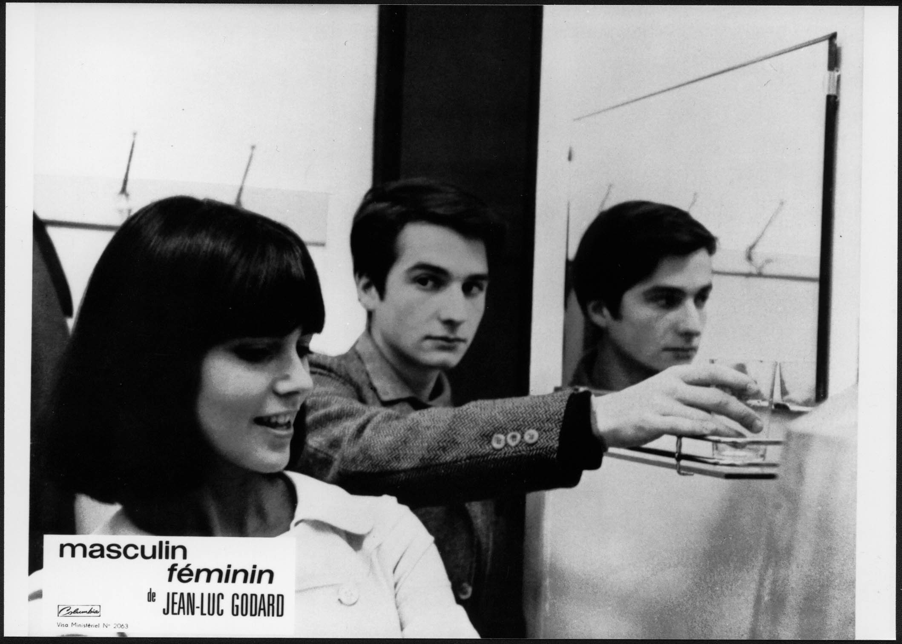
## 观众
* 观众与电影叙事的**互动**
   * 必须**主动参与理解**叙事逻辑
   * 快速吸收**多种语言系统的刺激**，如影像、空间、动力、声音等
   * 美国电影中**情节是主要结构**，优于其他系统
* 叙事的**期待与历史经验**
   * **大卫·波德维尔**（David Bordwell）等人发现，观众尝试将电影的世界组成**有逻辑及道理的**
   * 观众对电影有**预设的期待**，基于他们**对某个时代或类型的经验**
   * 示例: **西部片**大多以**19世纪末的美国开拓时代**为背景，观众对这个时代的人们的举止和着装有基本了解
   * 当叙事**偏离传统或历史经验**（convention），观众可能会**重新评估**其认知和对叙事的态度
     * 电影《**汉娜姐妹**》采用了类似于1932年电影《**大饭店**》的结构设计，将**多个角色**通过**共同的关注点或生活方式**连接起来，这样的结构允许**多层叙事**而不是单一线索叙述
     * 通过这种“大饭店模式”，艾伦成功地在影片中描绘了与三姐妹相关的十二个有趣的纽约人的**各自故事和心理问题**
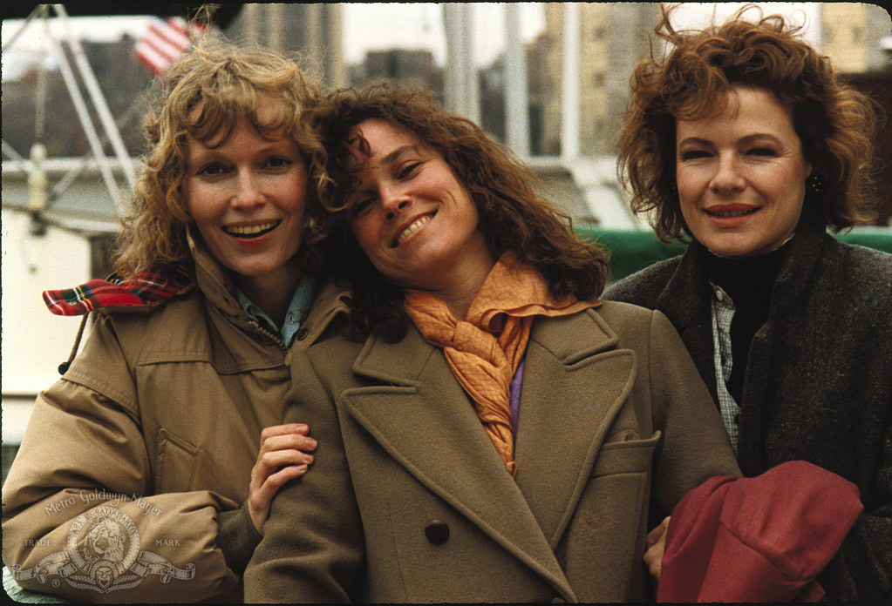
* 叙述策略与**电影类型**
   * 叙述策略**根据电影类型而变化**
   * 示例: **悬疑片**中，叙事可能会**故意隐藏线索**，观众需要**猜测和填充信息**；在**浪漫爱情喜剧**中，观众可能**早已知道结局**，重点是**如何达到这个结局**
     * 《**狗脸的岁月**》展示了一个不可预测和充满奇异转折的故事，其中小男孩搬到乡下与奇怪的叔叔婶婶一起生活

     * 而《**真情假爱**》则是一部浪漫喜剧，其结局（有情人终成眷属）是可以预见的，但电影的吸引力在于其丰富多变和有趣的叙事过程
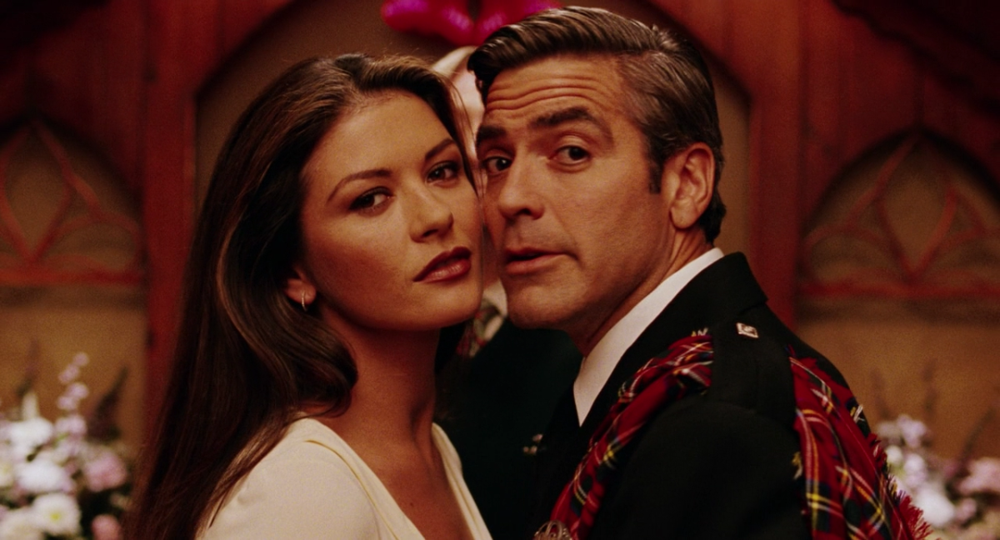
* **明星**对叙事的影响
   * **明星**的认知为观众界定了**叙事范围**
   * 示例: **克林特·伊斯特伍德**常出现在动作片，尤其是西部片和犯罪电影，而**约翰尼·德普**的戏路则宽广，不容易预测
   * 观众基于对演员的了解来**预期和解读叙事**
     * 电影《**十二罗汉**》是一部**伪叙事作品**（Pseudo-narratives），其主要焦点是展示明星的魅力和美丽，而故事线本身只是作为这一目标的工具或陪衬
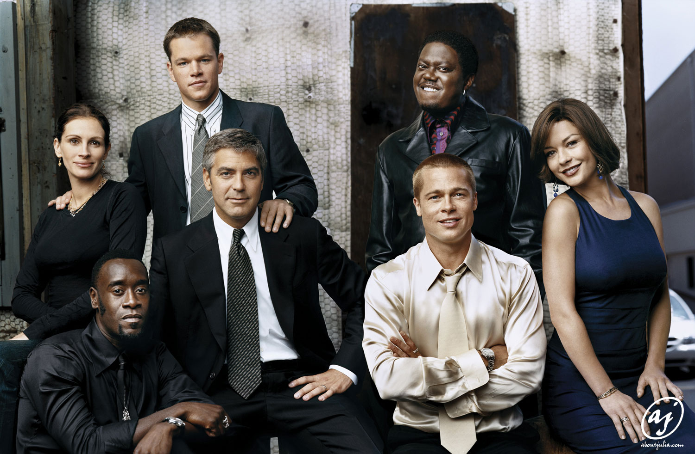
* 从**片名**中获取信息
   - 片名可以给观众提供电影的一些**线索和暗示**
   - 例1: 《**辣妹杀手的攻击**》（Attack of the Killer Bimbos）这样的片名可能不会在一些正式的影展上映
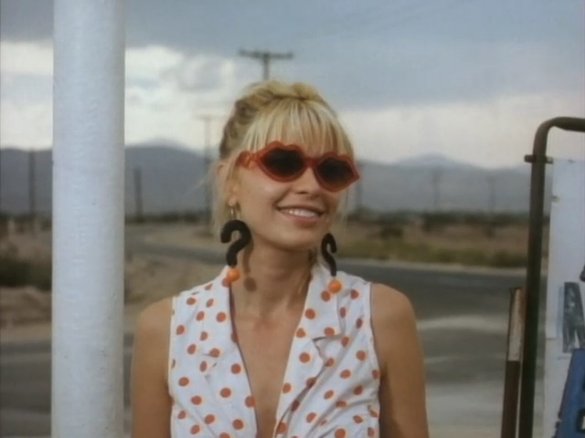
   - 例2: 《**少奶奶的扇子**》（Lady Windermere's Fan）这种贵族气息和过时的片名可能不会在普通影院上映
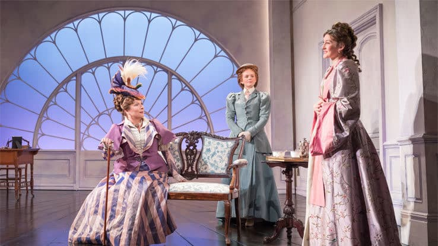
   - 例3: 《**山米和萝西上床记**》（Sammy and Rosie Get Laid）这样的片名可能给人带来误导，实际上是一部有深度的社会喜剧

- **电影开始时**对叙事范围的定义
   - 电影一开始，观众需要确定叙事的范围和基调
   - **开场字幕和配乐**可以帮助观众确定电影的基调
   - **开场戏**通常设定故事的**基本元素和气氛**，并指明**叙事的发展和可能的结局方向**
* **电影内部的“世界”的建立**
   - 电影通过**开场戏**建立一个内部的“世界”，指明什么是可能和不可能的
   - 如果导演做得好，整个故事应该是**环环相扣**的
   - 例: 在《**外星人**》中，斯皮尔伯格在开头就让观众看到外星人没能搭上飞船，为后面的超自然现象做铺垫
* 叙事的**时间和结构安排**
   - 创新导演**戈达尔**表示故事可以有**开头、中间和结尾**，但**不一定要按这个顺序**
     - 《**八部半**》是一部深受尊敬的电影杰作，以其**繁复和巴洛克式的艺术处理方式**著称，结合了**真实、幻想、梦境和回忆**来展开叙事，但其**复杂的结构**和**频繁无预警的意识转换**使得大多数首次观众感到困惑和迷失
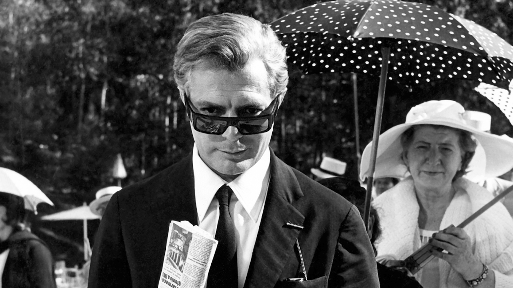
   - 大多数电影在开场戏中建立了**故事的时间框架**，可能是倒叙、现在进行或两者并行
   - 开场戏还定义了故事中的其他风格元素，如**幻想和梦想**等
* 观众对叙事的**询问与推理**
   * 观众经常对叙事**提出质疑**，试图理解角色的动机和行为
   * 情节复杂时，观众需**更加敏锐**地分类、筛选和解释信息
   * 在某些类型如惊悚、侦探和警匪片中，观众需要对叙事中的逆转和误导**保持警觉**
   * 我们**几乎很少**对电影情节采取**被动的姿态**