# 故事（2）
## 古典模式
1. **古典模式定义与来源**：
   - **古典模式**（classical paradigm）描述的是自1910年以来的**主导剧情片的特定叙事结构**，尤其在**美国**，这是最流行的故事组织方式
   - 它被称为“古典”是因为它是**实际执行的典范**，而非艺术的高质量
   - 此模式**起源于剧场**

2. **古典模式的特点**：
   - 采用此模式的电影往往从**提出一个戏剧性问题**开始，强调**因果关系**，并**将冲突不断提升**
   - 冲突在电影中会**升至巅峰**，之后有一个**解决部分**，使戏剧张力逐渐减弱
   - 结尾通常会有一个**哲学性的总结**
   - 重视戏剧的**统一性**、**可信**的动机和前后的**一贯性**
   - 所有情节都是**连贯**的，每个镜头**平滑过渡**到下一个事件
   - 为了增强冲突感和情感深度，导演有时会采用**戏剧的时间迫切性**
   - 在好莱坞制片厂时代，古典模式常会有**两个线索**，除了主要的冲突，还有**与爱情相关的次要情节**

3. **角色和动作的关系**:
   - 角色在古典情节中通常**依动作来定义**，比如悉德·菲尔德的观点：“动作就是角色”
   - 古典派更喜欢**目标明确的角色**，因为观众会对他们的动作计划**产生共鸣**
     - **旅程叙事结构**见于多部经典文学作品，描述了主角的学习和探索过程；《**摩托车日记**》描绘了20世纪50年代的格瓦拉骑摩托车横跨南美，经历了社会问题和人情温暖，此行塑造了他成为马克思革命分子的思想
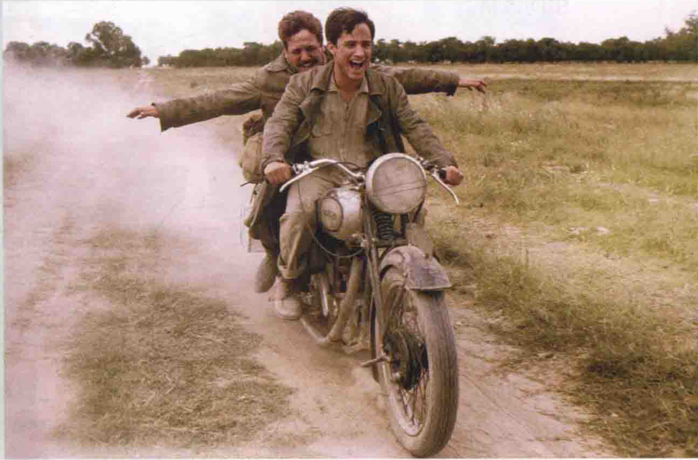

4. **古典模式的结构**：
   - 亚里士多德在《**诗学**》中描述的**古典戏剧结构**由**古斯塔夫·弗赖塔格**于19世纪用**倒V字型图表**绘制，该结构从外部冲突开始，逐渐增强至高潮，然后达到解决，最终故事结束，生活恢复正常
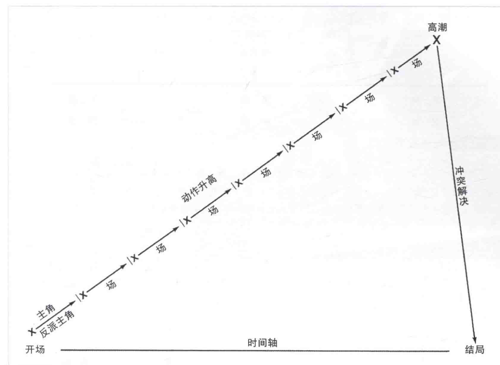
   - 悉德·菲尔德的理论将电影叙事结构划分为**三幕**，包括**十到二十个情节点和关键事件**，其中第二幕的中间有一个**出乎意料的转折**；这个结构对古典叙事十分适用，但不一定适用于现实主义或形式主义叙事
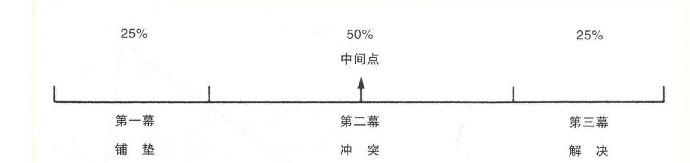
   - **铺陈**（setup）部分建立**前提**，明确主角的**目标和障碍**
   - **冲突**（confrontation）部分发展**复杂的冲突**并增加**主角的张力**
   - **解决**（resolution）部分是对冲突的高潮**戏剧化处理**

1. **巴斯特·基顿的《将军号》**
    - 是古典模式的**典范**
    - 符合**古斯塔夫·弗赖塔格**（Gustav Freytag）的**倒V字形结构**和**菲尔德的三幕剧方式**
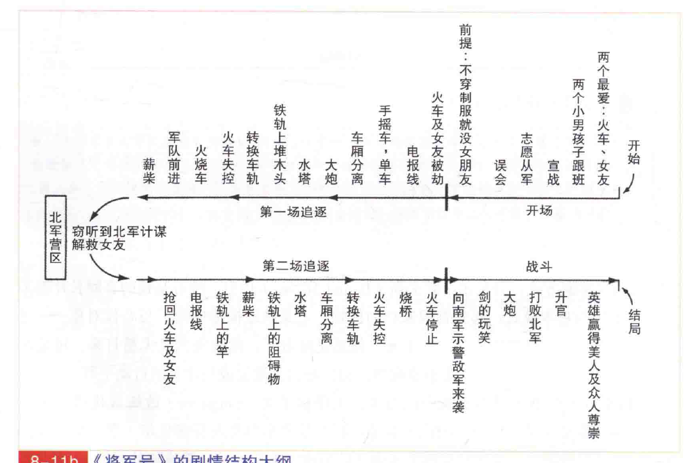
    - 其中，**丹尼尔·默夫斯**（Daniel Moews）指出所有基顿的喜剧长片都有**类似的基本模式**，开始是青涩的巴顿，经过一系列的冲突和追求，最终变得英勇，且结局皆大欢喜

1. **《将军号》的叙事内容**
    - 背景是**美国南北战争**，以优雅的**叙事喜剧**展现
    - 第一幕：介绍主角**约翰尼·格雷**（Johnnie Gray）的两大爱，**将军号火车**和女友**安娜贝尔·李**（Annabelle Le）；约翰尼被误解为**胆小**而失去女友的欢心
    - 第二幕：描述北军**劫走火车**的情节，安娜贝尔不巧被劫持，约翰尼勇敢地**追回火车并成功救出女友**；

    - 第三幕：两军交战，约翰尼**英勇战斗**并获得军功，最终和安娜贝尔**重归于好**

2. **基顿的叙事方法**
    - 使用**复杂的对称形式**，确保先前的羞辱能被随后的胜利消除
    - 他的法国崇拜者认为，基顿的情节设计细致，如同18世纪**新古典艺术家的排比和对称**
    - 形式主义者的叙事规范是**人工化的情节结构**，但基顿的执行却**非常写实**，包括亲身导演所有笑料、一次镜头完成等
    - 基顿**对细节要求严格**，如服装、布景、火车等，这种融合了**写实拍摄**和**叙事形式工整**的做法是**典型的古典电影**
    - 最后，古典主义风格是从两种形式极端的传统中糅合的**中间风格**

## 现实主义叙事
**1. 现实主义与形式主义叙事比较**:
   - 传统观念中，现实主义与“**生活**”相联，形式主义与“**形式**”相联
   - 现实主义被视为**没有风格**，而形式主义**注重风格**
   - 现实主义者尽量**使世界看起来透明**，而形式主义者偏向幻想或只强调自己的想象和美感
   - 自**19世纪末**现实主义成为**艺术主流**，其描绘的刺激题材引发了大众的矛盾情感：**既吸引又反感**
     - 电影《**上帝之城**》设在被称为“上帝之城”的里约热内卢贫民窟，由真实的街头小孩出演，展示了充满暴力和无望的生活。这使得观众不禁思考：为何世界会如此残酷？
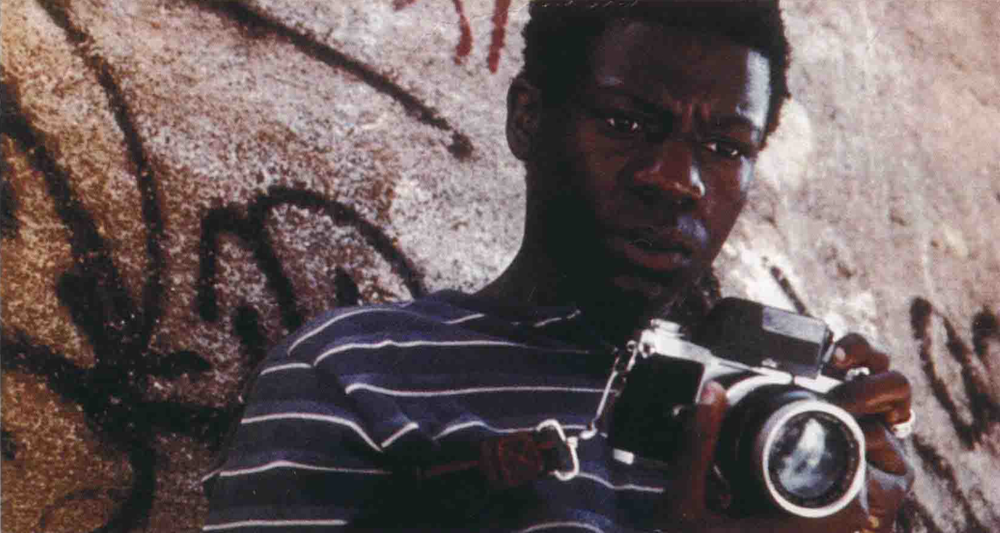

**2. 现实主义的叙事特点**:
   - 现实主义被现代评论家和学者**视为一种风格**，尽管其叙事传统看起来低调
   - 现实主义叙事试图**掩藏其背后的公式**，让故事看起来像是**自然发生**的
   - 现实主义叙事伪装其为“未经操弄”的和“如生活般”的本身是一种**艺术的欺骗**

**3. 现实主义叙事的具体展现**:
   - 通常**没有固定的结构**，没有清晰的开始、中间和结尾
   - **不强调明显的冲突**，而是来源于看似自然的事件
   - 例如**小津安二郎**的电影以季节命名，如《麦秋》(Early Summer)、《晚春》、《小早川家之秋》(The End of Summer)、《秋日和》(Late Autumn)
     - 日本电影中**庶民剧**是一种流行类型，专注于**日常家庭生活的细节**，这也是**小津安二郎**唯一拍摄的类型，他因此受到观众喜爱
     - 尽管小津的作品**深入哲学**，但他的电影主要由**生活中的琐事**组成，经常带有**遗憾的主题**；例如，《**晚春**》描述了一个未婚的父亲试图为其坚持独身主义的女儿安排婚姻
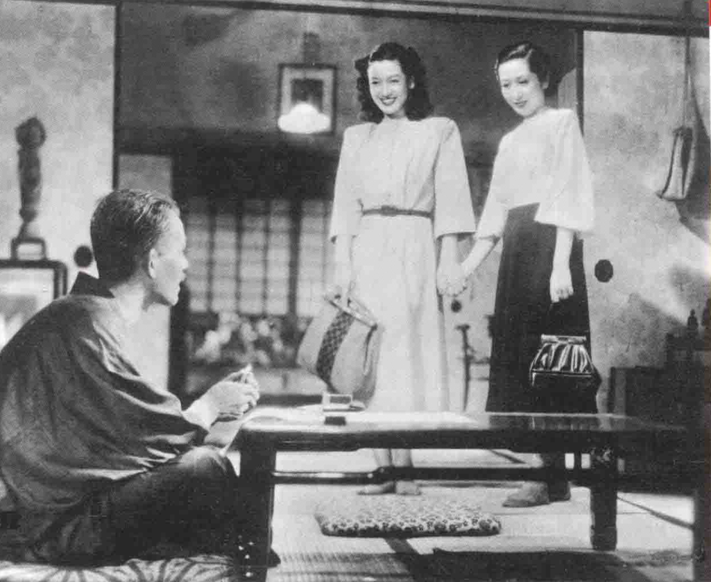
   - 有些写实电影**以一段时间为结构**，如一个暑假或一个学期，这类电影通常与**成长仪式**相关，如出生、青春期、初恋、第一份工作、结婚、生离死别

**4. 现实主义叙事的结构和内容**:
   - **片段式的结构**，如奥尔特曼的《**陆军野战医院**》(M * A * S * H)，电影从两个军医的到来开始，以他们离开结束

   - 情节的铺排很**零碎**，看似随机，情节的转变通常是**出乎意料**的
   - 可能的转折或支线与主要情节**并排发展**，不会被明确区分

**5. 现实主义叙事的其他特点**:
   - **客观**“报道”，不对内容置评
   - 舍弃陈词滥调，偏好**独特的个案**
   - 揭露**社会伤疤**，可能被认为是直接或低俗的
   - 不赞同感伤的通俗观点，**避免完美**的快乐结局或其他虚假的乐观主义
   - 避免通俗和夸张，偏向**含蓄和非戏剧性**
   - **科学地看待因果关系**，避免浪漫观念如命运
   - 避免抒情，使用**平实、直接**的表现方式

## 形式主义叙事
1. **形式主义叙事的特点**：
   - 形式主义叙事特别注重**华丽、精细的描绘和风格**
   - 喜欢通过对**时间的打散和重组**来突出主题
   - 情节设计往往**直白且显眼**，有时可能给人一种刻意“作秀”的感觉

2. **具体电影与导演的例子**：
   - **希区柯克**：迷恋“**双**”（doubles）和“**抓错人**”的主题
     - 电影《**伸冤记**》（The Wrong Man）：整个电影以“双”为主，如两次入狱、两次笔迹试验、两次审讯等

     - 法国大导演**戈达尔**对希区柯克的评价，指出希区柯克刻意露出的“**痕迹**”实际上是**电影结构的支柱**
   - **布努埃尔**：常将**尖锐的黑色幽默**植入叙事，显示主角的虚伪和小人之心
     - 布努埃尔的电影以**古怪且不加解释的场面**为特色，经常以**困惑和蔑视的态度**嘲讽**中产阶级的伪善**
     - 《**中产阶级的审慎魅力**》展现了富裕阶层**空洞的仪式**和**毫无生气的生活**，由一系列**看似不相关的片段组成**；这些片段中，角色们经常被描绘为**在空旷的道路上行走**，没有明确的方向和目的
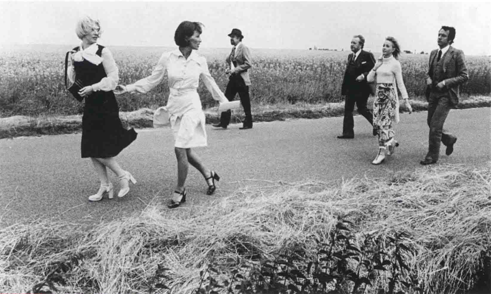
   - **戈达尔**：个性鲜明的创作方式，以“**电影论文**”（cinematic essays）的形式挑战传统叙事结构

1. **形式主义叙事在风格化电影中的体现**：
   - 歌舞片、科幻片、幻想片等风格化的**类型电影**经常被用作展现华丽风格的载体
   - **弗雷德·阿斯泰尔**和**金姐·罗杰斯**在20世纪30年代为雷电华拍摄的**歌舞片**就是其中的代表
   - 电影被认为与**梦境**相似，超现实电影艺术家**布努埃尔**视其为表达梦和情感的工具；导演林奇的作品特别体现这种**非理性和迷离**，例如《**穆赫兰道**》，原为电视剧试映但后转为电影，其内容既困惑又吸引人
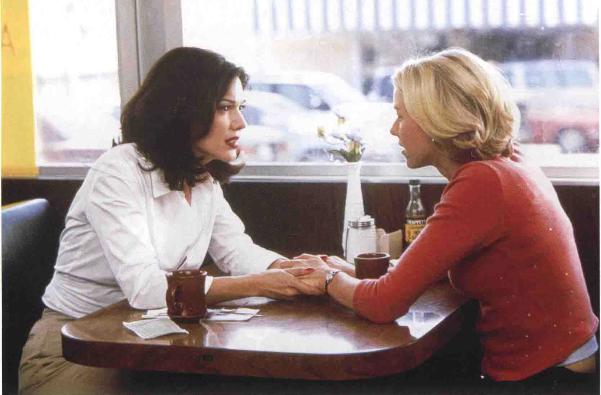

1. **《我的美国舅舅》（Mon Oncle d'Amerique）的分析**：
   - 由**阿兰·雷乃**导演，结合纪录片、先锋派影片和剧情片的元素
   - 《**我的美国舅舅**》这个片名代表了一个**欧洲流行的神话**，即那个去美国淘金的冒险舅舅会有一天回来解决家里的问题；影片还引用了贝克特的《**等待戈多**》，一个关于等待从未出现的模糊人物（可能是上帝）的荒诞剧
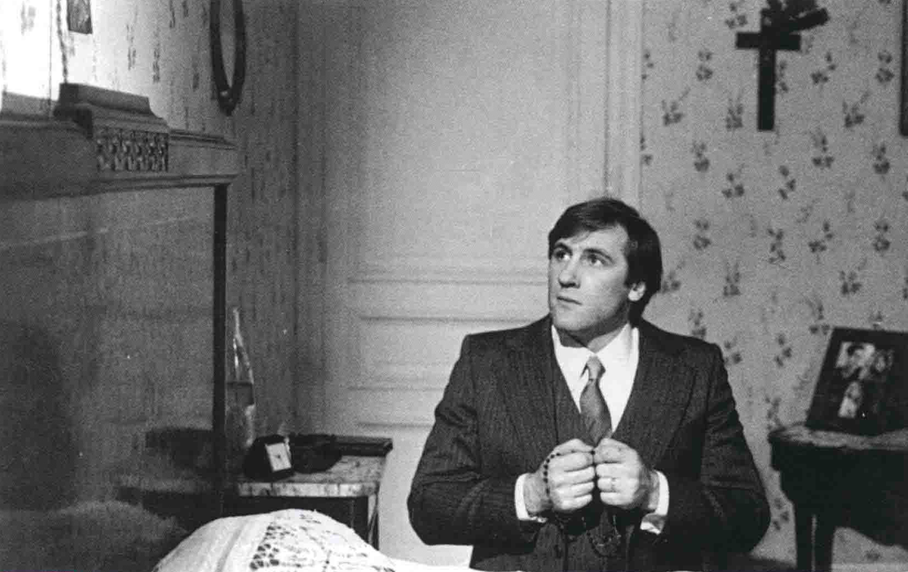
   - 电影结构像是**心理学入门**，以医学及行为科学家**亨利·拉博里的理论**为基础
   - 电影中的行为是自发的，但也反映了人们**对某些未知力量的无力感**
   - 三个主角的生活、梦想和回忆与拉博里的理论交织呈现
   - 电影中还夹杂了三个**主角儿时的电影偶像**，如让·马雷、Danielle Darrieux和Jean Gabin的电影片段，作为对法国电影演员的致敬

## 非剧情叙事
1. **电影分类**
   - **剧情片**: 传统叙事方式，**讲述故事**
   - **纪录片**: **不一定讲述故事**，主题或论点结构，处理真人、真事、真地
   - **先锋派影片** (avant-garde): 主观直觉导向，多变的叙事结构，**往往不讲故事**，而是展现自传性因素和个人视角

2. **纪录片的特性和哲学**
   - **对比剧情片**: 纪录片侧重于**报道现实**而非创造新世界，但也通过**筛选细节**来**组织内容**
   - **现实主义与形式主义**: 纪录片的**现实主义**偏向于**真实报道**，**形式主义**则依靠**主题或导演的论点**进行结构
   - 20世纪60年代的“**真实电影**”（Cinémavérité）或“直接电影”运动: **新科技**促进了纪录片的发展
     - 例子: 轻巧的**16毫米手提摄影机**，可调的**伸缩镜头**，新的**高度感光底片**（fast film stocks），**手提录音机**
   - 真实电影主张**直接和客观的呈现**，但其导演认为**完全的中立是不可能的**，而是对真实情况的**主观诠释**，尽量做到“公平”；
     - 怀斯曼**避免使用旁白**，让片中人物**自行发言**并由观众解读；拍摄过程中，被拍摄者**知道自己正在被录制**，这可能会影响他们的行为
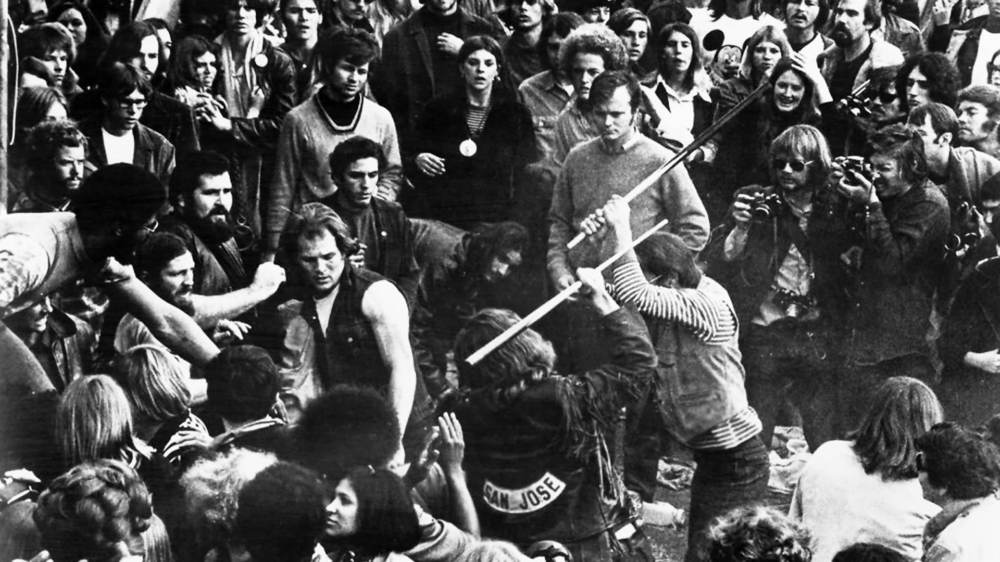
   - 直接电影在处理**高潮或危机状况**的**戏剧化素材**时表现最出色，如街头临近爆发的时刻
     - 《**美国哈兰县**》记录了矿工罢工和争取改善工作环境的过程，期间摄影团队经常被卷入暴力事件中，甚至有时成为被开枪的目标；纪录片的核心是“记录”真实事件，为事件提供不可辩驳的证据
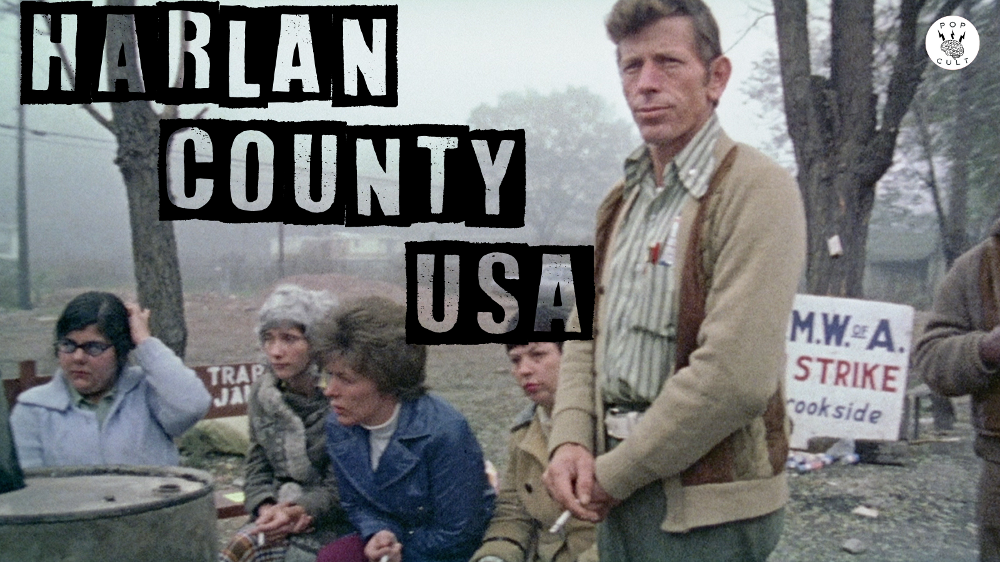

3. **形式主义或主观纪录片**
   - 起源: **维尔托夫**（Dziga-Vertov），20世纪20年代的苏联艺术家，他相信宣传是革命的工具，应教导劳工以**意识形态观点**衡量事情
   - 特点: **依主题组织**，而非按时间或前后因果
   - 例子: 电视深度报道节目《**六十分钟**》
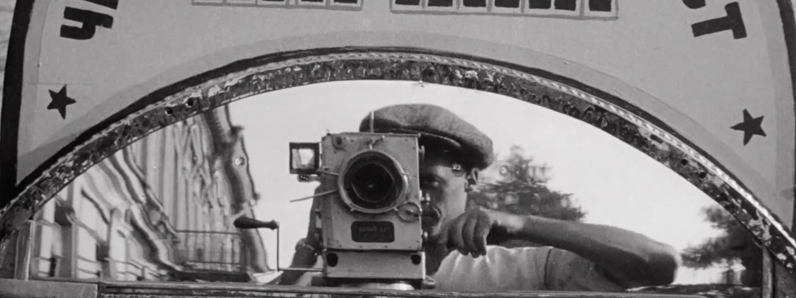
   - **历史**是由历史学家从繁杂的事实中**构建出的叙事**，他们选择强调某些事实并忽略其他的，从而塑造了**特定的历史观点**；拿破仑曾表示历史是人们**对过去事件达成共识的版本**
     - 电影《**刺杀肯尼迪**》通过华丽的剪辑手法和新奥尔良检察官的观点，为肯尼迪总统的刺杀事件提供了一个可能的解释

4. **先锋派影片**
   - 特点: **多变的叙事结构**，不依赖剧本，暖昧难懂，有自创的电影语言和象征方法
   - 例子: **玛雅·德伦**（Maya Deren），她的“个人”或“诗化”电影
   - 德伦的观点: 个人电影是垂直的，做纵深的探索，剧情片是水平的，依情境一波一波走的线性结构
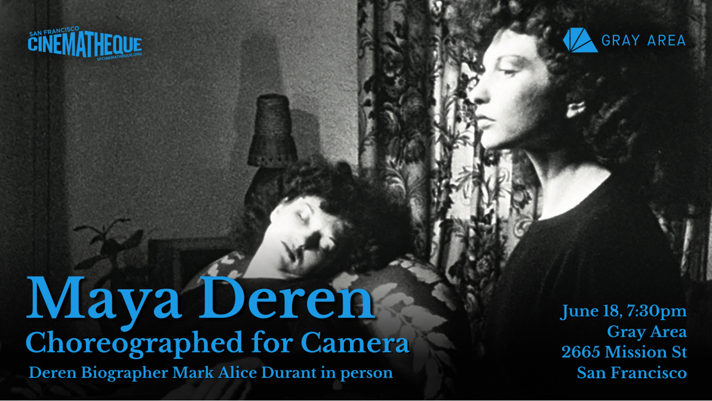
   - **结构主义电影**反对叙事，强调**无题材的抽象结构**，其中的符码由重复、对立、时间和空间的变化来定义；观众需**解读**这些符码和它们之间的关系，这一过程与观看影片的过程相似
     - 以《**刮胡刀**》为例，其电影内容是其结构形式，而不是影像题材，快速的闪动影像给观众带来眩晕效果
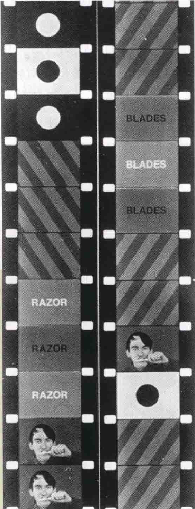
   - **欧洲先锋派艺术家**: 拒绝叙事，追求“**绝对电影**”（absolute film）
   - 例子: **汉斯·里希特**，主张**非再现**（non-representational）的形式，坚持只用**抽象形状和设计**
