# 理论（1）
1. **电影评论的三种类型**
   - **评论者**（reviewers）：主要进行新闻报道式的评论，描述电影内容和基调，偶尔强调美学价值，会指出电影是否适合儿童观看
   - **影评人**（critics）：重在评论而非报道，对电影的票房成败有一定影响
   - **理论家**（theorists）：专业学术派别，通常在哲学层面研究和论述电影

2. **电影理论的关注点和特性**
   - 理论家关注的范围较广，包括**社会、政治和心理含义**
     - 电影批评界长期以来对**喜剧片**持看不起的态度，尽管有卓别林、比利·怀尔德、伍迪·艾伦等**几位喜剧天才**获得认可，但大多数喜剧艺术家仍被视为电影理论的**二等公民**
     - 例如，优秀的喜剧家**费雷尔**虽制作了许多受欢迎的影视作品，如《**冰刀双人组**》这样的戏仿运动电影，充满尖酸刻薄和幽默，却往往未能获得电影批评界的高度评价
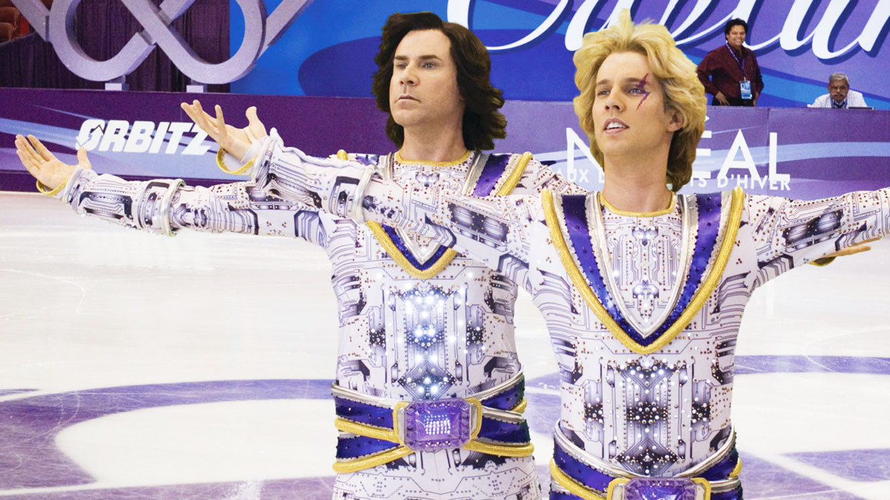
   - 电影理论主要由**欧洲人**主导，特别是**法国和英国**
   - **美国**电影评论传统**实践性较强**，理论较弱，但近来对电影媒介的理论含义**越来越感兴趣**，倾向于**实务批评**（practical criticism）

3. **电影理论的性质和发展**
   - 理论被视为**思考网络和美学原则**，而非绝对真理
     - “**杰作**”一词用于描述高质量的艺术作品，其评价通常由**有影响力的影评人、影展评审、产业界领袖和专业人士**决定，但这种评价带有**主观色彩**且需经过**时间的考验**
     - 电影成为杰作的标准通常包括在题材或风格上的**重要创新**，以及对角色和故事的**深刻而复杂的处理**，使人能**深入理解人性**
   - 不同的理论可能**适用于不同类型的电影**，没有单一理论能解释所有电影
   - 最新的理论发展强调**折衷方法**，结合不同理论并列使用
     - 《**马耳他之鹰**》可以被分析和讨论从至少**七种不同的理论角度**：（1）作为导演约翰·休斯顿的代表作品；（2）作为演员亨弗莱·鲍嘉拓宽戏路的媒介；（3）从电影工业史角度看作是华纳公司40年代的杰出作品；（4）作为侦探惊悚片和“蛇竭美女”（deadly female pictures）电影的代表；（5）从电影与文学改编的关系来分析；（6）作为40年代美国电影风格——黑色电影的典型；（7）从马克思主义角度看作是探讨人类贪欲和批判资本主义的作品
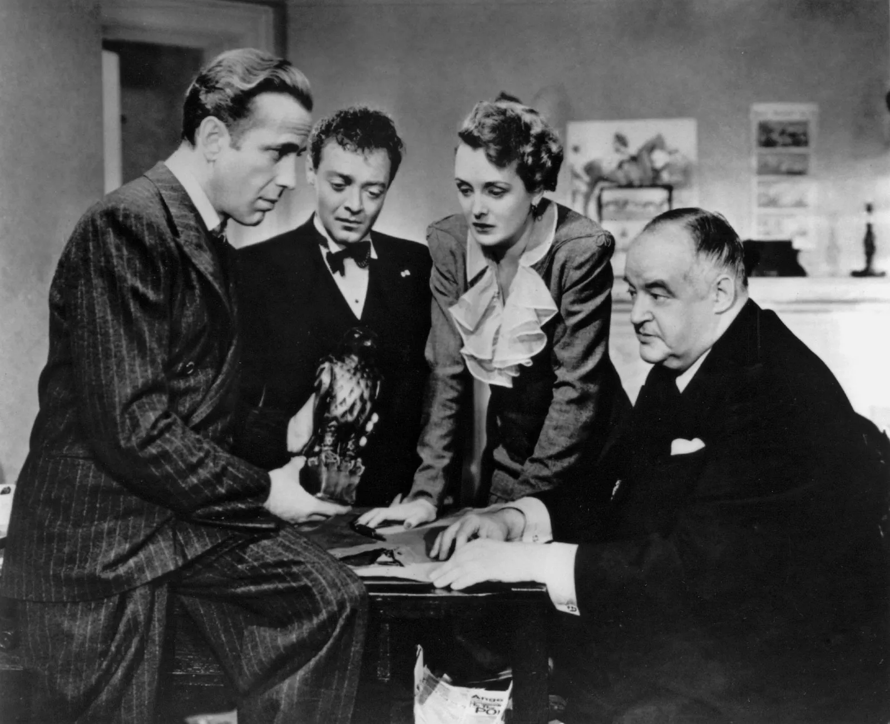

1. **传统电影理论家的关注点**
   - 电影的三个方面：**作品、作者、观众**
   - 关注作品的理论家强调电影的**内在动力**和**语言系统的运作**
   - **作者论**（auteur theory）强调理解电影需了解创作者，特别是导演
   - **结构主义**（structuralism）和**符号学**（semiology）自1970年代成为主流，结合多种理论方法，如类型、作者论、风格、图像学、社会氛围和意识形态
   - 在**电影历史学**（historiography）领域，趋向于强调各种理论的整合

## 现实主义风格
1. **现实主义理论的基本观点**
   - 现实主义理论强调电影作为**记录真实的艺术**，其中摄影机是**记录工具**而非表现媒介
     - **警匪、惊悚和郊区情节剧**通常采用现实主义风格，这种风格认为**生活表面即是真实**，艺术家的任务是**忠实地反映这种表面**，特别适合**揭露人性的阴暗面**
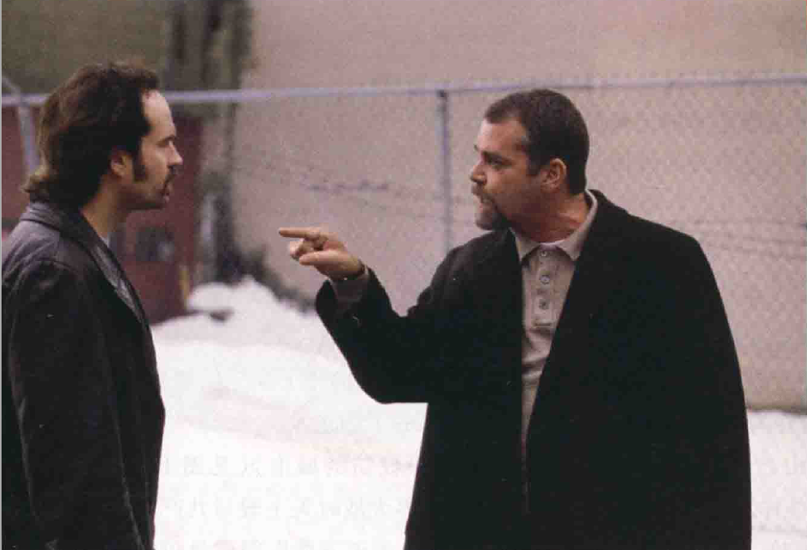
   - 现实主义理论家如**切萨雷·柴伐蒂尼**（Cesare Zavattini）和齐格**弗里德·克拉考尔**（Siegfried Kracauer）视电影为**摄影的延伸**，记录物质世界
   - 现实主义电影被视为“**存在**”（being there）的艺术，而非创造性艺术

2. **意大利新现实主义电影的特点**
   - **罗伯托·罗西里尼**（Roberto Rossellini）的《**罗马，不设防的城市**》被视为意大利**新现实主义的开山之作**
   - 电影以第二次世界大战时**罗马**为背景，描述天主教与共产党抵抗纳粹
   - 片中使用了**质量较差的底片和新闻片段**，采用了**真实的外景和非职业演员**，电影结构呈**片段性**
   - 电影中的一些刑囚戏份**因逼真而被删除**，特别是一段寓意着耶稣被钉在十字架上的场景，其中一个纳粹军官未能迫使一名共产党员泄露同伴的姓名后对其施以酷刑
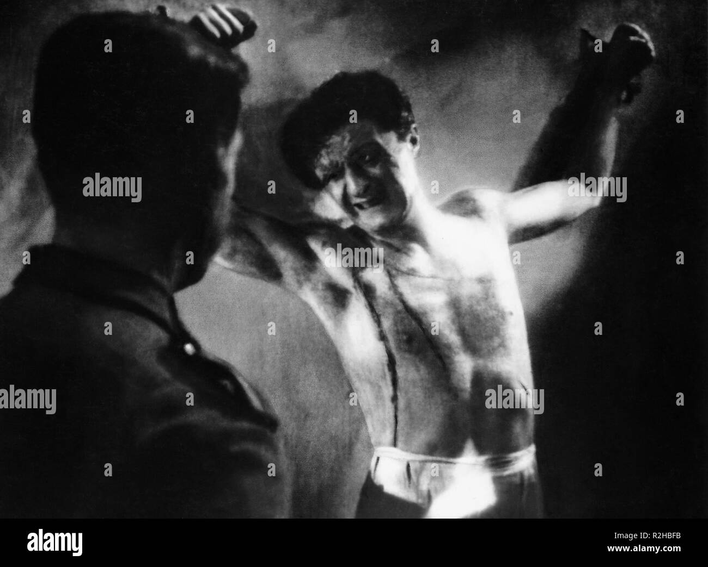
   - 法国影评人**巴赞**赞扬意大利新现实主义电影，强调其**人道主义精神**比影片风格更为重要

3. **新现实主义电影的道德和伦理观**
   - 罗西里尼强调新现实主义的**道德立场**优先于美学
   - 新现实主义运动的主要成员还包括**维斯康蒂**（Luchino Visconti）、**德西卡**（Vittorio De Sica）和**柴伐蒂尼**，他们都以道德作为创作的试金石
     - **德西卡、让·雷诺阿和萨蒂亚吉特·雷伊**是世界级的现实主义大师
     - 电影《**凤烛泪**》由德西卡执导、柴伐蒂尼编剧，讲述了一个依靠抚恤金生活的退休老人因无力支付房租而被迫离开公寓、在贫困中只有爱犬相伴的悲惨故事
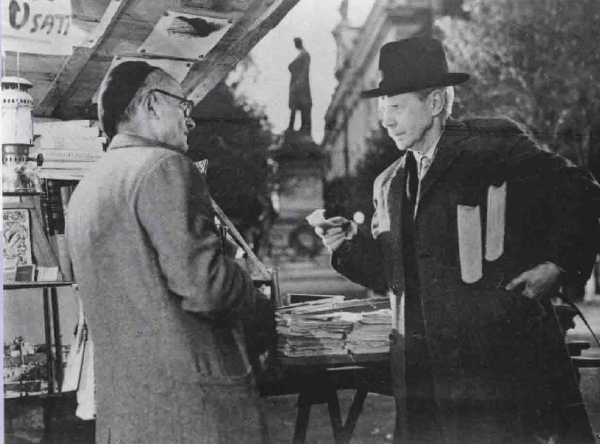
     - 让·雷诺阿的电影《**游戏规则**》通过描绘各种角色和行为来表达“**每个人都有理由**”的观点，包括一个气冲冲的劳工丈夫在华丽酒吧公然射击他认为诱奸妻子的人的场景，从而强调人物行为背后的复杂性和多面性
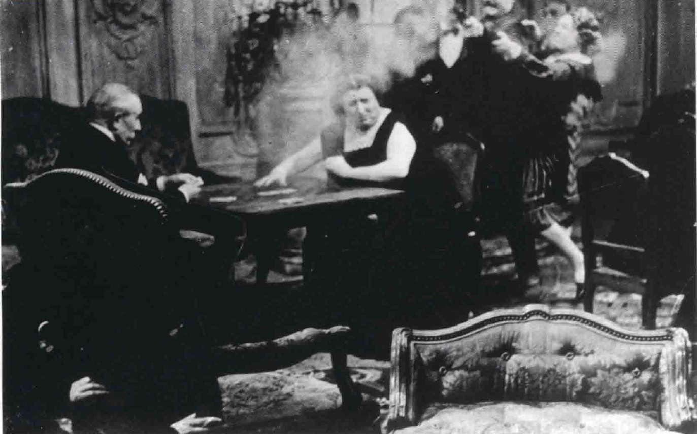
     - 雷伊的电影《**大路之歌**》作为人道主义作品，深入探讨了印度偏远村庄的贫穷和灾难，虽然令人哀伤，但它戏剧化地展示了人类的坚韧和精神上的高贵，引发观众对人性的深刻思考
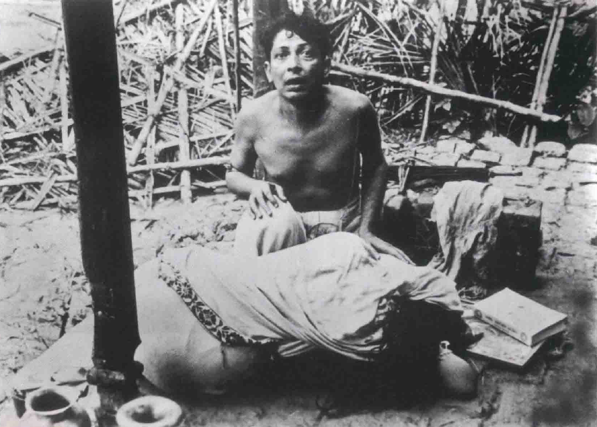
   - 运动的**主要意识形态**包括新民主精神、同情观点、描写法西斯时期和战后遗症、基督教和马克思主义的人道主义、强调**情感而非抽象意念**

1. **新现实主义电影的风格和形式**
   - 避免复杂的情节故事，采用**松散的结构**
   - **纪录片**的视觉风格，使用**真实的外景**而非搭建的场景
   - 使用**非职业演员**，包括主角，对白倾向于**口语和方言**
   - 剪辑、摄影和灯光**避免复杂技巧**，创造“无风格”的风格
     - “**道格玛95宣言**”（Dogma 95）是一套由丹麦导演如**拉斯·冯·特里尔**和**托马斯·温特伯格**于1995年提出的拍摄规范，旨在创造更逼真的写实电影，规则包括使用实景拍摄、禁止使用特效和滤镜、以及只拍摄日常生活等，以追求**极端现实主义**
     - 尽管这些规则严苛，导致**很少导演能完全遵守**，但这些创作者的作品在票房和评论上**受到好评**，因为角色真实且充满张力，如隆娜·谢尔菲在《**意大利语初级课程**》中展现的自然对白和出色演技，着重于人际互动关系
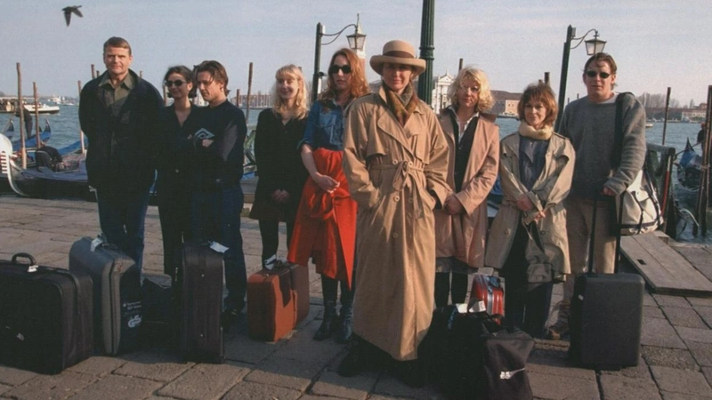

1. **现实主义理论的基本观点与对情节结构的态度**
   - **柴伐蒂尼**认为电影的主要职责是**呈现日常生活**，反对特殊角色和事件，提倡电影作为无障碍的现实呈现
   - 柴伐蒂尼**反感传统的情节结构**，认为真实的生活比传统电影更具戏剧性
   - 他认为导演的任务是**挖掘现实**，强调事实及其回响，而非剧情

2. **克拉考尔对电影的现实主义观点**
   - 《**电影的本性：物质现实的复原**》（Theory of Film: The Redemption of Physical Reality）中克拉考尔抨击**情节是现实主义的敌人**
   - 电影应展现“**未安排的现实**”，强调自然和随意，捕捉生活中容易被忽略的事物
   - 克拉考尔倾向于电影**作为连续的现实碎片**，形成**开放式结构**，而非封闭世界

3. **现实主义电影的实例与特点**
   - 《**偷自行车的人**》是**德西卡**（Vittorio De Sica）导演、柴伐蒂尼编剧的现实主义电影典范
   - 电影由**非职业演员**主演，讲述一个**失业工人**的生活，强调日常生活中的细节和挑战
   - 片中的事件和情感呈现**简单真实**，缺乏传统的情节解决方式，结尾暗示了**生活的连续性和人性的复杂性**
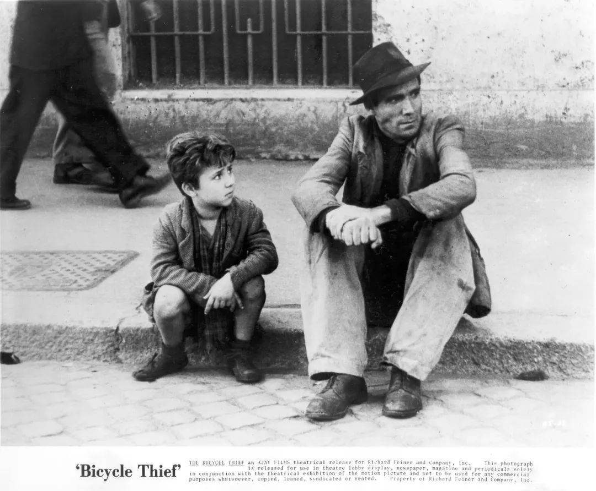

4. **现实主义与形式主义电影的对比**
   - 现实主义电影理论难以解释**形式主义电影**（如爱森斯坦（Eisenstein）及斯皮尔伯格（Spielberg）的作品）**的复杂性**
     - 电影《**锅盖头**》**过于写实地描绘**了美国海军狙击手在“沙漠风景”战役中的长时间等待和无聊，尽管准备充分，但最终并未参与战斗，导致影片**票房不佳**
     - 这种**长时间的等待**和**缺乏传统结构的叙事方式**并不符合美国观众喜欢快节奏、有明确起承转合的故事情节和积极情绪落幕的文化特性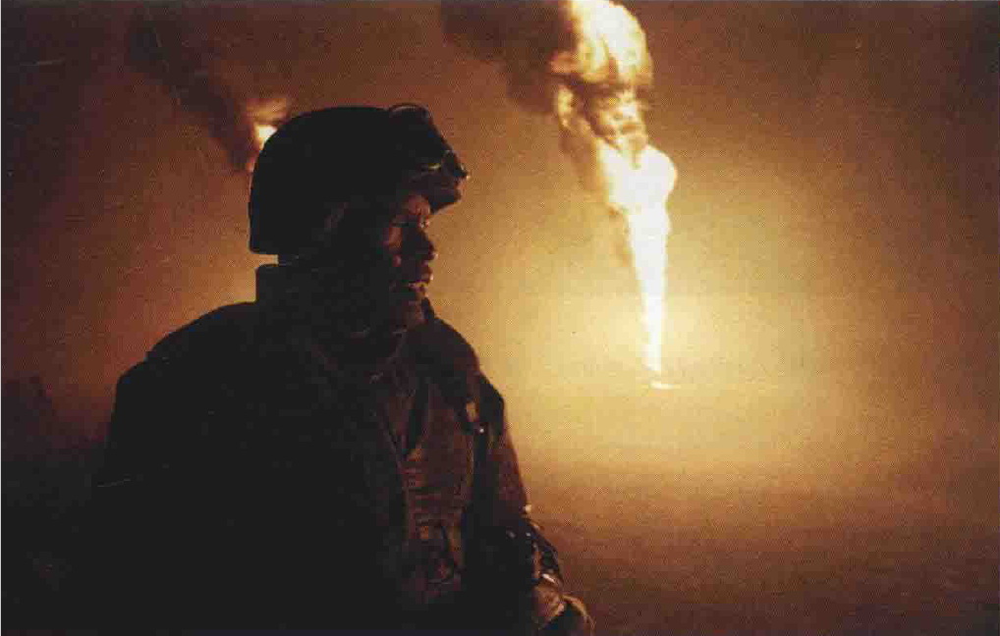
   - 现实主义电影注重**原始的情感力量和日常生活的真实描绘**，而形式主义电影则侧重于**艺术表现和技巧上的创新**
     - 意大利新现实主义运动虽**在20世纪50年代中期结束**，但其追求现实的态度和风格**继续影响全球电影**
     - 现今一些意大利导演如**奥尔米**继承这一传统，在作品如《**木屐树**》中展现基督教人道主义的价值观，通过类似纪录片的手法深入描绘农村家庭的日常生活、坚韧与尊严，呈现他们对上帝的单纯而深刻的信仰
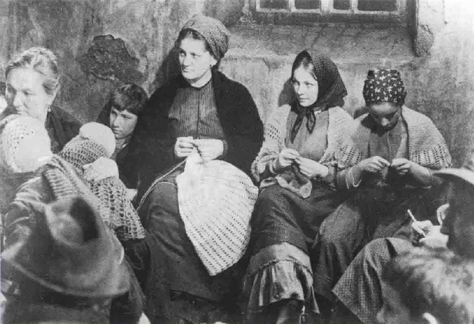

## 形式主义电影理论
1. **形式主义电影理论的核心观点**
   - 形式主义电影理论认为电影艺术源自**现实世界与电影世界的区别**，利用电影媒介的限制创造类似**真实的模拟世界**
     - 形式主义在电影中强调**愉悦原则和审美意念的丰富性**，优先于忠实呈现现实，如在科幻电影《**异形**》中，重点放在**视觉形状、结构和颜色的呈现**，而非仅仅模仿现实
     - 这种倾向在影片中通过**如抽象绘画般的高角度远景**和**周围布满散发着罪恶气息的颤抖蛋**的场景中得到体现
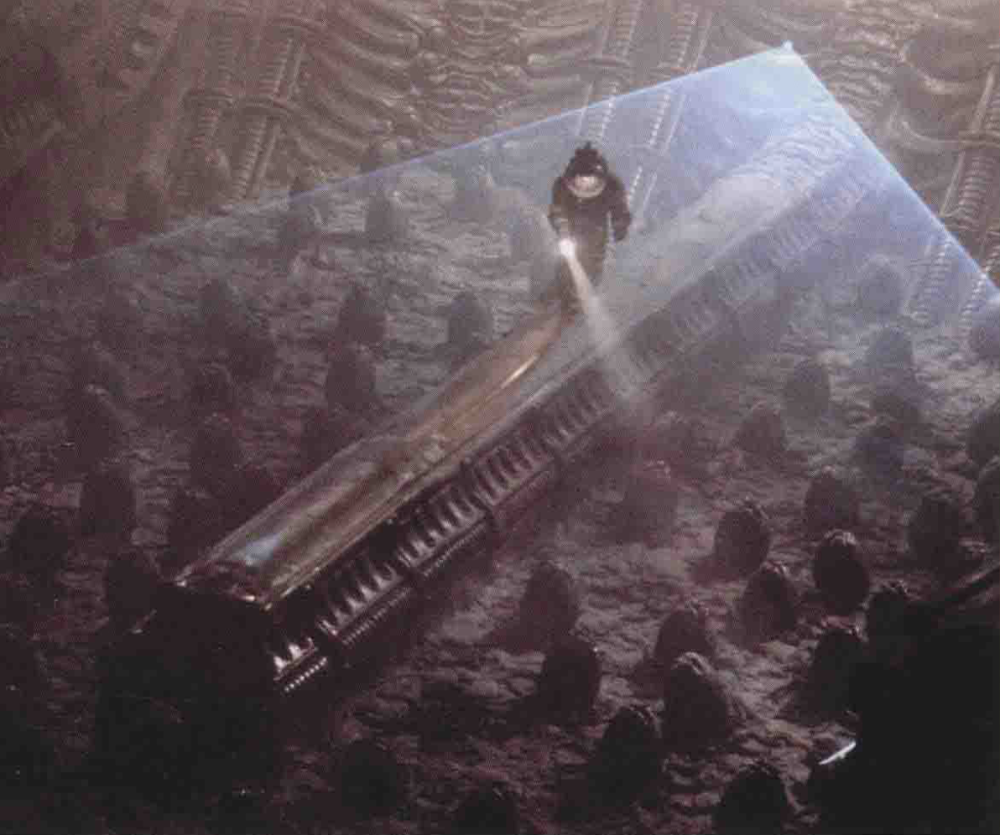
   - 形式主义者强调电影**不应仅是复制现实**，而是将观察到的特性**转译到电影的形式中**
   - 电影导演使用**媒介的限制**，如二维空间、有限的景框和割裂的时空，来**制造电影现实**
     - 在电影《**绿野仙踪**》中，米高梅创造了一个充满**形式主义的奇幻世界**，其中包含了会说话的狮子、飞翔的造物、跳舞的稻草人和闪耀着光芒的田野，这些人造景观和音乐一起构成了一个技巧上的胜利
     - 这部影片通过其**非现实的视觉和音乐元素**，为观众呈现了一个魔法般的、非现实的世界

1. **形式主义理论家的观点**
   - **鲁道夫・爱姆**（Rudolf Arnheim）是**格式塔心理学家**，他的《**电影作为艺术**》（Film As Art）一书在1933年出版，揭示了形式主义的重要理论
   - 爱姆的理论建构在**摄影机和人眼的不同认知模式**上，与**马歇尔·麦克卢汉**的理论相通
   - 爱姆和麦克卢汉认为电影和摄影捕捉到的影像与现实生活中的形象**完全不同**

2. **形式主义电影的实践与技巧**
   - 形式主义者利用电影的二维空间、剪辑等手段来**重新建构现实**，使空间在电影中成为**幻象**
   - 利用**场面调度和摄影机运动**在视觉上重新建构现实，同时在声音上使用**风格化对白、象征性音效和音乐**
     - 在电影《**连环套**》中，形式主义者通过**选择特定的镜位**来捕捉**场景的象征和心理寓意**，如将年轻少妇孤立在画面左侧、半身沉浸在黑暗中，以及通过**低角度拍摄**强调仆人对其未婚夫的控制，展现了角色之间的心理动态和权力关系
     - 这种拍摄方式不仅揭示了角色之间的情感和心理状态，还强调了仆人对整个情节的操控和主导地位
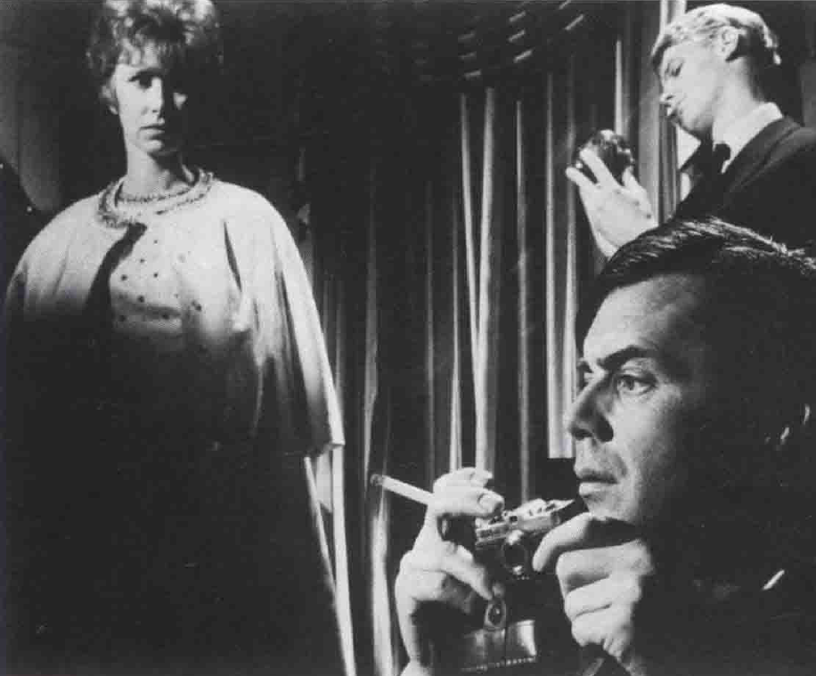
   - 形式主义电影**通过剪辑切断和重组时空**，以**苏联蒙太奇**（Soviet Montage）的方式创建**连续性**
     - **大卫·林奇**作为**先锋电影的代表性艺术家**，其电影探讨了潜意识中的恐惧、欲望、噩梦和性幻想，呈现出一种**怪诞且急迫的本能世界**，带有弗洛伊德式的心理学标签
     - 在《**蓝丝绒**》这样的电影中，如杰弗里这样的天真主角被描绘为对日常生活下隐藏的诡异、黑暗世界既震惊又排斥，揭示了人类精神领域中**野蛮和混乱的一面**
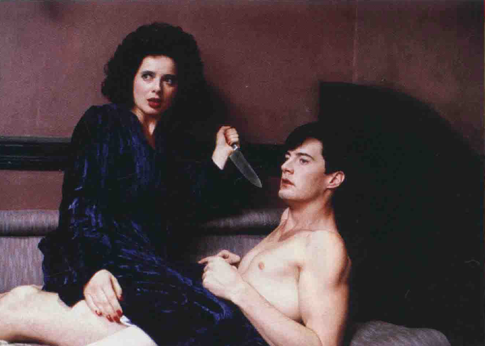

3. **形式主义与现实主义理论的适用性和限制**
   - 形式主义分析对希区柯克（Hitchcock）或基顿（Keaton）的电影有效，但对雷诺阿（Renoir）或德西卡（De Sica）的电影则有困难
   - 某些电影因其与现实相似而显得可贵，这表明电影种类和表现方式繁复，不可能用单一理论总括一切

