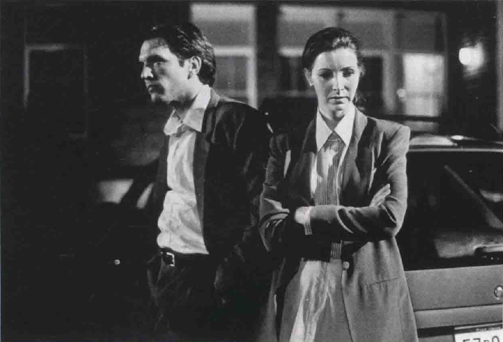

# 理论（2）
## 作者论
1. **作者论的提出与发展**
   - **作者论**（la politique des auteurs）由**特吕弗**在《**电影手册**》杂志提出，影响了**英美电影批评界**
   - 作者论成为**20世纪60年代主导的批评立场**，特别受年轻影评人推崇，影响了《电影》（Movie）、《电影文化》（Film Culture）和英法语版的《电影手册》杂志
     - **特吕弗**作为作者论的提倡者和法国新浪潮运动的重要导演，以其独特的个人风格拍摄了**安托万·杜瓦内尔系列影片**，成功描绘了主角在生活中的冒险和爱情经历，这些半自传性质的电影使得演员**莱奥德**成为法国新浪潮运动中最知名的演员之一
     - 这些影片强调了**特吕弗的个性和艺术家的独立性**，代表着法国新浪潮的核心理念

2. **作者论的核心观念**
   - **导演的个人视野**是好电影的关键，可以从他们作品的**主题和风格特色**中看出
   - **编剧**的贡献主要在**题材**上，艺术上被视为**中性的**，**导演的处理方式**决定了作品的艺术成就
   - 作者论认为拍好电影**不在于主题内容**，而在其**风格化的处理**，导演即是电影的“**作者**”
     - **独立制片导演**通常拥有比主流导演**更多的控制权**，因为他们的项目预算较低，往往涉及**自愿或减薪工作的参与者**，并倾向于探索**不寻常或非主流的题材**
       - 例如《**弹簧刀**》这样的电影，它带有**南方浸礼会教堂**的强烈气息，为这个古怪故事增添了丰富的精神层面

       - 《**她和他和他们之间**》通过探讨主角的**同性恋爱情**、他被同父异母妹妹抢走爱人和最好朋友对他的无助爱恋等复杂性题材，展示了与主流电影中常见的**异性恋和性别处理**相比更为真实、聪明、犀利且深入的**女性角色**，突出了女性的情感复杂性和偏执

1. **作者论对电影的贡献与评价**
   - 作者论支持者**重新评价**了许多导演的作品，推翻了前人的评断，尤其是那些被上一代评论家忽视的**通俗电影导演**
   - 被称为“作者”的导演通常在**制片厂制度**下工作，他们的**个人风格和技巧**能凌驾于制片厂的干预和二流剧本之上
     - 在大制片厂的黄金时代，美国主流电影**大多由制片厂控制**，导演更多被视为**合作伙伴而非具有创意的艺术家**；例如，《**欲海情魔**》这部电影，由华纳兄弟公司制作，强调无产阶级色彩，由**迈克尔·柯蒂兹**导演，他以**高效率和多才多艺**著称，能够驯服包括**贝蒂·戴维斯**在内的难缠明星
     - 这部电影展现了当时**制片厂对电影内容和制作的主导地位**，以及**导演在这个体系中的角色和挑战**

   - 作者论有其**弱点**，如对某些导演作品的**过度赞扬**和对新导演的**忽视**，以及对不同风格和类型尝试的导演的**不公正评价**

1. **作者论的影响与现代地位**
   - 到20世纪70年代，作者论在电影评论界赢得了**主要地位**，几乎所有严肃的电影评论都讨论**导演的个人视野**
     - 在美国当代电影中，如**迈克·尼科尔斯**导演的《**风起云涌**》这样的主流电影仍然是**企业化经营**的产物，其中导演扮演着**整合各种才能的统筹角色**
     - 该片根据记者克莱恩的政治小说改编，由**伊莱恩·梅**改编，以**特拉沃尔塔**为首的演员群出色地展现了克林顿总统的多面性格，尼科尔斯成功地将所有人的才华整合成为一个艺术整体

   - 在高度艺术化电影的价值上，作者论已确立其**主导性地位**
     - “**独创性导演**”这一术语现今常用来指代那些在作品中留下**独特印记**的电影艺术家，他们通过掌控剧本、表演和制作技巧来展现**个人风格**，无论是商业电影导演（如斯皮尔伯格、斯科塞斯或斯派克·李）还是独立制片导演
     - **伊曼纽尔·利维**的著作《**“圈外”的电影**》对美国独立电影运动进行了研究，探讨了这些导演如何在电影行业中表达其独特的创意和视角

## 折衷主义
1. **折衷主义的定义和影评人的观点**
   - **折衷主义**（eclecticism）被视为一种**实用的方法**，而不是理论，深受许多影评人喜爱，如**宝琳·凯尔**（Pauline Kael）在《The New Yorker》中的观点
   - 折衷主义评论将电影置于**合适的理论范畴**来讨论，引用**不同的风格与方法**
     - 电影《**弗里达**》记述了墨西哥大画家**弗里达·卡洛**的生平，由同为墨西哥人的演员**哈耶克**主动推动制作，并亲自挑选女导演**泰摩尔**来增强角色的细腻色彩，展示了影评**将评论与社会运动如女性主义结合**的趋势
     - 这部电影的成功不仅体现在它赢得的众多奖项和哈耶克的奥斯卡提名上，也在于它与卡洛的“**魔幻写实**”风格画作的完美融合

   - 影评人如**安德鲁·萨里斯**（Andrew Sarris）虽然认同作者论，但也会采用不同的角度来探讨电影

2. **折衷主义评论者的特点和方法**
   - 折衷主义评论者通常具有**良好教育背景和广泛的艺术知识**，如罗杰·伊伯特（Roger Ebert）、戴维·登比（David Denby）和弗兰克·里奇（Frank Rich）
   - 他们的文章中常提及**多种文化层面**，如文学、戏剧、政治和视觉艺术，以及思想家的观点
   - 折衷主义评论者通常注重**个人美感偏好和感性传统**，他们的写作也被视为**文学**
     - 电影《**独立日**》获得了巨大的商业成功，包括美国票房3亿和外国票房4.9亿美元，以及录像带和电视版权上的5亿收入，得益于20世纪福克斯公司高效的**3000万美元宣传**和电影中**引人注目的特效**
     - 尽管电影受到大众的欢迎，提供了**逃避式娱乐**，但严肃的影评人往往对这类电影**不屑一顾**或认为其**缺乏原创性和挑战性**，反映了大众和专家在电影评价上的**不同观点和期望**

3. **折衷主义评论的优点和局限性**
   - 折衷主义评论认为单一理论无法解释所有电影，强调**影评人个人反应的陈述**
   - 折衷主义评论的主要依据是**个人品味**，承认影评人有盲点，允许不同意见的存在
   - 折衷主义的缺点包括**过度主观和印象主义**，缺乏统一的理论框架，其评论可能因**文化背景**而受限

4. **折衷主义对电影评价的影响**
   - 折衷主义评论者如宝琳·凯尔认为影评的目的是**增加观众的兴趣和见闻**，传递知识和热情
   - 优秀的折衷主义评论者能写出**具有丰富信息性的作品**，即使读者不完全同意其论点
   - 折衷主义面对电影评论的挑战，强调**职业上的适应性**和**对不同电影的开放态度**

## 结构主义和符号学
1. **结构主义和符号学的提出背景及目的**
   - 在20世纪70年代，**结构主义和符号学**作为电影理论发展起来，旨在对抗个人情感式评论的不足
   - 这两种理论借鉴**语言学、人类学、心理学、哲学**的方法，发展出**系统性的电影分析词汇**
   - 主要研究对象为**美国电影**，由**英法评论家**主导，他们将美国电影视为研究的主要范围

2. **符号学的主要观点和应用**
   - 符号学研究电影如何通过符号传达意义，探讨**符号**（signs）和**符码**（codes）的传播
   - 法国理论家**克里斯蒂安·麦茨**（Christian Metz）将符号学引入电影分析，运用**结构语言学词汇**建构电影符号理论
   - 符号学理论认为电影是由**复杂的符号**组成，观众在看电影时**本能或下意识地诠释**这些符号

3. **结构主义的主要观点和应用**
   - 结构主义者主张使用**更准确**的单位“**符号**”，而非模糊的“镜头”作为电影分析的**基本单位**
     - 符号学家认为，电影中的每个镜头都包含着**多个具有象征意义的符号**，他们通过“**切题原则**”来分析这些符号，并解释其意义，这一过程包括研究空间、物质、摄影特质以及镜头运动、语言、音乐和节奏等元素
     - 例如，在电影《**金发维纳斯**》中，符号学家可能会详细分析玛琳·黛德丽的白色西装、纸龙、场景透视线条、阴影中的女人等元素，并探索它们在剧情上下文中的意义

     - 符号学家认为，单一镜头的复杂性**远远超出传统影评人的理解**，因为**一个镜头**可能含有**数百个符号**，每个都有其独特的意义，而不仅仅是一个简单的句子或段落
   - 结构主义可用于分析民族电影、类型或特定的电影，如日本电影中的“传统”与“现代”冲突
     - **小津安二郎**的电影在20世纪70年代后在美国受到关注，因其作品强调了传统价值观和家庭生活，尤其是在《**秋刀鱼之味**》中，通过主角鳏夫与未婚女儿的故事，展示了理想与现实之间的鸿沟以及家庭关系的复杂性

     - **黑泽明**是**现代价值与痛苦个人**的代言人，而**小津**以其对传统日本价值的深入描绘，成为**保守日本人**（特别是父母）的代言人，电影中的**嘲讽和情感深度**使其作品具有独特的艺术价值和深刻的社会意义
   - 结构主义者对**深层结构**（deep structure）特别感兴趣，认为它与电影的表面结构是相互独立但相关的

1. **结构主义和符号学的批评及局限性**
   - 符号学和结构主义虽然为电影评论提供了**新的分析工具**，但它们本身**并不能确定电影中符号和符码的价值**
     - 符号学方法在讨论电影时的主要缺点是**无法深入探讨电影的非物质层面**，例如无法充分解析电影《**温柔的慈悲**》中关于乡村音乐明星通过基督信仰获得救赎的精神层面

   - 这些理论的**复杂性和晦涩难懂的术语**可能导致它们难以被广泛理解和应用
   - 这些理论的有效性取决于评论者的知识、品味、热情、学问和敏感性，而非理论方法本身

## 历史学
1. **电影历史学的概念和多样性**
   - 历史学研究**各学派的言论、原则及方法学**，电影史作为一门研究领域，涉及**广泛的视角和方法**
   - 电影史不是单一的历史观，而是根据影史家的个人兴趣、偏好来定义，涵盖**多种电影史**
   - 存在**四种**主要的电影史类型：美学史、技术史、经济史和社会史

2. **电影历史的四种主要类型**
   - **美学史**：将电影视为**艺术**，专注于**经典电影传统和伟大的电影工作者**，侧重于**艺术丰富性**而非商业价值
   - **技术史**：将电影视为**发明的历史**，关注**电影技术的发展**和背后的美学、商业及意识形态寓意
   - **经济史**：将电影视为**工业**，研究电影产业的**财务状况**和**资本主义制作系统下的发展**
   - **社会史**：认为电影反映**观众的价值观、欲望和恐惧等**，专注于电影作为**集体经验**和某一年代的**共同情感**，对**社会刻板印象**（social stereotypes）相当有兴趣

3. **电影历史的应用和批评**
   - 影史家根据不同的视角筛选证据，这个过程称为**前景化**（foregrounding），带有**价值判断**
   - 由于电影的**复杂性和多样性**，不同的历史学家专注于不同的电影种类和事件
   - 各派影史家都只能呈现**全部电影史的某一部分**，因此电影史研究呈现出**多元化和分化**

4. **电影历史学的深入探索**
   - **美学史学者**通常关注那些经得起时间考验的**重要作品**，有时被批评为忽略社会、工业及技术上的影响
     - **罗伯特·奥尔特曼**，作为当代电影的**重要艺术家**，以其作品如《**银色·性·男女**》等著称，这部电影忠实地改编自雷蒙德·卡佛的短篇故事，带有愤世嫉俗和挖苦的腔调，吸引了众多大明星参演，以彰显对奥尔特曼的崇敬
     - 尽管影评人对其给予**高度评价**并获得**多个奖项提名**，但该影片在票房上的表现却**不尽人意**，未能激起大众对这类电影的兴趣

   - **技术史学者**如**雷蒙德·菲尔丁**（Raymond Fielding）将电影史视为技术发明决定的历史，关心**发明家及科学家的贡献**
     - 电影技术史中，**机械革新**如20世纪50年代末期为电视记者设计的**轻巧、便携的摄影机、录音设备和快速底片**等，极大地影响了电影的美学发展
     - 这些技术的创新使得剧情片导演能在20世纪60年代使用这些设备**在实景中拍摄**，从而为电影带来了**更自然、真实的写实风格**

   - 经济史学者如**本杰明·B·汉普顿**（Benjamin B. Hampton）所著的《**美国电影工业史：从开端到193l年**》（History of the American Film Industry from Its Beginnings to 1931）和**托马斯·H·古巴克**（Thomas H. Guback）所著的《**国际电影工业**》（The International Film Industry：Western Europe and America Since I945）研究电影产业的**财务状况和投资者关系**
   - **社会史学者**关注**观众对电影的反应**和**电影在社会中的角色**，研究如何反映观众的情感和价值观，例如**罗伯特·斯克拉**（Robert Sklar）所著的《**电影创造美国人**》（Movie Made America）和**加思·乔伊特**（Garth Jowett）所著的《**电影：民主的艺术**》（Film：The Democratic Art）都充满了反映观众好恶的**统计数据**

1. **电影历史学的综合和影响**
   - 不同历史学家根据自己的兴趣提出**不同的问题**，涉及电影的美学、技术、产业或社会方面
   - 结合不同历史学派的方法能**减少扭曲和误解**，提供更全面的电影历史理解
     - **罗伯特·C·艾伦**（Robert C. Allen）和**道格拉斯·戈梅里**（Douglas Gomery）在《**电影史：理论与实践**》（Film History: Theory and Practice）中讨论了**各流派的优缺点**
   - 电影历史学家的知识、品味和敏感性是决定其分析价值的关键因素