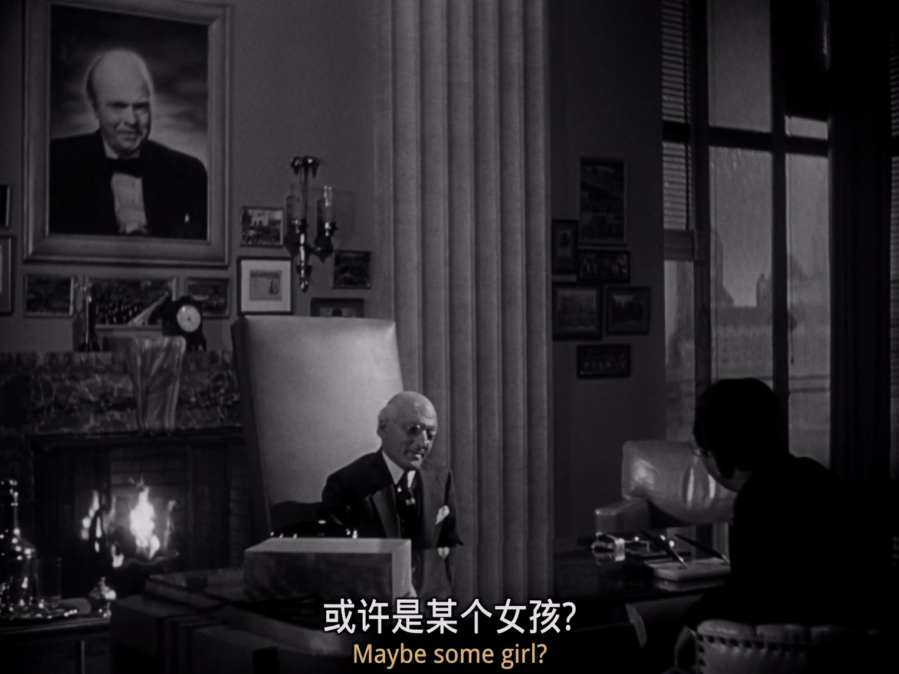
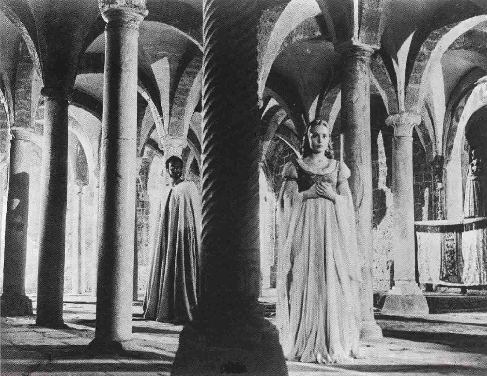
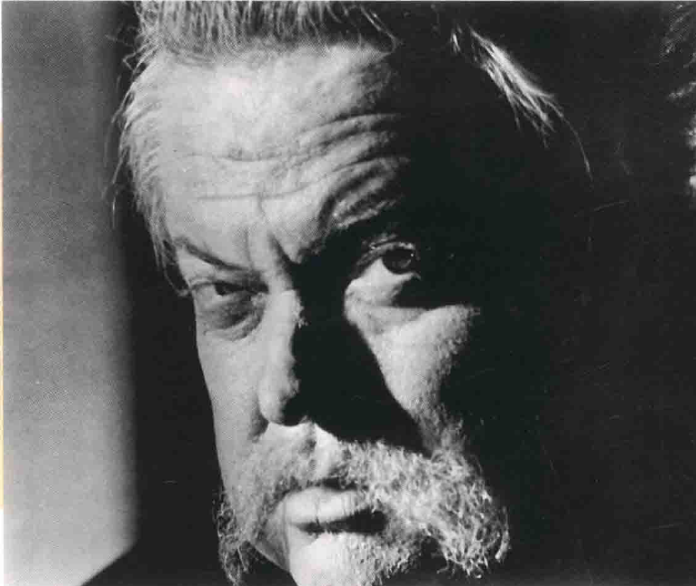

# 综论
1. **电影背景和角色灵感来源**
   - 《公民凯恩》是关于有权势的报界大亨**查尔斯·福斯特·凯恩**（Charles Foster Kane）的虚构传记
   - 影射了真实的报界名人**威廉·伦道夫·赫斯特**（William Randolph Hearst）
   - 电影角色是基于**多个美国大亨的混合体**，特别是赫斯特
   - 编剧**赫尔曼·曼凯维奇**（Herman Mankiewicz）认识赫斯特和他的电影明星情妇**玛丽昂·戴维斯**（Marion Davis）

2. **查尔斯·福斯特·凯恩的生平**
   - 凯恩**出生贫寒**，八岁时因母亲**继承遗产**被送至寄宿学校
   - 成长期间由**政治立场保守**的银行家**撒切尔**（Walter P. Thatcher）监护
   - 年轻时**堕落消沉**，二十多岁决定成为**报人**
   - 与**伯恩斯坦**（Bernstein）和**利兰**（Jed Leland）合作，致力于**支持弱势群体**和**打击腐败权力机关**

3. **个人生活和职业生涯**
   - 娶了美国总统的侄女**埃米莲**（Emily Norton），但婚姻最终破裂
   - 中年时有情妇**苏珊**（Susan Alexander），一位美丽但头脑空空的女店员
   - 竞选纽约市长时被对手**吉姆·格蒂斯**（Jim Gettys）威胁揭露**私生活丑闻**，最终落选
   - 埃米莲与他**离婚**，带走**孩子**，他开始经营**苏珊的歌剧事业**，最后两人**分开**

4. **凯恩晚年生活和去世**
   - 凯恩在巨大的宫殿**仙纳杜**（Xanadu）中与苏珊隐居
   - 苏珊忍受多年后**离开他**，凯恩**孤独苦涩**地在仙纳杜

## 摄影
1. **摄影师与奥逊·威尔斯的合作**
   - **格雷格·托兰**（Gregg Toland）认为《公民凯恩》是他事业的高峰
   - 刚开始时，托兰对威尔斯设计灯光的做法有些**困惑**，但最终采取了**放手**的态度
   - 尽管如此，托兰和他的摄影团队还是**悄悄进行了技术调整**

2. **《公民凯恩》的摄影特点**
   - 电影的每个画面都经过**仔细设计**
   - 使用了深焦摄影、低调灯光、丰富的细节肌理、大胆的构图、前后景极端对比等**多种技术**
   - 影评人**詹姆斯·纳莫尔**（James Naremore）形容这种技术堆积如“**应有尽有的七层大蛋糕**”

3. **电影中的灯光与象征意义**
   - 电影在不同时期使用了**不同的灯光风格**，以反映凯恩的**生活阶段和性格变化**
     - 本片通过**隐藏的光源**造成的**抽象形状**，在放映室场景中创造出**惊人的视觉效果**，为电影的叙事和视觉丰富性奠定基调

   - 在凯恩年轻时采用**高调路线**，而随着他变老和性格变得尖酸刻薄，灯光**逐渐变暗**，**对比增强**
   - **高反差对比**的灯光用于凯恩的**脸部**，象征他**正直和堕落的两面人格**，有时**一边明亮一边昏暗**，表现两种性格的**并存**
   - 影片中**暗藏的象征意义**，如凯恩在签署“**原则宣言**”时脸部沉入黑暗，预示他**未来的性格转变**

4. **托兰的深焦摄影技术**
   - 在20世纪30年代，托兰经常与导演**威廉·惠勒**（William Wyler）合作实验**深焦摄影**
   - 《公民凯恩》中的深焦技术比惠勒的作品更加华丽，使用深焦摄影配合**广角镜头**来**夸大人物间的距离**
   - 这种技术在《公民凯恩》中作为**分离、疏离和寂寞**的象征

5. **深焦摄影在叙事中的应用**
   - 深焦摄影鼓励观众**主动探索画面信息**
     - 威尔斯的深焦摄影技术允许在同一镜头中**同时捕捉多个空间平面**，维持场景的**客观完整性**，减少**剪辑**的需要
     - 这种方法提高了观众的**参与度**，使他们能够在镜头中**自由选择关注点**，而不是被动接受导演的引导

   - 以**苏珊·亚历山大自杀**的场景为例，通过**不同距离的构图**暗示因果关系：（1）毒药和空杯子在特写距离（2）苏珊的喘气声在中景（3）凯恩敲门和推门的动作在远景
   - 这种场景设计象征着**视觉上的指责**，暗示了凯恩对苏珊的影响

6. **特殊效果的运用**
   - 《公民凯恩》中运用了**多种特殊效果**，赋予场景不同的感觉
   - 例如，**仙纳杜的外景**通过特效展现魔幻特质；**政治集会场景**则通过特效给予群众和厅堂以真实之感
     - 雷电华公司的特效部门在《公民凯恩》中使用了**大量特效技术**，包括微缩模型、合成遮盖和多重曝光，其中**80%以上的镜头**涉及特效处理，创造了**具有史诗感的场景**
     - 尽管电影大量使用特效，但整部影片的制作成本只有**70万美元**，按1941年的标准来看并不奢侈

7. **对后续电影风格的影响**
   - 20世纪40年代的美国电影，在主题和影像上**逐渐变得阴暗**，部分受到《公民凯恩》的影响
   - 这个时代最重要的风格之一是**黑色电影**（film noir），与时代气氛相符
   - 奥逊·威尔斯的**后期作品**，如《**上海小姐**》（The Lady from Shanghai）和《**历劫佳人**》（Touch of Evil），仍然保持了一定程度的**黑色电影风格**
   - 托兰于1948年48岁时去世，对美国电影是**一大损失**

## 场面调度
1. **场面调度的特点**
   - 威尔斯擅长**戏剧张力的表现**，电影中使用**远景镜头**较多，类似于**剧场**的风格
   - 画面构图**紧密而封闭**，使用**景深构图**，将重要信息分布在**前景、中景和背景**
   - 角色间**距离的灵活安排**用以说明关系的变化，例如《询问报》办公室的场景展示了凯恩、伯恩斯坦和利兰的合作关系

2. **单一镜头的分析**

   - **主控画面的对比**：小凯恩在**画面中心**，深色服装与白雪形成**强烈对比**，吸引观众注意
   - **灯光调性**：内景采用**温和的高调灯光**，外景为**极高调光线**
   - **镜头和摄影机距离**：**深焦**画面，前景**中景**距离，背景**大远景**
     - 摄影机与撒切尔和小凯恩母亲是**个人化**（personal）亲密的距离，与老凯恩属于**社会性**（social）距离，对小凯恩是**公众**（public）距离
   - **角度**：摄影机角度**略高**，营造**宿命感**
   - **彩色的意义**：无法应用，因为影片为**黑白**
   - **镜头/滤镜/底片**：使用**广角镜头**捕捉景深，没有使用滤镜，底片感光度可能**较低**
   - **次要对比**：从小凯恩到撒切尔和母亲的**视线转移**，以及签署文件的**光线处理**
   - **密度**：画面**信息密度高**，高调打灯法使**细节清晰**
   - **构图**：画面如拔河般**一分为二**，左右**各两个角色**
   - **形式**：**封闭的构图**，所有元素**仔细安排**，类似封闭舞台
   - **取景**：**紧密排列**，每个角色被**固定在自己的空间内**
     - 隔在外面的小凯恩被窗户框一层又一层地框住，他短暂的自由仅是个**假象**
   - **景深**：有**四个景深范围**，从**前景**到**远景**
   - **角色位置**：小凯恩和父亲在上方，撒切尔和母亲在下方，反映了**控制局面的反讽**
     - 夫妻俩在构图上能分开多远就多远，几乎到了**画面边缘**，使撒切尔和小凯恩反而聚在中间——这种**强迫的亲密性**让双方到后来都很不满
   - **演员的角度**：父亲**微侧**，撒切尔**正面**，小凯恩母亲**侧面**
   - **演员间距离与亲密度**：撒切尔和母亲**亲近**，与老凯恩**疏远**，与小凯恩**距离遥远**

## 摄影机运动
1. **威尔斯对摄影机运动的运用**
   - 威尔斯擅长使用**移动摄影机**，以表现电影中的**动感和活力**
   - 他将摄影机的运动与**角色的年龄和状态**相对应：凯恩年轻时摄影机**动感强烈**，老年时则**静止不动**
     - 年轻的凯恩活力四射，摄影机通过与他动作同步的移动镜头捕捉他的精神状态，如此处他滑稽地来回移动，宣布与埃米莉订婚的消息

   - 这种动感原则与**凯恩行为的变化**相符合，年轻时活泼、年老时行动缓慢
     - 在**老年凯恩**的场景中，**远距离**的摄影技术和**深焦摄影**使凯恩显得**遥远、孤立**，与其他人和世界**隔离开来**，强调了他的**疏离和孤独**
     - **苏珊**在场景中显得**渺小、不重要**，尤其是在巨大火炉和雕像前，形成了与凯恩强烈对比的**次要元素**，增加了场景的**戏剧性和讽刺意味**

2. **升降镜头的象征意义**
   - 威尔斯在电影中**巧妙地运用升降镜头**，不仅为了**美观**，也承载着**重要的象征意义**
   - 例如，苏珊**得知凯恩死讯**的场景中，摄影机通过**一系列复杂的移动**最终聚焦在**苏珊**身上，表现了**对其隐私的侵犯和她的痛苦**

   - 苏珊**歌剧首演**时，摄影机的上升运动带有**喜剧效果**，凸显了她歌声的不足

   - 本片的结构类似**神秘电影**，以一系列**推轨和溶接镜头**展示追寻大谜团的概念
     - 从一个“闲人勿进”的牌子开始，摄影机穿过铁丝围墙、铁栏，至带有“K”字母的铁门，背景中的仙纳杜隐约透出烟雾和孤独的灯光，暗示着神秘的发生和探索的开始

3. **电影中的缺陷**
   - 《公民凯恩》虽是杰作，但也有**不足之处**
   - 例如，在苏珊离开凯恩时，凯恩愤怒破坏卧室的场景，镜头**过长**且摄影机**离动作太远**，未能充分表达凯恩的**愤怒和混乱**
   - 某些评论家认为这个场景应该**更紧凑**，通过剪辑来更好地传达情绪

4. **摄影机运动与主题的配合**
   - 电影中摄影机的动力应与题材**紧密配合**
   - **过度或不足的摄影机运动**可能会影响电影的整体效果
   - 适当的摄影机运动能增强电影主题的表达，不当则可能导致场景效果减弱

## 剪辑
1. **剪辑的多样化风格**
   - 威尔斯在《公民凯恩》中运用了**多种剪辑风格**，如**约翰·斯波尔丁**（John Spalding）所指出
   - **苏珊回忆她的歌剧生涯**：**长镜头**展示她与老师对戏，后台景象用**短碎镜头**强调忙乱，**平行剪辑**处理苏珊的演出和利兰的反应，凯恩与苏珊的争吵使用**古典剪辑**

   - 苏珊全国巡演采用**主题浓缩剪辑**，而苏珊自杀的戏则用**深且长的镜头**

2. **剪辑与其他技术的结合**
   - 剪辑技术常与**声音技术**和**片断的故事结构**相结合
     - 威尔斯在**政治演说场景**中巧妙地使用剪辑，交替使用凯恩演讲的**远景镜头**和观众的**近景镜头**，以及观众全景的**再建立镜头**，虽然宽广的演讲厅和大量群众都是假象，但剪辑让它们看起来逼真

   - 威尔斯**利用剪辑浓缩时间**，配以**声音作为连接**，例如通过一连串早餐镜头表现凯恩和妻子的疏离过程
   - 镜头从**亲密的中景**逐渐变为**两人分隔的远景**，显示**婚姻关系的破裂**
   - 威尔斯通过**蒙太奇技巧**展现了凯恩与埃米莉婚姻破裂的过程，以**远距镜头**和**天花板的拱形**强调他们之间的**疏远感**

1. **预示和暗示的运用**
   - 威尔斯通过剪辑**预示和暗示故事发展**
   - 例如，凯恩初见苏珊，经历从被泥泞弄脏到在她公寓中洗澡的转变，**平行剪辑**显示**苏珊生活环境的改善**，暗示了她成为凯恩情妇的过程
   - 通过苏珊外形和生活环境的变化，观众可以**推断二人关系的发展**

## 声音
1. **声音技巧的运用**
   - 威尔斯借鉴**广播剧中的声音技巧**，利用音效来创造**空间感和外部环境**的印象
   - 他在**电影声带**中应用这些技巧，例如每个镜头的**运动音质**、**远景声音的模糊**和**特写的清晰**
   - 声音也被用来做**蒙太奇段落的溶接和叠影效果**
     - 本片中的视觉效果与相应的听觉效果**紧密相连**，例如苏珊·亚历山大的高音、交响乐团音乐、闪光灯声和印刷机转轮声在蒙太奇段落中结合，形成了一种**机械式的声音混合**，加强了女主角**受害者的形象**，直到她感到筋疲力尽和麻木不仁

2. **声音转接与时空剪辑**
   - 威尔斯使用**声音转接**来表现**时空的跳跃**，如《公民凯恩》开场的新闻报道节目“行进新闻”（News On the March）的旁白
   - 在其他场景中，例如利兰的演讲和凯恩的选举活动，也运用声音转接技巧

3. **对白重叠与声音效果**
   - 威尔斯**将对白重叠**，特别是在**多人讲话**的场面，增加**戏剧性和滑稽效果**
   - 在仙纳杜的场景中，凯恩和苏珊的喊叫声表现了他们**关系的不和谐**
   - 声音效果也用于**增强场景的真实感**，如麦迪逊广场的叠影假群众场景中群众的叫声和欢呼声

4. **配乐与象征意义**
   - **伯纳德·赫尔曼**（Bernard Herrmann）的配乐精细，为主要角色和事件创造了**特定的音乐母题**
     - 赫尔曼的第一部电影作品《公民凯恩》由他在拍摄期间一直参与，花费**12周时间**谱曲
     - 他的与威尔斯有独特合作方式，通常是**剪辑适应音乐**，而不是音乐适应剪辑；赫尔曼此后也为威尔斯和希区柯克创作了多部电影的音乐

   - 音乐母题在影片中以**不同调子和节奏**变奏出现，如**玫瑰蓓蕾母题**在开场和记者调查中的运用
   - 音效与视效的**平行运用**，例如凯恩与首任妻子早餐蒙太奇中音乐的变化与婚姻崩溃的对应
   - 声音也被用作**象征手段**，如苏珊巡回演出中的**声音变形**象征她的绝望和沮丧

## 表演
1. **演员阵容与表演特点**
   - 威尔斯带来了**一大批合作过的演员**，包括**15个不为人知的演员**
   - 尽管他们大多数是**首次出现在银幕**上，但表演成熟自然，令人信服
   - 演员们之间的**配合无间**，整体效果天衣无缝，例如威尔斯、多萝西·科明戈尔（Dorothy Comingore）、约瑟夫·科顿（Joseph Cotten）、埃弗里特·斯隆（Everett Sloane）和阿格尼丝·穆尔黑德（Agnes Moorehead）的表演

2. **龙套小角色的表演**
   - 即使是**只有几句台词的小角色**也表现出色
   - 演员们掌握角色的**性格矛盾**，保持表演的**一致性**
   - 如**雷·科林斯**（Ray Collins）饰演的**吉姆·格蒂斯**（Jim Gettys）是个圆滑的角色，对凯恩的行为感到愤怒和震惊

3. **特定角色的深度解读**
   - **穆尔黑德**饰演的凯恩母亲虽只有一场戏，却留下**深刻印象**，其表现严厉而坚定
   - **斯隆**和**科顿**饰演的伯恩斯坦和利兰**形象生动**，伯恩斯坦忠诚而单纯，利兰则更加复杂和深邃
   - **科明戈尔**在电影中扮演**苏珊**，为这部可能显得过于冷酷和理性的影片带来了**温暖**；电影通过对她的**特写镜头**，增强了观众对她复杂、矛盾、可怜却又令人恼怒和可笑的角色的**同情**

4. **威尔斯的表演**
   - 威尔斯的表演备受赞誉，被《时代周刊》的**约翰·奥哈拉**（John O'Hara）和导演**格里菲斯**（D. W. Griffith）高度评价
   - 他成功地表现了凯恩从**青涩的年轻人**到**专断的中年人**，再到**孱弱的老年人**的转变
   - 凯恩的**角色魅力**使观众几乎忽略了他**固执己见和有争议的行为**，老年时表现出的**疲惫和失败**感觉尤为突出

## 戏剧
1. **威尔斯的剧场背景**
   - 威尔斯**自幼喜爱剧场**，特别是**莎士比亚的戏剧**，他在学校就执导和出演了**多部戏剧**
   - 15岁离开学校后，他到欧洲都柏林的“**大门剧团**”（The Gate Theatre）开始了他的**剧场生涯**
   - 1933年回到美国后，参与了**凯瑟琳·康奈尔**（Katherine Cornell）的巡回演出，演绎**莎士比亚和萧伯纳的作品**

2. **水星剧团的创立和成就**
   - 1937年，威尔斯与**约翰·豪斯曼**（John Housemen）共同创立**水星剧团**，推出多部经典剧目
   - 其中《**凯撒**》（Julius Caesar）是最为人所知的作品，获得了剧评人的高度评价
   - **娜顿**（Elliot Norton）称其为“**本时代中最迫人心弦的莎剧**”

3. **威尔斯的剧场经验对电影的影响**
   - 威尔斯的剧场经验极大地帮助了他的电影事业，特别是在**戏剧性方面**
   - 他认为电影媒介的**戏剧性超过文学**，例如《公民凯恩》的**打灯风格**源自剧场，**长镜头**与剧场将动作限定在**统一空间**的做法相似

4. **美术设计和特效运用**
   - 威尔斯在美术设计上采用**省钱的策略**，比如只展示**场景的部分**而非全部，给人以**更大空间的印象**
   - 在仙纳杜的场景中，通过**打光**和保持其他部分**漆黑**，营造出**宏伟感**
   - 当这些技巧不足以达到效果时，威尔斯依靠**雷电华的特效部门**，运用动画、合成镜头和模型等技巧来创造史诗般的景观

5. **服装设计的时代吻合性**
   - **爱德华·史蒂文森**（Edward Stevenson）的服装设计与电影中**近70年的时间跨度**相匹配
     - 威尔斯在电影中饰演凯恩，其一生跨越五十年，依靠化妆师**塞德曼**（Maurice Seiderman）的技巧成功地展现**不同年龄段的外观变化**，包括逐渐上升的发际线、斑白的双鬓、下垂的下巴和松弛的脸颊
     - 塞德曼还发明了一种**合成塑料衣物**，以模拟老年凯恩的臃肿身材

   - 服装成为**辨识年代的重要信息**，如凯恩童年的**19世纪风格**，撒切尔的**硬领和大礼帽**反映**狄更斯时代**，凯恩夫妇的**拓荒者服饰**体现**马克·吐温**（Mark Twain）时代

6. **服装的实用与象征功能**
   - 服装不仅实用，还具有**象征意义**
   - 凯恩早期作为有正义感的报人时喜欢穿**白色衣服**，后来转为**黑西装和领带**，象征性格的转变
   - 埃米莉的服装**昂贵而优雅**，突出其**仕女**身份，苏珊初期**朴素**，后期**华丽**且有**过气歌舞团风格**

7. **苏珊歌剧戏服的详细分析**

   - **时代背景**：混合不同时代和“东方”风格
   - **阶级**：皇室风格，珍珠和宝石装饰
   - **性别**：女性，强调身体曲线，头巾带有阳刚性质但装饰华丽
   - **年龄**：适合二十多岁、体态迷人的女性
   - **背光**：凸显女性曲线
   - **布料**：丝质，珠宝点缀
   - **配饰**：头巾、珍珠项链，琼·克劳馥（Joan Crawford）式高跟鞋
   - **色彩**：金光闪闪的材质，虽是黑白片但给人金色和象牙色的感觉
   - **肢体裸露**：强调胸部、肚子和大腿的性感
   - **功能**：非实用，设计给不需干活的人展示
   - **身体姿态**：高傲、挺胸，类似赌城舞女
   - **形象**：歌剧女王般的华丽

## 故事
1. **故事与情节的构建**
   - 威尔斯和曼凯维奇（Herman Mankiewicz）讨论**如何使故事更有戏剧性和焦点**
   - 采用**倒叙**（flashback）方法，通过**不同人物的视角**展现故事
     - 威尔斯电影大都以结尾为开场，主角凯恩在临终前手握着一个**雪景水晶球**并说出“**玫瑰蓓蕾**”，随后水晶球掉落破碎，整部电影通过**拼凑式的叙事**探索这最后一句话的含义

   - 使用**悬疑元素**，如“**玫瑰蓓蕾**”（Rosebud），作为**情节上的噱头**和**叙事的驱动力**

2. **剧场经验在电影中的应用**
   - 威尔斯的**剧场背景**和**广播剧经验**影响了电影的叙事方式
   - 电影结构类似**大拼图**，各个片段在最后才能**合成完整的故事**

3. **《公民凯恩》的结构和章节**
   - 电影由**多个不同的章节**组成，每个章节围绕凯恩的**一生的不同阶段**
   - 包括凯恩的童年、监护人撒切尔的回忆、伯恩斯坦和利兰的叙述、苏珊的回忆、仙纳杜管家雷蒙德的叙述等
   - 结构使得威尔斯可以**自由地在时间和空间中跳跃**，探索凯恩的**生活和心理**

4. **情节分析和演职员名单**
   - 每个章节的**长短和分量不一**，但都是构建整个故事的**关键部分**
   - 包括序曲、新闻报道、前提设定、多个倒叙段落和结局
   - 每个章节都**详细描绘**了凯恩生活中的**关键事件和人物关系**
   - 电影以谜底揭晓和演职员名单结束，形成与序曲**相反的情节结尾**

## 编剧
1. **编剧争议和剧本创作**
   - 剧本真正作者的身份曾引起争议，尤其是**宝琳·凯尔**（Pauline Kael）的指称，认为威尔斯对**曼凯维奇**（Herman Mankiewicz）原作的贡献有限
   - **罗伯特·卡林格**（Robert L. Carringer）的研究显示，曼凯维奇提供原始素材，但威尔斯进行了**大幅修改**，赋予剧本风格化机智和流畅性

2. **剧本的结构和特点**
   - 剧本结构**聪明且紧凑**，主题**复杂**，运用了**倒叙和多重视角叙事**
   - 剧本中融入了威尔斯的广播剧和剧场经验，特别是在创造**悬疑和戏剧性**方面
   - 剧本包含了**幽默和诗意的元素**，如伯恩斯坦（Bernstein）关于“玫瑰蓓蕾”的猜测和凯恩与苏珊婚礼上的对话

3. **威尔斯的电影主题**
   - 威尔斯的电影通常围绕**权力的傲慢**和**公众人物的败亡**
   - 他探讨**人性的黑暗面**，避免简化的心理学或道德判断
   - 威尔斯的作品揭示了**暧昧、矛盾和转瞬即逝的美**，反映了**对丧失纯真的哀叹**

4. **威尔斯的艺术观和创作风格**
   - 威尔斯认为西方文化的中心主题是**失乐园**，而非单纯的失败或死亡
   - 他的电影表现了**对世界的复杂看法**，混合了**悲剧和幽默**
   - 威尔斯将自己视为**卫道者**，但其电影并非单调正经，而是充满**深刻的人性探索和情感表达**

5. **故事叙述的多重视角**
   - 《公民凯恩》使用了**多重叙事技巧**，让不同角色讲述同一故事，但各自带有**偏见和主观性**
   - 例如，利兰（Leland）对苏珊（Susan）的歌剧首演的描述带有**贬低**，而苏珊自己的叙述则**更为痛苦和悲惨**
   - 电影通过**五个不同人物的叙述**展现凯恩的故事，每个叙述者提供不同视角和信息
   - 电影结尾时，记者汤普森称其对“**玫瑰蓓蕾**”意义的调查为失败的“**拼图游戏**”，认为一个人的一生不能用一个字概括，而玫瑰蓓蕾只是这个人生大拼图的**一小部分**

6. **威尔斯的叙事策略**
   - 威尔斯将故事展现方式比作**三棱镜**，包括**新闻片**和五个角色的**个人叙述**
   - 新闻片部分快速概述凯恩的**生活重点**，其他角色的叙述则深入探讨他的**生活和性格**

7. **电影中的象征母题**
   - 电影使用了**多种象征母题**，包括技术性的如**低角度摄影**，和内容相关的如**通过重重障碍看凯恩**
     - 电影《公民凯恩》中，威尔斯使用**仰角摄影和广角镜头**扭曲视角，配合**特别低的拍摄角度**，强调主角凯恩的**强大权力和威胁力**

   - 停滞、腐败、老年、死亡等主题在电影中**反复出现**
   - “**玫瑰蓓蕾**”母题象征**童年的纯真**，也可视为**失落**的象征，凯恩一生中失去的父母、理想、家庭和爱情
   - **分裂母题**表达了**反对简化复杂性格**的观点，电影结构破碎零乱，呈现多元和分裂的意象

1. **电影结尾和影像的无限衍生**
   - 电影结尾，老年的凯恩在发现玻璃球时喃喃念着“玫瑰蓓蕾”，通过走廊穿过重重镜子，展现了他影像的**无限衍生**
   - 这强调了凯恩复杂性格的**多重面向**

## 意识形态
1. **威尔斯的意识形态背景**
   - 威尔斯是**自由派分子**，相信**温和左派**的价值观，支持罗斯福的“**新政**”（New Deal）
   - 《公民凯恩》呈现**自由派的意识形态**，但以**隐喻**的方式，角色**复杂且充满矛盾**
     - **利兰**（由科顿饰演）在电影中担任**道德良知**和**凯恩理想自我**的角色，虽然**敏感聪明**但**略带傲慢**，他在年轻时热爱并忠诚于凯恩，但后来因凯恩的自大而感到幻灭并离开

2. **主角凯恩的性格演变**
   - 凯恩年轻时是**自由派斗士**，对传统、权威嗤之以鼻
   - 随着年龄增长，逐渐变得**右倾**，成为**专制分子**
   - 从年轻时的“**公有**”观念到老年的**孤独和权威主义**
     - 凯恩的**购物癖**反映在他**对欧洲艺术品的疯狂收购**上，这更多是为了**象征地位**而非真正的艺术热情，导致最终这些艺术品被**束之高阁**而未被拆箱

3. **对女性角色的刻画**
   - 电影呈现**女性主义倾向**，三位女性角色均被描绘为**受害者**
   - **凯恩母亲**在无爱婚姻中牺牲养儿权利，**埃米莉·诺顿**（Emily Norton）在凯恩背叛下保持端正，**苏珊·亚历山大**（Susan Alexander）因爱承受痛苦和精神焦虑

4. **电影中的意识形态探讨**
   - 通过凯恩的人生故事，探讨了权力、财富、爱情和道德的**相对性**
   - 电影通过多元、重复和分裂的意象展示**人生的复杂性和矛盾**
   - 威尔斯透过电影传达了对失落、道德的相对性和女性的同情

## 评论
1. **《公民凯恩》的形式主义特点**
   - 电影是**形式主义的杰作**，融合**现实主义元素**如新闻报道和深焦摄影
   - 威尔斯以**电影诗人**的身份，创造了华美画面、炫目的推移镜头、丰富的声音、万花筒般的剪辑和破碎的叙事

2. **威尔斯的“作者”角色**
   - 威尔斯**全权掌控**制片、编剧、选角、工作人员选择、主演和导演
   - 电影表现了威尔斯式的**复杂主题**和**华丽炫技的风格**

3. **电影的制作背景和挑战**
   - 威尔斯与雷电华公司（RKO）的合约给予了**前所未有的艺术掌控权**
   - 雷电华公司当时**财务不佳**，缺乏特定的片型和风格，寻求威尔斯的天才来拍摄**能赚钱又有质量的电影**

4. **威尔斯在好莱坞的挑战**
   - 威尔斯在好莱坞的到来引起了**怨怼**，因为他的**年轻**和获得的**完全自主权**
   - 他的**傲慢和尖刻语言**最终导致他在电影界的困境
   - 威尔斯对好莱坞的**批评态度**，尤其是对其金光闪闪的郊区和平庸的社区文化的评论，加剧了他的孤立情况

5. **《公民凯恩》的争议与好莱坞的反应**
   - 从拍摄开始，《公民凯恩》就**充满争议**，威尔斯以“**绝对保密**”策略制造好奇
     - 《公民凯恩》的宣传策略强调了威尔斯作为明星的**票房吸引力**和电影的**争议性**，同时海报突出了**恋爱元素**，以吸引女性观众，体现了电影的**多重视角**

   - **赫斯特的报团**对影片发起**围剿**，威胁禁止上映并抹黑威尔斯
   - 米高梅的**路易斯·B·梅耶**（Lous B. Meayer）提出买断电影销毁底片的提议，遭拒绝

6. **电影的评价与奥斯卡奖项**
   - 影评以**恶评**为主，但也有少数**极为正面的评价**
   - 在1941年纽约影评人奖中获得**最佳影片奖**，但在奥斯卡颁奖典礼上遭到**冷遇**
   - 只获得**最佳编剧奖**，失去最佳影片、导演和表演奖

7. **电影的票房失败和对威尔斯影响**
   - 电影**票房不佳**，对威尔斯的好莱坞生涯产生了**负面影响**
   - 威尔斯的下一部作品《**安倍逊大族**》同样在票房上失败
     - 《**安伯逊大族**》作为奥逊·威尔斯**个人最爱的影片**，处理了**失乐园**的主题，具有比《公民凯恩》更**温暖怀旧**的调性和温柔抒情的影像风格，威尔斯虽未出演，但负责**旁白**并在结尾亲自介绍自己为本片的编导

   - 威尔斯在1948年票房重挫后转向**欧洲和非洲**，尝试独立监制和导演，他的首部尝试是改编莎士比亚的作品《**奥赛罗**》
     - 这个项目历时三年、**充满困难**，多次中断摄制并更换演员
     - 虽然在欧洲获得好评并赢得**戛纳金棕榈奖**，但英美影评人对其**粗糙的录音**提出了批评，这种情况在他后来的非美国制作电影中常见

   - 威尔斯在1962年的电影《**审判**》中大幅改编了**卡夫卡的名著**，创造了一个充满**超现实主义风格**、奇异场景和象征主义的迷宫般剧情，讲述了主角试图洗清一个不明的罪名的困惑和恐惧之旅
     - 尽管电影在视觉风格上令人惊叹，但在美国却**鲜有关注**

1. **威尔斯在影评界的地位**
   - 在**法国**尤其受到赞誉，被视为**法国新浪潮**的开路先锋
     - 威尔斯在1958年的《**历劫佳人**》这部经典黑色电影中，通过摄影师梅蒂的**低角度镜头技术**强调了电影中酒馆的**俗丽和粗鄙**
     - 尽管当时公映时在**戛纳电影节**获得成功，但在美国却被视为**廉价剥削电影**，票房表现不佳；然而在法国，威尔斯被**神话**，他的任何电影作品都受到赞美

   - 影评人如**戈达尔和特吕弗**表示受他影响
     - 威尔斯在银幕上展现了**强大的影响力**，具有令人敬畏、嘲讽和戏剧性的特质，尤其在扮演具有**超凡特质**的角色时表现得**尤为出色**
     - 然而，他为法国电视台拍摄的《**不朽的故事**》在美国反响平平，美国观众反而更记得他拍摄的酒类广告

   - 在他去世后，威尔斯的声誉**不断攀升**，被《视与声》（Sight and Sound）杂志评为**影史上最佳导演**