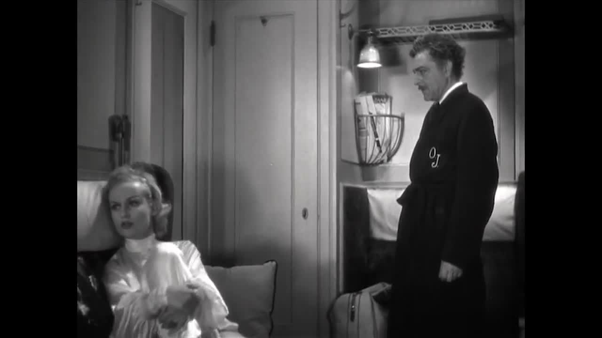

# 编剧（1）
## 编剧
1. **编剧在电影中的角色和贡献**：
   - **编剧**的任务包括写对白、动作、主题设定，但他们对电影的贡献**难以具体测定**
   - 某些导演**不太重视剧本**（script），尤其在默片时代，更倾向于**即兴或只用简单大纲**
   - 有些**著名导演**如伯格曼、科克托、爱森斯坦、赫尔佐格和美国的一些导演如格里菲斯、卓别林、冯·斯特劳亨等都是**编导合一**，同时也有导演会聘请**专业编剧**来推展意念，如费里尼、特吕弗、黑泽明
   - 成功的小说家**很少能成为**出色的编剧，因为小说依赖**语言**来表达意义，而电影更注重通过**视觉影像**传达
     - 例如，詹姆斯·琼斯的小说《**细细的红线**》虽然强调战争中的士兵和同志情谊，但在马利克的电影改编中，更加注重于哲学思考，探讨人类对自然之美的亵渎以及人的堕落和原罪

     - 导演**詹姆斯·艾沃里**和编剧、小说家**露丝·拉·杰哈布瓦拉**的长达三十年的合作关系以改编**著名文学作品**而闻名，如《看得见风景的房间》、《欧洲人》和《波士顿人》等；尽管改编文学作品存在难度，杰哈布瓦拉的剧本却以其**精致、简洁、忠于原著且风趣感人**的特点，使她在文学改编领域**声名远播**

2. **集体创作剧本在美国制片厂的实践**：
   - 美国制片厂鼓励**集体创作剧本**，不同的编剧**各有所长**，如对白、喜剧、结构、气氛等
   - 银幕上的编剧名单可能**不完全准确**，有时**导演**对剧本最终定稿也有重大贡献但很少挂名
     - **例子**：希区柯克、科波拉、刘别谦等导演对剧本有重要贡献
   - 好莱坞大制片厂时代的剧本多为集体创作，涵盖了多种类型，如爱情片、动作片和喜剧等，其中一些如《20世纪特快车》和《卡萨布兰卡》成为杰出之作
     - 编剧**本·赫克特**以其机智和对喜剧的独到见解著称，他的作品《**20世纪特快车**》是与**查尔斯·麦克阿瑟**合作的舞台剧改编
     - 而《**卡萨布兰卡**》则是由**菲利普和朱利叶斯·爱泼斯坦**以及**霍华德·科**共同创作，这部电影的成功在于它触动了当时呼吁牺牲小我、追求更高目标的美国公众情感

3. **编剧对艺术价值观的影响及其体现在电影中**：
   - 在美国，长期以来认为艺术必须是**严肃的**才能受到敬重
   - 在**约翰·福特**改编的电影《**愤怒的葡萄**》（The Grapes of Wrath）中，**农纳利·约翰逊**的剧本通过角色的**对白**传达主题，如电影结尾老妈对老爸的话
     - 电影的最后一幕通过福特的**影像**展现了人类精神中的勇气与乐观，体现了剧情片导演偏好的**线性结构和情节发展**

   - **柴伐蒂尼**是意大利著名编剧和理论家，与导演**德西卡**合作创作了众多杰出作品，如《孩子在看着我们》、《偷自行车的人》等，展现了他们作为**人道主义者**的风格，其中柴伐蒂尼倾向**马克思主义**，德西卡则受**天主教**影响
     - 德西卡擅长导**儿童戏**，其作品表达了**对社会边缘人群的同情与关怀**，并抵抗社会对受苦人的漠视，为贫苦和不快乐的人发声

4. **剧本对话和表达方式的特点**：
   - 剧本中的对话，尤其是**文学性较强的电影**（如法国、瑞典及英国电影），通常包含**深层的观念和理念**
   - 在《**卡萨布兰卡**》中，**里克**（亨弗莱·鲍嘉饰）的结尾对白尽管与他一贯硬汉形象不符，却深刻表达了**电影的主题**

   - 一些导演，如韦特米勒、伯格曼及伍迪·艾伦，其电影中的对白**极具特色**
     - 电影《**傲慢与偏见**》忠实地改编自简·奥斯汀的同名小说，保持了1813年的正式对白风格，需要演员将压抑的热情融入其中
     - 《**爱，上了瘾**》则是一部充满俚语、幽默和脏话的现代浪漫喜剧，讲述了两个漫画家之间复杂的关系，包括同性恋主题和情感纠葛
     - 两部电影虽**风格迥异**，但都展现了其**文学性的强度**和**对白的聪慧与情感丰富**

5. **剧本与导演的关系**：
   - 有些导演**不重视剧本**，如安东尼奥尼认为《**罪与罚**》之所以有趣在于其叙述方式，而不是故事本身

   - **安德鲁·萨里斯**指出，导演的**场面调度和镜头选择**比动作本身更重要，例如《**小红帽**》的故事，根据镜头的选择，可以有不同的故事和重点
   - 电影剧本作为电影成品的蓝图，通常**不具有可读性**，与舞台剧本相比差距较大，因为它**无法传达场面调度的感觉**，这是导演的**主要表达工具**

## 电影剧本
1. **电影剧本与其文学价值**：
   - 电影剧本通常**不被视为独立的文学作品**，但比较**容易出版**
   - 著名导演如伍迪·艾伦、伯格曼和费里尼的剧本有出版，但这些作品更接近**电影的语言风格**
     - **小津安二郎**的剧本通常与**野田高梧**合作，其风格**朴素而不造作**，这些剧本经常**出版**并被视为**文学作品**
     - 在日本文化中，人们通常通过**迂回、含蓄的对话和暗示**来表达真实想法，小津的作品中，**未说出口的意义**和直白表达的一样重要，反映了日本社会**对冒犯和自私的不容忍**

   - “**小说化**”是电影的文学副产品的一种形式，通常由**专业写手**创作，目的是为了**营利和增加票房**

2. **剧本与演员的关系**：
   - 剧本通常会**根据饰演角色的演员进行调整**，特别是当剧本为特定明星**量身定做**时
   - 例子：为加里·库珀和克林特·伊斯特伍德定制的剧本突出他们的**硬汉形象和经典台词**
   - 另一方面，善于言辞的角色（如《彗星美人》中的德威特）能享受**言语的乐趣**

3. **剧本中对白的艺术性**：
   - 好的对白能够提升**剧本的听觉效果**，如正确的说话韵律、字词选择、句子长度等
   - **例子**：《**落水狗**》中粗俗角色的言语表达了他们生命中的暴力
   - 对白的艺术性不仅体现在**精致的文字**上，也展现在**粗俗或特殊的语言风格**中

4. **剧本与导演的创作方式**：
   - 有些导演如安东尼奥尼**轻视剧本的重要性**，强调**叙述方法**比故事本身更重要
   - 相反，约瑟夫·曼凯维奇的《**彗星美人**》和布德·舒尔伯格的《**码头风云**》展现了**剧本在塑造角色和传达主题上的重要作用**
   - 导演通过**剧本**和**场面调度**共同创造出电影的意义和故事
     - **比利·怀尔德**，第二次世界大战后美国的重要编剧和导演，擅长编织剧情，认为好剧本的每一个细节都必须有其**准确的作用**，并坚持剧本的**连贯性**
     - 他的《**热情似火**》是关于两名男性乐师男扮女装加入女子乐团以逃避帮派追杀的喜剧，这部电影以其独特的幽默和男性模仿女性的突兀感获得极高评价，甚至被评为**全美最佳喜剧**

5. **《断背山》的剧本创作背景**：
   - 由普利策奖得主**安妮·普罗克斯**创作的短篇小说改编，后由拉里·麦克默特里和黛安娜·奥桑纳**共同改编剧本**
   - 麦克默特里和奥桑纳对原作进行了**扩充**，增加场景和角色，但保留了原著的**诗意和沉重氛围**
   - 故事描述两个西部男子（希斯·莱杰和杰克·吉伦哈尔饰演）之间**复杂的同性恋情**，反映了社会对同性恋的憎恶如何影响他们的关系

6. **剧本与电影的关系**：
   - 电影剧本通常专注于**事实陈述**，不追求华丽文学表达，但也有例外
   - 例子：约翰·奥斯本的《**汤姆·琼斯**》剧本根据18世纪英国小说改编，其描述打猎场面富有**文学性**，影响了导演托尼·理查森的拍摄风格

7. **剧本的文学和视觉效果**：
   - 即使是**就事论事的剧本**，某些描述也能激发**导演的想象力和创造力**
   - 例子：《**汤姆·琼斯**》中的**打猎场面描述**，展现了人物的狂热和场景的动态，通过剧本文字**激发了视觉上的创意**