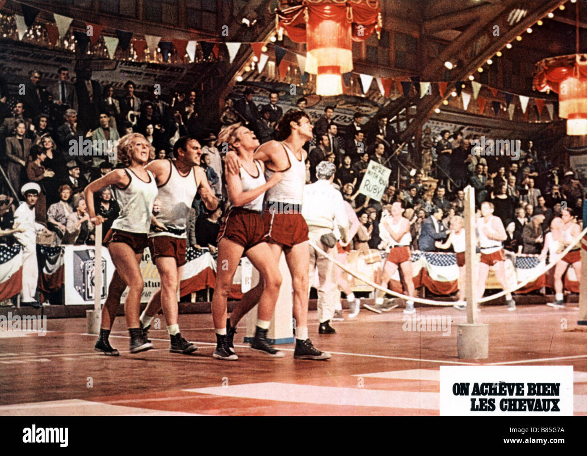
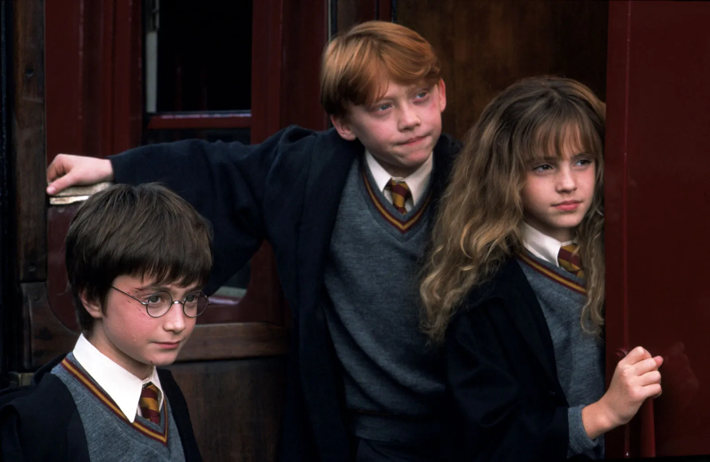

# 编剧（2）
## 象征、比喻
1. **电影中的象征、比喻技巧**：
   - **亚大・斯吕克**（Alexandre Astruc）认为电影传统上**难以表达抽象意念**，导演**通过影像传达**这些意念
   - 即使在默片时代，**非言语的比喻技巧**已被广泛使用
   - 比喻技巧是一种**艺术策略**，用于**暗示或明示**抽象意念，包括**文学和电影领域**

2. **母题、象征、隐喻的区别与应用**：
   - **母题**（motifs）是**最不突出**的，有系统地在电影结构中重现，其象征意义**不可显露及离开上下文**，**难以引起注意**
     - 《**呼喊与细语**》中不断出现的母题是人物的脸被分割成两半，暗示自我分裂、外在与内在的对立

   - **象征**（symbols）不需要重复，因其在戏剧框架中已明显，可以**根据上下文改变意义**
     - 《**七武士**》中的火光象征了角色之间的障碍和热情，意义随情节变化
     - 电影场景中的象征主义并非总是存在，其意义会**根据戏剧文本而变化**；例如，火在这些场景中可能具有**强烈的性意涵**，正如**弗洛伊德**所指出的，火的热度和动态可能暗示性兴奋和生殖器的活动

   - **隐喻**（metaphors）通常由**表面无关的事物比喻产生意义**，通过**剪辑并列**不同意义的镜头产生新的意义
     - 《**猜火车**》中主角潜入马桶的场景是对毒瘾严重损耗的戏剧性隐喻
     - 《**美国丽人**》中男主角的性幻想与红玫瑰花瓣的隐喻
     - 《**2001太空漫游**》中，猿猴使用骨头作为武器的镜头与宇宙飞船的镜头并列，创造了人类智慧进步的隐喻
     - 《**爱情无色无味**》通过中心隐喻“**Lantana**”来象征其主题，这种色彩鲜艳却长满刺的**热带植物**反映了片中四对夫妇复杂的**恩怨情仇**
       - 影片开场的死尸躺在茂密的花丛中这一镜头，展示了隐喻在场景调度中的蕴含意义

3. **寓言在电影中的应用**：
   - **寓言**（allegory）在电影中**较少见**，通常呈现为角色或情况象征明显**更广泛的意义**
     - 例如伯格曼的《**第七封印**》中的死神象征“**死亡**”，没有其他隐喻意义

     - 《**草莓与巧克力**》看似是对哈瓦那现代生活的**写实描绘**，实际上也是一部**政治寓言**，探讨了迭戈（一位自由思想的同性恋艺术家）和戴维（一位严肃的异性恋共产主义者）之间**几乎不可能的友情**
       - 古巴导演阿莱通过这部电影表达了**在高压政府统治下生活**的主题，指出古巴社会需要改变，**接受与自己不同的人**

   - 德国电影，如**赫尔佐格**的作品，更倾向于使用寓言来表达**对生命、人类困境的深层寓意**

4. **引喻在电影中的应用**：
   - **引喻**（allusions）是指引用**大众熟知的事件、人物、艺术作品等**
   - 例子包括霍克斯的《**疤面人，国耻**》中以**阿尔·卡彭**为原型的主角，以及电影中对伊甸园神话的多次引用

   - 电影中的**致敬**（homage）是种引用，如戈达尔和特吕弗对其他导演或电影作品的致敬

5. **具体电影中的致敬实例**：
   - 戈达尔的《**女人就是女人**》中演员对米高梅出品的金·凯利主演歌舞片的致敬
   - 福斯的《**爵士春秋**》对他的偶像费里尼，特别是《八部半》的致敬
   - **斯皮尔伯格**经常向沃尔特·迪斯尼、希区柯克和斯坦利·库布里克致敬
   - 电影《**反斗神鹰2**》中的许多镜头都是对卡通电影的引述，其中包括对迪斯尼的《**小姐与流氓**》的模仿，如一场两只狗共享意大利面的浪漫场景；这些引述通常是出于对原作的敬意或者是以幽默的方式进行嘲讽，有些**只有影迷才能识别**

## 观点
1. **电影中的观点类型及其应用**：
   - **第一人称叙述者**（first-person narrator）：主要**讲述自己的故事**，可以是**客观的旁观者**如《了不起的盖茨比》中的尼克·卡拉韦，或是**主观的介入者**如《麦田里的守望者》中的青少年
     - 法国导演**让·雷诺阿**认为人们喜欢听故事是因为他们**赞同讲故事的人**，但这不总是情况，有时候人们被**恶魔般又具吸引力的叙述者**所吸引
       - 电影《**丑闻笔记**》通过一位语气刻薄、受压抑的女同志教师的视角叙述了她与另一位已婚女教师的复杂关系，观众被她怀有恶意的叙述所吸引，想知道她为了达到目的会做到何种程度
       - 影片最终展现了这位叙述者的彻底堕落，导致所有人都成了输家

   - **全知观点**（omniscient point of view）：类似**19世纪小说风格**，叙述者**提供所需信息但不介入故事**，如《战争与和平》或《汤姆·琼斯》
   - **第三人称观点**：全知观点的变奏，主要是以**剧中某个角色的观点叙述**，有时能**透析角色内心**，如《傲慢与偏见》中的伊丽莎白·贝内特
   - **客观观点**：**超然地记录事件**，不涉入任何角色的意识，适用于纪录片，如《沉默的人》

1. **电影中观点的具体例子与分析**：
   - 电影采用**第一人称**时，摄影机**记录角色所见**，观众需**认同主角**，如文学中的“声音”在电影中被摄影机的“眼睛”取代
     - 《**父辈的旗帜**》围绕美国人熟知的**硫磺岛战役**展开，其中一群年轻美国士兵**在岛上竖起国旗的经典照片**成为了影片的一个重要观点

       - 而在影片的姐妹篇《**硫磺岛的来信**》中，则从**日本人的视角**叙述了同一战役，揭示了对于死守孤岛的日本军人而言，这个战役景象是毫无意义的
   - 电影中的**全知叙述观点**常见（几乎是不可避免的），导演可以**通过摄影机移动提供新观点**，可以**从主观镜头转为客观镜头**
   - 第三人称在电影中不像文学作品那样严格，**纪录片**常使用第三人称叙述，旁白通常是**匿名的评论者**
   - **客观观点**在电影中比文学作品更适用，因为是通过摄影机来表现，主要负责**无偏见地记录事件**

## 文学改编
1. **文学改编在电影中的挑战与方法**：
   - 文学或舞台剧改编至电影时**面临的挑战**：改编工作难度**随原著成就的高低而变化**，较高成就的文学作品改编更为艰巨
   - 改编作品有时**超越原著**：如《**一个国家的诞生**》改编自《三K党》（The Klansman）的例子
   - **文学与电影的差异**：文学作品的高成就**不易转化为电影**，因为两种媒介内容受形式支配的**方式不同**
     - **霍勒斯·麦科伊**以20世纪30年代马拉松舞蹈比赛为背景的小说《**孤注一掷**》在改编为电影时**删除了许多复杂情节**，因为小说受限于直线叙事而只能关注部分细节，而电影则能通过如姿态、化妆、语音和肢体动作等细节来丰富角色，为观众呈现**更全面的视角**
     - 电影通过**慢镜头**展示了舞蹈比赛中参赛者的身体和面部的扭曲，以及他们的挣扎和旁边啦啦队的支持，创造出一个**精心安排的地狱般景象**

2. **电影改编的类型及例子**：
   - **松散改编**（loose adaptation）：保留**原著的基本意念或状况**，但**独立发展**成新作品，如黑泽明的《乱》改编自莎士比亚的《李尔王》
     - 黑泽明的《**蜘蛛巢城**》被许多评论家认为是所有莎士比亚改编电影中最伟大的，他并没有直接与《**麦克白**》相比较，而是仅截取**原著的精神**，利用**电影化的画面**而非语言来创造强烈气势
     - 这部电影与原著莎士比亚作品的相似之处只是**表面的**，正如莎士比亚的作品与其主要来源何林塞的《**编年史**》之间的关系一样，看似相似但在艺术上**并无深刻联系**

   - **忠实改编**（faithful adaptation）：尽量**靠近原著精神**，如托尼·理查森的《汤姆·琼斯》
     - JK罗琳的《**哈利波特与魔法石**》在全球广受欢迎，制片人**大卫·海曼**承诺将忠实于原著进行改编，选定**克里斯·哥伦布**作为导演，并坚持在英国外景拍摄并使用英国演员以**保留原著**的阴暗和边缘感觉；罗琳和众多年轻读者对电影的最终成果都感到**十分满意**

   - **无修饰改编**（literal adaptation）：多用于**舞台剧**，电影化时**保留对白**，但**时空观念有所变化**
     - **尤金·奥尼尔**的舞台剧《**长夜漫漫路迢迢**》是美国剧场的瑰宝，其改编电影版本由**吕美特**导演，保留了原剧集中在泰隆家庭悲剧性故事的设置，**象征性**地展现了家庭成员如同困于炼狱的带罪生物
     - 虽然一些评论认为这部电影**过于类似舞台剧**，但导演吕美特辩称这是他作品中**镜位和剪辑技巧最复杂**的一部

1. **电影改编的细节与影响**：
   - 改编不仅复制文学作品内容，而是**保留其精髓**
   - 改编电影通常介于**忠实与松散之间**，形式受电影媒介影响
   - 即使是无修饰改编，电影也强调**影像优于语言**

2. **编剧在电影改编中的角色与问题**：
   - 探讨电影的“**文学性**”，包括长篇演说、对白风格、角色表达能力等
   - 对白的**风格化与写实性**，以及电影中使用的比喻技巧
   - 考量电影**叙述的观点**，是否有画外音叙述者，叙述者与观众的关系
   - 确定**改编类型**：忠实、松散或无修饰改编