# 表演（1）
* 电影表演复杂而多元，以下分成四类
  * **临时演员**（extra）：即群众演员，功能是替摄影机提供景观或场景
  * **非专业演员**（non professiona performers）：业余的演员，演技好坏不重要，重要的是他们的外型与某个角色完全相符
  * **专业演员**（trained professionals）：不管来自剧场或电影界，他们都能以不同风格演不同的角色，大部分演员均属此类
  * **明星**（Stars）：公众都认得的名演员，能吸引观众到电影院和剧场看他们
  * **明星制度**（star system）是美国电影发明和主导的，但也不限于电影；几乎所有的表演艺术如歌剧、舞蹈、剧场、电视、演唱会，都会充分利用有魅力的表演者的票房号召力
## 剧场和电影表演
* 剧场和电影表演两者的巨大不同在于其**空间和时间的不同概念**
  * 大部分演员会觉得**舞台**比较过瘾，因为幕一升起，演员便可**掌控全局**
  * **电影**则不一样，女演员**金·斯坦利**（Kim Stanley）就曾说：“不管电影里你怎么演，点点滴滴都是为了**导演**，对导演当然再好不过了，但演员并不能塑造角色，导演才是电影的艺术家，演员只有在舞台上才有得发挥。”
* 两者**对表演的要求也**不同
  * 舞台表演得被人看**得见听得见**，演员的嗓子得经过训练而有**可塑性**，即使剧场大到可以容纳上千人，嗓音也得传到可全场共闻

  * **对白**是剧场最重要的元素之一，**抑扬顿挫的表现说白**也是演员的基本功
* 舞台对演员的**外形要求**不如电影苛刻
  * 舞台演员得被最远一排的观众看见，所以**身材高大**比较占优势，小个子的演员会被偌大的场地吃掉；五官也最好**清楚立体**，不过化妆可以弥补许多缺憾
  * 所以，一个四十多岁的演员在舞台上演罗密欧并不是灾难，只要他**体型维持良好**，年纪只有第一排观众看得见；因为剧院的灯光不会太亮，所以如果演员嗓音和肢体控制得宜，就可以演出与自己**相差二十多岁的角色**
  * 舞台演员全身都在观众面前，所以他必须**动作准确**，坐、站、走都和日常生活的动作**不一样**；**肢体**得像哑剧一样能**表达情感**，一个高兴的人，就算站着不动，也和不快乐、烦闷或害怕的人不一样
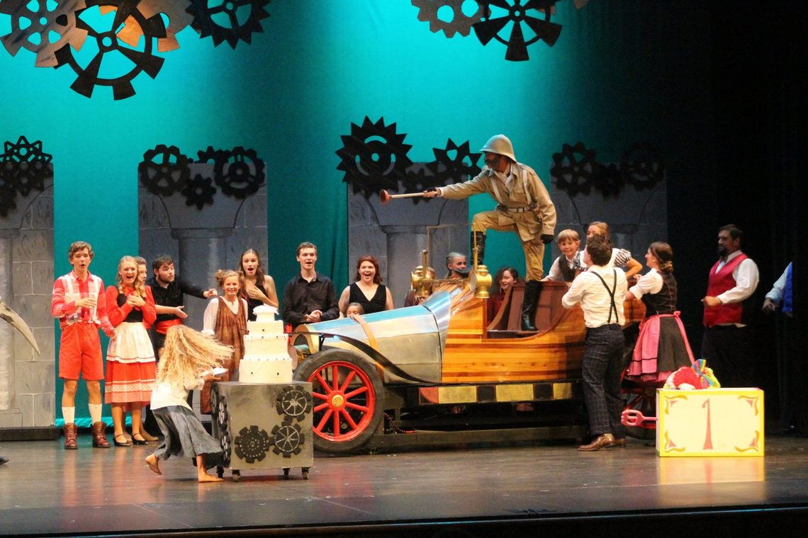
* 剧场表演保留了**真实的时间**
  * 演员必须一场一场经营至剧尾的高潮，通常他始于较低的能量，每场戏逐渐增强，到高潮时紧绷至引爆点，然后再收尾；总而言之，演员的**精神能量**融合在**戏剧结构**中
  * 不同的戏有**不同的建构方法**，但是他得一直掌控在戏中的能量；因为幕一拉开，他独自在舞台上，出错就不能改，戏也**不能重来或剪掉**
* 电影表演最重要的是**安东尼奥尼**所说的“表现”，也就是演员得看起来够**吸引人**，演技再好也无法弥补一张不上镜的脸，许多舞台演员都因此在电影上无法发挥
  * 历史上最出名的几个舞台演员，包括**莎拉·伯恩哈特**（Sarah Bernhardt），在电影中都很可笑，因为风格化的技巧夸大到滑稽的地步；银幕上太多技巧可能适得其反，反而显得造作又不诚恳
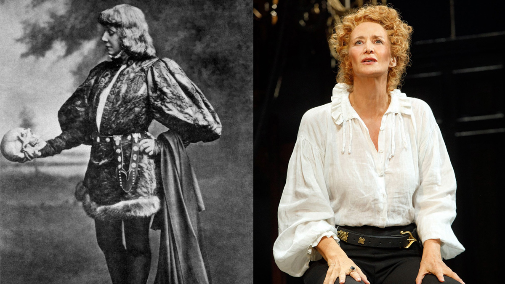
  * **玛琳·黛德丽**是明星中的美容先驱，即使现在产业中男女都很习以为常；美容对演员个人及其演艺事业有其必要，目的是延长其表演寿命，使他们看来比实际年轻貌美许多
    * 黛德丽1930年自德抵美，她的恩师导演**约瑟夫·冯·斯登堡**令她减肥9公斤，又通过做手术将她的蒜头鼻雕塑至完美，拔掉臼齿使她的双颊下陷，生出无限魅力，还有她所强调的高颠骨，至今仍是许多专家以为美女不可少的
    * 她也是**化妆高手**，将美凝固在无暇之特写上，注意她的细柳眉使眼睛看来更大，唇膏使薄唇看来丰润饱满；她对自己的外表**十分挑剔**，才能表演到七十岁，尽管后来多是舞台上的个人秀而非演电影，舞台之距离可比银幕特写更能保住美的印象
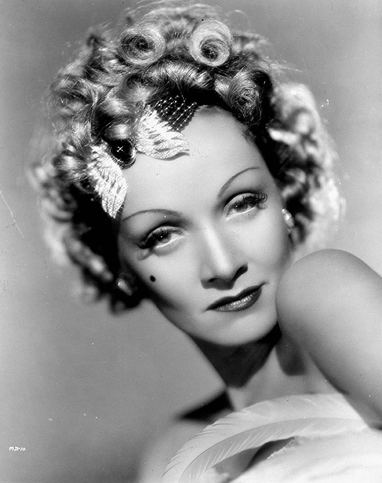
* 电影表演几乎完全取决于**导演对于题材的处理**
  * 一般而言，导演越倾向**现实主义技巧**，越需要演员的表演能力；这类导演喜欢**远景镜头**，将演员全身放在景框中，这种距离与**剧场的舞台距离**相似而写实导演也喜欢**长镜头**——使演员在不受干扰的情况下演很长的戏
  * 电影的写实可以比舞台的写实“真实”得多，因为舞台演员的技巧和训练对电影观众而言太夸张，正因电影演员有些**缺乏技巧**，其**真实性**反而比较可信
    * 《**新世界**》根据1607年在弗吉尼亚州建立殖民地的传奇改编，导演启用14岁非职业演员来演理想的原住民；她不经雕琢的真诚，全无舞台习气，完全像从精神及物质尚未被欧洲白人污染前的伊甸园走出来的
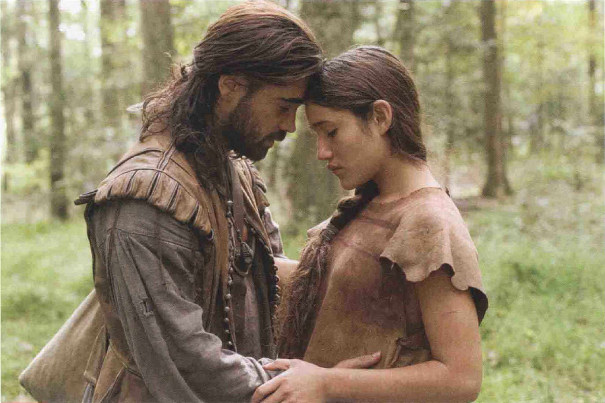
  * 由观众观点而言，衡量现实主义电影的表演**比较容易**，因为导演没有进来干涉，摄影机纯为**记录**
  * 较倾向**形式主义**的导演，就比较不重演员的贡献；**希区柯克**最惊人的电影效果很少靠演员的表演
    * 比如说《**怠工**》（Sabotage）里，女主角**西尔维娅•西德尼**（Sylvia Sidney）因为不被允许在一场重要的戏中表现而泪洒摄影棚；这是一场谋杀的戏，女主角为报复亲弟弟被害，而杀了身为凶手的丈夫，在舞台上，女主角的情绪和想法当然会由**台词和表情**夸大表现出来，但希区柯克观察到大部分人在生活中不见得表情外露，他宁可经由**剪辑**而传达出想法和情感
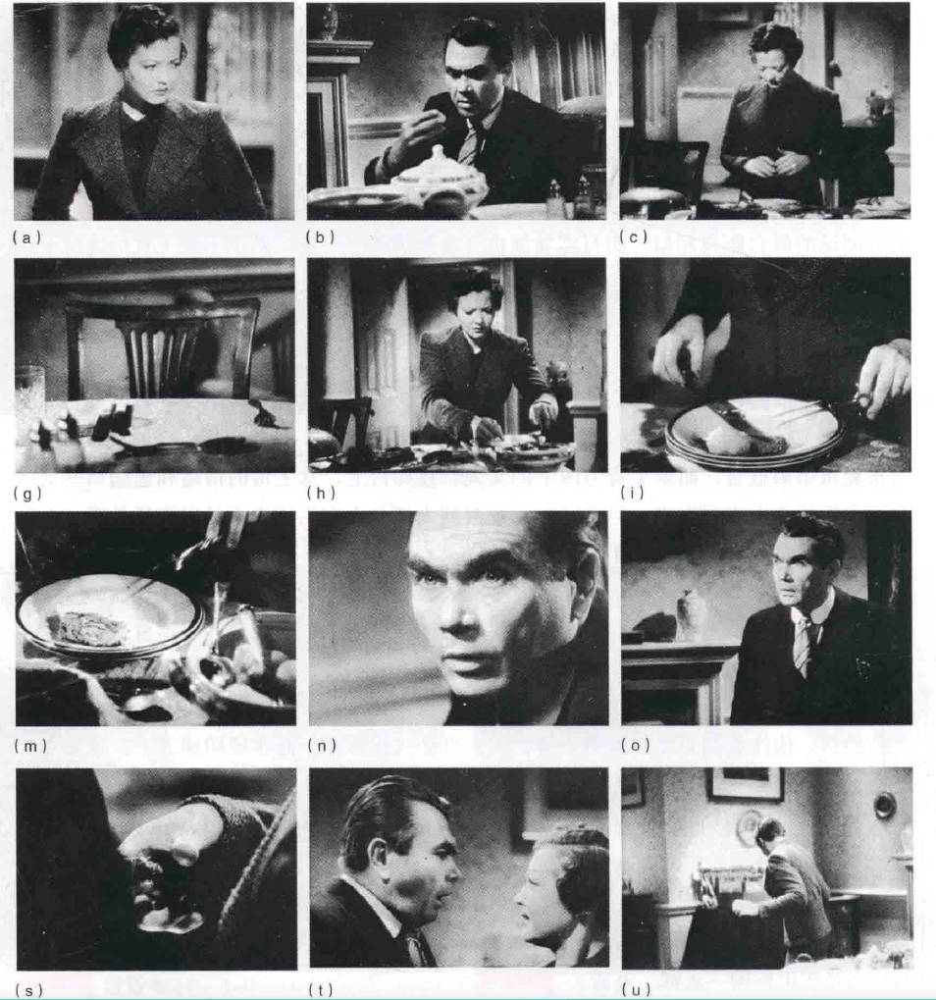
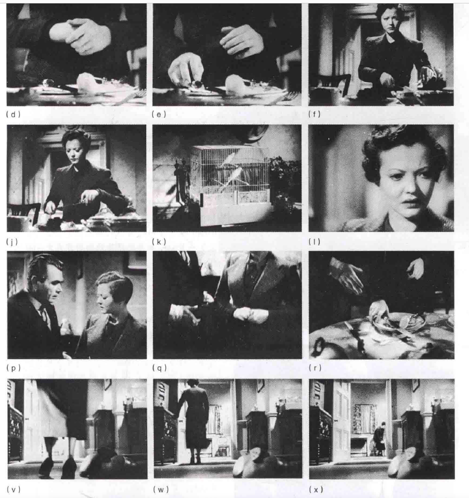
  * 概括电影表演并不容易，因为导演也不见得用同样的方法拍每部片子；**伊利亚·卡赞**（Elia Kazan）和**英格玛·伯格曼**两人都是舞台和电影兼顾，却技巧分明，事实上，没有什么是拍电影的“正确”方法
  * **特写**能使电影演员专注于某个时刻的**真实性**——无须担心后排观众观看的困难，而且肢体和脸部表演可以非常**含蓄精致**；舞台表演通常得用**说话**来表达，而匈牙利理论家**贝拉·巴拉兹**相信电影特写可以将人的**脸**从其周遭事物独立出来而透视其灵魂，这种经验在剧场中无法达到，因为观众和演员距离太远了
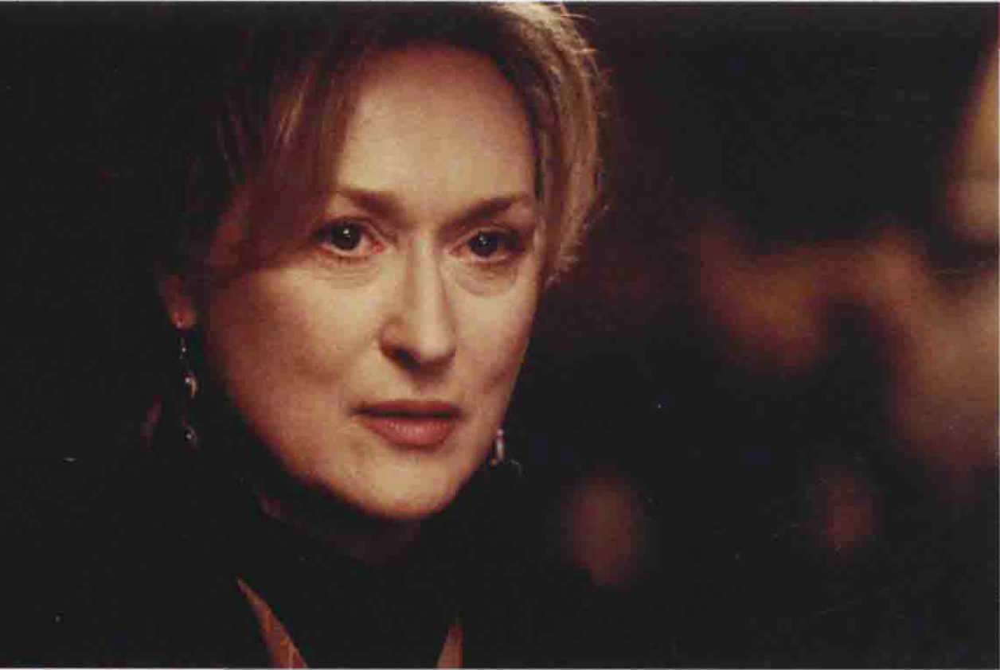
* 电影演员的声音**不一定会受限**，因为他的**音量**可以由**电子科技**来控制
  * **玛丽莲·梦露**声音**小而喘**，在剧场里传不远，但在电影里正好显现她如孩子般的脆弱，赋予表演一种**诗意的细致风格**
  * 有些电影演员就因为嗓音而具有古**怪的魅力**，比如加里·库珀、约翰·韦恩、克林特·伊斯特伍德、阿诺·施瓦辛格（Arnold Schwarzenegger），他们的声音木然而波澜不惊，却魅力十足
  * 电影演员的声音质量也可以**用科技来控制**，**声效和音乐**可以完全改变一句对白的意义；通过科技设备，声音可以大小高低任意改变，电影的许多对白都事后**重新配音**，不断重录直到满意为止
  * 几乎大部分**意大利片**都拍完甚至剪完才配音；**费里尼**选演员是依据他们的脸、体型，乃至性格，他常用**外国演员**，和许多意大利导演一样，有时甚至用外国人当主角，美国演员**理查德·贝斯哈特**在拍戏时说的便是**英文**，等全片杀青后，再请与他声音质地接近的意大利演员来配音
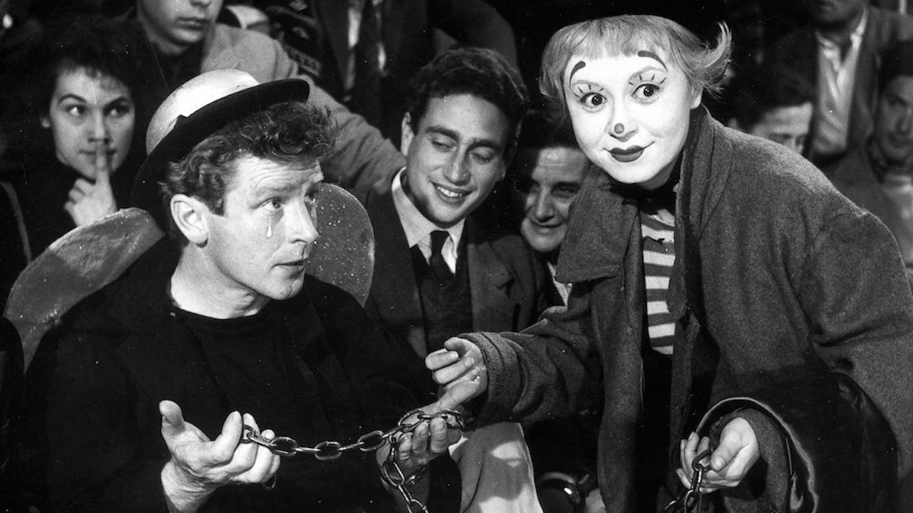
* 电影演员的**肢体要求**和舞台演员也不尽相同
  * 即使是主角，他也不需**高大**，像**艾伦·拉德**（Alan Lacld）就是出了名的矮，导演常避免拍他的全身，除非他是独自一人，没有人在同一面上对照他的高度；他演**爱情戏**时，常常要**站在箱子上**，镜头取在他的腰以上，用**仰角镜头**使他看起来较高
  * 电影演员也不一定要**迷人**，比如说，**亨弗莱·鲍嘉**并不英俊，但摄影机喜欢他也就是说，他的脸很上镜头，对摄影机自然开放，有时连摄影师也会吃惊
  * 电影演员**行动迟缓**也不一定是缺点；导演可以用远景拍，再用替身或特技演员帮忙演复杂动作的戏，再交叉与主角的近景剪辑在一起，使观众以为全是同一主角演的
  * 演员在任何媒体（除了广播以外）上都必须对**肢体语言**及其所揭示的**性格特征**有自觉；**默片演员**不能说话，只能把情感和思想透过手势、动作、面部表情和肢体语言来外化——目的就在于弥补他们无法有声音的缺点，比如在此镜头中，大个子对木屋中不知哪来的咕噜咕噜声感到奇怪，**卓别林**则用哑剧手势说明，是他的肚子咕咕作响
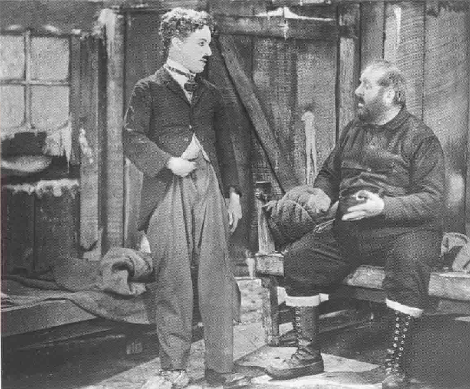
  * **舞台**上的爱情场面往往是通过**语言表现**而少有延伸爱情动作的，裸露更是稀有，**电影**却完全相反：重点全在**肢体接触**，台词反而多余；大部分电影演员**并不喜欢裸露**，尤其旁边站着一票技术人员时，在这么不浪漫且众目睽睽的情况下．演员还得装得很私密地沉醉在亲热和激情中
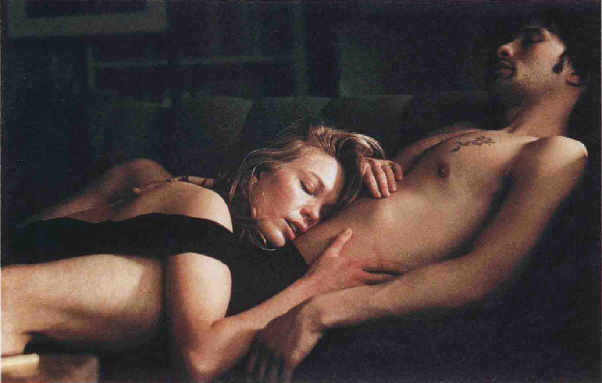
* 由于电影是由**镜头**组成，所以演员**不需要演很长的时间**
  * 剪辑得很细的电影，镜头有时**不到一秒钟**，表演变得**毫无关联**，只不过在银幕上有演员罢了
  * 电影的拍摄日程依**经济考虑**而定，因此有时拍摄**不一定顺场拍**，也许演员得先拍高潮戏，后拍低调的戏；因此电影演员不必像舞台演员那样要建构或顺时强化他的戏，但他得很**专注**，随时在很短的时间内就调整他的清绪，而且得看起来自然
  * 因为拍每个镜头的时间短、空间小，演员不需要长时间排演以建立与其他演员的**默契**，或建立场景和服装的感觉；有的导演尽量**不排演**，以免演员不自然，甚至演员根本是在片场和外景地点才首次见面
* 电影中时间与空间的切断**不连贯**，使演员完全在**导演掌控**中
  * 由于镜头有**扭曲效果**，有时演员还在**极不自然**的状况下演戏；比如说，演拥抱的爱情戏时，他们不能真的面对面互看，在银幕上因**距离太近**会变成斗鸡眼
  * 拍**主观镜头**时，演员得看**摄影机**而不是对手演员
  * 他们有时**不知道**台词，或在演什么戏，也不知道某镜头是电影中的哪个部分，会不会被剪掉
  * 许多未来或奇幻电影都是在棚内**蓝幕**前所拍，演员假装自己是在现场外景中，在飞机跑道上；演员有时会抱怨蓝幕（或绿幕）像真空，必得自己想象场景细节，当演员必须与不在场的演员溃戏（事后再用数字技术纳入），这问题就大了，演员间互动的含蓄不在了，从而降低了其表情的品质
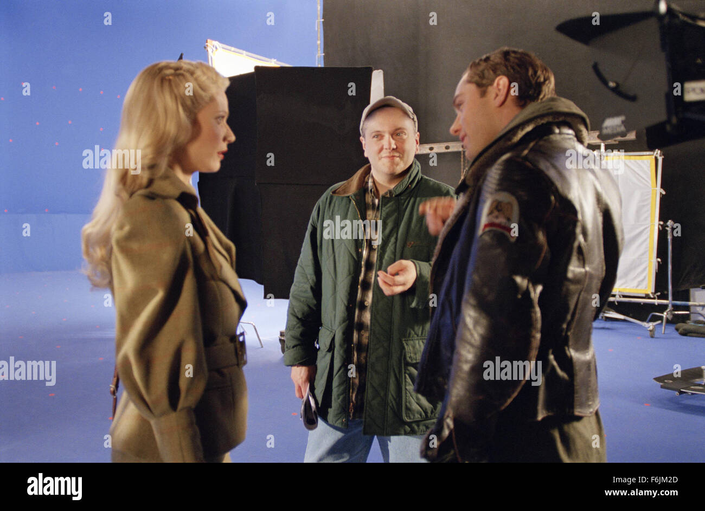
## 美国明星制度
* 从20世纪初年起，**明星制度**就是美国电影界的重心；明星是观众的至爱产物，也是时尚、价值和公众行为的带领人
  * 明星影响卖座，他们的**酬劳**也相对惊人；20世纪20年代，**玛丽·璧克馥**（Mary Pickford）和**卓别林**是世上最高薪的人；近年的**朱莉娅·罗伯茨**（Julia Roberts）和**汤姆·克鲁斯**也是每部片酬数百万美金，因为他们是票房保证

  * **亚历山大·沃克**（Alexander Walker）说，明星直接或间接反映了观众的需求、欲望和焦虑；他们是梦的食粮，让我们可以有最深的幻想和迷恋，他们像古时的神祗，被人崇拜、倾慕、景仰，就如神化的图征
  * 美貌和性感一直是明星的特色，男女都一样；高大健美的**埃丝特·威廉斯**是美国女星中第一个揉合了体健和美丽者，她是20世纪40到50年代米高梅旗下的演员．演出展示其游泳及潜水特长的电影26部，她一向都以宣扬体健为荣
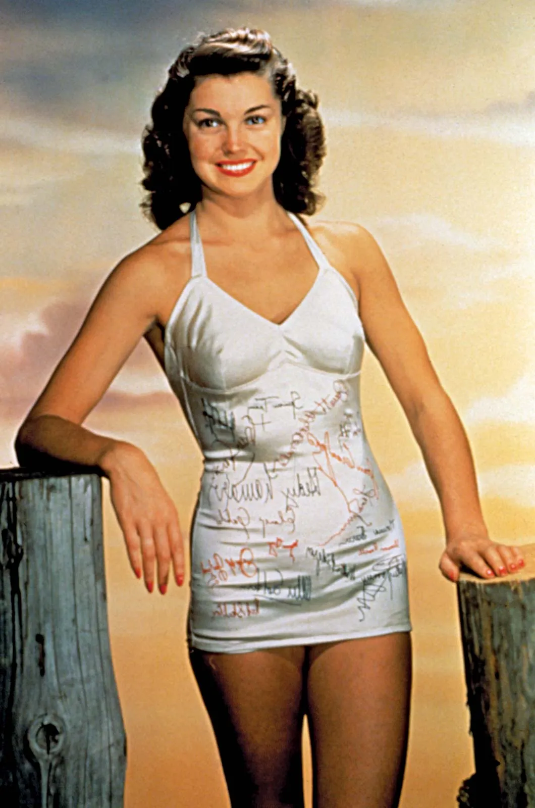
* 20世纪初年之前，电影是**不提演员名字**的，因为制片怕演员要求高薪，但是观众仍旧**认得出他们**
  * 一开始，观众全然分不清明星银幕上的**人格**（persona）和私下的**性格**，造成很大的困扰
  * 比如说，**英格丽·褒曼**和导演**罗西里尼**被大肆渲染的恋情就曾在美国20世纪40年代造成轩然大波，这完全摧毁了她的事业，甚至她的精神状态
  * 观众接不接受演员在**银幕上的性格**，决定了他是不是明星
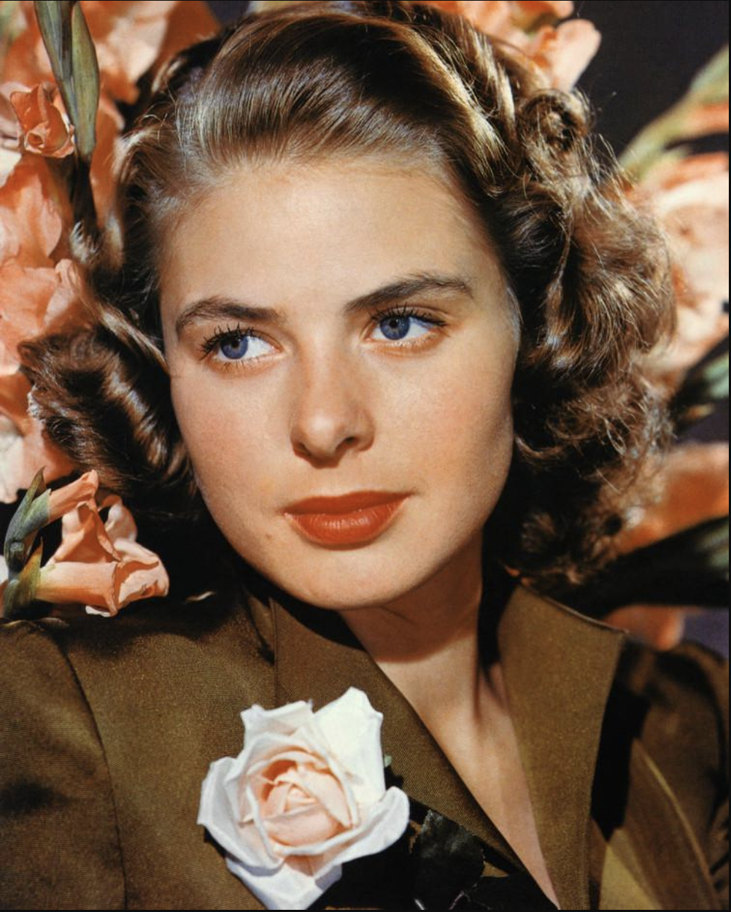
* 所谓**明星制的黄金时代**，在20世纪30年代至40年代，与**好莱坞片厂制度**取得霸权是同时的
  * 这时期的明星都签约**五大制片厂**（即米高梅、华纳、派拉蒙、20世纪福克斯和雷电华，称“The Big Five""，或“the majors"）；这段时间里，大制片厂制作了美国约90％的电影
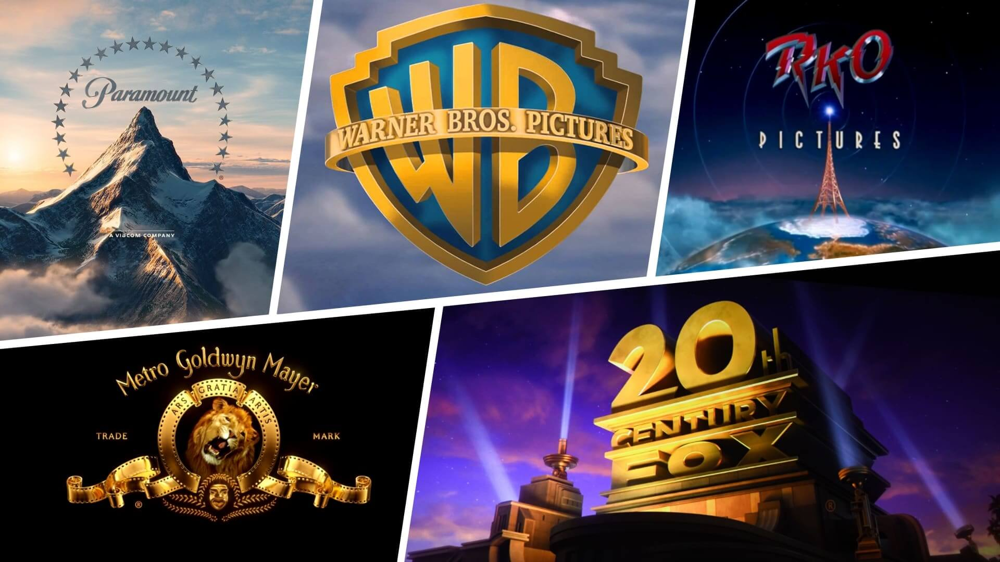
  * 他们在大制片厂签约后前几年，都在媒体**大批曝光**；比如说，**克拉克·盖博**在1930年拍了14部电影，那只是他在米高梅的第一年

  * 片中的每个角色都代表一种**典型**，制片厂就不断地试．直到有一个角色特别受观众喜爱为止；于是之后明星就得不断**重复同样的角色**，抗议也没有用
* 大制片厂视明星为**有价之投资**，所以投注大量金钱、时间和精力来制造明星
  * 有潜力的新人被称为“**小明星**”，男女皆然；他们取一个**新艺名**，然后被训练口白、走路、打扮
  * 制片厂的公关部门会安排他们一大堆**媒体曝光机会**，这期间，被渲染的罗曼史也会提供给四百个专栏以及无数靠好莱坞消息吃饭的记者和专栏作家
  * 有些明星甚至会接受公司给他们安排的**婚姻**，只要该婚姻有助于事业发展
  * 很多人有表演天赋却永远成不了明星，因为他们——据电影摄影师们常说的——只缺一张“**朝摄影机开放的脸**”；做明星脸的**天生骨骼构造**绝对必要，但还不够，**美丽的五官**和**吸引人的特质**也是必要的，但最重要的，一张“开放”的脸指的是不自觉，任由摄影机**自由捕捉**脸上表情或想法的近距离变化
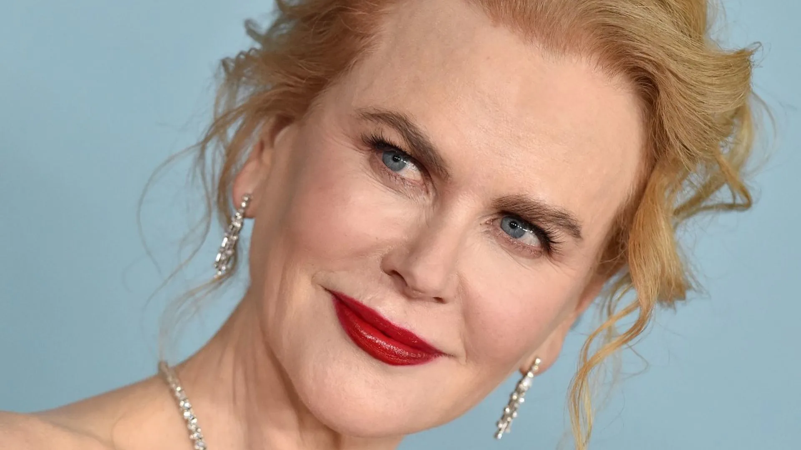
* 明星虽然被制片厂剥削，却也**不无收获**
  * 票房长红之后，他们可做**各种要求**，如大明星名字要出现在片名前，或在合约中要求剧本同意权，甚至要求对导演、制片、合演者行使同意权
  * 大明星会有**不分性别的拥戴者**，虽然社会学家**里奥·汉德尔**（Leo Handel）指出，65％的影迷较喜欢与自己同性别的明星
  * 制片厂一年可收到3200万**影迷来信**，85％都来自少女；大明星每星期大概可收到三千封影迷信，制片厂每年花200万美元处理影迷来信，大部分都是索要签名照
* 当然这个神话也包含了**明星的悲剧**，像**玛丽莲·梦露**就是明星悲剧的象征
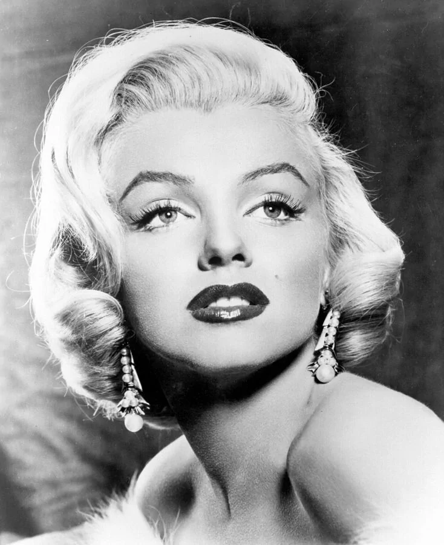
  * 她生下来就是**私生女**，母亲一辈子大部分时间住在**精神病院**中，她小时候就待过无数孤儿院和收养人家；就在那时（尤其是那时），她梦想成为**好莱坞大明星**
  * 她8岁就被**强暴**，16岁嫁给第一任丈夫，她用**性**（她之前也有很多人这么做）来达到目的——当明星；20世纪40年代末，她得到一些小角色，大部分是**性感的笨金发女郎**，直到约翰·休斯顿拍的《**夜阑人未静**》（The Asphalt Jungle），她才引起注意
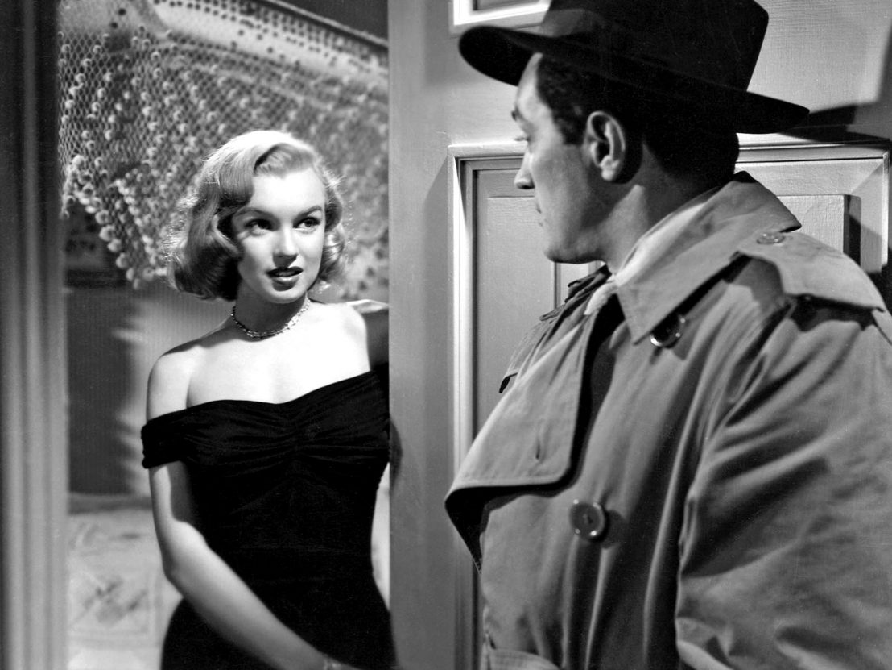
  * 后来**20世纪福克斯公司**签了她，却不知怎么用她；她演了一堆**二流电影**，但即使影片平庸，观众还是喜欢她
  * 她事业巅峰时．却对好莱坞厌恶，径赴“**演员工作室**”（Actor’s Studio）去学习；学完之后、她再回来要求更高的片酬和较好的角色，她的要求达到了

  * 她成了大明星后的私生活**一塌糊涂**，写传记的**莫里斯·佐洛托**（Maurice Zolotow）说：“她大多数时候是个不幸的嗑药者”；她失败的婚姻和恋情经常是报纸头条，所以她更要嗑药酗酒来求**解脱**
  * 她以不负责任而恶名昭彰，常常好几天也不上工，使电影严重超支，就算上工，她也因嗑药酗酒，常搞不清楚自己是谁，身处何处；1962年她被发现死于**过量的巴比妥和酒精**
* 明星神话后的真实**没有那么浪漫**；有人爬到明星顶端，也必有成千上万的人失败，白费苦功，星梦破碎
  * 比较少被人提及的，是明星如何被狗仔队干扰；我们也很少读到诸如鲍勃·霍普（Boh Hope）和伊丽莎白·泰勒（Elizabeth Taylor）如何为公共福利奉献，约翰·韦恩及玛琳·黛德丽如何做爱国之举，秀兰·邓波儿（Shirley Temple）和罗纳德·里根（Ronalrl Reagan）如何成为成功的政治人物，马龙·白兰度、简·方达（Jane Fonda）和乔治·克鲁尼等大明星如何在政治上激进，或芭芭拉·史翠珊（Barbara Sueisand）和保罗·纽曼（Paul Newman）如何慷慨大方——纽曼个入起码捐助了2.5亿美元于各种慈善活动

* 明星得**为名利付出极高代价**，他们得习惯于自己是标有身价的产品
  * 容易到手的**金发美女**一直是美国电影的最爱，但梅·蕙丝、珍·哈露和玛丽莲·梦露仍自成一格，各有模仿者

  * 20世纪50年代，**西德尼·波蒂埃**（Sidney Poitier）成为**第一个非洲裔美国影星**，拥有黑人以外的许多影迷；多年之后，黑人影星才再延续传统，但波蒂埃是首创者

* 19世纪末、20世纪初，作家**萧伯纳**（George Bernard Show）写了一篇重要文章比较舞台上两大巨星——**埃莱奥诺拉·杜塞**（Eleonora Duse）和**莎拉·伯恩哈特**，这篇文章肇始了对不同明星的讨论
  * 伯恩哈特**性格夸大**，可以把任何角色都处理得适合她的性格，她的剧迷也期待她如此做；她的个人魅力夸大、吸引人，表演方式也与她的性格吻合，充满惊奇的效果
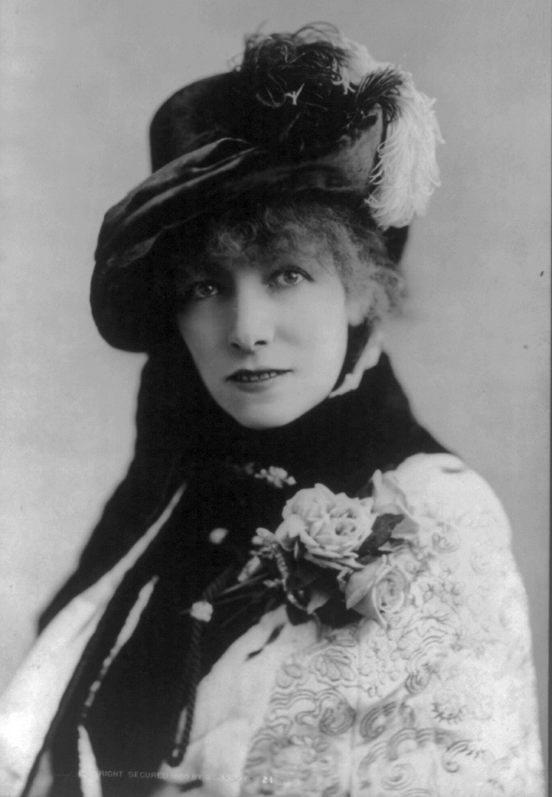
  * 另一方面，杜塞则较**安静**，一开始并不炫目，而且她演每个角色的方法不同，也从不以自己的性格来侵犯剧作家创作的角色；她的艺术是**隐形的**，她塑造的角色完全可信，观众也忘了是表演
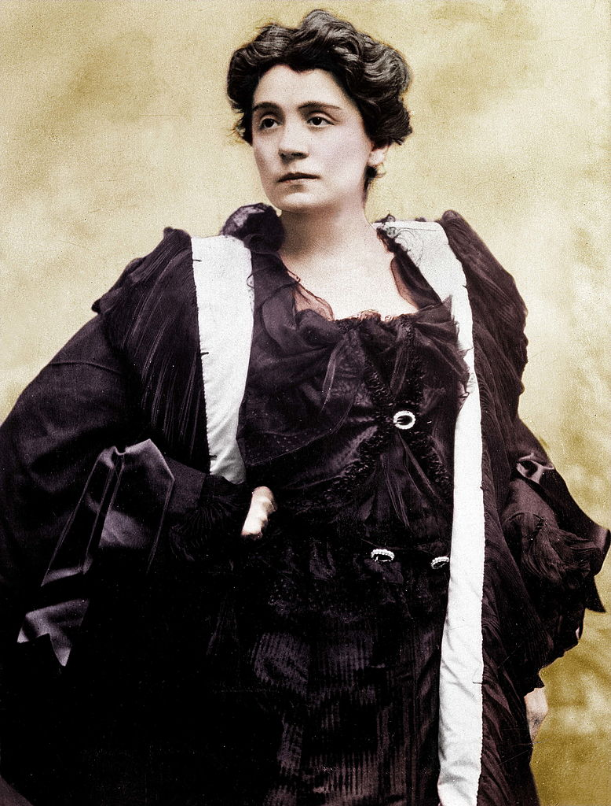
  * 事实上，萧伯纳归纳出的是**性格明星**（personality star）与**演员明星**（actor star）
* 性格明星不喜欢饰演**和自己类型不合的角色**，尤其担任主角时；**汤姆·汉克斯**就从不演冷酷或精神有病的角色，因为他们会与自己令人同情的形象冲突
  * 《**费城故事**》中，汉克斯演一个罹患艾滋病的同性恋律师．他那有同性恋恐慌症的法律事务所开除了他；这部电影至为轰动，归功于汉克斯精湛的演技，他也因此拿下奥斯卡最佳男演员奖
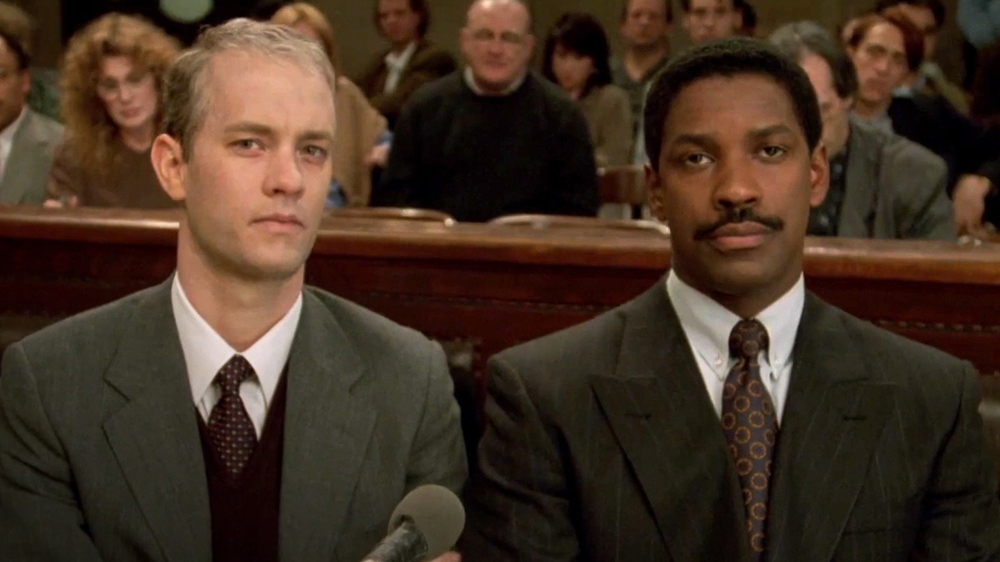
  * 另一方面，许多演员也喜欢停留在某一类型，仅在其中做变奏；**约翰·韦恩**是电影史上最受欢迎的明星，从1949到1976年，他年年入选十大卖座明星，只有三次不在榜上

  * 他的**图征**（iconography）是**对世故和知识的不信任**，他的名字就是男性化的代名词——虽然他的形象是**战士**而非情人；他较老之后，比较有人情味，也以笑谑方式**嘲讽自己的大男人形象**
  * 讽刺的是，**加里·威尔斯**（Garry Wills）在文化研究《**约翰·韦恩的美国：名流的政治**》（John Wayne’s America：The Politics of Celebrity）一书中指出，韦恩虽被大众视为西部的马上英雄，他却**不喜欢马**；此外，他也刻意在第二次世界大战时**逃避服兵役**
* 电影理论家**理查德·戴尔**（Richard Dyer）说，明星有能指意义，任何对有明星在内的合理的电影分析都应当考虑明星的图征意义
  * 像**简·方达**呈现了复杂的政治联想，正因为她的生活就具有政治风格，而她也把这种风格纳入自己的个性和角色塑造中
  * 比如说，简·方达的事业可分成六个阶段：
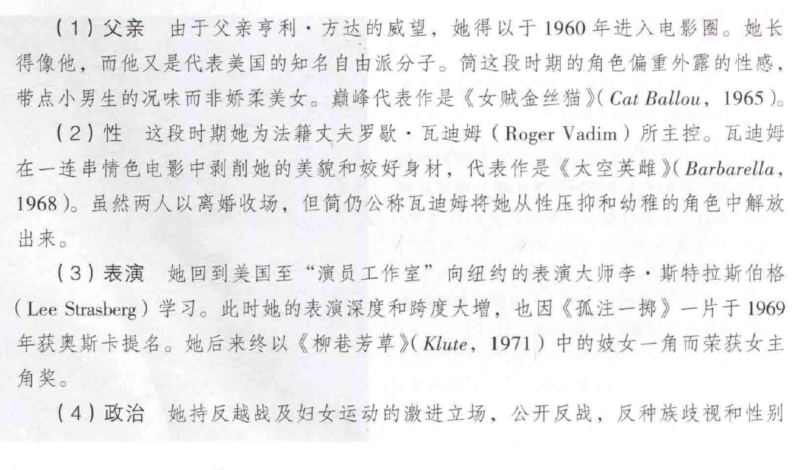
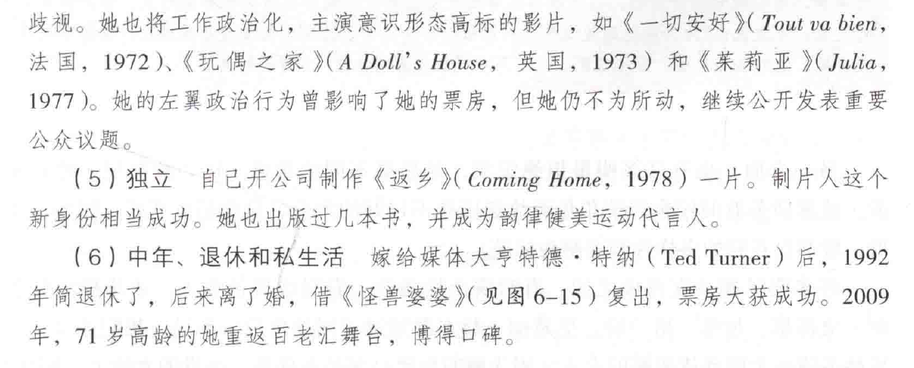
* 另一方面，也有许多明星**拒绝定型**，老想演不同的角色；比如**约翰尼·德普**和**瑞茜·威瑟斯彭**有时宁舍传统角色而故意选择不讨好的角色，借此拓宽戏路，因为演技高低一般都以戏路的多样性和宽窄为标准
  * **温斯莱特**和**丹尼尔· 戴－刘易斯**是当代最受人仰慕的英国演员
    * **温斯莱特**非常多产，一年可在美、英拍两三部主、配角电影，口音亦可变换．可演《哈姆雷特》、《理智与情感》、《泰坦尼克号》等古装片（全都在22岁以前完成），也能演现代戏．如《美丽心灵的永恒阳光》中的怪癖女孩；她至今巳获五次奥斯卡提名，而她终于以《朗读者》（The Reader）获得奥斯卡影后

    * **丹尼尔· 戴－刘易斯**多才多艺，演喜剧、戏剧、古装、现代，多种方言都难不倒，演技宽广，从《我美丽的洗衣店》（My Beautiful Laundrette）中的操方言疮子，到《看得见风景的房间》（A Room with a View）中的神经质上流人，或是《最后的莫希干人》（The Last of the Mohicans）之新世纪阳刚汉子，都让他（以及温斯莱特）不像其他英籍演员；他们不拍电视剧，不演舞台剧，只贡献于电影
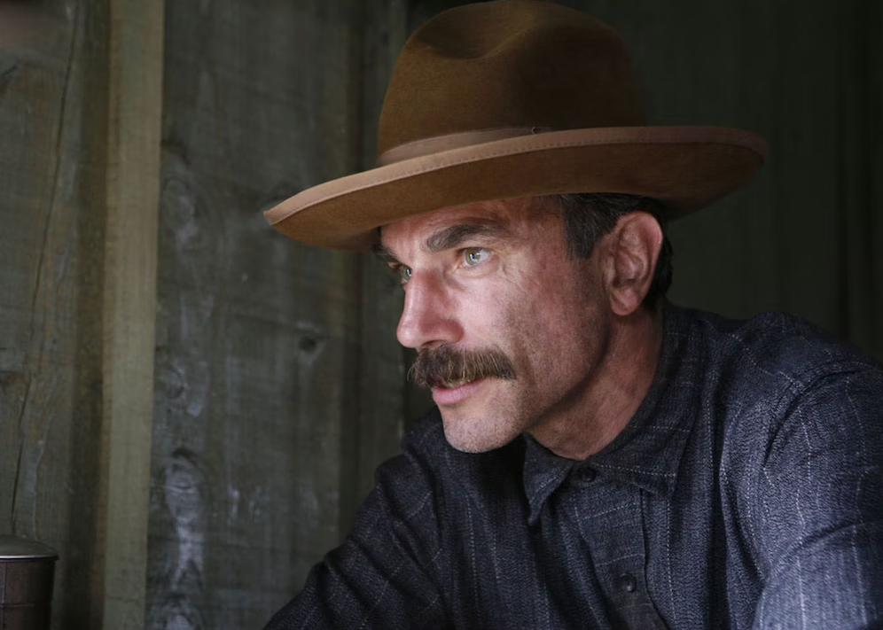
  * 在美国，男一号及女一号演员不能消主角时都会悄悄退休；但**特拉沃尔塔**不是如此，他挺喜欢演古怪性格角色
    * 《**发胶情人梦**》中，他必须唱呀跳的，还得反串女角，是无可救药的欢乐少女之母；如果是其他较不入流的演员就会在这种俗丽角色中向观众眨眼睛．但特拉沃尔塔穿上笨重的肢体填充物扮演可爱少女的肥妈．嗲嗲地爱她那个可爱的女儿

* 许多明星摆动在**两极之间**，有时演个性角色，有时也模仿他人；才华横溢的詹姆斯·史都华、加里·格兰特、奥黛丽·赫本都演过不同的角色，不过，我们还是很难想象赫本演一个脆弱或粗鄙的女人，因为她的形象已深植在优雅、高贵的女性上
  * 大部分**汤姆·克鲁斯**的电影都有一贯模式．开始时他是个神气自信的年轻人，有点骄傲，有点死相，当然他长得帅，却没有自己想象的那么聪明．因为犯了大错而学得谦和起来；沿路，总有一个爱着他的年轻女子相助．使他能克服困难而迈向更大的成功

    * 克鲁斯很善于为自己做职业规划，但是他也野心勃勃，愿意尝试自己的极限，不畏风险挑战形象相悖的角色；在《**木兰花**》中．他扮滨一个吹大牛、憎恶女人的“自强”派宗师．被自己的魅力蛊惑到不行，但是当他的浮夸被戳破时，他又像泄了气的皮球，有说法认为这是他最精彩的演出——无耻、滑稽，而又十分脆弱
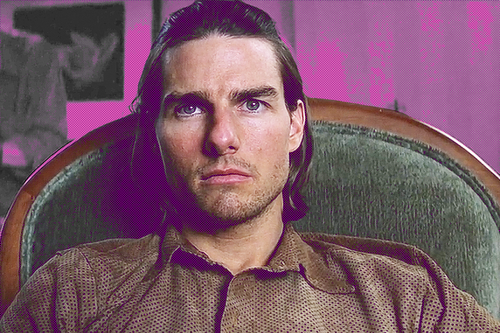
* 专业演员和明星之分别不在技巧，而在其**受欢迎的程度**；明星应有巨大的**个人魅力**，能吸引我们的注意，其他领域的公众人物很少能像电影明星那样影响深远
  * 世故的导演用明星和角色、表演及导演间的暧昧张力赢取**公众的情感**；**希区柯克**说：“当主角不是明星时，整部电影都会受损，观众不会关心他们不认得的角色的处境”
  * 当明星而非传统演员扮演一个角色，角色已自动带有**某种意义**，导演和演员在写好的角色上再加东西，就会产生**完整的戏剧意义**
* 也许对明星而言，最大的荣耀是成为**美国流行文化的图征**
  * 明星不像传统演员（不论他演得多好），他们的名字已使一些想法和情感自动**溶入他们外表的意义**中，这不仅累积自他们**过去的角色**，也来自他们**真正的性格**
  * 当然，经年累月后，有些象征意义可能会**逐渐消退**，但是有些大明星的图征，比如**加里·库珀**会变成**共通的经验**
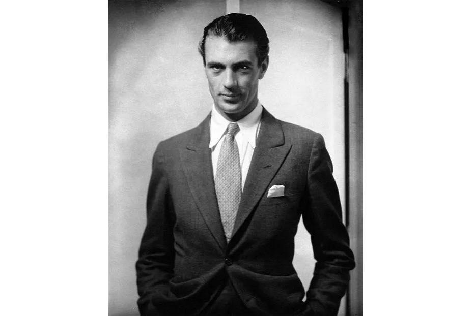
  * 这些独树一帜的伟大明星其实是**文化原型**（archetypes），而他们的受欢迎代表了他们能体现出那个时代的意义
  * 也许**希区柯克**最大的天分在于既顾到票房成功，又能超越制度，他明了领衔的明星保障了电影的商业成绩，但他也喜欢将明星往黑暗处推——探讨神经质，或者潜在的精神病，这些可能会颠覆明星巳建立的图征
    * 每个人都爱**史都华**这个半结巴、高尚又代表美国的典型理想主义者，像他在《风云人物》中的角色；但在《**惊魂记**》中，史都华沉迷于对神秘女子的浪漫想象，他自以为是爱情——可笑的是，他爱上的是虚构的女人
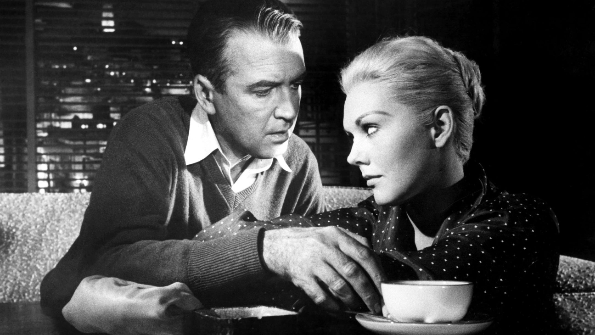