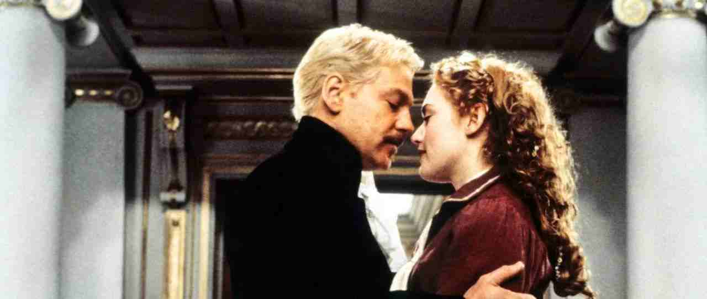
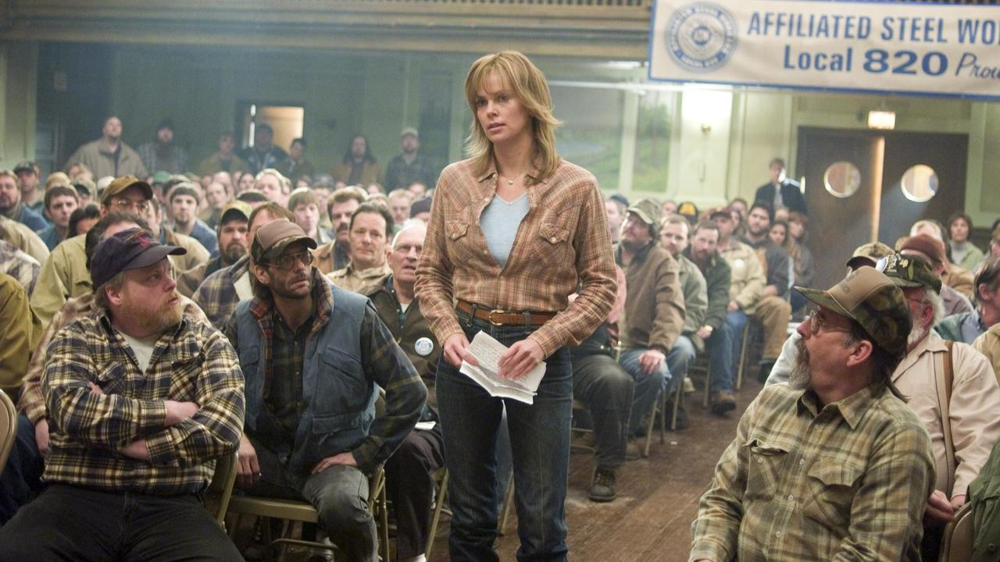

# 表演（2）
## 表演风格
* 因为时代、类型、基调、国家和导演重点而**迥然不同**；这些分野使表演方法分成不同种类，然而在同一种类当中，这些分类的定义亦非绝对
  * 这些名词在不同的时代也有不同的诠释，比如说，**莉莲·吉许**（Lilian Gish）在默片时被认为是非常写实的演员，但从今天的标准来看，她的表演似乎飘飘然不落实

  * 同样的，**克劳斯·金斯基**在《**阿基尔，上帝的愤怒**》中算是十分风格化，但比起形式主义时代的极端形式，比如《**卡里加利博士的小屋**》（The Cabinet of Dr.Caligari）中的**康拉德·法伊特**，金斯基又较为写实了

  * **表现主义**的表演和**德国电影**密切有关——德国电影强调导演而非演员这种表浪风格抽掉个别的细节．强调象征性而非立体可信的角色；它是**表现的**（presentational）而非**再现的**（representational），以极端代替典型的风格心理的复杂层面被风格化的主题本质代替

* 将表演风格**以国家分类**也会有误，尤其那些**容纳不同风格**的国家，如日本、美国、意大利
  * **南意大利**也许性格倾向于**拉丁刻板印象**，比如**莉娜·韦特米勒**的作品；**北意大利**人则**收敛而较不随性**，比如**安东尼奥尼**的风格

* **类型和导演**当然也影响到表演
  * 举例而言，风格化的武士道电影中，如黑泽明的《**用心棒**》，**三船敏郎**勇猛、傲慢又自夸不凡；但在现实主义风格电影《**天国与地狱**》（High and Low，亦为黑泽明导演）中，他的表演一改为层次分明、细腻扎实

  * 《**洛基恐怖秀**》的早期观众讨厌其变态的做作机智和嘲讽腔调．正统世界及其价值观被**俗艳的戏剧**无情地鞭鞑；但后来它却成为最受欢迎的**邪典**（cult）电影，在大学城和大都市的午夜场赚进8000万美元

  * 作为处理**微妙心理变化**闻名的大师，**小津**相信表演越少越好，他讨厌过度通俗，要求演员尽量写实，演员也因为他批评他们做戏而痛苦；他不喜用明星，不依惯例处理演员，让观众没有先入为主的概念，他选角也多依性格而非表演能力
    * 更重要的，是小津会探讨**个人需要与社会需求**之间的冲突关系；他的场景往往设在公共场合，在那里礼仪和规范要求掩盖了个人的失落情绪，小津经常指示演员不可乱动，只用眼神表达

* 表演风格往往依**演员的活力**而定
  * 如**卡格尼**这种高能量的演员，通常能以**华丽夸大的风格**吸引观众的焦点，因为看他活蹦乱跳的确是一大享乐；他的动作充分表现了他的情感，是动感派演员，他跳起舞来神气、性感、好笑，脚步快捷花哨，即使戏剧化的角色，他也很少停下他那急躁、刻意强调的手势和腾跃的脚步
    * 其他高能量演员包括哈罗德·劳埃德、凯瑟琳·赫本、贝蒂·戴维斯、金·凯利、乔治・C・斯科特（George C Scott）、芭芭拉・史翠珊、詹姆斯・伍兹（James Woods）、乔・佩西（Joe Pesci）和金·凯瑞（Jim Carrey） 

  * 低调的演员如**德纳芙**有时以“细小”和“靠近摄影机”而非夸大的风格取胜，这类演员让摄影机与他们**同步**，很少以戏剧化方式表达；观察德纳芙的表演，几乎不像在做戏，含蓄到几乎只有摄影机靠近她才看得出端倪

    * 像这种演员尚有哈里·兰登、斯宾塞·屈赛、亨利·方达、玛丽莲·梦露、蒙哥马利·克里夫特、凯文·科斯特纳、杰克·尼科尔森、薇诺娜·赖德（Winona Ryder）
* 虽然电影源起自1895年，但**默片表演**实际上只占了15年左右
  * 史家多以格里菲斯《**一个国家的诞生**》（1915）为默片**首部杰作**，真正进入有声时代应是1930年
  * 在短短15年内，表演风格却多彩多姿；如《**贪婪**》中**吉布森·高兰**细腻含蓄的现实主义，《**最后命令**》（The Last Command）中**埃米尔·詹宁斯**（Emil Jannings）华丽虚饰的悲剧营造，到默片的大喜剧谐星如卓别林、基顿、哈罗德·劳埃德、哈里·兰登（Harry Langdon），还有劳莱、哈台，都各自发展出个人化风格，尽管表面上有些许相同

* 一般对默片的误解是，所有电影都以“**默片速度**”（即每秒16格画面）来拍摄和放映；事实上，影片速度**各不相同**，因为摄影机完全是**手摇**的
  * 即使在同一部电影中，各场戏速度也不一样；一般而言，拍**喜剧场景**时会摇慢些，使放映的速度快些，而**戏剧性场景**则摇快点，让放映时动作显得较慢，成为每秒20至22格画面
  * 但当今电影放映仅有**两种速度**：默片l6格，有声24格，所以表演的原**节奏感**就被改变了；因此，默片的演员看来动作**急促而滑稽**，喜剧可因这种扭曲而增加喜剧感，默片谐星的表演今天看来仍有魅力，但喜剧以外，这种技术的扭曲应有修正的考虑
* 默片时代最受好评的明星是**卓别林**；他早年在**杂耍剧团**工作，练就一身喜剧技巧，使他在众谐星中无出其右者

  * 就**哑剧**而言，以他的原则性最多；评论家盛赞他如芭蕾般的优雅，甚至杰出舞星**尼金斯基**（Vaslav Nijinsky）也称卓别林和他棋逄对手
  * 他独树一帜地**混合了喜剧与悲剧**，剧作家**萧伯纳**形容卓别林为“电影惟一的天才”
* **葛丽泰·嘉宝**将默片已发展出的浪漫表演方式在20世纪30年代发扬光大，评论家称之为明星式表演

  * **米高梅公司**老把她拍成**有神秘过去的女子**：情妇、高级交际花、第三者——“永恒之女性”的本质
  * 她的脸显现惊人之美，能容纳**矛盾的情感**，又同时**收放自如**，仿佛有涟漪扫过她的五官；此外，她也能暗示**双性恋**，如在《**瑞典女王**》（Queen Christina）中，她的坚毅与男装打扮和她精致的女性化特色相互衬托

* **英国**的重要演员大多是**剧场明星**
  * 英国的**剧目剧场制度**（repertory system）是文明世界的艳羡之处，几乎每个中型城市都有**驻市剧团**，演员可接受各色古典剧目，尤其是莎剧的陶冶

  * 这种训练过程使英国演员个个**多才多艺**，优秀者会被伦敦剧场吸收；这里也靠近英国的**制片中心**，使演员能自由穿梭在**电影、剧场和电视**之间
  * 演**莎剧**是表演艺术的最高层，如果你能在莎剧中演得令人信服，据说你就可以演任何戏了；因为莎剧对演员的**技术和艺术视野**要求甚严，莎剧的对白是四百年前说的话，这种语言古老到即使文人也常只懂得四分之一

  * 这个对白以**诗赋方式**出现，演员得避免像唱歌般吟诵，另一方面，还要努力将像歌词般的台词念得“写实”；演员的口白应**清晰脆利**，让观众听得清楚诸如被害者、娼妇下人这些字眼，演员得技巧好到即使现代观众听不懂那些古字，也能传达出其中的**情感**
  * **肯尼思·布拉纳**是当代莎剧的**最好的演员**，他承继了劳伦斯·奥利弗和奥逊·威尔斯的伟大传统，同时也是才华横溢的舞台剧和电影导演；这部野心勃勃又一刀未剪的《**哈姆雷特**》虽然过长，却不乏精彩过瘾的场景，比如这段第二幕的结尾，哈姆雷特完全厌恶官廷的腐败，为自已无法采取任何为父亲复仇的行动而激动不已

* **英国表演传统**偏重近距观察的**外在表现的才能**，所有演员接受的训练包括口白、动作、化妆、对白、剑术、舞蹈、肢体控制和群众表演
  * 比如说，**劳伦斯·奥利弗**的表演法永远是**由外而内**，他像雕刻家或画家塑造特点；“我不去找我身上已有的特点，”他说，“而是去找出作者创造的个性。”
  * **化妆**对奥利弗而言是神奇的，他特别喜欢用胡子、假肤色、假鼻子和假发藏住真正的五官
  * 奥利弗总将身体保持在**最佳状态**；即使年纪已老，他仍跑步和举重，当病到不能做这些运动时，他就游泳
* 笫二次世界大战之后的表演风格强调写实；20世纪50年代早期，一种内在的风格，称为“**方法演技**”（the Method）或“**系统表演**”（the System），被介绍至美国来，一般认为与导演**伊利亚·卡赞**（Elia Kazan）有关

  * 卡赞的《**码头风云**》（On the Water Front）异常卖座，是**方法演技**最好的示范，也成为美国电影中与剧场表演一样的主流

  * 方法演技是苏联的**康士坦丁·斯坦尼斯拉夫斯基**（Constantin Stanislavsky）在莫斯科艺术剧院发展出来的训练演员的系统和排练的方法

  * 此法被许多纽约剧场引用，尤其是20世纪50年代的“**演员工作室**”，因培养出著名演员马龙·白兰度、詹姆斯·迪恩（James Dean）、朱莉·哈里斯（Julie Harris）和保罗·纽曼而名声大噪

  * 卡赞是成立元老，也在“**演员工作室**”任教到1954年，然后将这个学校转交给他的恩师**李·斯特拉斯伯格**接掌；不久，斯特拉斯伯格就成为全美最厉害的表演教师，他的学生全是世界著名演员

  * 斯坦尼斯拉夫斯基方法演技派的**重点**是：“表演时必须时刻活在角色里”；斯坦尼斯拉夫斯基**拒绝外塑的表演传统**，认为表演真谛惟有探索角色**内在的精神**，加上演员混合自己的情感，他发明的最重要的技巧是“**回忆情感**”（emotional recall），也就是演员挖掘过去与现在角色相似的情绪
  * 斯氏的技巧带有强烈的**心理分析**色彩：借由探索内在的**潜意识**，演员可以引发新情绪，每回表演唤出回忆并转换成正在演的角色
  * 斯氏以**冗长的排练**著名，演员也可即兴发掘角色文本的共鸣，即“**次文本**”，这与弗洛伊德的潜意识概念相似
    * **齐纳曼**是次文本的大师，尤以《**修女传**》这部呈现修女一生的作品最为含蓄；修女被派至非洲，遇见了一位具有奉献精神的大夫。他没有信仰，但她尊重他仰慕他，渐渐的他爱上了她，但却因为她的信仰和誓言而产生越来越多的挫败感，他认为她的生活“违反自然”，但他的爱注定要失望，因为他知道她立誓终生事主，所以他永远不能说出他的爱；我们要从字里行间了解他们复杂的感情，在文本中并未明说，但在次文本中，在不可言说的领域中我们则可以领悟得到

  * 所以对方法演技而言，**对白**是**次要**的；捕捉角色的“内在事件”，演员有时要丢开对白，或卡在喉咙里，甚至含混不清
  * 斯氏不赞成**明星制**和**个人化表演**；在他自己的作品里，他坚持演员和角色间的**真诚互动**
  * “方法演技”以带出角色**情感张力**著称，方法派的导演一般也相信演员得要有**角色的经验**，并详细研究演员的生活以塑造角色的细节
* 20世纪60年代，法国新浪潮的导演——尤其是**戈达尔**和**特吕弗**——将演员在摄影机前面的**即兴技巧**普及化，其**真实程度**令评论家激赏

  * 演员在**默片时代**已运用即兴，这也是无声喜剧的基础，有声电影初期**笨重的机器**扼杀了这种方法；方法演技派的演员用即兴在排练时进行探索，但真正用摄影机拍摄时仍是**一板一眼**并不即兴
  * 戈达尔和特吕弗为了捕捉惊奇的效果，有时会要演员在拍摄时**自己编台词**；这种由“**真实电影**”发明的技巧使导演捕捉到前所未有的真实段落
  * 像《**四百击**》中，13岁的主角（**让——皮埃尔·莱奥德**饰）被感化院中的心理医生诘问其家庭生活和性习惯，莱奥德由自已经验出发（他事前并不知问题），回答得坦白无心防

* 表演风格分成**表现的**（presentational）与**再现的**（representational）两种
  * 表现风格公开承认观众之存在，角色甚至直接对我们说话，不理其他角色，与我们建立直接亲密关系；**雪佛莱**在《**莱纳与罗伊**》（Lerner and Loewe）这出著名歌舞剧中就是表现的演出方式，注意他似乎扮演着电影世界里的媒介者

  * “**再现**”的形式是较为写实而自给自足的，角色对银幕外的世界和摄影机似**毫无知觉**，我们乃如偷窥般偷看偷听他们的对话，演员一副不知情状；《**北方风云**》中此景中的家庭危机，再现的形式使我们似乎侵犯了私密的领域

### 选角
* **电影选角**几乎自成一门艺术，它需要敏锐分辨演员形态的能力，这也是从剧场传下来的**传统**（convention）
  * 剧场和电影演员大致可依角色分为**以下几种**：男主角、女主角、性格演员（character actor）、少年、反派、轻喜剧演员、悲剧演员、少女、唱角（singing actors）、舞角（dancing actors）等等
  * 选角的传统一般**不轻易破坏**，例如说，虽然平庸的人也会恋爱，但爱情角色还是得找有魅力的演员饰演；同样地，具普遍美国特性的演员，如汤姆·汉克斯，扮演欧洲人就太不像

  * **库克的莎翁名剧**可说明选角错误是多大的灾难；这对恋人与原著实在差别太大，希拉当时已37岁，扮下了13岁的朱丽叶，霍华德也以44岁高龄演出罗密欧，至于罗密欧好友茂丘西奥的**约翰·巴里摩尔**（John Barrymore），已经高龄55，一群中年人扮小孩煞是可笑

  * **泽菲雷利**的版本较受欢迎，因为主角真的是年轻人；当然库克的演员口白较佳，但泽氏的版本较为可信

* 固定角色在**默片**时是**一成不变**的
  * 有部分原因是当时角色都具**寓言性**，并非个人化的，所以角色都被称为“男人”、"妻子”、“母亲”、"荡妇”等等；金发美女多半强调其天真，褐发则必为浪荡角色
  * **爱森斯坦**就坚持严格依形态选角，而且喜欢用**非职业演员**来强调其真实性；他的说法是，何苦找演员来模仿工人，导演大可找真的工人来演戏啊！
* 但是**专业演员**不喜欢被定型，总想**拓宽戏路**
  * 这有时行得通，有时行不通；**鲍嘉**是个好例子，他长期被定型成强硬、爱嘲讽的帮派分子，直到和导演**约翰·休斯顿**合作，才变成《**马耳他之鹰**》中的冷硬大侦探**萨姆·斯佩德**（Sam Spade）

  * 休斯顿接着再让他在《**碧血金沙**》（The Treasure of the Sierra Madre）中扮演偏执、专业的采矿者，然后在《**非洲女王号**》中又摇身一变成为可爱滑稽的醉鬼；他的弱点对观众而言非常亲切，他也因此得到**奥斯卡最佳男演员奖**

  * **丹泽尔·华盛顿**作为男一号非常讨喜——庄重、英俊又美国化，但往往不依这些特质时表现更好，如《**美国黑帮**》中，他扮演恶名昭彰的哈林区帮派分子——危险、不可测、用暴力达到目的；另外一部颠覆他个人特质的电影是《**训练日**》（Training Day），片中他饰演恶警，为他赢得奥斯卡影帝

* **希区柯克**说：”选角就是塑造角色”，一旦角色选定，尤其是**个性演员**，其**虚构角色的本质**已经确立；有时，明星比角色**更真实**，所以有些人根本就**直呼演员的名字**来代替角色
  * 推理小说家**雷蒙德·钱德勒**（Raymond Chandler）和希区柯克合作完《**火车怪客**》（Strangers on a Train）后，嘲讽导演的角色塑造方法：“他的角色想法很粗糙，只有‘好年轻人’、‘交际花’、‘害怕的女子’那几类”；钱德勒是文学家，他认为角色得由对白制造，对导演可运用其他方法浑然不觉

  * 比如说，希区柯克最擅用**明星制度**，这点和对白毫无关联，他选女主角偏好**高雅的金发美女**，内心如火却举止优雅高贵——就是“交际花”一型；但这些女主角也**各有各的特色**，他的三大最爱琼·芳登（Joan Fontaine）、英格丽·褒曼和格蕾丝·凯利就各有千秋

  * 希区柯克的选角带点愚弄观众的意味；他的**反派演员**常具有**个人魅力**，像是《**西北偏北**》中的**詹姆斯·梅森**（James Mason）

  * 希区柯克也仰赖观众对明星**既定的好感**而大胆让明星尝试**道德模糊的角色**；比如，**詹姆斯·史都华**在《**后窗**》中根本是个**窥视狂**，但我们却无法咒骂这个美国典型的健康男子

  * 观众也假设明星会**从头演到尾**，不到最后不会被杀；但在《**精神病患者**》中，**珍妮特·李**的角色在电影开始三分之一时即被残暴地谋害——这种吓人地破坏常规使观众惶悚不安
  * 有时，希区柯克也选自觉性格强，甚至笨拙的演员来演焦虑的角色，像是在《**火车怪客**》和《**夺魂索**》（Rope）中的**法利·格兰杰**（Farley Granger）；这种状况中，反而需要坏的演技，因为它是塑造角色的一部分

* 许多导演相信**选角对角色的重要性**，所以非得等**主角确定**才**动手写剧本**
  * **小津安二郎**就承认：“不知道谁来主演之前，我不能写剧本，就像画家不知用何种色彩就无法下笔一样”；**比利·怀尔德**也会一再为演员的个性修改对白
  * 表演就如同摄影、场面调度、动作、剪辑和声音一样，是**语言系统**的一种，电影导演用演员来**传达想法和情感**
  * 德西卡用**兰贝托·马焦拉尼**来替换加里·格兰特，就赋予《**偷自行车的人**》完全不同的艺术效果；并非马焦拉尼比加里演得好，正好相反，演技在此片中派不上用场，马焦拉尼比拥有优雅、机智和世故等复杂图征的加里真实，也更像工人
  * 这是电影史上最有名的**选角风波**，本片用两个**非职业演员**饰演贫困劳工和崇拜父亲的儿子，演父亲的真是个**工人**，演完戏后也真的找不到工厂工作；电影在筹资时，某位仁兄愿意投资，条件是主角应为**加里·格兰特**，德西卡想不出高贵优雅的加里如何演一个劳工，他聪明地放弃了这个投资而找到了**适当的演员**
