# 运动（2）
## 摄影机运动
* 20世纪20年代以前，电影工作者尚不知道摄影机可以移动，动作仅限于**被摄主体的移动**；20世纪20年代，某些德国导演如**茂瑙**（F.W.Murnau）和**杜邦**（E.A.Dupont）的摄影机运动不仅是表面的动感，也带有心理和主题意义
  * 而这些试验也使后继者能以摄影机运动达到以往不能做到的**含蓄象征**；虽然**剪辑**——每个镜头的摄影机位置不同——可能更快、更便宜，也较不分散注意力，但比起摄影机运动的**流畅**，也有短暂、不连贯及不可预测的毛病
  * 摄影机运动因为耗时，往往不如**硬切**（straight cut）方便，同时导演也应顾及其技术及成本的复杂性值不值得
* 镜头**愈近愈紧**，动作的掌控就愈多，镜头**愈远愈松**，动作就显得不重要；这通常都视动作与摄影机的远近而定，即使构图稍微变化也会影响我们的反应
  * 图中两种镜头显现些许不同，较松的中全景（a）里，德尔托罗被掌控了场面调度（从左到中空间）的琼斯主控，因此被推挤到画面的右边。琼斯的主控性完全由他动作的空间和大小决定，在画面中视觉因素主控权变成了琼斯控制德尔托罗的空间隐喻
  * 在更急迫、更紧的中景画面（b），德尔托罗又重拾掌控权，他占了画面三分之二的空间，而琼斯被困在银幕左下角；我们只要看角色有多少活动空间，便知谁占了上风
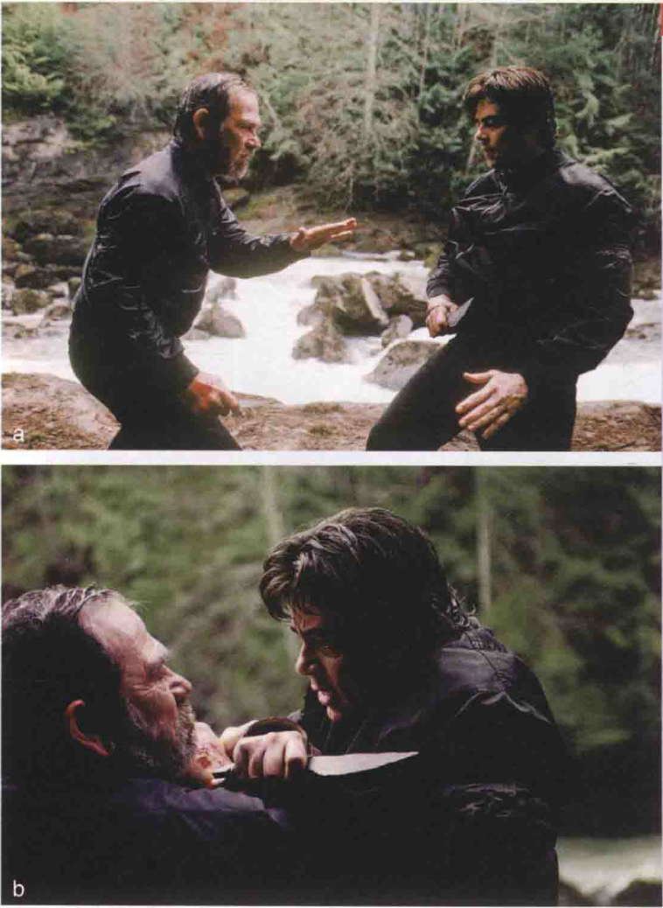
* 基本上，摄影机的移动可分七种：（1）**横摇**（pans），（2）**上下直摇**（ilts），（3）**升降镜头**（crane shots），（4）**推轨**（dolly shots），（5）**伸缩镜头**（zoom shots），（6）**手提摄影**（hand-held shots），以及（7）**空中遥摄**（aerial shots）
* **横摇**是摄影机架在三脚架上，主轴不动，仅镜头**水平移动**；这种镜头**耗时**，因为必须平稳圆滑而缓慢，以免影像不清楚
  * 横摇在感觉上是**不自然的**，人眼扫过一个场景时是由一点跳到另一点上；常用的横摇是为了使主角**留在景框内**，比如一个人在走路，摄影机必须跟紧他，使他一直留在画面中心
  * **大远景**的横摇镜在史诗电影中极有效，观众能随镜头的移动经验场景的广袤无垠；摇镜在**中景及特写**中也颇有力量，比如**反应镜头**（reaction shot），即是由一个说话者转至另一个人，看他的反应，维持两个主体的**因果关系**，因为硬切会强调两个主体的**分离**
  * 在有些情况下，导演希望把一系列图像连接起来，以激发一些**微妙的联想**；例如，在这个背景为美国南北战争时代的场景中，我们看到两位主角在码头上进行金钱交易，在一个连续的镜头中，从摄影机横摇中我们看到爱尔兰移民涌下轮船，登记参战（这样他们就可以获得美国公民身份），然后他们被集合到旁边的正在装载货物的运兵船中，移动的摄影机镜头表达了政治性观点
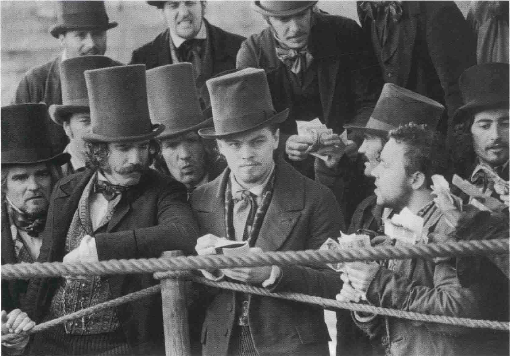
  * **快速横摇**（swish pan，也称flash pan或zip pan）是横摇的变奏，通常用来转换镜头，代替**硬切**；其速度很快，影像模糊成一片，虽然这比切换镜头花时间，但能造成两个镜头的**同时性**，导演用此法可连接不同的场景，使之不显得太遥远
  * 横摇镜头强调空间的统合及人与物的**连接性**；这种镜头的完整性被干扰时，会使观众吓一跳
    * 在**罗伯特·本顿**（Robert Benton）的《**心田深处**》（Places in the Heart）中，故事背景是20世纪30年代经济大萧条时一个德州小社区的小型基督教庆典；最后一个镜头是在教堂里，摄影机以慢动作横摇过一排排教友，而在这些生者之间散坐着一些已逝去的人，包括一个凶手及被害人，肩并肩地祈祷，虽然片子是以写实手法拍摄，但最后一个镜头夹带象征意味，暗示小区全体同心协力，连死者也不例外
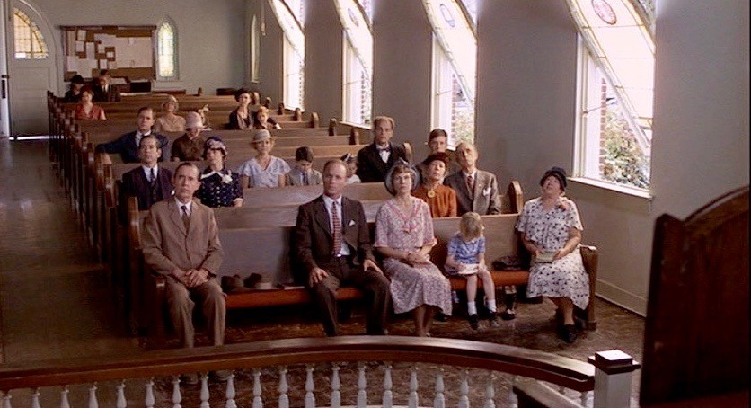
* **上下直摇**使用原则大致与横摇相近，只是水平运动换成垂直运动
  * 直摇用途也在使主体移动时仍**留在画面中心**，或强调空间和心理的相互关系，或加强同时性、因果关系等；直摇和横摇一样，亦可当**主观镜头**（point--of-view shots），模拟主角往上或往下看的视线所及
  * 由于直摇牵涉到摄影机角度，所以也带有**心理效果**；比如水平视线的摄影机向下直摇时，被摄对象突然就显得无助、可怜
* **推轨镜头**（dolly shots，有时又称trucking或tracking shots）是将摄影机架在小推车上**前后移动**，或在被摄对象的**侧面**移动，也可铺轨道，使滑行平衡顺利；现在，摄影机架在汽车、火车或任何移动物体上所拍的镜头，都称推轨镜头
  * 推轨镜头对**主观镜头**极有利；如果导演想强调角色行动的**目的**，可以用剪辑的方式，捕捉动作的头尾即可，但他若是认为动作的**过程**重要，则往往会用推轨镜头
  * 如是，若主角在寻觅的行动里，用主观的推轨镜头会延长寻觅的悬疑；同样的，**往后拉的推轨**（pull-back dolly）也会因突然显露某些信息而惊吓观众，因镜头往回拉时，会显露先前景框外的东西
  * 推轨镜头有时能造成**与对白矛盾的张力**；比如**杰克·克莱顿**（Jack Clayton）的《**太太的苦闷**》（The Pumpkin Eater），两人躺在床上闲聊，女主角问前夫是否后悔离婚，前夫答说没有，然而此时摄影机却自顾自在房内移动，显示出女主角的照片等，证明男主角口是心非；这个推轨镜头是导演经由角色向观众说话，是创作者**突然介入叙述**
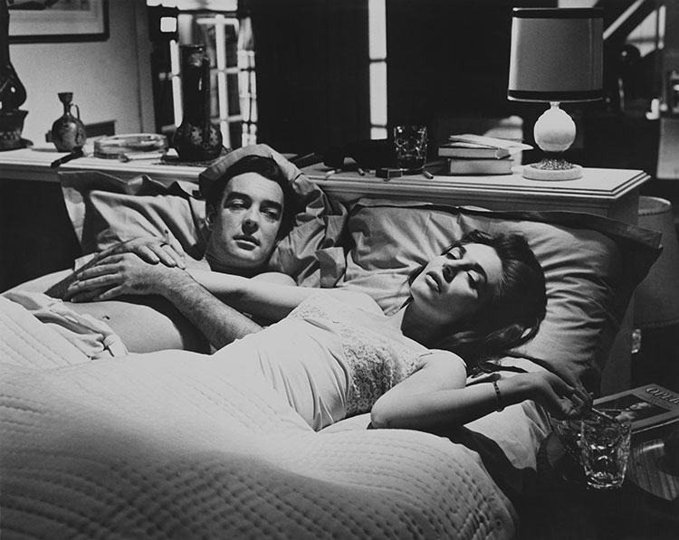
  * 推轨镜头也适合**心理效果**；逐渐向角色靠近的推轨，暗示我们要接近该角色，亦代表有些重要的事要发生，是一种**渐进而不明显的发现过程**，特写的切接造成**突然的效果**，而缓慢的推轨则较**缓和**
  * 向后退的推轨或升降镜头先**特写某一主体，**然后向后撤退拉成**全景**，这两极化的影像对比可以是滑稽、令人震惊，或甚至是具讽刺性的；在这场著名的戏里，摄影机先拍女主角的特写（费雯·丽饰），慢慢向后拉高，银幕上出现成千上万的士兵，最后在极远景时停下，远处的旗杆前，一面破烂的南军军旗在风中摇摆有如破布，这个镜头传达出史诗般遭战火蹂躏及失落的场景
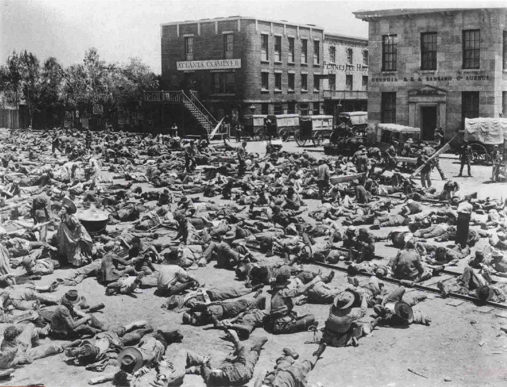
  * 如此后退的推拉镜头比传统的推轨镜头**令人困惑**；当我们将镜头推近时，通常能知道我们要去哪里，去什么地方，但当摄影机反方向拉时，在跑步的主角一直在画面中，我们不知目的地在哪，只有一种迫切、紧急逃走的**渴望**
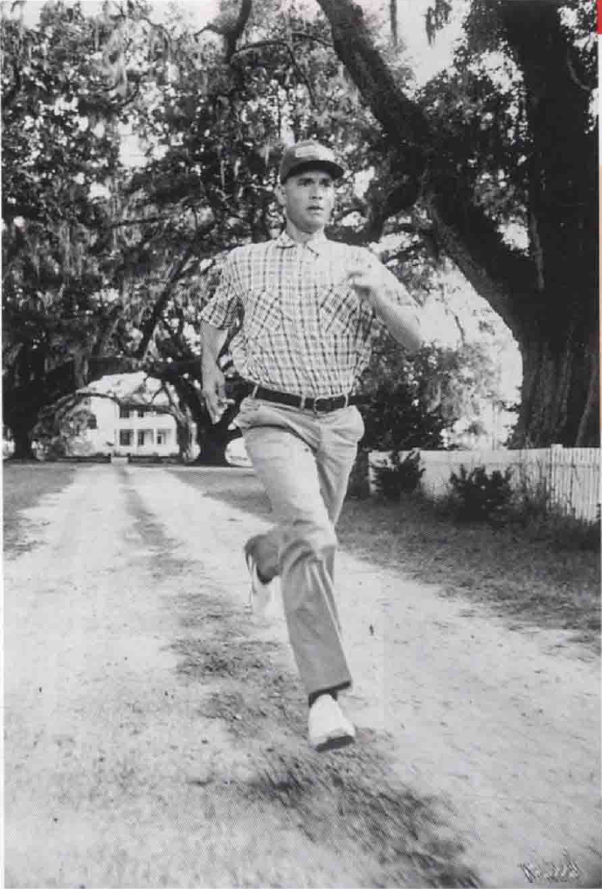
* **静态镜头**代表的是稳定、秩序，除非景框内有很大幅的动作，而**摄影机运动**则象征活力、流动和混乱状况
  * **威尔斯**便喜欢探索摄影机捕捉角色活力的能力，在《**奥赛罗**》（Othello）里，威尔斯利用摄影机运动来暗示主角的活力；起先充满活力自信的主角，由**推轨镜头**表现，等到他脑中生妄念后，摄影便渐趋**静态**，活力丧失，精神萎靡，到最后一个镜头，他已完全被锁在**静止的景框**中动弹不得，乃至终于自杀
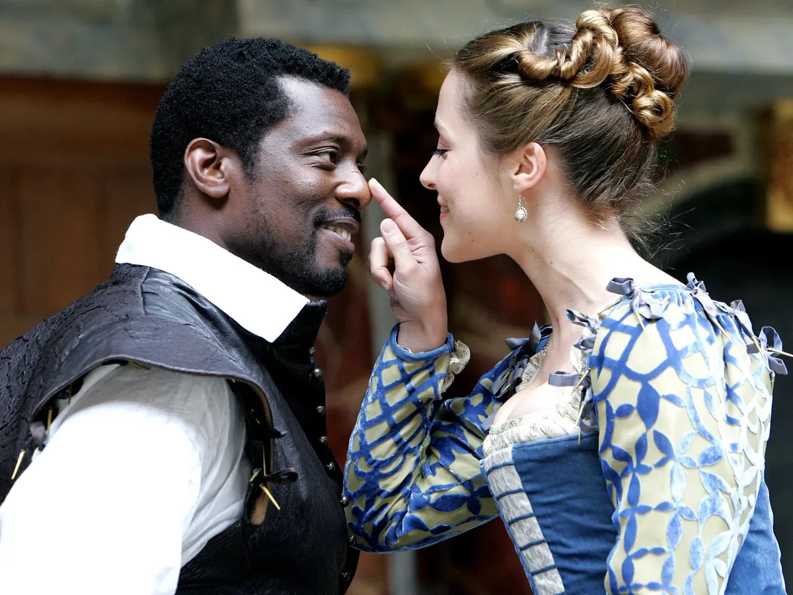
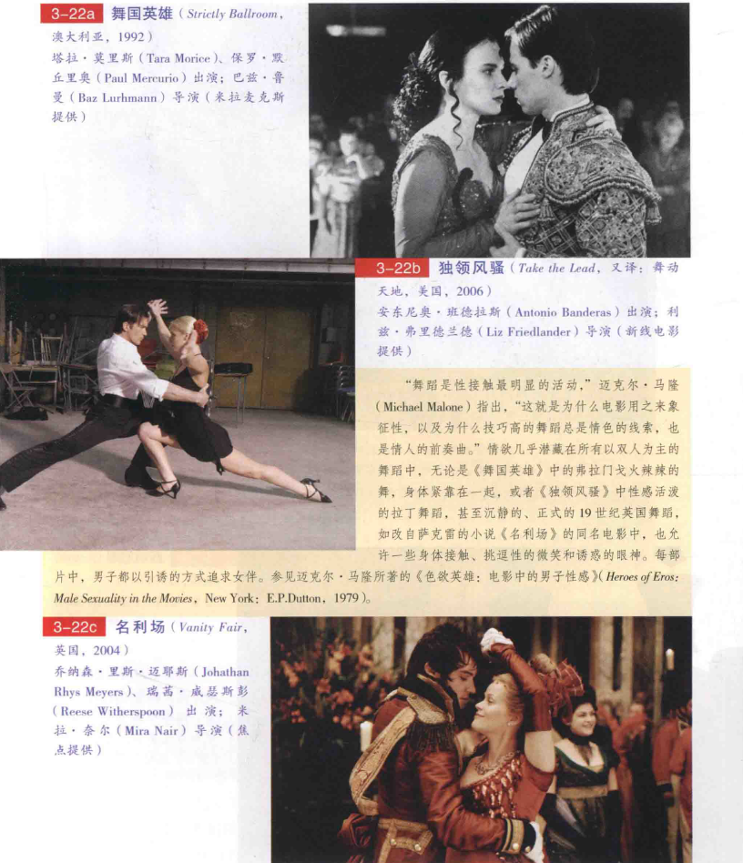
  * 当摄影机尾随某一角色时，观众会期望看到某些事，因旅程总是有目的的，而推轨镜头则较具**象征意义**，在**费里尼**的《**八部半**》中，移动的摄影机暗示此片繁复的主题；主角圭多是个电影导演，他想在一个奇怪的温泉区拍一部电影，在那里，他所遇到的记忆、幻想及现实都出乎他的想象，但他却犹豫起来，不知如何选择这些丰富的素材来放到电影中，他不能全用，因为有些东西太芜蔓，不适合放在一起，整部电影中摄影机无止境地漫游，在这幻境徘徊，记录下各种面孔、质地及形状的景象，圭多搜集了这些东西，直到欢欣的最后一景之前，他却无法将这些整理成有意义的艺术结构
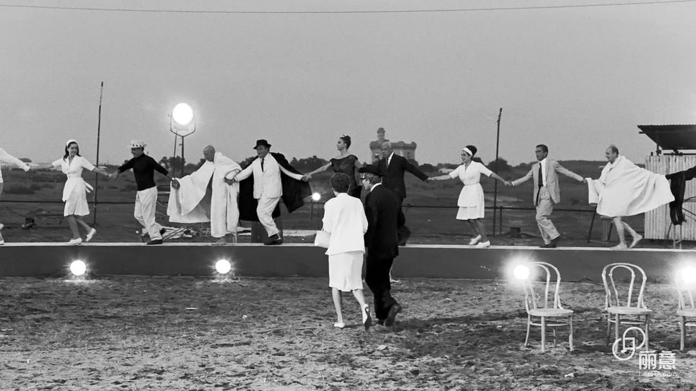
  * 动感的相反便是**静止不动**；此处就是欠缺自由的极致，1839年著名的奴工反抗奴隶制事件被搬上银幕
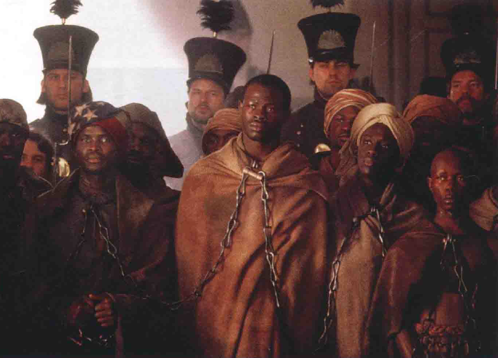
* **手提摄影机**较不抒情，比起推轨镜头来**较易被人察觉**
  * 手提摄影机通常是**架在摄影师肩上**，20世纪50年代发明了轻型的手提摄影机，导演能够更自由地在空间游动；其最初是为**纪录片**方便而用，但很快剧情片也学会了活用手提摄影机
  * 大致说来，这种方式效果较粗糙而且画面不稳，尤其近距离动作的不稳更为明显
  * 如其他艺术，**主题决定技巧**；此图是越战时期的反战示威游行，摇晃的手提摄影机、破碎手法的剪辑及开放式的空间构图使这场戏仿佛是在混乱中抢拍的，平稳的摄影会使画面看起来干净，但就会失去劲道，反而无法与本片主题相切合
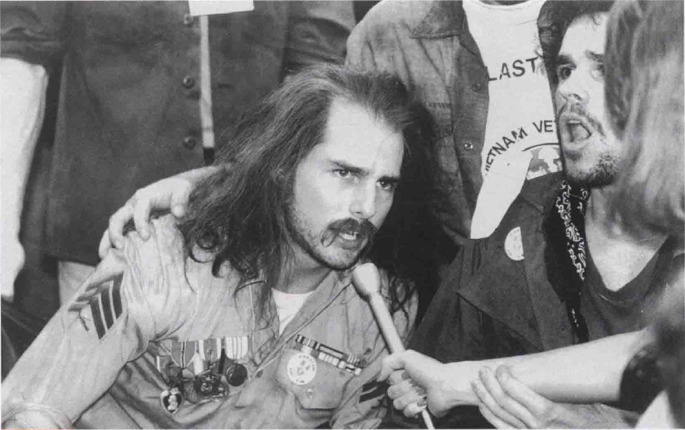
* **升降镜头**通常有个**活动支架**（就像电话公司修电线的活动支架），约6米高，使摄影机能架设其上，往任何方向运动（上下、斜线、推进、拉远）；因具有这种**流动性**，升降镜头能呈现较复杂的概念，它可以从高而远的位置前进到低而近的特写
  * 高挑、优雅、美丽的**茜·雪瑞丝**是20世纪50年代米高梅歌舞片黄金时期最好的女舞者，她受的是芭蕾舞训练而非踢踏舞，所以在这种古典芭蕾梦幻版中表现最佳；剧院中的舞蹈总是在固定的位置上看，电影舞蹈则可以更复杂，不但舞者，连摄影机亦可以被**编排**，凯利的编舞喜用**抒情的升降镜头**，使摄影机的移动与舞者的动作如梦幻般契合，简直就是一种双人舞
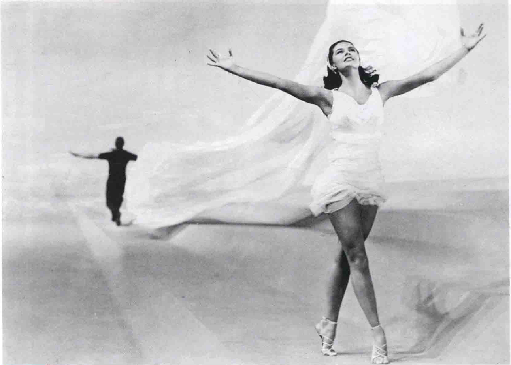
  * **摄影机稳定器**（**斯坦尼康**）于20世纪70年代研发出来，让摄影师得以**平顺地移动**摄影机，穿梭于一连串的场景或地点，而不会摇晃跳动；这种设备让导演无须搭设轨道等稳定镜头设备，也省下相关技术的人力费用
  * 或许20世纪70年代使用摄影机稳定器最有名的例子就是库布里克的恐怖经典《**闪灵**》（The Shining），当小男孩闯入空荡荡的旅馆的走廊时，在摄影机稳定器的辅助下，摄影机得以尾随男孩的三轮车而入
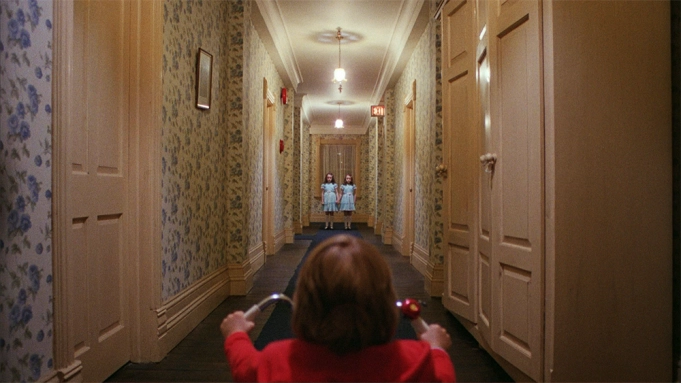
* **伸缩镜头**则无须移动摄影机，但效果就如升降或推轨镜头
  * 伸缩镜头包括许多**不同的镜片**，可以由近的广角直接转成长焦镜头（反之亦然），功用相当多；首先它能**很快**推进、拉出被摄物，速度惊人又无须架在支架上，花费也低廉，另外，在群众场面，它又能在**远处偷摄**，不致引起群众注意
  * 伸缩镜头和其他摄影机运动在心理上会产生**不同的感觉**，推轨镜头和升降镜头让观众有**进入或抽离现场**的感觉，当摄影机穿入三维空间，家具和人物都被逼至银幕边缘；而伸缩镜头则缩小人物并压缩空间，影像的边缘消失了，虽然我们没有进入现场，但有部分的现场却被**推至我们眼前**，在短的镜头中，这差异不大，但在**长镜头**中就很明显
* **空中遥摄镜头**多在直升机上拍摄，这种镜头是升降镜头的变奏，但是它的方向、变动幅度更大，有时甚至象征了抒情、自由的意义
  * 当升降镜头派不上用场——出外景时就经常如此——空中遥摄就能营造出**相同的效果**
  * 在科波拉的《**现代启示录**》（Apocalypse Now）中，就用空中遥摄镜头拍美国直升机在空中盘旋炸毁越南村庄的戏，造成一种天地不仁的感觉；这场戏动感十足，充满活力及恐怖感，经过高明的剪辑后，生动地传达了失控和山雨欲来的感觉
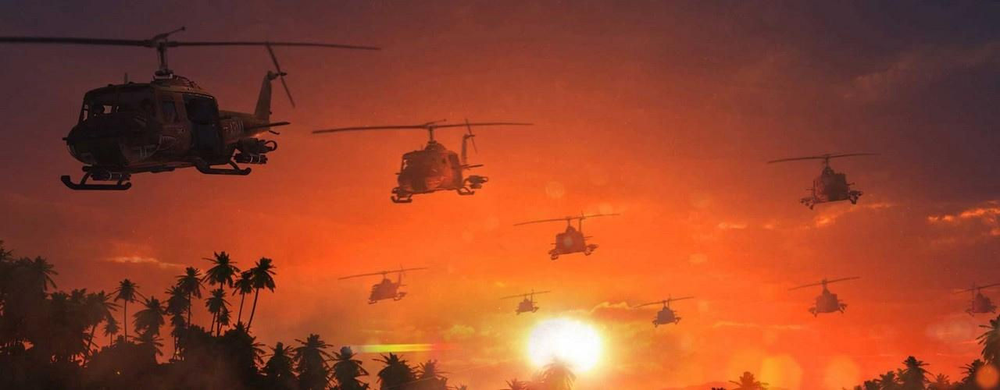
  * 大部分**空战电影**的导演都有飞行员背景，诸如第一部奥斯卡最佳影片《**翼**》（Wings），即是**威廉·韦尔曼**（William A. Wellman）导演，他是“一战”时拉斐特飞行队的老兵，托尼·比尔亦然，他十四岁就开始驾驶飞机，此片的空战就精彩非凡；背景设在1916年，根据“一战”中在法国阵亡的美国飞行志愿军故事改编，空战场面抒情又扣人心弦，其摄影师布雷厄姆（Henry Braham）说：“这些人几乎毫无防护地在天上战斗，那种无保护及人的脆弱所带来的冲击感，在当代动作片和战争片中再也找不到了
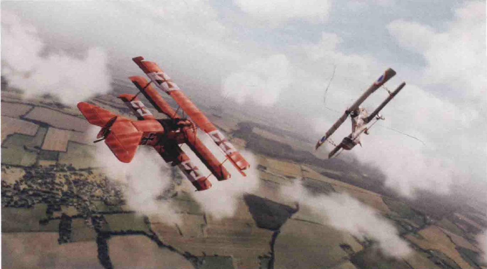