# 运动（3）
## 动作的机械扭曲
* 动作实际上是**光学幻象**；其实，它是一秒二十四格的静止画面快速放映而造成的**幻觉**，这种现象称为“**视觉暂留**”（persistence of vision）
  * 如果能操纵摄影机或放映机的**时间因素**，“自然”的动作便能被扭曲；早在20世纪初，**梅里爱**已实验各种机巧摄影，虽然当时纯为笑料或有趣的特技而设计，却打开一条丰富的创作之路
* 这种机械扭曲的创作方式一般分为五种：（1）**动画**（animation）；（2）**快动作**（fast motion）；（3）**慢动作**（slow motion）；（4）**倒转动作**（reverse motion）；（5）**定格**（freeze frames）
* **动画**与真人电影有**两个基本差异**
  * 在动画中每一格都是**单独拍摄**的，而且被摄物不像真人会**自己移动**
  * 动画的主体多是**图画**或**静止的东西**，因此每部动画都得拍摄**上千格画面**，每相邻的画面差距很小；将这些画面用**每秒二十四格放映**就会有动作产生
* 从1930年早期的《**糊涂交响曲**》（Silly Symphonies）开始，动画多年来就是由**迪斯尼制片厂**主控；至今，他们仍是前锋，题材风格、技术都大胆富创意，他们也领导研发在动画中用色彩来表达情感，在《**小美人鱼**》中，含蓄的淡紫色、时髦的小圆点、暗沉却做作的黑色，还有左边玩笑似的粉红色——完全是纯粹的抽象的表现主义
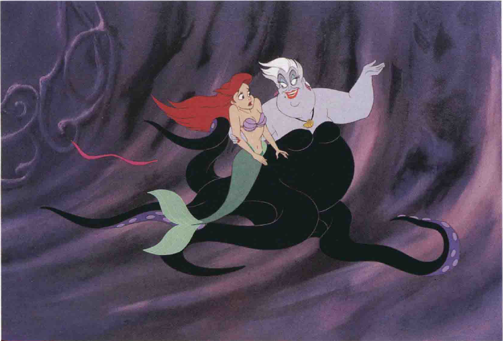
* 一般对动画的误解是其以娱乐小孩为宗旨——这可能是迪斯尼的影响；事实上，动画的范围和真人影片一样**广**
  * 迪斯尼的作品和捷克**伊日·特尔恩卡**（Jiri Trnka）的木偶电影老少咸宜，这些电影和**保罗·克莱**（Paul Klee）的画一样通俗；甚至也有“X”级的动画
  * 早期的动画如1924年法国之《**机械芭蕾**》（Ballet Mecanique）是由知名立体画家**费尔南德·莱热**（Fernand Léger）导演，他在当时参与了先锋派电影运动；在此短片中，他制造了许多**动感效果**，用停格动画技术让许多物体如杯盘、机器零件在空中飞舞轮转
  * 现在动画艺术家常用作品探索**严肃题材**，比如《**我在伊朗长大**》根据畅销绘本改编，半自传地讲述一个中上阶层之伊朗少女生在伊朗，经历了伊斯兰革命及残酷的两伊战争，后迁居至维也纳和巴黎，面临宗教偏见，又爱上西方男孩，因被他抛弃而心碎；此片以黑白片拍摄，线条简单，**莎塔琵**自称她承袭自德国表现主义和意大利新现实主义，而非受当代电脑动画影响
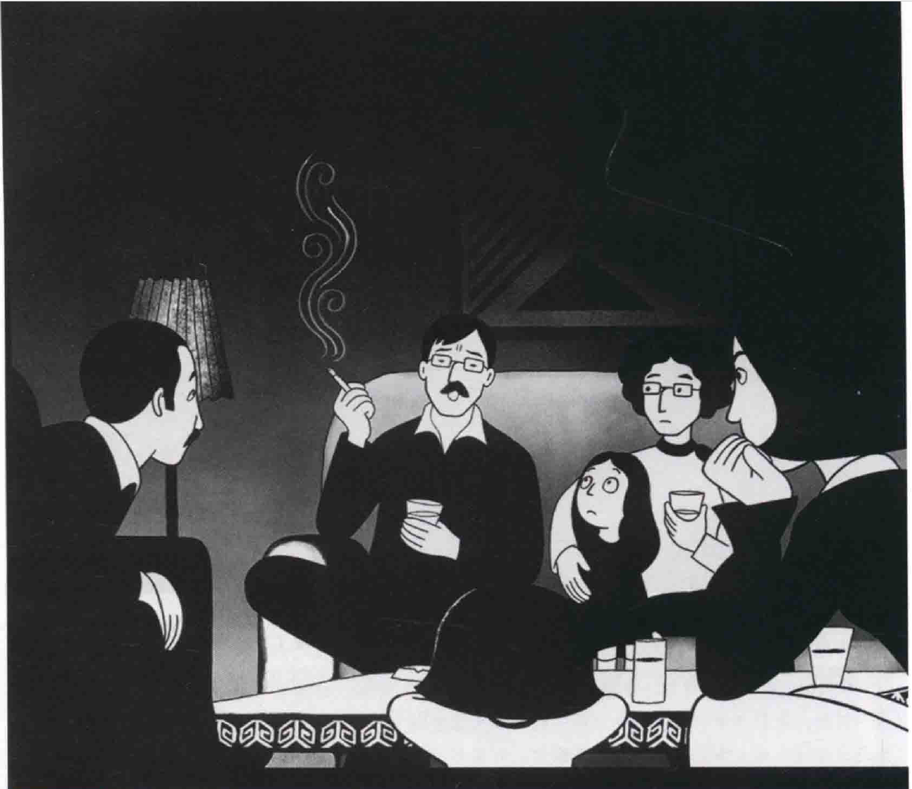
* 另外也有人误以为动画比真人电影**易拍**
  * 事实上**恰恰相反**，由于每一秒钟需拍摄二十四张画面，通常九十分钟的剧情片，得需要129，600张图画

  * 许多动画家也在透明的**赛璐珞片**（cls）上着画，以造成纵深的感觉，有时一格便需要三或四层透明片
  * 难怪动画往往以**短片**为多，其间耗费的人力和时间实在可观；动画剧情长片多半是由**生产分配线式制作**，雇用众多的绘图员画出上千张画面
  * 当然，现今许多动画电影完全是用**计算机**做出来的
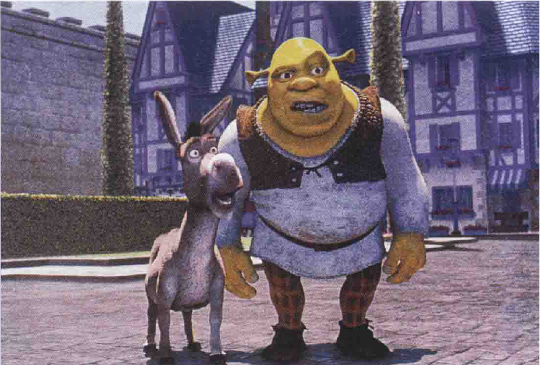
* 动画在技术上也沿用许多**真人电影的技巧**，如推轨镜头、伸缩镜头、不同的角度和镜片、剪辑、叠画（dissolves）等，而且动画家也可使用不同的**绘画技巧**如油漆、钢笔、铅笔、蜡笔、刷子、丙烯等等
  * 真人和卡通合演最成功的例子是**罗伯特·泽梅基斯**的《**谁陷害了兔子罗杰？**》（Who Framed Roger Rabbit），此片的动画指导是**理查德·威廉斯**（Richard Williams），总共动用了三百二十多个动画师，以及将近二百万张图画才完成，每一格画面都得用到二十四张画，卡通人物的精致令人惊叹；兔子罗杰拿起真的咖啡杯喝得呼呼响，而卡通人物在真的场景投下真的影子，或撞到真实人物，把他们撞倒，等等
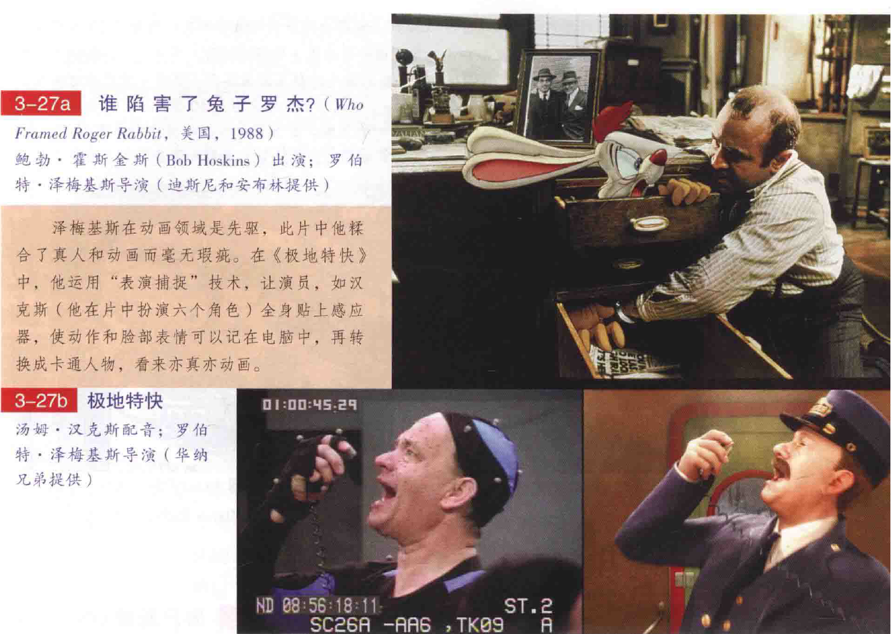
* **快动作**是以**慢于**一秒二十四格的速度拍摄，再以**正常速度**放映，动作会**加快**，这种效果通常用来**加强自然的速度**——如奔跑的马、飞驰的汽车
  * 早期的**默片喜剧**，标准速度尚未统一，所以现在看来速度均变快，动作夸大滑稽；即使是用每秒十六或二十格画面，早期导演仍以快动作造成卡通的效果
  * 根据法国美学家**亨利·柏格森**（Henri Bergson）的说法，当人表现得像**机械**时，**喜剧感**便会产生；人和机械不同，人可以理性地思考、感觉及活动，而使人变得像机械的因素之一便是**速度**，快动作时人无法维持尊严，行为显得狂野、失控而缺乏人性，托尼·理查森在《**汤姆·琼斯**》中，就运用快动作制造笑料
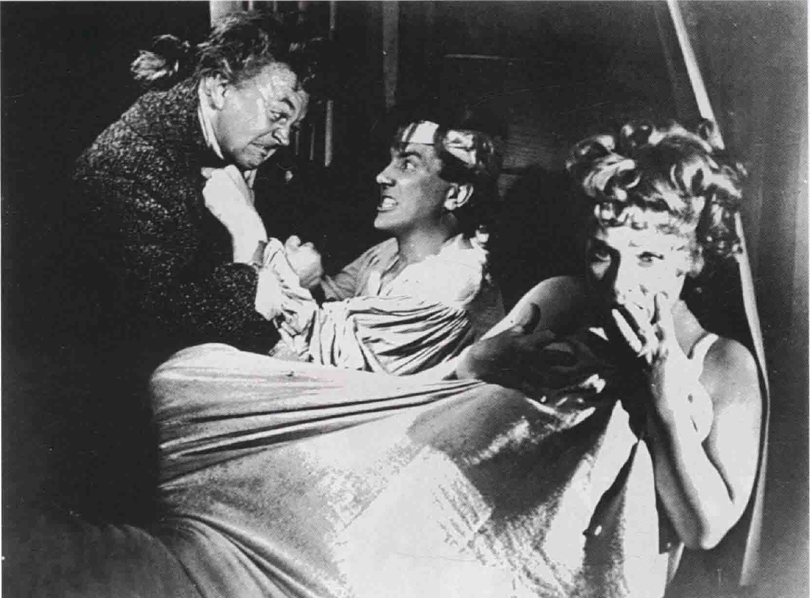
* **慢动作**则是以**快于**每秒二十四格的速度拍摄，再以**正常的速度**放映造成的，其效果倾向于**庄严**，即使平凡的动作在慢动作下也显得优雅

  * 若说快动作适合喜剧，慢动作就适合**悲剧**；例如：**西德尼·吕美特**在《当铺老板》的闪回里用慢动作，描写主角少年时和家人在乡下的快乐时光，充满了诗意
  * **暴力场面**也常因此而增加美感，**萨姆·佩金帕**（Sam Peckinpah）在《**日落黄沙**》（The Wild Bunch）中也以慢镜头表现恐怖的狰狞场景——血肉飞溅，人仰马翻
    * 暴力宛如舞蹈，日本大师**黑泽明**有时会用慢动作来表达暴力，尤其喜欢在战役场面中；**兹维克**也用了此技巧，**反讽**地将著名美国内战战役的残酷和血腥混在一起，断肢残臂，血肉横飞，造成迷人的慢镜头画面、
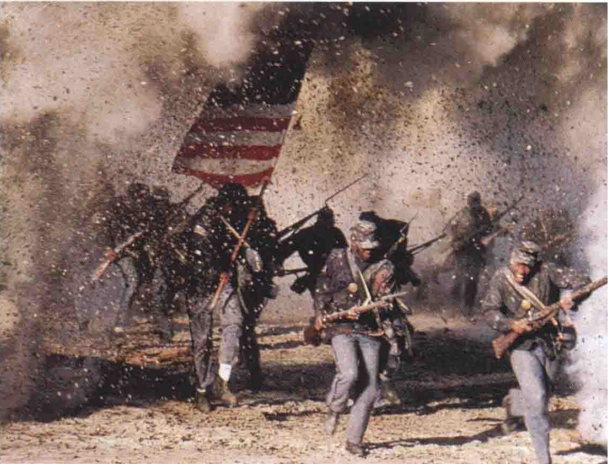
  * 慢动作当然**延长了戏剧时间**——不过有时令人难以忍受，如同此图；主角出发要去救他心爱的女人（她被印第安人突袭且遭挟持），两手各执武器，镜头是充满冲动的正面半身，背景失焦，魔眼（Hawkeye，刘易斯饰）全神贯注在敌人身上，但这个慢动作摄影似乎拖累了他——如同永恒的时间绊住了他
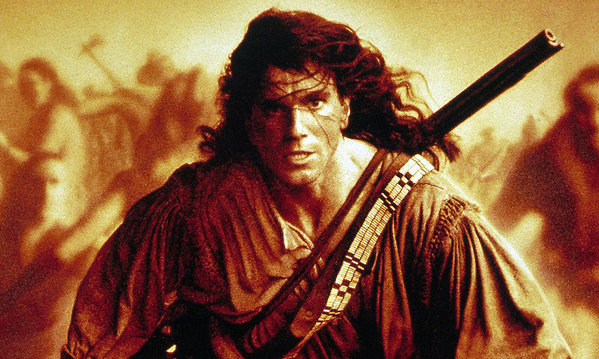
  * 慢动作可以使动作具有灵气，使它具有梦幻及另一世界般的轻灵曼妙；但在这部歌舞片中，这个舞台的慢动作则是用来**强调每个舞者的个人化风格**，而不是一致性的优雅，撒普的编舞与故事紧密互动，描绘了20世纪60年代嬉皮们**自由无拘束**的生活形态，充满松散、即兴的味道，每个舞者任自已身体乱舞—如同一个锁链中随意乱动的环结
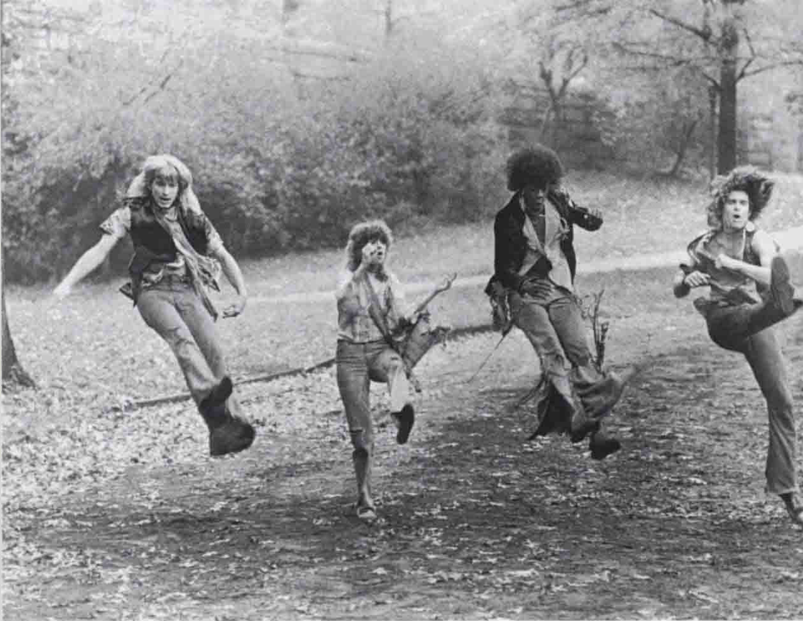
* 倒拍镜头是以倒拍的方式拍成，放映时再颠倒顺序
  * 此技法见于梅里爱的时代，菜斯特（Richard Lester）在《决窍》（The Knack）中以此制造荒谬效果；**让·科克托**的《**奥菲**》（Orpheus）混合了倒拍和慢镜头，剧情是主角进人地狱，救回他失去的妻子，在进人地狱一场戏中，科克托即以倒拍方式处理，效果诡异奇特
* **定格**则是以**静止画面**多印若干格，造成动作“凝结”的效果
  * 导演借此可以使观众**注意某个影像**，如《四百击》的结尾
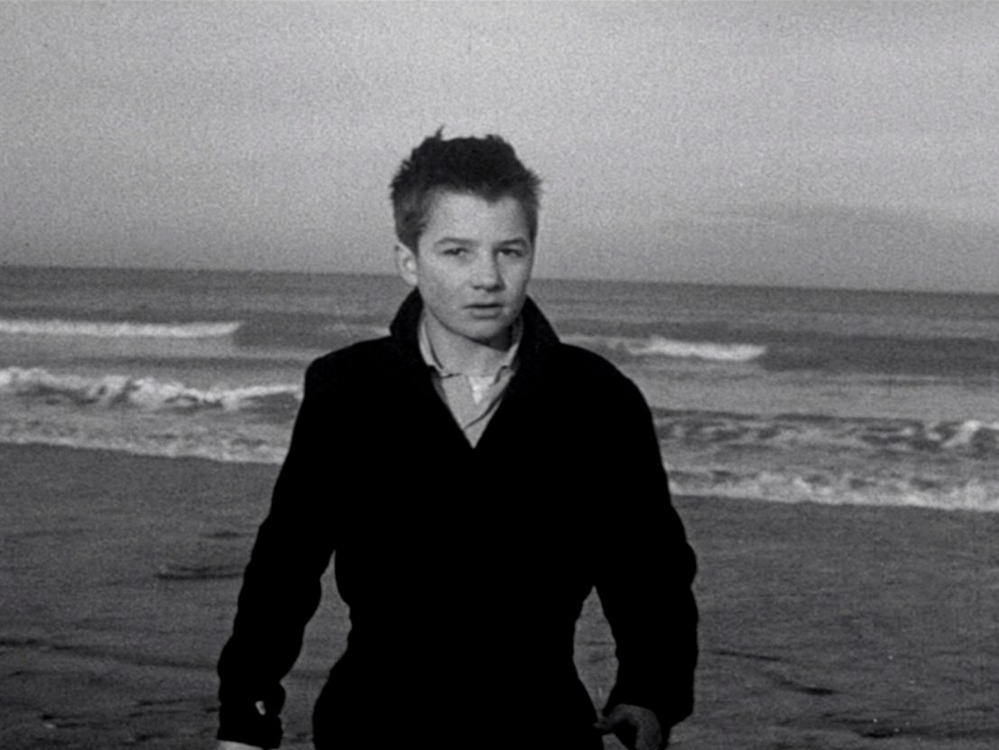
  * 也有导演以定格造成**滑稽**的效果，理查森在《**汤姆·琼斯**》中亦用定格来处理结尾
  * 此外，定格也被用来**点出主题**，托尼·理查森的《**长跑者的孤寂**》（The Loneliness of the Long Distance Runner）最后一个镜头是男主角的定格
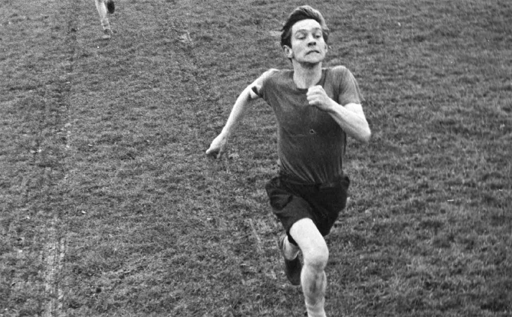
  * 定格亦是“**时间**”最好的隐喻，影像的凝结使一切成为永恒；**亨利·哈撒韦**（Henry Hathaway）在《**大地惊雷**》（True Grit）中以定格将**约翰·韦恩**（John Wayne）纵马射击的样子冻结，造成永久的英雄形象
  * 当然，一切动作的静止也与**死亡概念**有关，例如**乔治·罗伊·希尔**（George Roy Hill）的《**虎豹小霸王**》（Butch Cassidy and the Sundance Kid），两个主角在被乱枪射死之前，画面已经凝结，象征这两人最终的胜利（我们没看到死亡）
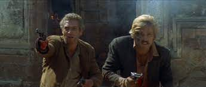
  *《**维里迪安娜**》中著名的定格，是对达·芬奇《**最后的晚餐**》名画的**嘲讽**，是布努埃尔对教会、感伤自由主义和中产阶级**正面攻击**的诸多例子之一；他尖锐的聪明常常令人震惊，也对天主不敬，比如说，此处是一群醉酒狂饮的乞丐在亨德尔的《弥赛亚》一曲中合照，把耶稣和圣徒变成了笑柄，布努埃尔不信教，却老能用宗教开玩笑，他曾感叹：“谢谢老天，我仍是个异教徒！”
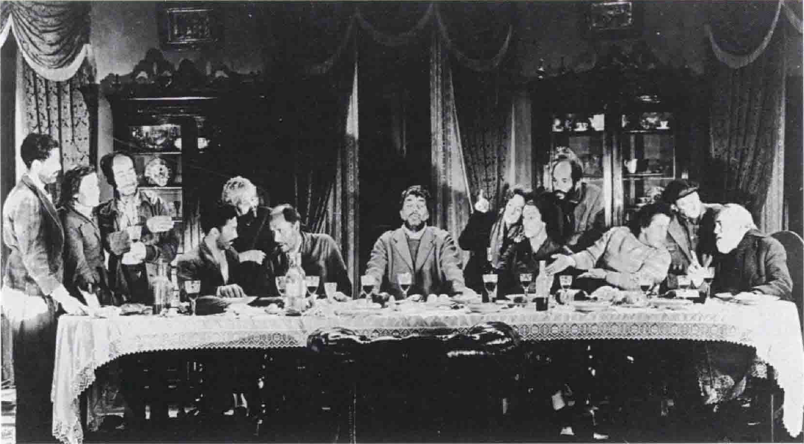
* 大部分的机械扭曲技巧是由**梅里爱**发明，若干年来一直被电影界忽略，直到20世纪50年代**法国新浪潮**才重新肯定它们的价值；自此之后，这些技巧广被运用
* 看电影时，我们应自问下列问题：导演为何在一场戏中移动或不移动镜头？导演让镜头靠近或强调某些动作吗？或是他（她）运用长镜头、高角度或慢节奏来降低动作的重要性？那些动作是自然主义的，还是风格化的？写实或象征？平顺或多变？诗意或混乱的？其中诸如快动作、慢动作、定格和动画等技术运用中，是否暗示什么意义？
  * 电影中的运动不只是指“发生了什么”；导演有许多表达动作的方法，而大师和技匠的分别就在于不只要处理“发生了什么”，还要指出“如何”发生的一如何让动作在戏剧架构中起暗示及共鸣作用？动作之形式如何更有效地使内容具体化？