# 电影即艺术：创意、科技与商业
## 电影的重要性和影响
### 电影在生活中的角色
- 电影在我们的日常生活中**占据重要位置**，难以想象没有电影的世界
- 在**多种场合**（电影院、家庭、办公室、交通工具等）和设备（笔记本电脑、Pod等）上观看电影
- 电影作为一种**媒介**，传达信息和观念，展示不同的世界和生活方式
- 电影通过提供视觉和感官上的**愉悦**，通过**故事情节**吸引观众

### 电影的发展和技术
- 近百年来，电影工作者通过**不断实验**，探索电影的魅力
- 电影通过控制视觉和音效来提供**丰富的观影体验**
- 电影技术的发展，如剪辑等，都是为了**提高观众的体验**

### 电影的起源和艺术价值
- 对电影起源的简单讨论不足以深入理解其艺术价值
- 对**艺术**（art）和**娱乐**（entertainment）的区分常带有价值判断，但实际上两者**并非截然分开**
- 许多被视为艺术的电影元素**源自于大众娱乐电影**
- 电影被认为是**一门艺术**，因为它能够为观众设计有价值的体验，不论其出身

### 电影的商业性和艺术性
- 人们常将电影的**艺术性**（art）和**商业性**（business）对立起来
- 但在现代社会中，艺术与经济是**相互交织**的
- 电影资金可能来自消费者、赞助者或公共资金
- 金钱考虑**不一定会损害**艺术家的创造力或降低电影的价值

### 电影作为艺术的本质
- 不排除电影的娱乐性，也不认为电影艺术必须**超脱商业需求**
- 电影作为一门艺术，提供了**多样的创造性可能性**
- 电影提供观众**有价值的体验**，包括娱乐、刺激、困惑或陶醉

## 《辣手摧花》中的艺术性
### 影片情节与角色描绘
- **查理舅舅**来到加州圣塔罗莎的姐姐家作客
- 查理是一个**见过世面、挥霍无度**的人，深受姐姐**艾米**的崇拜
- **小查莉**（查理的外甥女）开始怀疑查理是**连环杀人犯**，但无法证明

### 查理舅舅的性格揭示
- 查理舅舅在晚餐时表现出**对小镇生活的赞赏**
- 他对城市里的有钱女人表达了**深刻的憎恨**
- 这一场景揭示了查理舅舅**对女性的仇恨**，暗示了他的疯狂和行凶动机

### 观众的情感反应
- 查理舅舅的言论让观众感到**心惊胆战**
- 他将女性贬低为动物的言论**激发了观众的情感反应**

### 电影的形式（form）
- 电影不仅仅是一堆片段，而是**有整体性的组织**
- **形式**是电影的一种模式，使电影成为一个完整的故事组织
- **形式功能**（formal function）在剧本中提供了故事发展的关键节点

### 故事发展与冲突
- 故事基于查理舅舅的拜访和小查莉的发现展开
- 小查莉的角色随着故事的发展而成长，她的世界观发生了改变
- 晚餐场景中的冲突不仅存在于**角色之间**，也存在于**小查莉的内心**

### 场景的重要性
- 晚餐时的场景在故事中具有**特殊的重要性**
- 先前的欢乐场景与查理舅舅的恶毒独白形成**鲜明对比**
- **戒指的细节**进一步加强了故事的紧张氛围和剧情的推进

### 形式在艺术中的运作
- 形式通过与其他层面的结合，创造出观众**对作品的全面体验**
- 形式模式能够激发**观念与情感**，是电影艺术的关键组成部分

### 故事组织与电影媒介的运用
- 考虑电影的**故事组织方式**，即为了创造特定效果而串连各部分的方式
- 思考电影工作者**运用电影媒介的方法**，包括剧情进展、角色发展等
- 电影媒介提供电影工作者形式（form）发展的方法，如小说中文字运用和作曲家使用旋律与节奏

### 希区柯克的导演技巧
- **希区柯克**（Alfred Hitchcock）深信能**通过电影媒介影响观众的情感**
- 查理舅舅**内心独白**时，希区柯克通过**特定的镜头布局**加强情感表达
- 通过镜头的**位置和角度**，展示查理舅舅在家庭中的**优势地位**和其性格特征
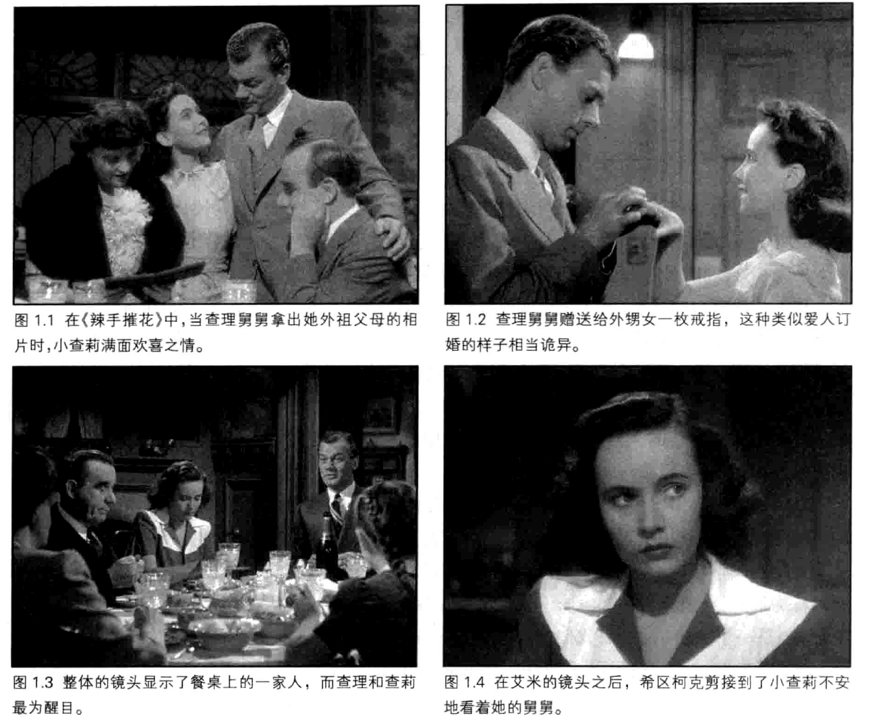

### 演员的表演与镜头运用
- 演员**约瑟大·考登**（Joseph Cotten）的表演对场景的影响力
- 在表达查理舅舅对女性的愤恨时，使用**特写镜头**加强情感表达
- 摄影机向演员推进的方式，象征着**深入角色内心世界**
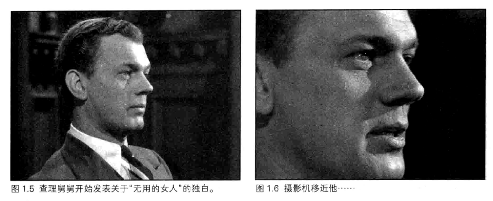

### 镜头选择与情感影响
- 导演选择**不切换镜头**，以保持场景的连续性和情感深度
- 小查莉的爆发**留在银幕外**，通过声音表达，**增加情感冲击力**
- 使用特写镜头，让观众**置身于小查莉的位置**，感受查理舅舅的愤恨
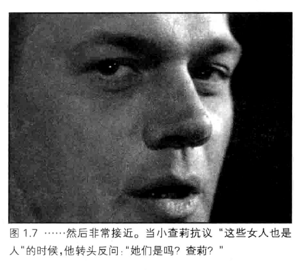

### 电影的风格（style）
- 电影风格的定义，以及希区柯克如何在《辣手摧花》中运用
- 风格与**整部电影的技术选择**息息相关，为故事内容赋予**特殊的力量**
- 风格模式持续到独白过程，视觉观点的变化强化了情感体验

### 故事发展与观众的体验
- 整体故事发展和每个场景风格的结合，增强了**观众与小查莉的紧密联系**
- 电影通过**视觉与听觉操纵**，影响观众的认识、观念和感受
- 电影工作者通过创造**结构性的体验**，影响观众对人生的看法

### 电影艺术的意义
- 电影不仅是题材和主旨的表达，而是通过**形式与风格**，引领观众进入故事
- 电影如何通过**发展模式**，激发观众的**好奇心、悬疑感和惊讶**
- 电影可能**改变观众对世界的看法**，如《辣手摧花》让观众怀疑世界的光明面

## 电影的技术
### 电影制作的两重含义
- 电影制作不仅包括**艺术创作**，还包括**技术和商业层面**
- 电影需要**复杂的技术**，如摄影机、灯光设备、多轨混音录音室和计算机合成特效（computer-generated special effects）
- 制作电影涉及**公司制造设备、资金供应、发行和展示**

### 制造幻象的机器：Illusion Machines
- 电影和电视依赖于**人类视觉系统的特殊性**，创建**连续性动作**的错觉
- 电影是由**一系列的格**（frames）或**静止画面**组成，但我们感受到的是**连续动作**
- **视觉暂留**（persistence of vision）、**临界闪烁融合**（critical flicker fusion）和**似动现象**（apparent motion）是创造电影幻象的关键心理过程
  - **视觉暂留现象**：人类视觉系统可以被欺骗，感受到**连续的动作**而不是静止的画面；这种错觉可能部分是由**视觉暂留现象**造成的，即**影像在视网膜上的短暂停留**
  - **临界闪烁融合**：当光闪得足够快时（约每秒闪50次），眼睛不再感知到闪烁，而是看到**连续的光**
  - **似动现象**：当视觉变化足够快时，人的眼睛会被欺骗，感觉到**动作**
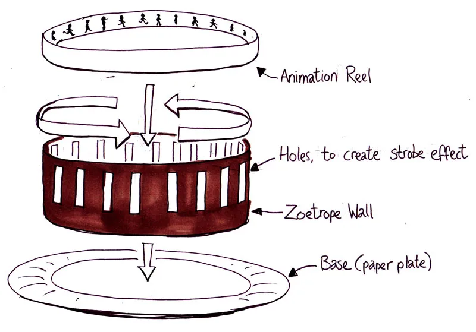

### 电影的拍摄与放映
- **摄影机和放映机**的工作原理
  - **摄影机**（camera）内部的**传动装置**将底片**一格一格**地通过光源，每格底片在**光圈**处暂停感光
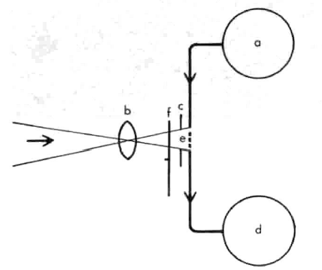
  - **放映机**（projector）的光源位于**机器内部**，通过**电影传动装置**，将影像投射到银幕上
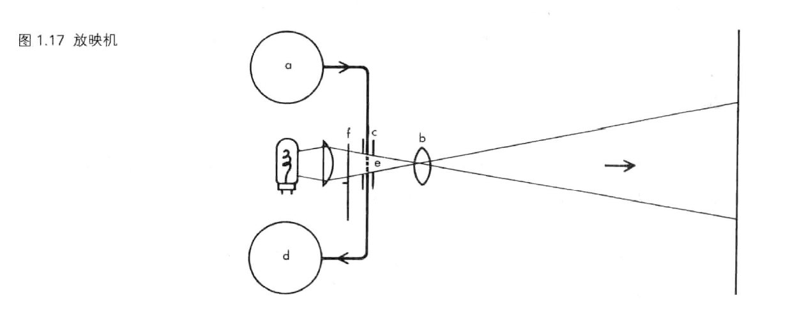
- **底片的处理**
  - 底片经过**特定的化学处理**，从而在**白色底面**上形成**黑色颗粒**，制成**负片**（negative），再进一步制作成**正片拷贝**（positive print）

  - 正片通过“**印片机**”"（printer）来制作，是**不透光的暗箱**，将负片或正片胶卷的影像复印到未曝光的胶片上；这种印片机又被称为**接触式印片机**（contact printer）
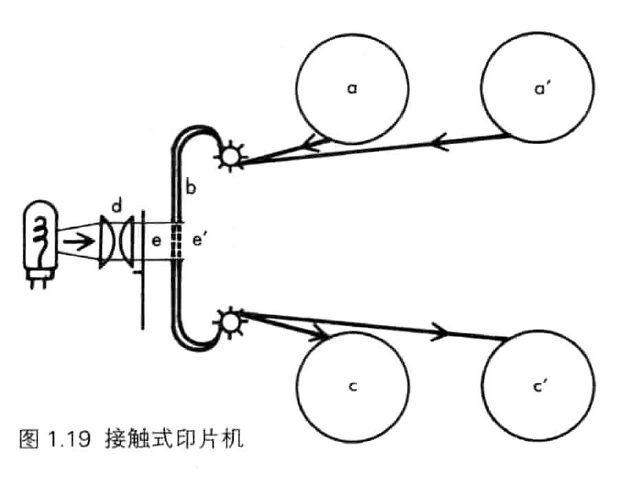
  - 接触式印片机可用于制作**工作拷贝**（work print）、**放映拷贝**（release print），以及各种特殊效果
- 影片的标准拍摄和放映速率通常是**每秒24格**，因此每个画面要投射到银幕上**两次**，减少闪烁感

### 影片底片的特点
- 一部长篇电影的底片是一条**非常长的录影带**，两个小时电影的底片大约有**2英里**（mils）长
- 在大部分的电影院里，放映机以**每分钟90英尺**的速度播放底片
- 大部分的多银幕电影院使用**转盘式放映**（platter projection），电影被卷成长条而输送进放映机
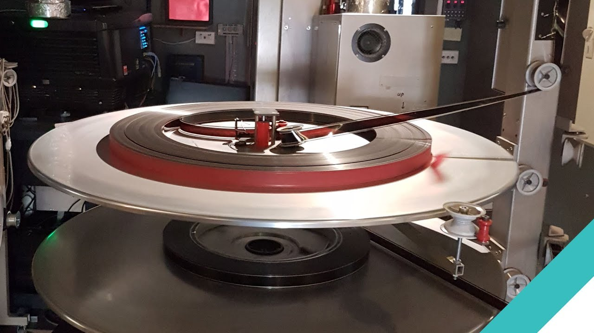
- 电影底片包含**透明的醋酸盐底面**（acetate base）和**覆盖的感光乳剂层**（emulsion）
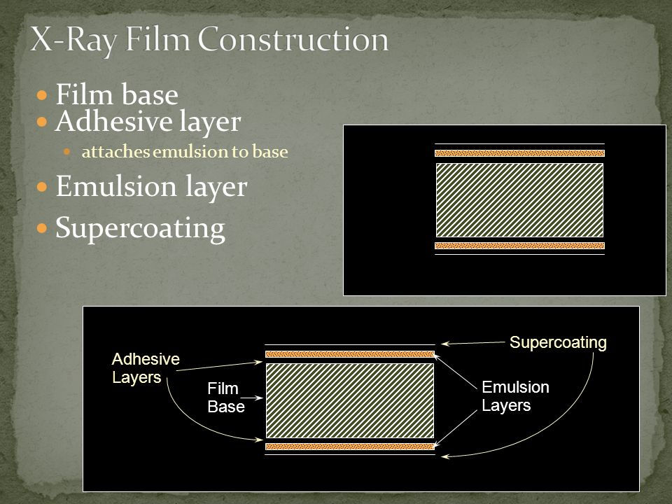
  - 底片的感光乳剂层含有**光敏感物质**
  - 在**黑白底片**上，光照射到**卤化银颗粒**（silver halide）上引发化学反应，形成**潜伏影像**，通过**显影过程**使影像显现
  - 而彩色底片则包含三层感光剂，对应**红、黄、蓝三原色**
  - 彩色底片的感光层对**三原色**敏感，产生**互补色影像**
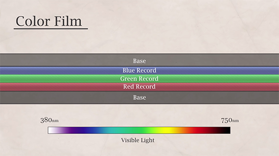
- 底片两边的**穿孔**，使得底片可以顺畅地通过摄影机、印片机与放映机中的**扣片齿轮**（sprockets）

### 电影底片的标准宽度
- **35毫米（35mm）**：这是商业电影中**最常用的规格**；它提供了良好的画质和成本效益，适合**大多数商业放映**
- **16毫米（16mm）**：**相对较小的宽度**，常用于低成本制作、教育和纪录片
- **超8毫米（Super8mm）**：因其**小巧便携和独特的视觉风格**而受到某些艺术家和爱好者的喜爱，主要用于**业余和实验性电影**制作
- **70毫米（70mm）**：提供**极其精细的图像细节**，常用于**大型屏幕和高端制作**，如IMAX电影
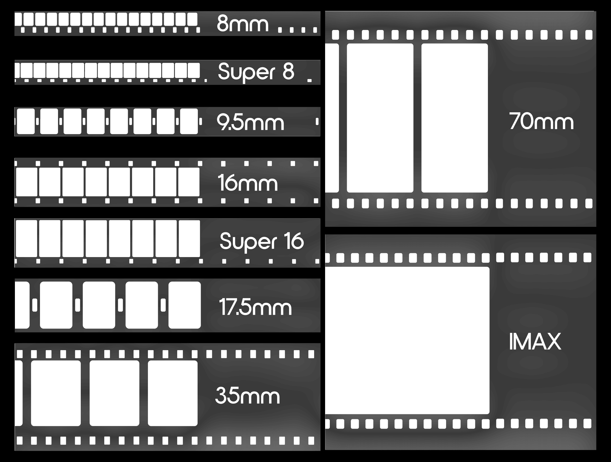

### 底片宽度的重要性
- **影响画质**：底片的宽度直接影响画面的清晰度和细节表现；宽度越大，可以捕捉更多的细节，提供更高的图像质量
- **决定电影的视觉效果**：不同宽度的底片给观众带来不同的视觉体验，如超8毫米底片的**复古感**和70毫米的**宏大场景**
- 不同宽度的底片需要**不同规格的放映机**，底片的宽度也影响**音轨的配置**
- 最初的电影底片宽度不统一，后来逐渐**标准化为35mm**，成为**商业电影的主流**
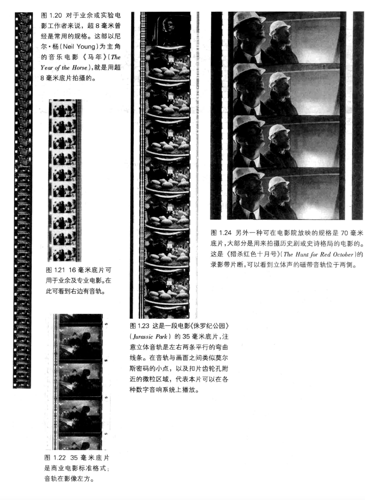

### 电影音轨的不同类型
- 音轨可以是**磁带音轨或光学音轨**
  - **磁带音轨**：早期电影使用的音轨形式，**磁带**沿底片边缘，通过**磁头**发出声音，目前在现代电影中**已基本被淘汰**
  - **光学音轨**：声音信息编码为**明暗区块**，随电影一起播放；声音波形被转换为**可见的光学模式**，再通过放映时转换回声音
    - 16毫米的光学音轨在**右侧**，而35毫米底片的光学音轨在**左侧**
    - 在16毫米与35毫米中，声音都沿着画面带而被编码在黑白波形的“**变量区**”（variable-area）
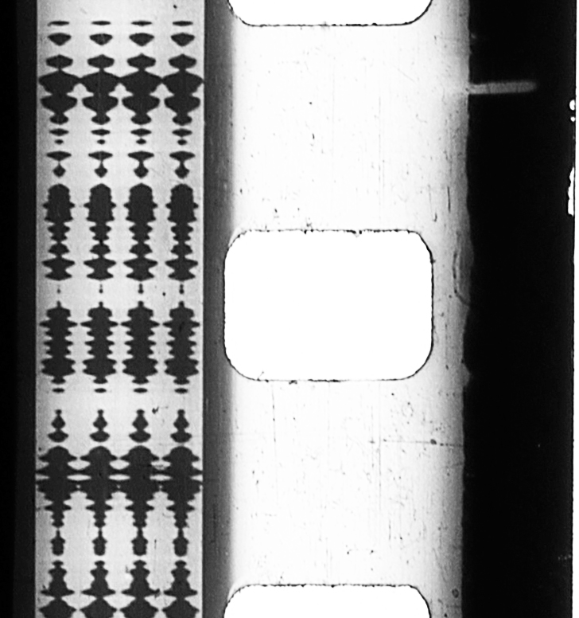
- 录影带上的音轨可能是**单声道**（monophonic）或**立体声**（stereophonic）
  - 16毫米与35毫米录影带都是**单声道光学音轨**
  - 立体声的音轨则是记录在底片左边的**一对弯曲线条**
  - 而**数字声音**则记录在底片穿孔旁边的**点划带状区域**，放映机以类似**读取条形码**的方式扫描这些记号
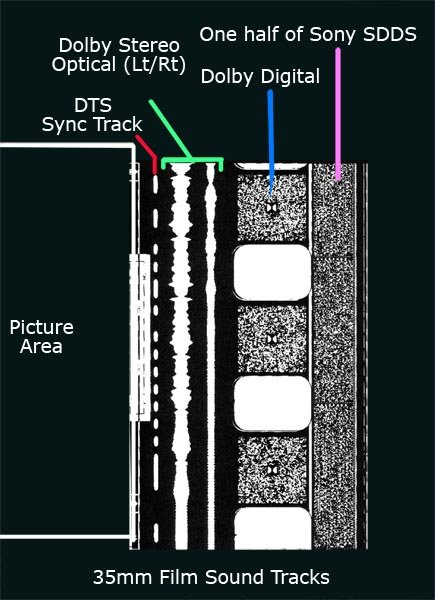

### 电影技术的艺术性
- 电影艺术依赖于电影工作者如何选择使用科技提供的工具和材料
- 电影的记忆和情感体验源于一系列**静态的穿孔赛璐珞长条**（celluloid）
- 电影工作者的创造力体现在他们如何运用这些具象的材料和机器创造艺术作品