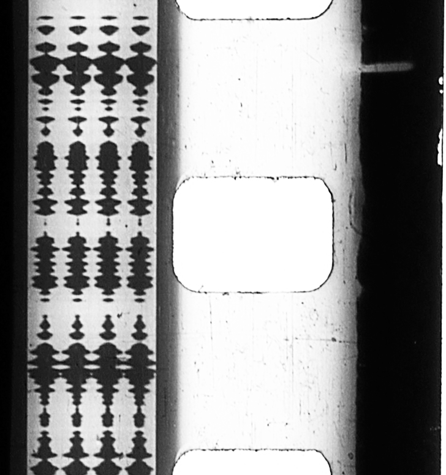
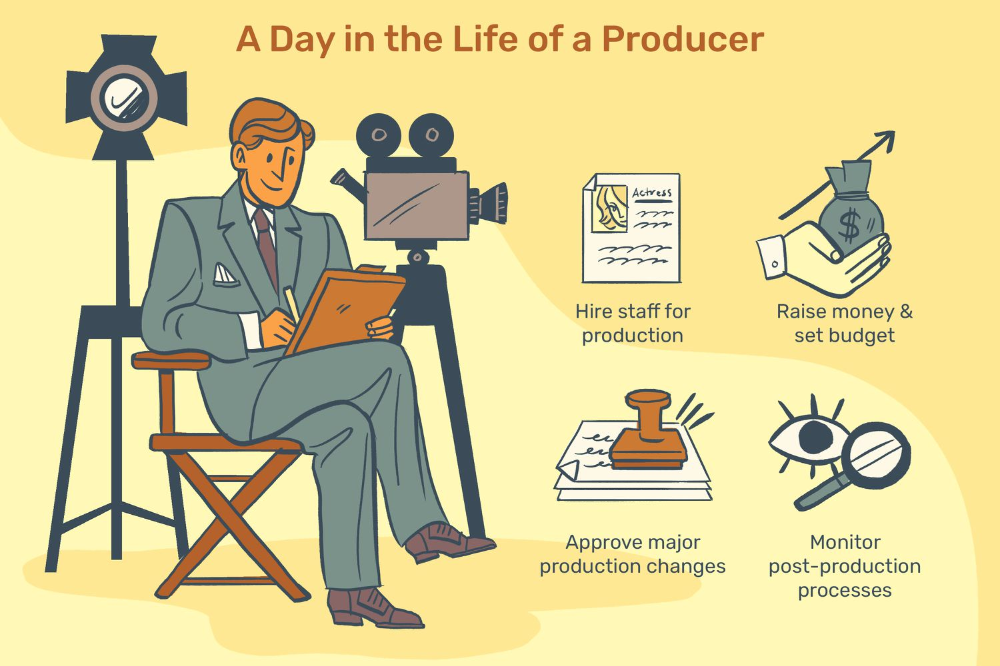
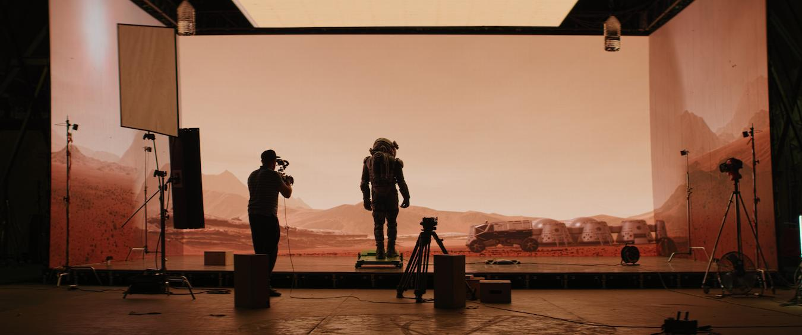
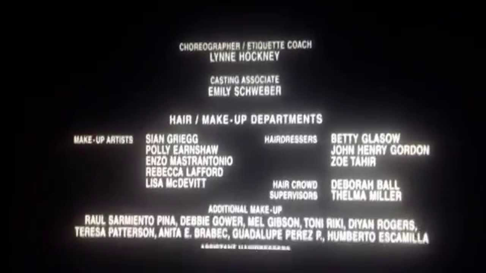
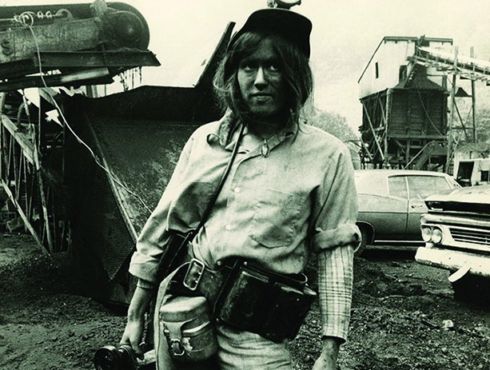
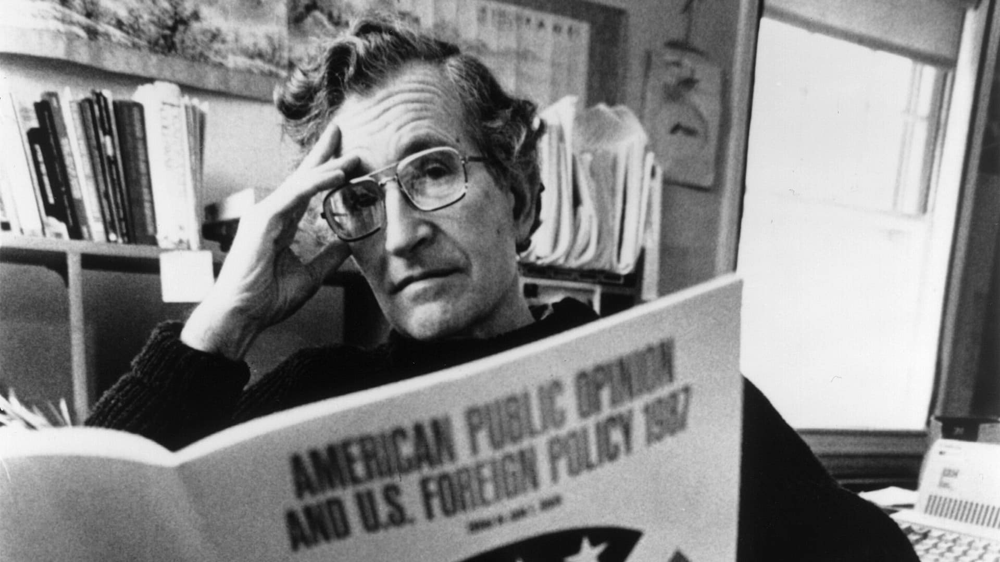
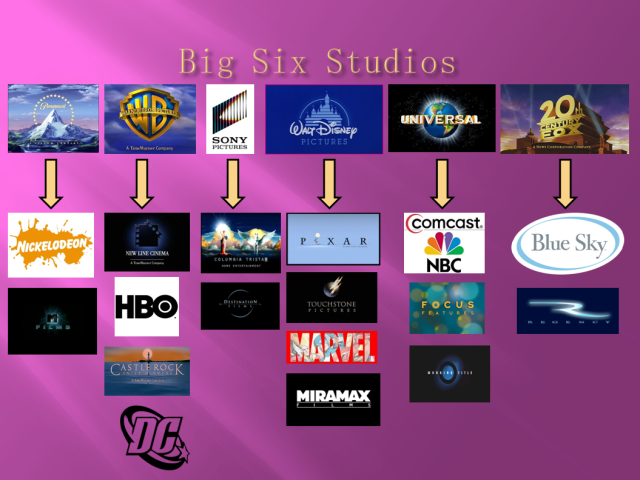
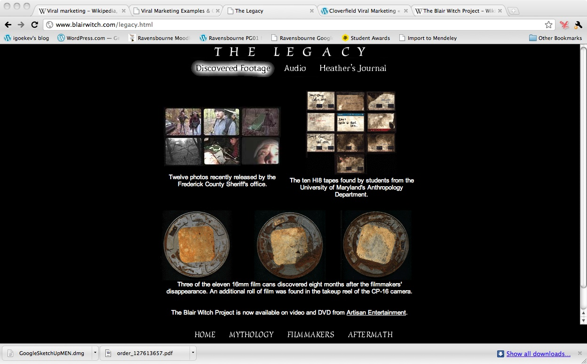
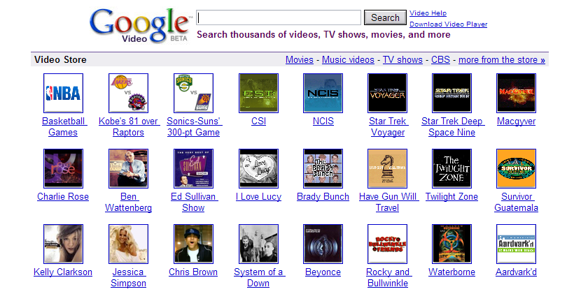
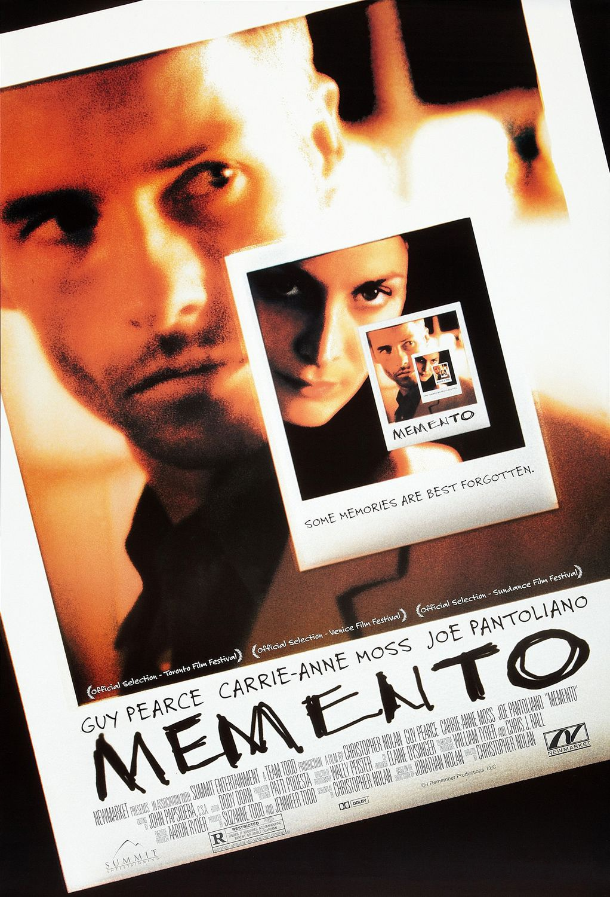

[TOC]
# 电影即艺术：创意、科技与商业
## 电影的重要性和影响
### 电影在生活中的角色
- 电影在我们的日常生活中**占据重要位置**，难以想象没有电影的世界
- 在**多种场合**（电影院、家庭、办公室、交通工具等）和设备（笔记本电脑、Pod等）上观看电影
- 电影作为一种**媒介**，传达信息和观念，展示不同的世界和生活方式
- 电影通过提供视觉和感官上的**愉悦**，通过**故事情节**吸引观众

### 电影的发展和技术
- 近百年来，电影工作者通过**不断实验**，探索电影的魅力
- 电影通过控制视觉和音效来提供**丰富的观影体验**
- 电影技术的发展，如剪辑等，都是为了**提高观众的体验**

### 电影的起源和艺术价值
- 对电影起源的简单讨论不足以深入理解其艺术价值
- 对**艺术**（art）和**娱乐**（entertainment）的区分常带有价值判断，但实际上两者**并非截然分开**
- 许多被视为艺术的电影元素**源自于大众娱乐电影**
- 电影被认为是**一门艺术**，因为它能够为观众设计有价值的体验，不论其出身

### 电影的商业性和艺术性
- 人们常将电影的**艺术性**（art）和**商业性**（business）对立起来
- 但在现代社会中，艺术与经济是**相互交织**的
- 电影资金可能来自消费者、赞助者或公共资金
- 金钱考虑**不一定会损害**艺术家的创造力或降低电影的价值

### 电影作为艺术的本质
- 不排除电影的娱乐性，也不认为电影艺术必须**超脱商业需求**
- 电影作为一门艺术，提供了**多样的创造性可能性**
- 电影提供观众**有价值的体验**，包括娱乐、刺激、困惑或陶醉

## 《辣手摧花》中的艺术性
### 影片情节与角色描绘
- **查理舅舅**来到加州圣塔罗莎的姐姐家作客
- 查理是一个**见过世面、挥霍无度**的人，深受姐姐**艾米**的崇拜
- **小查莉**（查理的外甥女）开始怀疑查理是**连环杀人犯**，但无法证明

### 查理舅舅的性格揭示
- 查理舅舅在晚餐时表现出**对小镇生活的赞赏**
- 他对城市里的有钱女人表达了**深刻的憎恨**
- 这一场景揭示了查理舅舅**对女性的仇恨**，暗示了他的疯狂和行凶动机

### 观众的情感反应
- 查理舅舅的言论让观众感到**心惊胆战**
- 他将女性贬低为动物的言论**激发了观众的情感反应**

### 电影的形式（form）
- 电影不仅仅是一堆片段，而是**有整体性的组织**
- **形式**是电影的一种模式，使电影成为一个完整的故事组织
- **形式功能**（formal function）在剧本中提供了故事发展的关键节点

### 故事发展与冲突
- 故事基于查理舅舅的拜访和小查莉的发现展开
- 小查莉的角色随着故事的发展而成长，她的世界观发生了改变
- 晚餐场景中的冲突不仅存在于**角色之间**，也存在于**小查莉的内心**

### 场景的重要性
- 晚餐时的场景在故事中具有**特殊的重要性**
- 先前的欢乐场景与查理舅舅的恶毒独白形成**鲜明对比**
- **戒指的细节**进一步加强了故事的紧张氛围和剧情的推进

### 形式在艺术中的运作
- 形式通过与其他层面的结合，创造出观众**对作品的全面体验**
- 形式模式能够激发**观念与情感**，是电影艺术的关键组成部分

### 故事组织与电影媒介的运用
- 考虑电影的**故事组织方式**，即为了创造特定效果而串连各部分的方式
- 思考电影工作者**运用电影媒介的方法**，包括剧情进展、角色发展等
- 电影媒介提供电影工作者形式（form）发展的方法，如小说中文字运用和作曲家使用旋律与节奏

### 希区柯克的导演技巧
- **希区柯克**（Alfred Hitchcock）深信能**通过电影媒介影响观众的情感**
- 查理舅舅**内心独白**时，希区柯克通过**特定的镜头布局**加强情感表达
- 通过镜头的**位置和角度**，展示查理舅舅在家庭中的**优势地位**和其性格特征

### 演员的表演与镜头运用
- 演员**约瑟大·考登**（Joseph Cotten）的表演对场景的影响力
- 在表达查理舅舅对女性的愤恨时，使用**特写镜头**加强情感表达
- 摄影机向演员推进的方式，象征着**深入角色内心世界**

### 镜头选择与情感影响
- 导演选择**不切换镜头**，以保持场景的连续性和情感深度
- 小查莉的爆发**留在银幕外**，通过声音表达，**增加情感冲击力**
- 使用特写镜头，让观众**置身于小查莉的位置**，感受查理舅舅的愤恨

### 电影的风格（style）
- 电影风格的定义，以及希区柯克如何在《辣手摧花》中运用
- 风格与**整部电影的技术选择**息息相关，为故事内容赋予**特殊的力量**
- 风格模式持续到独白过程，视觉观点的变化强化了情感体验

### 故事发展与观众的体验
- 整体故事发展和每个场景风格的结合，增强了**观众与小查莉的紧密联系**
- 电影通过**视觉与听觉操纵**，影响观众的认识、观念和感受
- 电影工作者通过创造**结构性的体验**，影响观众对人生的看法

### 电影艺术的意义
- 电影不仅是题材和主旨的表达，而是通过**形式与风格**，引领观众进入故事
- 电影如何通过**发展模式**，激发观众的**好奇心、悬疑感和惊讶**
- 电影可能**改变观众对世界的看法**，如《辣手摧花》让观众怀疑世界的光明面

## 电影的技术
### 电影制作的两重含义
- 电影制作不仅包括**艺术创作**，还包括**技术和商业层面**
- 电影需要**复杂的技术**，如摄影机、灯光设备、多轨混音录音室和计算机合成特效（computer-generated special effects）
- 制作电影涉及**公司制造设备、资金供应、发行和展示**

### 制造幻象的机器
- 电影和电视依赖于**人类视觉系统的特殊性**，创建**连续性动作**的错觉
- 电影是由**一系列的格**（frames）或**静止画面**组成，但我们感受到的是**连续动作**
- **视觉暂留**（persistence of vision）、**临界闪烁融合**（critical flicker fusion）和**似动现象**（apparent motion）是创造电影幻象的关键心理过程
  - **视觉暂留现象**：人类视觉系统可以被欺骗，感受到**连续的动作**而不是静止的画面；这种错觉可能部分是由**视觉暂留现象**造成的，即**影像在视网膜上的短暂停留**
  - **临界闪烁融合**：当光闪得足够快时（约每秒闪50次），眼睛不再感知到闪烁，而是看到**连续的光**
  - **似动现象**：当视觉变化足够快时，人的眼睛会被欺骗，感觉到**动作**

### 电影的拍摄与放映
- **摄影机和放映机**的工作原理
  - **摄影机**（camera）内部的**传动装置**将底片**一格一格**地通过光源，每格底片在**光圈**处暂停感光

  - **放映机**（projector）的光源位于**机器内部**，通过**电影传动装置**，将影像投射到银幕上

- **底片的处理**
  - 底片经过**特定的化学处理**，从而在**白色底面**上形成**黑色颗粒**，制成**负片**（negative），再进一步制作成**正片拷贝**（positive print）

  - 正片通过“**印片机**”"（printer）来制作，是**不透光的暗箱**，将负片或正片胶卷的影像复印到未曝光的胶片上；这种印片机又被称为**接触式印片机**（contact printer）

  - 接触式印片机可用于制作**工作拷贝**（work print）、**放映拷贝**（release print），以及各种特殊效果
- 影片的标准拍摄和放映速率通常是**每秒24格**，因此每个画面要投射到银幕上**两次**，减少闪烁感

### 影片底片的特点
- 一部长篇电影的底片是一条**非常长的录影带**，两个小时电影的底片大约有**2英里**（mils）长
- 在大部分的电影院里，放映机以**每分钟90英尺**的速度播放底片
- 大部分的多银幕电影院使用**转盘式放映**（platter projection），电影被卷成长条而输送进放映机

- 电影底片包含**透明的醋酸盐底面**（acetate base）和**覆盖的感光乳剂层**（emulsion）

  - 底片的感光乳剂层含有**光敏感物质**
  - 在**黑白底片**上，光照射到**卤化银颗粒**（silver halide）上引发化学反应，形成**潜伏影像**，通过**显影过程**使影像显现
  - 而彩色底片则包含三层感光剂，对应**红、黄、蓝三原色**
  - 彩色底片的感光层对**三原色**敏感，产生**互补色影像**

- 底片两边的**穿孔**，使得底片可以顺畅地通过摄影机、印片机与放映机中的**扣片齿轮**（sprockets）

### 电影底片的标准宽度
- **35毫米（35mm）**：这是商业电影中**最常用的规格**；它提供了良好的画质和成本效益，适合**大多数商业放映**
- **16毫米（16mm）**：**相对较小的宽度**，常用于低成本制作、教育和纪录片
- **超8毫米（Super8mm）**：因其**小巧便携和独特的视觉风格**而受到某些艺术家和爱好者的喜爱，主要用于**业余和实验性电影**制作
- **70毫米（70mm）**：提供**极其精细的图像细节**，常用于**大型屏幕和高端制作**，如IMAX电影

### 底片宽度的重要性
- **影响画质**：底片的宽度直接影响画面的清晰度和细节表现；宽度越大，可以捕捉更多的细节，提供更高的图像质量
- **决定电影的视觉效果**：不同宽度的底片给观众带来不同的视觉体验，如超8毫米底片的**复古感**和70毫米的**宏大场景**
- 不同宽度的底片需要**不同规格的放映机**，底片的宽度也影响**音轨的配置**
- 最初的电影底片宽度不统一，后来逐渐**标准化为35mm**，成为**商业电影的主流**

### 电影音轨的不同类型
- 音轨可以是**磁带音轨或光学音轨**
  - **磁带音轨**：早期电影使用的音轨形式，**磁带**沿底片边缘，通过**磁头**发出声音，目前在现代电影中**已基本被淘汰**
  - **光学音轨**：声音信息编码为**明暗区块**，随电影一起播放；声音波形被转换为**可见的光学模式**，再通过放映时转换回声音
    - 16毫米的光学音轨在**右侧**，而35毫米底片的光学音轨在**左侧**
    - 在16毫米与35毫米中，声音都沿着画面带而被编码在黑白波形的“**变量区**”（variable-area）

- 录影带上的音轨可能是**单声道**（monophonic）或**立体声**（stereophonic）
  - 16毫米与35毫米录影带都是**单声道光学音轨**
  - 立体声的音轨则是记录在底片左边的**一对弯曲线条**
  - 而**数字声音**则记录在底片穿孔旁边的**点划带状区域**，放映机以类似**读取条形码**的方式扫描这些记号

### 电影技术的艺术性
- 电影艺术依赖于电影工作者如何选择使用科技提供的工具和材料
- 电影的记忆和情感体验源于一系列**静态的穿孔赛璐珞长条**（celluloid）
- 电影工作者的创造力体现在他们如何运用这些具象的材料和机器创造艺术作品

## 拍片：电影制作
#### 电影制作的社会与技术层面
- 电影既是一种**技术**，也是**社会制度**的一部分
- **家庭电影与公众电影**展示了电影在社会中的不同角色

#### 电影制作的基本阶段
1. **编剧与集资（scriptwriting and funding）**
   - 电影观念的开发和剧本的完成
   - 获得财务支持，为拍摄计划筹集资金
2. **拍片准备（preparation for filming）**
   - 在脚本完成和部分资金到位后，开始规划实体生产过程
3. **拍摄（shooting）**
   - 影像与声音的创造
4. **组合（assembly）**
   - 影像与声音的最终组合，包括剪辑、特效、音乐和额外对白，以及加上标题

#### 制作阶段的重叠与修改
- 制作阶段可能**相互重叠**，如在拍摄和组合过程中仍需筹集资金
- 每个阶段可能会对前一阶段进行**修改**，如剧本、拍摄素材和剪辑过程的调整
- 法国导演**罗伯特·布烈松**（Robert Bresson）的电影制作观点：电影在剧本、拍摄和剪辑时获得三次生命

#### 电影制作中的分工
- 大多数商业电影涉及**多种专业分工**和**数百名专业人员**
- 大预算电影有**精密的人力分工**，小制作电影可能需要个人身兼多职
- 导演在小制作电影中可能需要同时担任**编剧、录音师和其他角色**

#### 个人电影项目的例子
- **乔纳森·卡奥伊特**（Jonathan Caouette）在制作《**诅咒**》（Tarnation）的过程
- 卡奥伊特自行搜集素材、拍摄新场景、剪辑和混音，几乎**独自完成电影的所有制作阶段**

### 编剧与集资阶段
#### 制片与编剧的角色
- **制片**（producer）负责**财务和组织工作**，可能独立工作或任职于电影发行商
- **编剧**（screenwriter）负责**准备剧本**（screenplay）或**脚本**（script）

#### 制片的工作内容
- 照顾拍片计划、筹募资金、安排人事
- 拍摄及剪辑期间，作为**编导与出资者**之间的桥梁
- 完成后安排**发行、宣传、营销**及监督**制片成本回收**

#### 制片的分工
- **执行制片**（executive producer）负责安排财务与版权洽谈
- **在线制片**（line producer）监管导演、演员与剧组的日常工作
- **助理制片**（associate producer）负责协调冲印厂或技术人员

#### 编剧的任务
- 将剧本委托**经纪人**交给制片公司或**直接与制片会面**提供剧本点子
- 可能由制片提出点子，雇用编剧开发剧本

#### 剧本的发展过程
- 经历大致交代主要情节的**大纲**（treatment）、一份或多份完整脚本，以及最后的**拍摄脚本**（shooting script）

- 大幅改写**是常见现象**，作者可能半途退出
- 剧本修改示例：《辣手摧花》的晚餐场景

#### 财务筹集与预算准备
- 制片寻找资金，同时寻找导演及明星
- 准备预算，包括**在线成本**（above-the-line cost）和**线下成本**（below-the-line cost）
- 计算**负片成本**（negative cost），即制作电影负片的总成本

#### 纪录片的特殊情况
- 纪录片**难以事先编写完整脚本**，通常有**剧情摘要或大纲**
- **集锦纪录片**（compilation documentary）通常为**旁白内容**准备重点大纲

### 准备阶段
#### 前期制作的开始
- 当资金准备就绪，脚本初步完成，即将开拍，开始**前期制作**（preproduction）
- **导演**在这阶段扮演**核心角色**，整合所有工作人员创造电影

#### 制片与导演的协作
- 制片与导演组成**制片办公室**（Production office），负责雇用剧组、选角及勘探拍片地点
- 制片安排**拍摄日程**（Shooting schedule），通常按最方便制作的次序拍摄，最后按剧情次序组合
- 制片与导演协调剧本作者、选角总监、场景组、制作设计组等
- 制作设计总监负责场景的视觉设计，绘制草图规划建筑与色调

#### 拍摄地点与日程安排
- 选择**同一地点**的所有场景**一次拍完**，如《侏罗纪公园》的夏威夷拍摄
- 考虑**演员时间安排**及**复杂场景**的拍摄优先级，如《愤怒的公牛》的拳赛段落先拍

#### 分镜表与预视化
- **分镜表**（storyboard）由**绘图师**制作，类似**漫画**，提示服装、灯光、摄影机运动

- **动态脚本**（animatics）将分镜影像以**拍摄剪辑方式**制作，配上**音效**

- **预视化**（previsualization；previz）用**三维动画**呈现分镜表，常用于复杂动作场景或特效规划

#### 计算机绘图的应用
- **计算机软件**创造接近电影效果的布景与角色，添加**质地与明暗阴影**
- **预视化动态脚本**协助导演在场景布景、摄影机运动及段落计时上进行测试
- 例如，《星球大战3：西斯的复仇》（Star Wars Episode III-Revenge of the Sith）中的预视化应用

### 拍摄阶段
#### 拍摄阶段的定义
- 在好莱坞，**拍摄阶段**（shooting phase）特指**主要剧情的拍摄**，即**主摄影**（principal photography）

#### 导演组的工作人员
- **场记**（script supervisor）：负责每一镜头的连续性细节

- **第一助导**（first assistant director，AD）：与导演计划每日拍摄进度

- **第二助导**（second assistant director）：负责协调工作
- **第三助导**（third assistant director）：负责传达工作
- **对白员**（dialogue coach）：为演员提词或扮演不在镜头内角色
- **第二组导演**（second unit director）：负责特技动作、外景镜头拍摄

#### 演员组的组成
- **演员**（cast）包括**明星**、**配角**（supporting players）、**次要演员**（minor players）、**临时演员**（extras）
- **导演**指导演员表演，**第一助导**负责与临时演员沟通

#### 专业角色与摄影组
- **特技演员**（stunt artist）由**特技教练**（stunt coordinator）指导
- **摄影师**（cinematographer，DP）负责摄影、灯光及掌镜

- **摄影机操作员**（camera operator）负责开机、换片、对焦等工作
- **灯光师**（gaffer）监督灯光位置与架设

#### 音效组的工作
- **录音师**（production recordist，sound mixer）负责对话录音
- **麦克风操作员**（boom operator）操控吊杆式麦克风

- **声效控制员**（third man）负责安置其他麦克风

#### 视觉特效组与总务组
- **视觉特效总监**（visual-effects supervisor）负责特效制作

- **总务组**（miscellaneous unit）包括化妆师、服装师、发型师等
- **制片会计**（production accountant）监督开销，**制片秘书**（production secretary）协调联络

#### 拍摄过程的细节
- 导演拍摄**主镜头**（master shot）记录全部动作与对话
- **衔接镜头**（coverage）包括近距离特写或不同角度拍摄
- 使用**多架摄影机**拍摄，特别是对于动作戏

#### 拍板的作用
- 由于场景拍摄**很少依照剧情次序**进行，导演与剧组人员必须设法记录每一次拍摄的镜头
- 当摄影机开动，摄影组工作人员会拿出一个写有片名、场景、镜头与镜次的**拍板**（slate）放在镜头前
- 在拍板上方有一个**活动杆**，用来拍打发出响声，在组合剪辑阶段，录音师便借着这个拍打声使音轨与录影带**同步**
- **电子拍板**则可以自动记录每一个镜头，并提供数字数据

#### 特效制作的规划
- 演员在**蓝色或绿色背景**前表演，合成到计算机设计场景中
- 导演告知演员**将来画面中会添加的素材**，以便配合演出

### 组合阶段
#### 后期制作概述
- **后期制作**（postproduction）通常在**拍摄过程中**就已经开始
- 常用语“**在后制时搞定它**（fix it in post）”表示制作过程中的问题将在此阶段解决

#### 剪辑师的角色
- **剪辑师**（editor，也称剪辑指导）负责**分类及组合**拍摄出来的各个镜头
- 剪辑师与**导演**合作，讨论如何剪辑以达到最佳创意效果

#### 剪辑过程的复杂性
- 剪辑**工作量巨大**，因为每个镜头有多个版本且非按剧情次序拍摄
- 剪辑师先从冲印厂获取**毛片**（dailies），然后进行**影像与声音同步及分场**

#### 剪辑的不同阶段
- **粗剪**（rough cut）是按顺序串连镜头的初步版本
- **定剪**（fine cut）是与导演沟通后的最终剪辑版本
- **剪余片**（outtakes）是未使用的镜头

#### 电子化剪辑的应用
- 大多数商业片使用**电子化剪辑系统**，提高剪辑速度
- 剪辑师在计算机数据库中直接**标注每个镜头**，实现**非线性剪辑**（nonlinear system）

#### 声音剪辑的步骤
- **声音剪辑师**（sound editor）开始**建立音轨**，包括对话、音乐或声音特效
- 对白通常在**后制阶段重录**，使用**同步对嘴录音**（ADR）程序
- **音效剪辑师**制作或添加声音效果，利用声音数据库或自制声音

#### 音效剪辑的技术
- 声音剪辑利用**数字技术**进行修改，如频率、音调、回响等
- 使用**点击式磁道**（click track）协助录制乐谱

#### 混音与音轨合成
- 导演、剪辑师与声音剪辑师将不同音轨合成为一个**元音轨**（master track）
- 混音过程中进行**均质化、过滤**等调整

#### 冲印与特效工作
- 从**摄影机负片**制作**中间正片**，再制成**中间负片**用于最终拷贝的来源
- **数字中间片**技术允许轻易校正颜色、消除刮痕，并添加特效
- 中间负片与元音轨进行**同步**，制作完成的**A拷贝**（answer print）获得认可后用于制作**放映拷贝**（release print）
- 准备**不同版本的电影**，如飞机或电视放映版本，导演版或加长版DVD

### 制作过程的艺术影响
#### 制作过程中的限制
- 每部电影都受**时间、金钱与机会**的限制，尤其是在拍片这一艺术种类中
- 即使是**高预算的好莱坞电影**，也会受到多种限制

#### 创意与限制的平衡
- 电影制作是在**各种限制下的妥协产物**
- 知道这一点有助于更好地欣赏电影
- 例子：《**双子的天空**》（Twin Falls Idaho）原本计划拍摄多国，但最终因预算限制调整剧情

#### 限制对编剧阶段的影响
- **强势导演的介入**可能导致编剧阶段电影被重新塑造
- 例子：《**证人**》（Witness）中导演彼得·威尔（Peter Weir）调整剧本以强调悬疑元素

#### 对制作限制的反抗与创新
- 某些电影工作者试图**突破限制**，如《**公民凯恩**》在许多方面的创新性
- 创新仍需接受**片厂成规与当时科技**的限制

#### 制作决定对电影的影响
- 电影工作者**在制作过程中的选择**创造出**电影的形式与风格**
- 例子：希区柯克在《**辣手摧花**》中的创意选择展示了其技巧
- 研究电影艺术时，**了解制作过程**有助于理解影像与声音的可能性

## 电影制作模式
### 大型制作
#### 片厂制片的特征
- **片厂**（studio filmmaking）是**专门生产电影的公司**，如派拉蒙、华纳、哥伦比亚
- 拥有**器材、摄影棚**，并与工作人员签订**长期合约**
- 管理中心决定**拍摄计划**，组织演员与剧组

#### 制作流程的书面化
- **制作过程**包括剧本版本记录、拍摄数据、剪辑组合阶段的镜头数据及音乐、混音提示清单等
- 大多数**书面记录**现在由**计算机**完成

#### 电影制作的特点
- 与生产汽车或电视机相比，电影制作**更具创意、合作更密切**
- 每部影片是**独特的产品**，非基本复制品
- 专业工作人员遵循管理蓝图**合作生产**独特产品

#### 中央管理制片系统的变化
- 黄金时代的片厂制作模式已几乎绝迹，转型为**发行商**
- 现代电影项目**独立进行**，导演、演员、工作人员为每部电影**临时组合**
- 片厂可能只提供**基础设施**，其他需求由外部公司提供

#### 制作过程的复杂性增加
- 近年来由于预算增加和计算机特效的使用，拍片过程比以往**更加复杂**
- 例如，《**泰坦尼克号**》（Titanic）片尾字幕中列出了**超过1，400名工作人员**

### 剥削劳动力及独立制片
#### 片厂式分工与剥削电影
- 片厂式分工的电影不仅限于大预算电影，也包括**低成本剥削劳动力电影**（low-budget exploitation）
- **卓玛电影公司**（Troma Films）拍摄低成本恐怖片或性喜剧片，如《**毒戒复仇**》（The Toxic Avenger）

#### 剥削电影的工作方式
- 在剥削劳动力电影中，工作人员通常**身兼数职**
- 例子：**罗伯特·罗德里格兹**（Robert Rodriquez）的《**杀手悲歌**》（El Mariachi）由导演一人承担多重角色

#### 独立制片的特点
- **独立电影**（independent）主要目标是**电影院上映**，但无大发行商资金支持
- 导演、演员、工作人员通常为每部电影**临时组合**
- 例子：**大卫·林奇**（David Lynch）的《**史崔特先生的故事**》（The Straight Story）由法英电视投资，迪斯尼买下发行权

#### 独立制片者的创作自由
- 独立制片者因**小规模资金**而获得**更大的创作自由**
- 例子：**伍迪·艾伦**（Woody Allen）在初剪后可大幅改写剧本并重拍

#### 独立制片的挑战
- 独立制片面临**筹措资金及找发行商的挑战**
- 例子：**吉姆·贾木许**（Jim Jarmusch）的《**天堂陌影**》（Stranger Than Paradise），**凯文·史密斯**（Kevin Smith）的《**疯狂店员**》（Clerks）
- 成本低廉，题材可个人化或富争议性

#### 分工模式与制片阶段
- 不论成本高低，电影制作依赖于**基本的分工模式及制片阶段**

### 小规模制片
#### 单人担任多重角色
- **一人担任多种角色**：计划、投资、表演、操作摄影机、录音及剪辑配音
- 主要见于**实验电影和纪录片**领域

#### 斯坦·布拉哈格的个人化电影
- **斯坦·布拉哈格**（Stan Brakhage）以个人化方式制作**超过150部作品**
- 作品如《**水窗中的颤动婴儿**》（Window Water Baby Moving）展示家庭生活的诗意写真
- 其他作品探讨自然、战争与死亡等主题

#### 小规模制片的特点
- 常用**16毫米底片**拍摄，**资金来源多样**，如自费、补助或亲友资助
- 分工**极少**，电影工作者负责多数工作，偶有技术人员或演员协助
- 所有创意决定取决于**导演个人**

#### 玛雅·德伦的《午后的罗网》
- 导演**玛雅·德伦**（Maya Deren）自编、自导、自演、自剪辑
- 由她丈夫**亚历山大·哈密德**（Alexander Hammid）掌镜

#### 纪录片中的小规模制片
- 法国人类学家**让·鲁什**（Jean Rouch）自导、自演、自拍
- 《**疯狂的灵媒**》（Les Maitres fous）是其著名作品，探讨非洲加纳人的信仰仪式
- **芭芭拉·卡普**（Barbara Kopple）的《**美国哈兰郡**》记录肯塔基矿工工会抗争，她身兼多职

#### 联合制片的例子
- 加拿大电影《**冰原快跑人**》（Atanarjuat: The Fast Runner）由多人小组合作制作
- **集体参与**制片，包括当地人参与，学习**传统工艺技术**
- 展现**数字影片**的力量，赢得2002年**戛纳电影节最佳电影奖**

#### 数字电影的兴起
- **数字电影技术**使小规模制片更受瞩目
- 作品如《**拾穗者**》（The Gleaners and I）、《**大企业**》（The Corporation）、《**好好先生**》（Yes Man）在电影院市场获得成功

### 不同制作形态的启示
#### 纪录片与剧情片的区别
- **纪录片**：导演**控制力有限**，重点在**捕捉现实**，如《**制造共识：乔姆斯基谈媒体**》（Manufacturing Consent: Noam Chomsky and the Media）
- **剧情片**：拥有对剧本及制作过程的**完全控制权**

#### 集锦片与动画片的特点
- **集锦片**（Compilation Film）：利用**现有影像与声音**，如《**噩梦的力量**》（The Power of Nightmares）探讨政治与宗教原教旨主义
- **动画片**（Animated Film）：**一格格制作**，如《**酷狗宝贝**》（Wallace and Gromit）系列，现多数直接**在计算机上制作**

#### 生产与作者
- **个人制片**：**单一导演**即为作者，例如**斯坦·布拉哈格**（Stan Brakhage）
- **集体制作**：**整个团队**作为作者，如《**冰原快跑人**》（Atanarjuat: The Fast Runner）
- **大规模制片**：**难以明确**作者身份，通常认为**导演**是主要“作者”

#### 片厂制片的作者问题
- **制片与编剧**：尽管**起初定义项目方向**，但在拍摄及剪辑过程中**影响减少**
- **导演的角色**：通常对影片视听效果有**最终决定权**，是最接近“作者”的角色
- **专业人员的个人风格**：如摄影师、布景设计师等在作品中留下**独特标记**

#### 导演作为电影的主要作者
- **导演与作品风格**：**导演的决策**影响电影的形式与风格，塑造作品的独特性
- **导演与专业团队的合作**：导演通常**与一支信赖的团队合作**，包括演员、摄影师等
- **导演的控制策略**：顶尖导演拥有**较大的控制权**，影响电影的制作与最终形态

## 将电影带到观众面前：发行与放映
### 发行：权力中心
#### 好莱坞的发行巨头
- 六家主要好莱坞公司：**华纳**（Warner Bros.）、**派拉蒙**（Paramount）、**迪斯尼/博伟**（Walt Disney/Buena Vista）、**索尼/哥伦比亚**（Sony/Columbia）、**20世纪福克斯**（Twentieth Century Fox）、**环球**（Universal）
- 这些公司占据全美及加拿大**95%的票房**，国际市场超过一半的票房

#### 发行商的角色与权力
- 发行商负责**全球的电影宣传、档期安排**与**本地语言版本的制作**
- 能够**承担电影放映的风险**，因为大多数电影通过电影院放映无法获利
- 发行商在电影产业中的**经济力量**居于中心位置，掌握电影的**流通与放映权**
### 放映：经济与观众体验
#### 电影发行的商业模式
- 发行商与电影院之间的**利润分配模式**，通常导致**电影院**只能获得**一小部分票房收入**
- 在电影上映的**初期**，发行商可获得**高达90%的票房收入**
- **长销电影**对电影院而言更有利，但大部分票房收入**仍然归发行商所有**
- 卖座排名前10%的电影占据50%的票房收入，显示电影收入的**不均衡分配**

#### 电影放映的盈利模式
- 发行商与电影院的分账标准使电影院在电影上映初期获得的票房分成**极低**
- 大部分电影通过电影院放映**无法直接盈利**，依赖**录像和附属市场收入**来实现盈利
- 电影院依赖**零食等商品销售**为主要收入来源，占其**总收入的70%**

### 发行与放映的艺术影响
#### 发行商的选择影响电影艺术
- 发行商的选择**直接影响**电影的宣传、观众接触度和电影艺术的传播
- 选择发行哪些电影，以及如何发行，对电影的艺术表达和观众体验有**重要影响**
- 发行策略影响观众**能够接触到的电影类型和范围**
- **不同地区**的观众可能因为发行商的选择而有**不同的电影观看体验**

#### 电影经济与创作自由
- **经济因素**限制了电影制作的**创意自由**，但也驱动**创新与艺术尝试**
- 制作与发行过程中的经济考量对电影艺术形式与内容产生深远影响

### 大公司与小公司（Majors and Minors）
#### 跨国娱乐集团的电影发行商
- **时代华纳**（Time Warner）拥有**华纳电影公司**和**其他子公司**如**新线电影**（New Line Cinema）、**影屋**（Picturehouse）
- 拥有**广泛的业务**，包括电视媒体、出版、音乐公司和主题游乐园
- 电影发行商的业务版图**频繁变化**，例如**梦工厂**（DreamWorks SKG）被**派拉蒙**公司收购

#### 独立制片与外国电影工作者
- 往往**缺乏大发行商的直接投资渠道**
- 尝试在拍片前**卖出发行权**筹措资金，或在电影节**吸引发行商注意**
- 例如，《**赛末点**》（Match Point）在戛纳电影节获得好评后，**梦工厂**签下美国发行权

#### 特别的发行商
- 如纽约的Kino及Milestone公司专门**收购外国电影与独立制片电影**
- 20世纪90年代**艺术电影观众增加**，大发行商也进入这个市场
- **米拉麦克斯**（Miramax）公司低成本卖座片被**迪斯尼**公司收购，通过迪斯尼的资金与营销渠道获得更多票房

#### 大发行商的资源与优势
- 拥有**银行融资、证券发行**等资金来源
- 通过**全球分公司**将电影带入国际市场
- 能进行**整合造势**（synergy），如《蝙蝠侠》与《X档案》通过**跨媒体营销**提升品牌价值

#### 发行商的角色与策略
- 安排档期、制作拷贝、从事广告宣传
- “**阶段性上映**”（platforming）策略适用于**需要时间累积影评支持**的电影
- “**同时上映**”（wide release）策略适用于**大众市场电影**，如《**世界大战**》（War of the Worlds）

#### 同时上映的全球蔓延
- 针对盗版问题，美国公司开始**全球同步上映大型主打电影**
- 如《**黑客帝国3：矩阵革命**》（The Matrix: Revolution）在全球同时上映

### 卖片（Selling the Film）
#### 宣传活动
- **发行商**进行宣传活动，成本与影院业者**分摊**
- **预告片**是最有效的宣传品，**音乐录像带**（MV）配合**电影原声唱片**也是重要渠道
- **明星**参加**现场访谈节目、脱口秀节目**和**特别首映会**吸引媒体关注

#### 利用因特网和社交媒体
- 《**女巫布莱尔**》（The Blair Witch Project）通过设立网站找到目标观众，展现**因特网的宣传力量**
- 每部电影都有**专属网页**，提供信息、游戏、屏幕保护程序和商品链接
- “**病毒式营销**”（viral marketing）通过网站和社交媒体平台帮助宣传

#### 商品化和交叉促销
- **商品生产公司**购买使用电影人物、名称或影像的权利，为发行商**创造直接回本的促销形态**
- 电影《**怪物史莱克**》（Shrek）推出了**各种商品**，从铃声到医院手术衣
- **交叉促销或品牌结盟**，如007电影《**明日帝国**》（Tomorrow Never Dies）与喜力啤酒、宝马汽车等品牌合作，节省宣传费用

#### 具体宣传策略示例
- 《**我的盛大希腊婚礼**》（My Big Fat Greek Wedding）宣传费用超过了制片成本
- **彼得·杰克逊**（Peter Jackson）将《**金刚**》（King Kong）90%的工作日志放上网站，吸引观众关注
- 《**阿基拉和拼字游戏**》（Akeelah and the Bee）在星巴克咖啡店里进行交叉促销

### 附属市场（Ancillary Markets）
#### 录像与网络空间的重要性
- 从20世纪70年代后期开始，**录像带**创造了一个**广大的副产品市场**，收益**高于电影院票房**
- 发行商计划**录像的上市时机**，包括飞机与旅馆电视系统、付费电视、DVD，以及有线电视和无线电视网的回放
- **网络空间**成为影片发行的**新天地**，电影随选点播被看好能有巨大利润，目标是**减少实体商品购买或出租**，成为**服务业**

#### 全民制片与在线电影的发展
- **Google**在2006年春季推出计划，任何人都能上传电影进行出售，开启了“**全民制片**”新时代
- **Google Video Store**虽以娱乐集团提供的内容为主，但也为**创新性作品**提供全球性的发行渠道
- 预计未来的热门电影，如《**记忆碎片**》和《**女巫布莱尔**》的续集，可能会**通过在线平台发布**

#### 周边媒体上的电影生命延续
- 电影在院线下片后，通过小说、漫画书、主题乐园、百老汇舞台剧和电视卡通等方式**延续生命**
- **数字发行与周边市场的兴起**使集团守护产品，防止盗版，对知识产权内容索取授权费
- **盗版**成为散布电影的有效方法，尽管大发行商努力提供**随选点播服务**，非法复制的网站广泛存在

### 影院及非影院放映
#### 影院放映的形式
- **影院放映**是对**购票公众**播放电影的形式，包括商业影院、城市艺术中心、博物馆、电影节或电影俱乐部
- **非影院放映**包括在家观看电影、有线电视、卫星传送和学校放映，面向**更广泛的观众**
- **Kino国际运动**提倡电影工作者的**自由创作和展示**，通过网络鼓励电影工作者制作更多电影

#### 影院放映的商业价值
- 影院放映能**集中公众的兴趣**，通过影评、电视和媒体宣传，以及公众讨论来促进电影的流行
- **影院放映**决定电影**在附属市场上的成败**，卖座片在影片出租店的流通中占**高达80%**
- **多厅式影院和大型多厅式影院**提供高质量的观影体验，成为现代电影院的标准形态

#### 影院市场与非影院市场的发展
- **DVD市场**成为全球影院制片的**主要部分**，但**电影院**仍是**放映体制的中心**
- **数字放映和家庭影院**的兴起对电影院市场构成挑战，尤其是在美国和欧洲
- 发行商通过**同时上映策略**和**全球市场扩展**来维持电影的**商业价值和全球影响力**

#### 影院与非影院放映的未来趋势
- 数字科技的发展使**DVD格式**快速崛起，同时也导致了全球**盗版的盛行**
- 发行商寻求新的**高画质DVD格式**和**在线购买方式**来吸引消费者，减少盗版
- 随着新技术的出现，电影院的角色和市场地位面临挑战，需寻找新的吸引观众的方式

### 发行与放映的艺术影响
#### 影响观众体验
- 家用影片使观看变成**小团体或个人活动**，与在拥挤电影院中的集体体验截**然不同**
- **喜剧片**在电影院的**笑声感染力强**，电影工作者因此可能**放缓喜剧片的步调**

#### 影响叙事方式
- 录像带和DVD使观众能**重复检视电影**，导致**谜题电影**（puzzle films）的出现，如《**记忆碎片**》（Memonto）
- **交互式DVD**允许观众**选择剧情发展**，为叙事提供新选择
- **因特网**成为发行平台后，预期会对**电影叙事形态**产生变化

#### 影响电影风格
- 电影最初设计为在**大型场所**播放，银幕**缩小**后，电影工作者开始依赖电视中的**近距离特写手法**
- 影像比例的改变受**电视放映影响**，导致镜头视觉效果的**细微变化**
- **数字放映和家庭影院**的兴起，可能促使商业片**继续以近距离特写处理对话场景**

#### 营销与商品化的艺术潜力
- 《**星球大战**》**小说与电玩游戏**扩展了电影剧情，增加了观众的投入程度
- 《**记忆碎片**》**网站**提供电影诠释的线索，为观众提供更深层次的理解
- **商品化与交叉促销**可以以引人入胜的方式扩展电影剧情，如《**回到未来**》（Back to The Future）巧妙地将品牌融入剧情中
