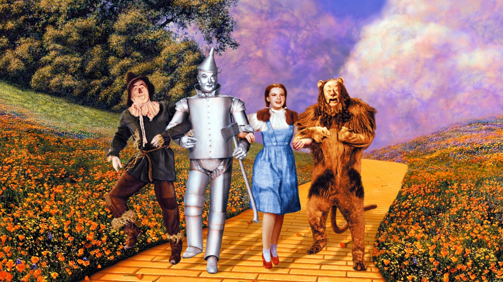
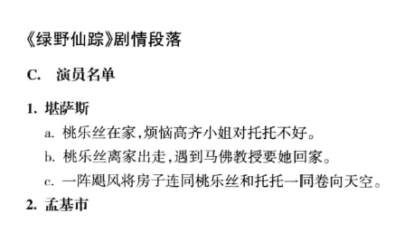

# 电影形式的重要性
## 电影形式的概念
### 形式即系统
#### 人类的意识活动
- 人类意识在日常生活中寻找**秩序与意义**
- 艺术作品依赖**人类心灵的动力及合成力**
- 艺术作品提供**设计好的情境**，让人们**演练个人能力**

#### 艺术作品与观众的互动
- 艺术作品本身**不进行任何活动**，需要**观众的参与**才能存在
- 作品**唤起观众情感**，开始并**维持心灵感知**
- **人类情感的参与**是艺术作品存在的基础

#### 系统的构成
- **系统**（systems）指一组元素**彼此依赖且互相影响**
- 电影不只是一堆元素的拼凑，而是有它的**形式**（form）即**各元素的整体关系系统**
- 《**绿野仙踪**》（The Wizard of Oz）展示了明显的叙事与风格系统，说明电影的完整性

#### 形式与观众意识的关系
- 《绿野仙踪》中**叙事系统与风格系统**相互关联，指出电影的**双重系统**
- 色彩、摄影机运动、音乐等**风格元素**（stylistic elements）与**叙事元素**（narrative elements）相结合
- 副系统所形成的网络，构成电影的形式

### “形式”与“内容”
#### 形式和内容的关系
- 通常将“形式”和“内容”视为**相对概念**，如容器与其内容
- 不认同形式和内容分离的观点，认为电影系统是一种**整体形式**，没有内外之分
- 形式元素即是内容，主题事件和抽象概念都属于艺术作品的系统内部

#### 形式元素与内容的融合
- **形式元素**正是所谓的**内容**，因为它们能引发观众期待或臆测剧情走势
- 观众会**连接**并使电影中的各个元素**有机地互动**
- 电影的整体系统中**包含的事件或概念**，其意义是由其**在系统中的位置和作用**定义的

#### 历史事件在不同电影中的呈现
- 历史事件如**美国南北战争**，在不同电影中的呈现与处理**各不相同**，取决于电影的形式系统
- 在《**一个国家的诞生**》（The Birth of a Nation）中，南北战争是与电影其他内容元素交织的一部分
- 不同导演可能采用**相同的历史事件**，但在其各自的形式系统中**处理方式各异**，如《**乱世佳人**》（Gone with the Wind）和《**黄金三镖客**》（The Good，the Bad，and the Ugly）展示南北战争的不同面貌

### 形式的期待与观众体验
#### 形式与观众心理的相互作用
- 艺术形式**激发观众的期待**，导致在艺术作品中寻找**完整性与意义**，形成观众**心理的基本需求**
- 通过电影中的**各种元素**（如叙事（narrative）与风格（stylistic elements）），形式构建出一个**整体的系统**，影响着观众的理解与情感反应
- 电影形式的系统包括**叙事模式**（如《绿野仙踪》中的ABA模式）以及**风格上的安排**（如音乐主题的重复），促使观众产生对剧情发展的期待

#### 形式如何吸引并引导观众
- 形式通过创造一个**独立自足的艺术世界**，挑战并扩展观众的日常知觉，鼓励采用新的观看、听觉和思考方式
- 基本的电影技巧，如**取景**（framing），不仅影响观看的方式，也构成了电影形式的基础，进而影响观众对电影内容的接收和体验

#### 形式激发的期待及其对艺术经验的影响
- 形式结构通过观众对电影元素之间关系的期待，引导观众的**参与和情感投入**
- 观众对形式的期待包括对**故事结局**的预测、对**剧情发展**的假设，以及对电影中**元素重现**的寻找
- 艺术形式可以通过**悬疑**（suspense）、**惊奇**（surprise）以及**好奇**（curiosity）等方式**延迟或颠覆**这些期待，增加电影的吸引力和复杂性

#### 对观众期待的挑战与接受
- 实验电影和前卫艺术作品通过**挑战传统的形式期待**，促使观众重新考虑对电影的预设概念
- 面对形式上的挑战，观众通过**调整自己的期待**，可以发现电影独特的美学价值和表达力
- **开放的心态**对于欣赏各种类型的电影至关重要，能够帮助观众接受并理解电影艺术的多样性和深度

### 惯例与经验
#### 形式、惯例与观众的经验
- 艺术形式与观众心灵活动的关联强调了对形式的理解是基于**先前的经验**
- 艺术作品中的传统、主导风格、流行形式共有的元素称作**惯例**（conventions）
- 观众对形式的体验来自于**作品中的信息**以及**先前的日常生活和其他艺术经验**

#### 形式惯例的社会与文化影响
- 艺术家的作品受到**所处历史与社会的影响**，形成与社会现象和其他作品相关的惯例
- 电影的类型（如歌舞片）和一般剧情片中，**约定俗成的惯例**对剧情的发展有**明显指引**
- 《**绿野仙踪**》作为例子，展现了遵循**歌舞片惯例**和**剧情解决的惯例**

#### 从生活与艺术经验中理解形式
- **观众的艺术经验**比日常生活经验在理解电影形式时更为重要
- 电影惯例使电影从真实生活中区隔开来，要求观众接纳**各作品独特的惯例**
- 艺术作品能**创造新惯例**，创新作品最初可能被视为**异类**，但最终可能形成**新的期待**

### 形式与情感
#### 电影中的情感与观众反应
- 电影中的情感与观众在观赏时的情感反应**区别明显**，前者属于**电影内部元素**，后者则是**观众个人的感受**
- 电影中情感的表达与其他元素**相互作用**，如演员表情、音乐或剪辑手法，都有助于**构建电影的情感氛围**
- 观众的情感反应与电影形式**紧密相关**，形式结构如何激发、引导观众的情感体验，展现了**艺术作品与观众之间的互动**

#### 形式激发的情感体验
- 形式通过**期待、悬疑、满足或意外转折**等手法，影响观众的情感体验，如**期待的满足或被颠覆**能引起不同的情感反应
- 电影或其他艺术作品的形式能诱导观众**抛弃日常生活中的情感反应**，接受**不寻常或新颖的情感体验**
- **形式的结构**引导观众情感，如《**绿野仙踪**》通过叙事结构让观众同情主角，体验到**归家的满足感**

#### 情感的复杂性与形式的脉络
- 电影形式的脉络能够**改变观众对某些情感事件的反应**，如悲伤事件的幽默处理或对死亡的轻松看待
- 观众对电影中情感的理解和反应依赖于**电影的整体形式系统**，形式的构建决定了情感的呈现与接受方式
- 形式与情感的结合展现了艺术作品的**强大力量**，通过期待、悬疑等手法深度影响观众的情感体验

### 形式与意义
#### 意义的类型
##### 指示性意义（Referential Meaning）
- 《绿野仙踪》简介：在经济大恐慌时代，飓风将女孩桃乐丝从堪萨斯州吹到神秘的奥兹，经历冒险后回家
- 指示性意义关联**现实世界特定背景**，如经济大恐慌、堪萨斯州、美国中西部气候等，为故事提供现实框架

##### 外在意义（Explicit Meaning）
- 概述：桃乐丝梦想逃离家庭烦恼，经历冒险后认识到家的重要性
- 常被视作电影的“**主题**”或“**信息**”，如桃乐丝最后得出的结论“没有什么地方比得上家”，代表电影的**中心意义**

##### 内在意义（Implicit Meaning）
- 抽象概念：将电影视为关于青春期到成人期转变的过程
- 电影通过**形式元素**暗示**较深层的主题**，如从童年到成人的成长过程，需观众诠释电影的**隐含意义**

##### 象征性意义（Symptomatic Meaning）
- 社会意识形态反映：电影反映20世纪30年代美国社会对家园与人性价值的信念
- 电影的意义超越个人故事，反映**更广泛的社会、文化价值观和时代思潮**

#### 形式与意义的互动
- 意义不仅来自故事内容，而是**电影整体形式**的结果，包括故事、风格和视觉元素等的综合
- 意义的探索不应只限于寻找**电影的主题或信息**，而应考虑**电影独特的形式系统**如何塑造特定的意义
- 对电影的诠释应在**电影的具体脉络**中进行，探讨如何通过电影的整体形式体现复杂的意义

#### 电影形式对意义的贡献
- 电影形式通过提供**视觉和叙事线索**，引导观众发掘电影的**多层次意义**
- 观众对电影的**理解和诠释**基于先前的**经验**和对电影形式的**感知**
- 电影作为**文化产物**，其意义反映了制作时期的**社会背景、文化价值和意识形态**

### 评论与评价
#### 个人品味与评价判断
- **个人品味**：基于**个人喜好**的评价，如“我喜欢这部电影”
- **评价判断**：更**客观**的评论方法，不仅基于个人喜好，而是采用**特定的评价准则**，如“这是一部好电影”

#### 评论的准则
- **写实程度**：根据电影**是否符合现实生活的准确性**来评价
- **剧情合理性**：评价电影剧情**是否逻辑合理**
- **道德标准**：从**道德角度**评价电影的内容，可能基于电影中的行为或电影所传达的整体信息

#### 形式的评价准则
- **首尾一贯（Coherence）**：电影的**整体性和统一性**
- **效果的强度（Intensity of Effect）**：电影**是否生动、扣人心弦**
- **复杂性（Complexity）**：电影在多个层面上的**复杂关系和深度**
- **原创性（Originality）**：电影是否提供**新颖的视角或表达方式**

#### 评论的作用与功能
- **指引观众**：**发现**被忽略的作品，**重新审视**经典
- **详细检阅**：基于**对电影形式系统的深入分**析进行评论，而不是泛泛的评语
- **增进理解**：好的评论应指出观众**可能忽略**的电影内部关系或特质，引导回到**电影的形式系统**

#### 评论与电影理解
- 评论应避免仅仅基于个人喜好，而是建立在对电影艺术形式的**深入理解和分析**基础上
- 通过详细说明电影**如何构成一个艺术系统**，读者可以获得批评和评价电影的坚实基础
- 电影评论的目标不是制定经典作品的名单，而是增强观众对电影作为艺术形式的**理解和欣赏**

## 电影形式的原则
#### 形式与系统
- **系统**：电影形式是由相互关联、彼此依赖的元素组合而成的系统
- **原则与规则**：虽然艺术领域没有绝对的形式规则，但每部艺术作品倾向于建立自己**独特的形式原则**
- **文化产物**：艺术作品作为文化的产物，其形式原则多是基于**惯例**而非严格法则

#### 形式原则的五个一般原则
1. **功能（Function）**
   - 每个电影元素都应具有其特定功能，贡献于整体的艺术效果和意义
2. **类似与重复（Similarity and Repetition）**
   - 通过元素的类似性和重复性，电影形成模式，增强观众的理解和情感反应
3. **差异与变化（Difference and Variation）**
   - 元素之间的差异和变化创造张力和兴趣，避免单调
4. **发展（Development）**
   - 电影的情节和主题应随时间发展，引导观众经历从起始到结尾的旅程
5. **统一/不统一（Unity/Disunity）**
   - 形式的统一性是衡量电影整体性的关键，而适当的不统一性可引入创新和深度

### 功能（Function）
- 每个元素在电影中扮演**一个或多个角色**，履行**一个或更多的任务**
- 通过《**绿野仙踪**》中的例子来探讨不同元素的功能
- 功能通常是**多重的**，故事和风格元素都具有功能

#### 元素的功能
- 通过**其他元素需要展示的内容**来确定一个元素的功能
- 案例分析：**托托**（Toto）的多重功能
  - 导致桃乐丝离家
  - 帮助桃乐丝回不了堪萨斯
  - 通过对比，延续电影开头黑白堪萨斯与彩色奥兹的对比
- **对比功能**：桃乐丝与邪恶女巫在服装、年龄、声音等方面的对比
- **黑白转彩色**：强调奥兹的幻想国度

#### 功能与电影制作者的意图
- 功能的概念与电影制作者的意图**不一定相关**
- 讨论电影时，更关注“这个元素在这里做什么？”而不是“为什么这个元素会在这里？”
- **功能的视角**：桃乐丝唱“彩虹之外”（Over the Rainbow）不仅是因为合约要求，而是在**叙事和风格**上发挥了功能

#### 动机（Motivation）
- 电影中任何元素出现都应有其**逻辑解释**，即其动机
- 动机示例：
  - 高齐小姐（Miss Gulch）化身为女巫的动机
  - 托托追猫而跳出大气球的动机
- 动机用于解释**人物行为以及电影中的任何元素**
- 动机的案例分析：
  - 《我的男人古德菲》（My Man Godfrey）中穿着乞丐衣服的人物动机
  - 蜡烛作为房间光源的动机
  - 人物穿越房间动作给摄影机运动的动机

#### 动机与元素功能的进一步研究
- 动机在电影中**非常普遍**，观众往往视其为理所当然
- 叙事形式原则和各种类型的电影中对动机如何赋予元素特定功能的详细研究

### 类似与重复（Similarity and Repetition）
- 类似和重复是构成电影形式的**重要原则**
- 通过ABACA模式解释了**预测的可能性**，显示了**重复元素的规律性模式**
- 类似与重复增加了观众对电影形式的**期待和满足感**

#### 重复的基础
- 重复是**理解电影的基础**，需要识别**再次出现**的人物和场景
- 电影中**任何事物都可以重复出现**，包括台词、音乐节奏、镜头运动、人物行为和故事情节
- **母题**（motif）指电影中有意义且重复出现的任何元素

#### 母题的应用
- 母题可以是物品、颜色、地点、人物、声音或个性，以及打光法或摄影机位置
- 《绿野仙踪》运用了**多种母题**，包括物品、颜色和人物等
- 通过母题建立电影中的**平行对照**（parallelism）

#### 平行对照（Parallelism）
- 平行对照通过**强化相似之处**，吸引观众**比较不同元素**
- 《绿野仙踪》中，堪萨斯农夫与黄砖路上人物的相似点，以及流浪算命者与奥兹巫师的相似之处
- 观众通过识别平行对照，增加了**观赏电影的乐趣**

### 差异与变化（Difference and Variation）
- 差异和变化是电影形式的**另一基本原则**，与重复形成对比
- 即使是**微小的变化**，也为电影增加了**多样性和深度**
- 形式需要稳定性的同时，也需创造出差异

#### 差异的必要性
- 形式很少只由重复构成，**完全的重复**（AAAAAA）会让电影显得**沉闷**
- 人物的个性、场景、时间和活动的转换都需**有所差异**
- 在影像中，色调、质料、方向和运动速度等的差异是必要的

#### 母题与变化
- 母题虽然**可以重复**，但很少是**完全相同**的，一定会有所变化
- 在《绿野仙踪》中，堪萨斯的农工与奥兹里的角色并非完全相同，体现了**平行对照**需要的差异
- 水晶球在不同场景中的**不同表现**，以及托托的**行为变化**都是变化的例子

#### 对立与差异
- 元素之间的差异经常变成**截然对立**，如人物之间的冲突、颜色和场景的对比
- 在《绿野仙踪》中，桃乐丝的欲望与其他角色形成对立，产生**戏剧性的冲突**
- **颜色对立**（如黑白的堪萨斯与彩色的奥兹）、**场景对立**（如翡翠城对女巫的城堡）是电影中重要的差异来源

#### 差异的多样性
- 差异并非只是单纯的对立，还包括**人物特质的差异、暗示的渐层差异**
- 《绿野仙踪》中稻草人、锡人和狮子在外观和所缺乏的东西上的差异
- 抽象电影中可能只有**极小的变化**，如《印刷时代》（Print Generation）中的细微变化

#### 重复与变化的相互关系
- 重复与变化是**一体两面**，在分析电影时，寻找相似和相异的地方很关键
- 通过观察可以找出母题及其中的对比变化
- 注意影片中的**重复平行对照**和**重要的差异**是理解电影形式的关键

### 发展（Development）
- 发展是**连接相似和不同点之间的模式**，是电影形式中的一个重要原则
- 通过**ABACA模式**说明发展，展示了**重复与变化的结合**
- 发展的原则影响**整个故事的结构**

#### 分段法（Segmentation）
- **分段**是分析电影发展模式的有效方法，将电影分为重要和次要的部分
- 《绿野仙踪》的**分段示例**，包括演员名单、堪萨斯、孟基市、黄砖路、翡翠城等
- 分段有助于识别电影中的**相似和不同点**，以及整体形式的设计

#### 发展的模式
- 电影故事通常展示**多方面的发展**，如旅程、探索和解谜等形式
- 《绿野仙踪》通过**旅程和探索的模式**展示了从X到Y再到Z的发展
- 发展模式由**几个不同的模型**组成，贯穿整个剧情

#### 开始与结束的比较
- 比较电影的**开始和结束**可以揭示整体的发展模式
- 《绿野仙踪》的故事开始和结束于桃乐丝回到家，展示了**旅程的发展和重复的元素**
- 风格上，开始和结束的**黑白胶片拍摄**支持了奥兹梦境与堪萨斯现实之间的对比

#### 形式的动态进展
- 形式的发展是一种**动态的进程**，创造了我们的观影经验
- 类似与差异、重复与变化之间的相互作用引导观众**逐渐揭示电影的形式系统**
- 通过**分段和对比分析**，观众可以主动发现电影的结构和主题

### 统一/不统一（Unity/Disunity）
- **所有元素间的关系**构成了整体电影系统的统一或不统一
- 即使**看似无关的元素**也是整体系统的一部分，可能表示系统中的缺点
- 统一性是电影**完整和满足体验**的关键因素

#### 统一性的标准
- 统一的电影**没有任何多余的元素**，每个元素都有其**特定功能**
- 形式关系**紧密交织**，没有缝隙，相似和差异处**明显**，形式逻辑化地发展
- 完美的统一性**难以达成**，即使是统一的电影也可能包含无法整合的部分

#### 不统一的例子
- 《绿野仙踪》中被剪掉的蜜蜂攻击场景导致女巫台词**缺乏动机**
- 影片结束处未解释高齐小姐的结局，展示了**故事的不统一**
- 即便有不统一的元素，观众**可能会忽略**，特别是当不统一的部分与主要故事线**不直接相关**时

#### 不统一的正面作用
- 在特殊形式的电影中，不统一可能**增加电影的形式和主题意义**
- 《低俗小说》（Pulp Fiction）中**手提箱内容的悬而未决**增添了故事的魅力
- 不明确的元素使观众关注**剧中人的反应和电影的深层主题**

#### 形式统一与评价电影的重要性
- 形式统一被视为评价电影的一个**重要标准**
- 即使电影前后不一，含有无动机元素，也**不能一概而论**其为失败之作
- 不统一的电影可以提供**不同的观影体验**，有时这种体验比完美统一的电影更具吸引力
