# 和弦
* 在**多声部音乐**中， 可以按照**三度关系**排列起来的**三个以上的音的结合**， 叫做**和弦**
  * **三度关系**即两个相邻音之间的度数为**三度**
* 按**三度关系**构成的和弦，由于各音间保持着一定的**紧张密度**，音响谐调丰满，并合乎泛音的**自然规律**，因此，在**多声部音乐**中被广泛应用；但在一些音乐作品中，也可以遇到**不是按三度关系构成的和弦**，这些和弦对丰富和声的色彩有着积极的意义，故也不应忽视
## 三和弦
* 由**三个音**按照**三度关系**叠置起来的和弦，叫做**三和弦**
* 在三和弦中，下面的音叫做**根音**，或**一度音**，用数字1来代表：中间的音叫做**三度音**，用数字3来代表；上面的音叫做**五度音**，用数字5来代表
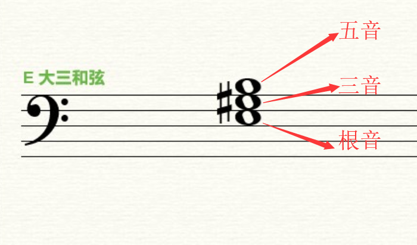
* 三和弦的**主要类型**有两种
  * **大三和弦**：根音到三度音是**大三度**，三度音到五度音是**小三度**，根音到五度音是**纯五度**
  * **小三和弦**：根音到三度音是**小三度**，三度音到五度音是**大三度**，根音到五度音是**纯五度**
* **较少使用的类型**有两种
  * **增三和弦**：根音到三度音和三度音到五度音都是**大三度**，根音到五度音是**增五度**
  * **减三和弦**：根音到三度音和三度音到五度音都是**小三度**，根音到五度音是**减五度**
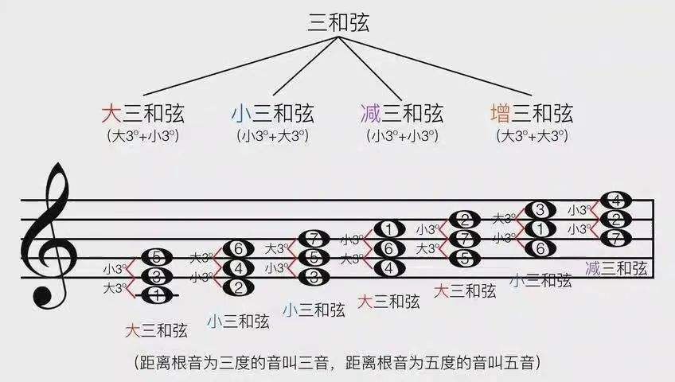
* 大小三和弦都是**协和和弦**，因为其中所包含的音程都是**协和音程**（大三度、小三度、纯五度）；增减三和弦都是**不协和和弦**，因为其中的减五度和增五度是**不协和音程**
## 七和弦
* 由**四个音**按照**三度关系**叠置起来的和弦，叫做**七和弦**
* 七和弦下面的三个音和三和弦中的音一样，叫做根音、三度音、五度音；第四个音因为与根音相距七度，故叫做**七度音**，用数字7来代表
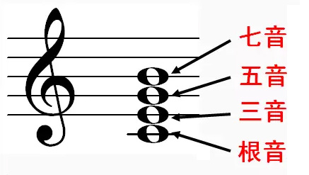
* 所有七和弦都是**不协和和弦**，因为其中包含了不协和的七度音程
* **七和弦的名称**是按照所包含的**三和弦的类别**及**根音与七度音之间的音程关系**而定名的
  * 以**大三和弦**为基础，根音至七度音为**小七度**的七和弦叫做**大小七和弦**（大调小七和弦）
  * 以**小三和弦**为基础，根音至七度音是**小七度**的七和弦叫做**小小七和弦**（小七和弦）
  * 以**减三和弦**为基础，根音至七度音是**小七度**的七和弦，叫做**减小七和弦**（半减七和弦）
  * 以**减三和弦**为基础，根音至七度音是**减七度**的七和弦，叫做**减减七和弦**（减七和弦）
  * 除了上述较常用的四种七和弦外，还有许多**其他类型的七和弦**，例如增大七和弦、大大七和弦、小大七和弦等
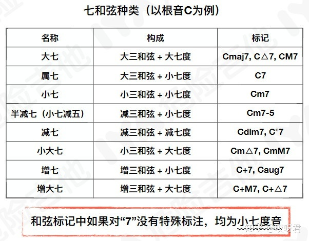
## 原位和弦及转位和弦
* 以和弦的**根音**为**低音**（最低的音）的和弦，叫做**原位和弦**
* 以和弦的三度音、五度音、七度音为**低音**的和弦，叫做**转位和弦**
  * 原位和弦转位后，**各音的名称**还是**不变**，比如C和弦，三个音分别是C，E，G；如果我们把C**抬高八度**，变成c，和弦变成E，G，c，这时候这个E还是**三音**，G还是**五音**，c还是**根音**，所以这时和弦就是**以三音作为最低音**的，这就是C和弦的**转位和弦**
* 三和弦除了根音外，还有两个音，所以三和弦有**两个转位** 
  * 以**三度音**为低音的三和弦叫做三和弦的**第一转位**，也叫做**六和弦**，用数字6来代表
  * 以五度音为低音的三和弦叫做三和弦的**第二转位**，也叫做**四六和弦**
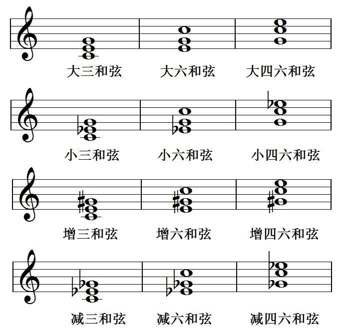
* **七和弦**除根音外，还有三个音，所以七和弦有**三个转位**
  * 以**三度音**为低音的七和弦叫做七和弦**第一转位**，也叫做**五六和弦**
  * 以**五度音**为低音的七和弦叫做七和弦**第二转位**，也叫做**三四和弦**
  * 以**七度音**为低音的七和弦叫做七和弦的**第三转位**，也叫做**二和弦**
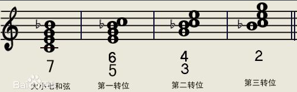
## 构成和识别和弦的方法
* 构成和识别和弦的方法之一是记住和弦的**音程结构**，按音程结构去构成和识别和弦
  * 例如我们已知大三和弦的音程结构是大三度加小三度，那么要在D音上构成大三和弦，便先构成D到#F这个大三度，再由#F到A构成小三度可
* 构成和识别和弦的另一种方法是：首先确定和弦的**根音**，根据根音构成或找出和弦的**原位形式**，再根据原位和弦来构成或识别**转位和弦**
  * 例如要在G上构成小小七和弦，首先要找出和弦根音E，在E音上构成原位小小七和弦，再将根音移高八度，求得G音上的小小七和弦
## 等和弦
* 两个和弦孤立起来听时，具有同样的声音效果，但在音乐中的意义不同，写法也不同，这样的和弦叫做**等和弦**；等和弦和等音程一样是由于**等音变化**而产生的
* 等和弦有**两类**
  * 和弦中的音不因为等音变化而更改音程的结构
  * 由于等音变化而更改和弦的结构
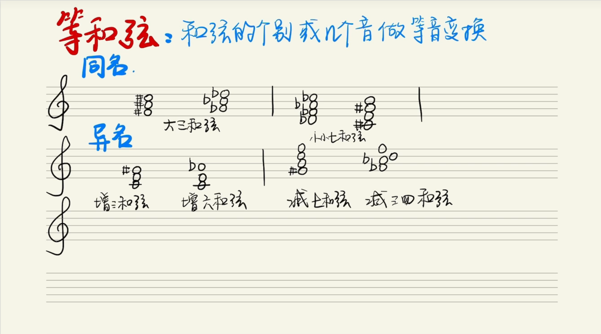
## 调式中的和弦
* 和弦和音程一样，在不同的**调式体系**中，或在同一调式的不同**音级**上所构成的同一和弦，其调式意义和表现特性是不同的，因此从**调式意义**上去领会和弦有着积极的意义
* 在为旋律配置和声时，大都以七声调式为主，因此，我们这里所谈的调式中的和弦，也都是**七声调式**的
* 在**自然大调**中，1、4、5级上是大三和弦，2、3、6级上是小三和弦，7级上是减三和弦；在**自然小调**中1、4、5级上是小三和弦，3、6、7级上是大三和弦，2级上是减三和弦；在**和声大调**中1、5级上是大三和弦，3、4级上是小三和弦，2、7级上是减三和弦，6级上是增三和弦；在**和声小调**中，1、4级上是小三和弦，5、6级上是大三和弦，2、7级上是减三和弦，3级上是增三和弦
* 在和声的表现中，第1级（主音）、第5级（属音）、第4级（下属音）上的三和弦具有重大的意义，因此这三个和弦叫做**正三和弦**，其他各音级（2、3、6、7）上构成的三和弦叫做**副三和弦**
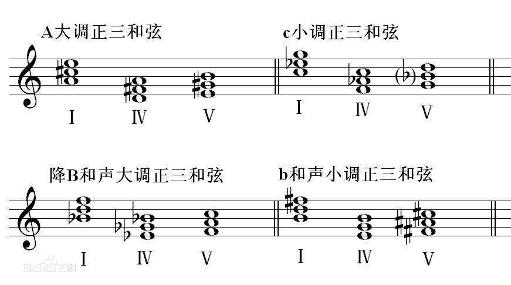
* 在第5级（属音）上构成的七和弦叫做**属七和弦**（5、7、2、4），在第7级（导音）上构成的七和弦叫做**导七和弦**（7、2、4、6）；属七和弦和导七和弦都是**不协和和弦**，因此都需要进行**解决**
  * **大小七和弦**与**属七和弦**在调式中是指同一个和弦，但是描述方向不一样，大小是从**结构**描述，属是从**功能**描述；通过任何一个音构成大小七和弦，它一定是某个调的属七和弦，如以G为根音构成大小七和弦是C大调的属七和弦
* 属七和弦最普通的解决法就是进到**主音三和弦**
  * 属七的解决照例是以不稳定音到稳定音的倾向为根据的，即第7级和第2级进到第1级，第4级进到第3级，第5级除在原位属七中进到第1级外，在其他三个转位的属七和弦中都保持原位不动
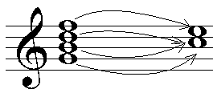
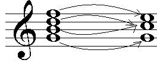
* 导七和弦的解决是进行到**重复三度音**的**主音三和弦**，即第7级进到第1级，第2级和第4级进到第3级，第6级进到第5级
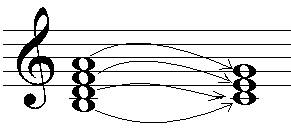
## 和弦的应用及其表现特性
* 在多声部音乐中，应用得最多的是协和三和弦，即**大小三和弦**；其次是**增减三和弦**和**七和弦**等不协和和弦
  * **大三和弦**具有**明亮的色彩**，这种色彩是由于根音上的大三度造成的，大三和弦和大三度音程一样，往往用来说明**大调的特征**
  * **小三和弦**和大三和弦相比，色彩比较**暗淡**，这种色彩是由于根音上的小三度造成的，小三和弦和小三度音程一样，最能说明**小调的特征**
  * **增三和弦**具有**向外扩张**的特征，**减三和弦**具有**向内紧缩**的特征，一切不协和和弦都具有尖锐、紧张的特点
* 和弦在实际应用中，往往在不同的八度中重复其全部音或其中的某几个音，和弦中的音全部出现时叫做**完全和弦**
* 在二声部乐曲中，和弦音一定要被省略，为了辨认这些和弦，需要在想象中添补上所省略的音；和弦中的音没有全部出现叫做**不完全和弦**
* 和弦可以用来作为旋律的**伴奏**，或将**许多声部**组织在一起，并也可以出现在旋律本身之中，即旋律**按照和弦音而进行**