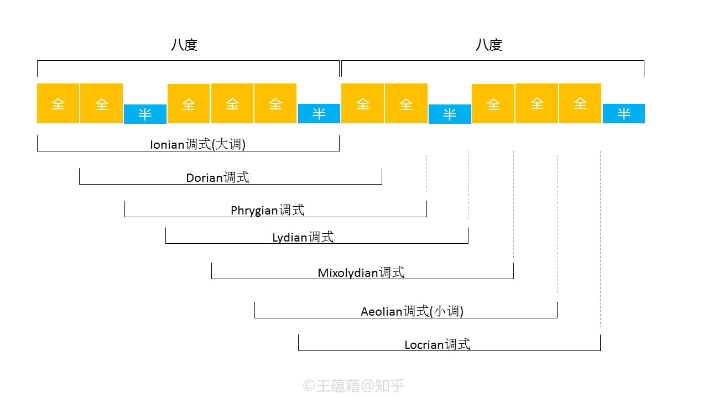
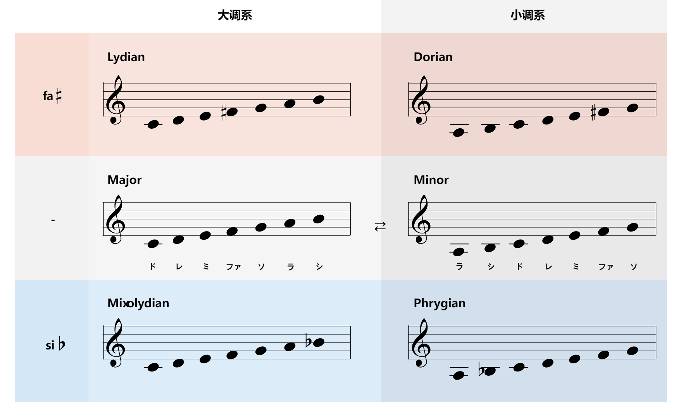
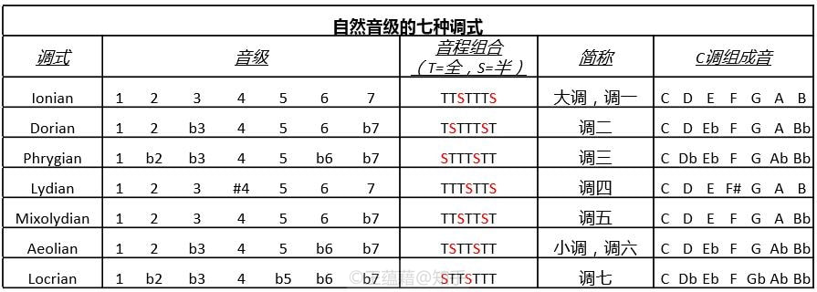
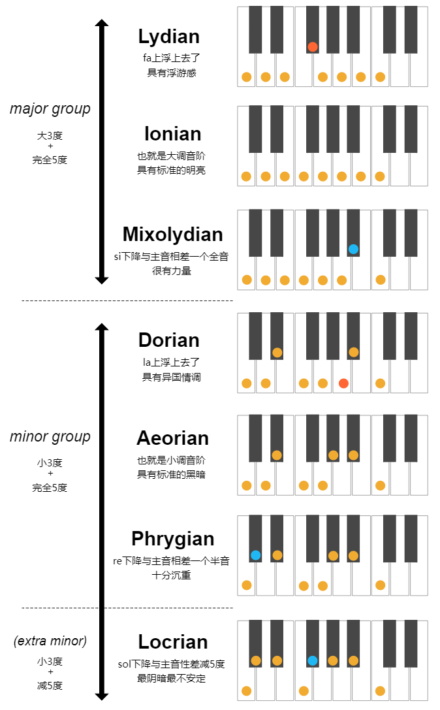
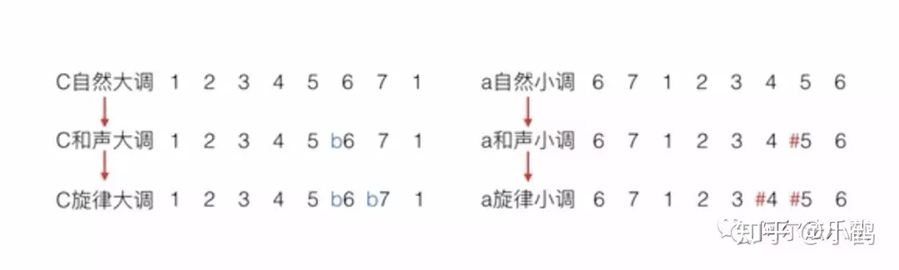
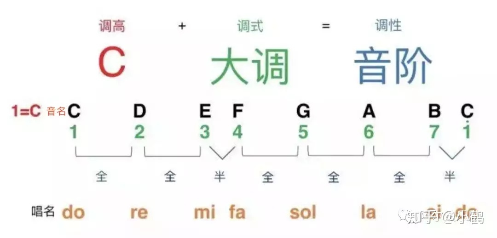
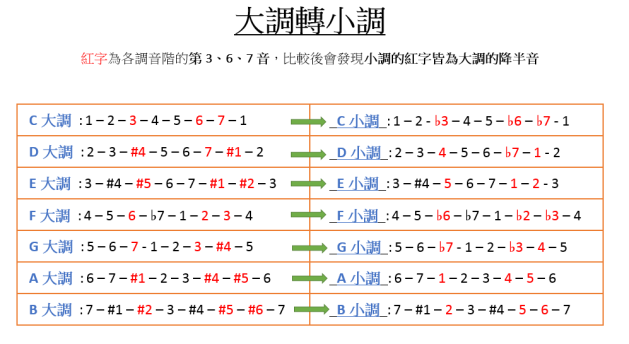

# 自然音阶与调式
## 自然音级的七种调式
* 像**基本音级**这样，一个双全音群和一个三个全音的群，两个群由半音衔接在一起，这样组成的音阶就叫做**自然音阶**
  * 自然音阶有七个不同的音，因此属于**七声音阶**；由于八度的**循环性**，自然音阶中的任意一个音作为**主音**向上数都能发展出一种新的调式音阶

* 自然音阶**七种调式类型**各自拥有独特的气质，其中**两种调式类型**是现代音乐最常用的；第一种叫**Ionian调式**，音阶的音程向上以 **全全半全全全半** 排列，我们在调性音乐中称它为“**自然大调**”，也称“**大调**”，大调的七个音级是 1 2 3 4 5 6 7，与基本音级相同
  * 用大调写的音乐一般给人的感觉或轻松舒缓或**积极阳光**
  * 大调是自然音阶的**一级调式**，或者叫“调一”；在日常交流中，“自然音阶”和“大调”往往指的是同一个意思，常常混着使用
* 第二种**Aeolian调式**，音程向上以 **全半全全半全全** 排列，调性音乐中称“**自然小调**”，也称“**小调**”，是自然音阶的**六级调式**；调的七个音级是1 2 b3 4 5 b6 b7；小调音乐带有**忧郁哀伤**的气质，与大调的阳光产生鲜明的对比，这个不同主要来自于三度音的大小差异
* 实用性上，重要程度仅次于前两者的是**Mixolydian**和**Dorian调式**；两个调式听觉色彩上介于大调的阳光和小调的阴郁之间，在爵士，蓝调，先锋摇滚的曲目中不可或缺
* 其次是**Lydian**和**Phrygian调式**，Phrygian的二级音是**降音**，比小调还幽暗冷酷，由于声音色彩张力丰富，弹重金属的人很喜欢用；Lydian则是一个具有神秘感和夸张戏剧性效果的音阶，可以在电影配乐中既可以用来烘托雄伟隆重的气氛，又可以用来渲染滑稽的情节
* **Locrian**黑暗气质最重，给人沉重压抑堕落的死亡气息，音乐风格的限定比较大，流行乐中最少见，用在恐怖片里倒是很合适

## 大调式与小调式
* 大调式是由**七个音**组成的一种调式，其中**稳定音**合起来成为一个**大三和弦**；大调式的主音和其上方第三音为**大三度**，因为这个音程最能说明大调式的色彩
* 大调式有**三种形式**
  * **自然大调**即Ionian调式，是由两个**相同的部分**（大二度、大二度、小二度）构成的，这两个相同的部分被称为**四声音阶**，两个四声音阶间是用**大二度**分开的
  * **和声大调**是将自然大调的**第六级降低半音**构成的，其明显的特点是第6级与第7级间的增二度音程
  * **旋律大调**是将主音**下行级进**时的自然大调的**第六级和第七级降低半音**构成的
* 自然大调是三种大调中的**基本形式**，色彩明朗，应用最为**广泛**；和声大调产生**较晚**，应用不像自然大调那么普遍，由于降6级的关系，这一调式的色彩比较**暗淡柔和**，有点像小调的性质；旋律大调产生**最晚**，在应用上受到很大限制，因此一般**较少应用**
* 小调式和大调式一样是由**七个音**组成的，其中稳定音合起来成为一个**小三和弦**；小调式的主音和其上方第三音为**小三度**，因为这个音程最能说明小调式的色彩
* 小调式也有**三种形式**
  * **自然小调**即Aeolian调式，是**小调式的基本形式**
  * **和声小调**是将自然小调的**第七级升高半音**构成的，其明显的特点是第6级与第7级间的增二度音程
  * **旋律小调**是将自然小调的**第六级和第七级升高半音**构成的，一般多用于**上行**，但在下行时也偶尔使用；旋律小调下行时多用**自然小调**的形式，即将第6级、第7级还原
* 三种形式的小调的应用都**比较普遍**，从总的说来，小调的色彩一般都比较**暗淡**；和声小调由于升高第7级而造成导音向主音的倾向**异常尖锐**，因而有点近似大调的特点

## 调
* 由12个不同的**主音音名**搭配**大调或小调调式**可以形成的**调性音乐**中的**24种**的基础写作模板框架，称之为“**调**”（key）；在某一个调上的乐曲，它所用到的音将主要来自于这个调的音阶
  * 比如以**C大调**来定调的作品，主要是以C大调音阶CDEFGAB这七个音作为基础创作的；而十二平均律中的另外五个音出现的频率则**低很多**，作品中偶尔会穿插这些调外音以起到特定的过渡或惊喜作用

* 调性音乐中“调”的命名由**主音音名**与**调式类型**构成，如C大调或a小调，调名中所说的调式类型特指**大调或小调**；一般习惯上，大调的调名中的英文字母为**大写**，而小调调名中的英文字母为**小写**，调名中如果没有标明“大”或“小”，则**默认为大调**，如"G调"等同于“G大调”

## 关系调（式）与同主音调（式）
* 自然音阶的调式之间是存在**关联**的，由C大调（CDEFGAB）的二级音开始数一个八度就能得到D Dorian调式（DEFGABC），形成 全半全全全半全 的音程组合
  * C大调和D Dorian调式的七个音**是一样的**，只是主音的位置发生了改变，像这样由同一条音阶形成的**共享所有音名**的两个调式就叫做**关系调式**
* 在调性音乐中，由同一条音阶形成的大小调互称为**关系调**，或**关系大小调**
  * 把大调的**六级音**作为主音重新构建音阶就可以得到这个大调的**关系小调**，把小调的**三级音**（b3）作为主音重新构建音阶就可以得到小调的**关系大调**
* 由于主音不同，关系大小调所表达的**性格情绪**完全不同，**不能视为同一种调**
* 用同一个音名作为主音的调（式）之间互为**同主音调（式）**，也称**平行调**；比如C Mixolydian （C D E F G A Bb）与C Dorian （C D Eb F G A Bb）就是同主音调式，他们之间并不共享所有音名，只要求**主音相同**
  * 同主音大小调在**自然形式**中有**三个音级不同**，即第3级、第6级和第7级；在小调中，这三个音级比大调低一变化半音，因此同主音大小调的**调号**总是相差**三个升降号**
  * 因此在**五度圈**，只要从任何一格开始，往**逆时针**算**三格**，就可以找到**同主音小调**
  * **和声形式**的同主音大小调，只有**一个音级不同**，即第3级；它们共同的特征是第6级与第7级间的增二度
  * 在**旋律形式**的同主音大小调中，除**第3级有差别**外，大调式的旋律形式和小调式的自然形式相似，而小调式的旋律形式则和大调式的自然形式相似
  * 根据以上的比较，我们可以看出，大小调中唯一可靠的特征是**主音上的三度**；与主音成**大三度**则为**大调**，成**小三度**则为**小调**

## 五度圈
### 五度圈的定义
- **五度圈**（Circle of Fifths）是一个**音乐理论工具**，用于展示**各大调和小调之间的关系**
  - 它以**圆形排列**，按照**五度关系**连接各个调性
  - 五度相生圈帮助理解调号、调性转换和和声关系

### 五度圈的结构
- 五度圈包含**12个位置**，每个位置代表一个调性
  - **顺时针**方向，每个调性比前一个调性**高一个纯五度**
  - **逆时针**方向，每个调性比前一个调性**低一个纯五度**

#### 推导过程
- **顺时针**：按照**纯五度**（perfect fifth，即音阶中的**属音**变为主音）的关系，依次找到下一个调性
  - 从C开始，C到G是一个纯五度，G到D是下一个纯五度，以此类推
  - 每个新调性比前一个调性**多一个升号**
  - 当完成**12次转换**后，可**回到C大调**，完成循环

- **逆时针**：按照**纯五度关系**，依次找到下一个调性，但此时是**降五度**（perfect fifth down，即音阶中的**下属音**变为主音）
  - 从C开始，C到F是一个降五度，F到B♭是下一个降五度，以此类推
  - 每个新调性比前一个调性**多一个降号**
  - 当完成12次转换后，可回到C大调，完成循环

#### 升号和降号的顺序
- 五度圈中的升号调和降号调按照**固定的顺序**排列
  - 升号的顺序：F♯, C♯, G♯, D♯, A♯, E♯, B♯
  - 降号的顺序：B♭, E♭, A♭, D♭, G♭, C♭, F♭
- 每个新的调性在前一个调性的基础上**增加一个升号或降号**
  - 例如：G大调有1个升号F♯，D大调有2个升号F♯和C♯

### 大调的排列
- 五度圈顺时针排列的**大调**（major keys）
  - C大调（C major）没有升降号
  - G大调（G major）有1个升号：F♯
  - D大调（D major）有2个升号：F♯, C♯
  - A大调（A major）有3个升号：F♯, C♯, G♯
  - E大调（E major）有4个升号：F♯, C♯, G♯, D♯
  - B大调（B major）有5个升号：F♯, C♯, G♯, D♯, A♯
  - F♯大调（F♯ major）有6个升号：F♯, C♯, G♯, D♯, A♯, E♯
  - C♯大调（C♯ major）有7个升号：F♯, C♯, G♯, D♯, A♯, E♯, B♯

### 小调的排列
- 五度圈顺时针排列的**小调**（minor keys）
  - a小调（a minor）没有升降号
  - e小调（e minor）有1个升号：F♯
  - b小调（b minor）有2个升号：F♯, C♯
  - f♯小调（f♯ minor）有3个升号：F♯, C♯, G♯
  - c♯小调（c♯ minor）有4个升号：F♯, C♯, G♯, D♯
  - g♯小调（g♯ minor）有5个升号：F♯, C♯, G♯, D♯, A♯
  - d♯小调（d♯ minor）有6个升号：F♯, C♯, G♯, D♯, A♯, E♯
  - a♯小调（a♯ minor）有7个升号：F♯, C♯, G♯, D♯, A♯, E♯, B♯

### 降号调的排列
- 五度圈逆时针排列的**大调**（major keys）
  - F大调（F major）有1个降号：B♭
  - B♭大调（B♭ major）有2个降号：B♭, E♭
  - E♭大调（E♭ major）有3个降号：B♭, E♭, A♭
  - A♭大调（A♭ major）有4个降号：B♭, E♭, A♭, D♭
  - D♭大调（D♭ major）有5个降号：B♭, E♭, A♭, D♭, G♭
  - G♭大调（G♭ major）有6个降号：B♭, E♭, A♭, D♭, G♭, C♭
  - C♭大调（C♭ major）有7个降号：B♭, E♭, A♭, D♭, G♭, C♭, F♭

### 小调的排列
- 五度圈逆时针排列的**小调**（minor keys）
  - d小调（d minor）有1个降号：B♭
  - g小调（g minor）有2个降号：B♭, E♭
  - c小调（c minor）有3个降号：B♭, E♭, A♭
  - f小调（f minor）有4个降号：B♭, E♭, A♭, D♭
  - b♭小调（b♭ minor）有5个降号：B♭, E♭, A♭, D♭, G♭
  - e♭小调（e♭ minor）有6个降号：B♭, E♭, A♭, D♭, G♭, C♭
  - a♭小调（a♭ minor）有7个降号：B♭, E♭, A♭, D♭, G♭, C♭, F♭

### 五度圈的实际应用
- 理解**调性关系**
  - 五度圈帮助理解**不同调性之间的关系**，便于**作曲和即兴创作**
  - 例如，**关系大小调**位于圈的**同一格**
  - 只要从任何一格开始，往**逆时针/顺时针**移动**三格**，就可以找到**同主音小/大调**

- **转调和调号记忆**
  - 通过五度圈，可以**轻松记住**不同调性及其调号
  - **近系调**（closely related key），即**差一个升降记号以内**的调，就是五度圈上**差一格以内**的调
    - 例如，C大调的**近系调**，就是它**周围的五个调**（F 大调、D 小调、A 小调、G 大调、E 小调）；从C大调转过去只要更动至多其中一个音即可，所以它们被认为是**容易**从C大调转过去的调

- **和声分析**
  - 在和声分析中，五度圈帮助**识别和弦进行**和**调性变化**
  - **大调的常用和弦**即其**周围的五格**
    - 例如，C大调周围的五格有Dm、Em、F、G和Am，刚好就是C大调的1~6级和弦

  - 每个调性的位置与其**下属和弦**（subdominant）和**属和弦**（dominant）的位置相邻
    - C大调的下属和弦是F大调（位于逆时针方向），属和弦是G大调（位于顺时针方向）
  - **正格终止**（也就是五级接一级的终止式）的表现方式，就是**往逆时针走一格**；**变格终止**（四级接一级的终止式），就是**往顺时针走一格**
    - 例如，构成C和弦正格终止的是G和弦，变格终止是F和弦

