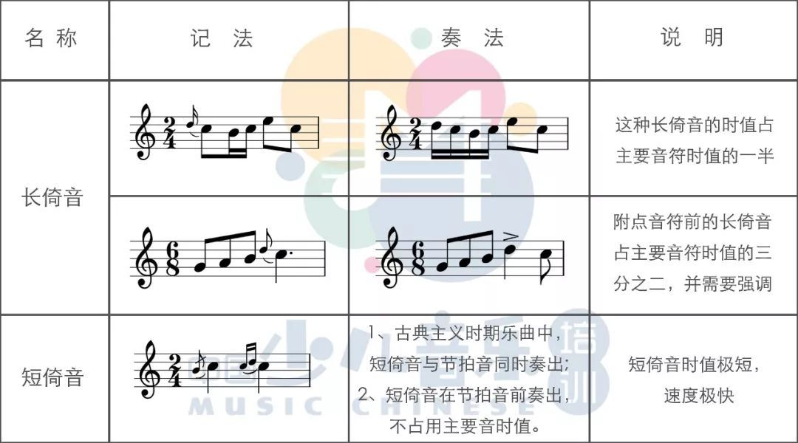
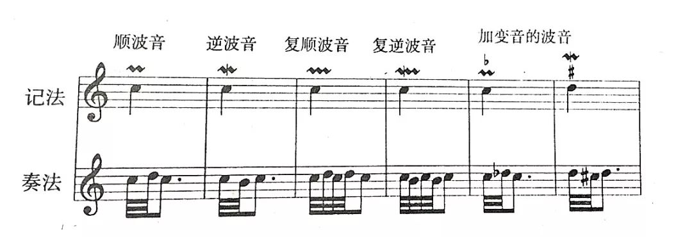
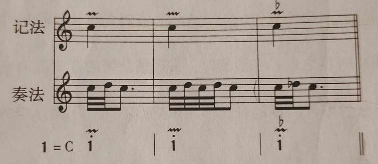
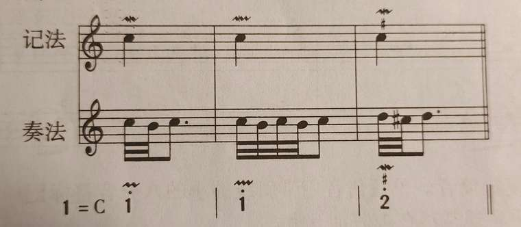
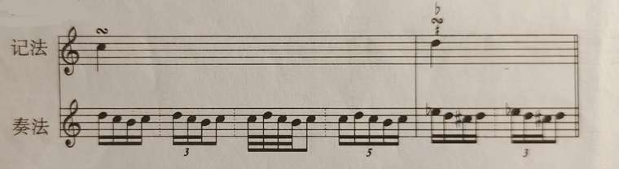
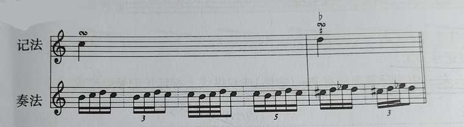
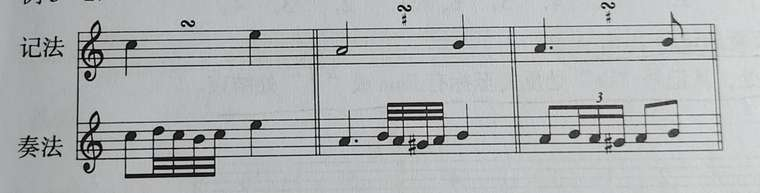
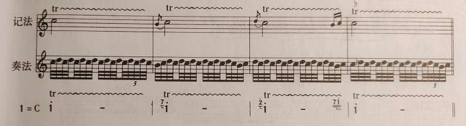

# 装饰音
* 用来装饰旋律的小音符及某些旋律型的特别记号，叫做**装饰音**
* 装饰音是旋律的装饰，但这并不意味着它是无足轻重、可有可无的；相反在旋律的表现中，它是塑造音乐形象**不可缺少的一部分**
* 装饰音大部分是由时值较短的**辅助音**（和主要音相距**二度**的音）构成的；演奏时它们的时值算在**被装饰的音的时值**之内，或算在**它前面的音符的时值**之内，在记谱上它们**不占**基本拍子总时值的时间
## 倚音
* 倚音有**长倚音**和**短倚音**两种
* **长倚音**是由**一个音**组成的，在主要音的前面，和主要音**相距二度**
  * 长倚音的**标记**是用不带斜线、不大于四分音符的**小音符**来表示的，**符干向上**
  * 长倚音的演奏时值永远算在**主要音**之内，假如主要音是**单纯音符**时，那么长倚音占主要音**一半的长度**；如果主要音是**附点音符**，那么长倚音就占主要音的**三分之二的长度**
  * 长倚音一般总带有**强声**
  * 长倚音的标记法在一百多年以前就**废止不用**了，但在许多**古典乐曲**中还经常会碰到

* 短倚音是由**一个音或数个音**所组成的，这些音和主要音的关系，可以是**级进**也可以是**跳进**，可在主要音**之前**，也可以在主要音**之后**
  * **短倚音**的标记：假如是一个音则用带斜线的**小的八分音符**标记；如果不止一音则用组合起来的**小的十六分音符**标记；用单符干记谱时，符干永远**朝上**
  * 短倚音演奏的时值是**短暂**的，而且**不带有强声**
## 波音
* 波音是在**两个主要音之间**，加入其上方或下方的**短的辅助音**而成
* 波音有**顺波音**、**逆波音**、**单波音**、**复波音**之分

* **顺波音的标记**可有两种：**小音符**或**顺波音记号**（**复顺波音记号**）

* **逆波音的标记**有两种：**小音符**或**逆波音记号**（**复逆波音记号**）

* 波音在演奏时一般占**主要音**的时间；波音记号记在**主要音的上方**，波音记号的上方或下方还可以带有**变音记号**，用来表示**辅助音的升高或降低**
## 回音
* 回音是由**四个或五个音**组成的**旋律型**
* 回音有**顺回音**和**逆回音**两种
  * **由四个音组成的顺回音**是由上方助音开始到主要音，再到下方助音和主要音；由五个音组成的顺回音是**由主要音开始**，后面与四个音的顺回音相同

  * 逆回音和顺回音的方向**相反**

* 回音可用**小音符**或**回音记号**来表示
* 回音记号可以记在**音符上**，也可以记在**两个音符之间**；回音记号的上方和下方还可以加上**变音记号**，用来表示助音的升高或降低

* 回音的奏法是**异常复杂而不固定**的，大家意见纷纭，因此，在现代记谱法中**早已不用**，但由于它在**古典音乐**占有重要地位，因而我们对它仍应有简单的了解
## 颤音
* 颤音是由主要音和它上方助音**快速而均匀地交替**而形成，用记号t或tr~来表示，放在音符的**上方**
* 颤音记号上方可能有**变音记号**，它是属于上面的**助音**的，表示该音的**升高或降低**
* 颤音的演奏有**三种情况**
  * 由**主要音**开始
  * 由**上方助音**开始
  * 由**下方助音**开始

* 颤音的结尾，往往**用回音结束**，但也有**用别种方法结尾的**，为了**避免差误**，作者最好把顺音的**开头音**和**结束音**准确地记出来