# 记谱法
* 记录乐曲的方法叫做**记谱法**
* 在历史发展过程中，由于乐曲的不同内容和需要而产生了各种各样的记谱方法；如为古琴用的**古琴谱**，为锣鼓用的**锣鼓谱**，以及我们现在普遍应用的**五线谱**、**简谱**和在我国民间应用的**工尺谱**等便是
## 音符与休止符
* 用以记录不同长短的音的进行的符号叫做**音符**
* 用以记录不同长短的音的间断的符号叫做**休止符**
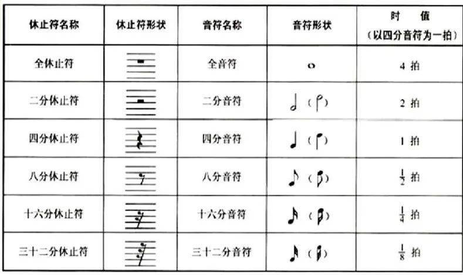
* **音值**的基本**相互关系**是：每个较大的音值和它最近的较小的音值的比例是2与1之比，例如：全音符等于两个二分音符；全休止符等于两个二分休止符等
## 五线谱
* 用来记载音符的五条平行横线叫做**五线谱**；五线谱的五条线和由五条线所形成的间，都是**自下而上**计算的
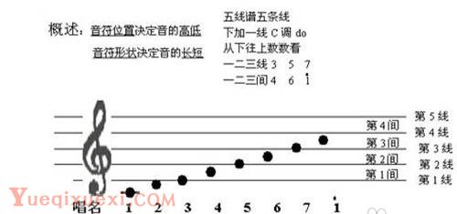
* 假使音乐作品是写在数行五线谱上，那么，这数行五线谱还要用**连谱号**连结起来；连谱号包括**起线**（连结数行线谐的垂直线）和**括线**（连数行五线谱的括弧）两个组成部分，括线分**花的**和**直的**两种
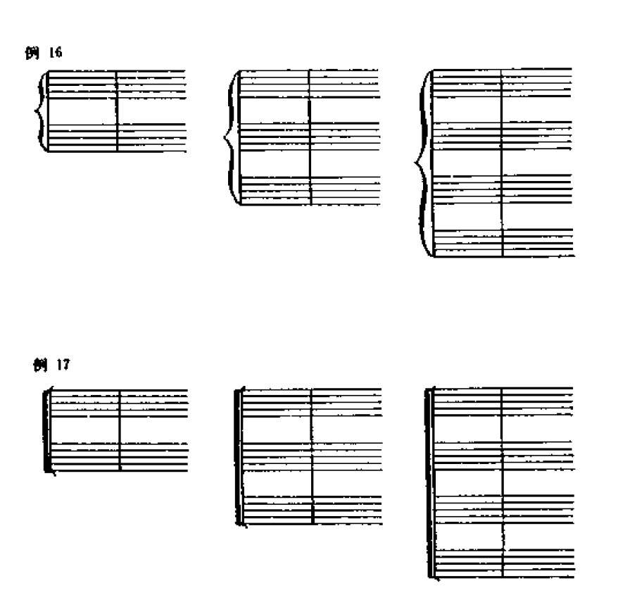
* **花括线**为钢琴、风琴、手风琴、竖琴、扬琴、琵琶等乐器记谱使用，**直括线**为合奏、合唱、乐队记谱用，在**总谱**中用直括线来连接**同类乐器**，把它分成完全的或不完全的乐器组，有时在直括线之外还加上**辅助括线**（花的或直的）来连接同种乐器
* 在总谱中，**独唱独奏声部**如果只包括一两行五线谱的话，左边只画一条**起线**，而不加括线
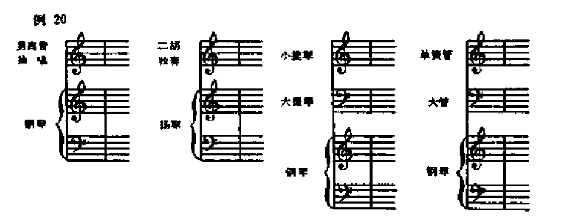
* 为了标记过高或过低的音，在五线谱的上面或下面还要加上许多短线，这些短线叫**加线**，在五线谱上面的叫**上加线**，下面的叫**下加线**；由于加线而产生的间，叫做**加间**，在五线谱上面的加间叫**上加间**，下面的叫**下加间**
* 加线和加间的计算方法是：上加线和上加间**由下向上**计算；下加线和下加间**由上向下**计算
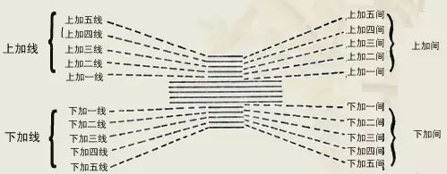
## 音符与休止符的写法
* 音符包括**三个组成部分**；**符头**（空心的或实心的椭圆形标记）、**符干**（垂直的短线）和**符尾**（连在符干一端的旗状标记）
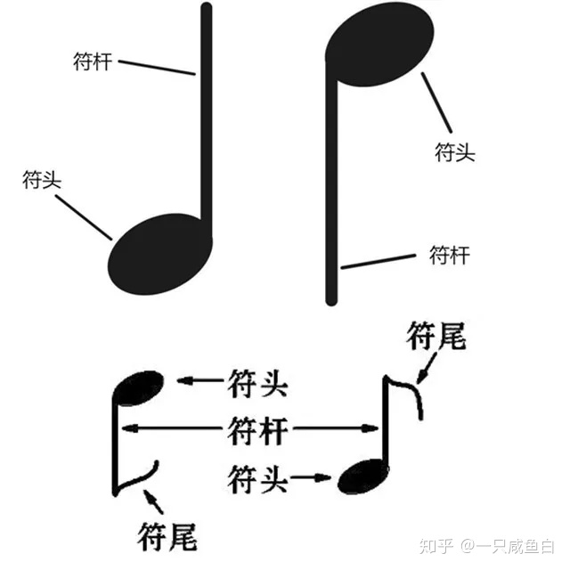
  * 音符的**符头**可以记在五线谱的**线上与间内**，符头在五线谱上的位置愈高音愈高，反之音符符头的位置愈低音也愈低
  * 用单符干记谱，符头在**第三线以上**时，符干**朝下**，写在符头的**左边**多在**第三线以下**时，符干**朝上**，写在符头的**右边**，符头在第三线上，符干朝上朝下**都可以**，根据邻近的符千方向而定；假如同一符干连着许多符头而又分布在第三线的上下时，则以**离第三线最远的符头**为准
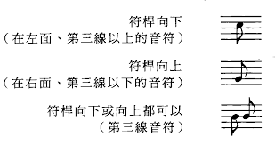
  * **符尾**永远写在符干的右边并弯向符头
  * 许多音符组成一组时，用共同的符尾（**符杠**）相连，这时符干的方向仍以**离第三线最远的符头**为准；两条以上的符杠要**平行**
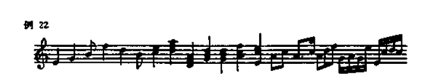
* **单声部音乐**永远用**单符干**记谱；**多声部音乐**只有在**节奏相同**的情况下，才可以用**单符干**记谱，**节奏不同**时，则用**双符干或多符干**记谱
  * 用双符干记**二声部乐曲**时，高声部符干朝**上**，低声部符干朝**下**，声部交错时，其**原则不变**
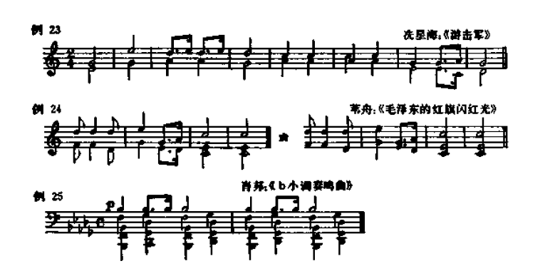
  * **符干的长度**一般应保持**八度音程**的距离，假如符干连着许多符头时，符干的长度应是**符头间的距离加上八度音程的距离**；如果符头在上加三线以上，符千必须**延伸**到五线谐的第三线或第四线，如果符头在下加三线以下，符干必须**延伸**到五线谱的第三线或第二线
  * 许多音符用**共用符尾**连结在一起时，符干长度多半**长短不一**，这吋要使符杠与**最近符头**的距离**至少距离八度**；符杠的方向与符头的总趋向**基本平行**
* **附点**写在音符符头和休止符右边的**间内**，而不记在线上
* **休止符**在单符干记谱中，永远记在**第三线上**，或**靠近第三线的地方**；**二分休止符**写在第三线的**上面**，**全休止符**写在第四线的**下面**
  * 在**双符干记谱**中，各声部**共同休止**时，休止符的记法与单符干记谱**相同**；**个别声部休止**时，休止符写在五线谱的**边缘**，或五线谱**之外**，这时全休止符和二分休止符要使用**加线**，全休止符写在加线的**下面**，二分休止符写在加线的**上面**
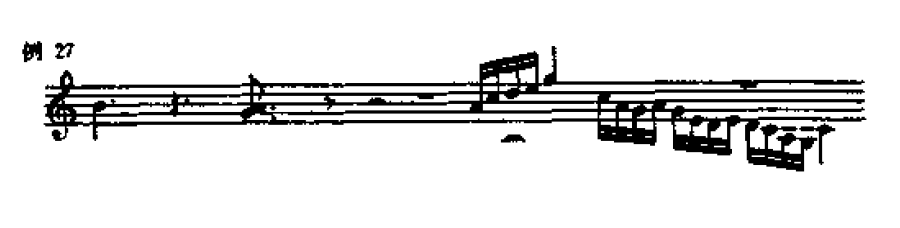
## 谱号
* 在五线谱上要确定音的高低，必须用**谱号**来标明；这种谱号记在五线谱的某一条线上，便使这条线具有了固定的音级名称和高度，同时也确定了其他各线上或间内的音级名称和高度
  * **G谱号**表示小字一组的g，记在五线谱的**第二线**上，叫**高音谱号**；另外有记在第一线上的，叫古法国式高音谱号
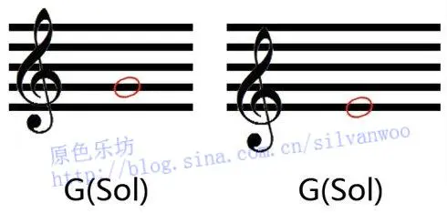
  * **F谱号**表示小字组的f，记在五线谱的**第四线**上，叫**低音谱号**，另外还有记在第五线上的，叫倍低音谱号
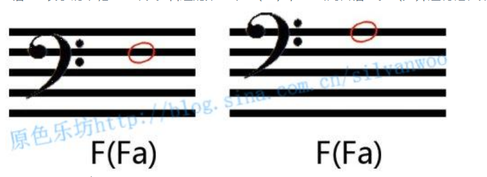
  * **C谱号**表示小字一组的C，可记在五线谱的**任何一线**上
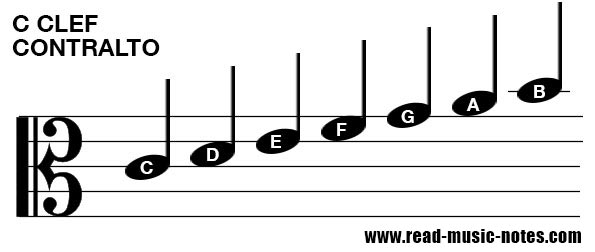
  * 目前被采用的C谱号有：**C三线谱号**（中音谱号）为中音提琴所用，有时也为长号所用；**C四线谱号**（次中音谱号）为大提琴、大管和长号所用；其他C谱号一般较少应用
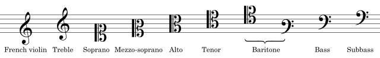
* 各种谐号可以**单独使用**，也可以**连接起来使用**，如高、低音谱号所组成的**大谱表**便是
## 增长音值的补充记号
* 在记谱法中，除了应用基本音符时值以外，还应用其它的一些**增长音值的符号**
  * **附点**是记在符头右边的小圆点，带有一个附点的音符，增长原有音符时值的**二分之一**，带有两个附点的音符，增长原有音符时值的**四分之三**
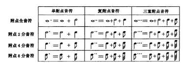
    * 附点也同样适用于**休止符**
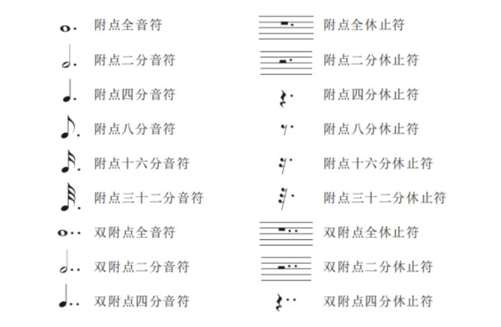
    * 附点音符的符头若在五线谱的间内，附点写在符头的**旁边**，若在线上，附点则写在线的**上面或下面**
  * **延音线**用在音高相同的两个或两个以上的音符上时，表示它们要唱成一个音，它的长度等于**这些音符的总和**
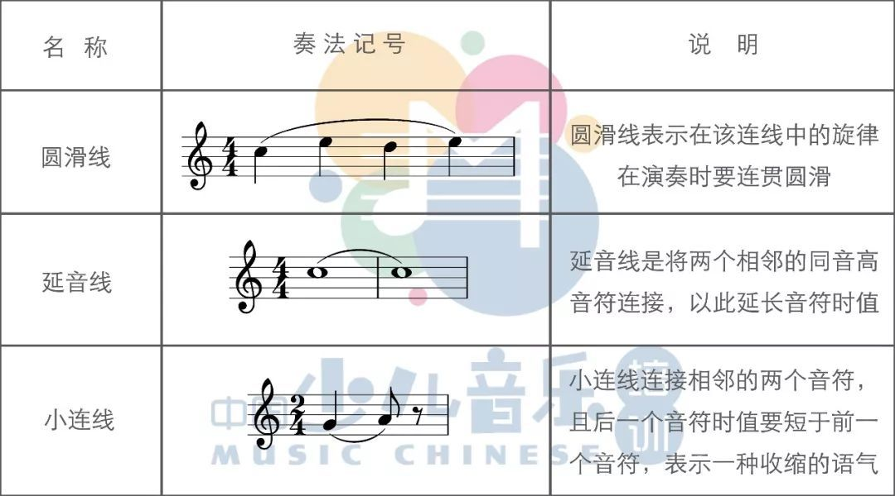
    * 在单声部音乐中，连线永远写在和符干**相反的方向**；使一行五线谱上记有两个声部时，则高声部连线**朝上弯**，低声部的连线**朝下弯**，要是多于两个声部时，连线则**分写在两边**
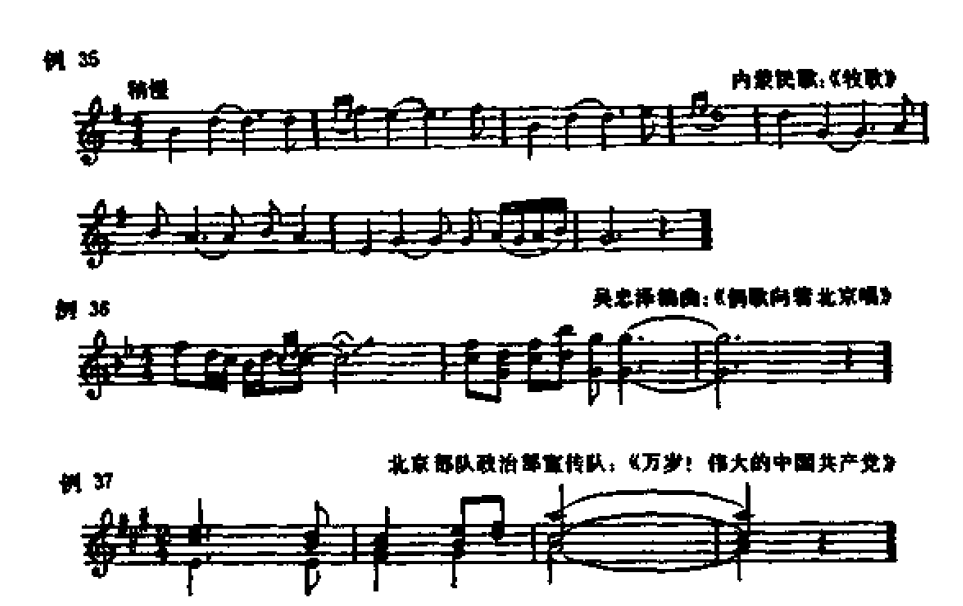
  * **延长号**的记号是在半圆形中间加一圆点，在单声部乐曲中它写在音符和休止符的上面，表示按作品的风格、演奏者的意图可**自由地增长**音符或休止符的时值；在多声部音乐中延长号也可以记在音符或休止符的下面
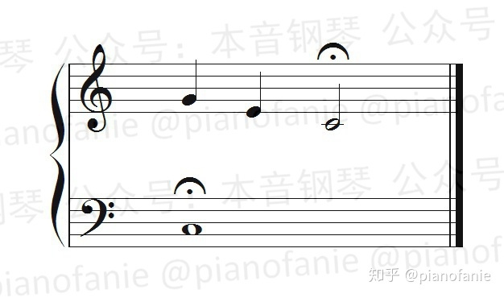
    * 延长号也可以记在**小节线**上，表示小节之间的**片刻休止**
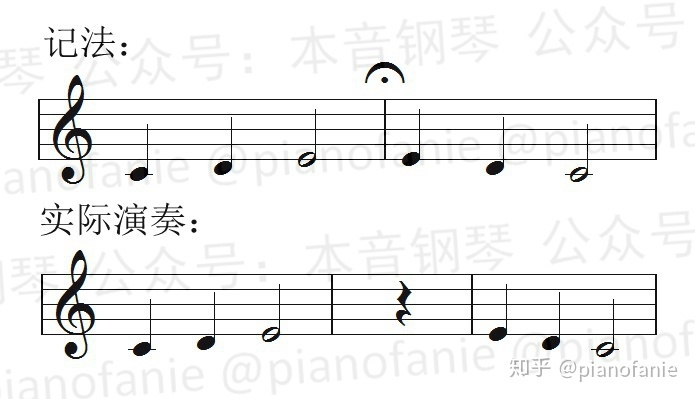
    * 记在**双纵线**上的延长号则表示乐曲的**结束或告一段落**
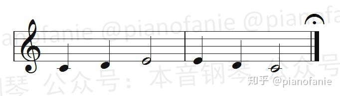

## 变音记号
### 变音记号的定义
- **变音记号**（accidentals）是音乐记谱中用来**改变音符音高**的符号
  - 常见的变音记号包括**升号**（sharp）、**降号**（flat）和**还原号**（natural）
  - 变音记号在五线谱中放在**音符的左边**，用来指示该音符音高的改变

### 升号的使用
- **升号**（♯）将音符**提高半音**
  - 在**五线谱线上**记写升号时，升号符号应放置在**线的中央**，穿过升号的**竖线**
  - 在**五线谱间内**记写升号时，升号符号应放置在**间的中央**，确保**竖线不过间**

### 降号的使用
- **降号**（♭）将音符降低半音
  - 在**五线谱线上**记写降号时，降号符号应放置在**线的中央**，穿过**降号的圆形部分**
  - 在**五线谱间内**记写降号时，降号符号应放置在**间的中央**，确保**圆形部分在间内**

### 还原号的使用
- **还原号**（♮）将在小节内被升号或降号改变过的音符**恢复到原来的音高**
  - 在**五线谱线上**记写还原号时，竖线**穿过还原号的中央**，竖线**位于线上**
  - 在**五线谱间内**记写还原号时，还原号的竖线应**位于间的中央**，确保竖线**不过间**

### 提醒变音记号
- **提醒变音记号**（courtesy accidental），也称为礼貌变音记号，是在乐谱中用来提醒演奏者某个音符的音高已经被还原或受到了改变
  - 这些记号尽管**不影响实际音高**，但有助于避免演奏者因转调或音高变化而产生混淆
  - 通常出现在小节线前或音高变更后，作为一种**视觉提示**

### 其他变音记号
- **重升号**（double sharp）和**重降号**（double flat）是另一类变音记号
  - 重升号（𝄪）将音符**提高两个半音**
  - 重降号（𝄫）将音符**降低两个半音**
  - 这类变音记号在五线谱中的记法**与升号和降号相似**
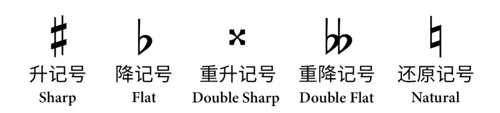

### 记号的作用范围
- 变音记号在**一个小节内**有效，影响**记号后的所有同名音符**
  - 当**小节线**（bar-line）出现时，变音记号的**效力终止**，下一小节的同名音符**恢复原调**
- **还原符号**可以**抵消**小节内的上一次变音

### 音符连接线的特殊性
- **音符连接线**（Accidental ties）是指当**两个相同音高的音符**用**连线**连接在一起时，第一个音符上的变音记号会**影响第二个音符**
  - 音符连接线确保变音记号的效力**持续到第二个音符**，而**不需要**在第二个音符上再次标注变音记号
  - 例如：如果第一个音符是升C（C♯），且用音符连接线连接到第二个C，则第二个C也是升C（C♯）
  - 连接线**只影响被连接的音符**，所以其后的相同音高的音符会**回归变音前的状态**

- **延音线**（slur）是一条曲线，用于连接两个或多个不同音高的音符，表示这些音符应该连贯地演奏
  - 延音线不**改变音符的音高**，只影响演奏的连贯性
  - 延音线连接音符的**符干**，而音符连接线连接**符头**

## 调号和转调的表示
### 调号
#### 调号的定义
- **调号**（key signature）是位于**五线谱谱号后**，用以指示乐曲所使用的音阶中的**固定升降音符的符号**
  - 调号决定了**乐曲的调性**（tonality）
  - 调号使演奏者无需在每个相应音符前都标注变音记号，**简化了乐谱的书写**

#### 调号的作用范围
- 调号**在整个乐曲或乐段内有效**，直到出现**新的调号**为止
  - 调号影响**整个乐曲中的同名音符**
  - 当调号改变时，新调号从改变处开始生效

#### 常见的调号类型
- 常见的调号包括**升号调**（sharp keys）和**降号调**（flat keys）
  - 升号调的调号以升号符号（♯）表示
  - 降号调的调号以降号符号（♭）表示

#### 调号的记写规则
- 调号位于**谱号**（如高音谱号、低音谱号）**之后**，在乐谱的**最开始处**显示
  - 调号中的升号或降号**按固定顺序排列**
  - 调号的排列顺序在高音谱号和低音谱号上**有所不同**

#### 升号调的排列顺序
- **升号调的调号顺序**：F♯, C♯, G♯, D♯, A♯, E♯, B♯
  - C大调（C major）和a小调（a minor）没有升降号
  - G大调（G major）和e小调（e minor）有1个升号：F♯
  - D大调（D major）和b小调（b minor）有2个升号：F♯, C♯
  - A大调（A major）和f♯小调（f♯ minor）有3个升号：F♯, C♯, G♯
  - E大调（E major）和c♯小调（c♯ minor）有4个升号：F♯, C♯, G♯, D♯
  - B大调（B major）和g♯小调（g♯ minor）有5个升号：F♯, C♯, G♯, D♯, A♯
  - F♯大调（F♯ major）和d♯小调（d♯ minor）有6个升号：F♯, C♯, G♯, D♯, A♯, E♯
  - C♯大调（C♯ major）和a♯小调（a♯ minor）有7个升号：F♯, C♯, G♯, D♯, A♯, E♯, B♯

#### 降号调的排列顺序
- **降号调的调号顺序**：B♭, E♭, A♭, D♭, G♭, C♭, F♭
  - C大调（C major）和a小调（a minor）没有升降号
  - F大调（F major）和d小调（d minor）有1个降号：B♭
  - B♭大调（B♭ major）和g小调（g minor）有2个降号：B♭, E♭
  - E♭大调（E♭ major）和c小调（c minor）有3个降号：B♭, E♭, A♭
  - A♭大调（A♭ major）和f小调（f minor）有4个降号：B♭, E♭, A♭, D♭
  - D♭大调（D♭ major）和b♭小调（b♭ minor）有5个降号：B♭, E♭, A♭, D♭, G♭
  - G♭大调（G♭ major）和e♭小调（e♭ minor）有6个降号：B♭, E♭, A♭, D♭, G♭, C♭
  - C♭大调（C♭ major）和a♭小调（a♭ minor）有7个降号：B♭, E♭, A♭, D♭, G♭, C♭, F♭

#### 高音谱号中的调号
- **高音谱号**（treble clef）中，调号的记写顺序与排列规则
  - 升号从F线上开始，依次是F♯, C♯, G♯, D♯, A♯, E♯, B♯
  - 降号从B线上开始，依次是B♭, E♭, A♭, D♭, G♭, C♭, F♭

#### 低音谱号中的调号
- **低音谱号**（bass clef）中，调号的记写顺序与排列规则
  - 升号从F线上开始，依次是F♯, C♯, G♯, D♯, A♯, E♯, B♯
  - 降号从B线上开始，依次是B♭, E♭, A♭, D♭, G♭, C♭, F♭

### 转调的表示
#### 转调的定义
- **转调**（modulation）是指在乐曲中**从一个调性转换到另一个调性**的过程
  - 转调可以**增加音乐的变化和丰富性**
  - 在乐谱中，转调通常通过**新的调号**（key signature）或**临时变音记号**（accidentals）来表示

#### 调号改变
- 在五线谱中，转调通常通过**改变调号**来表示
  - 新的调号会出现在**转调的起始位置**，替代原有的调号
  - 新调号后的所有音符将**按新调号的规定演奏**

#### 不同写法
- 如果在乐曲中间要更换调号时，可能有三种情况
  * **增加原有升号或降号的数目**；这时只要在更换调号处的小节线右边**写出新调的调号**便可以了
  * **减少原有升号或降号的数目**；这时需要在更换调号处的小节线左边将多余的变音记号**还原**，在小节线的右边**写出新调的调号**
  * **升号变降号或降号变升号**；这时需要在更换调号处的小节线左边将原来的变音记号**还原**，在小节线的右边写出**新调的调号**

#### 临时变音记号
- 有时，转调并不需要改变调号，而是通过**临时变音记号**（accidentals）来实现，变音记号标在需变音的音符在小节中的**第一次出现**时
  - 临时变音记号在**一个小节内**有效
  - 临时变音记号后的**所有同名音符**在该小节内按新音高演奏

## 省略记号
* **移动八度记号**记在五线谱的上面，表示虚线范围以内的音**移高八度**；记在五线谱的下面，表示**移低八度**
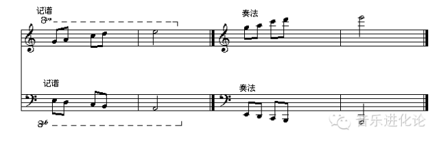
* **重复八度记号**用**数字8**记在音符的上面或下面，表示该音要**高八度或低八度重复**；假如在较长的时间内重复八度时，则表示**虚线以内的音**要高八度或低八度重复
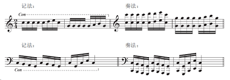
* **长休止记号**在五线谱的**第三线**上记录，并写出所要休止的小节数
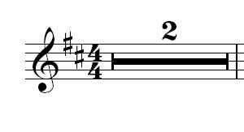
* **震音记号**表示一个音或一个和弦，两个音成两个和弦**迅速均匀地交替**；用**斜线**标记，斜线的数目和符尾的数目相同
  * 一个音或一个和弦迅速均匀地交替时，斜线的记法如下：**全音符**的震音，音符在三线以上，斜线记在三线以下，反之则在三线以上；**比全音符小**的震音，斜线横穿符干，如果符干**带有符尾**，斜线则和符尾平行，这时计算斜线的数目应包括符尾的数目；震音的总时值与音符的时值**相等**
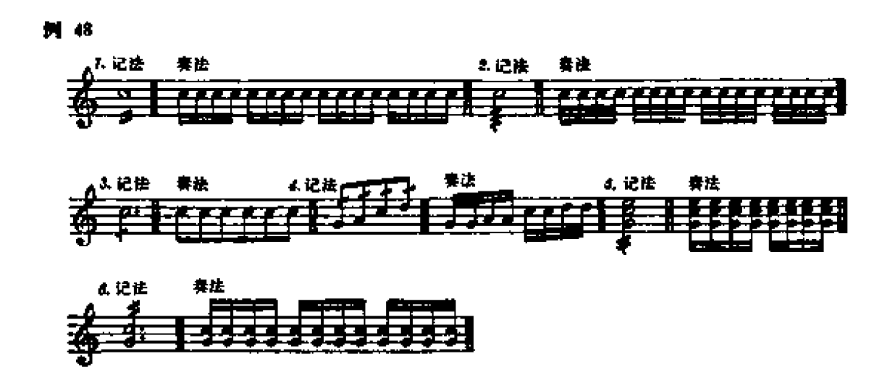
  * 两个音或两个和弦迅速均匀地交替时，斜线记在两个音或两个和弦之间**靠近记写符尾的地方**；震音的**总时值**等于两个音或两个和弦中的一个
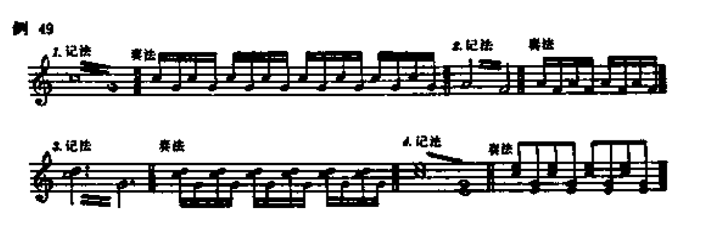
* 乐曲部分或全部重复时，可使用**反复记号**
  * 乐曲中某一**旋律音型**重复时，用**斜线**表示，斜线的**数目**与音符的**符尾数目**相同
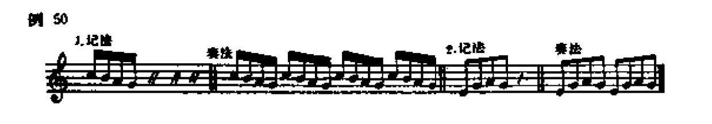
  * 乐曲中一次或多次重复某一**小节**时，用记号表示；该记号记在两小节之间的**小节线上**，则表示前面两小节的旋律型再重复一次
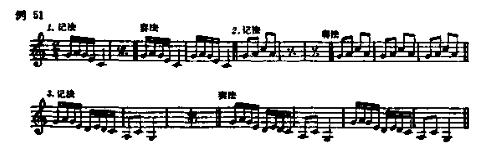
  * 乐曲中**较大的重复**，用反复记号表示
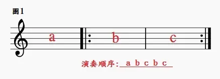
  * 如果乐曲是**从头重复**，则前面的记号可省去；假如重复时**结尾不同**，可用记号1、2来标明，第一次唱1，第二次略去1唱2
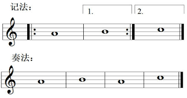
  * 如果乐曲是由三部分组成，而**第三部分是第一部分的重复**，那么可以不抄第三部分，而在第二部分结尾处写上**D.C.（从头反复）**，并在第一部分结束处记一**Fine**或“曲终”字样，表示乐曲的结束，有时也用记在双纵线上的**延长号**来标明；如果重复不是从头开始，那么在第一部分开始重复处记一记号，在第二部分结束处写上**D.S.（从记号开始反复）**，或记一记号亦可
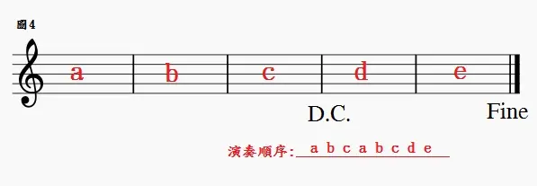
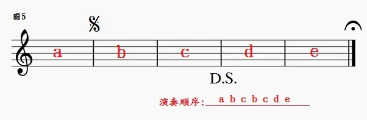
  * 假如重复后有一段**不弹奏而跳过**，则通常在跳过开始的地方，及跳过结束的地方注一记号，并注明字样
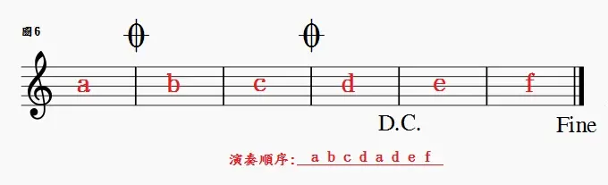
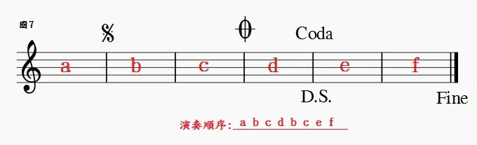
## 演奏法的记号
* **连音奏法**是用连线来标记的，表示连线内的不同音高的音要奏（唱）得**连贯**；连音奏法的连线大都记在五线谱的**上面**，很少记在下面
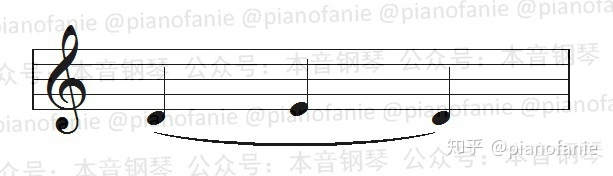
* **断音奏法**有三种，分别以**圆点**、**三角**及**圆点加弧线**来标记，表示某些音或和弦要**断续地弹奏**；在单声部音乐中，**断音记号**通常记在**符头那边**，在一行五线谱上记有两个声部并不用相同的符干时，则分别记在**相反的方向**
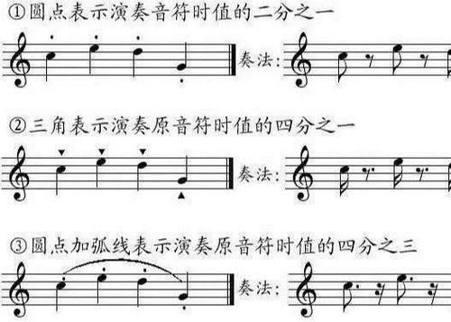
* **持续音奏法**有两种：一种是用**短横线**来表示，一种是用**短横线加圆点**来表示，前者表示该音稍强奏并**充分保持该音的时值**，后者表示该音稍强奏，同时**各音稍分离**；持续音记号和断音记号一样，在单声部音乐中，通常记在**符头那边**，在多声部音乐中也可以记在相反的方向
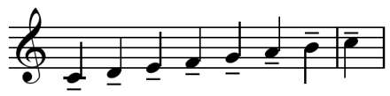
* 在民间音乐的演奏演唱中，**滑音的奏法**是很有特色的，它的记号一般用**曲线或箭头**来标明
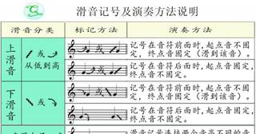
* 将和弦中各音由下而上很快地分散弹奏叫做**琶音奏法**；用垂直的曲线放在和弦之前来标记，有时也用小音符来标记
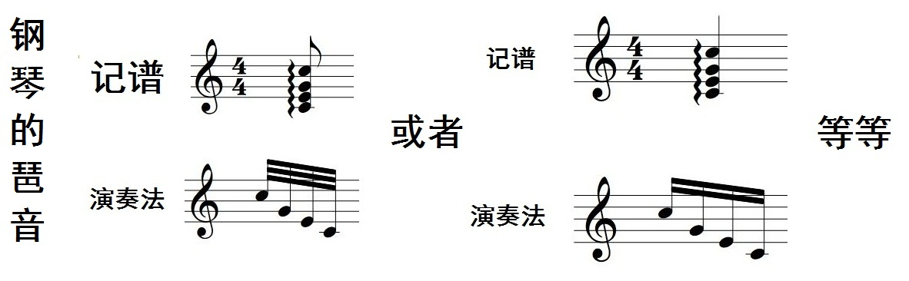