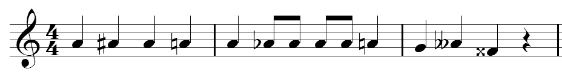
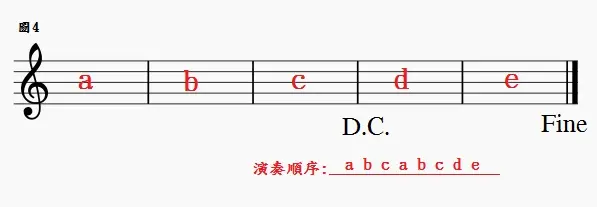
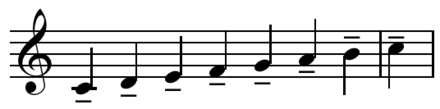

# 记谱法
* 记录乐曲的方法叫做**记谱法**
* 在历史发展过程中，由于乐曲的不同内容和需要而产生了各种各样的记谱方法；如为古琴用的**古琴谱**，为锣鼓用的**锣鼓谱**，以及我们现在普遍应用的**五线谱**、**简谱**和在我国民间应用的**工尺谱**等便是
## 音符与休止符
* 用以记录不同长短的音的进行的符号叫做**音符**
* 用以记录不同长短的音的间断的符号叫做**休止符**

* **音值**的基本**相互关系**是：每个较大的音值和它最近的较小的音值的比例是2与1之比，例如：全音符等于两个二分音符；全休止符等于两个二分休止符等
## 五线谱
* 用来记载音符的五条平行横线叫做**五线谱**；五线谱的五条线和由五条线所形成的间，都是**自下而上**计算的

* 假使音乐作品是写在数行五线谱上，那么，这数行五线谱还要用**连谱号**连结起来；连谱号包括**起线**（连结数行线谐的垂直线）和**括线**（连数行五线谱的括弧）两个组成部分，括线分**花的**和**直的**两种

* **花括线**为钢琴、风琴、手风琴、竖琴、扬琴、琵琶等乐器记谱使用，**直括线**为合奏、合唱、乐队记谱用，在**总谱**中用直括线来连接**同类乐器**，把它分成完全的或不完全的乐器组，有时在直括线之外还加上**辅助括线**（花的或直的）来连接同种乐器
* 在总谱中，**独唱独奏声部**如果只包括一两行五线谱的话，左边只画一条**起线**，而不加括线

* 为了标记过高或过低的音，在五线谱的上面或下面还要加上许多短线，这些短线叫**加线**，在五线谱上面的叫**上加线**，下面的叫**下加线**；由于加线而产生的间，叫做**加间**，在五线谱上面的加间叫**上加间**，下面的叫**下加间**
* 加线和加间的计算方法是：上加线和上加间**由下向上**计算；下加线和下加间**由上向下**计算

## 音符与休止符的写法
* 音符包括**三个组成部分**；**符头**（空心的或实心的椭圆形标记）、**符干**（垂直的短线）和**符尾**（连在符干一端的旗状标记）

  * 音符的**符头**可以记在五线谱的**线上与间内**，符头在五线谱上的位置愈高音愈高，反之音符符头的位置愈低音也愈低
  * 用单符干记谱，符头在**第三线以上**时，符干**朝下**，写在符头的**左边**多在**第三线以下**时，符干**朝上**，写在符头的**右边**，符头在第三线上，符干朝上朝下**都可以**，根据邻近的符千方向而定；假如同一符干连着许多符头而又分布在第三线的上下时，则以**离第三线最远的符头**为准

  * **符尾**永远写在符干的右边并弯向符头
  * 许多音符组成一组时，用共同的符尾（**符杠**）相连，这时符干的方向仍以**离第三线最远的符头**为准；两条以上的符杠要**平行**

* **单声部音乐**永远用**单符干**记谱；**多声部音乐**只有在**节奏相同**的情况下，才可以用**单符干**记谱，**节奏不同**时，则用**双符干或多符干**记谱
  * 用双符干记**二声部乐曲**时，高声部符干朝**上**，低声部符干朝**下**，声部交错时，其**原则不变**

  * **符干的长度**一般应保持**八度音程**的距离，假如符干连着许多符头时，符干的长度应是**符头间的距离加上八度音程的距离**；如果符头在上加三线以上，符千必须**延伸**到五线谐的第三线或第四线，如果符头在下加三线以下，符干必须**延伸**到五线谱的第三线或第二线
  * 许多音符用**共用符尾**连结在一起时，符干长度多半**长短不一**，这吋要使符杠与**最近符头**的距离**至少距离八度**；符杠的方向与符头的总趋向**基本平行**
* **附点**写在音符符头和休止符右边的**间内**，而不记在线上
* **休止符**在单符干记谱中，永远记在**第三线上**，或**靠近第三线的地方**；**二分休止符**写在第三线的**上面**，**全休止符**写在第四线的**下面**
  * 在**双符干记谱**中，各声部**共同休止**时，休止符的记法与单符干记谱**相同**；**个别声部休止**时，休止符写在五线谱的**边缘**，或五线谱**之外**，这时全休止符和二分休止符要使用**加线**，全休止符写在加线的**下面**，二分休止符写在加线的**上面**

## 谱号
* 在五线谱上要确定音的高低，必须用**谱号**来标明；这种谱号记在五线谱的某一条线上，便使这条线具有了固定的音级名称和高度，同时也确定了其他各线上或间内的音级名称和高度
  * **G谱号**表示小字一组的g，记在五线谱的**第二线**上，叫**高音谱号**；另外有记在第一线上的，叫古法国式高音谱号

  * **F谱号**表示小字组的f，记在五线谱的**第四线**上，叫**低音谱号**，另外还有记在第五线上的，叫倍低音谱号

  * **C谱号**表示小字一组的C，可记在五线谱的**任何一线**上

  * 目前被采用的C谱号有：**C三线谱号**（中音谱号）为中音提琴所用，有时也为长号所用；**C四线谱号**（次中音谱号）为大提琴、大管和长号所用；其他C谱号一般较少应用

* 各种谐号可以**单独使用**，也可以**连接起来使用**，如高、低音谱号所组成的**大谱表**便是
## 增长音值的补充记号
* 在记谱法中，除了应用基本音符时值以外，还应用其它的一些**增长音值的符号**
  * **附点**是记在符头右边的小圆点，带有一个附点的音符，增长原有音符时值的**二分之一**，带有两个附点的音符，增长原有音符时值的**四分之三**

    * 附点也同样适用于**休止符**

    * 附点音符的符头若在五线谱的间内，附点写在符头的**旁边**，若在线上，附点则写在线的**上面或下面**
  * **延音线**用在音高相同的两个或两个以上的音符上时，表示它们要唱成一个音，它的长度等于**这些音符的总和**

    * 在单声部音乐中，连线永远写在和符干**相反的方向**；使一行五线谱上记有两个声部时，则高声部连线**朝上弯**，低声部的连线**朝下弯**，要是多于两个声部时，连线则**分写在两边**

  * **延长号**的记号是在半圆形中间加一圆点，在单声部乐曲中它写在音符和休止符的上面，表示按作品的风格、演奏者的意图可**自由地增长**音符或休止符的时值；在多声部音乐中延长号也可以记在音符或休止符的下面

    * 延长号也可以记在**小节线**上，表示小节之间的**片刻休止**

    * 记在**双纵线**上的延长号则表示乐曲的**结束或告一段落**

## 变音记号
* 用来表示升高或降低基本音级的记号叫做**变音记号**
  * **升记号**(#)表示将基本音级升高半音
  * **降记号**(b)表示将基本音级降低半音
  * **重升记号**(×)表示将基本音级升高两个半音（一个全音）
  * **重降记号**(bb)表示将基本音级降低两个半音（一个全音）
  * **还原记号**表示将已经升高或降低的音还原

* 变音记号可以记在五线谱的**线上和间内**：可以记在**音符的前面**和**谱号的后面**
* 记在谱号后面的变音记号叫做**调号**；在未改变新调之前，它对音列中**所有同音名的音**都生效
* 更换调号如果发生在一行乐谱的**开始处**，这时应该在**前一行乐谱的未尾处**将所要更换的调号先记写清楚，并将最后一节小节线**向前移**，以便记写新调的调号
* 如果在乐曲中间要更换调号时，可能有三种情况
  * **增加原有升号或降号的数目**；这时只要在更换调号处的小节线右边**写出新调的调号**便可以了
  * **减少原有升号或降号的数目**；这时需要在更换调号处的小节线左边将多余的变音记号**还原**，在小节线的右边**写出新调的调号**
  * **升号变降号或降号变升号**；这时需要在更换调号处的小节线左边将原来的变音记号**还原**，在小节线的右边写出**新调的调号**

* 直接放在音符前的变音记号叫做**临时记号**，临时记号只限于**同音高的音**有效，而且只到**最近的小节线**为止，在多声部乐曲中临时记号往往只对**一个声部**有效；为了提醒废除前面所用的临时记号，有时在后面加上另外的**还原记号**

## 省略记号
* **移动八度记号**记在五线谱的上面，表示虚线范围以内的音**移高八度**；记在五线谱的下面，表示**移低八度**

* **重复八度记号**用**数字8**记在音符的上面或下面，表示该音要**高八度或低八度重复**；假如在较长的时间内重复八度时，则表示**虚线以内的音**要高八度或低八度重复

* **长休止记号**在五线谱的**第三线**上记录，并写出所要休止的小节数

* **震音记号**表示一个音或一个和弦，两个音成两个和弦**迅速均匀地交替**；用**斜线**标记，斜线的数目和符尾的数目相同
  * 一个音或一个和弦迅速均匀地交替时，斜线的记法如下：**全音符**的震音，音符在三线以上，斜线记在三线以下，反之则在三线以上；**比全音符小**的震音，斜线横穿符干，如果符干**带有符尾**，斜线则和符尾平行，这时计算斜线的数目应包括符尾的数目；震音的总时值与音符的时值**相等**

  * 两个音或两个和弦迅速均匀地交替时，斜线记在两个音或两个和弦之间**靠近记写符尾的地方**；震音的**总时值**等于两个音或两个和弦中的一个

* 乐曲部分或全部重复时，可使用**反复记号**
  * 乐曲中某一**旋律音型**重复时，用**斜线**表示，斜线的**数目**与音符的**符尾数目**相同

  * 乐曲中一次或多次重复某一**小节**时，用记号表示；该记号记在两小节之间的**小节线上**，则表示前面两小节的旋律型再重复一次

  * 乐曲中**较大的重复**，用反复记号表示

  * 如果乐曲是**从头重复**，则前面的记号可省去；假如重复时**结尾不同**，可用记号1、2来标明，第一次唱1，第二次略去1唱2

  * 如果乐曲是由三部分组成，而**第三部分是第一部分的重复**，那么可以不抄第三部分，而在第二部分结尾处写上**D.C.（从头反复）**，并在第一部分结束处记一**Fine**或“曲终”字样，表示乐曲的结束，有时也用记在双纵线上的**延长号**来标明；如果重复不是从头开始，那么在第一部分开始重复处记一记号，在第二部分结束处写上**D.S.（从记号开始反复）**，或记一记号亦可

  * 假如重复后有一段**不弹奏而跳过**，则通常在跳过开始的地方，及跳过结束的地方注一记号，并注明字样

## 演奏法的记号
* **连音奏法**是用连线来标记的，表示连线内的不同音高的音要奏（唱）得**连贯**；连音奏法的连线大都记在五线谱的**上面**，很少记在下面

* **断音奏法**有三种，分别以**圆点**、**三角**及**圆点加弧线**来标记，表示某些音或和弦要**断续地弹奏**；在单声部音乐中，**断音记号**通常记在**符头那边**，在一行五线谱上记有两个声部并不用相同的符干时，则分别记在**相反的方向**

* **持续音奏法**有两种：一种是用**短横线**来表示，一种是用**短横线加圆点**来表示，前者表示该音稍强奏并**充分保持该音的时值**，后者表示该音稍强奏，同时**各音稍分离**；持续音记号和断音记号一样，在单声部音乐中，通常记在**符头那边**，在多声部音乐中也可以记在相反的方向

* 在民间音乐的演奏演唱中，**滑音的奏法**是很有特色的，它的记号一般用**曲线或箭头**来标明

* 将和弦中各音由下而上很快地分散弹奏叫做**琶音奏法**；用垂直的曲线放在和弦之前来标记，有时也用小音符来标记
