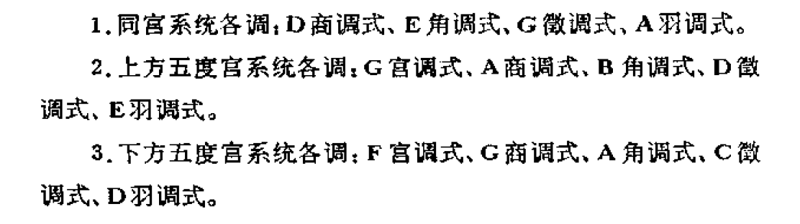
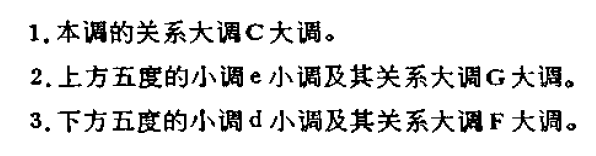

# 转调及交替调式
## 转调的总概念
* 在音乐创作中，为了音乐内容的需要，和求得更为丰富的调式表现能力，在乐思的构成和发展中，往往采用不同的调式、调性，这样便产生了调与调之间的相互接触
  * 这种调接触之间的**相互关系**，在某种意义上和调式中各音级上的和弦的相互关系很相似；即主要调和主和弦相似，作为**稳定的调**，而其他各调侧与调式中其他音级上的和弦相似，作为**不稳定的调**，而倾向于主调
* 在音乐作品中，由一个调（主调、稳定的调）进行到另一个调（副调、不稳定的调）叫做**转调**；转调可以改变**调号**或不改变调号，改变**调式**或不改变调式，但在不改变调式的情况下，一定要改变**调式的主音**

## 转调在音乐表现中的意义
* 转调在音乐表现中的意义有**两方面**
  * 调接触之间的关系和调式中各音级上的和弦的关系相似，因此，当音乐离开了主调进入新调时，就破坏了稳定性而要求**继续进行**，这样就形成了主调与新调间的稳定与不稳定的**对比关系**
  * 每一个调都具有它自己的**特殊色彩**，因此，转调对改变调的色彩方面，有着重要的意义
## 转调的类别
* 从**乐曲结构**的关系上来看，可有**对置式的**和**过渡式的**两种
* **时间**上来看，可分为**转调**和**临时转调**两种；前者是代替主调的新调被巩固，并用它来结束音乐的段落，后者的转调（也称为离调）是暂短的、过渡性质的，它不是发生在段落的结束处，而是在段落的中间
* 从**调的远近关系**上来看，可以有**同音列的转调**（同宫系统转调），这种转调的特点是，只转移**主音**，不改变音列，因此调式必然不同
  * 在大小调体系中，**关系大小调的转调**，也属于这一种
* 只改变音列，不改变主音的转调，叫做**同主音转调**，这种转调的调式也必然是不同的
  * **同主音大小调的转调**也属于这一类
* 又转移主音并又改变音列的转调，叫做**不同主音不同音列的转调**
  * 这种转调有两种情况，即**同调式**或**不同调式**
* 构成同主音转调和不同主音、不同音列转调的两个调，必然属于不同宫系统，因此，这两种转调，也可称为**不同宫系统转调**
* 从**构成转调的方法**上看，用模进的手法构成的转调，可称为**模进转调**，用逐渐过渡的手法构成的转调，可称为**过渡转调**，用色彩对比的手法构成的转调，使人感到突然的，可称为**突然转调**等等 
## 调的关系
* 在音乐中，调与调之间都有着一定的关系，正象调式中音与音之间有着一定的关系一样，这些关系有远有近，对音乐表现有着不同的表现意义
  * 在调的接触中，关系较远的调最能激起新的**色彩对比**，而关系较近的调，则往往给人一种**平和自然**之感
* 调的关系的远近，可以从许多方面来看，其中最基本的是看两调之间的**共同音**及**共同和弦**的多少，共同音及共同和弦越多的调，其关系就越近，否则，就越远
  * 例如，**同宫系统各调**，**关系大小调**，被认为是关系最密切的调，就是因为这些调之间的音都是**共同的**，另外，相差一个调号的宫系统和大小调的关系也是近的，因为这些调式之间，只有一个音不同
* 调号相同或相差一个升降号的各调，被称为**近关系调**
  * C宫调式的**近关系调**是

  * C大调的**近关系调**是

  * a小调的**近关系调**是

* 此外，与原调相差**两个调号**的调，以及大调式的小下属调、小调的大属调与原调的关系是**二级关系调**

* 其余的调被认为是关系较远的调，称为**远关系调**
* 调式各音完全相同的同宫系统**各调关系的远近**也是有区别的
  * 在这种情况下，确定调关系的远近就不能根据共同音的多少，而要根据两调主音的**音程关系**
## 转调方法
* 第一种最简单的转调方式，即**调性对置**，意思即直接将两种调性的前后段落连接在一起，中间**不加任何过渡**
  * 这种转调方法一般适用于一个乐段结束之后，需要**接到下一个新的段落的情况**；对置是最简单但也是最生硬的转调方式，实际应用中一般表现为大小二度、三度的直接转调
  * 大多数流行音乐往往不出现转调段落，而一旦出现转调段落，则往往都是运用了**调性对置**的方式

* 除了调性对置之外，其它的转调手法都需要有**共同和弦**以及**转调和弦**来进行过渡；共同和弦即**两个调中都存在的和弦**，而转调和弦中最主要的便是**属七和弦**，这个属七和弦一般是**新调的属七和弦**
  * 这里以C大调转到F大调为例，C大调和F大调的**共同和弦**有C和弦、Dm和弦、F和弦以及Am和弦，所以在转调时我们随意选取一个即可；为了转到F大调，我们的**转调和弦**应该选择C7和弦，C7和弦后面接上F和弦，即初步完成了转调
  * 这种**近关系转调**由于两个调之间的共同和弦较多，故而比较容易实现

* 对于一些**远关系转调**的情况，由于两个调之间**没有共同和弦**，于是我们便需要想别的办法来实现转调
  * 在远关系转调中，一种常用的转调方式即**等音和弦转调**；这种方法一般都会运用到**增六和弦**，并凭借在音响效果上小七度等于增六度的等音变换进行转调
    * 这里以C大调转到B大调为例，C大调的属七和弦是G7和弦，组成音为G、B、D、F，其中G与F之间是**小七度**，运用小七度等于增六度的原理，我们有F=E#，而G与E#之间的音程是**增六度**

    * B大调的重属导七和弦为E#dim7和弦，这个和弦我们一般将七音降低半音，故而其构成音为E#、G#、B、D，在和声大调的框架下考虑，我们将六级音，也就是G#降低半音，变成了G，和弦构成音随即变为E#、G、B、D，于是，E#与G之间便是减三度的关系
    * 我们取这个和弦的**第一转位**，有G、B、D、E#，G与E#之间便有了我们需要的增六度关系了；前面我们在C大调的属七和弦中已经得到了G、B、D、E#这个和弦，这样一来，C大调和B大调便通过这个和弦连接起来了

    * 这种通过增六和弦进行等音和弦转调的方法一般仅适用于主音**相差一个半音**的两个调
  * 运用同主音大小调的**调性交替**，也可以帮助我们实现转调
    * 众所周知，C大调的音阶构成是C、D、E、F、G、A、B、C，而c小调则是C、D、Eb、F、G、Ab、Bb、C；可以发现，二者有区别的几个音分别是三级音、六级音和七级音，这几个音刚好可以成为寻找转调中介和弦的突破口

    * 以C大调转到Ab大调为例，相比于C大调，Ab大调中有Db、Eb、Ab和Bb四个变化音，而C大调与Ab大调**不存在任何共同和弦**；但是，c小调与Ab大调有共同和弦，我们可以**借用c小调的和弦**，c小调的下属和弦构成为F、Ab、C，我们在C大调中直接把这个和弦借用过来，便可以成为一个“共同和弦”

  * 在和声学发展的几百年里，出现了不少约定俗成的和弦，这些和弦有很多都不是自然调式内的和弦，而正是因此，它们便可以作为**转调时的中介和弦**
    * 举一个比较有代表性的和弦，**那不勒斯和弦**，表现为调内降Ⅱ级三和弦，在C大调内构成音为Db、F、Ab，这样一个三和弦就为我们提供了两个变化音，这对于转调来说就很友好了

## 交替调式
* 在调关系的扩大和发展的接触中，为了丰富调式的表现力，因而使一些调关系较近的调**结合在一起**，成为一个新的**调式体系**；在这个体系中，两个调的主音在乐曲中，具有同等重要的作用，这种新体系叫做**交替调式**
  * **交替调式**是调式的一种，是在调关系的扩大和发展中产生的，共有**三种基本类型**
    * **同音列交替**：即构成交替的两个调的音列是**共同的**，不同的只是**调式的主音**，当然调式也必然是不同的；在这一类的**交替调式**中，最多见的是具有强烈支持力的**四度五度关系的调**，如徽宫交替、徽商交替、商羽交替等

      * 在大小调体系中，**关系大小调的交替**（平行交替）也属于这一类
    * **同主音交替**：即构成交替的两个调的主音是共同的，不同的只是调式的音列，自然调式也是不同的
      * 在大小调体系中，**同主音大小调的交替**，也属于这一类
    * **不同主音不同音列交替**：即构成交替的两调式的主音、音列全不同，但调式可能是相同的或是不相同的