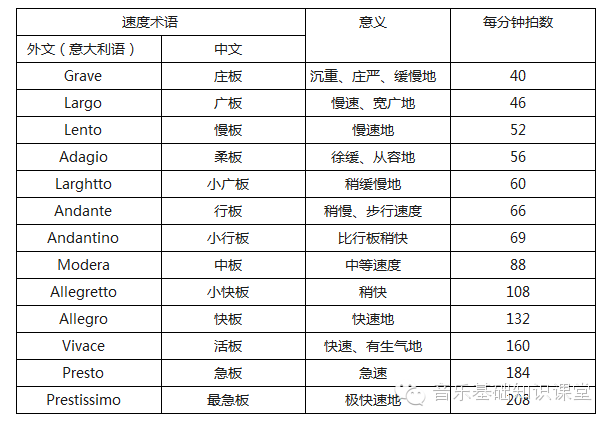
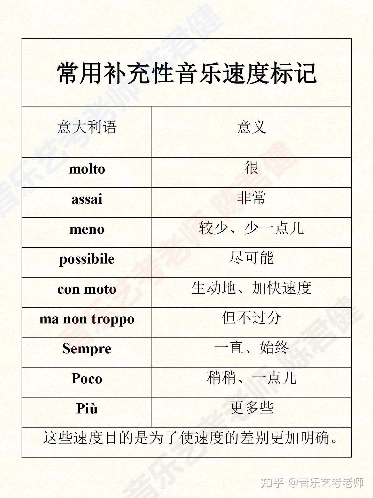
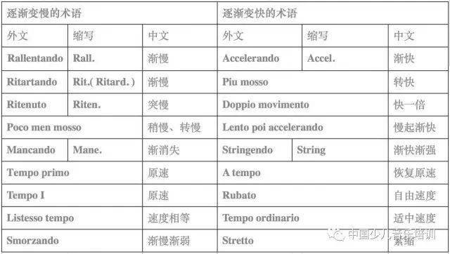
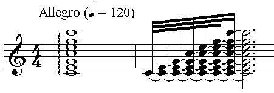
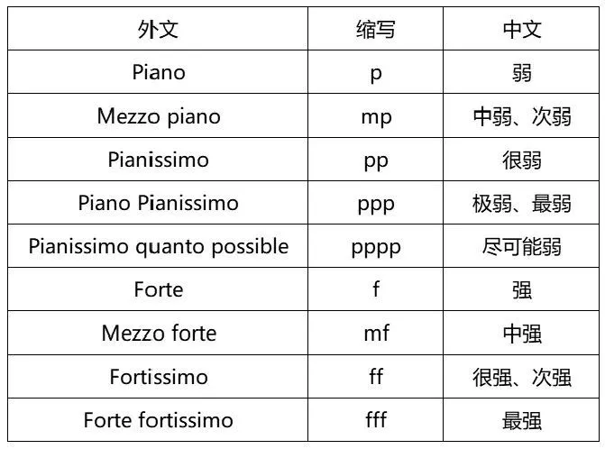
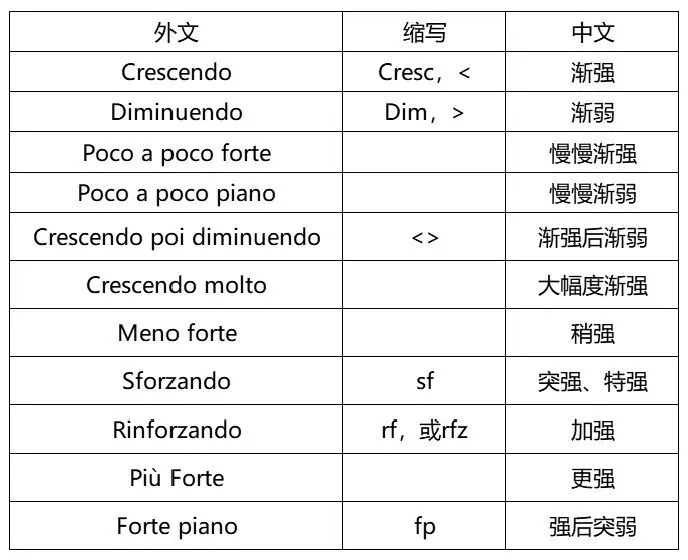
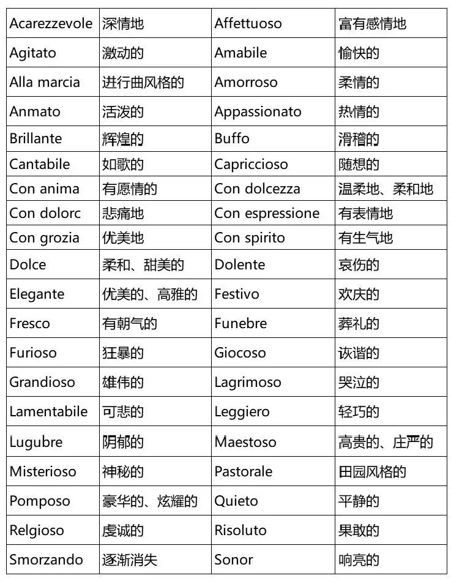
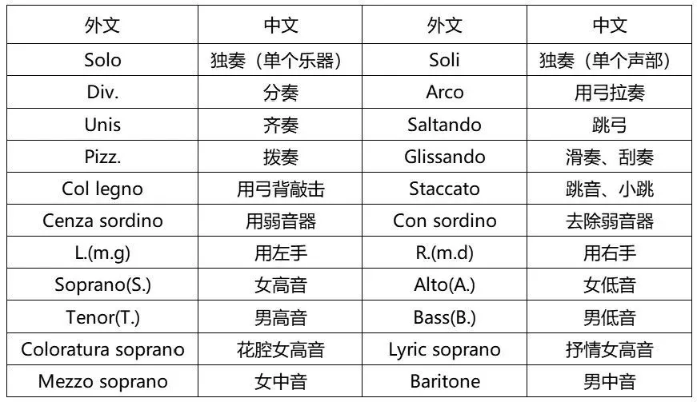
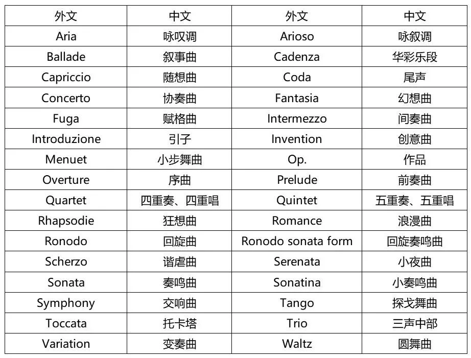

# 音乐的速度与力度
## 速度标记
* 音乐进行的快慢叫做**速度**；速度基本上分三类：慢的、快的和适中的
* 音乐的速度是用**文字**来标明的，记在乐曲或乐章的开端五线谱的上面。在乐曲中间速度**有改变**时，则需记以新的速度用语
  * 至今广泛使用的速度用语是**意大利文**，但许多作曲家也用**本国的文字**来标记，或标有**两种速度用语**（意大利文、本国文字）
* 下面列举一些**速度的基本标记**

* 为了表明**速度的细微差异**，往往还采用一些**补充性的速度标记**

* 当乐曲的速度**逐渐加快或减慢**时，则用下列标记

* 当乐曲的**速度较自由**时则用**tempo rubato**来表示
* 以上速度用语只能**大致地表明**乐曲的速度，要准确地标明音乐的速度，则需要依靠一种确定速度的仪器——**节拍机**来说明

* 即表示以**四分音符**为单位，**每分钟演奏120次**
## 速度在音乐表现中的意义
* 音乐的速度和乐曲的内容是**密切相关**的，速度如定得不正确，会**严重地歪曲音乐形象**
  * 但有时为了艺术上的目的，将一支旋律用不同的速度处理而获得**不同的音乐形象**则是**完全可以**的
* 一般地说，表现激动、兴奋、欢乐、活泼的情绪，是与**快速度**相配合的；田园风的、比较抒情的则往往和**适中的速度**相配合，而颂赞歌、挽歌、沉痛的回忆等则多与**慢速度**相配合
## 力度标记
* 音乐中音的**强弱程度**叫做**力度**；下面列举一些**力度的基本标记**
* 强弱程度**固定**的

* 逐渐**改变强度**的

## 力度在音乐表现中的意义
* 力度和音乐中的其他要素一样，在音乐表现中是非常重要的，是不应忽视的；音乐力度的强或弱和**乐曲的内容**有着密切的关系
  * 例如**摇篮曲**总是用较轻的声音来演唱或演奏的，这类音乐的内容与强的声音是有矛盾的；而**隆重的、胜利的、具有战斗性的乐曲**，却需要用强的声音来演唱或演奏，这类音乐的内容与轻的声音是有一定距离的
* 利用力度的变化还可以获得**鲜明的强弱对比**，来有力地塑造音乐形象
## 其他术语
* **表情术语**

* **演奏法术语**

* **曲体术语**
