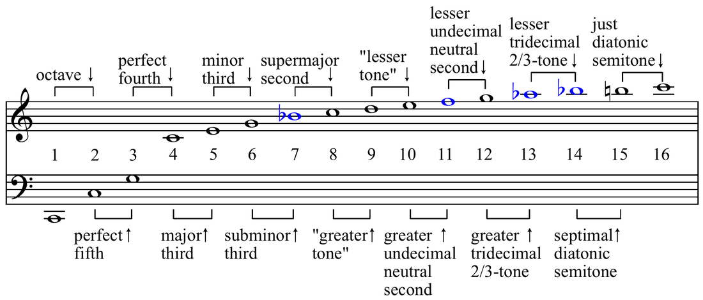
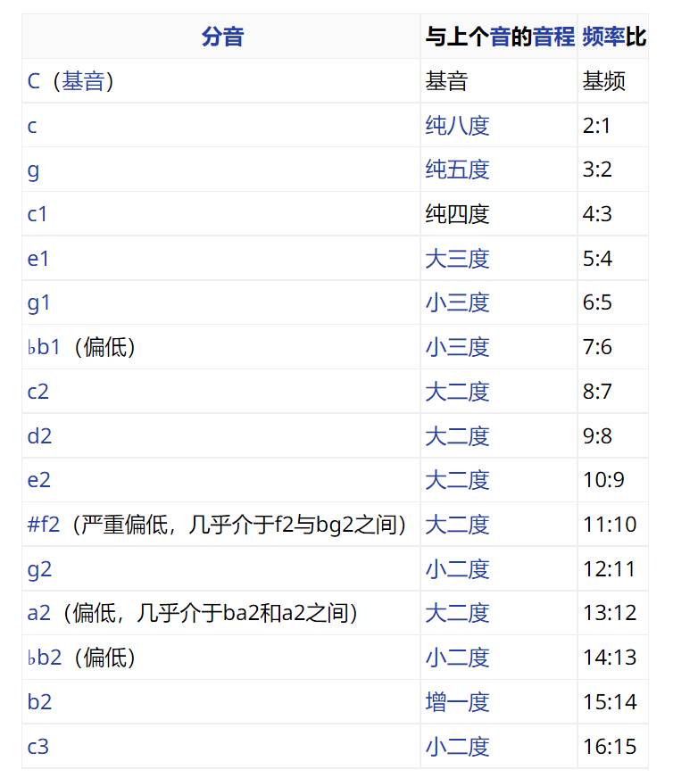
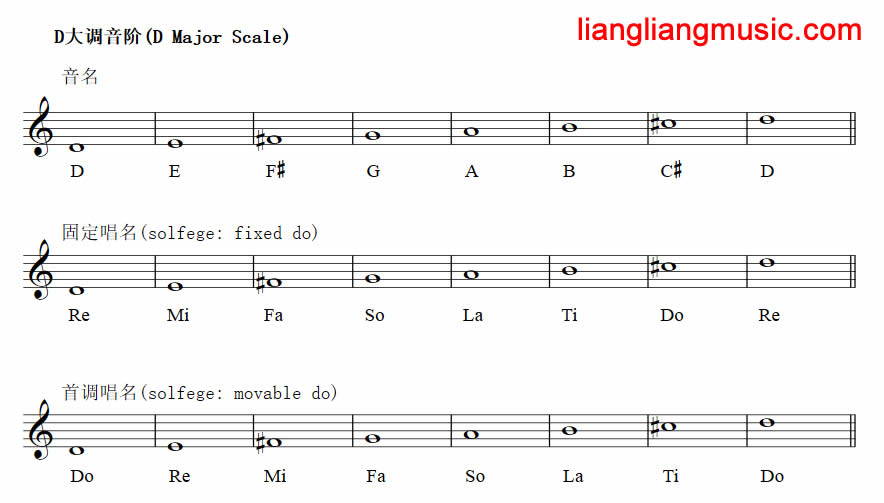
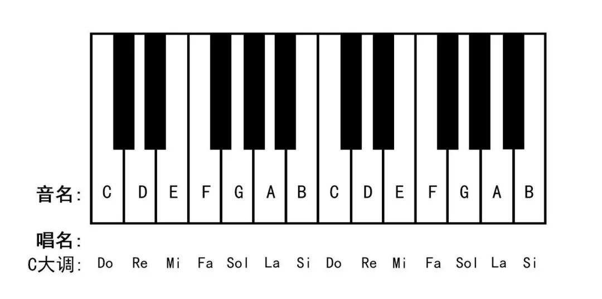
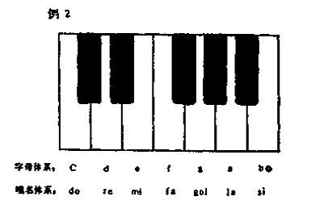
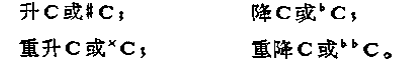
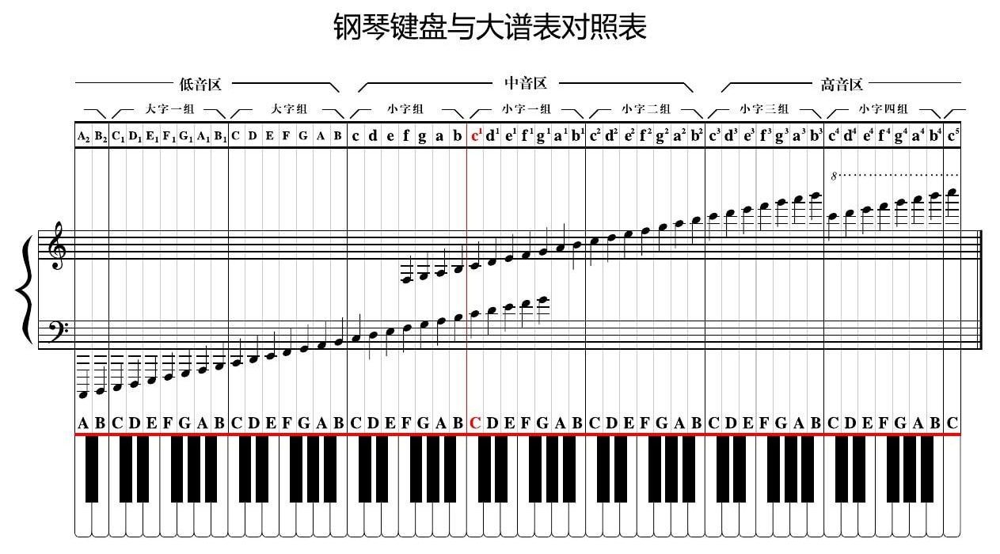
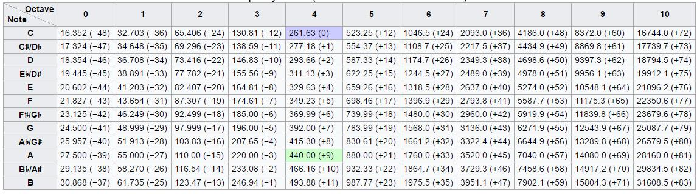
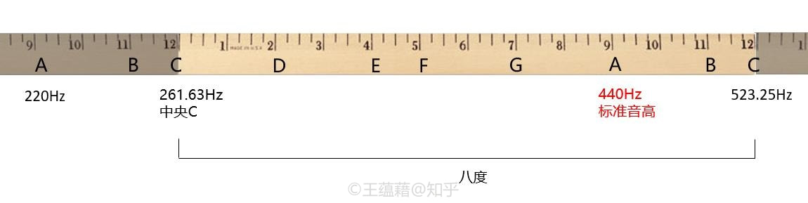

# 音及音高
## 音
* 音是由于**物体的振动**而产生的，在自然界中能为我们人的听觉所感受的音是非常多的，但并不是所有的音都可以作为音乐的材料；音总共有四种性质
  * 音的**高低**是由于物体在一定时间内的振动次数（**频率**）而决定的；振动次数多，音则高，振动次数少，音则低
  * 音的**长短**是由于音的**延续时间**的不同而决定的；音的延续时间长，音则长，音的延续时间短，音则短
  * 音的**强弱**是由于**振幅**（音的振动范围的幅度）的大小而决定的；振幅大，音则强，振幅小，音则弱
  * **音色**则由于发音体的性质、形状及其泛音的多少等而不同
* 音的以上四种性质，在音乐表现中都是非常重要的，但音的**高低和长短**则具有更为重大的意义；假如将歌的音高或音值加以改变的话，音乐形象就会立即受到严重的破坏
* 由于音的**振动状态**的规则与不规则，音被分为**乐音**与**噪音**两类；音乐中所使用的**主要是**乐音，但噪音也是音乐表现中不可缺少的组成部分
* 我们平时所听到的某一个音，都不只是一个音在响，而是许多个音的结合，这种声音叫做**复合音**
  * 复合音的产生是由于发音体（以弦为例）不仅**全段**在振动，它的**各部分**（二分之一、三分之一、四分之一…等）也分别的同时在振动
  * 由发音体**全段**振动而产生的音做**基音**，也就是最易听见的声音，由发音体**各部分**振动而产生的音叫做**泛音**，一般不容易听见
  * 弦乐器中，在空弦上奏出的是**自然泛音**；在“按住的”弦上（一指按弦，另一指轻触弦）奏出的是**人工泛音**
* **泛音列**（Harmonic series），又称**分音列**（一般分音列包括基音，而泛音列不包括基音），指的是频率是基音频率的**整数倍**的一系列的声音，这些声音都是**纯音**，可分别用**正弦波**表示
  * 假设基音或**第一分音**的基频为f，则频率为2f（弦长为二分之一）的音称为**第二分音**或**第一泛音**，频率为3f的音称为第三分音或第二泛音（下图是C为基音的**泛音列**）

  * 通常，乐器上发出的每个音都是基音和上方泛音的**复合音**，唯一的例外是**音叉**；相邻泛音间音程与频率比列表如下图

## 音名与唱名
* **音名**就是**音高的名称**，即C、D、E、F、G、A、B，分别对应钢琴上从左到右的**七个白键**
  * 需要区别不同八度的音高时，则会在音名后加上数字，如中央C是c1，高八度是c2，低八度是c
  * 音名都是**固定音高**，钢琴上的同一个琴键，总是对应同样的字母，无论在什么调中；调号前的字母是什么，就代表第一个音的音高是什么
* 在演唱旋律时为方便唱谱而采用的名称称**唱名**；自然大调式中的七个基本音级分别唱作do、re、mi、fa、sol、la、si，对应简谱中的1，2，3，4，5，6，7
  * 唱名又分两大类，**固定唱名**（fixed do）和**首调唱名**（movable do）
  * **固定唱名**中，每个音的唱名和音名一一对应，C对应Do，D对应Re，**永远不变**，无论它是什么调
  * 而首调唱名是**跟调相关**，比如C Major（C大调）中，Do对应C，Re对应D，而D Major（D大调）中Do对应D，Re对应E；唱名随着调的不同而不同，**每个大调**的第一个音都是Do，第二个音都是Re

* 在同种音律中，音名和音高的关系是**绝对的**，而唱名和音高的关系一般是**相对的**；唱名系统是一个**音高可以平移的体系**，在与主音Do保持固定音程的条件下，所有唱名的音高都可以跟随Do一同平移任意个半音

## 乐音体系 音列 音级
* 在音乐中使用的、有固定音高的音的总和，叫做**乐音体系**
  * 在乐音体系中，常用的音有**88个**，包括钢琴中的白键和黑键，共有八十八个琴键< A2 – C5 >；除此之外的音在音乐中差不多是**不用的**
  * 德国生产的**蓓森朵芙牌钢琴**有97个< C2－ C5>琴键，所以也有**97个**的说法
* 抽取部分乐音体系中的音，按照上行或下行次序排列起来，叫做**音列**
* 乐音体系中的各音叫做**音级**；音级有基本音级和变化音级两种
  * 乐音体系中，七个具有独立名称的音级叫做**基本音级**；钢琴上**白键**所发出的音是与基本音级相符合的
  * 基本音级的名称是用**字母**和**唱名**两种方式来标记的，钢琴上五十二个白键**循环重复**地使用七个基本音级名称

  * 两个相邻的具有同样名称的音叫做**八度**，即频率比为2：1；八度之所以能够**循环**，是因为从声音的频率上看，八度正好是把一个音的频率从它本身**升高了一倍**
  * 升高或降低基本音级而得来的音，叫做**变化音级**；基本音级**升高半音**用“升”或“#”来标明，**降低半音**用“降”或“b”来标明，**升高全音**用“重升”或“×”来标明，**降低全音**用“重降”或“bb”来标明

## 音的分组
* 为了区分**音名相同而音高不同**的各音，将音列分成许多“组”
* **亥姆霍兹音高记号法**在**欧洲**比较通行；**国内**老的乐理教材大多学习苏联，音高的标记也遵照亥姆霍兹音高记号法
  * 在音列中央的一组叫做**小字一组**，它的音级标记用**小写字母**在**右上方**加数字1来表示，如c1、d1、e1等
  * 比小字一组高的组顺次定名为：**小字二组**、小字三组、小字四组、小字五组；小字二组的标记用小写字母并在右上方加数字2来表示，如c2、d2、e2等，其他各组依此类推
  * 比小字一组低的组，依次定名为**小字组**、**大字组**、**大字一组**及**大字二组**
  * 小字组各音的标记用**不带数字的小写字母**来表示，如c、d、e等；大字组用**不带数字的大写字母**来标记，如C、D、E等；大字一组用**大写字母**并在**右下方**加数字1来标明，如C1、D1、E1等

* **科学音高记号法**诞生于**美国**，后来被国际标准化组织在上世纪50年代定为**国际标准**
  * 把**从C开始的一个八度**设定为一个**音组**，音组中的音名用**大写英文字母**CDEFGAB和**升降符号**标记；每个音组都把C作为音组的第一个音，B作为音组的最后一个音
  * 人耳的听力极限在20Hz - 20,000Hz左右，随年龄稍有衰减，这个频率区间跨度大约在十个八度，所以使用**十一个音组**就能完全将人耳听力范围涵盖在内
  * 于是，我们可以用数字0-10来标记这十一个音组，最低一个的音组对应数字0，最高一个对应数字10；在标记音高时，音名的**大写字母在前**，**数字在后**，如中央C标记为C4，标准音高A440记为A4

## 标准A与中央C
* 我们将**440Hz**（精确到整数）定义为所有音名的参照点，叫做“**标准音高**”；标准音高上的音名是A，因此也被叫做“A440”
  * A440在**流行乐**最为通用，不过，在**交响乐团**中标准音高会有不同的规定，如纽约爱乐乐团标准音高设为A=442Hz，波士顿交响乐团使用A=441Hz，而欧洲许多乐团则使用A=443Hz；如果标准音高变了，那么其他所有音名的音高都会**随之升高或者降低**
* 在标准音高下方的第一个C叫做“**中央C**”，频率约为**261.6Hz**，用科学音高记号法表示为**C4**，用亥姆霍兹音高记号法表示为**c1**；标准音高就落在中央C和高音C的八度中间

## 音域及音区
* **音域**有总的音域和个别的人声或乐器的音域两种
  * **总的音域**是指音列的**总范围**，即从它的最低音到最高音（C2——c5）间的距离而言
  * **个别的人声或乐器的音域**是指在整个音域中**所能达到的那一部分**，如钢琴的音域是A2一C5
* **音区**是音域中的一部分，有高音区、中音区、低音区三种
  * 在**整个音域**中，小字组、小字一组和小字二组属于**中音区**；小字三组、小字四组和五组属**高音区**，大字组、大字一组和大字二组属**低音区**
  * 各种人声和各种乐器的音区划分，往往是**不相符合**的，如男低音的高音区是女低音的低音区等
