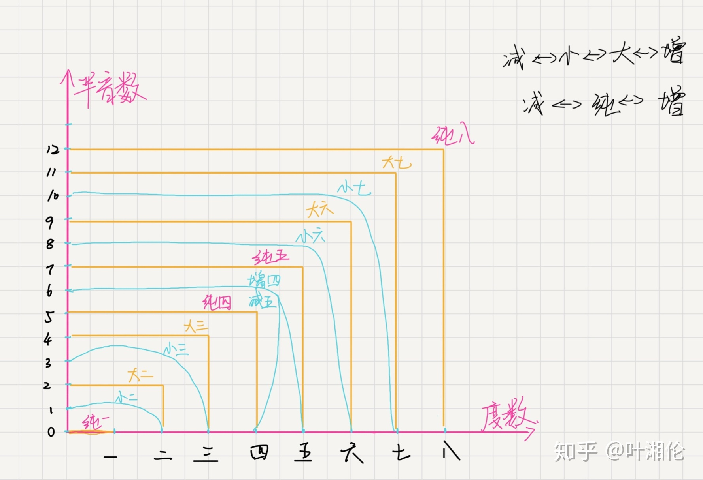
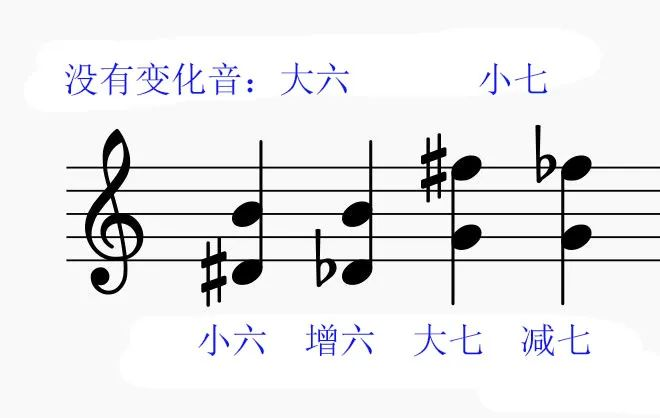

# 音程
## 音程 旋律音程 和声音程
* 两个音级在音高上的**相互关系**叫做**音程**
  * 先后弹奏的两个音形成**旋律音程**；同时弹奏的两个音形成**和声音程**
* 旋律音程书写时要**错开**，和声音程书写时要**上下对齐**，和声二度中的低音在左面，高音在右面，两个音紧靠在一起
* 音程中下面的音叫**根音**，上面的音叫**冠音**

* **旋律音程**依照它进行的方向分上行、下行、平行**三种**

* 所有和声音程和上行旋律音程都是**由根音读至冠音**；下行旋律音程和平行旋律音程，读时**要说明进行的方向**，例如C到平行的C，D到下面的G等
## 音程的级数和音数
* 音程是用音程的**级数**和**音数**来说明的，两者缺一不可
  * 音程在**五线谱**上所包含的**线与间的数目**，叫做音程的**度数**，五线谱的每一线或间就叫做一度，如同一线上或间内构成的音程叫做**一度**；相邻的线或间构成的音程叫做**二度**，相邻的线和间构成的音程叫做**三度**，余类推
  * 音程的**度数**用**阿拉伯数字**标记

  * 音程中所包含的**半音或全音的数目**，叫做音程的**音数**；音程的音数是用分数、整数和带分数来标记的，如1/2、1、3/2等，每半音为1/2，每全音为1
* 为了区别**级数相同而音数不同**的音程，还要用文字来加以说明，如大、小、增、减、倍增、倍减、纯等（一度，四度、五度八度没有大小，二度，三度、六度、七度没有纯）；这些说明语，写在表示音程级数的**前面**，如纯五度、大六度等
## 自然音程与变化音程
* **纯音程**、**大音程**、**小音程**、**增四度**和**减五度**叫做**自然音程**
* **纯一度**：音数为0的一度叫做纯一度，如C到C、#D到D等
* **小二度**：音数为1/2的二度叫做小二度，如E到F、F到G等
* **大二度**：音数为1的二度叫做大二度，如C到D、E到#F等
* **小三度**：音数为3/2的三度叫做小三度，如E到G、F到A等
* **大三度**：音数为2的三度叫做大三度，如C到E、D到#F等
* **纯四度**：音数为5/2的四度叫做纯四度，如C到F、F到B等
* **增四度**：音数为3的四度叫做增四度，如F到B、C到#F等
* **减五度**：音数为3的五度叫做减五度，如B到F、C到^b^G等
* **纯五度**：音数为7/2的五度叫做纯五度，如C到G、B到#F等
* **小六度**：音数为4的六度叫做小六度，如E到C、#F到D等
* **大六度**：音数为9/2的六度叫做大六度，如C到A、#D到#B等
* **小七度**：音数为5的七度叫做小七度，如G到F、C到B等
* **大七度**：音数为11/2的七度叫做大七度，如C到B，D到#C等
* **纯八度**：音数为6的八度叫做纯八度，如c1到c2、D到d等

* 在五线谱上相邻的两条线或两个间永远构成**三度音程**，隔开一条线的两条线或隔开一个间的两个间永远构成**五度音程**，隔开两条线的线和隔开两个间的间永远构成**七度音程**
* 增四度和减五度，由于它们包含着三个全音，故又称**三整音**或**三全音**
* 以上这些音程（纯音程、大音程、小音程及三整音），在音乐中具有**重要的作用**，从音乐史方面来说，它们**产生在其他音程之前**，因而被称为**基本音程**

* 一切增减音程（增四度、减五度除外）和倍增、倍减音程，都称做**变化音程**；变化音程是由自然音程变化而来的
* 将**冠音升高**或将**根音降低**，可使音程音数**增加**，反之将**冠音降低**或将**根音升高**，则可使音程音数**减少**
* 级数相同而音数不同的音程，其相互关系如下：**大音程和纯音程**增大变化**半音**时，成为**增音程**

* **小音程和纯音程**减少变化**半音**时，成为**减音程**；但减一度不可能，因为一度音程不管作何变动，都只能使音程的音数谱加
* 小音程**增大变化半音**，成为大音程，大音程**减少变化半音**，成为小音程

* 增音程**增大变化半音**成**倍增音程**，最常用的倍增音程有倍增一度、倍增四度、倍增八度
* 减音程**减少变化半音**成为**倍减音程**，最常用的倍减音程有倍减五度和倍减八度

