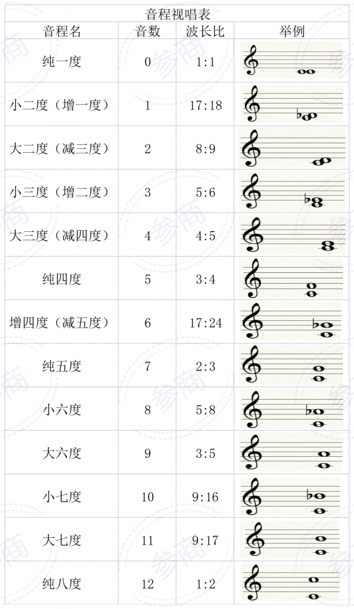
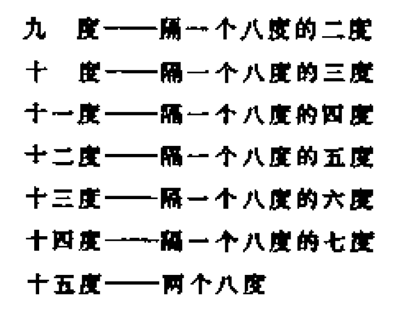
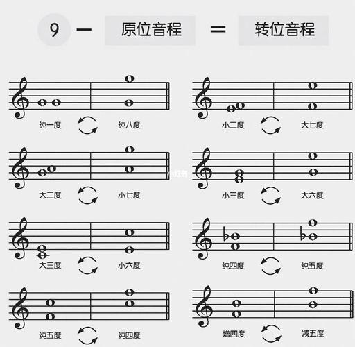
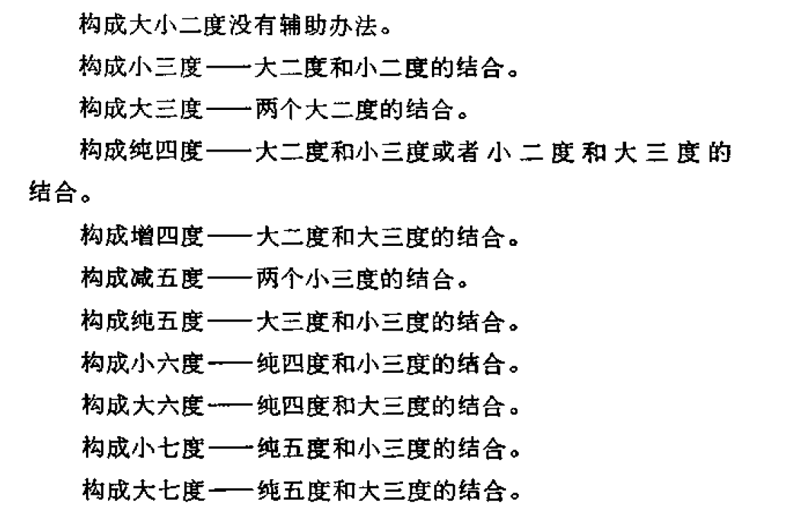
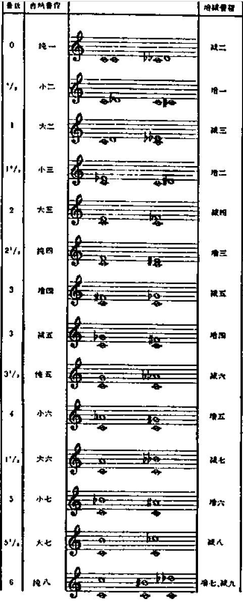
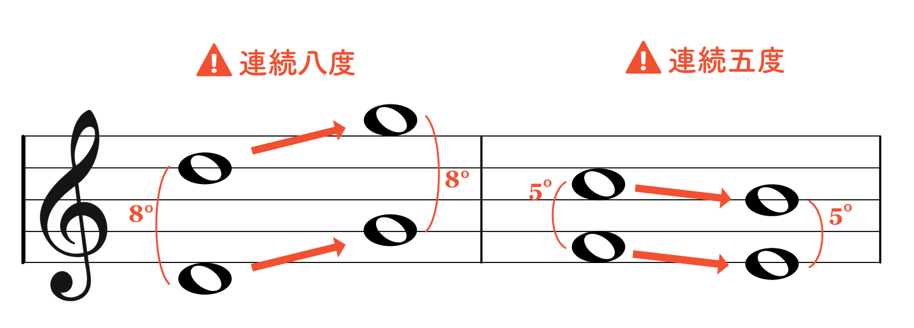

# 音程
## 音程 旋律音程 和声音程
* 两个音级在音高上的**相互关系**叫做**音程**
  * 先后弹奏的两个音形成**旋律音程**；同时弹奏的两个音形成**和声音程**
* 旋律音程书写时要**错开**，和声音程书写时要**上下对齐**，和声二度中的低音在左面，高音在右面，两个音紧靠在一起
* 音程中下面的音叫**根音**，上面的音叫**冠音**

* **旋律音程**依照它进行的方向分上行、下行、平行**三种**

* 所有和声音程和上行旋律音程都是**由根音读至冠音**；下行旋律音程和平行旋律音程，读时**要说明进行的方向**，例如C到平行的C，D到下面的G等
## 音程的级数和音数
* 音程是用音程的**级数**和**音数**来说明的，两者缺一不可
  * 音程在**五线谱**上所包含的**线与间的数目**，叫做音程的**度数**，五线谱的每一线或间就叫做一度，如同一线上或间内构成的音程叫做**一度**；相邻的线或间构成的音程叫做**二度**，相邻的线和间构成的音程叫做**三度**，余类推
  * 音程的**度数**用**阿拉伯数字**标记

  * 音程中所包含的**半音或全音的数目**，叫做音程的**音数**；音程的音数是用分数、整数和带分数来标记的，如1/2、1、3/2等，每半音为1/2，每全音为1
* 为了区别**级数相同而音数不同**的音程，还要用文字来加以说明，如大、小、增、减、倍增、倍减、纯等（一度，四度、五度八度没有大小，二度，三度、六度、七度没有纯）；这些说明语，写在表示音程级数的**前面**，如纯五度、大六度等
## 自然音程与变化音程
* **纯音程**、**大音程**、**小音程**、**增四度**和**减五度**叫做**自然音程**
* **纯一度**：音数为0的一度叫做纯一度，如C到C、D到D等
* **小二度**：音数为1/2的二度叫做小二度，如E到F、B到C等
* **大二度**：音数为1的二度叫做大二度，如C到D、E到#F等
* **小三度**：音数为3/2的三度叫做小三度，如E到G、F到A等
* **大三度**：音数为2的三度叫做大三度，如C到E、D到#F等
* **纯四度**：音数为5/2的四度叫做纯四度，如C到F、F到B等
* **增四度**：音数为3的四度叫做增四度，如F到B、C到#F等
* **减五度**：音数为3的五度叫做减五度，如B到F、C到^b^G等
* **纯五度**：音数为7/2的五度叫做纯五度，如C到G、B到#F等
* **小六度**：音数为4的六度叫做小六度，如E到C、#F到D等
* **大六度**：音数为9/2的六度叫做大六度，如C到A、#D到#B等
* **小七度**：音数为5的七度叫做小七度，如G到F、C到B等
* **大七度**：音数为11/2的七度叫做大七度，如C到B，D到#C等
* **纯八度**：音数为6的八度叫做纯八度，如c1到c2、D到d等

* 在五线谱上相邻的两条线或两个间永远构成**三度音程**，隔开一条线的两条线或隔开一个间的两个间永远构成**五度音程**，隔开两条线的线和隔开两个间的间永远构成**七度音程**
* 增四度和减五度，由于它们包含着三个全音，故又称**三整音**或**三全音**
* 以上这些音程（纯音程、大音程、小音程及三整音），在音乐中具有**重要的作用**，从音乐史方面来说，它们**产生在其他音程之前**，因而被称为**基本音程**

* 一切增减音程（增四度、减五度除外）和倍增、倍减音程，都称做**变化音程**；变化音程是由自然音程变化而来的
* 将**冠音升高**或将**根音降低**，可使音程音数**增加**，反之将**冠音降低**或将**根音升高**，则可使音程音数**减少**
* 级数相同而音数不同的音程，其相互关系如下：**大音程和纯音程**增大变化**半音**时，成为**增音程**

* **小音程和纯音程**减少变化**半音**时，成为**减音程**；但减一度不可能，因为一度音程不管作何变动，都只能使音程的音数谱加
* 小音程**增大变化半音**，成为大音程，大音程**减少变化半音**，成为小音程

* 增音程**增大变化半音**成**倍增音程**，最常用的倍增音程有倍增一度、倍增四度、倍增八度
* 减音程**减少变化半音**成为**倍减音程**，最常用的倍减音程有倍减五度和倍减八度

## 单音程与复音程
* 不超过八度的音程叫做**单音程**，超过八度的音程做**复音程**；**复音程**就是**单音程**加上一个、二个、三个四个**纯八度**而成
  * 因此**复音程**的名称就是在单音程的名称前面加上**隔开几个八度**而成；如隔开一个八度的大二度、腐开两个八度的大二度等
  * **不超过两个八度**的复音程，还有它**独立的名称**，这些名称是根据它所包含的级数而来的

  * 关于音程的性质（大、小、增，减、纯等），则按照单音程的名称而**不变**
## 音程的转位
* 音程的根音和冠音**相互颠倒**，叫做**音程转位**
  * 音程转位可以在**一个八度内**进行，也可以**超过八度**；音程转位时可以**移动根音或冠音**，也可以根音冠音**一齐移动**

* 音程转位时有下列规律
  * 所有音程分为**两组**，它们是可以相互颠倒的；可以颠倒的**音程总和**是9，因此我们若要知道某一音程转位后成几度音程，便可以从9中减去原来音程的级数

  * 除了纯音程外，其它音程转位后都成为**相反的音程**

## 构成和识别音程的方法
* 构成和识别音程的**基本方法**是根据音程的**音数和级数**；例如要在C上构成小七度时，首先要将音程的级数构成七度，然后再根据需要来调整音程的音数，求得所要构成的音程
  * 用这种方法来构成和识别音程，必须熟练地掌握**音程所包含的音数**，但这是相当困难的，所以这种方法在实际中应用得不多
* 构成和识别音程的第二种方法是利用**狭小音程**，但用这种方法必须首先掌握狭小的音程

* 构成和识别音程的第三种方法是将音程与**基本音级间的音程**作比较，根据级数相同而音数不同的各种音程的**相互关系**来求得结论
  * 例如要在C上构成小七度，首先和**基本音级**C到B这个音程来比较，C到B是大七度，故在C上构成小七度应是C到bB
  * 用这种方法来构成和识别音程比较简便，但须要记熟基本音级间所形成的各种音程
* 构成和识别广音程，则还可利用**音程转位**
  * 例如要D上构成大七度，可先向相反的方向构成小二度，再将它转位便可
## 等音程
* 两个音程孤立起来听时，具有**同样的声音效果**，但在乐曲中的意义和写法不同，这样的音程叫做**等音程**
* 等音程是由于**等音变化**而产生的；等音程有两类
  * 音程中的两个音不因为等音变化而更改音程的级数

  * 由于等音变化而更改音程的级数

* 从上表可以看出，每个**自然音程**（三整音除外）也就是最简单的和使用最多的音程，它们的等音程是某种**增减音程**
## 协和音程与不协和音程
* 按照和声音程在听觉上所产生的**印象**，音程可分为**协和的**及**不协和的**两类
* 听起来悦耳、融合的音程，叫**协和音程**
  * **极完全协和音程**：即声音完全合一的**纯一度**和几乎完全合一的**纯八度**
  * **完全协和音程**：即声音相当融合的**纯五度**和**纯四度**
  * **不完全协和音程**：即不很融合的**大小三度**和**大小六度**
  * 极完全协和音程和完全协音程的特性是声音有点**空**，而不完全协和音程的声音则较为**丰满**
* 听起来比较刺耳，彼此不很融合的音程叫做**不协和音程**
  * **大小二度**、**大小七度**及所有**增减音程**（包括增四、减五度音程）**倍增、倍减音程**都属于这一类
* 音的协和与不协和，除决定于物理方面的音的振动数比的**复杂程度**外，音程各音的**调式意义**也能够严重地改变音程的不协和性，例如孤立听一个小二度音程时，会感到非常刺耳，但在一定的调式体系中，在适当的条件下，却会变得柔和起来
* 除**三整音**外，一切增减音程的**等音程**和某些自然音程是相**符合**的，因而许多增减音程的等音程是**协和音程**
  * 由此似乎可以推论出，既然增减音程的等音程和协和音程相符合，那么它们的不协和只是**理论上的问题**而已
  * 其实不然，因为增减音程的不协和性，在一定的**调式体系条件**下，在音乐的**前后关系**中，是可以清楚地被听出来的
* 前面所讲的关于单音程的诸问题，也同样适用于相当于这些单音程的**复音程**
* 协和音程转位后仍为**协和音程**，不协和音程转位后仍为**不协和音程**
## 稳定音程与不稳定音程
* 在两个音的同时结合中，音程可分为**协和的**与**不协和的**两种；从构成音程各音的稳定与不稳定方面来看，音程又可分为**稳定的**与**不稳定的**两种
* 由**稳定音级**构成的音程，叫做**稳定音程**
  * 很难笼统地说哪些音程是稳定的，哪些是不稳定的，这只有对具体的音进行**具体的分析**后才能确定
  * 在**大小调体系**中，由Ⅰ、Ⅲ、Ⅴ级构成的音程是**稳定音程**
* 由不稳定音级或由一个稳定音级和一个不稳定音级所构成的音程都是**不稳定音程**
  * 不稳定音程由于它的不稳定，因此需要**解决**；解决不稳定音程最简单的方法就是使**不稳定音**进到最近的**稳定音**，解决时要避免**平行五度**和**平行八度**的进行
    * **平行五/八度**指的是乐曲的两个声部隔开**纯五/八度**作**平行进行**，就是指一个四部和弦中两个声部之间是五/八度关系，然后进行到下一个和弦时这俩声部之间还是五/八度关系

## 调式中的音程
* 在**不同的调式体系**中，或是在**同一调式的不同音级**上所构成的同一音程，其调式意义及表现特性都是**完全不同**的，因此，熟知各种调式体系中的各种调式所产生的音程，及这些音程产生在哪些调式音级上，是非常重要的
* 在**五声调式**中，只有**纯一度**、**大二度**、**小三度**、**纯四度**及这些音程的**转位音程**
* 在**六者调式**中，由于**清角**和**变宫**两音的加入，而产生了五声调式中所没有的**小二度音程**，另外也增加了许多别的新音程
* 在**七声调式**中，由于**清角**和**变宫**的同时加入（在雅乐音阶中是变徵和变宫，在燕乐音阶中是清角和闰），因而产生了五声调式和六声调中所没有的**增四度**和**减五度**音程，也增加了许多别的新音程
* **雅乐音阶**和**燕乐音阶**所产生的音程的类别和数量，和清乐音阶完全一样，所不同的只是在于产生这些音程的调式音级；由于这两种调式在实际的应用中不象清乐音阶那样普遍，故对这两种调试中所产生的音程，不再一一列举
* **自然大调**及**自然小调**中所产生的音程的类别和数量，以及产生这些音程的调式音级，和**清乐音阶**的**宫调式**及**羽调式**完全一样，这里不再赘述
* 在**和声调式**中，由于大调第Ⅵ级的降低，小调第Ⅶ级的升高，因而产生了自然大小调中所没有的**增二度**、**减七度**、**增五度**、**减四度**音程，这些音程由于为和声调式所特有，故又叫做和声调式的**特性音程**
* 如果已经熟知各种调式所产生的各种音程，那么要知道某一音程是属于何调是**不困难**的
  * 例如要找出bE到#F这个**增二度**属于何调，可根据
    * 增二度音程为和声调式的特性音程，因此一定属于**和声调式**
    * 又知增二度是产生在和声调式的**第Ⅵ级**与**第Ⅶ级**上，故可以肯定该音程是属于G和声大小调
## 不协和音程的解决
* 不协和音程进到协和音程，叫做**不协和音程的解决**
* 当不协和音程进行解决时，不稳定音按照其倾向**进到最近的稳定音**，稳定音可以**保持在原位不动**或**进到其他稳定音**；解决时要避免**平行五度**和**平行八度**的进行
* 增音程解决时要**使音程扩大**，减音程解决时则要**使音程缩小**
* 在解决不协和音程时，必须明确该音程所属的**调性**，也只有明确调性之后，才可能确定那些音是不稳定的，应如何进行解决

## 音程在音乐中的应用及其表现特性
* 孤立的一个音、一个和弦是不能表现什么音乐思想的，但**两个音**结合在一起，在一定的节奏和音色中，却能表现出**一定的情感**
* 音程的**旋律形式**与**和声形式**在音乐表现中是不相同的；旋律进行的**方向**对**旋律音程**的表现有着重大关系，而音程的**协和与不协和**、**稳定与不稳定**对**和声音程**的表现力则有着重大的意义
* 音程的大小、构成音程各音的调式意义以及节奏、音色等对音程的表现力有着重大的关系，由于乐曲前后的气势、风格、具体的思想内容、音乐思维体系的不同，同一音程也可能具有不同的意义
* 根据音程中两音之间的距离，音程被分为**狭的**（同度、二度、三度）和**广的**（四度、五度、六度、七度、八度等）两种
  * 旋律中应用得最多的是**狭音程**，广音程则用得较少
  * 由**狭音程**构成的曲调，一般具有**平和、安静**的感觉
  * 由**广音程**构成的旋律住住表现出一种**开阔、跳跃**的情感
* **旋律小二度**是旋律进行中**最典型最剧烈**的音程之一，**导音**的倾向与小二度的这一特点有关；我们可以随意抽出调式中的两个音，将它们构成**小二度**，并以同等的时值，同等的力度来弹奏它，在我的意识中，将会主观地将其中的一音理解为**基音**，而将另一音理解为这一基音的**上导音或下导音**
* **旋律大二度**，是自然调式体系中**旋律流畅进行的基本音程**，特别在**五声音阶调式**中，这一音程的特性，表现得十分清楚
* **旋律三度**，在大小调体系中和以五声音阶为基础的调式体系中，其表现特性有着**明显的不同**
  * 在**五声调式**中，**旋律小三度**和旋律大二度同样是**旋律流畅进行的基本音程**，在这里小三度音程的进行是**级进**而不是跳进；**旋律大三度**在五声调式中较少应用，偶尔出现时也不象在大小调体系中那样，表现出鲜明的大调调性的特性
  * 在**大小调体系**中，大三度永远表现出大调的特性，而小三度划永远表现出小调的特性；大小三度在相互对比的关系中，则能更清楚地表现出各自的特征，在旋律进行中，旋律三度有时服从于**三和弦的整个表现力**，而失去它们独立的表现特性
* **旋律四度**在进行中有着不同的作用，**弱起上行**的旋律四度，具有鲜明的战斗性和号召性，**下行四度**则往往具有雄伟、沉着、肯定、有力的特点；在**一拍或一小节中的上行四度**和弱起的上行四度有所不同，它往往具有一种**抒情**的性质
  * 但不管哪一种四度，**主属的关系**却是十分清楚的，即四度下面的音永远具有属的性质，而上面的音则具有主的性质
* **旋律五度**一般的表现力是它的**开阔性**和旋律的**中心作用**，主、属、下属就是这一中心作用的表现；因此，五度在音乐表现中有着独特的意义
* **旋律六度**往往是旋律的**开始音调**，也是旋律**高潮音程之一**
  * 在**五声调式**中，大三度的转位——**小六度**却是常见的音程，而且往往不给人一种大跳的感觉，相反，倒有某些**级进音程**的特点
* **旋律小七度**在五声调式中和六度音程一样，往往具有**级进**的效果，在大小调体系中，小七度往往表现出属七和弦中**根音和七度音**的特征；**旋律大七度**由于它的过于宽广而较少应用
* **旋律八度**和六度、七度一样，具有**高峰音程**的特征
* **和声音程**有**协和的**与**不协和的**两种；在多声部音乐中，使用最多的是协和音程，不协和音程的使用是有限制的，**协和音程**给人一种协调、平静、柔美之感，**不协和音程**给人一种紧张、尖锐、矛盾、不安之感
* **和声小二度**，这是一个**非常不协和**的音程，构成该音程的两个音似乎永远无法融合在一起
* **和声大二度**也是**相当不协和**的，但用来**模仿打击乐**却有着很好的效果
  * 和声大二度单独发响时，是**相当不协和**的；但在适当的条件下，在不同的调式体系中，在具有明显和声意义的和声中，却可以**大大减弱**这一音程的不协和性
* **和声三度**和旋律三度一样，在大小调体系中最能说明**大小调调性**的特征，并成为大小调体系中构成**二声部歌曲**的基础
* **和声纯四度**在**以五声音阶为基础的调式体系**中，起着重大的作用，在二声部歌曲中被广泛地应用
* **和声五度**在**大小调体系**中表现出一种**空的特性**，因此在和声学中**平行五度**是被**禁止使用**的；但在**五声调式**中有时却有着很好的效果
* **和声六度**的表现力在某些方面类似**三度的表现力**，但它不象大小三度那样鲜明的表现出大小调的调性，六度音程在这方面有着它的**不确定性**
  * G到E大六度表现出大调的特性，G到bE小六度表现出小调的特征；但E到C这个小六度却又表现出大调的特征，而bE到C这个大六度反而表现出小调的特征
* **和声七度**与和声二度相近，**不协和性**是它的最显著特点，它往往是某一七和弦的化身
* **和声八度**与和声一度相近，**完全融合性**是它的最大特点
* 自然音程中的**三整音**（增四度减五度），不管是旋律形式或和声形式，其音响是**紧张的、不寻常的**，往往用来表现异常尖锐的、高于戏剧性的表情瞬间
* **变化音程**一般比较少用，其共同的特点是**急剧要求解决**及其**不协和性**