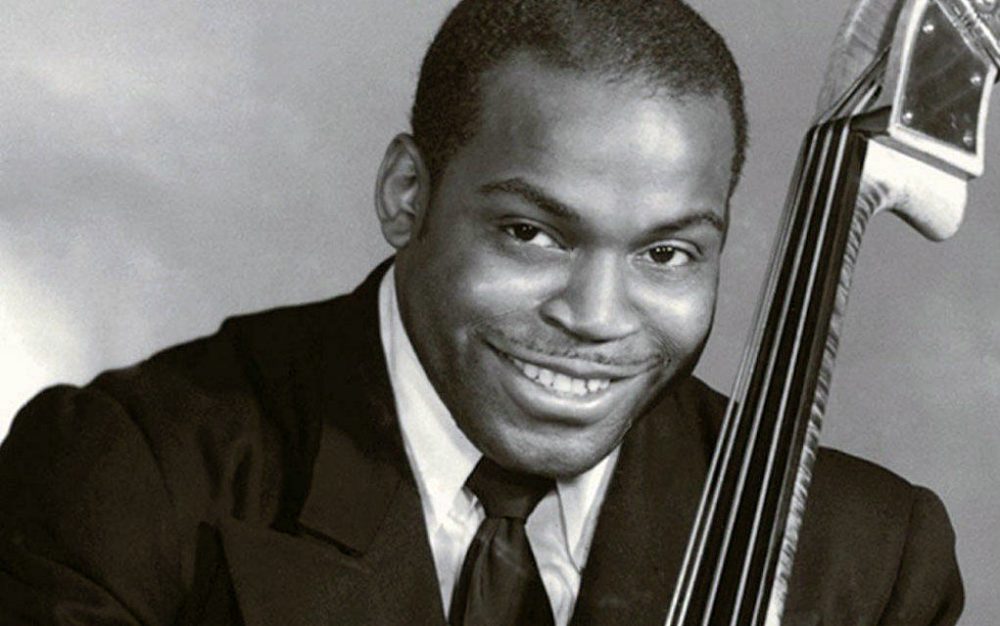
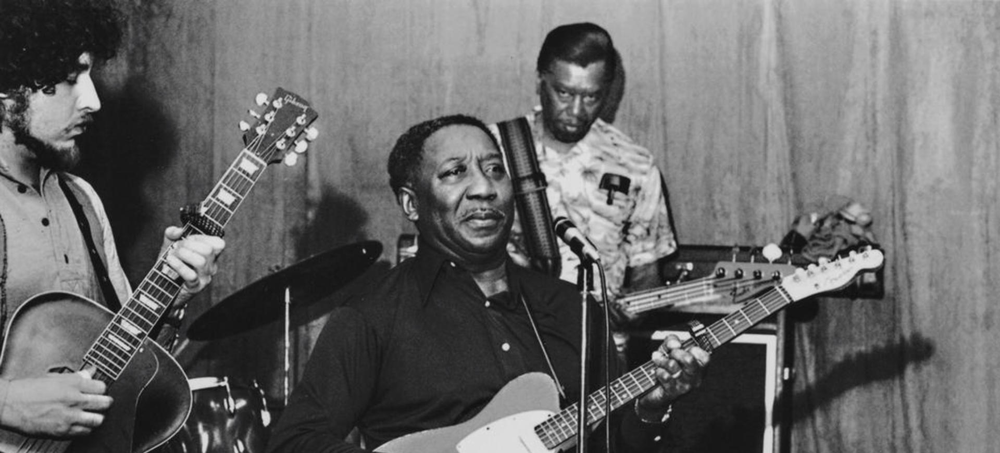

# 城市布鲁斯和节奏布鲁斯
* 长期以来，“**蓝调**”（blues）一词一直被用来形容**悲伤和绝望**的感觉，这种音乐的确是在一种**非常不幸**的情况下发展起来的——人们被迫离开家园，被带到一个新世界，过着奴隶般的生活；即使在非洲裔美国人从奴役中解放出来很久之后，他们仍然不被赋予他们自由的白人社会所接受
* 尽管如此，布鲁斯并不总是一种**悲伤的音乐**，非裔美国人经常用音乐来帮助他们应对在艰苦的日常生活中遇到的问题和挫折，许多蓝调歌曲的歌词都包含了**希望和对美好时光的期待**
## 城市布鲁斯
* 美国参与**第一次世界大战**要求许多军龄男子离开他们在**北方大城市**的工业工作，前往欧洲参加战争；大约在同时间，密西西比三角洲的许多非洲裔美国人因为**棉铃象鼻虫攻击棉花作物**而失去工作
  * 这两件事的结果是，许多南部**非洲裔美国人**为了找工作最终搬到了堪萨斯城、芝加哥和纽约等**北部城市**
* 在北方定居后，第一批工人发现，他们所遭受的**种族歧视**比在南方时**少了许多**；这个消息传开了，许多其他人也搬到了北方
  * 种族主义在北方仍然存在，以至于社区被隔离，所以每个城市都发展了**独立的非裔美国人社区**；这些新近聚集在一起的工人中，他们的生活方式比在南方农村时**更加城市化**，或者更以城市为导向，他们中有许多**受过乡村蓝调训练的音乐家**
* 当这些音乐家们联合起来组成**小型乐队**，而不仅仅用吉他为自己的歌声伴奏时，一种新的布鲁斯风格发展起来——**城市布鲁斯**
  * 大多数城市布鲁斯是由一组乐器演奏的，包括**节奏部分**（贝斯、鼓、吉他或钢琴）和**独奏乐器**，如萨克斯管和其他管乐器
  * **钢琴**的声音足够大，可以用作独奏乐器，但没有放大的**吉他**的投音效果不够好；因此，在**电吉他**发明之前，吉他主要用来弹奏**节奏**
* 城市布鲁斯吉他手**艾伦•西比克斯•沃克**（Aaron Thibeaux Walker，绰号“T骨”沃克（T-Bone Walker）），是最早使用**电吉他**作为独奏布鲁斯乐器的音乐家之一

  * 沃克出生在**德克萨斯州**，从小就弹盲人歌手**雷蒙•杰弗逊**（Lemon Jefferson）那种风格的**乡村蓝调吉他**；杰斐逊演奏的节奏与**罗伯特·约翰逊**等三角洲布鲁斯吉他手使用的节奏一样随意，但他的风格不同之处在于，他在乐句之间演奏的**旋律**更长更复杂
  * 在演奏蓝调和节奏音乐多年之后，沃克逐渐远离了他早期的乡村风格，并发展出一种**华丽的独奏风格**，演奏了**高度修饰**版本的旋律；他是一个很棒的表演者，可以在背后弹奏吉他
* **B·B·金**（B. B. King）来自三角洲蓝调的故乡**密西西比州**，他非常**抒情和富有表现力的独奏风格**对许多摇滚吉他手产生了重要影响

  * 金的首字母“B”是源于他的绰号“**蓝调男孩**”，他的真名是**莱利·B·金**
  * 下面是他的《**三点钟布鲁斯**》（Three O 'Clock Blues）的**聆赏指南**

  * 将罗伯特·约翰逊节奏上的**不拘一格**与《**三点钟布鲁斯**》的节奏编排模式和歌曲结构上的正式规律相比较，有助于了解其后期风格的**都市化**
  * 此外，金的城市蓝调吉他风格将**弹奏和演唱**看作有同样重要的地位；他在1988年的电影《**拨浪鼓**》（Rattle and Hum）中与**U2**合作，在那次表演中，金对演奏**旋律线**而不是和弦伴奏的兴趣很明显
* 虽然城市布鲁斯比乡村布鲁斯**更复杂**，但这种风格并不一定更好；摇滚乐手们充分利用了这两种风格，从乡村蓝调艺术家相对**未经训练**但极具**表现力**的风格和城市蓝调艺术家**复杂的音乐**中汲取元素
## 芝加哥布鲁斯
* **芝加哥**是第一次世界大战期间吸引了许多**非裔美国工人**的大型工业城市之一
  * 战争结束后不久，芝加哥西区和南区的**非裔美国人社区人口**多达20万；第二次世界大战期间，这一人口增加了**一倍多**，这也是因为**城市里的工作机会**
  * 和其他北方城市一样，芝加哥的音乐家们通过**加入乐队**，用**电吉他**取代老式的木吉他，使他们的风格**城市化**
* 芝加哥的**Chess录音棚**因其在四五十年代录制的布鲁斯音乐而备受赞誉；该公司由**菲尔和伦纳德·切斯两兄弟**拥有和经营，他们是从波兰移民到美国的
  * 几乎所有之前讨论过的布鲁斯艺术家都曾与Chess厂牌合作过；当他们第一次来到芝加哥时，他们的风格通常是**乡村蓝调**，Chess给了他们替补音乐人和扩声器材，导致了**更城市的风格**
* 在芝加哥发展起来的蓝调风格结合了**摇摆爵士**和**布吉伍基钢琴**的影响以及**三角洲蓝调**的激情；这种风格后来被称为**芝加哥蓝调**
  * 当你听三角洲歌手的音乐时，你会注意到，虽然他们的许多歌曲符合前面描述的传统蓝调的**十二小节形式**，但其他人既避免了**AAB抒情结构**，也避免了**规定的和弦进行**；有些歌曲只有**一个和弦**，但通过使用其他元素，如布鲁斯音和不均匀的节拍细分，保持了一般的蓝调风格
* **威利·迪克森**（Willie Dixon）曾做过歌曲作家、制作人、承包商、贝斯手，偶尔也会唱歌，但他更出名的身份是**布鲁斯歌曲作者**，而不是歌手

  * 他为其他人创作了许多**热门歌曲**，包括《**你震撼了我**》（You Shook Me）和《**我不能离开你，宝贝**》（I Can’t Quit You Baby），许多蓝调和蓝调摇滚音乐家都录制了这些歌曲
  * 《**你震撼了我**》和他的另一首歌曲《（我是你的）小男子汉》（（I'm Your）Hoochie Coochie Man）代表了十二小节蓝调结构的**变体**，因为这两首歌在每个人声合唱歌部分都有一个超长的（八小节）A部分，然后是通常每个四小节的A和B部分，将每个完整的蓝调副歌部分扩展到**十六小节**
* 虽然**马迪·沃特斯**（Muddy Waters）艺名的来源并不确定，但流行的传说是，他之所以叫这个名字，是因为他喜欢在密西西比州**罗灵福克**（Rolling Fork）他父亲家附近的一个池塘里“浑水”摸鱼

  * 作为一名**词曲作者**，沃特斯使用了他的真名**麦金利·摩根菲尔德**
  * 他的风格通常包括瓶颈吉他发出的**呜咽声**，在他早期的布鲁斯金曲《**滚石**》（Rollin’ Stone）中，他实际上接近**乡村布鲁斯**

  * 这首歌不是12小节的蓝调，而是从头到尾只演奏了**一个和弦**，歌词结构为**8小节**；沃特斯将**布鲁斯音**和**不均匀节拍**结合，创造了一种**非标准结构的蓝调**
  * 虽然沃特斯开始时演奏**乡村三角洲蓝调风格**，但他之后改弹**电吉他**，加上一支乐队，包括弹奏布鲁斯口琴的**小沃尔特**、吉他的**吉米·罗杰斯**和弹奏钢琴的沃特斯同父异母的兄弟**奥蒂斯·斯潘**，他的声音从乡村蓝调变成了**城市布鲁斯**
  * 沃特斯从未真正演奏过摇滚，但他经常**在摇滚音乐会中表演**，包括1976年乐队的最后一场音乐会（后来被拍成电影《**最后的华尔兹**》），以及1979年与**埃里克·克莱普顿**的巡演
  * 下面是他的《**（我是你的）小男子汉**》（（I'm Your）Hoochie Coochie Man）的**聆赏指南**
 
 * 