# 探寻摇滚乐之根
* 今天的许多流行音乐**相当复杂**，超出了一般人的演奏能力
  * 在收音机、电视、高质量的唱片、磁带或CD播放机等二十世纪发明出现之前，大多数人听到音乐的唯一方式是**自己表演**，**雇佣表演者**为他们演奏，或者去参加**公开演出**
  * 正因为如此，过去的流行音乐通常要么**相对简单**，要么是为大规模的公共狂欢的一部分
* **美国最早的流行歌曲**是由英国和其他欧洲殖民者带到**殖民地**的
  * 1790年第一部**美国国家版权法**的通过促进了美国音乐的制作、出版和销售；版权保护作曲家的信誉，允许他或她和出版商从已出版歌曲的销售中获得报酬，并保持对其分销的控制
  * 由于许多人愿意**花钱购买**出版的音乐作品，美国的**流行音乐产业**在19世纪迅速发展；随着20世纪头十年**唱片技术**的广泛应用，**收音机**在20世纪20年代的出现，**电视**在40年代开始出现，音乐在20世纪爆发
  * 到了**20世纪50年代**，依托**流行音乐的快速发展**，摇滚乐发展成为**独立的音乐类别**
* 在19世纪晚期美国各地流行的许多类型的音乐中，**拉格泰姆**、**叮砰巷**、**布鲁斯**和**爵士**都直接影响了摇滚乐的发展；到19世纪90年代，这四种风格都已臻完善，彼此独立，但也相互影响
  * **布鲁斯**和**爵士**与其他两种音乐的区别在于它们都是**即兴创作的音乐**；不幸的是，19世纪晚期的**即兴音乐**今天不为我们所知，因为当时没有**录音技术**，即兴创作也没有被**乐谱**记录下来
  * 直到1917年，第一张**爵士乐唱片**被录制出来，以及随后不久**布鲁斯音乐录音**的完成，我们才真正能了解它们的声音
  * **拉格泰姆音乐**和**叮砰巷音乐**是以**乐谱**的形式创作和出版的，表演在很大程度上只需要根据这种乐谱演奏和/或演唱
## 拉格泰姆
* **拉格泰姆**（Ragtime）主要是，虽然不完全是**非裔美国人**的风格；它很可能是在19世纪中期在**班卓琴**上第一次演奏的，但**钢琴**上的演奏变得更加普遍
  * “Rag”一词原意为“抹布，嘲笑以及捉弄”，Ragtime顾名思义，就是**碎片化的、轻佻的节拍**；拉格泰姆最初就是诞生在**妓院、沙龙和舞厅**，是一种轻佻、欢脱的曲调
  * 作为一种明显的**美国音乐风格**，拉格泰姆可以被认为是**非洲切分音**和**欧洲古典音乐**的综合体，尤其是**约翰·菲利普·索萨**（John Philip Sousa）流行的进行曲；它同样受到**cakewalk**的影响
  * **cakewalk**是从 19 世纪中叶举行的“奖品步行”（以蛋糕作为奖品的舞蹈比赛）发展而来的一种**舞蹈**，通常在美国南部解放前后的黑人奴隶种植园举行聚会；它最初是一种以滑稽形式跳舞的游行舞伴舞，可能已经发展成为对白人奴隶主彬彬有礼的舞蹈的微妙嘲弄
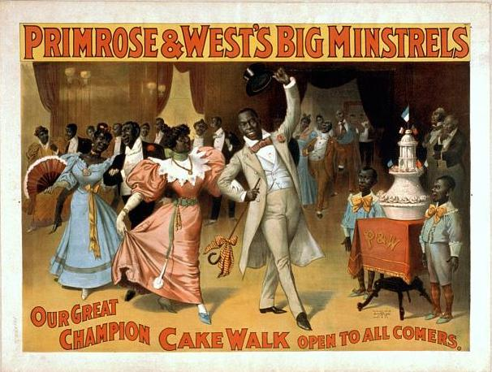
  * 1895年，黑人艺人**欧内斯特•霍根**发布了最早的拉格泰姆乐曲，叫做“**La Pas Ma La**”；在1890 年代到1910 年代，这种音乐风格蓬勃发展

* **切分音符**是拉格泰姆的显著特征，通常弹奏者**右手**弹奏出变化无常的切分旋律“**拉格**”（ragged），同时**左手**以**沉稳的低音**伴奏，注重节奏变化、情绪欢快而别具一格
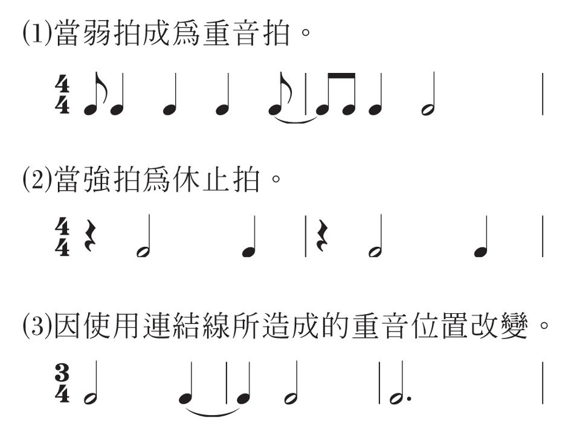
  * 拉格的**旋律线**通常伴随着贝斯或乐队低音部演奏的**单一音符与和弦**（三个或更多的音符一起演奏）
* **斯科特·乔普林**（Scott Joplin，1868-1917）是最著名的拉格泰姆作曲；乔普林的《**枫叶拉格**》（Maple Leaf Rag，1899）的乐谱在他还活着的时候就已经卖出了100多万张
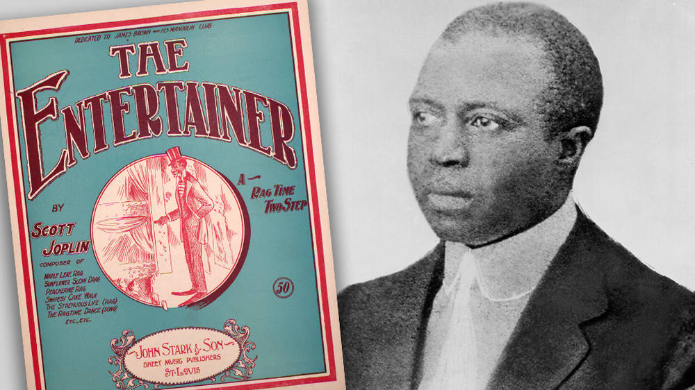
* 拉格泰姆对摇滚乐的直接影响在于它的**能量和乐趣**，**切分音节奏**，以及它对“**大跨度钢琴弹奏法**”（stride piano）发展的影响，而“大跨度钢琴弹奏法”也成为许多摇滚乐中使用的节奏和蓝调钢琴风格的元素 

## 叮砰巷
* **叮砰巷**（Tin Pan Alley）是纽约西28街（第五大道和百老汇之间）的一段，在19世纪末和20世纪初，许多音乐出版商在那里设有办事处；“叮砰”这个名字指的是当时音乐出版商使用的**廉价立式钢琴**的干涩而尖细的音质
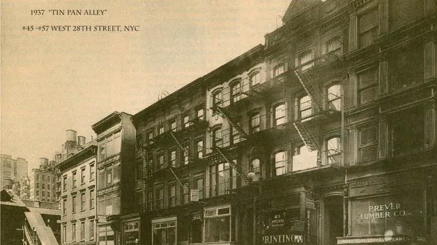
  * **歌舞杂耍表演**越来越受欢迎，它们需要大量的新音乐，这帮助纽约出版商在很大程度上控制了**流行音乐出版业**，因为歌舞杂耍剧院集中在纽约，大量的演出从那里开始，然后传播到全国其他地区
* 一般来说，这些歌曲都是**感伤的民谣或歌曲**，或者是对19世纪90年代**充满快乐的描写**，以作为人们**对现实生活的逃避**
  * 许多歌曲是根据**流行的舞蹈节奏**创作的，这些歌曲最普遍的特点是**简单易记**；《**带我去看棒球**》（Take Me Out to the Ball Game）就是这样一首至今仍为许多棒球迷所熟知的歌曲

* 许多叮砰巷音乐中巧妙、朗朗上口、易于记忆的**流行旋律类型**为许多更流行的摇滚歌曲、民谣和舞曲创造了重要的模式；叮砰巷音乐和摇滚乐之间**最大的区别**是摇滚乐通常以**唱片**的形式出售，而叮砰巷音乐则以**乐谱**的形式出售，供消费者自己演奏
## 爵士乐在新奥尔良的诞生
* **新奥尔良**（New Orleans）一直是音乐之都；到19世纪后期，新奥尔良的音乐兴趣已经从歌剧和古典音乐转向**流行乐队音乐**，然后逐渐转向**爵士乐**（Jazz）
* 早在1840年，**乐队音乐**就已经成为新奥尔良音乐传统的重要组成部分；在星期天的游行中，乐队相互竞争以赢得观众的喝彩，这变得很普遍
  * 新奥尔良的乐队通常**很小**，由**非裔美国音乐家**或**克里奥尔混血音乐家**组成，尽管该市也有少数全白人乐队；在新奥尔良的乐队中演奏的非裔美国人和克里奥尔人音乐家，大多数都受过**正规的乐器训练**，并且能读懂乐谱
  * 他们演奏的音乐形式多样，音乐家们开始在已经写好的乐句中加入**即兴创作**；特别是非裔美国音乐家，他们用**切分音**的非洲节奏以及他们所熟悉的布鲁斯和黑人福音音乐元素为他们的表演增添了活力
* 逐渐地，这种转变的音乐开始被称为“**热辣**”音乐
  * 早期的热辣乐队通常包括一个小号（或短号），一个单簧管和一个长号作**演奏主旋律**（被称为前线）的独奏乐器；**节奏乐器组**则由班卓琴、吉他或钢琴的某种组合组成，当然还有低音提琴、大号和鼓（节奏乐器组是乐队中保持节拍和演奏和弦的乐器的总称）
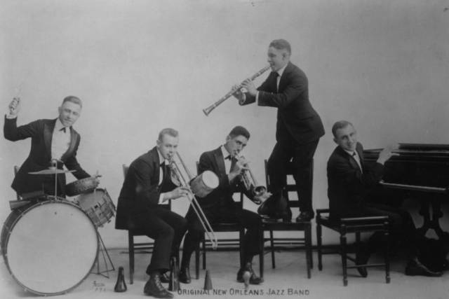
* **爵士乐**并没有被局限在新奥尔良甚至南方太久；早在1908年，便由巡游各地的非裔美国人通过**综艺秀**和**墨面秀**（minstrel shows）的形式传播到各地
  * **墨面秀**是19世纪初发展起来的美国**种族主义**戏剧娱乐形式，每个节目都包括专门描绘非洲人后裔的喜剧小品、综艺节目、舞蹈和音乐表演，这些节目大多由用黑木炭**化着黑脸的白人**来表演，目的是扮演黑人的角色，将黑人描绘成愚蠢、懒惰、小丑、迷信和无忧无虑的人；后来越来越多的**黑人艺术家**加入其中，逐渐发展为**黑人剧**
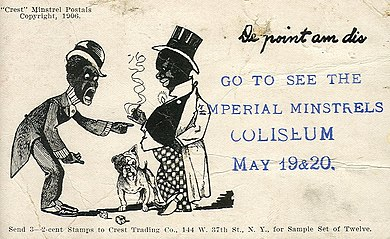
  * **交际舞**的流行是爵士乐传播的一个因素，爵士乐充满活力和“粗犷”的节奏非常适合20年代流行的**查尔斯顿**（Charleston）等舞蹈
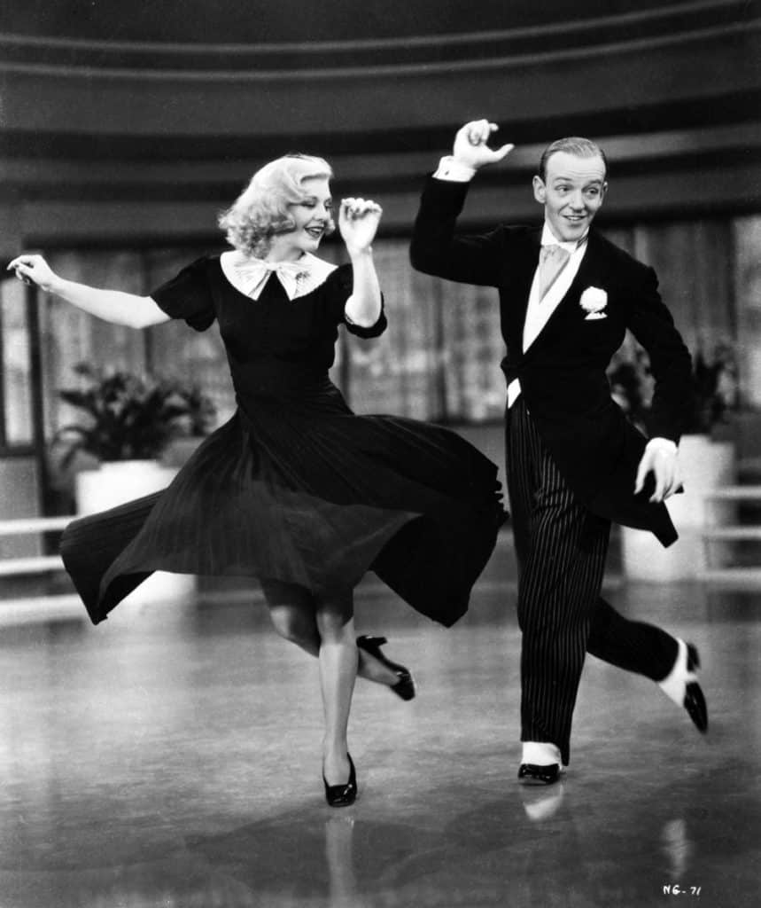
  * 在30年代末和40年代初的摇摆时代，爵士乐仍然是舞者的音乐，芝加哥和纽约都是下一个重要的爵士风格——**摇摆乐**发展的重要中心
## 摇摆舞乐队
* 摇摆舞乐队的演奏虽与爵士乐有**相似之处**，音乐家可以即兴演奏爵士风格的独奏，但乐队规模比早期的爵士乐队**更大**，即兴演奏的时间**受限制**
  * 大多数时候，乐队演奏的音乐都是精心编排的乐曲为摇摆舞伴奏，而不是其他爵士风格的复杂音乐
  * 早期的新奥尔良爵士乐队使用1支小号（或短号）、1支单簧管和1支长号作为主要的独奏乐器，而摇摆乐队则要大得多，包括许多小号、长号和萨克斯管和节奏乐器
  * 新奥尔良乐队的典型乐器组是班卓琴或吉他，低音提琴或大号组成，更柔和的摇摆舞音乐使用了低音提琴、钢琴和鼓
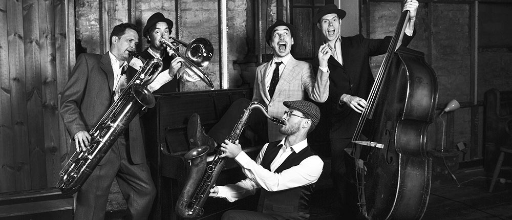
* 摇摆音乐不仅增加了乐队乐器的数量，而且带来了**新的演奏方式**
  * 过去在大号上演奏的低音线条通常是在四拍小节的第一和第三拍之间反复演奏，但摇摆乐的贝斯手通过**在每个拍子上演奏一个新音符**，以及偶尔**在相邻拍之间**演奏一个新音符来装饰节奏流动，从一个音符“走”到另一个音符，创造了更流畅的效果
  * 这种低音风格的演奏方式被称为“**漫步低音**”（walking bass），1后来被用于节奏布鲁斯和摇滚
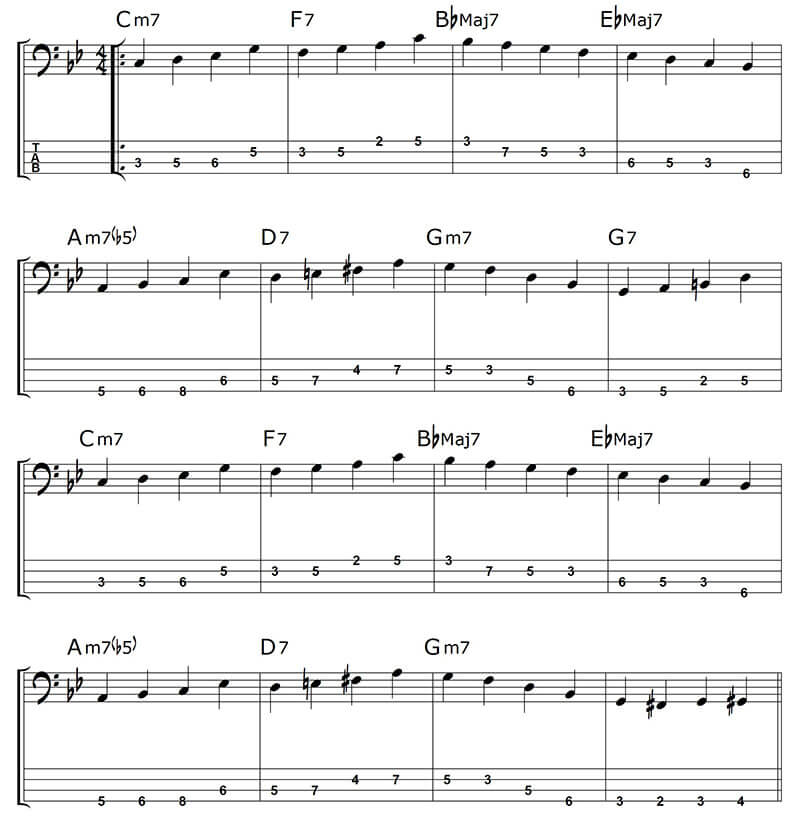
* 摇摆乐队的**男歌手**通常以“**低吟唱法**”（crooning）演唱
  * **低吟**与早期流行的演唱方式不同，它是随着**麦克风**的出现而发展起来的；**音响师**能够**更好地控制**和放大柔和的声音，而不是大声、响亮的声音
  * 在吟唱风格中，男歌手们将他们自然的声音**软化**成一种流畅、温柔的音调，从一个音符**滑到**另一个音符，以创造**温暖的感伤效果**
  * 摇摆时代流行的低吟歌手包括**宾·克罗斯比**（Bing Crosby）和**佩里·科莫**（Perry Como），这些低吟歌手都对50年代和60年代初被称为青少年偶像的流行摇滚歌手产生了影响

## 布鲁斯
* 布鲁斯最早的起源不仅在**非洲**，也在**阿拉伯半岛**、**中东**，甚至在摩尔人占领时期（8世纪到15世纪）的**西班牙**
  * 因为早期音乐起源于录音出现前很久，而且那时没有记谱法，所以人们只能听来自世界上那些地区的**现代音乐**来比较相似之处，并假设过去这些民族和非洲人之间有跨文化交流
  * 如**阿拉伯**音阶结构和旋律序列，**土耳其**仪式音乐中的旋律和节奏模式，以及**西班牙**歌手对节奏的自由运用，都与非洲音乐的某些形式有相似之处，从而与蓝调有相似之处
* 要找到布鲁斯最接近的直接前身，就必须研究**非裔美国人**的原始音乐
  * 进行这种研究的一个潜在问题是，**非洲**是一个非常大的大陆，被带到新大陆做奴隶的人来自许多**相隔甚远的地区**
  * 经推测，布鲁斯音乐传统最可能源自塞拉利昂的**弗里敦**（Freetown）；弗里敦的名字是在它作为非洲人的殖民地建立时起的，这些非洲人本来要被运往新世界做奴隶，但后来被废奴当局释放了
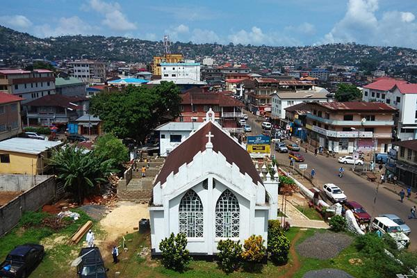
  * 有趣的是，尽管弗里敦人的非洲血统和来到新大陆的人几乎相同，但布鲁斯本身并没有在弗里敦得到发展；这里的音乐依然按照非洲传统形式进行演奏
* 由来自塞拉利昂的**吟咏艺人**（griot）演唱的伴奏歌曲与早期美国蓝调歌曲有共同的特点
  * 在塞拉利昂，就像在非洲的许多地方一样，几个世纪以来，吟咏艺人一直充当口述诗人的角色，讲述人民及其领导人的历史
  * 在他们的社会还没有文字系统之前，吟咏艺人保持着崇高而受人尊敬的社会地位，甚至在许多非洲人能够写下他们自己的历史和诗歌之后，这种口述传统仍在继续
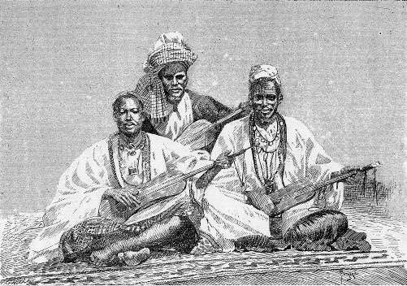
* 虽然今天听到的非洲吟咏歌曲和美国蓝调有足够的相似之处，可以假设它们是由**相似的来源**发展而来的，但美国蓝调并不仅仅是吟咏歌曲的移植版本
  * 蓝调与吟咏歌曲不同的部分原因是，蓝调作为一种**个人表达**，表达了一个人因缺乏人类尊严而遭受的痛苦，在非洲，吟咏歌曲是主导社会结构的**中心**
* 蓝调是从世界上许多地方的古老音乐传统发展而来的，这些传统是由**美国南部的非裔美国人**综合而成的
  * 非裔美国人也接触过**欧洲白人的传统音乐**，尤其是教堂里唱的**赞美诗**，这些音乐影响了他们对**三和弦和谐推进**和**长短相等的短诗**的使用
* 一些影响蓝调发展的音乐传统来自于**奴隶制**的经历；在非常艰苦的集体工作中，奴隶们经常会遵循古老的非洲传统，以**呼唤和回应**的方式唱歌
  * **“呼喊-回答**”（call-response）是指某个领唱者唱一句，然后群体模仿跟唱，或“回应”；在非洲，当一群人在跳舞或以其他方式**庆祝**时，会进行呼叫-响应，但它也适用于新世界的奴隶，作为一种**保持工作激情**的方式，这种在奴隶工作时唱的歌叫做**劳动歌**
  * 布鲁斯有很多对“呼唤-回应”的**使用**，特别是当我们听到**乐器**在每个乐句的结尾对歌手做出回应的时候
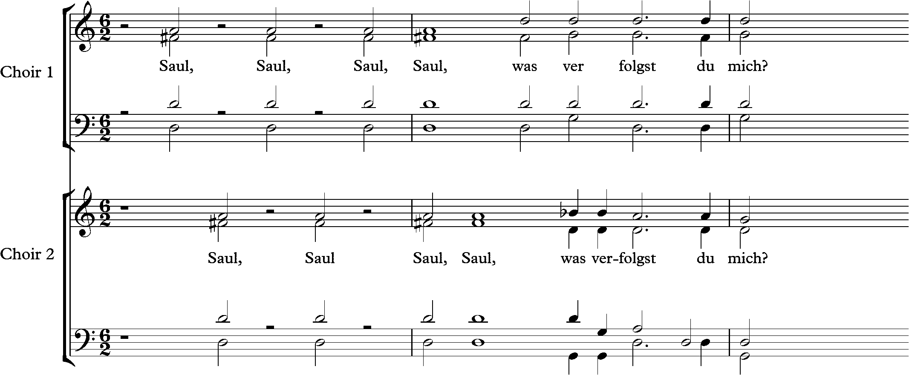
* 另一种由劳动奴隶演唱的歌曲被称为**田野吟唱**（field holler）
  * 田野吟唱与劳动歌的不同之处在于，田野吟唱经常由**一个工人**演唱，内容为对他或她繁重的任务的**哀叹**；田间歌曲的节奏没有工作歌曲那么有规律，它们通常也比较**慢**，而且包含了很多**即兴创作**
  * 我们将在蓝调、爵士歌手和乐器演奏家的独奏中听到这种个人即兴演奏
* 无论是劳动歌还是田野吟唱，有时也会通过象征的方式提到监督他们工作的“长官”，或在唱词中一语双关
  * 对**奴隶**们来说，这首歌可能是在表达他们的不满，但在**监工**的耳朵里，这首歌似乎是在表达敬意
  * 当我们研究黑人福音音乐的根源——**灵歌**时，我们也会发现这种“一语双关”现象；在非洲传统中，**一词多义**的现象一直很重要，这可以追溯到吟咏艺人的时代，这种声乐传统也将成为后来**说唱**（rap）风格的一个元素
* 因为布鲁斯起源于美国的农村地区，特别是**南方**，最早的蓝调风格被称为**乡村蓝调**
  * 乡村布鲁斯的作曲家和表演者，在很大程度上，是那些把布鲁斯作为生活中不可分割的一部分的人；他们通常用**破旧的吉他**为自己伴奏，歌词通常粗糙但**富有表现力**
  * 布鲁斯音乐在19世纪末或20世纪初形成了自己的形式和风格，但最早的**唱片**直到20世纪20年代才出现；蓝调音乐在上世纪初究竟是什么样子，只能从这些后来的**录音**中推断出来
* 尽管在南方各地发展起来的乡村蓝调风格存在着许多变化，但对摇滚乐发展影响最直接的一种风格来自**密西西比三角洲**，被称为**三角洲蓝调**
  * 与来自卡罗来纳等地的乡村布鲁斯风格相比，它是**高度情绪化**和**粗糙**的，但它的**表现力**和**节奏的活力**导致了它的流行传播
  * **罗伯特·约翰逊**（Robert Johnson）、**查理·巴顿**（Charley Patton）、**索恩•豪斯**（Son House）等三角洲蓝调好手通常用轻扫吉他和弦并弹奏点缀旋律的方式为自己的演唱伴奏
  * 三角洲蓝调吉他手经常会折断一个长颈玻璃瓶的**瓶颈**，磨光玻璃边缘，把它套在控制乐器指板的手**中指或无名指**上（通常是**左手**），然后在吉他的**高音弦**上从一个音符滑到另一个音符，让那只手的其他三个手指演奏**简单的和弦或低音线**
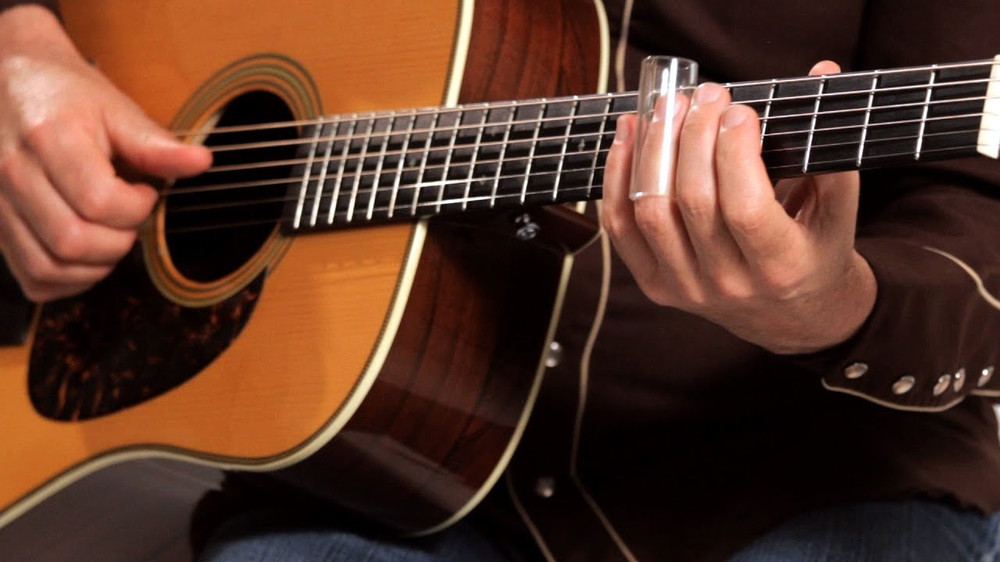
  * 不久，这种自制的瓶颈就被批量生产的**玻璃或钢制的管**取代了；其他吉他手，比如**莱德贝里**（Huddie Ledbetter），通过沿着吉他弦滑动刀片来达到类似的效果
* 布鲁斯音乐的部分特点是通过将音符的音高**扭曲变化**，形成所谓的**布鲁斯音**（blue notes）
  * 布鲁斯音的**确切起源**可能永远无法确定，但它们要么来自于世界音乐中使用的**五声音阶**，要么甚至可能来自**伊斯兰音乐**对非洲音乐的影响
  * 在早期蓝调艺术家演奏的蓝调中，常见的布鲁斯音是大调音阶中**降低**的**中音**（Ⅲ，the third degree）和**导音**（Ⅶ，the seventh degree）；例如，在C大调中，布鲁斯音就存在于E与降E、B与降B之间的某处
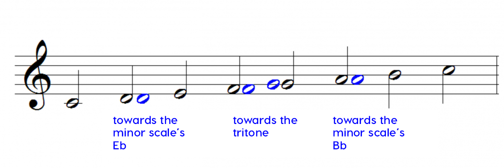
  * 为了通过人声演唱或某些乐器演奏布鲁斯音，就可以**稍微降低**E或B音；而钢琴之类的乐器无法连续调节音高，所以演奏者只是把这两个音**降低半音**演奏
  * 尽管钢琴演奏者可以将布鲁斯音的音高降低半音，或者同时敲击两个相邻的音符来暗示中间的音符，但用这两种方法演奏出的布鲁斯音的音高精准度都无法与**半固定音高乐器**所演奏的布鲁斯音相比
    * **古筝**属于“半固定”音高乐器，固定是因为有码子确定有效弦长，每根弦有固定音，不固定是因为码脚底部与面板不是完全接触，会出现轻微的移动，音也会随之变化；**吉他**同理
  * 用滑棒弹吉他流行的一个原因是滑棒可以**在把位上滑动**（金属棒在指板上与琴弦垂直，停在静止琴弦上方）
  * 另一种在吉他上不需要滑棒弹奏布鲁斯音的技巧是在吉他指板上比蓝调音低的音品上进行演奏，通过推弦或者拉弦，使琴弦逐渐收紧然后松开，在布鲁斯音的范围内提高和降低音调；这种技术被称为**推弦**
* 受欧洲歌曲形式的影响，布鲁斯发展出一种**相当一致的形式结构**，即一定长度的**反复加对比乐段**；大多数蓝调音乐的形式可以用字母**AAB**来概括
  * 第一个字母A指的是**第一段的旋律**（四小节）和**第一段歌词**；第二个A代表**重复**上一段歌词和旋律，完全或几乎相同；字母B代表一个**对比鲜明的歌词**（通常与a行押韵）和**旋律**，作为对a部分的单词和旋律的回应
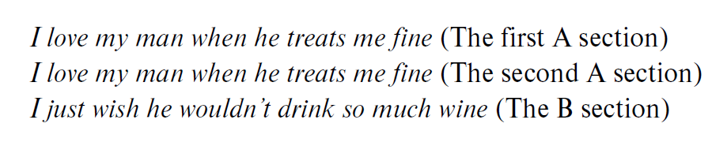
  * 换句话说，蓝调歌词通常有**两段**，第一段会被重复；当不遵循这种歌词结构时，歌曲仍然可以是布鲁斯，但这种结构在传统布鲁斯中很常见
  * 布鲁斯形式的节奏被组织成**四拍子的模式**，**每四拍**被称为一个小节（或乐段），旋律的每一段由**四个小节**组成
  * 既然这三段乐句每段有四个小节，所以每首AAB蓝调主歌、副歌韵律的完整结构总共有**十二个小节**；因此，布鲁斯也通常被称为“**十二节布鲁斯**”
* 摇滚乐是在布鲁斯音乐的基础上发展起来的，但它并没有沿用布鲁斯音乐传统中来自西非的“**对唱**”
  * 布鲁斯歌手通常扮演**呼唤者**的角色，从旋律的第一小节的第一拍唱到第三小节的第一拍，而第四小节则由**乐器**的回应来填补
  * 这种回应可以由一个或多个演奏者用**各种乐器**演奏，也可以由歌手用**吉他或钢琴**演奏，也可以由歌手在每行文本的末尾**重复**一个或多个单词
  * 在C调中，主音和弦是C，下属和弦是F，属七和弦是G，这三个和弦通常作为**七和弦**出现（早期的布鲁斯音乐家经常在B段的前两小节中演奏G7和弦，而不是在第二小节中演奏F和弦）；和弦名称的每一次重复都代表了该和弦将要演奏的一个节拍，小节线将这些节拍划分为四拍小节
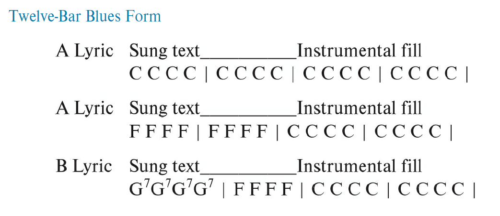
* 大多数爵士乐的节拍通常被**不均匀地划分**，创造出一种“长-短-长-短”的平稳滑动效果，其中每个长音符的时值是每个短音符的**两倍**
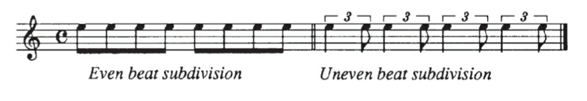
  * 当**低音**在**强拍**上演奏，**和弦**在**弱拍**演奏时，这种不均匀的节奏模式被称为**曳步节拍**（shuffle beat）；当缓慢地演奏时，**不均匀的节拍**创造了一种**轻松的感觉**，这也成为了蓝调的特征，**平均节拍**则常见于民间音乐和乡村音乐中
* **罗伯特·约翰逊**（1911-1938）是三十年代最有影响力的乡村布鲁斯歌手/吉他手之一；人们对他的生活知之甚少，只知道他出身贫寒，在密西西比州的一个种植园长大，并且以风流成性闻名
  * 约翰逊大部分歌曲的歌词都表达了他对酒、女人和歌曲永不满足的渴望；他只录制了29首歌曲，但如果包括改编歌曲，他的录音总数为41首
  * 约翰逊没有在正式场合为大型团体表演，所以**很少**有人听到他本人的**表演**；1986年的电影《**十字路口**》（Crossroads）便取材于他的音乐生涯
* 约翰逊的歌曲确实遵循了之前描述的传统**AAB曲式**和基本蓝调进展的**和弦**（B部分只有两个和弦），但他并没有受到后来布鲁斯音乐家被节奏的限制
  * 他在小节中添加额外的强拍，在乐段中添加额外的小节，创造出一种**随机的音响效果**；有时甚至以一种与不贴合吉他演奏的节奏模式唱歌，这种**复合节奏**源自非洲音乐传统
  * 下面是他的《**十字路口布鲁斯**》（Cross Road Blues）的**聆赏指南**

  * 录制《十字路布鲁斯》两年后，约翰逊狂野自由的生活方式导致了他的死亡；年仅二十七岁的他，被一个与他有关系的女人或她的丈夫毒死
* 虽然大多数吸引唱片公司注意的乡村蓝调歌手是男性，但**女性**也会演唱和演奏蓝调，有些人还拥有相当成功的事业
  * 其中一位音乐家是**Lizzie“Kid”Douglas**，她以**孟菲斯·米妮**（Memphis Minnie）的名字录制唱片
  * **经典布鲁斯**（class blues）风格的女歌手通常不用伴奏，她们大多数人来自南方，听着乡村布鲁斯长大，为了在爵士乐队的伴奏声音水平之上被听到，她们发展出了**高亢有力**的声乐风格
  * 两位经典的布鲁斯歌手是**马·雷尼**（Ma Rainey）和**贝西·史密斯**（Bessie Smith）
  * **贝西·史密斯**（1894-1937）最终赢得了“布鲁斯女王”的称号，在1929年的电影《**圣路易斯布鲁斯**》（St. Louis Blues）中扮演重要角色；她和一个叫“**拉斯图斯百老汇**”（Broadway Rastus Review）的乐队在剧院巡演时遭遇车祸，因伤去世，下面是她的《**丧失理智布鲁斯**》（Lost Your Head Blues）的**聆赏指南**

  * 