# 早期摇滚乐
* 许多摇滚历史学家认为**四十年代**的布鲁斯、节奏布鲁斯唱片是摇滚乐；在很多方面，他们**的确是**
  * 当音乐节目主持人**艾伦·弗里德**第一次使用摇滚这个词时，他是用它来区分**节奏布鲁斯**
* 早期或原始摇滚音乐几乎都是以布鲁斯或节奏布鲁斯**为基础**的；找到摇滚真正开始的时间点是不可能的，或者至少有很大的争议
## 有节奏布鲁斯背景的音乐家
### 胖子多米诺
* **法兹·多米诺**（Fats Domino）在1955年以《**Ain 't That a Shame**》进入流行音乐排行榜之前，曾在节奏布鲁斯排行榜上录过几首热门歌曲；他的真名是**安托万·多米诺**，“**胖子**”这个名字是对他腰围的描述
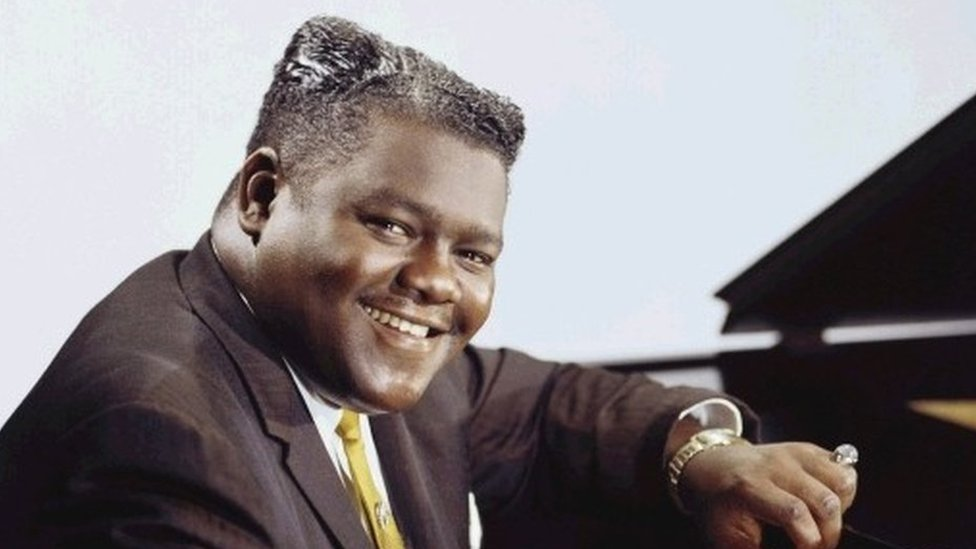
  * 他出生在**新奥尔良**，自世纪之交以来，新奥尔良就是爵士乐的中心；在40年代中期，他遇到了小号手和乐队指挥**戴夫·巴塞洛缪**，他成为了他的制作人和联合词曲作者
  * 无论多米诺演奏的是《**蓝莓山**》（Blueberry Hill）缓慢流畅的节奏，还是《**我在走路**》（I’m walk’in）欢快的**布吉-伍基风格**（都是1956年的作品），他**友好而低调**的声音都被巴塞洛缪的伴奏乐队**喇叭声**所支持
  * 25年来，法兹·多米诺一直在他舒适的新奥尔良家中享受家庭生活，只是偶尔表演；1993年，他发行了《**圣诞节是个特别的日子**》（Christmas Is a Special Day），重振了自己的唱片事业
  * 下面是他的《**我在走路**》的**聆赏指南**

### 查克·贝里
* **查克·贝里**（Chuck Berry）是一位吉他手和歌手，他的风格根植于布鲁斯和节奏布鲁斯，但他的音乐毫无疑问是**摇滚**的；在1957年的热门歌曲《**摇滚音乐**》（Rock and Roll Music）中，他甚至在演奏和歌词中定义了**摇滚风格**及其基本的**背拍**
  * 贝里出生在**圣路易斯**，十几岁时开始弹吉他；对他的吉他风格影响最大的是**T-Bone Walker**和**Muddy Waters**，但他的演唱风格显然受到了许多**白人乡村和西部歌手**的影响
* 查克·贝里的大部分作品都是他**自己创作**的，在他的唱片中，他既是**主唱**又是**吉他手**

  * 他的歌曲捕捉了**青少年的精神**，传达了这样的信息：古典作曲家可以在坟墓里翻来翻去，与节奏和布鲁斯一起生活（《**摇滚贝多芬**》（Roll Over Beethoven）），他的V8福特汽车可以赶上凯迪拉克Coup de Ville（《**梅贝琳**》（Maybellene）），随着摇滚音乐跳舞可以帮助一个人在44所学校度过一天（《**学校日**》（School Day）），以及其他任何青少年感兴趣的主题

* 贝里的表演令人震撼，包括他著名的“**鸭子步**”（他弯着膝盖走过舞台，头部前后摆动）；
  * 在他的**吉他独奏**中，贝瑞会做一段**短的重复**，每重复一次，就会越来越深入地**挖掘音符**，以增加声音的强度，用他的旋律创造出一种节奏，很快就成为了标准的**摇滚吉他**声音
  * 他有时被称为**摇滚吉他之父**，因为有很多吉他手，包括巴迪·霍利、乔治·哈里森、基思·理查兹和卡尔·威尔逊，他们要么复制了他的风格，要么深受其影响
  * 下面是他的《**学校日**》的**聆赏指南**

* 贝瑞充满活力的音乐在流行音乐排行榜上被五十年代末六十年代初的**青少年偶像和女子组合**所掩盖；此外，1959年末，他被指控违反《**曼恩法案**》（为了不道德的目的运送未成年妇女跨越州界），这使他的事业受到了影响
  * 他经历了两次审判，最终**被判入狱**，刑期从1962年初持续到1964年初；当他被释放并准备再次录制时，贝瑞得以**复出**
  * 他60年代中期的风格正好继承了他早期唱片的风格——例如，1964年的《**没有特别的地方去**》（No Particular Place to Go）与1957年的《School Day》惊人地相似
  * 近年来，贝里与**美国国税局**（Internal Revenue Service）的纠纷以及其他各种法律问题一直困扰着他，导致他的表现不如以前
### 小理查德
* **理查德·彭尼曼**（Richard Penniman）是50年代节奏和蓝调摇滚风格中一位重要且有影响力的摇滚歌手和钢琴家；他出生在乔治亚州的**梅肯**，年纪轻轻就开始表演，被称为**小理查德**（Little Richard）
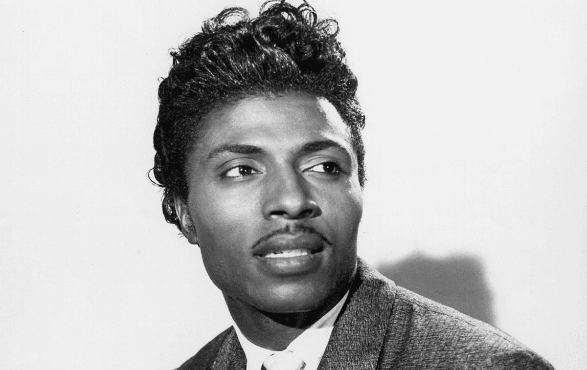
  * 小理查德最初是在他的**教堂**里学会弹钢琴的，在那里他也唱**福音音乐**，并学会了使用这些福音的特征，如**滑音和装饰音**；这些影响一直伴随着他，并与他后来受跳跃布鲁斯影响的摇滚风格的**尖叫和呻吟**一起使用
  * 小理查德在他的唱片中作词作曲、弹钢琴、唱歌，其中包括《**水果锦囊**》（Tutti-Frutti）、《**高挑的莎莉**》（Long Tall Sally）和《**天哪，莫莉小姐**》（Good Golly，Miss Molly）
  * 他的钢琴演奏通常是**布吉-伍吉低音**，并用力敲出和弦，但正是**更快的节奏**和**更高的能量水平**使小理查德的风格从其他跳跃布鲁斯音乐家中脱颖而出
  * **性**是他最喜欢的文本主题，他一边用**中性的发型**和**浓妆艳抹**来逗乐观众，一边唱着有时令人震惊的**生动或暗示性的歌词**

* 下面是他的《**高挑的莎莉**》的**聆赏指南**

  * 在《**高挑的莎莉**》的**器乐部分**中使用**停顿时间**给旋律带来了一种**节奏上的冲击**，这种冲击经常用于蓝调、节奏布鲁斯和以蓝调为基础的摇滚乐中
  * 在小理查德的录音中可以清楚地看到，**停顿时间**与之前讨论过的约翰·李·胡克（John Lee Hooker）的《Boom Boom》和查克·贝里（Chuck Berry）的《School Day》中的**乐器休止**不同，因为停顿时间中乐器偶尔会以短和弦或音符**重新进入**，以强调**演唱的节奏**
* 1957年，小理查德在事业最成功的时候，放弃了摇滚，成为了一名**传教士**
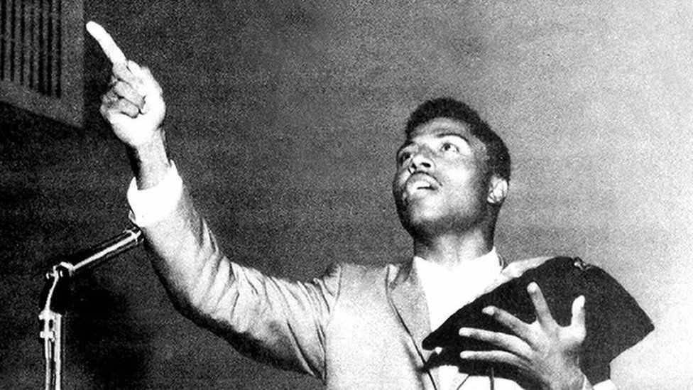 
  * 1964年，他试图在美国**复出**；在那之后，他继续偶尔举办摇滚演出，但大部分时间都投入了**宗教工作**
  * 在摇滚和宗教之间徘徊多年后，1986年，小理查德带着一种他称之为“**信息音乐**”的新风格重返摇滚唱片；诸如《**全能的上帝**》（Great Gosh Almighty）等信息歌曲的音乐仍然保持了小理查德50年代摇滚风格的**活力**，但他放弃了他的中性形象，成为了一个**跳舞的牧师**
## 有乡村背景的音乐家
### 比尔·哈利
* **比尔·哈利**（Bill Haley）是来自**密歇根州**的乡村歌手和吉他手，在西部摇摆乐队中演奏
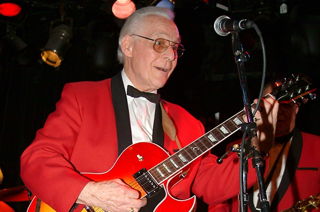
  * 在四十年代后期，他是一名**唱片节目主持人**，为了在他的广播节目中表演，他组建了**西部摇摆四王牌乐队**（the Four Aces of Western Swing）；乐队解散后，他又成立了一个名叫“**马鞍人**”（the Saddlemen）的乐队，一起录制乡村歌曲
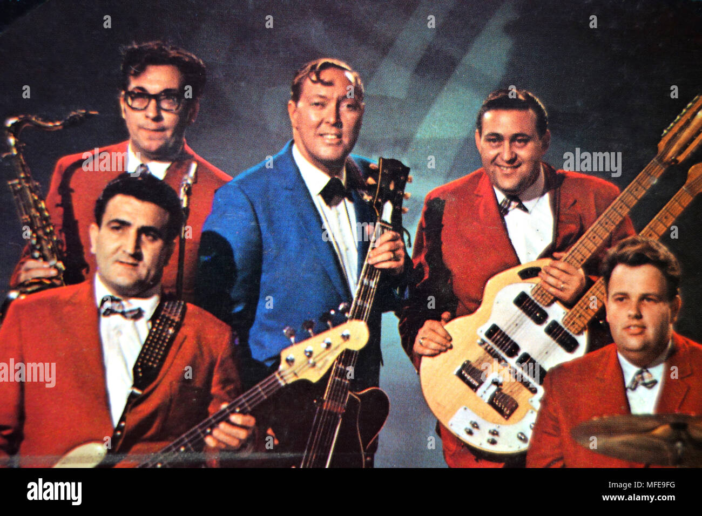
  * 1951年，Haley的乐队翻唱了《**Rocket 88**》，这张唱片卖得并不好，但当他演唱这张唱片时，哈利可以看到**白人青少年**是多么喜欢布鲁斯的节奏和活力；第二年，他决定放弃他的乡村形象，将他的乐队更名为“**彗星**”（以哈雷彗星命名），并录制布鲁斯和节奏布鲁斯
* **乔·特纳**（Joe Turner）从20年代末开始唱爵士，并成为一名出色的慢爵士乐风格布鲁斯和跳跃布鲁斯歌手
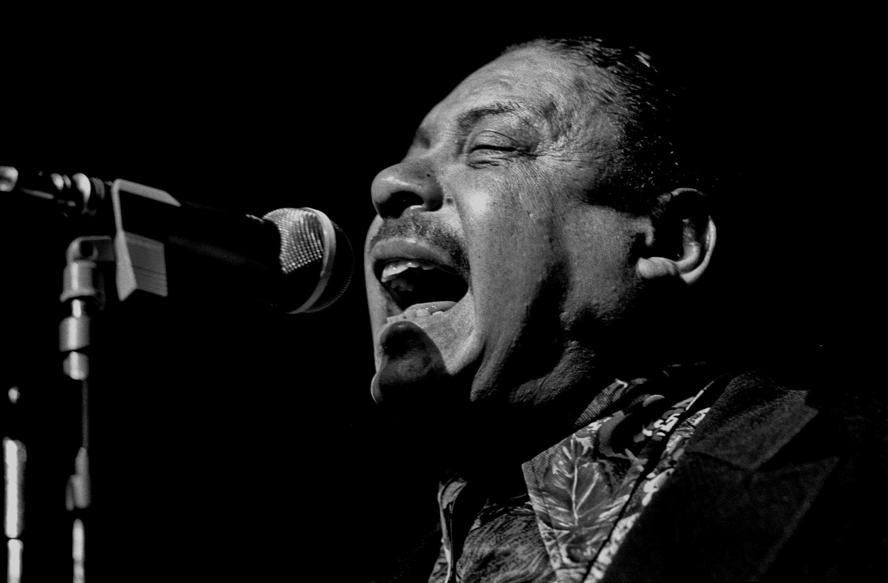
  * 作为一名跳跃蓝调歌手，他经常被称为“**蓝调呐喊者**”，因为他在激动人心的表演中，声音与萨克斯管的喇叭声相匹配
  * 与爵士乐和布鲁斯音乐一样，特纳的歌曲经常充满**性暗示**，在50年代，白人歌手想要自己的音乐在广播中播放，就必须去掉这些暗示
  * 下面是乔·特纳和比尔·哈利的《**摇摆、嘈杂和摆动**》的**聆赏指南**

  * 哈利的版本比特纳的**更快**，爵士乐风格的特征也**更少**，而且歌词被**淡化**了，以便更广泛的观众能够接受，因为原版中的性暗示可能会**冒犯**到他们
* 比尔·哈利的《**（We‘re Gonna）Rock Around the Clock**》在流行音乐排行榜上连续八周位居榜首，在节奏布鲁斯音乐排行榜上也排名第三
  * 它还遵循了**十二小节的蓝调形式**，使用了**不均匀的节拍细分**（除了吉他独奏），并且有**萨克斯管**演奏的**即兴片段模式**，这与爵士音乐家使用的即兴演奏不同
  * 1957年，**比尔·哈利和彗星乐队**在英国巡演，成为第一批**国际摇滚明星**；在50年代，尽管**西部摇摆乐**与**节奏布鲁斯**的结合很受欢迎，但它并没有被证明如下等酒吧音乐、乡村音乐和节奏布鲁斯的结合一般，是一种持久和有影响力的摇滚风格
## 埃尔维斯·普雷斯利
* **山姆·菲利普斯**（Sam Phillips）是阿拉巴马州的一个农场男孩，十几岁时就开始做**音乐节目主持人**；1944年，他搬到**孟菲斯**，在21岁的时候，他开始了**孟菲斯录音服务**，因为他喜欢蓝调，所以他录制的大多数艺术家都是来自南方的非裔美国蓝调音乐家
 
  * 菲利普斯的公司规模太小，无法在全国各地大量分销唱片，所以他早期的许多唱片都卖给了**更大的公司**，比如芝加哥的象棋唱片公司；1951年底，为了能够自己发行唱片，菲利普斯成立了**太阳唱片公司**
  * 菲利普斯意识到**美国白人**对**布鲁斯和节奏布鲁斯**的兴趣日益浓厚，但他也意识到美国白人更倾向于购买**白人艺术家**的唱片；白人青少年希望在歌词中听到**有关性的内容**，但唱片公司的高管和电台节目制作人愿意尽一切努力将它们**拒之门外**
  * 山姆·菲利普斯知道，要想卖出热门唱片，他需要一个**白人歌手**，他既能抓住非裔美国歌手的**风格和节奏**，同时又能根据白人的口味**改编歌词**
* 1954年，当年轻的**埃尔维斯·普雷斯利**（Elvis Presley）来到他的录音室录制《**我的幸福**》（My Happiness）和《**那时你的心痛开始了**》（That’s When Your Heartaches Begin）这两首歌送给他母亲作为生日礼物时，他发现了这位歌手
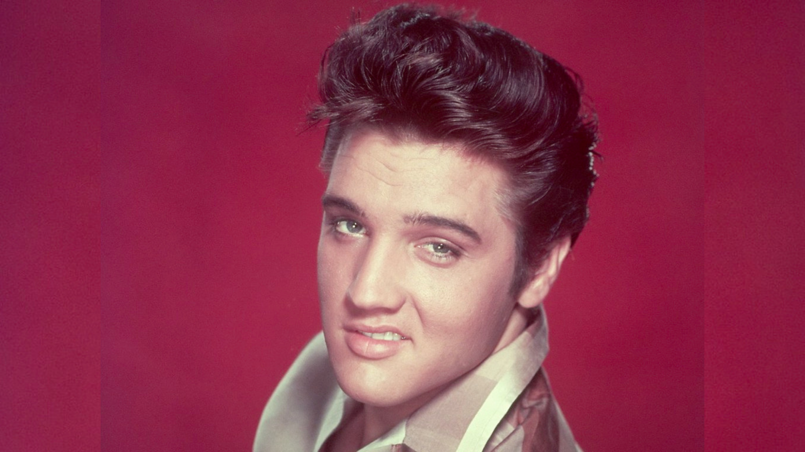
  * 埃尔维斯·普雷斯利在太阳唱片公司的唱片向美国青少年介绍了**摇滚音乐**（摇滚+乡村音乐）；普雷斯利中使用的**标准伴奏**就是一把电吉他、一把原声节奏吉他、弦乐贝斯和柔和的鼓
  * 普雷斯利的首席吉他手**斯科特·摩尔**（Scotty Moore）在一些歌曲中使用了乡村音乐中常见的**稳定节拍**，但他也改变了自己的风格，在其他歌曲中加入了**不均匀的节拍模式**；摩尔在琴弦上的**滑音**也暗示了乡村的声音，给人一种**钢弦吉他**的效果，而普雷斯利则用**木吉他**保持节奏
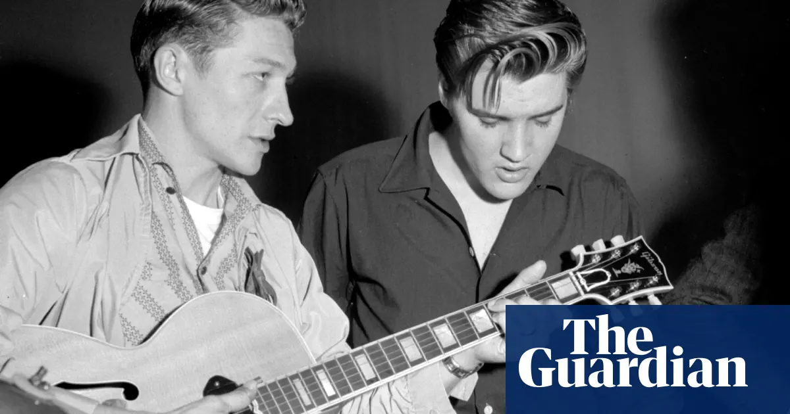
  * 贝斯手**比尔·布莱克**（Bill Black）在演奏时用他的**立式贝斯指板**敲击琴弦，创造出一种典型的摇滚风格；贝斯通常在第1拍和第3拍（**双拍贝斯**）上演奏，或者在一个四拍小节的全部四拍上演奏，而鼓则演奏节奏布鲁斯风格的shuffle节奏，并强调每个小节的**后拍**

  * 普雷斯利的太阳唱片，如“**Good Rockin‘Tonight**”和“**Milkcow Blues Boogie**”，遵循了传统的**12小节蓝调形式**，但歌曲的节奏几乎总是比布鲁斯或节奏布鲁斯快；**更快的节奏**产生了一种**精力充沛的强度**，这是摇滚的一个重要特征
* 在当地取得了一些成功后，普雷斯利被菲利普斯派去参加**乡村大剧院**的试演，但他没有被接受；他的风格对大剧院来说太“黑”了，对节奏布鲁斯的观众来说又太“白”了
  * 他的声音在非裔美国人或白人传统中都**没有直接的先例**；他有一种宽广、甜美的**颤音**，暗示着感官上的温暖，但可以突然转变成一种**假声**，暗示着压抑的紧张，甚至是一种几乎无法抑制的**狂野**
  * 他干净、英俊，有着**詹姆斯·迪恩**（James Dean）的叛逆形象，尽管他经常在蓝调歌曲中唱“干净”的歌词，这些歌词最初充满了**性暗示**，但他通过**暗示性的姿势和臀部旋转**，将性转而融入到了他的表演中
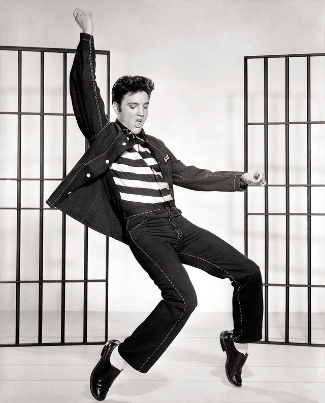
* 1955年，普雷斯利在**电台节目**中表演，主要是在**南方**，他第一次有机会在当地的电视节目中露面；在那个时候，他主要被认为是一个**乡村歌手**，他的成功仅限于**田纳西地区**
  * 他去了纽约，但在参加**亚瑟·戈弗雷**（Arthur Godfrey）的节目《**星探**》（Talent Scouts）时被拒绝了；在《**神秘列车**》的发行引起了足够的关注，显示出普雷斯利的潜力后，**RCA公司**仅以3.5万美元的价格买下了他的合同
* 在经纪人**汤姆·帕克上校**认真而积极的管理下，普雷斯利在RCA事业有成；由于他得到了更好的宣传，他的录音声音也更加精致，他在一年内成为了**明星**
  * 然而，对于纯粹的摇滚乐迷来说，普雷斯利的太阳唱片比他的RCA唱片要好；普雷斯利不是一个词曲作者，在RCA，他的许多歌曲都是由**流行作家**写的，并在一个干净的录音室制作，伴随着**嘟-哦普风格**的合唱和**胖子多米诺风格**的钢琴伴奏
  * 普雷斯利的粉丝们并不真正关心录音的技术细节；他不可抗拒的**表演风格**为他赢得了“**摇滚之王**”（King of Rock and Roll）的美誉
  * 1956年，他在电视节目和舞台表演中，扭动着臀部，唱着他的热门歌曲《**心碎旅馆**》（Heartbreak Hotel）、《**我想要你，我需要你，我爱你**》（I Want You, I Need You, I Love You）、《**不要太残忍**》（Don’t Be Cruel）和《**猎犬**》（Hound Dog），俘获了许多少女的心（这也引起了她们父母的愤怒）；苏利文的电视节目只展示了猫王**腰部以上的照片**，以避免他的动作过分性感
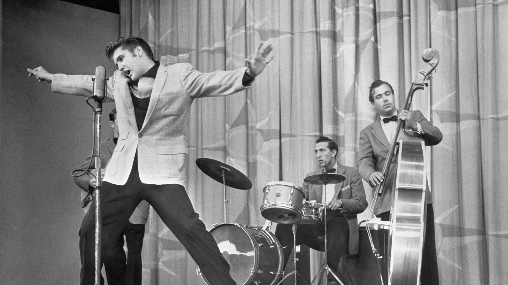
* 在那个时期，普雷斯利的风格包括一些**布鲁斯音乐**，但他的唱片都是为了迎合他的形象和取悦他的**青少年听众**而制作的
  * 对普雷斯利来说，成为热门歌曲的布鲁斯歌曲之一是《**猎犬**》，由作曲团队为**威利梅·“大妈妈”·桑顿**（Willie Mae “Big Mama”Thornton）写的，她是第一个录制这首歌的人
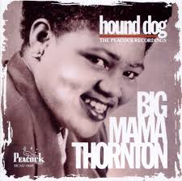
  * “猎犬”是**非裔美国人的俚语**，指**欺骗自己女人的男人**，但当埃尔维斯演唱这首歌时，这个名字就有了**完全不同的含义**；在他的版本中，他斥责一个女人，说她就像一只不擅长抓兔子的猎犬一样没用——这与桑顿的录音完全不同，但符合埃尔维斯**早期的硬汉形象**
  * 对比两张唱片，普雷斯利的唱片中还出现了其他变化，包括**节奏加快**，蓝调乐器和以蓝调为主的即兴演奏被以乡村音乐为主的**乐器**所取代
  * 下面是威利梅·“大妈妈”·桑顿和埃尔维斯·普雷斯利的《**猎犬**》的**聆赏指南**

* 1956年，普雷斯利凭借《**温柔地爱我**》（Love Me Tender）成为**电影明星**，他的每部电影之后都有一系列热门歌曲

  * 他从未忘记自己的**家和父母**；他用离开太阳唱片公司时收到的大额支票给他们买了两辆**凯迪拉克**
  * 1957年，他买下了他生前居住的**雅园**（Graceland），并于死后在这里被人们怀念；因为他母亲从未学过开车，她的**粉色凯迪拉克**就停在了雅园，一直停在那里

  * 1957年，普雷斯利拍摄了两部电影，《**爱你**》（Loving You）和《**摇滚监狱**》（Jailhouse Rock），其中包括热门歌曲《**泰迪熊**》（Teddy Bear）和《**摇滚监狱**》
  * 接下来的一年对这颗新星来说不太好；当他正在拍摄《**克里奥尔国王**》（King Creole）时，**征兵通知书**到了
  * 就在他参加基础训练后不久，他的**母亲**就去世了，他还没来得及回家看她，他称这是他一生中**最惨痛的损失**
* 多亏了**帕克上校**，普雷斯利的事业在缺席的两年里得以延续；为了让普雷斯利留在粉丝的心中，帕克非常谨慎地发布了**预先录制的歌曲**，比如《**硬头女人**》（Hard Headed Woman），当时普雷斯利还在服役
  * 回归平民生活后，普雷斯利更像是一位**电影明星**，而非音乐会表演者；他的**电影原声专辑**卖得很好，从1968年开始，他进行了几场巡回演唱会和电视电影，以及在拉斯维加斯露面
  * 在他生命的最后一年里，他继续发行**热门单曲**，但他那古老、粗糙、摇滚的风格早已一去不复返；对于乡村音乐爱好者来说，普雷斯利已经转向了**流行音乐风格**
  * 但到了60年代早期，摇滚音乐对大多数美国观众已经**失去了商业吸引力**；普雷斯利能够改变自己的风格以适应当前的**流行趋势**，这是他能够维持自己的职业生涯长达30年的部分原因
* 他于1977年去世，在很多方面都是**其传奇地位的受害者**
  * 下面是他的《**燃烧的爱**》的**聆赏指南**

  * 在《**燃烧的爱**》（Burning Love）发行后的五年里，普雷斯利继续录制唱片和巡回演出，但他的个人生活已经**支离破碎**；他的妻子**普莉希拉**（Priscilla）与他离婚，他大部分私人时间都**隐居**在自己的雅园
  * 到他去世的时候，他已经花了20多年的时间试图避免**无所不在的粉丝的焦虑要求**；他付钱给大型百货公司，让他们在半夜开门，这样他就可以在一定程度上有隐私的情况下购物
  * 他究竟是从什么时候开始**吸毒**的，我们不得而知，至少没有公开，但他对各种巴比妥类药物、镇定剂和安非他命的依赖无疑导致了他在**42岁时的死亡**
## 卡尔·珀金斯
* **卡尔·珀金斯**（Carl Perkins）在田纳西州的一个农场长大；他一直喜欢布鲁斯和节奏布鲁斯，决定模仿普雷斯利的风格
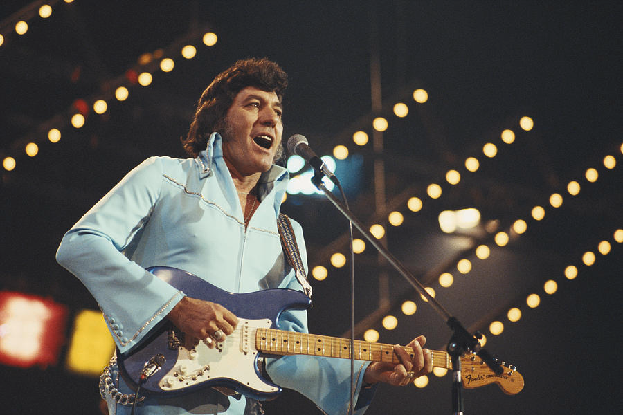
  * 虽然他没有埃尔维斯·普雷斯利的美貌，但他的**声音**很好，而且，与普雷斯利不同的是，他还**写歌**并担任**主吉他手**
  * 1956年，他录制了自己的作品《**蓝色麂皮鞋**》（Blue Suede Shoes），从此开启了他的职业生涯；山姆·菲利普斯与普雷斯利解约的部分原因是，他觉得还有一个更大的明星——珀金斯
  * 下面是他的《**蓝色麂皮鞋**》的**聆赏指南**

  * 然而，一场**车祸**使卡尔受伤，他的兄弟杰伊和他的经纪人大卫·斯图尔特丧生，光明的未来变得**暗淡**起来；当他准备再次演出时，摇滚风格已经被其他风格所掩盖
  * 然而，他确实继续作为一名**乡村唱片艺术家**，并取得了很大的成功；1995年，帕金斯战胜了**喉癌**，继续写作和录音，直到三年后因**中风**去世
## 杰里·李·刘易斯
* 另一位摇滚艺术家的摇滚生涯虽短，但影响深远，他是钢琴家兼歌手**杰里·李·刘易斯**（Jerry Lee Lewis）

  * 他在**路易斯安那州**长大，听乡村和蓝调歌手的音乐，为任何愿意听他的人弹**钢琴**；他是**传教士**吉米·斯瓦加特的堂兄，也深受**福音音乐**的影响
  * 在听了埃尔维斯·普雷斯利在**太阳唱片公司**的唱片后，他来到**孟菲斯**，与太阳唱片公司签约
* 杰瑞·李·刘易斯以**巨大的能量**演奏了他的**小酒馆钢琴摇滚**，他右手在键盘上滑动，左手敲击键盘，保持有节奏的低音线；他推开长凳，一边弹琴一边跳舞，让伴奏乐队伴奏，一边用脚敲击琴键，甚至一边唱歌一边跳到钢琴上
  * 杰里·李·刘易斯对钢琴和他的听众的态度让他当之无愧地得到了“**杀手**”（The Killer）的绰号
* 因为在没有与第二任妻子离婚的情况下就娶了他**13岁的堂姐**，他的唱片和演出遭到了一场**非官方的抵制**，这场抵制破坏了他的事业
  * 尽管刘易斯仍然留在太阳唱片公司录制乡村音乐，并继续进行现场演出，但他已经无法像以前那样吸引大批观众了
## 埃迪·科克伦
* 摇滚艺术家**埃迪·科克伦**（Eddie Cochran）的职业生涯很短，但对许多追随他的摇滚明星产生了持久的影响
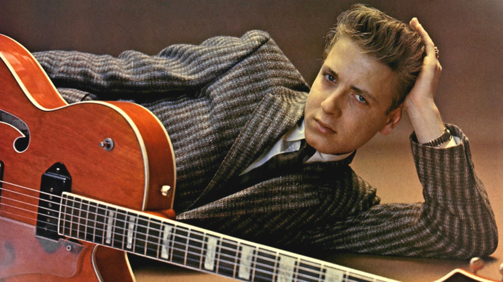
  * 他来自**俄克拉荷马州**，继承了詹姆斯·迪恩和马龙·白兰度的**硬汉形象**，甚至在《**未驯服的青年**》（Untamed Youth）中出演了一个角色
  * 下面是他的《**夏日布鲁斯**》（Summertime Blues）的**聆赏指南**

  * 这首歌和他的下一首热门歌曲《**来吧，大家**》（C’mon Everybody）都是科克伦尝试**叠录**（overdubbing）的结果，在这首歌中，所有的部分都是他自己演奏和演唱的
  * 叠录是**莱斯·保罗**（Les Paul）在50年代早期发明的一种新的录音技术，虽然以前也有人使用过，但科克伦是第一批**广泛使用**这种技术的摇滚音乐家之一；叠录技术很快成为一种**常见的录音做法**
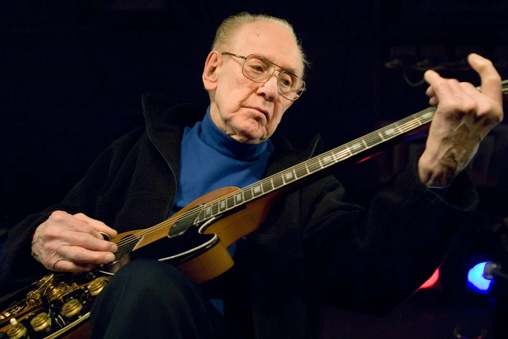
* 科克伦发现，随着50年代后期**青少年偶像明星的崛起**，摇滚风格的流行正在消亡
  * 在他的最后一首热门歌曲《**三步向天堂**》（Three Steps to heaven）中，他似乎要改变自己的风格，加入更多这种**新的流行音乐**元素
  * 这首歌一点也不摇滚；相反，它的特点是**轻柔的吉他**保持节奏，一个**嘟-哦普风格**的人声组合，很少有贝斯、鼓或节奏强调
  * 然而，他从未真正有机会在他的新风格中站稳脚跟；1960年，他在结束英国之旅后前往伦敦机场的途中**死于车祸**
## 吉恩·文森特
* 另一位摇滚歌手**吉恩·文森特**（尤金·文森特·克拉多克，Gene Vincent）在艾迪·科克伦的最后一次巡演中与他同行，但在科克伦死亡的那场事故中幸存了下来
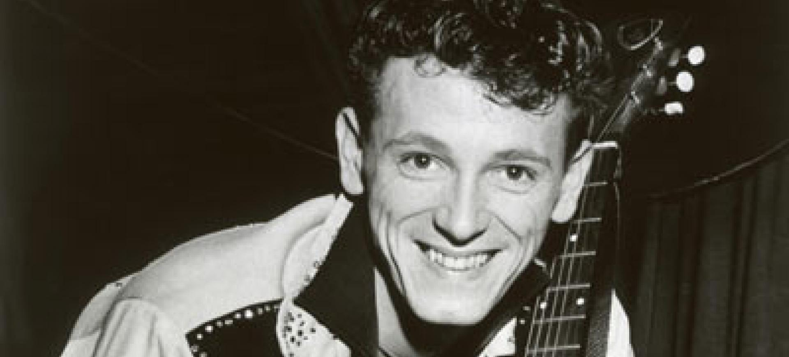
  * 文森特在**弗吉尼亚州**长大，在那里他唱过一种被称为**白人福音**的宗教乡村音乐；朝鲜战争期间，他在海军服役，之后他对猫王的摇滚风格产生了兴趣，并组建了一个名为“**蓝帽**”（Blue Caps）的组合
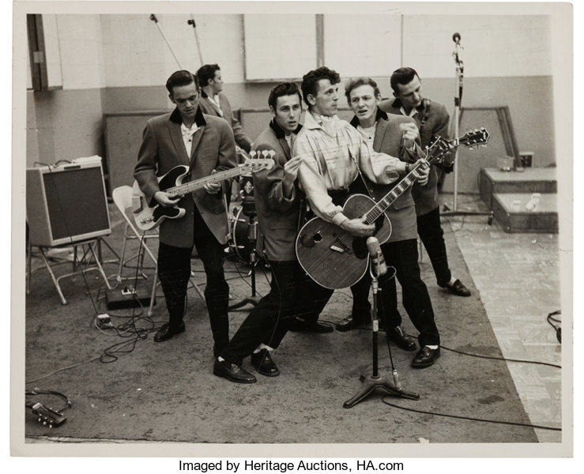
  * 他们把试镜磁带寄给了好莱坞的**国会唱片公司**，该公司与他们签订了合同；文森特的声音和普雷斯利非常相似，以至于国会唱片公司把他看作是普雷斯利的有力竞争对手
  * “**be - bop - a - lula**”是吉恩·文森特和蓝帽乐队的第一张唱片，也是他职业生涯中最受欢迎的一张唱片
  * 文森特的形象比普雷斯利的**粗糙**一些，尽管他们都是詹姆斯·迪恩的**硬汉传统风格**；由于在海军服役时**腿部受伤**，文森特无法像普雷斯利那样表演性感的臀部动作，相反，他通过他的**呼吸声**传达了一种**性绝望的感觉**
* 1957年，《**许多爱**》（Lotta Lovin’）对他来说是一首热门歌曲，但那时很明显，摇滚在美国开始失去人气
  * 文森特没有尝试转向流行风格，而是搬到了**英国**，在那里他继续以一名摇滚艺术家的身份表演；1971年，由于健康状况不佳，他回到美国，不到一个月就去世了
## 巴迪·霍利
* **查尔斯·哈丁·霍利**（Charles Hardin Holley）的姓氏在他职业生涯早期被误拼为没有“e”，他决定让它保持原样；作为**巴迪·霍利**（Buddy Holly），他是摇滚乐的另一个重要创新者

  * 霍利来自德克萨斯州的**卢伯克**，小时候就学会了小提琴、吉他、班卓琴和钢琴；他组建了多个乡村和原始摇滚团体，并在1956年获得了一份合同，以**Three Tunes**的名义为纳什维尔的Decca Records唱片公司录制唱片
  * 霍利的Decca唱片是**乡村歌曲**，卖得不好，所以他和他的鼓手**杰里·艾莉森**决定回到德克萨斯州，在那里他们以二人组的形式演出；霍莉和艾莉森组成了**蟋蟀乐队**（The Crickets），并前往新墨西哥州录制了他们的第一首热门歌曲“That'll Be the Day”
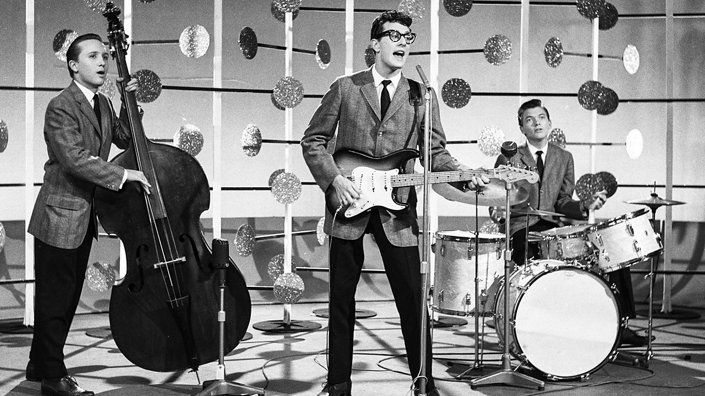
  * 他的声音风格**轻快**，特点是在某些短语转弯时他**标志性的打嗝**
* 与科克伦（Cochran）或文森特（vincent）等穿着皮夹克的摇滚明星不同，霍利的形象不是一个**叛逆的青少年**；他穿着西装，打着领带，戴着角质框眼镜，这让他看起来是个整洁、体面、甚至有点**天真的年轻人**
  * 蟋蟀乐队使用了标准的**摇滚乐器**，包括两把吉他（一把是主音吉他，一把是节奏吉他）、贝斯和鼓，除了他们的吉他是电吉他（霍利的吉他有坚固的琴体）
  * **杰里·艾莉森**扮演了一个不同的、比其他**摇滚鼓手**更重要的角色；艾莉森有时会使用微妙而有趣的**拉丁节奏**，这在当时的摇滚乐中并不常见
* 巴迪·霍利是最早使用**实心电吉他**的摇滚吉他手之一；比尔·哈利曾弹过西方摇摆乐队常用的**空心电吉他**，而那些摇滚歌手则经常弹**钢弦木吉他**
  * 霍利的乐器坚固的机身使它比带原声音箱的吉他**更具侵略性**的音质；在很短的时间内，实心吉他成为摇滚音乐的**标准吉他**
  * 下面是巴迪·霍利的热门歌曲《**佩吉·苏**》（Peggy Sue）的聆赏指南

* 然而，1958年底，霍利决定在他的职业生涯中做出一些**改变**；他离开了蟋蟀队和他们的经纪人诺曼·佩蒂，结婚了，搬到了**纽约**，开始努力提高自己的写歌技巧，改变自己的风格以适应**新的流行趋势**
  * 他的最后一首热门歌曲《**It Doesn‘t Matter Anymore**》是他在纽约遇到的少年偶像**保罗·安卡**（Paul Anka）为他创作的，制作时使用了流行风格的**管弦乐部分**，而不是蟋蟀乐队的乐器
  * 1959年2月3日，波普、瓦伦斯和霍利都死于一场**飞机失事**，许多摇滚迷永远不会忘记这个日子
## 艾弗里兄弟
* 从50年代末到60年代初，在美国保持流行的少数受乡村乐影响的摇滚团体之一是**艾弗里兄弟**（The Everly Brothers）
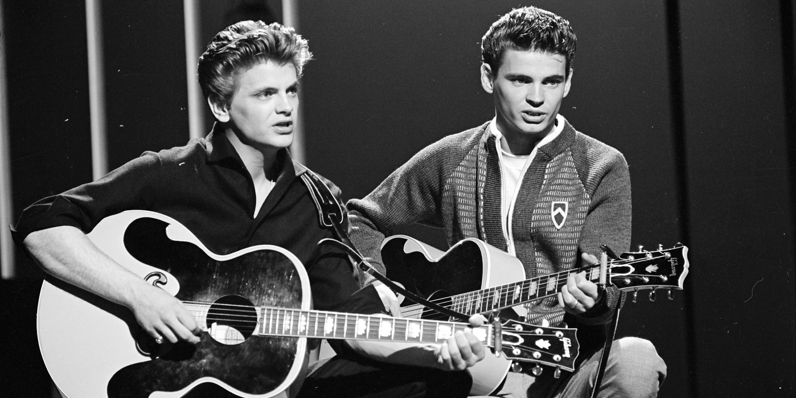
  * 菲尔和唐·埃弗里的父母艾克和玛格丽特·埃弗里都是**乡村音乐家**；他们早在1946年就有了一个**电台节目**，当时菲尔和唐分别只有7岁和9岁
  * 兄弟俩**紧密协调的男高音**由他们自己的节奏吉他、电子首席吉他手切特·阿特金斯、钢琴家弗洛伊德·克莱默、贝斯和鼓伴奏
  * 他们的声音与Sun唱片公司录制的**纯摇滚音乐**不同，因为它**流畅而丰满**，缺少击打的低音和Sun摇滚音乐的一些强度；埃弗利兄弟的声音逐渐上升到高音，捕捉到了一个人**几乎快要哭出来的声音**
  * 他们于1957年与Cadence唱片公司签约，并录制了许多最著名的歌曲，包括《**Bye Bye Love**》和《**All I Have to Do Is Dream**》；1960年，他们签约了华纳兄弟唱片公司，录制了《**凯茜的小丑**》（Cathy’s Clown），这首歌成为他们最受欢迎的歌曲
  * 他们的唱片一直持续到60年代，但销量却比不上他们早期的唱片；1973年在舞台上**打架**后，两人不可避免地分手了，十年后他们才举行了一场**重聚音乐会**