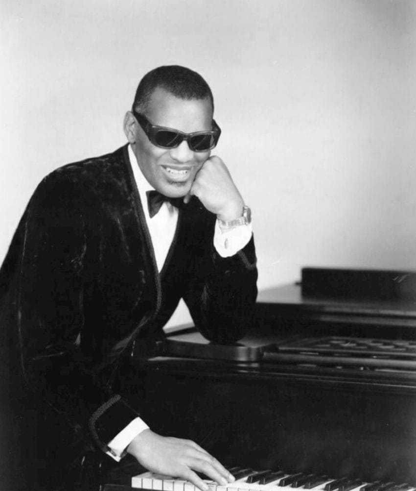
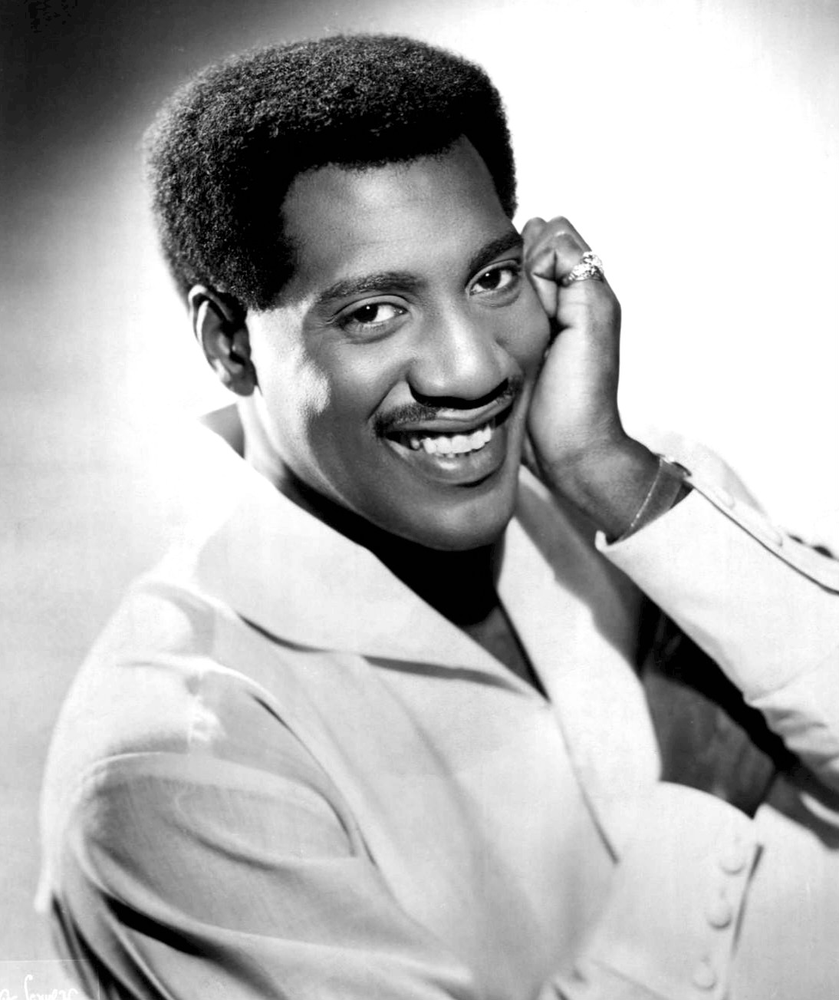
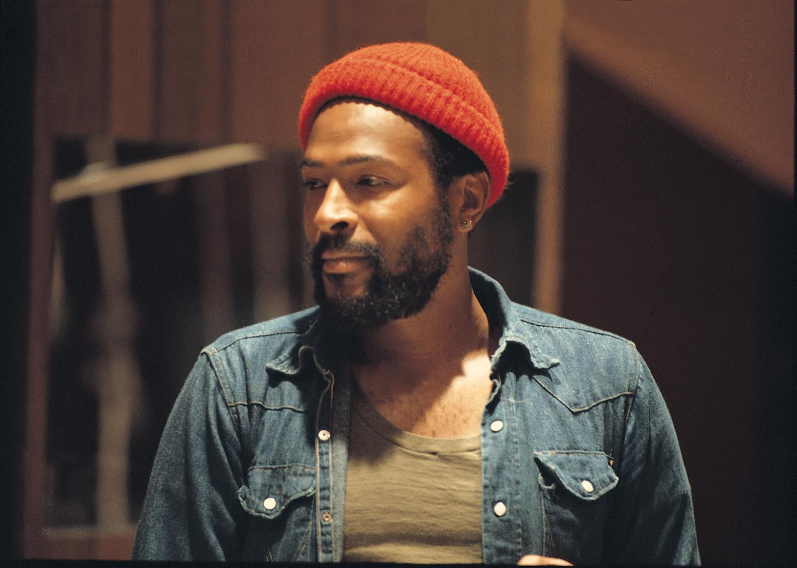

[TOC]
# 灵魂乐与摩城
* **灵魂乐**是**节奏布鲁斯**和**福音音乐**的结合，两者相互增强，表达了人类**对爱和关系的情感**；灵魂乐歌手大多也是**福音音乐歌手**，他们用同样的激情演绎神的赞美，也用同样的激情演绎人间的爱
  * 灵魂乐歌手的**演唱特点**包括：旋律中加入**快速的情感变化**，从哭泣到呐喊；使用**假声唱法**；运用黑人福音音乐的**装饰音**；这些都增加了灵魂乐的感染力
  * 灵魂乐的**节奏特点**包括：**不均匀**的节拍细分，强调**后拍**，以及充满活力的**铜管或萨克斯独奏**；这些都增加了灵魂乐的丰富性
  * **摩城音乐**与其他灵魂乐风格有所区别，因为该公司有意减少了福音音乐和布鲁斯音乐的影响，以便更好地吸引**白人听众**
* 灵魂乐的情感吸引力与**民权运动**有直接的关系，因为灵魂乐的创作、制作和演出者都是在种族歧视的环境中生活和工作的
  * 灵魂乐歌手和其他非裔美国人表演者经常遭受**不公平的待遇**，比如不能住在自己演出的酒店，不能在任何地方用餐，不能在南方投票等等
  * 当**阿瑞莎·弗兰克林**（Aretha Franklin）唱出“**尊重**”（Respect）（1967）时，她的信息不仅仅是她想让她的男人尊重她，她也想要所有的听众，以及其他非裔美国人，都得到尊重

  * 在六十年代，**詹姆斯·布朗**（James Brown）利用他对非裔美国人的巨大影响力，用积极的“黑人自豪”和反对暴力的言辞来缓和种族紧张；他的歌曲“**大声说出来，我是黑人，我为自己感到骄傲**”（Say It Loud, I’m Black and I’m Proud）就强调了努力工作来获得他和他的人民应得的独立的必要性

* 灵魂乐的风格在**不同地区**有所差异，**南方的风格**，如孟菲斯或肌肉海湾的风格，往往更粗犷、**更有力量**，而**北方的风格**，如芝加哥、费城和底特律的风格，往往更**精致**
  * 这种差异可能与**灵魂乐歌手的训练**有关，他们大多受到黑人福音音乐的影响，而在不同地区，**教堂里的歌唱风格**也不同
* 在北方的风格中，**底特律的摩城公司**最为与众不同，因为它的音乐经过了精心的打磨，主要针对**白人听众**
  * 所有的灵魂乐风格都有**跨种族的吸引力**，但摩城特别强调了**流行和爵士音乐**的影响，以及录音室制作的**精致度**，而其他灵魂乐风格则更像**现场演出**
  * 这种精致度打破了电视节目中只把非裔美国人描绘为**仆人**的形象，而是展示了他们作为**高雅人士**的一面；这种形象有助于一些白人听众对非裔美国人产生了新的、更积极的印象，也有助于非裔美国人听众为自己的生活找到积极的榜样
* 灵魂乐这个术语直到**六十年代中后期**才开始被广泛使用，但这种音乐风格在**五十年代**就开始发展，受到了雷·查尔斯、詹姆斯·布朗、山姆·库克和杰基·威尔逊等歌手的影响
* **雷·查尔斯·罗宾逊**（Ray Charles Robinson）在六岁时就因为**青光眼**失明了；他从小就开始学习钢琴，音乐给了他一个不需要视觉的世界

  * 除了键盘乐器，他还学会了吹小号、萨克斯和单簧管，他还学习了用盲文读写音乐和作曲；在十五岁时失去父母的他，靠音乐谋生
  * 为了避免和拳击手“糖”**雷·罗宾逊**混淆，他把自己的姓氏去掉，从佛罗里达州的格林维尔搬到华盛顿州的**西雅图**，那里他以一位受到**纳特·“国王”·科尔**（Nat “King” Cole）影响的歌手/钢琴家的身份而工作

  * 虽然查尔斯是少数没有在**教堂**里演唱过福音音乐的灵魂乐歌手之一，但他把**福音音乐的元素**融入了他的节奏布鲁斯风格中
  * 雷·查尔斯的布鲁斯歌曲《**What’d I Say**》（1959）中可以听到福音音乐中常见的**叫应式**，这是一种歌手和合唱团之间的对话

    * 这首歌在原版发行时，每面都有**不同版本的同一首歌**，第二面是第一面的延续；更加精致的**节奏布鲁斯版本**在节奏布鲁斯榜上排名第一，在流行榜上排名第六，但是第二面的录音，叫做《What’d I Say (Part Two)》，则特色是一支**福音风格的合唱团**回应查尔斯的主唱
  * 雷·查尔斯与其他灵魂乐艺术家不同的重要才能之一是他能够把**乡村、节奏布鲁斯和爵士风格**与**福音音乐**融合起来；他的乐队编曲中包含了乡村和布鲁斯音乐的元素，他的钢琴演奏也受到了福音音乐的影响，他的一些歌曲中也使用了乡村音乐中常见的故事性歌词
  * 在六十年代中期，因为涉嫌持有毒品被捕，查尔斯停止了演出，并入住了一个戒毒医院，以摆脱他长期对海洛因的上瘾；电影《**雷**》（Ray）就是根据他的生平改编的

* **山姆·库克**（Sam Cooke）于1951年开始了他的职业歌唱生涯，当时他担任了著名而成功的福音乐团**Soul Stirrers**的主唱

  * 他在1956年决定涉足**世俗音乐**，但想要避免被批评为“出卖”了纯粹的福音音乐，这是其他福音歌手所遭受的；为此，他在录制《**可爱的**》（Lovable）时使用了**戴尔·库克**这个名字
  * 他离开了灵魂搅拌器，放弃了化名，换了唱片公司，并在1957年发行了《**你让我心动**》（You Send Me）；这首歌的成功标志着他流行音乐生涯的开始，也标志着他轻柔、高亢、流行和福音风格的演唱对未来歌手的影响

  * 库克甜美、天真、偶像化的形象在1964年被打破，当时他在一家汽车旅馆里被一名声称他攻击了她的女人开枪打死
* 另一位音乐创新者是**詹姆斯·布朗**（James Brown）

  * 他五岁时，他的母亲就把他留给了她的姐姐抚养，他的父亲时不时地出现，但没有和他住在一起；布朗靠**在街角跳舞**赚钱，还帮助他的姑姑维持生计；他的舞步越精彩，他赚的钱就越多
  * 詹姆斯·布朗和the Famous Flames录制的第一首热门歌曲是**福音风格**的，但主题是**世俗**的，《**Please, Please, Please**》；这首歌使用了钢琴中常见于福音、嘟-哦普和一些节奏布鲁斯的**三连音**，以及布朗的恳求和情感的声音

  * 布朗的戏剧性和充满活力的声音装饰与他**疯狂的舞台表演**很相配，他的表演包括有节奏的舞步、劈叉和跪地；布朗在舞台上对他的音乐投入极深；他会通过在一首歌中倒地不起，仿佛心脏病发作，来向观众展示他付出了全部，这是他经常在南方看到**非裔美国牧师**在礼拜仪式中做的

  * 有充分的理由，詹姆斯·布朗被称为“爆炸先生”、“演艺界最努力工作的人”、“灵魂兄弟第一号”、“灵魂教父”和“有所有名字的人”
  * 通过录制《**Out of Sight**》和《**Papa’s Got a Brand New Bag**》，布朗开创了一种新的风格，这种风格更依赖于非洲影响的**多节奏**，而不是旋律；这种风格是后来被称为**放克**的音乐的开始
  * 詹姆斯·布朗在《**Cold Sweat**》、《**Say It Loud, I’m Black and I’m Proud**》和《**King Heroin**》中传达了类似**布道**的信息
    * 《大声说出来——我是黑人，我为自己感到骄傲》表达了**非裔美国人自豪感的根源**，鼓励他们通过努力工作来为自己的人民取得积极的成就；这首歌发行的同一年，**马丁·路德·金**博士被暗杀，《大声说出来——我是黑人，我为自己感到骄傲》帮助了马丁·路德·金博士的信息继续传播；詹姆斯·布朗因为他有效地引导非裔美国人走向和平的平权运动，而受到了**休伯特·汉弗莱**（林登·约翰逊总统下的副总统）的公开赞扬
    * 在《**海洛因之王**》中，布朗向他的听众讲述了毒品滥用的危害；这首歌让人想起了一首反酒精歌曲《酒精之王》，由**奥利弗·迪特森**创作
## 孟菲斯灵魂乐
* **孟菲斯**是一个美国南部的城市，它在摇滚音乐的发展中有很大的影响，因为**萨姆·菲利普斯**在那里开了一个录音室，录制了很多不同风格的歌手，包括**埃尔维斯·普雷斯利**，他是摇滚乐的先驱之一
* 在六十年代，孟菲斯的音乐家们把像**詹姆斯·布朗**和**杰基·威尔逊**这样的歌手的福音风格的演唱与**小理查德**的充满活力的节奏布鲁斯风格结合起来，创造了他们自己的**灵魂乐品牌**
  * 孟菲斯的灵魂乐歌手大部分都是在当地的两个唱片公司**Stax**和**Volt**开始录制歌曲的，后来这些歌曲被另一个更大的唱片公司**Atlantic**发行到全国
* 孟菲斯灵魂乐有一种特别的声音，因为很多歌曲都是由**同一个乐队**来伴奏的，这个乐队叫做**Booker T. and the MGs**；这个乐队有**四个成员**，他们分别弹奏风琴、吉他、贝斯和鼓，他们不仅给其他歌手伴奏，也有自己的歌曲

  * Booker T. and the MGs给孟菲斯灵魂乐带来了很多创新和影响，他们的吉他手**Steve Cropper**还写了很多热门歌曲，他们对**低音部分**的强调也影响了后来的音乐风格

* **威尔逊·皮克特**（Wilson Pickett）是一个美国歌手，他出生在阿拉巴马州，后来搬到了底特律，他在那里和一支叫做**The Violinaires**的福音乐团一起唱歌

  * 1959年，他十九岁时，他放弃了他的**福音风格**的咕哝和喊叫，转而唱**节奏布鲁斯**的情歌，和一支叫做**The Falcons**的乐队合作；他的旧的福音演唱风格在他的制作人**Jerry Wexler**把他送到孟菲斯录音时又回来了
  * “**In the Midnight Hour**”是一首孟菲斯灵魂乐的经典歌曲，它是由Pickett和Booker T. and the MGs的吉他手Steve Cropper在录音现场共同创作的

  * “In the Midnight Hour”的录音中，**小号和萨克斯之间的平行运动**在孟菲斯录音中很常见，它被称为“**Memphis horn sound**”；歌曲中**均匀的节拍细分**使它与大多数节奏布鲁斯不同，但是**受福音影响的演唱**使它成为孟菲斯灵魂乐的一个很好的例子，录音中**非常活跃的低音线**也是孟菲斯灵魂乐的特征之一
* **Otis Redding**是Stax唱片公司**最畅销的歌手之一**；他的演唱风格既有Little Richard的激进，又有Sam Cooke的柔情，而且还加入了很多**情感的力量**

  * 例如，在《**Try a Little Tenderness**》中，他用他的**长长的福音音乐装饰**来制造紧张感，随着歌曲从一段到另一段，逐渐增加了歌曲的强度
  * **Redding**自己写了很多他的热门歌曲，包括《**尊重**》，他在1965年录制了这首歌，两年后**Aretha Franklin**翻唱了它
  * Redding的充满激情的演唱在六十年代中期赢得了**非裔美国社区**的大量追随者，他在1967年在**蒙特雷流行音乐节**上的表演也为他增加了**白人歌迷**
  * 他职业生涯中最大的热门歌曲是《**(Sittin’ on) The Dock of the Bay**》，这首歌是他和Booker T. and the MGs的吉他手Steve Cropper共同创作的；这首歌只是在Redding和他乐队**Bar-Kays**的几个成员在1967年遇到飞机失事身亡的**三天前**录制的

## 大西洋唱片公司
* **Ahmet Ertegun**和**Jerry Wexler**是**大西洋唱片公司**（Atlantic Record Company）的制作人和作曲家，他们在纽约工作，对灵魂乐的发展有很大的贡献

  * Ertegun和Herb Abramson在**1947年**创立了大西洋唱片公司，那时候还没有出现受摇滚影响的**灵魂乐**；他们早期代表的艺人包括蓝调歌手**Joe Turner**和doo-wop组合**the Drifters**

  * 后来，他们也发行了很多**不同风格的乐队**的唱片，比如Crosby, Stills, Nash and Young; the Velvet Underground; 和Led Zeppelin; 但是从五十年代末到六十年代，大西洋唱片公司是美国最主要的**灵魂乐发行商**之一

  * 录音的声音会因为**录音室和录音乐手**的不同而有很大的差别；Ertegun和Wexler根据他们对每次录音会的灵魂乐风格的想法，把他们的艺人从一个录音室带到另一个录音室
  * 那种风格强调电吉他、活跃的贝斯线和孟菲斯铜管乐器的平行运动，被称为**紧凑型孟菲斯灵魂乐**（tight Memphis sound）；Ertegun和Wexler也使用了**阿拉巴马州肌肉海滩**（Muscle Shoals）的**Fame录音室**（Fame Studios），来创造出类似的**南方灵魂乐**（southern soul）风格

* **Aretha Franklin**出生于田纳西州的**孟菲斯**，是一位浸信会牧师的女儿；她六岁时，父亲带着全家搬到了**底特律**，从小到大，她都在父亲的教堂里唱福音歌曲

  * 她十八岁时，搬到了纽约，开始录制世俗歌曲，其中有一首是模仿Ma Rainey和Bessie Smith的**经典蓝调风格**的《**Today I Sing the Blues**》
  * Franklin在她早期的世俗歌曲中，唱法比她在福音歌曲中更加**克制**，因为她在**哥伦比亚唱片公司**（Columbia Records）的制作人想让她走类似于爵士歌手**Nancy Wilson**的风格；直到1966年，她才签约了**大西洋唱片公司**（Atlantic Records）
  * **Jerry Wexler**带她去了阿拉巴马州的肌肉海滩（Muscle Shoals），在那里进行了一次录音会，他鼓励她把她在福音演唱中用过的能量、戏剧性和情感重新注入到她的声音中；在回归了她**更加热情的福音风格**后，她接连取得了一系列的成功，赢得了“**灵魂女王**”的称号

## 摩城更商业化的风格
* **Berry Gordy Jr**是一位来自底特律的非裔美国人作曲家，他发现五十年代的白人听众已经成熟到可以接受非裔美国人的音乐，但他也意识到非裔美国人需要的不仅仅是被接受，而是要得到尊重

  * 在他为Jackie Wilson写的歌曲《**Reet Petite**》和《**Lonely Teardrops**》取得成功后，Gordy决定成立自己的唱片公司；他把他的录音室和唱片公司命名为**Hitsville**，后来改为**Motown**，以纪念底特律的别称“**汽车之城**”（Motor City）

  * 在六十年代的**种族动荡和暴乱**期间，Motown的艺人唱出了**爱情**和其他人类**共同关心的话题**，让不同种族、宗教和政治信仰的人都能产生共鸣；Gordy在他的艺人身上培养了一种**精致的形象**，帮助他们赢得了尊重和自尊，也让其他非裔美国人把他们视为榜样
* **Maxine Powell**和**ITM**（International Talent Management）的其他人负责监督Motown艺人在舞台上的**着装风格**
  * 六十年代是一个大多数摇滚或流行乐团都穿着**相同服装**的时代，但那些服装**并不一定很精致**；来自纽约的乐团，甚至是非裔美国人女子组合像the Dixie Cups，都会穿着简单的裙子或裤子和毛衣

  * 这样的**休闲装**在Motown的艺人身上是找不到的，至少在六十年代是这样；Motown的女性歌手穿着**闪亮的礼服**或其他华丽的服饰，男性歌手穿着**西装或燕尾服**
  * 当然，一个男性歌手可能会在表演过程中脱掉外套和松开领带，但效果仍然是让歌手看起来适合在**高档场所**演出；甚至Motown的艺人的**名字**也是为了营造这种闪亮的形象

* Motown的制作人使用了**精致的背景编曲**，经常包括管弦乐队的弦乐部分和爵士乐器，比如萨克斯或铜管乐器；**福音音乐**的影响通过使用**手鼓**（非裔美国人教堂里的常用乐器）和**呼应式的人声**表现出来
  * 有一些歌曲，比如**Barrett Strong**在1960年的早期热门歌曲《**Money**》，是基于**传统的蓝调和弦**进行，但其他的蓝调和福音音乐的特色，比如蓝调音符，很少见；Motown的制作目标是一个比六十年代的大多数其他灵魂乐录音更大、主要是**白人**的商业听众
  * Motown的编曲经常以**具有感染力的节奏**为特色，配合不断重复的**贝斯线条**（ostinatos）；有些录音中也使用了**拉丁节奏**，比如Smokey Robinson和the Miracles的《**Mickey’s Monkey**》，它是基于一个古巴**son claves**节拍（用敲击在一起的木棒演奏）。那种节奏可以用下面的符号来表示

  * **The Temptations**的《**Cloud Nine**》使用了巴西桑巴音乐的**多节奏模式**；**白人音乐传统**，比如均匀的节拍细分和管弦乐器，也和**非裔美国人音乐传统**一样经常被使用，以确保Motown的音乐风格能吸引尽可能广泛的听众
* 除了Motown的歌手、作曲家和制作人的重要性外，Motown的音乐风格也要归功于Motown的常规伴奏乐队**the Funk Brothers**

  * The Funk Brothers在演奏**爵士和节奏布鲁斯**方面的背景使得Motown的音乐风格不同于之前的doo-wop或灵魂乐录音，因为他们在各自的部分中**更加活跃**，而不会盖过歌手
  * 比如，**James Jamerson**不想演奏之前流行音乐中常见的二拍或重复的陈词滥调式的**贝斯线**，他演奏了带有半音过渡音和复拍八分音符模式的行走低音线条，这些是**be-bop爵士乐手**使用的；他与be-bop爵士派别的区别在于他在大多数Motown录音中使用了一把**Fender电贝斯**（爵士乐手仍然使用弦贝斯）

  * **William Smokey Robinson**（1940年出生）是一位歌手，他在1957年为他的组合the Matadors写了歌曲；Berry Gordy Jr.在他刚开始寻找人才来创立自己的唱片公司时听到了他们，然后给他们换了一个新名字**the Miracles**，他们就成为了Motown最早最重要的组合之一

* 六十年代初，**女子乐团**非常受欢迎；大多数在纽约制作的乐团唱的都是轻快的**流行风格的歌曲**，针对的是青少年或者儿童的听众
  * Motown的女子乐团包括了**Marvelettes**，她们主要是为了迎合年轻的年龄段而录制歌曲，以及**Supremes**，她们通常是唱关于爱情和失恋的主题，适合稍微成熟一点的听众

  * 另一个女子乐团**Martha and the Vandellas**，她们的风格比Motown的其他女歌手更具有侵略性和福音音乐的色彩，这些乐团都有很多成功的作品

* 到了六十年代末，Motown的表演者实现了Berry Gordy的梦想，他们在白人听众中和黑人听众中**一样受欢迎**；即便如此，他们在南方地区巡演时仍然经常遭受和其他黑人艺术家一样的**不公正待遇**
  * Motown公司及其制作在这些年里也有所变化；六十年代初中期那种相当规范化的**灵魂和流行音乐**，在六十年代末和七十年代被**前放克风格和电子乐器**的使用所取代
  * 1971年，Berry Gordy Jr.把他的整个公司搬到了**好莱坞**，为了增加电影制作到Motown的业务范围；Supremes的前主唱**Diana Ross**成为了一位非常成功的电影明星，她在《Lady Sings the Blues》中扮演了爵士歌手**Billie Holiday**，在《Mahogany》中也有出色的表现

* **The Temptations**是Motown最受欢迎的**男子乐团**之一，Gordy给他们起了这个诱人的名字，他们之前叫做Elgins，然后叫做Primes

  * 他们在1962年签约，但是花了**两年的时间**才让他们的录音取得了商业上的成功；这是很常见的情况，Gordy在找到适合他们表演风格的作曲家和制作人之前，尝试了很多**不同的组合**
  * 以下是他们的热门歌曲“**My Girl**”的听歌指南；这首歌有着光鲜而厚重的背景音乐，包含了六十年代初中期其他流行风格制作中听到的大量乐器
  * **Norman Whitfield**，从1967年开始成为他们**唯一的制作人**，他受到了James Brown和Sly and the Family Stone等放克风格歌手的影响，决定在The Temptations录制“**Cloud Nine**”时尝试模仿他们的多节奏感
  * 歌曲“Cloud Nine”在一个层面上明显暗示了**毒品**，但它的信息不止于此；它描述了许多非裔美国人贫民窟里的年轻人所面临的**极度贫困的经济状况**，试图说明为什么有些人会用毒品来逃避
  * 这样的歌词在六十年代初是不可能在Motown出现的，因为当时整个公司都围绕着反映**体面普遍性的主题**，但Gordy让公司**随着时代而变化**
* 大多数时候，Gordy对他的音乐人的事业保持了**完全的控制**，很少有人能够获得自己作品的控制权；其中第一个赢得了自由写作和制作自己录音的人是**Stevie Wonder**

  * Wonder从出生开始就**失明**，他在童年时期学会了多种乐器，包括口琴、邦戈鼓和钢琴；他在十二岁时以“**Little Stevie Wonder**”的名字为Motown的Tamla厂牌开始录音
  * 在1971年，Wonder**二十一岁生日**时，他重新和Motown签订了合同，使他能够**完全控制**自己的录音；他结婚了，搬到了纽约，并且在他的写作和制作风格上做了一些重大的改变，这些改变受到了许多和Norman Whitfield在六十年代末为The Temptations制作的作品中使用的**放克风格**相同的影响
  * 从专辑《**Music of My Mind**》开始，Wonder在他的作品中加入了更多的福音、爵士和源自非洲和拉丁美洲的**节奏**；他在自己的录音中**叠加**了自己的歌唱和演奏大部分乐器的声音，并且喜欢用合成器的音色能力

* **Michael Jackson**和他的**四个哥哥**在Wonder十九岁时签约了Motown，年轻的Jackson很快成为了公司的新星；Gordy和其他人一起为**Jackson Five**写作和制作歌曲，根据他们的童星形象，他们的音乐**非常流行**，针对的是青少年和儿童的粉丝

  * **Jacksons的父亲**在他们加入Motown之前就管理了他们的事业，他们和Gordy公司签约后，他继续担任他们的**经纪人**；他知道Stevie Wonder被允许制作自己的音乐，当他被拒绝控制他儿子们的制作时，他决定让乐团离开Motown
  * 他们在1976年签约了**Epic厂牌**，并且在Motown提起诉讼后，改名为The Jacksons；乐团的成员有些变化，因为**Jermaine Jackson**留在了Motown，嫁给了Gordy的女儿Hazel

  * 但The Jacksons仍然保持了**五人组合**，因为家庭中下一个最年轻的男性成员**Steven Randall (Randy) Jackson**加入了乐团，取代了他哥哥的位置；后来，他们的小妹妹**Janet**也进入了音乐界

* **Marvin Gaye**受到了Ray Charles的爵士和灵魂风格的影响；他是华盛顿特区的一个**牧师的儿子**，从小就开始唱福音音乐和弹奏风琴

  * Berry Gordy Jr.在底特律听到了Gaye和**Moonglows**一起巡演，邀请他为Motown作为独唱者录音；加入Motown家族后不久，Gaye也加入了Gordy家族，娶了**Anna Gordy**，Berry的姐姐

  * Gaye是一位**高音歌手**，但他有着广泛的声音范围和风格范围，可以唱出像“**Can I Get a Witness**”这样的福音风格的歌曲，也可以唱出像他和**Tammi Terrell**合唱的“**You’re All I Need to Get By**”这样的柔情爱歌
  * **What’s Going On**这首歌是由Motown的员工作曲家Al Cleveland和Four Tops的成员Renaldo “Obie” Benson创作的；当Gaye演唱它时，他发现这首歌的信息表达了他当时**生活中的动荡**，使他的表演成为了他职业生涯中**最好的作品**

  * 他生活中的问题包括他的歌唱伙伴Tammi Terrell因癌症去世，他和Berry Gordy Jr.的姐姐的婚姻问题，他和他父亲（一位牧师）之间的紧张关系，以及他从在越南战争中打仗的兄弟那里收到的令人不安的信件；除了这些个人问题，Gaye也知道这首歌对许多人来说，是关于越战的伤亡和失败，以及与民权运动相关的一些暴力事件，是对全人类和平的一种绝望的呼吁

  * 起初，Motown公司**不想发行**这首歌，他们更感兴趣于“商业”上成功的制作；Gaye给他们施加了压力，拒绝再录制任何东西，直到这首歌发行，讽刺的是，这首歌很快成为了**商业上的热门歌曲**
  * 在与Motown公司有着长期合作后，Gaye在1982年离开了这个厂牌；他正处于复出的过程中，却在1984年被他父亲在一次争吵后开枪打死
* Motown公司在1988年被**MCA唱片公司**收购；Stevie Wonder和其他人继续在Motown厂牌下录制音乐，直到九十年代，Jermaine Jackson在后来的录音中换了Arista厂牌
