# 福音音乐和摇滚乐的乡村起源
* **布鲁斯**是摇滚的主要来源，但蓝调就是蓝调；它没有成为摇滚，直到它与其他音乐相结合，创造出新的东西
  * 人们可以说，50年代的摇滚是**蓝调**和**乡村音乐**的结合，但当时乡村音乐家多年来一直在演奏基于**12小节布鲁斯形式**的歌曲，听起来却不像他们在玩摇滚；如果他们演奏乐器并以独特的**乡村风格**演唱，他们的“布鲁斯”歌曲听起来就像乡村音乐
  * 当演奏和演唱蓝调、节奏布鲁斯和福音音乐长大的音乐家，如胖子多米诺、查克·贝里和小理查德，在他们的音乐中加入了乡村风格特征时，一种新型的摇滚乐就诞生了；摇滚乐的先驱也包括乡村音乐出身的音乐家如比尔·海利、埃尔维斯·普雷斯利、巴迪·霍利，不仅演奏蓝调形式的歌曲，而且在他们的演奏和演唱中加入了蓝调的特征，如蓝色音符和不均匀的节拍分段
## 黑人灵歌
* 在圣经新约（《以弗所书》5:19和《歌罗西书》3:16）中，基督徒被指示唱“灵歌”；因此，从18世纪中期到19世纪，**美国白人和非洲裔美国人**的传统宗教歌曲都被称为“**灵歌**”（spirituals）
  * 随着时间的推移，像**圣诗**（hymn）和**赞美诗**（psalm）这样的词越来越多地用于**白人作曲家**的歌曲，而**灵歌**则与**非裔美国作曲家**的歌曲联系在一起

* 就像一般的民间音乐一样，最初的灵歌不是写下来的，而是歌手之间**通过记忆传递**的；确切地说，早期的灵歌听起来像什么，只能从奴隶主日记中的描述或最早的印刷版本的歌词中猜测
  * 灵歌不是在预先安排的、白人称之为**多声部合唱**的结构中演唱的，而且非裔美国歌手也不总是在同一时间唱同一旋律；主唱们**即兴发挥**，从一个音符**滑到**另一个音符，反复咏唱一个**相似的旋律线**
  * 类似的风格也被用在非裔美国人的工作歌曲和田野吆喝声中；在20世纪的黑人福音**普遍演唱风格**中，领导者即兴表演，而其他歌手留在背景中，演唱着简单的旋律
* 灵歌的歌词多种多样，从缓慢、忧郁的**悲伤歌曲**，如《没有人知道我所见的麻烦》（Nobody Knows the Trouble I’ve Seen），到快速、充满活力的**庆祝歌曲**，如《我的主不是救了但以理吗?》（Didn’t My Lord Deliver Daniel?）
  * 这两种类型的灵歌通常都包含**隐含信息**，歌手不希望白人理解；这些信息被巧妙地设计成表面上听起来好像是在歌颂基督教会把他们带到天堂的信仰，而实际上他们在传达逃离南方奴隶制到北方自由的方法
  * 例如，《**涉水而行**》（Wade in the Water）讲述的是在水面上的洗礼，但它也传达了一个建议：逃跑的奴隶应该在溪流中穿行，这样他们“主人”的狗就无法追踪他们的气味
## 福音音乐
* 黑人福音音乐与灵歌和布鲁斯音乐起源于**同一音乐根源**，这些根源包括某些规模结构和西非部分地区的**呼叫-响应传统**；欧洲音乐传统贡献了正式的结构、和声、有规律的**节奏模式**，以及吉他和钢琴等**乐器的使用**
  * 布鲁斯和福音音乐发展成**不同但又相关**的风格，因为布鲁斯是单个歌手的**个人表达**，而福音是用来表达一群礼拜者**共同的宗教信仰**
  * 黑人福音音乐的发展是因为非裔美国人被**引入基督教**的方式，**非裔美国奴隶**和他们的**白人主人**一起去教堂，因为人们认为，如果没有白人的在场和统治，让大批奴隶聚集在一起是危险的；白人教堂为非裔美国人的会众设立了**单独的区域**，但两个群体唱着**同样的赞美诗**，并在福音书的“福音”中分享同样的信仰
  * 因为教堂是为白人会众组织的，赞美诗是按照**欧洲白人的传统**来演奏的——平均节拍稳定，节奏均分并且在每个四拍模式的第一和第三拍上有重音；这种被称为“白人福音”的音乐遵循了许多与**乡村小调**相同的传统

* 南北战争和废除奴隶制之后，非裔美国人建立了**自己的教堂**；白人教堂继续唱白人福音音乐，但非裔美国人发展了他们**自己的宗教音乐风格**
  * 在自由的鼓舞下，他们唱的音乐展现了内战前宗教聚会和庆典灵歌的特点和活力，如《**低一点儿，可爱的战车**》（Swing Low, Sweet Chariot）和《**早起于那个伟大的清晨**》（In That Great Gettin’ Up Morning）
  * 非洲的**呼唤-回应传统**，就像它在教堂仪式中所实行的那样，包括传教士喊出圣经中的一句话，会众会念出他们对真理的信仰，并以接下来的圣经经文作为回应；在唱赞美诗的过程中也采用了呼唤和回应，当牧师或主唱唱诗，一群歌手会用赞美诗的副歌回应
  * 到了三十年代，福音这个词开始被**托马斯·a·多尔西**（Thomas A. Dorsey）和**露西·坎贝尔**（Lucie Campbell）等作曲家用于复杂的宗教音乐
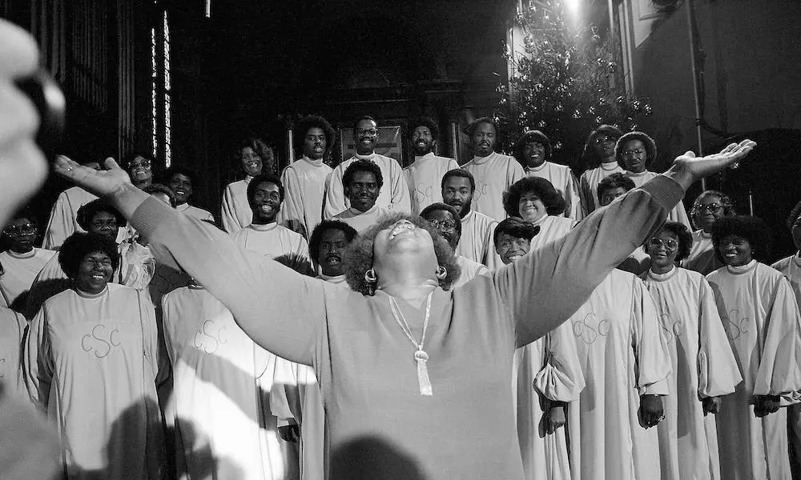
* 可能最初是为了表达对音乐中的宗教主题的热情，许多高度风格化的歌唱手法或模式是由福音歌手**即兴创作**的，这些即兴创作成为了福音之后的**灵魂音乐**风格的特征
  * 其中一种手法，有时被称为**装饰音**（更精确的叫法为“**尾字长吟**”（melisma）），是一种装饰，包括在主旋律音符上下滑动音符，从而极大地延迟该音符直至最终解决
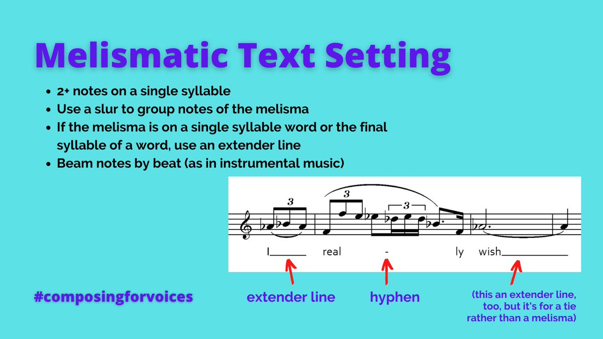
  * 另一种风格化的声乐唱腔是通过气音或呼吸的停顿将一个单词的单个音节**分成几个部分**，这样做的效果是增强单词的强度
  * 会众对宗教的情感参与的另一个结果是，在教堂礼拜的音乐表演中，伴随着走道上的舞蹈、鼓掌和喊叫，出现了**充满活力**的**切分音**的节奏；在一些南方教堂，牧师被这些活动的热情所吸引，在服务期间**晕倒**，这是很常见的，这成为许多**灵魂歌手**舞台表演的一部分
* 来自德克萨斯州的**灵魂煽动者**（Soul Stirrers）早在1936年就为国会图书馆的档案进行了录音；他们用**假声**（falsetto，高于标准男高音音域，通常在音质上有点喘息）的唱腔、复节奏的使用和文本的即兴创作影响了许多其他福音团体
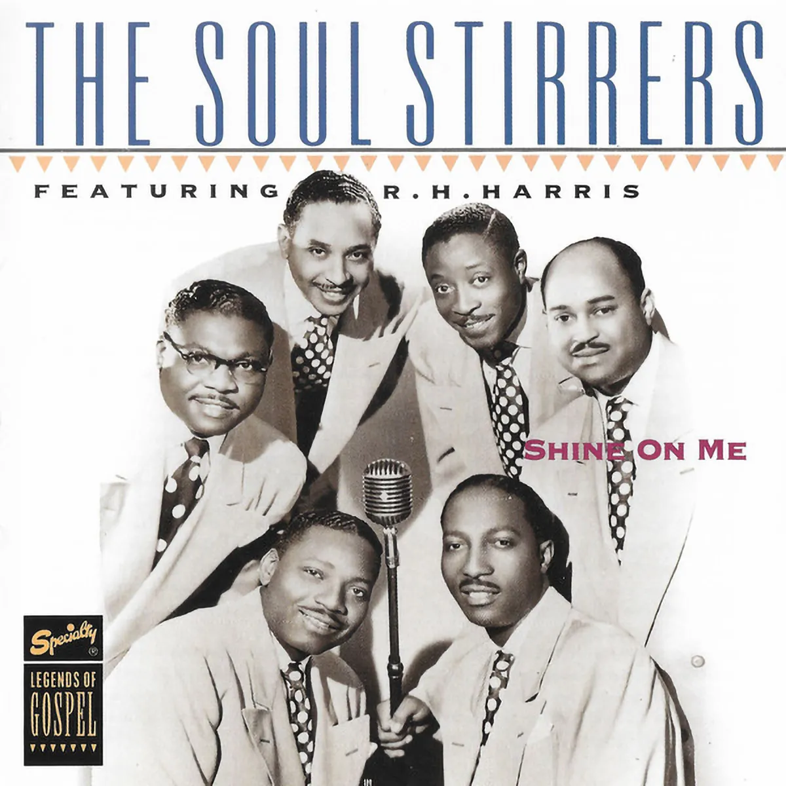
  * 五十年代末六十年代初流行的早期摇滚歌手**山姆·库克**（Sam Cooke），以及孟菲斯灵魂歌手**约翰尼·泰勒**（Johnny Taylor）首次演唱都是与灵魂煽动者合作
  * 下面是山姆·库克与灵魂煽动者合作的《**我离迦南有多远？**》（How far am I from Canaan？）的**聆赏指南**
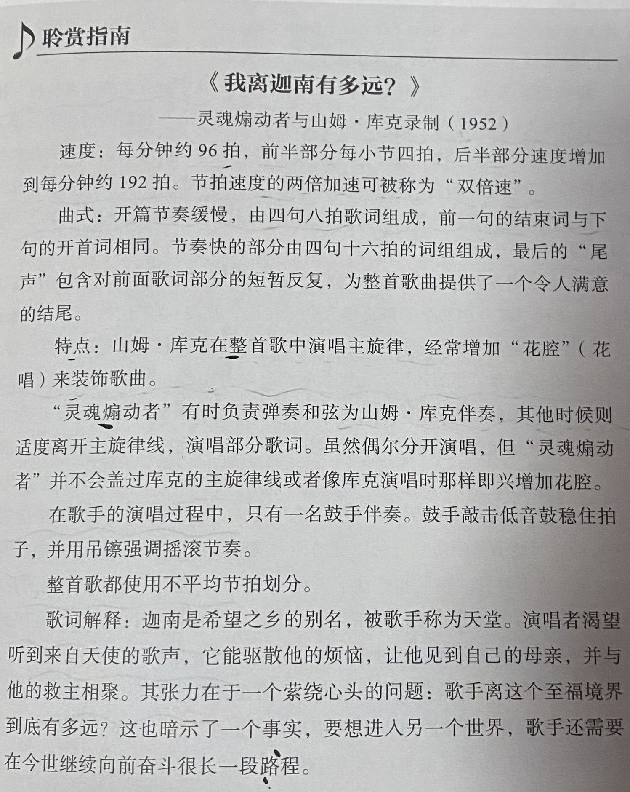
* 女性福音团体在四十年代开始流行。其中最著名的是**克拉拉·沃德合唱团**（Clara Ward Singers），她们在50年代通过唱片和巡演获得了大量的追随者，以至于她们在1961年离开教堂和音乐厅巡回演出，前往拉斯维加斯演出
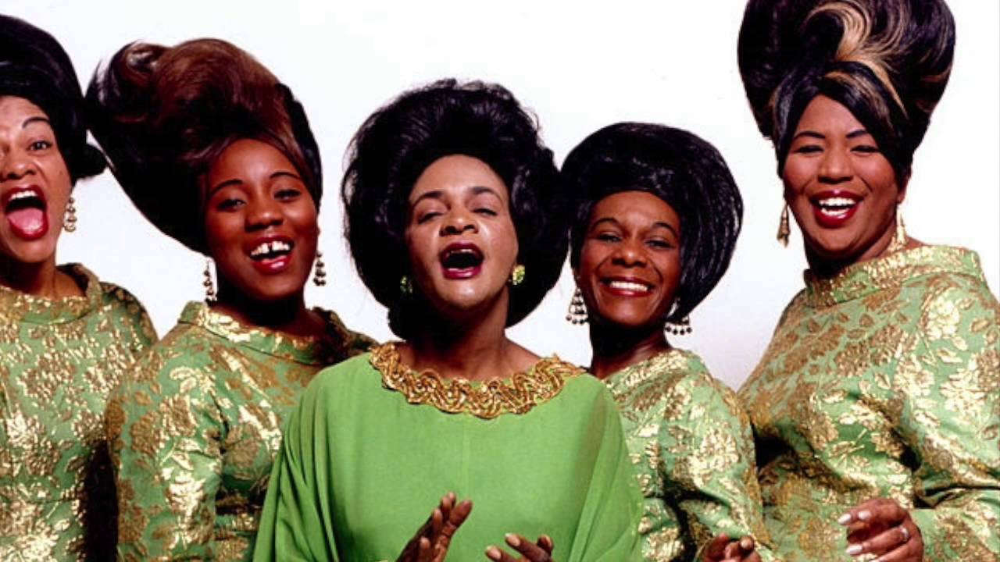
  * 尽管有许多福音团体在**世俗场合**表演，但许多流行的福音表演者以及后来的灵魂歌手对把福音音乐带出教堂并用于**非宗教表演**感到不安
* 虽然四五名歌手组成的小团体仍然很受欢迎，但基于**托马斯·a·多尔西**在30年代早期开始的传统的全唱诗班风格的福音音乐在60年代由加利福尼亚州奥克兰的钢琴家/编曲家**埃德温·霍金斯**（Edwin Hawkins）推广开来
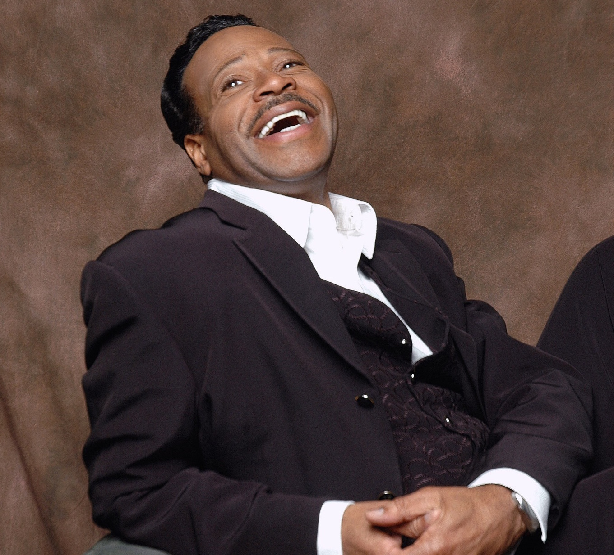
  * 霍金斯用一个**大唱诗班**取代了小的声乐团体，并伴随着键盘、贝斯和鼓演奏的**摇滚节奏**
  * 他的乐队，**埃德温·霍金斯演唱组**，录制的福音歌曲成为流行音乐排行榜上的热门歌曲；在他们录制的《**哦，快乐的一天**》（Oh Happy Day）中，独唱家**多萝西·莫里森**（Dorothy Morrison）使用了福音歌曲中长期以来的**传统风格**，因为大型唱诗班不能使用这些技巧来回应她的演唱，她的即兴表演**单独显现**，凌驾于其他歌者的声音之上
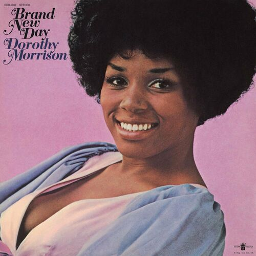
  * 特别是在“oh”和“day”这两个词上，莫里森加入了各种唱诗班没有重复的**装饰音**；这张唱片还包括一个**装饰性的女高音**，这一特点在**迪斯科唱片**中经常被复制
  * 下面是《**噢，快乐的日子**》的**聆赏指南**
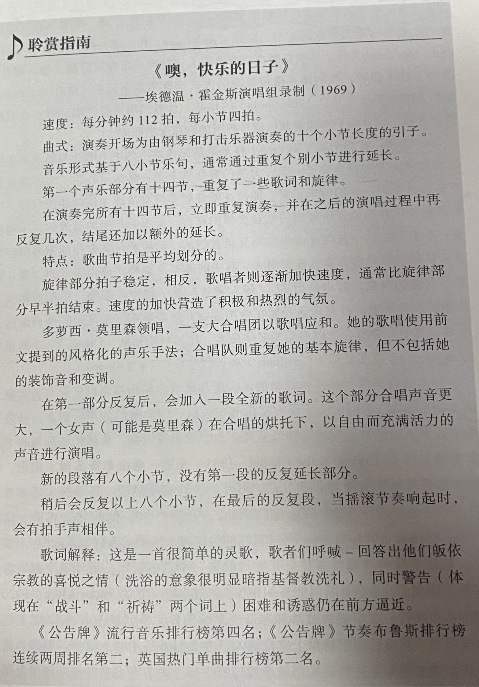
## “嘟-哦普”音乐
* 早在20世纪20年代，由以福音为起源的**非裔美国声乐团体**演唱的**世俗音乐**就很流行
  * “嘟-哦普（**doo-wop**）”这个词后来被用来指**声乐组合的声音**，因为领唱通常由其他歌手通过唱一些无意义的音节，或者重复几句主唱的台词的方式来伴奏（或回应）
  * 通常来说，“嘟-哦普”指的是伴奏歌手使用的**无意义音节**——“啊”（ahs）或“嘟-嘟-嘟嘟”（dum, dum, de-dums）
  * 有两个早期的非裔美国流行声乐团体，其影响可以在后来的dooo -wop风格中听到，他们是**米尔斯兄弟**（Mills Brothers）和**墨点乐队**（Ink Spots），前者以流畅、复杂的风格演唱**四声部和声**，后者的**高音主唱**经常在合唱之后退出，让**贝斯歌手**唱歌词，而乐队的其他成员则**哼唱和弦**
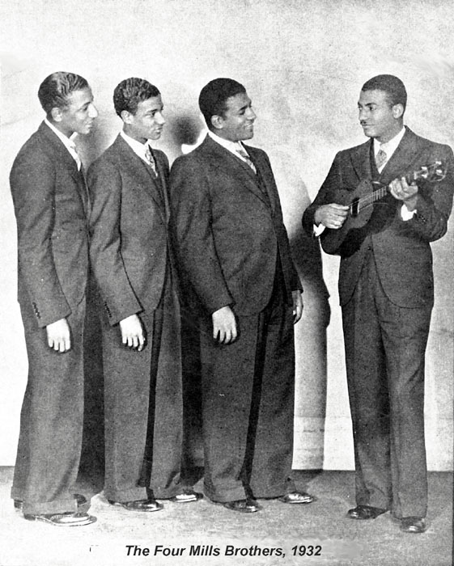
* 1945年，**渡鸦乐队**（Ravens）采用了米尔斯兄弟**柔和的唱腔风格**，并加入了墨点乐队的**主贝斯理念**，为纽约观众带来了流行音乐、福音、节奏和蓝调的结合
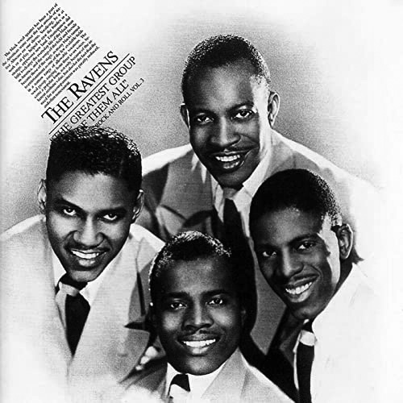
  * 即使贝斯歌手不唱主旋律，他也会使用**婉转的低音声部**模仿**低音提琴**可能演奏的旋律，而不是仅仅重复与乐队其他成员相同的节奏模式，这是米尔斯兄弟首创的技术
  * 乌鸦乐队与一位钢琴家合作，这位钢琴家在乐队的人声后面不断演奏**三连音**，这种基本节奏在很多doowop中被使用；由于doo-wop本质上是一种声乐风格，乐器被**降级**为伴奏的次要角色
* 来自马里兰州巴尔的摩的一个乐队依照他们的州鸟将自己取名为**黄鹂乐队**（Orioles）
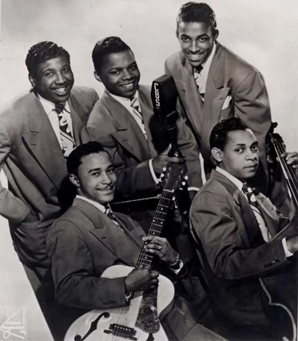
  * 黄鹂乐队并没有模仿渡鸦乐队，因为他们的声音更多地依赖于墨点乐队使用的**轻男高音主唱**的演唱风格
  * 黄鹂乐队录制的《**教堂里的哭泣**》（Crying in the Chapel）是**非裔美国艺术家**首次在流行音乐排行榜上取得成功的唱片之一；这是白人歌手**达雷尔·格伦**（Darrell Glenn）的一首乡村歌曲的翻唱
  * 格伦和黄鹂乐队风格的不同表明了**白人和黑人福音风格**之间的基本对比；白人福音音乐遵循了乡村音乐中常见的**稳定节奏**和**乐器演奏模式**，而黑人福音则使用了**滑步节奏**和**基调强节奏**、**即兴演唱**以及**和声伴唱**
  * 下面是黄鹂乐队的《**教堂里的哭泣**》的**聆赏指南**

* 尽管有格伦/黄鹂的例子，但白人团体**翻唱**非裔美国人的歌曲比相反的情况要普遍得多；与布鲁斯、节奏布鲁斯歌曲一样，许多白人翻唱在歌词、乐器和制作风格上都有了**变化**，这些变化被认为比非裔美国人原版歌曲更能吸引白人观众
  * 其中最著名的例子之一是歌曲《**嘘-隆隆**》（Sh-Boom），这首歌由非裔美国人声乐团体**和声乐队**（Chords）于1954年创作并首次录制，由加拿大白人团体**平头乐队**（Crew-Cuts）翻唱
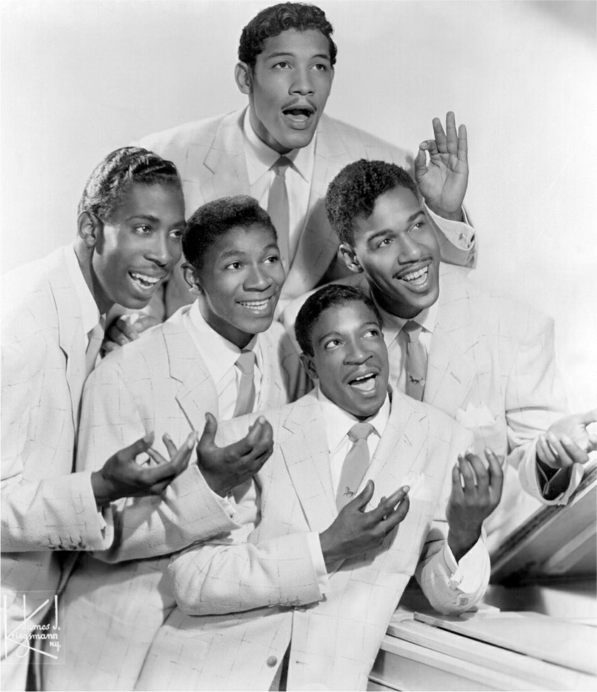
  * 平头乐队在**歌词**上没有做任何实质性的改变，但他们确实去除了一些非裔美国人的音乐特征；其他的改变包括用一个完整的**摇摆风格的舞蹈乐队**作为伴奏，而不是在和弦乐队的录音中演奏的**小节奏组和萨克斯**
* 《**嘘-隆隆**》中使用的I-vi7-ii7-V7 （C - Am7 - Dm7 - g7，C大调）的和弦进行是doo-wop风格许多歌曲的**和弦基础**，它通常被称为**嘟-哦普进行**（doo-wop progression）
  * 在doo-wop中发现的另一个很大比例的音乐特征是在旋律和低音线上通过使用**三连音**的方式，在低音部分和三重奏之后的旋律部分以每拍子**三个和弦**的速度不断**强力弹奏和弦**
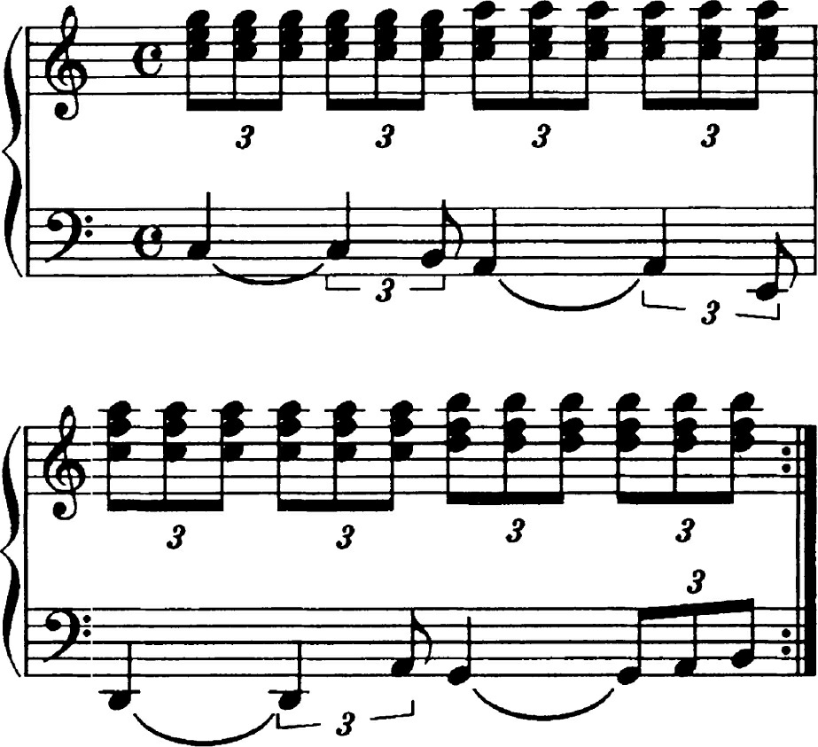
* **流浪者乐队**（Drifters）之所以得名，是因为大家都知道他们的成员会从一个群体**漂流**到另一个群体；事实上，在整个职业生涯中，**没有一个成员**总是留在这个团体
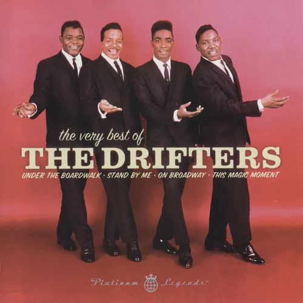
  * 流浪者乐队在他们的一些歌曲中加入了**拉丁节拍**，其中一个例子可以在他们的《甜蜜的爱》“Honey Love”录音中听到
  * 最初的流浪者乐队于1958年解散，但他们的经纪人保留了乐队名称的版权，并将原本自称“**五冠**”（Five Crowns，Ben E. King担任主唱）的乐队重新命名为“流浪者”
  * 这支新组合凭借《**我的宝贝，到这儿来**》（There Goes My Baby）一跃成为流行音乐排行榜的第二名；这张唱片并不是第一张使用**弦乐合奏**的唱片——**巴迪·霍利**在他的最后一张热门单曲《It Doesn 't Matter Any More》中就使用了弦乐合奏——但这是第一张使用如此丰满厚实背景的节奏布鲁斯唱片，这成为了60年代早期的一种趋势
  * 下面是他们的《**我的宝贝，到这儿来**》的**聆赏指南**

* “嘟-哦普”音乐的**总体风格**是相当一致的，流畅浪漫，适度缓慢，可跳舞的声音，主唱经常使用**福音音乐**的演唱技巧，包括在需要强调的词上重复的呼吸停顿和在短语结尾的风格化装饰音
* 从50年代末到70年代初，流畅的、以流行为导向的“嘟-哦普”风格让位于更有力量的非裔美国人的声乐风格，这种音乐后来被称为**灵魂乐**（soul）
* 福音和doo-wop在90年代和2000年代初依旧**发展良好**，有艾米·格兰特（Amy Grant）、Take 6、All-4-One、Boyz II Men等歌手和团体
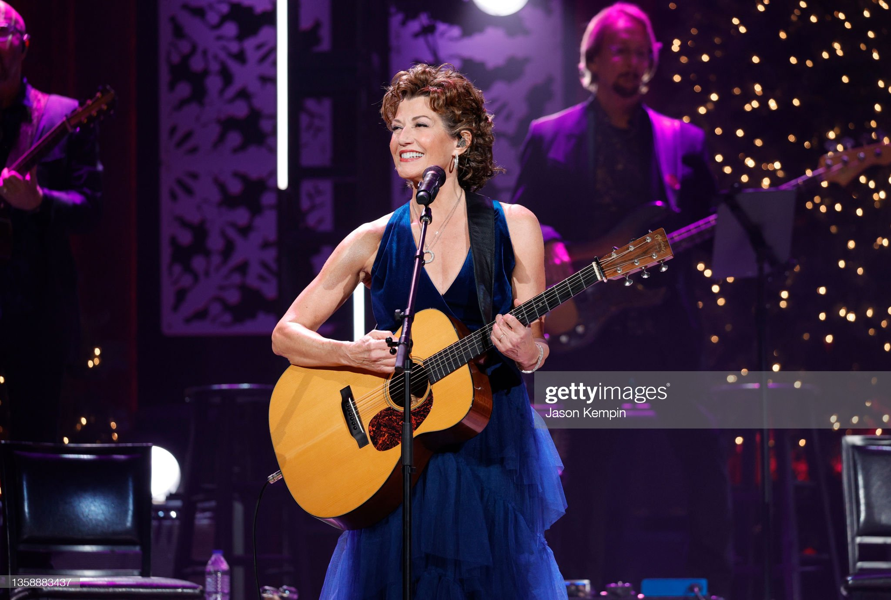
## 乡村音乐
* **乡村音乐**（Country Music）是**民间音乐**的一种**商业形式**，在19世纪的某个时候发展出了自己的各种风格
  * 乡村音乐最早的形式被称为“hillbilly”，这是一个用于演奏乡村音乐的英国后裔的**偏远南方人**的名字；从17世纪到19世纪，大量的移民从**不列颠群岛**来到现在的**美国南部和西南部的山区**，带来了许多世纪以来丰富的音乐传统，他们把这些传统作为**与旧世界的文化联系**
  * 他们的舞蹈音乐包括**简单的有节奏的舞蹈**，如吉格舞、卷轴舞、波尔卡舞、华尔兹舞和各种类型的圆舞，他们的**声乐**包括赞美诗和民谣以及其他类型的歌曲；他们的大部分舞蹈音乐都是由**fiddle**演奏的，这是小提琴的民间术语，可以追溯到中世纪欧洲的一种弓弦乐器fidula或fidel
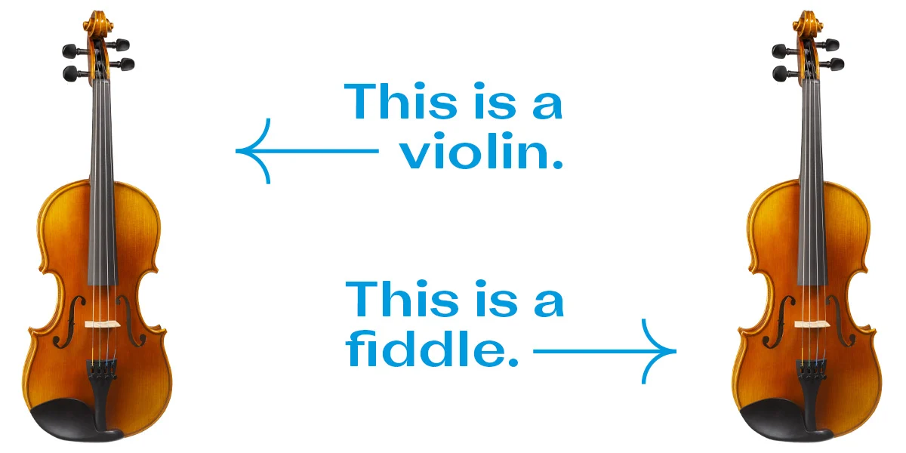
  * 英国移民唱歌时要么**没有伴奏**，要么用吉他、拨弦扬琴、钢琴和后来的口琴等**乐器伴奏**
  * 在南方的美国人从一种非洲乐器**班扎**发展出了**班卓琴**，并在**南北战争**期间被来自英国的民间音乐的白人乐手所采用；到30年代末，诸如低音提琴、钢弦吉他和自动竖琴等乐器也在南方民间音乐中得到普遍使用
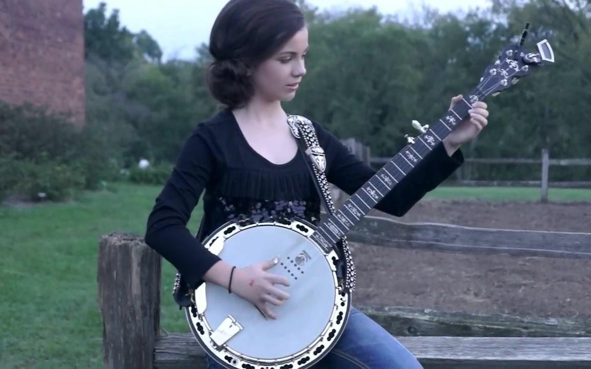
* 20世纪20年代，随着**收音机**的日益重要和**录音技术**的发展，南方的民间音乐引起了全国其他地区的注意
  * **谷仓舞蹈秀**是最受欢迎的广播节目之一，人们伴随着**乡村舞曲**聚集在谷仓或其他大型建筑物中跳舞；《**WSM谷仓舞**》于1925年首次播出，它的名字被改为《**乡村大剧院**》（Grand Ole Opry），作为对之前古典歌剧节目的有趣评论
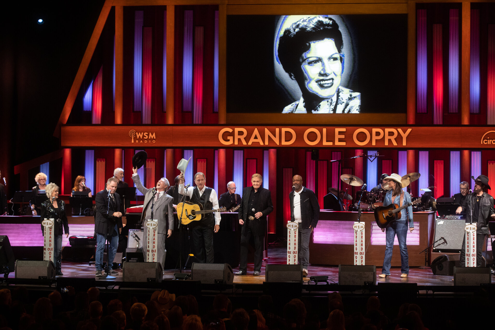
* 在三四十年代，一种叫做**西部摇摆**的风格在德克萨斯州流行起来；它起源于小提琴和吉他的谷仓舞蹈乐队演奏的音乐，逐渐采用了非裔美国蓝调和爵士乐的特点
  * 西部摇摆乐是少数使用**鼓**的乡村风格之一，在大多数乡村风格中通常避免使用鼓，部分原因是它们与**非裔美国音乐**有关
  * 在德克萨斯州，西部摇摆舞之王是小提琴手**鲍勃·威尔斯**（Bob Wills），他是**德克萨斯花花公子乐队**（Texas Playboys）的主唱；另一位小提琴手**斯佩德·库利**（Donnell Clyde Cooley）在加州推广了这种风格
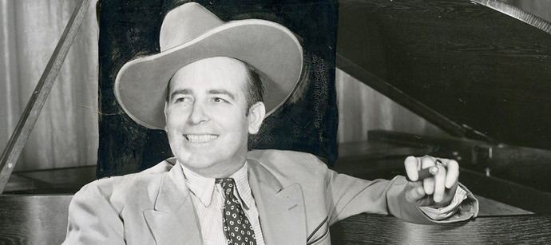
  * 西部摇摆乐和另一种受布鲁斯影响的乡村音乐风格，即“**山地布基**”（hillbilly boogie），在**比尔·哈利**的音乐中对摇滚乐的发展起了重要作用
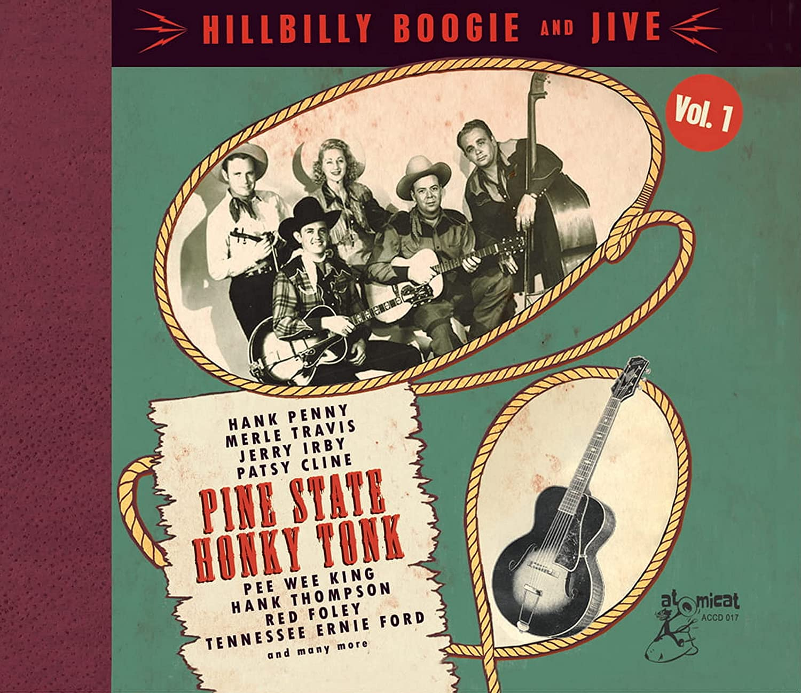
* **下等酒馆**（honky-tonk）是酒吧或沙龙，通常出现在“禁酒”镇（禁止酒精饮料的城镇）的外围
  * 小酒馆的气氛充满了**喧闹的氛围**，正因如此，这里不适合蓝草乐队演奏的那种未经放大的音乐，也不适合任何风格上稍有微妙之处的乐队
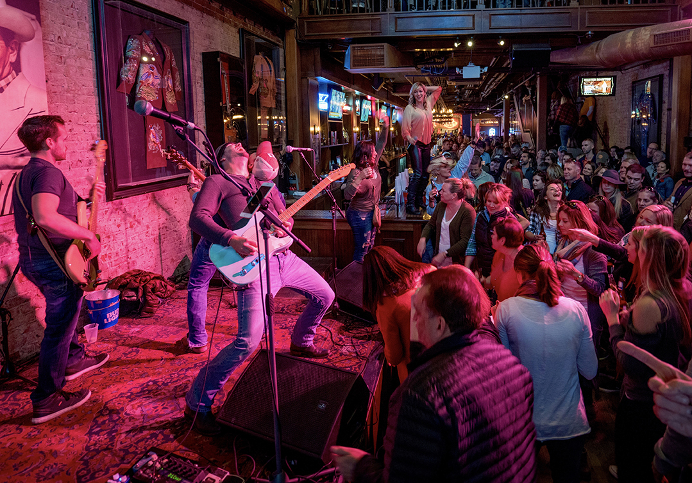
  * 小酒馆里的音乐必须**大声**（因此要放大），而且必须有稳定的、适合跳舞的**节拍**；小酒馆的钢琴家们演奏出强烈的节拍和欢快的布吉-伍吉低音
  * 小酒馆的歌曲主题常常强调**失业**或情人不忠带来的**抑郁**；**欧内斯特·塔布**（1914-1984，也被称为德克萨斯吟游诗人），**乔治·琼斯**（1931-2013）和**汉克·威廉姆斯**（1923-1953）都是受欢迎的下等酒馆歌手和作家
  * 在50年代中期，小酒馆使用放大吉他、贝斯和鼓影响了猫王、埃迪·科克伦和吉恩·文森特的**摇滚风格**的发展，而**杰里·李·刘易斯**则从小酒馆钢琴家的音乐中获得了他的**摇滚钢琴风格**
* 五十年代的乡村音乐有很多种风格，以下是那些影响了摇滚乐的乡村音乐的一般元素
  * 节拍是**稳定**的，**所有的音乐家**都在这个节拍上演奏，其他风格的音乐可能有一个稳定的节拍，但音乐家们经常演奏得比拍子**慢一点儿**，从而营造出**放松**的感觉；纯粹的乡村风格是基于清晰准确的节拍
  * 每小节有**四拍、二拍或三拍**（在摇滚中四拍是标准的）
  * 四拍模式有**均匀的划分**；平均节拍划分有一种隆隆作响的扫弦感觉，或者是指音乐记谱法，一种均匀的**八分音符流**
  * 和弦通常是**三和弦**（triadic，简单的**三音符和弦**，没有添加七度音程）
  * 大多数音乐遵循**八小节**的重复模式，每个模式由两个四小节乐句组成；布鲁斯的十二小节形式也经常被使用
  * **贝斯**经常在四拍模式中演奏**第一拍和弦的根音**和**第三拍和弦的五音**，在这些音符之间形成一种**有规律的交替**，称为**双拍贝斯**
  * 歌词通常讲述**故事**，或意在表达歌手对某些人、事件或政治问题的**感受**，它应当**高于**伴奏的声音
  * 人声通常带有**鼻音效果**，演唱时要么**面无表情**，要么强烈地给人一种**快要哭出来的感觉**
  * 山地声乐**二重唱**通常在一个高的，缓慢移动的旋律下进行；人声**三重奏**增加了一个低音部分，而**四重奏**又增加了一个低音部分
  * 除了**贝斯**通常准确地在拍子上演奏，人声和乐器经常从一个音符**滑到**另一个音符；钢弦吉他的滑动变调夹和踏板可以使整个和弦**变音**，而不仅仅是单个音符
* **吉米·罗杰斯**（Jimmie Rodgers）常被称为**乡村音乐之父**
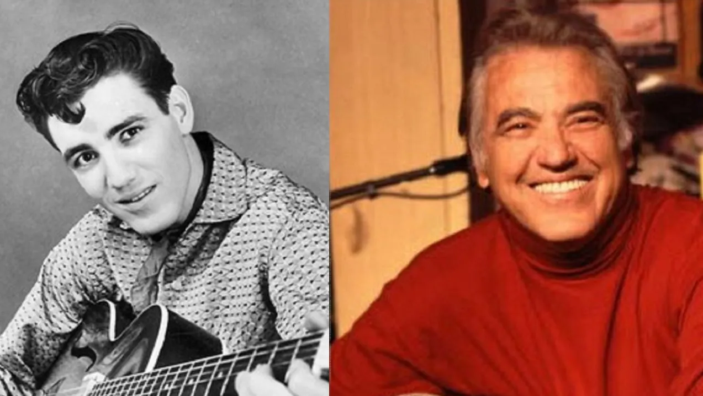
  * 罗杰斯有一种非常独特的声乐风格，被称为“**蓝色约德尔**”（一种在高音和低音之间**快速来回变化**的演唱）；“蓝色”一词指的是罗杰斯演唱的许多歌曲都遵循了**12小节的蓝调形式**，早在20世纪20年代就创造了一种黑人和白人音乐风格的**结合**
  * 他还打破了以前乡村和民间唱**老传统歌曲**的传统，表演并录制了**新创作的歌曲**
* 伟大的**老汉克·威廉姆斯**（Hank Williams Sr.）当然值得一提
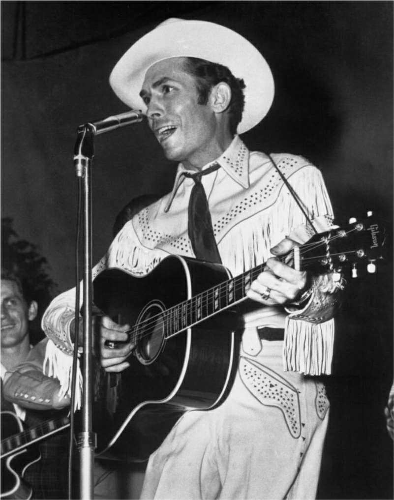
  * 《**我永远不会活着离开这个世界**》（I’ll Never Get Out of This World Alive）是他发行的最后一首单曲；威廉姆斯录制这首歌时只有28岁，但他个人生活的问题以及对止痛药和酒精的依赖导致他在一年后因心脏病发作过早去世
  * 下面是他的《**我永远不会活着离开这个世界**》的**聆赏指南**

* **约翰尼·卡什**（Johnny Cash）是一位重要的乡村歌手，他的事业发展几乎与摇滚乐流行的时间一致

  * 卡什的职业生涯继续非常成功，他在流行音乐排行榜上最成功的歌曲是《**名叫苏的男孩**》（Boy Named Sue），连续三周排名第二；在这首歌中，歌手很生气他的父亲给他取名Sue，但最后发现他的父亲给了他一个女孩的名字，以帮助他足够坚强来应对这个世界
  * 这首歌非常受欢迎，**摇滚电台**都在播放；考虑到迷幻60年代许多其他重要的音乐活动，包括伍德斯托克音乐节，只有伟大的乡村歌曲和表演才能在那个时代的摇滚观众中受到欢迎
  * 约翰尼·卡什一直是个与众不同的人，在那个乡村歌手喜欢穿色彩鲜艳、闪闪发光的服装的时代，卡什更喜欢穿**黑色**，他被称为“黑衣人”
  * 卡什克服了严重的**毒品问题**，有一个非常漫长而成功的职业生涯，但他的健康状况一直不佳，从20世纪90年代的大部分时间一直到他生命的尽头；他死于**糖尿病并发症**
  * 下面是他的《**勇往直前**》（I Walk the Line）的**聆赏指南**
