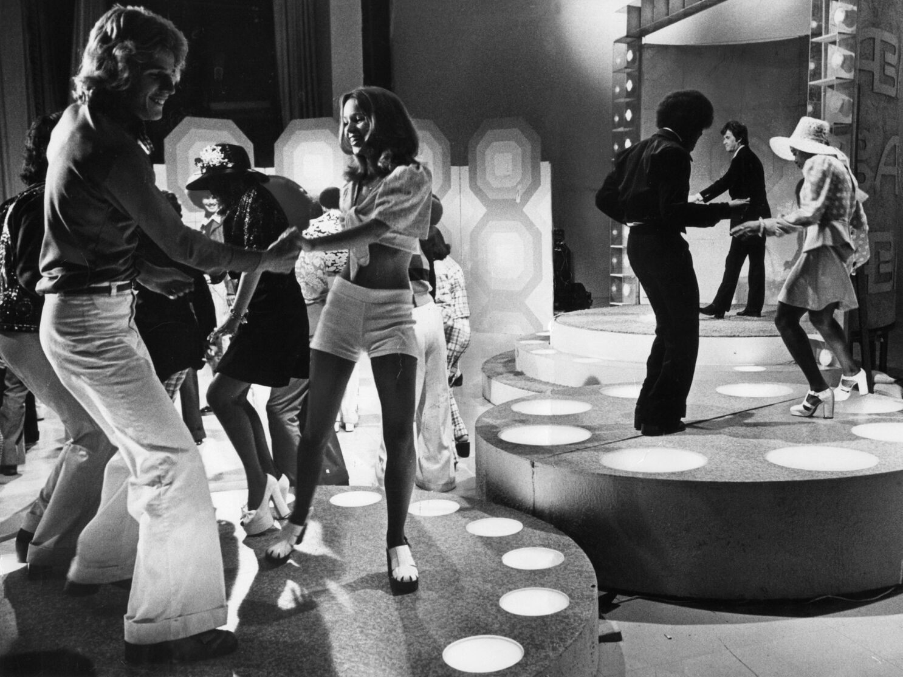
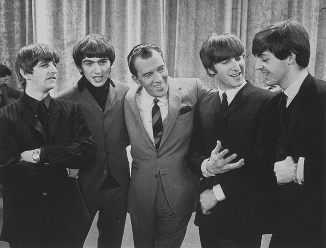
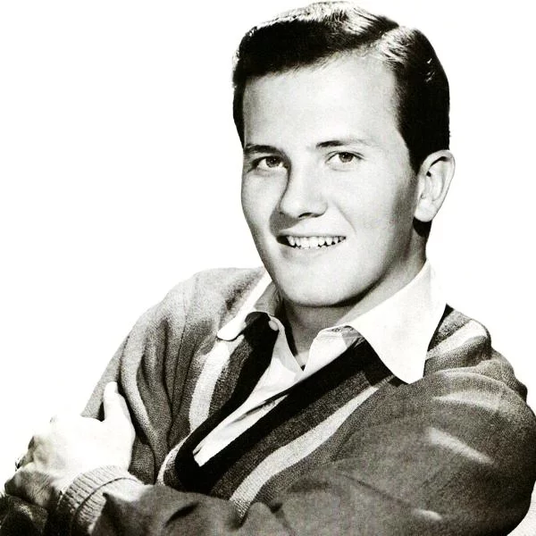
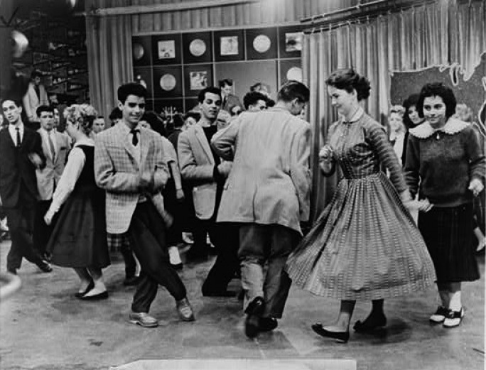

# 青少年风格摇滚
* 1957年至1960年间，**流行摇滚风格**在美国的音乐界占据了主导地位，而**五十年代中期**的摇滚乐表演者则遭遇了各种不幸的命运，导致他们无法继续发展自己的音乐风格
  * 一些摇滚乐表演者在他们的事业中断之前就已经开始**改变自己的风格**来适应流行潮流，如普雷斯利、霍利和科克伦
## 贿赂丑闻
* **贿赂丑闻**，即为了获得播放或其他宣传而付钱的行为，从**南北战争**时期就存在
  * 当时一些受欢迎的**杂耍表演者**会为了在乐谱上**印上自己的照片**而同意在所有的演出中唱一首**特定的歌曲**，这样作曲家、出版商和表演者都能从歌曲的音乐销售中获益
  * 到了五十年代末，贿赂主要指为了鼓励节目制作人给特定的歌曲提供**更多的广播或电视播放时间**而付钱的行为；决定播放什么音乐的因素是**金钱**而不是对质量或潜在受欢迎程度的诚实评价，在某些情况下，没有贿赂就没有机会让一首歌曲被播放
  * 贿赂在**五十年代末的贿赂丑闻**之后才被定为非法，但在此之前就被认为是**道德的腐败**
* 一些小型、独立的**唱片公司**从贿赂中受益
  * 他们可以用钱来支付一张唱片在一个城镇的播放费用，然后从唱片的销售中获利，这样他们就可以继续到其他城镇做同样的事情
* 1909年的版权法规定了**作曲家**获得报酬的**三种方式**
  * **乐谱销售**——作曲家通常会得到出版商销售乐谱所得的一定百分比
  * **机械费**，即每卖出一份钢琴谱或录音带的歌曲，作曲家就会得到一小笔钱
  * **公开演出费**，即每次演出歌曲，作曲家就会得到一些钱
  * 乐谱的出版商、制作钢琴卷或录音带的公司以及为作曲家收取演出费用的组织都会向作曲家支付相应的费用，这些不同的收入方式使得作曲家在他们创作的歌曲**受欢迎**并经常被演出时能够获得**可观的收入**
* **作曲家**是导致五十年代末贿赂丑闻调查的**主要原因**，因为他们认为贿赂影响了他们的**收入来源**
  * **ASCAP**成立于1914年，它的主要职能是从演出场所收取**演出费用**，并将其**分配**给它的作曲家和出版商成员，它采用了复杂的程序来估计它的成员的歌曲**被播放的频率**，并按照相应的比例支付给他们

  * ASCAP对加入它的作曲家有着**严格的标准**，通常排除了蓝调、节奏布鲁斯、乡村和摇滚音乐家，因为这些风格的音乐家倾向于**自己创作**或**演奏彼此的音乐**，他们不需要ASCAP的作曲家，而他们的歌曲的巨大受欢迎程度也削弱了ASCAP成员的**总体利润**
  * **BMI**成立于1940年，它是由**全国广播协会**的一些成员组成的，他们反对ASCAP对播放权利和费用的**控制和垄断**，大多数五十年代和六十年代初期的**摇滚作曲家**都加入了BMI

  * 随着摇滚音乐的**日益流行**，ASCAP开始对BMI感到不满，并寻找方法来诋毁它所处理的音乐；一个**特别委员会**成立于1958年，负责调查一些电视节目中存在作弊的指控，ASCAP要求该委员会也调查为了获得播放而贿赂在广播电台、电视台或舞厅等地方播放录音音乐的人的行为
* 这些调查被称为**贿赂丑闻**，结果是许多依靠贿赂来让自己的唱片被播放的小型唱片公司**倒闭**了
  * **艾伦·弗里德**曾通过在电台和欧洲播放和推广非裔美国人的节奏布鲁斯音乐，为摇滚乐的发展做出了重要贡献；弗里德在1950年代初期因为接受了大量的贿赂和涉嫌抄袭他人的歌曲而受到调查，他的事业因此受到重创，在1965年因为酗酒而去世
  * 另一位重要的主持人**迪克·克拉克**则成功地避开了丑闻的影响，他是青少年舞蹈节目《**美国乐队站**》的主持人，这个节目向全国的青少年展示了费城的流行音乐和舞蹈风格
    * 《美国乐队站》偶尔会播放一些摇滚乐和节奏布鲁斯的表演，但更多的是推荐一些穿着整洁、风格流行的**白人偶像歌手**；在1950年代，许多娱乐业的领导者认为摇滚音乐是对**美国社会道德基础的威胁**，只有像《美国乐队站》这样展示清洁健康的青少年娱乐形象的节目，才能得以继续

    * 迪克·克拉克在他的节目中推广了一些从中获得经济利益的唱片，因此也被调查是否存在收受贿赂的行为，但他的律师证明了他也推广了一些没有经济利益的唱片，因此他被证明**无罪**
    * 他不得不出售他在音乐业的股份，但他能够**继续主持节目**；他能够继续的一个主要原因是，他的节目被许多音乐业的人士认为是对青少年**有积极影响**的，而艾伦·弗里德播放的音乐则被认为是有腐化影响的
# 青少年偶像流行乐
* **美国电视节目**在五十年代和六十年代向家庭观众展示了**摇滚乐的表演和风格**
  * **American Bandstand**向青少年粉丝展示了摇滚乐、舞者和表演者，但它是一个**下午的节目**
  * **Ed Sullivan秀**是一个非常受欢迎的周日晚上的综艺节目，为了吸引家庭观众中的青少年部分，他在他的节目中添加了**摇滚乐表演**

  * 到了1965年，除了偶尔在 The Ed Sullivan Show 上看到摇滚乐表演，ABC TV 还增加了一个新的黄金时段的摇滚乐节目叫 **Shindig**，NBC TV 也增加了 **Hullabaloo**；在没有视频和 MTV 的时代，这些节目把现场的摇滚乐表演带到了美国家庭中，让青少年粉丝欣喜不已
* 大多数被称为“**青少年偶像**”的歌手，特别是男性，演唱的风格类似于二十世纪二十年代到四十年代的**民谣歌手**
* **帕特•布恩**（Pat Boone）就是一个用流行民谣和蓝调或节奏布鲁斯歌曲的翻唱而受欢迎的歌手；他在翻唱蓝调时做了不同于摇滚乐歌手的改变，因为他不追求摇滚乐的能量，他的录音符合他自己**清爽、邻家男孩的形象**

  * 当 Carl Perkins 和 Elvis Presley 穿着酷酷的“蓝色麂皮鞋”时，Pat Boone 穿着干净、白色的**鹿皮鞋**，这成了他的标志
  * 下面是Pat Boone 的 “**Tutti-Frutti**” 录音和 Little Richard 的原版录音的**聆赏指南**

    * Pat Boone 在录制 “Tutti-Frutti” 时试图模仿 Little Richard 的**节奏感和声音变化**，但没有捕捉到 Richard 的**嘶哑的音色和表现力**
    * Little Richard 的版本中的乐器演奏方式受到了**爵士乐**的影响，而 Pat Boone 的录音中除了一段**次中音萨克斯的独奏**外，没有使用这种影响，这段独奏给本来是**流行蓝调**形式的歌曲增加了一点爵士乐的风格
    * 许多摇滚乐迷会认为 Pat Boone 根本不是一个摇滚乐歌手，但是Pat Boone 的 “Tutti-Frutti” 版本完全符合**白人商业观众**喜欢的**流行风格**，而且它代表了摇滚乐在这个十年和六十年代**继续发展的一个方向**
    * 因此，Pat Boone 的 “Tutti-Frutti” 版本可以被认为是摇滚乐，但这只是因为它的**历史背景**，同样的道理也适用于同一时期的许多**流行摇滚乐**
* **电影和电视产业**支持了清爽青少年偶像形象的流行
  * **Pat Boone** 在电影 April Love 和 Journey to the Center of the Earth中扮演了青少年角色
  * 在 American Bandstand 全国播出后，介绍了来自费城的青少年偶像 **Frankie Avalon** ，**Fabian** 和 **Bobby Rydell** ；他们通过电影 Beach Blanket Bingo 等进一步受到了欢迎，该电影由 Frankie Avalon 和 Annette Funicello 主演
  * **Ricky Nelson** 因为他的摇滚乐录音而对摇滚乐更重要，但他也有一个青少年偶像形象，他在父母的电视节目 The Adventures of Ozzie and Harriet 中的出现向粉丝们展示了这一形象
  * 青少年偶像时代最成功的两位**女歌手**是 **Connie Francis** 和 **Brenda Lee**

* 大多数青少年偶像歌手的成功更多地是因为他们的**视觉吸引力和群体认同**，而不是因为他们的音乐才华；他们**天然而未经训练的声音**捕捉了这种风格所需要的**青春活力**
  * 在电视、电影甚至“现场”表演中，他们通常用**唇形同步**（lip-syncing）来配合他们的录音，而不是真正地现场演唱；很少有歌手会演奏乐器，除了一些偶尔的**简单吉他和弦**，他们通常也不是作曲家
  * **Paul Anka** 是个例外，他写了许多自己的**热门歌曲**，他的歌曲也成为了其他艺人的热门歌曲

* 青少年偶像歌曲的**主题**和表演者的形象一样**年轻和健康**
  * 在青涩的恋爱和寻找完美伴侣的梦想中，**幸福和失望之间的微妙平衡**占据了主导地位；一些例子是 Frankie Avalon 的 “**Venus**”，Connie Francis 的 “**Where the Boys Are**”，和 Paul Anka 的 “**Puppy Love**”
  * 下面是Frankie Avalon 的 “**Venus**”的**聆赏指南**

  * 年轻青少年的其他关注点也通过一些歌曲表达KV出来，比如 Bobby Rydell 的 “**Swingin’ School**”，但关于**爱情和暂时心碎**的歌曲占了上风
* 因为**青少年舞者**的存在，**American Bandstand** 开始或传播了五十年代末和六十年代初的许多**舞蹈热潮**
  * 在五十年代，**bop** 被用来跳 **Gene Vincent** 的 “Be-Bop-a-Lula” 和 “Dance to the Bop” ，以及 **Danny and the Juniors** 的 “At the Hop”

  * 一些基本上是 **bop 的变体**的舞蹈有**动物的名字**，比如 Pony Chicken 和 Monkey；Dog 和 Alligator 也是 bop 的流行变体，但它们有点**性暗示**，因此不被允许在 American Bandstand 上出现