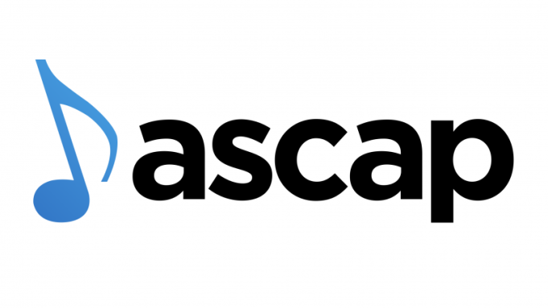

# 青少年风格摇滚
* 1957年至1960年间，**流行摇滚风格**在美国的音乐界占据了主导地位，而**五十年代中期**的摇滚乐表演者则遭遇了各种不幸的命运，导致他们无法继续发展自己的音乐风格
  * 一些摇滚乐表演者在他们的事业中断之前就已经开始**改变自己的风格**来适应流行潮流，如普雷斯利、霍利和科克伦
## 贿赂丑闻
* **贿赂丑闻**，即为了获得播放或其他宣传而付钱的行为，从**南北战争**时期就存在
  * 当时一些受欢迎的**杂耍表演者**会为了在乐谱上**印上自己的照片**而同意在所有的演出中唱一首**特定的歌曲**，这样作曲家、出版商和表演者都能从歌曲的音乐销售中获益
  * 到了五十年代末，贿赂主要指为了鼓励节目制作人给特定的歌曲提供**更多的广播或电视播放时间**而付钱的行为；决定播放什么音乐的因素是**金钱**而不是对质量或潜在受欢迎程度的诚实评价，在某些情况下，没有贿赂就没有机会让一首歌曲被播放
  * 贿赂在**五十年代末的贿赂丑闻**之后才被定为非法，但在此之前就被认为是**道德的腐败**
* 一些小型、独立的**唱片公司**从贿赂中受益
  * 他们可以用钱来支付一张唱片在一个城镇的播放费用，然后从唱片的销售中获利，这样他们就可以继续到其他城镇做同样的事情
* 1909年的版权法规定了**作曲家**获得报酬的**三种方式**
  * **乐谱销售**——作曲家通常会得到出版商销售乐谱所得的一定百分比
  * **机械费**，即每卖出一份钢琴谱或录音带的歌曲，作曲家就会得到一小笔钱
  * **公开演出费**，即每次演出歌曲，作曲家就会得到一些钱
  * 乐谱的出版商、制作钢琴卷或录音带的公司以及为作曲家收取演出费用的组织都会向作曲家支付相应的费用，这些不同的收入方式使得作曲家在他们创作的歌曲**受欢迎**并经常被演出时能够获得**可观的收入**
* **作曲家**是导致五十年代末贿赂丑闻调查的**主要原因**，因为他们认为贿赂影响了他们的**收入来源**
  * **ASCAP**成立于1914年，它的主要职能是从演出场所收取**演出费用**，并将其**分配**给它的作曲家和出版商成员，它采用了复杂的程序来估计它的成员的歌曲**被播放的频率**，并按照相应的比例支付给他们

  * ASCAP对加入它的作曲家有着**严格的标准**，通常排除了蓝调、节奏布鲁斯、乡村和摇滚音乐家，因为这些风格的音乐家倾向于**自己创作**或**演奏彼此的音乐**，他们不需要ASCAP的作曲家，而他们的歌曲的巨大受欢迎程度也削弱了ASCAP成员的**总体利润**
  * **BMI**成立于1940年，它是由**全国广播协会**的一些成员组成的，他们反对ASCAP对播放权利和费用的**控制和垄断**，大多数五十年代和六十年代初期的**摇滚作曲家**都加入了BMI

  * 随着摇滚音乐的**日益流行**，ASCAP开始对BMI感到不满，并寻找方法来诋毁它所处理的音乐；一个**特别委员会**成立于1958年，负责调查一些电视节目中存在作弊的指控，ASCAP要求该委员会也调查为了获得播放而贿赂在广播电台、电视台或舞厅等地方播放录音音乐的人的行为
* 这些调查被称为**贿赂丑闻**，结果是许多依靠贿赂来让自己的唱片被播放的小型唱片公司**倒闭**了
  * **艾伦·弗里德**曾通过在电台和欧洲播放和推广非裔美国人的节奏布鲁斯音乐，为摇滚乐的发展做出了重要贡献；弗里德在1950年代初期因为接受了大量的贿赂和涉嫌抄袭他人的歌曲而受到调查，他的事业因此受到重创，在1965年因为酗酒而去世
  * 另一位重要的主持人**迪克·克拉克**则成功地避开了丑闻的影响，他是青少年舞蹈节目《**美国乐队站**》的主持人，这个节目向全国的青少年展示了费城的流行音乐和舞蹈风格
    * 《美国乐队站》偶尔会播放一些摇滚乐和节奏布鲁斯的表演，但更多的是推荐一些穿着整洁、风格流行的**白人偶像歌手**；在1950年代，许多娱乐业的领导者认为摇滚音乐是对**美国社会道德基础的威胁**，只有像《美国乐队站》这样展示清洁健康的青少年娱乐形象的节目，才能得以继续

    * 迪克·克拉克在他的节目中推广了一些从中获得经济利益的唱片，因此也被调查是否存在收受贿赂的行为，但他的律师证明了他也推广了一些没有经济利益的唱片，因此他被证明**无罪**
    * 他不得不出售他在音乐业的股份，但他能够**继续主持节目**；他能够继续的一个主要原因是，他的节目被许多音乐业的人士认为是对青少年**有积极影响**的，而艾伦·弗里德播放的音乐则被认为是有腐化影响的
## 青少年偶像流行乐
* **美国电视节目**在五十年代和六十年代向家庭观众展示了**摇滚乐的表演和风格**
  * **American Bandstand**向青少年粉丝展示了摇滚乐、舞者和表演者，但它是一个**下午的节目**
  * **Ed Sullivan秀**是一个非常受欢迎的周日晚上的综艺节目，为了吸引家庭观众中的青少年部分，他在他的节目中添加了**摇滚乐表演**

  * 到了1965年，除了偶尔在 The Ed Sullivan Show 上看到摇滚乐表演，ABC TV 还增加了一个新的黄金时段的摇滚乐节目叫 **Shindig**，NBC TV 也增加了 **Hullabaloo**；在没有视频和 MTV 的时代，这些节目把现场的摇滚乐表演带到了美国家庭中，让青少年粉丝欣喜不已
* 大多数被称为“**青少年偶像**”的歌手，特别是男性，演唱的风格类似于二十世纪二十年代到四十年代的**民谣歌手**
* **帕特•布恩**（Pat Boone）就是一个用流行民谣和蓝调或节奏布鲁斯歌曲的翻唱而受欢迎的歌手；他在翻唱蓝调时做了不同于摇滚乐歌手的改变，因为他不追求摇滚乐的能量，他的录音符合他自己**清爽、邻家男孩的形象**

  * 当 Carl Perkins 和 Elvis Presley 穿着酷酷的“蓝色麂皮鞋”时，Pat Boone 穿着干净、白色的**鹿皮鞋**，这成了他的标志
  * 下面是Pat Boone 的 “**Tutti-Frutti**” 录音和 Little Richard 的原版录音的**聆赏指南**

    * Pat Boone 在录制 “Tutti-Frutti” 时试图模仿 Little Richard 的**节奏感和声音变化**，但没有捕捉到 Richard 的**嘶哑的音色和表现力**
    * Little Richard 的版本中的乐器演奏方式受到了**爵士乐**的影响，而 Pat Boone 的录音中除了一段**次中音萨克斯的独奏**外，没有使用这种影响，这段独奏给本来是**流行蓝调**形式的歌曲增加了一点爵士乐的风格
    * 许多摇滚乐迷会认为 Pat Boone 根本不是一个摇滚乐歌手，但是Pat Boone 的 “Tutti-Frutti” 版本完全符合**白人商业观众**喜欢的**流行风格**，而且它代表了摇滚乐在这个十年和六十年代**继续发展的一个方向**
    * 因此，Pat Boone 的 “Tutti-Frutti” 版本可以被认为是摇滚乐，但这只是因为它的**历史背景**，同样的道理也适用于同一时期的许多**流行摇滚乐**
* **电影和电视产业**支持了清爽青少年偶像形象的流行
  * **Pat Boone** 在电影 April Love 和 Journey to the Center of the Earth中扮演了青少年角色
  * 在 American Bandstand 全国播出后，介绍了来自费城的青少年偶像 **Frankie Avalon** ，**Fabian** 和 **Bobby Rydell** ；他们通过电影 Beach Blanket Bingo 等进一步受到了欢迎，该电影由 Frankie Avalon 和 Annette Funicello 主演
  * **Ricky Nelson** 因为他的摇滚乐录音而对摇滚乐更重要，但他也有一个青少年偶像形象，他在父母的电视节目 The Adventures of Ozzie and Harriet 中的出现向粉丝们展示了这一形象
  * 青少年偶像时代最成功的两位**女歌手**是 **Connie Francis** 和 **Brenda Lee**

* 大多数青少年偶像歌手的成功更多地是因为他们的**视觉吸引力和群体认同**，而不是因为他们的音乐才华；他们**天然而未经训练的声音**捕捉了这种风格所需要的**青春活力**
  * 在电视、电影甚至“现场”表演中，他们通常用**唇形同步**（lip-syncing）来配合他们的录音，而不是真正地现场演唱；很少有歌手会演奏乐器，除了一些偶尔的**简单吉他和弦**，他们通常也不是作曲家
  * **Paul Anka** 是个例外，他写了许多自己的**热门歌曲**，他的歌曲也成为了其他艺人的热门歌曲

* 青少年偶像歌曲的**主题**和表演者的形象一样**年轻和健康**
  * 在青涩的恋爱和寻找完美伴侣的梦想中，**幸福和失望之间的微妙平衡**占据了主导地位；一些例子是 Frankie Avalon 的 “**Venus**”，Connie Francis 的 “**Where the Boys Are**”，和 Paul Anka 的 “**Puppy Love**”
  * 下面是Frankie Avalon 的 “**Venus**”的**聆赏指南**

  * 年轻青少年的其他关注点也通过一些歌曲表达KV出来，比如 Bobby Rydell 的 “**Swingin’ School**”，但关于**爱情和暂时心碎**的歌曲占了上风
* 因为**青少年舞者**的存在，**American Bandstand** 开始或传播了五十年代末和六十年代初的许多**舞蹈热潮**
  * 在五十年代，**bop** 被用来跳 **Gene Vincent** 的 “Be-Bop-a-Lula” 和 “Dance to the Bop” ，以及 **Danny and the Juniors** 的 “At the Hop”

  * 一些基本上是 **bop 的变体**的舞蹈有**动物的名字**，比如 Pony Chicken 和 Monkey；Dog 和 Alligator 也是 bop 的流行变体，但它们有点**性暗示**，因此不被允许在 American Bandstand 上出现
* **Chubby Checker**（本名Ernest Evans）是一位美国摇滚歌手和舞者，被认为是“**扭摆舞**”的王者

  * 他在1960年翻唱了**Hank Ballard**的R&B歌曲“**The Twist**”，并将其改编成一种摇滚风格，引发了一场持续了几年的**扭摆舞热潮**
  * 他还翻唱了其他一些与舞蹈相关的歌曲，如“Pony Time”，“Limbo Rock”等，推广了Pony舞、Fly舞和Limbo舞等**舞蹈风格**
* **Ritchie Valens**（本名Richard Valenzuela）是一位美国吉他手、歌手和词曲作者，被认为是**拉丁摇滚运动**的先驱之一

  * 他在1959年根据一首传统的墨西哥舞曲改编了“**La Bamba**”，并将其变成了一首摇滚歌曲，成为了当年的热门单曲，也使他成为了西班牙语摇滚音乐运动的领军人物之一
  * 他的音乐生涯只有**八个月**，因为他在1959年2月3日与Buddy Holly和The Big Bopper一起遇难于一场飞机失事，这一天也被称为“**音乐之死的日子**”
## 布里尔大厦流行乐
* **Brill Building**是纽约曼哈顿的一座**办公大楼**，位于百老汇1619号，建于1931年，有11层楼，面积约16,300平方米

  * Brill Building以其内部的**音乐产业办公室**和**录音室**而闻名，那里创作了许多最受欢迎的美国歌曲；它被认为是20世纪60年代初占据流行榜单的**美国音乐产业的中心**
  * Brill Building的名字来自于一个在一楼经营**服装店**并后来买下了这座大楼的人；在二战前，Brill Building成为了**流行音乐产业的活动中心**，尤其是音乐出版和创作
  * 大量的**音乐出版商**在Brill Building设有办公室；一旦歌曲出版，出版商就会派遣歌曲推广员到热门乐队和电台，这些歌曲推广员会为乐队领导者唱或演奏歌曲，以鼓励他们演奏他们的音乐
* "**Brill Building Sound**"是一个简称，指的是一种受拉丁音乐、黑人福音音乐和节奏布鲁斯影响的**美国流行音乐风格**，它在1959年到1963年之间非常受欢迎；这种风格以**女子组合**和**少年偶像**为主要演唱者，在埃尔维斯入伍和披头士及英伦入侵到来之前占据了**美国电台**
* **女子组合**是指由三人或四人组成的女性歌手团体，她们在60年代初受到了青少年的欢迎，她们主要**演唱流行音乐**，而不是演奏乐器
  * 女子组合的先驱是**Andrews Sisters**，她们从20年代中期到50年代和60年代初期都很受欢迎，她们主要演唱**摇摆爵士乐**，并在她们的曲目中加入了其他风格，如福音音乐

  * 一个在1960年到1963年之间在流行榜上有12首**前十名的歌曲**，并且还参与了一些**创作**（这在当时的流行歌手中也很少见）的女子组合是**Shirelles**

  * 她们的第一首冠军单曲“**Will You Love Me Tomorrow?**”是Brill Building的流行音乐的一个很好的例子；这首歌是由**Carole King**（她是摇滚音乐中最成功的女性作曲家之一）和她当时的丈夫**Gerry Goffin**为Shirelles写的，直接揭露了当时许多年轻女性面临的性别双重标准的一个最普遍的问题

  * 下面是Shirelles的 “**Will You Love Me Tomorrow?**”的**聆赏指南**
  * 另一个重要的Brill Building的作家/制作人是**Phil Spector**，他在60年代初为女子组合的流行做出了很大的贡献
## 菲尔·斯佩克特的音墙
* **Phil Spector**是一个出色的作家/制作人，他的制作风格被称为wall of sound（**声音之墙**），因为他使用了**很多乐器**，并且通过**叠加和混音**，使得背景音乐在歌声后面形成了一个厚重而丰富的**声音屏障**

  * Phil Spector不喜欢**立体声录音**，因为它会让一些乐器与其他乐器分离；他的制作通常是**浓密而饱满**的，但是当他让一个单独的乐器从其他乐器中脱颖而出时，效果会非常**出彩**
  * Phil Spector对**摇滚鼓组**不满足，他喜欢**古典音乐**，尤其是19世纪德国浪漫主义作曲家**理查德·瓦格纳**的音乐，他模仿了瓦格纳对**打击乐器**的多彩运用，比如钟琴、响板、三角铁、定音鼓和锣，把它们加入到已经很充实的声音中
  * Spector的制作听起来并不像瓦格纳的音乐，但是它们比之前只用弦乐或铜管乐器的摇滚制作有更多的**管弦乐感**；Spector认为他的唱片是**为青少年创作的交响曲**
* 他在1969年被邀请为即将解散的**披头士乐队**制作他们的《**Let It Be**》专辑，后来又为乔治·哈里森和约翰·列侬制作了他们的**个人专辑**，如《All Things Must Pass》、《The Concert for Bangladesh》和《Imagine》等

* 他在七十年代中期试图**复出**，为雪儿和狄昂等歌手制作了一些作品，但没有达到他以前的成功；他的声音墙风格主要适合**六十年代初期的流行音乐**，后来随着**摇滚音乐**的发展，他的影响力逐渐减弱
* 2009年，他因为枪杀女演员**Lana Clarkson**而被判处19年到无期徒刑
## 冲浪音乐受到的影响
* 冲浪摇滚是一种源于**美国西海岸**的流行音乐风格，与东海岸的流行摇滚不同，它的歌词不是关于青春爱情和舞会，而是关于**冲浪和海滩的生活**
  * 冲浪摇滚的歌手不是沿袭老式的歌唱传统，而是有**自己的风格和声线**，冲浪乐队也不依赖大型的录音室乐队，而是**自己演奏**吉他、贝斯和鼓等乐器，这在某种程度上回归了**早期的摇滚音乐**
  * 冲浪摇滚虽然也有歌声的部分，但更多的是以**纯器乐**为主，这是之前的音乐风格所没有的；冲浪摇滚常用的乐器有萨克斯、电子琴和电吉他，其中**电吉他**是最重要的主导乐器
* **Duane Eddy**是一位电吉他手，他的特色是用一种叫做**twangy guitar**的技巧，就是在吉他的琴桥附近**弹拨琴弦**，产生一种**强烈而鼻音**的效果

  * 他的大部分作品都强调用**重复的低音吉他线条**，加上**颤音和回响效果**，让吉他的声音有一种**不断波动**的感觉；这种波动的感觉可能也启发了后来的冲浪乐队
* **the Ventures**是一支来自华盛顿州塔科马市的**乐队**，由两位吉他手、一位贝斯手和一位鼓手组成

  * 他们也受到了Duane Eddy的twangy guitar风格的影响，是冲浪摇滚中最重要的**早期乐队**之一，虽然他们并不是最早采用冲浪形象的乐队
  * 他们在六十年代和之后仍然保持了**很高的人气**，有很多冲浪摇滚的热门单曲，也录制了电视剧《Hawaii Five-O》的主题曲
## 冲浪音乐
* **Dick Dale**是一位电吉他手，被称为**冲浪吉他之王**，因为他创造了一种令人印象深刻的吉他风格，被很多六十年代初期的冲浪乐队模仿

  * 他最初来自波士顿，后来在加利福尼亚州的**巴尔博亚**市，和他的乐队**Dick Dale and the Del-Tones**开始了他的音乐生涯
  * 他最早受到了**Duane Eddy**的twangy guitar风格的影响，在一些歌曲中使用了这种风格，比如《**Let’s Go Trippin’**》，这首歌虽然是用蓝调的形式，但不是蓝调的风格
  * 在他演奏的一首希腊旋律《**Misirlou**》中，他发展了一种基于中东弹拨乐器中的**颤音**技巧的风格；颤音就是**快速重复一个音符**，他用吉他拨片在琴弦上**快速地上下弹拨**，同时用另一只手在指板上**上下滑动**，达到了一种速度感很强的效果
  * 下面是他的《**Misirlou**》的**聆赏指南**
* 在Duane Eddy、the Ventures和Dick Dale之后，还有一些冲浪摇滚的乐队，比如the Marketts、the Chantays和the Surfaris，他们也演奏**纯器乐的风格**，受到了前辈们的影响
  * 他们的热门单曲（不叫歌曲，因为没有歌唱）通常用**冲浪术语**来命名，演奏中经常使用非常活跃的**鼓独奏**，包括撞击铜钹，来模仿**海浪拍打海滩**的声音
* **沙滩男孩乐队**（The Beach Boys）是由三兄弟Brian、Carl和Dennis Wilson，他们的表哥Mike Love和邻居Alan Jardine在加利福尼亚州的霍桑市组成的

  * Wilson兄弟的父亲**Murry Wilson**是他们的**经纪人**，他在他们的歌曲《**Surfin’**》成功后，为他们和Capitol唱片公司签了合约
  * 沙滩男孩乐队从他们的事业开始就不仅仅是一个冲浪摇滚乐队；他们的吉他手**Carl Wilson**虽然在很多乐队的器乐作品中使用了**Duane Eddy**的twangy guitar风格和**Dick Dale**的颤音风格，但他也模仿了**Chuck Berry**基于吉他即兴段的声音

  * 乐队的主要作曲家和制作人**Brian Wilson**则是一位爵士声乐组合**the Four Freshmen**的粉丝，他在很多沙滩男孩乐队的热门歌曲中使用了他们的**团体歌唱风格和和声**；随着Wilson对录音室制作技术的学习，他也接近了**Phil Spector**的声音墙风格的丰富度

* 在二十多年的录音和演出中，沙滩男孩乐队的音乐发展得远远**超过**了他们最初的冲浪形象，以至于他们以冲浪为主题的名字只对那些了解他们**早期历史**的人有意义
  * 他们的一首早期热门歌曲《**Surfin’ U.S.A.**》（1963）和Chuck Berry的热门歌曲《**Sweet Little Sixteen**》（1958）有着相同的旋律、和弦进行和形式，虽然Wilson最初声称是他写的，最后还是把作者权和版税收入给了Berry
  * 一个有趣的比较这两首歌曲并清楚地看到它们有多么相似的方法是，唱一句Berry的前置句，然后接一句沙滩男孩乐队的后置句，然后再试试反过来；大多数这样做的人会得出结论，Berry确实应该得到《Surfin’ U.S.A.》的作者权
  * 到了1963年底，Brian Wilson已经成为了一位**优秀的作曲家**，他把沙滩男孩乐队的主题扩展到了其他青少年感兴趣的方面，比如**校园精神和快车**
* 1966年，Brian Wilson的生活发生了很多变化，导致他**精神崩溃**，不得不停止巡演；他在舞台上的位置先后被Glen Campbell和Bruce Johnston取代
  * 但是，Brian Wilson仍然继续为乐队写歌、制作和演唱和演奏；没有了巡演的压力，他能够把精力集中在**歌曲创作**上
* **Pet Sounds**是Beach Boys在1966年发行的第11张专辑，是一张具有划时代意义的作品，对后来的流行音乐产生了**巨大的影响**

  * 这张专辑的概念是表达一个年轻人成长过程中对现在和未来的希望、梦想和焦虑，通过一首首**相互联系的歌曲**逐渐展现出来
  * 这种主题或“概念”专辑在之前也存在过，但当时的标准摇滚专辑只是一些没有真正联系的单曲的集合；是《Pet Sounds》让摇滚专辑走向了一个新的方向，这个方向包括了后来披头士乐队的《**Sgt. Pepper’s Lonely Hearts Club Band**》和其他很多**概念专辑**
  * 这张专辑的制作、编曲和主要创作都是由**Brian Wilson**完成的，他运用了许多不寻常的声音、新颖的质感和结构创新，创造了一种独特的音乐风格；这张专辑也受到了他所崇拜的制作人**Phil Spector**和竞争对手乐队**Beatles**的启发
  * 这张专辑在**美国**最初并没有得到很好的评价和销量，但在**英国**却受到了广泛的赞誉和欢迎；这张专辑被认为是沙滩男孩乐队在摇滚音乐史上**最重要的贡献**之一，因为它对后来的音乐有着深远的影响