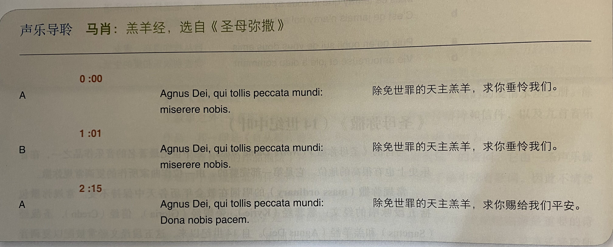

[TOC]
# 中世纪
* 被称为“**中世纪**”（Middle Ages）的欧洲历史时期长达千年，**中世纪前期**自450年左右**罗马帝国的崩溃**开始，是一个充斥着迁移、动乱和战争的时代
* 然而，**中世纪后期**（约止于1450年）是文化发展的时期：人们开始建造**罗马式教堂**、**修道院**（1000——1150）和**哥特式教堂**（1150——1450），**城市**逐渐发展，多所**大学**创办

* 中世纪后期也是**十字军**的时代，欧洲基督教徒发起了一系列战争（主要在1096——1291年间），以从穆斯林手中收复圣城**耶路撒冷**
* 中世纪时期，三个主要社会阶级之间界限分明：**贵族、农民和神职人员**；**罗马天主教**对社会各阶层有着巨大影响，在这个信仰的时代，地狱变得相当现实，异教则是最严重的罪行；知识为修道院中的**僧侣**所独占，当时大多数人，包括贵族都是**文盲**

* **14世纪**是一个分崩离析的时代，欧洲为**百年战争**（1337——1453）和**黑死病**（即腺鼠疫，约1350年爆发，使欧洲人口减少了四分之一）所苦，封建制度和教会的权威也逐渐衰落；1378——1417年有**两位教皇**相互对立，有几年甚至有三位教皇并存，就连虔诚的基督徒也感到不知所措
* 此时的文学作品如**乔叟**（Chaucer）的《**坎特伯雷故事**》（Canterbury Tales）、**薄伽丘**（Boccaccio）的《**十日谈**）（Decameron）都强调生动的**现实主义**和世俗的**肉体感觉**而非美德和天国的赏赐
# 中世纪的音乐(450一1450)
* 在中世纪，**教堂**不仅在景观和精神上居于统治地位，同时也是**音乐生活的中心**，当时大部分重要音乐家都是为教会工作的**神职人员**
* 在数以千计的修道院中，**礼拜仪式中的歌唱**是最重要的活动之一，**男童**们在教堂附设的学校中接受音乐教育；**女性**不被允许在教堂中歌唱，但可以在**女修道院**中从事音乐活动，修女们学习歌唱，有些人，例如鲁伯斯的女修道院长**宾根的希尔德加德**（Hildegard of Bingen），为她们的合唱团创作音乐作品
* 中世纪音乐多为**声乐**，但当时的音乐家们也演奏**多种乐器**；教会的**负责人**对僧侣们歌唱时的发音、专注程度和音色都有严格的要求
* 教会因**乐器**早先在**异教仪式**中的角色而不认同它们，不过10世纪以后，**管风琴**和**钟**的使用在教堂和修道院中逐渐普及；在此后长达三个世纪当中，管风琴主要在**节日**和其他重要仪式上使用
* 今天，我们对中世纪音乐的实际音响**所知甚少**，中世纪乐器保存至今的极少，当时的乐谱手稿并不标记速度、力度和使用乐器，某些中世纪音乐的记谱只有音高而没有节奏，在文字和图画资料中歌唱者和乐器演奏者经常同时出现，但我们不能确认当时的多声部音乐只有人声，还是由人声和器乐一同演出
## 格里高利圣咏
* **格里高利圣咏**（Gregorian chant）作为罗马天主教会的**官方礼拜音乐**已有超过千年的历史，它有**拉丁文**的宗教歌词，演唱时**不加伴奏**，音乐为**单声部织体**
* 自1962一1965年举行的**第二次梵蒂冈大公会议**以来，大多数天主教会的礼拜仪式都用**本国语言**举行，现在格里高利圣咏已经不再常用了
* 格里高利圣咏传达一种平静、非俗世的感觉，它代表着**教会的声音**，而非任何个人的声音；它的**节奏自由**，没有拍子，也几乎没有节拍，自由流动的节奏使格里高利圣咏有着**流动的、即兴式**的特性；旋律的**音域狭窄**，多使用**级进**，旋律的**简单或复杂**依歌词的内容和重要性而定，有些几乎就是在单一的音上反复吟诵，有些则有复杂的旋律线
* 格里高利圣咏得名于教皇“伟大的”**格里高利一世**（Gregory I the Great），他在590一604年的任期中改革了天主教会的**礼拜仪式**；虽然中世纪传说认为格里高利一世创作了格里高利圣咏，但实际上它是经过了数世纪的发展**逐渐成形**的
* 最初格里高利圣咏旋律是**口口相传**的，但旋律的数量逐渐增长至数千，为了保证西方教会仪式的一致性，它们被**记录下来**；现存**最早的圣咏手稿**写成于9世纪

* 中世纪的僧侣和修女们每天花数小时在两类仪式中歌唱格里高利圣咏：**日课**和**弥撒**；**日课**包括**八个仪式**，第一个在日出之前，最后一个在日落时，**弥撒**（mass）是礼拜日的高潮，仪式性地再现了最后的晚餐
## 教会调式与和弦
* 格里高利圣咏那“超凡脱俗”的音响和使用了人们不熟悉的音阶有关，这些音阶称为**教会调式**（church modes），有时也简称**调式**（mode）
* 和大小调音阶一样，教会调式也包含**七个各不相同的音**，第八个音在高八度上**重复**第一个音，不过，它们在**全音和半音的排列**上与大小调音阶不同；教会调式是西方中世纪和文艺复兴时期宗教和世俗音乐广泛使用的调式，许多西方民间音乐也使用教会调式
* 中世纪音乐理论家认为三度是**不协和**的，因此中世纪音乐有时令人感到空洞；中世纪后期的音乐则较多使用三度或**三和弦**
### 《哈利路亚：我们看见他的星》
* 这首取自主显节弥撒的《**哈利路亚**》（Alleluia）精致而欢欣鼓舞；**Alleluia**一词是希伯来文**hallelujah**（赞美你，上帝）的拉丁形式
* 这首圣咏常常使用**数个音符**对应**单一音节**，在音节上一连串的音符言地表达出欢乐和**宗教狂喜的情感**
* 圣咏的**单声部织体**因**独唱与合唱的交替**而并不单调，它的曲式为**ABA形式**，开头的“哈利路亚”旋律在末尾重复，中间段落的歌词来源于**圣经**

### 宾根的希尔德加德：《哦，追随者们》
* 《**哦，追随者们**》（O successors）是一首更晚近的、表现力丰富的格里高利圣咏，其作者是修女**宾根的希尔德加德**（Hildegard of Bingen），德国**鲁伯斯堡女修道院**的院长
* **希尔德加德**是中世纪最富创造力和最为多面的人物之一，作为一位通灵者和神秘主义者，她活跃于宗教和外交事务；她创作诗歌与音乐，撰写神学、科学和医学著作，以及一部神秘剧《**美德**》（Ordo virtutum），它是现存最早的**道德剧**（morality play）；她是第一位留有大量作品（单声部宗教歌曲）的**女作曲家**
* 在手稿上，这首圣咏是一条**单独的旋律线**，没有伴奏；不过，在所附录音中增加了低音声部的持续音伴奏，**持续音**（drone）是指伴随旋律出现的一个或数个长音
* 这首圣咏的一个音节通常对应一至四个音符，只有在**音乐末尾**才由多个音对应一个音节，旋律制造出一种**渐进**的感觉，在**宽广的音域**中流动（一个八度加一个六度）
* 最初，平静的旋律局限于低音区，主要为**级进**，然而，自scut一词以后，在高音上出现了一些**重音**，并有上行的**五度跳进**（et,vos,qui,semper等词）；**最高音**（在歌词的重心officio,service处）一直到**结束乐句**才出现，之后逐渐**级进下行**（agni,lamb等词），回到开头的低音区

* 《哦，追随者们》比《哈利路亚：我们看见他的星》更像**说话**，因为后者经常用许多音符对应单一音节，而希尔德加德的圣咏**音域**更宽广，使用更多的**跳进**，在尾声的高潮处表现更深厚的**情感**
## 中世纪世俗音乐
* 现存最早可解读的**第一批世俗歌曲**由被称为**游吟诗人**（troubadours或trouvères）的法国贵族创作于12和13世纪，这些诗人-音乐家的代表之一是来自法国南部的游吟诗人**阿基坦公爵纪尧姆九世**（Guillaume IX，duke of Aquitaine）和来自法国北部的游吟诗人**库西的沙特兰**（Chastelain de Couci）
* 在这个骑士时代，精通**音乐和诗歌**的骑士们享有很高声望，就像之前那些英勇战斗的骑士们一样；他们的许多**爱情歌曲**保存至今，因为贵族让教士们将它们记录下来
* 这些歌曲经常由**宫廷的吟游诗人**（minstrel）演唱，几乎都与爱情有关，不过也有一些以十字军东征为主题，还有舞蹈歌曲和纺织歌曲；在法国部还有**女性游吟诗人**，如**迪耶的比阿特丽斯**（Beatriz de Dia），她们为男性创作歌曲
* 现存的游吟诗人歌曲有大约1,650首，它们的乐谱并未记录节奏，但许多歌曲似乎有规则的拍子和**明显的节拍**，因而与节奏自由、不含拍子的格里高利圣咏不同
* 在中世纪，**四处流浪的吟游诗人**（minstrels或jongleurs，该词来源于法文juggler）在城堡、酒馆和城镇广场表演音乐和杂耍；游吟诗人**没有公民权**，和娼妓与奴隶一样处在社会底层，只有少数幸运者能够找到为贵族服务的稳定工作，但在没有报纸的时代，他们是**重要的信息来源**，他们一般演唱**由他人创作**的歌曲
### 《埃斯坦比耶》(13世纪)
* 中世纪舞曲**埃斯坦比耶**（estampie）是现存最早的**器乐形式**之一；埃斯坦比耶手稿记录**单一的旋律线**，一般不指明由何种乐器演奏
* 因为中世纪游吟诗人可能为舞曲旋律加上一些**即兴伴奏**，所以在演奏中，音乐家们加上了持续音——由**诗琴**（psaltery,一种拨弦或击弦的乐器）演奏的相隔五度的两个不断重复的音；这首埃斯坦比耶是**三拍子**，节奏清晰、强劲

## 复调的发展：奥尔加农
* 在长达数个世纪的时间里，西方音乐基本上是**单声部**的，只有一条旋律线；但在8一10世纪间，西方音乐有了革命性的改变，修道院唱诗班的僧侣们开始给格里高利圣咏加上**第二条旋律线**
* 一开始，第二条旋律是**即兴作**的，没有记录下来，它只是在不同音高上**重复**圣咏旋律，两条旋律线一音对一音平行进行，之间相隔四度或五度

* 由格里高利圣咏旋律和附加的一条或数条旋律线构成的中世纪音乐称为**奥尔加农**（Organum）；在10——13世纪间，奥尔加农演变成真正的**复调音乐**，附加于圣咏的旋律逐渐变得独立，附加旋律不再严格地与圣咏旋律平行，而是发展为**不同的旋律**
* 在1100年左右，圣咏和附加旋律不再局限于一音对一音的形式，它们不仅在旋律上不同，**节奏**也不一致，低音声部的圣咏旋律通常为长音，其上的附加旋律则为较短的音
* 实际上，有时圣咏旋律的音拖得太长，像持续音一样，使原来的旋律**无法辨认**；不过，圣咏代表教会的权威，**教会**的影响力过于强大，因此在数百年中，大部分的复调音乐都是在熟悉的圣咏旋律上增加新的旋律线而形成的
## 圣母院乐派：有量节奏
* 约1150年后，欧洲的思想和艺术中心——**巴黎**成为**复调音乐**的中心；**巴黎大学**吸引了许多一流学者，**巴黎圣母院**（Cathedral of Notre Dame，始建于1l63年）是**哥特式建筑**的最高典范
* 先后主持圣母院唱诗班的两位音乐家——**莱奥宁**（Leonin）和**佩罗坦**（Perotin）都是最早在音乐史上留名的作曲家之一，他们和后继者们被称为**圣母院乐派**（School of Notre Dame）
* 1170一1200年间，圣母院乐派的作曲家们**改革了音乐的节奏**；早先的复调音乐的节奏可能与自由、没有拍子的格里高利圣咏一致，但莱奥宁和佩罗坦的作品使用了**有量节奏**（measured rhythm），有明确的时值和拍子，在西方音乐史上，这是记谱法中首次与音高一样**明确标记节奏**
* 最初，记谱局限于某些特定的节奏模式，节拍必须为**三个一组**，以象征**三位一体**；尽管有着这些限制，在12世纪后期和13世纪仍然产生了许多优秀的复调音乐作品
### 佩罗坦：《哈利路亚：诞生》(约1200)
* 在已知的作曲家中，**佩罗坦**（12世纪后期一13世纪前期）第一位创作了**两个以上声部**的音乐作品；《**哈利路亚：诞生**》是一首**三声部奥尔加农**，它建立在一段格里高利圣咏的哈利路亚旋律上
* 用作复调音乐基础的圣咏旋律称为**固定旋律**（cantus firmus）；在固定旋律之上，佩罗坦加上了两段**速度较快**的旋律
* 《哈利路亚：诞生》的两个上声部有**明确的拍子**，可以记为快速的（1-2-3-4-5-6），音乐不断重复**固定的节奏型**：长-短-长，长-短-长；**高低声部间的节奏对比**是中世纪复调音乐的常见特征，三个声部的**狭窄音域**同样典型，它们之间的距离从不超过一个八度
## 14世纪音乐：意大利和法国的“新艺术”
* 14世纪的**世俗音乐**的重要性超过了宗教音乐；作曲家开始不用格里高利圣咏为基础创作**复调音乐**，这些新作品包括饮酒歌和模仿鸟鸣、犬吠和猎人的呼喊声的音乐
* 14世纪前期出现了一种**新的记谱体系**，允许作曲家记录几乎所有的**节奏型**；这时的拍子可以两分或三分，之前很少使用的**切分音**变得相当重要
* 14世纪音乐风格的变化显著，因此音乐理论家们将当时意大利和法国的音乐称为**新艺术**（拉丁语ars nova）
## 弗朗切斯科·兰迪尼
* 自幼**盲眼**的**弗朗切斯科·兰迪尼**（Francesco Landini）是14世纪最著名的**意大利作曲家**，他出生于**佛罗伦萨**附近，并在这座城市度过一生
* 兰迪尼是著名的管风琴家、诗人、学者，还发明了一种新的弦乐器；他的作品均为两个或三个声部的**意大利语歌曲**，主题包括自然、爱情与道德、政治
### 兰迪尼：《春天来了》(14世纪)
* 《**春天来了**》（Ecco la primavera）是一首**无忧无虑**的歌曲，它有**两个声部**，表现了春日的欢乐；歌曲是**三拍子**的，节奏强烈而快速，它的节奏多变，经常使用**切分音**，这是14世纪音乐的一个典型特征
* 《春天来了》是一首**巴拉塔**（ballata），一种起源于伴舞歌曲的意大利诗歌和音乐形式，歌曲包括两个在音乐上相似的段落：A（长）和B（短），其顺序为**ABBAA**

## 纪尧姆・德・马肖
* 著名的音乐家和诗人纪尧姆·德·马肖（Guillaume de Machaut）出生于**法国香槟省**，他学习神学，一生中大部分时间为多个皇室服务
* 马肖造访过许多宫廷，将他的音乐和诗歌以**装饰华丽的抄本**形式献给贵族赞助人们，这些抄本使马肖成为**最早有作品留存的作曲家**之一；14世纪时**教会的衰落**也反映在马肖的作品中，他的作品主要是为一至四位演唱者而作的**宫廷爱情歌曲**
### 《自从被你遗忘》(约1363)
* 大约六十岁时，马肖爱上了一位年轻美丽的贵族女子**佩罗内**，虽然过大的年龄差距最终还是使双方的关系失望地告终，但马肖最伟大的叙事诗《**真实的诗**》（Le Livre Dou Voir Dit）使他们的爱情永垂史册
* 除了叙事之外，《真实的诗》还包括马肖和佩罗内写作的抒情诗和信件，以及九首音乐作品，其一即是《**自从被你遗忘**》（Puis qu'en oubli sui de vous）
* 这首忧郁的作品描绘了马肖被恋人遗忘后“**告别欢乐**”的苦闷，它由一条**声乐旋律**和两个**音域极低的伴奏声部**组成；这两个伴奏声部在手稿中没有歌词，因此不清楚它们是为人声还是器乐而作的
* 《自从被你遗忘》是一首**回旋歌**（rondeau），这是14及15世纪法国最重要的诗歌和音乐体裁之一；歌词共有八行，每行都以音节mis或mant结束，第1-2行为**叠句**，在第7-8行重复，第4行**重复**第1行

### 《圣母弥撒》(14世纪中叶)
* 马肖的《**圣母弥撒**》（Notre Dame Mass）是中世纪最著名的音乐作品之一，在音乐史上也有很高的地位；它是第一部完整的、由一位作曲家所作的**复调常规弥撒**
* **常规弥撒**（mass ordinary）的唱词在教会年历各天中**保持不变**，包括五段咏唱的经文：**慈悲经**（Kyrie），**荣耀经**（Gloria），**信经**（Credo），**圣哉经**（Sanctus）和**羔羊经**（Agnus Dei）；自14世纪以来，这五段经文经常被配以复调音乐，并催生了许多伟大的合唱作品（在礼拜仪式中，慈悲经和荣耀经**连续演唱**，信经、圣哉经和羔羊经之间则**穿插**有其他礼拜仪式和其他音乐，如格里高利圣咏）
* 马肖为**羔羊经**（祈祷上帝的慈悲与和平）所作的音乐是庄严而精致的；它是**三拍子**的，复杂的节奏型加强了音乐的力量，两个上声部的节奏**活跃**，使用了14世纪音乐中流行的**切分音**，两个下声部由**长音**构成，以支持上声部
* 羔羊经的基础是一首**格里高利圣咏**，马肖赋予它新的节奏模式并将它安排在两个下声部之一的**男高音声部**；羔羊经的和声包括明显的不协和、空洞的和弦和完整的三和弦
* 歌曲曲式为**ABA**，三个部分的歌词**基本相同**，A段和B段在情绪、节奏和织体上相包，都以相同的**空洞和弦**结束；音乐分为三个部分也象征了**三位一体**
