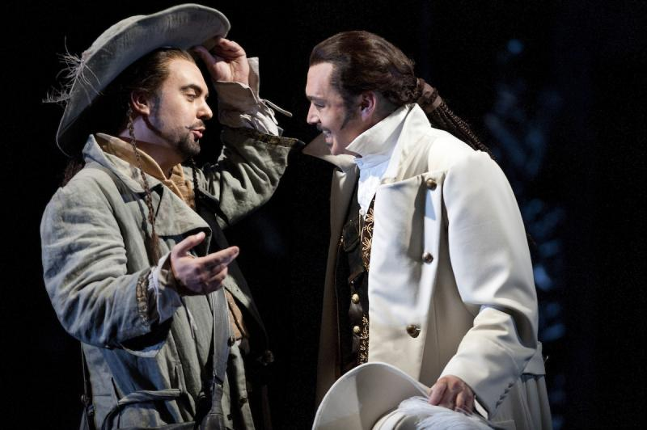
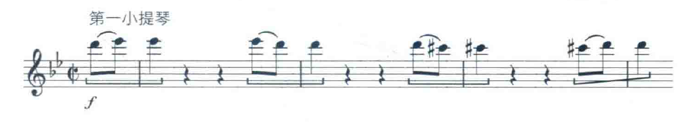
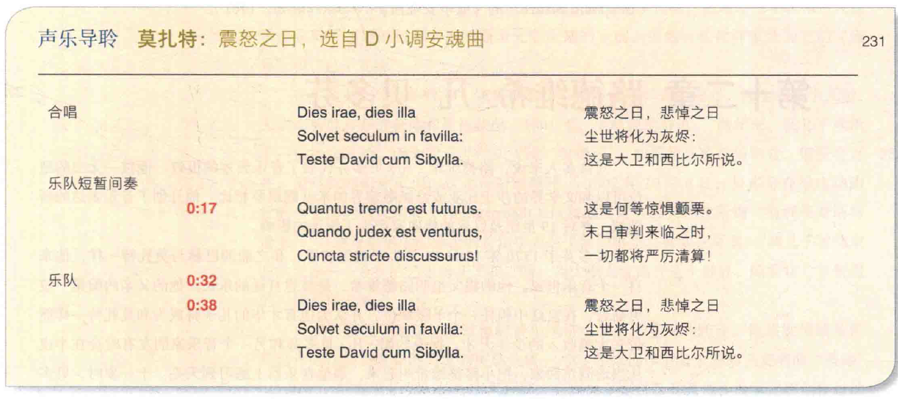

# 古典时期
* 到了18世纪中叶，**理性力量**的信念更加强大，已经开始逐渐动摇社会和宗教的权威；哲学家和作家们，特别是**伏尔泰**（Voltaire）和**狄德罗**（Denis Diderot）都认为他们的时代是历史上的转折点，将它称为“**启蒙时代**”
* 他们相信进步，认为**理性**而非习俗或传统是人类行为的最佳向导；他们对贵族和神职人员特权的抨击，反映了**中产阶级**为争取自身权利而斗争的愿望
* 18世纪的一些统治者们接受了启蒙运动的思想；例如，奥地利皇帝**约瑟夫二世**（1780——1790年在位）**废除了农奴制度**，关闭修道院和女修道院，并废除贵族在刑法上的特权
* 他不鼓励繁琐的宗教仪式，并下令葬礼应当**简朴**：虽然这条法令很快被废除，简朴的丧葬仪式很快成了**维也纳**的习惯；1791年，当古典时期最伟大的作曲家之一**沃尔夫冈·阿玛德乌斯·莫扎特**逝世时，他被装在麻袋里葬在一个不知名的公墓
* 1750一1820年间发生了一系列血腥的**政治和社会变革**，在此期间发生了七年战争、美国革命、法国革命以及拿破仑战争；政治和经济力量从贵族与教会转到中产阶级手中。社会变动如此剧烈，以至于拿破仑因**自身的天赋**而非血统关系最终当上**法国皇帝**
* 在18世纪前期，沉重、宏大的巴洛克风格被更为亲切的**洛可可**（rococo）风格取代，后者有明亮的色彩、曲折的线条和优雅的装饰；画家**安托万・华托**（Antoine Wattea）和**让-奥诺莱·弗拉戈纳尔**（Jean-Honore Fragonard）描绘了一个令人陶醉的世界，画中满是不断追逐享受的优雅的男女

* 然而到了18世纪末，洛可可风格逐渐被**新古典主义**（neoclassical）风格取代，后者试图再现古希腊罗马艺术中“高贵的简洁和宁静的庄严”；新古典艺术家们强调坚定的线条、清晰的结构和有道德意味的主题素材，曾参加法国大革命的画家**雅克-路易·大卫**（Jacques-Louis David）试图通过笔下的古罗马场景激发**英雄气概和爱国情操**

* **传统力量的衰退**在艺术领域中进一步反映在英国画家**威廉·荷加斯**（William Hogarth）和西班牙画家**弗朗西斯科·戈雅**（Francisco Goya）作品中，前者**社会意识强烈的画作**讽刺了英国贵族和中产阶级的行为与道德，后者以**高度个性化的视角**创造出抨击虚伪、压迫和残暴的作品

# 古典风格（1750——1820）
* 在音乐史上，从巴洛克风格到古典风格全盛期的过渡称为**前古典时期**（preclassical period），大约是1730——1770年
  * 甚至在巴赫和亨德尔创作巴洛克风格的伟大作品时，音乐风格的转变就已经开始了，新风格的重要先驱包括巴赫的儿子**卡尔·菲利普·埃曼纽尔·巴赫**（Carl Philipp Emanuel Bach）和**约翰・克里斯蒂安・巴赫**（Johann Christian Bach）；18世纪中期，作曲家着重表现**简明和清晰**，放弃了晚期巴洛克音乐的繁复，**悦耳的旋律**和**简洁的和声**取代了复调织体
  * 18世纪中期的作曲家用作品中情绪和主题的对比来娱乐听众，“**华丽风格**”（style galant）一词就是指这种轻松、优雅的音乐；音乐上的华丽风格类似于美术上的**洛可可风格**
* “**古典**”（classical）一词极易造成混淆，因为它的含义众多，它可以指**古希腊和罗马**，也可以指任何**长久受到喜爱的最高成就**（如movie classic）；许多人用“**古典音乐**”（classical music）一词表示爵士、摇滚、流行和民谣以外的音乐
  * 音乐史学家从**艺术史**领域借用了“古典”一词，这一术语在艺术领域更加贴切；18世纪后期和19世纪前期的绘画、建筑与雕塑深受**古希腊罗马典范**的影响，但同时期的音乐却**并未反映**出多少**与古代的直接联系**
  * “古典”音乐和“新古典”艺术之间显著的共同之处，是两者都强调**平衡**和**清晰的结构**；这些特征可以在发展成熟期的古典风格音乐中找到，而这恰是**本部分的重点**
## 古典风格的特征
### 情绪的对比
* 古典时期的音乐更加强调情绪的**丰富变化和对比**；晚期巴洛克作品表达**单一的情感**，而古典作品的情绪则**波动起伏**
  * 戏剧性、不稳定的音乐可能导向一段**轻松的舞曲曲调**，一个乐章内可能使用**互为对比的不同主题**，即使在同一个主题内也可能存在**明显的对比**
  * 古典风格音乐的情绪转变可能是**渐进**的，也可能是**突然**的，以表达情绪起伏和冲突；古典作曲家严格控制着这样的冲突和对比，海顿、莫扎特、贝多芬等大师都能够使情感变化多样的音乐具备统一性和逻辑感
### 节奏
* **节奏的灵活性**给古典风格音乐增添了变化；古典作品的节奏模式**丰富**，不同于巴洛克作品仅使用**反复出现**的少数节奏模式
  * 巴洛克作品表现出**持续不断的运动**，因此在音乐开始几小节后听众大概就能知道**整个乐章的节奏特征**；但古典风格作品会使用出人意料的休止、切分音和长短音符的**频繁转换**，从一种音符长度模式到另一种的改变可以是突然的，也可以是渐进的
### 织体
* 与晚期巴洛克音乐的**复调织体**相比，古典风格音乐主要为**主调织体**；不过，织体的运用和节奏一样**灵活**，音乐作品中织体的转换或平稳或突然
  * 一条旋律线和简单伴奏构成的**主调织体**开始，之后可能转为更复杂的**复调织体**，其中包含同时出现的**两条旋律**，或旋律片段在不同乐器间交替模仿
### 旋律
* 古典旋律特别悦耳动听、**容易记忆**，即使是特别复杂的作品也可能使用**民歌或流行风格**的旋律；有时作曲家也会直接借用一些**通俗曲调**
  * 莫扎特以法国歌曲《**哦，让我告诉你，妈妈**》（Ah，vos dirai-je，naman）的旋律为主题，写了一首**变奏曲**，该旋律即我们熟知的《**小星星**》
  * 古典旋律听起来较为平衡和对称，因为旋律通常由两个**长度相同**的乐句构成，第二个乐句的开头可能与第一个乐句类似，但结尾更具**终结感**，这种旋律朗朗上口，其形式可以记为aa'，它经常用于**童谣**，如《**玛丽有只小羊羔**》；相反，巴洛克旋律**较不对称**，更为精巧复杂，**较难演唱**
### 力度与钢琴
* 古典作曲家对情感表达的**细微差别**的兴趣，带来了渐进力度转换的广泛运用：**渐强**（crescendo）和**渐弱**（decrescendo）
  * 作曲家不局限于巴洛克音乐中典型的**阶梯力度**（突然的强弱转换）；渐强和渐弱可谓**令人震惊的新事物**，听众们有时甚至兴奋地从座位上起身
* 古典时期，作曲家对渐进力度变化的喜爱导致**羽管键琴**被**钢琴**取代；钢琴家可以通过控制**手指对琴键的压力**来控制音量
  * 虽然钢琴发明于**1700年左右**，但直到**1775年左右**才开始取代羽管键琴；海顿、莫扎特和贝多芬的大部分成熟的键盘作品都是为**钢琴**而非羽管键琴、楔槌键琴和管风琴等巴洛克时期流行的键盘乐器而作
  * 18世纪晚期的钢琴称为“**早期钢琴**”（fortepiano），它的重量比现代钢琴轻得多，**较细**的琴弦固定在**木制**而非金属的张弦系统上；早期钢琴的音域和音量**较小**，音的持续时间也**较短**
### 通奏低音的消失
* **通奏低音**在古典时期逐渐**被淘汰**；在海顿和莫扎特的作品中，羽管键琴家**不需要即兴演奏伴奏**
  * 通奏低音消失的原因之一在于更多的作品是为**业余爱好者**而作的，他们难以掌握通过数字低音即兴演奏的艰难技巧
  * 而且，古典作曲家希望有**更多的控制权**，他们更愿意自己写作伴奏部分而非让演奏者即兴发挥
## 古典时期的管弦乐队
* 古典时期出现了一种新的管弦乐队；巴洛克时期乐队的编制**依作品而异**，而古典时期的乐队则由四个标准部分构成：**弦乐器**、**木管乐器**、**铜管乐器**和**打击乐器**
  * 在莫扎特和海顿的**晚期器乐作品**中，乐队的编制大致如下，请注意木管乐器和铜管乐器都是**成对使用**的，且**单簧管**也加入了管弦乐队；海顿和莫扎特也使用**长号**，但仅用在歌剧和教会音乐中，不在纯器乐作品中使用

* 古典时期管弦乐队的乐手人数一般**比巴洛克时期多**，但也因地域不同而有所差别；海顿在1761——1790年间指挥的私人乐团只有二十五位乐手，而1795年他在伦敦的公开音乐会上指挥的乐团有六十名乐手
* 古典作曲家探索了乐队中不同乐器的**独特音色**，他们不会像巴洛克作曲家一样**以相同的方式处理不同乐器**
  * 古典作曲家不会让双簧管在整个乐章中重复小提琴旋律，古典作品有**丰富而频繁的音色变化**；一个音乐主题可以先由全体乐队奏出，然后移到弦乐器上，再由木管乐器重复
* 古典乐队的每个部分都有**各自的作用**
  * **弦乐**是最重要的，**第一小提琴**最常演奏**旋律**，**低音弦乐器**提供**伴奏**
  * **木管乐器**增加了**音色的对比**，并经常演奏**独奏旋律**
  * **圆号和小号**为强奏乐段**增添力量**，并增强**和声效果**，但它们很少演奏主旋律
  * **定音鼓**用于强调**节奏**
## 古典曲式
* 古典时期的器乐作品通常由几个速度和气质**各不相同的乐章**构成，一部作品通常包括下面的**四个乐章**

* **古典交响曲**和**弦乐四重奏**通常遵循这种四乐章模式，而**古典奏鸣曲**可以有二至四个乐章
  * **交响曲**（symphony）为**管弦乐团**而作；**弦乐四重奏**（string quartet）为两把小提琴、一把中提琴和一把大提琴而作；**奏鸣曲**则使用**一两件乐器**
* 古典作曲家可以使用**不同的曲式**来创作交响曲、弦乐四重奏或奏鸣曲的各个乐章；一首作品的某个乐章可能是ABA形式，另一个乐章则可能是主题与变奏
* 古典乐章中常常包含生动的**主题对比**，一个乐章可能包括二至四个，甚至更多气质各异的主题，这种对比性主题的运用使古典音乐区别于**巴洛克音乐**，后者通常只使用**一个主要主题**；古典作曲家有时用一个**短暂的休止**标志新主题的出现
* 古典乐章中较大的段落之间通常以令人满意的**对称方式**彼此平衡。远离主调的**不稳定段落**与强调主调的**稳定段落**相互平衡；音乐的张力在古典乐章结束时获得**纾解**
## 古典时期的作曲家、赞助人与公众
* 海顿、莫扎特与贝多芬——**三位伟大作曲家**——的创作时期正值剧烈的**政治与社会动荡**，正如我们在本部分开头所提到的；与其他人一样，音乐家们也深受社会变革的影响，通过三位大师的创作生涯，我们可以追溯作曲家们**逐渐获得解放**的经过
  * 首先是**约瑟夫·海顿**，他满足于大半生为一个富有的贵族家庭服务。从他的雇佣合同中可以看出，他被视为**有技术的仆人**，如同一位园丁或猎场看守人；他必须穿制服，“创作殿下所要求的音乐”，且应注意“避免饮食和谈话中的不文明行为” 
  * **沃尔夫冈·阿玛德乌斯·莫扎特**只比海顿晚出生二十四年，就可以不必忍受做一名仆人，他挣脱了**宫廷职位的束缚**，前往维也纳，试图成为一名**自由职业作曲家**；在最初几年中，他获得了巨大的成功，但之后他的声望下降，死时**债务缠身**
  * **路德维希·凡·贝多芬**的境况就比莫扎特好得多，仅仅在莫扎特逝世数年后，贝多芬就可以在维也纳当一位**独立音乐家**；他的成功基于中产阶级**更高的音乐需求**，也基于他的**强势个性**，使贵族愿意资助他并与他**平等交往**
* 在18世纪，更多人变得富裕，但蓬勃发展的中产阶级不仅需要物质生活，更需要贵族式的享受，如戏剧、文学和音乐 
  * 事实上，在古典时期，中产阶级对音乐有着巨大的影响，因为宫廷音乐会不对他们开放，市民们自行组织了**公共音乐会**，只要支付入场费就能欣赏到**最新的交响曲和协奏曲**
  * 不过，商人和律师们不满足于仅仅在音乐会上欣赏音乐，他们还希望自己**家中**弥漫着音乐气息，他们认为自己的子女应该像贵族子弟一样接受**音乐训练**；事实上，如果中产阶级的子女能够精通乐器演奏，他们可能被邀请到宫廷中，甚至获得与贵族联姻的机会
* 古典时期的作曲家开始重视**中产阶级的品位**
  * 他们创作业余爱好者也能**轻松演奏和理解**的作品；他们从正歌剧转向喜歌剧，从贵族喜爱的英雄性和神秘主义的情节转向中产阶级的主题和民歌旋律
  * 他们的喜歌剧有时甚至取笑贵族，舞曲乐章也不那么优雅和富于宫廷气息，而是更富于**活力和乡村气息**
* 严肃的作品也受到**民间和通俗音乐**的影响
  * 古典大师们有时用**熟悉的曲调**作为交响曲和变奏曲的主题，莫扎特喜欢看到人们在以他的**歌剧旋律**改编的圆舞曲伴奏下起舞；海顿、莫扎特和贝多芬都为维也纳的公共舞会创作过**舞曲**
### 维也纳
* 维也纳是古典时期欧洲的**音乐中心**之一，海顿、莫扎特和贝多芬都曾活跃于此
  * 作为**神圣罗马帝国**（包括现在奥地利、德国、意大利、匈牙利和捷克的部分地区的**首都**，它是一个繁荣的文化与商业中心，可谓是一座**大都会**；维也纳的人口近二十五万，是欧洲的**第四大城市**
  * 三位古典大师并非出生在维也纳，但他们都前往维也纳**学习并寻求发展**；在维也纳，**海顿**和**莫扎特**成了**亲密的朋友**，并互相影响了对方的音乐风格，**贝多芬**十六岁时到维也纳为莫扎特演奏，二十二岁时回到这里并师从海顿
* 帝国各地的贵族们都愿意在维也纳过冬，有时还带着他们的**私人乐队**；音乐是宫廷生活的重要部分，一支优秀的乐队是身份的象征
  * 许多贵族都是出色的音乐家，例如**玛丽亚·特蕾西亚**女皇年轻时曾在宫廷音乐会中演唱，**约瑟夫二世皇帝**是一位出色的大提琴手，**鲁道夫大公**（Archduke Rudolf）长期随贝多芬学习钢琴与作曲
* 维也纳也有许多轻松、通俗的**室外音乐活动**，弦乐器和木管乐器演奏者组成小型的**街头乐队**，在花园中的聚会或住宅窗下演奏，希望有人丢下赏钱
  * 海顿和莫扎特写了许多室外娱乐作品，称为**嬉游曲**（divertimento）或**小夜曲**（serenade）
## 奏鸣曲式
* 从古典时期到20世纪，数量惊人的重要作品都是用**奏鸣曲式**创作的
  * **奏鸣曲式**（sonata form，有时称为sonata-allegro form）是**一个乐章的曲式结构**，请勿将它与**奏鸣曲**混淆，后者是指由数个乐章构成的完整作品
  * 古典交响曲、奏鸣曲或弦乐四重奏中**快速的首乐章**通常使用奏鸣曲式；奏鸣曲式也用于**慢乐章**和**快速末乐章**
* 奏鸣曲式由**三个主要段落**构成：**呈示部**（exposition），呈示主题；**展开部**或**发展部**（development），以新的方式处理主题；**再现部**（recapitulation），主题回归；这三个主要段落后经常会跟着一个结束段落，称为**尾声**（coda），请记住这些段落都是在一个乐章之内

* 奏鸣曲式的快乐章有时会加用一个**慢引子**（introduction）以制造出一种**强烈的期待感**
### 呈示部
* 呈示部在**主调**和**新调**间，以及在**第一主题**（群）和**第二主题**（群）间制造出**激烈的冲突**
  * 它以主调上的**第一主题**开始，之后是一个**连接段**（bridge或transition），引导到新调上的**第二主题**；从主调到新调的转调制造出和声上的**紧张感**和不断前进的**运动感**
  * 第二主题通常与第一主题形成**情绪上的对比**，结尾段以第二主题的**新调性**结束呈示部；古典时期的呈示部末尾常常标有**反复记号**（：），表示整个呈示部应**重复演奏一次**
### 展开部
* 展开部通常是乐章中最具戏剧性的段落，音乐在**不同的调性**中不断变化，可能会使听众**失去平衡感**；通过不断的转调，**和声张力**得到强化
  * 在展开部中，主题得到**发展**，或以新的方式出现；它们被分割成片段或**动机**（motives），即在一首音乐作品中得到发展的**短小乐思**
  * 一个动机可以用来表现**完全不同**、出人意料的情感；例如，一个**喜剧性**的主题片段可能在改变旋律、节奏或力度后听起来有**侵略**、威胁的感觉
* 主题可以和**新的乐思**结合，主题的**织体**也可以改变，作曲家可以用不同乐器快速交替演奏一个动机以制造复杂的**复调织体**；在展开部中，和声与旋律的**不断变化**产生亟需解决的张力
### 再现部
* 再现部的开始使紧张感得到**解决**，因为**第一主题**重新出现在**主调**上
  * 在再现部中，第一主题、连接段、第二主题和结尾大致以和呈示部相同的方式呈示，但两者之间有**关键的差异**：再现部中所有的主要素材都在**主调**上；呈示部中主调的第一主题与新调的第二主题和结尾存在着**强烈的对比**，这一冲突在再现部中得到**缓解**

* 奏鸣曲式具有**灵活性**和无尽的变化能力，它不是一个僵化的模式，只能把音乐素材灌注进去；相反，它应被视为**一系列原则**，用来加强和统一**主题与调性的对比**
### 沃尔夫冈·阿玛德乌斯·莫扎特：G小调第40交响曲，K.550（1788）
#### 第四乐章：极快的快板（Allegro assai）
* 莫扎特G小调第40交响曲K.550急速的**奏鸣曲式末乐章**表达了一种**有节制的紧张感**
  * 开头的主题在**G小调**上，包含夸张的力度和节奏对比；一个弱的上行琶音（分解和弦）与一个强的快速乐句**反复交替**

  * 较长的**连接段**中保持着**激动的情绪**，它由主题中**强有力的快速乐句**产生；**过渡段**以短小的休止**明确地结束**，乐章中的其他段落也是如此
  * **温柔抒情**的**第二主题**在新调**降B大调**上，与喧闹的开头主题形成对比；它力度较轻，音乐平稳，使用时值较长的音
  * 莫扎特的**展开部**几乎都建立在第一主题的**上行琶音**基础上，在最初几秒，乐队齐奏琶音的变奏和一系列刺耳的下行跳进音程时，音乐形成了**强烈的爆发**；随着展开部的进行，音乐变为**复调织体**，与呈示部的主调织体形成对比，琶音在各声部间**快速模仿**，**迅速的转调**产生了无休止的紧张感
  * **再现部**中，第一和第二主题都回到了主调G小调上；小调为温柔的第二主题增添了**忧郁感**，它之前则以大调呈示

## 主题与变奏
* **主题与变奏**（theme and variations）这一曲式在古典时期广泛应用，有时作为一首**独立的作品**，有时作为交响曲、奏鸣曲或弦乐四重奏的**一个乐章**
  * 在主题与变奏曲式中，一个**基本的乐思**（主题）不断地**重复**，且每次都**有所变化**，其结构可以归纳如下：主题（A）：变奏1（A'）：变奏2（A"）：变奏3（A"）等，每个上标代表主题的一个变奏
* 虽然每个变奏的**长度**一般和主题一致，但它们各不相同，**情绪**也可能不同于主题
  * 旋律、节奏、和声、伴奏、力度和音色上的改变都可以用来使不同的变奏具备各自的特性；**主要旋律**可以在低音声部出现，或者可以出现在小调而非大调上，也可以与新旋律一同呈示，各个**变奏**可以是连续出现的，也可以用休止分开
  * 作曲家可以**自己创作主题**，也可以**借用他人的作品**；**贝多芬**曾借用一小段圆舞曲旋律，并以之为基础创作了三十三段辉煌的变奏曲，普通的变奏曲可能只有三个变奏
### 约瑟夫·海顿：G大调第94交响曲（“惊愕”）
#### 第二乐章：行板（Andante）
* 海顿的**G大调第94交响曲**（“**惊愕交响曲**”，Surprise Symphony）的**第二乐章**（行板）是一首**主题与变奏**
  * 乐章的主题带**民歌风格**，主要为**断奏**，柔和地开始，却突然被一个不期而至的**响亮和弦**打断，这就是这部交响曲被称为“惊愕”的原因；主题由**两部分**构成，a段和b段，分别**反复一遍**，各个变奏都遵循这一模式
  * 主题后有**四个变奏**，它们在音色、力度、节奏和旋律上分别对主题进行变化；在第一和第三变奏中，主题为一个新旋律所伴奏，它称为**对旋律**（countermelody），两条各具特色的旋律线形成了复调织体，在第二变奏中，主题在**小调**而非大调上，最后一个变奏之后是**结尾段落**，轻柔而不协和的伴奏使轻松的主题变得有些**阴暗**

## 小步舞曲与三声中部
* **小步舞曲与三声中部**（minuet and trio），或简称**小步舞曲**，常用于古典交响曲弦乐四重奏和其他作品的**第三乐章**
  * 和巴洛克组曲中的乐章一样，小步舞曲也源自**舞蹈**，约1650年左右起源于法国**路易十四的宫廷**，并在整个18世纪流行于**贵族**当中
  * 小步舞曲是一种**平稳、高贵**的舞曲，期间舞伴以**屈膝礼**和**鞠躬**相互致意
  * 交响曲或弦乐四重奏中的小步舞曲乐章通常是为**欣赏**而非伴舞而作
* 小步舞曲通常为**三拍子中速**的舞曲，其曲式为**ABA**：**小步舞曲**（A），**三声中部**（B），**小步舞曲**（A）
  * 三声中部（B）通常比小步舞曲（A）部分**安静**，使用较少的乐器，经常包含**木管乐器的独奏**；它的名称源于巴洛克时期，当时两首一组的舞曲演奏完后会再重复一遍第一首舞曲
  * 第二首舞曲被称为“**三重奏**”（trio），因为它通常由**三件乐器**演奏；古典时期的作曲家在小步舞曲的B段中不局限于使用三件乐器，但trio的名称保留了下来
  * A段（小步舞曲）又分成更小的a，b和a'（a的变奏）**三部分**；在开头的A段（小步舞曲），每部分按如下形式分别反复：a（反复）ba'（反复）
  * B段（三声中部）的结构也**一样**：c（反复）dc'（反复）；在B段（三声中部）结尾，作曲家使用**da capo**（从头开始）来表示整个A段（小步舞曲）应再重复一遍，在这次重复中，小步舞曲**直接演奏**，不需要反复各部分，其形式为aba'

* 由于小步舞曲具有**ABA曲式**和**多个反复乐段**，它的结构可以说是交响曲或弦乐四重奏各乐章中**最简单**的
* 在**贝多芬**的许多作品中，第三乐章并非小步舞曲，而是另一种与之相关的曲式称为**谐谑曲**（scherzo）；谐谑曲和小步舞曲一样也是ABA曲式、三拍子，但它的速度更快，更有活力，节奏感更强，更有**幽默感**
### 沃尔夫冈·阿玛德乌斯·莫扎特：《弦乐小夜曲》，K.525（1787）
* 莫扎特的《**弦乐小夜曲**》（Eine kleine Nachtmusik）是一首**小夜曲**（serenade），这是一种情绪轻松，适合**晚间娱乐**的作品，它为一支**弦乐小乐队**或**弦乐四重奏**加上**低音提琴**而作（低音提琴低八度重复大提琴声部）
  * 乐曲的第三乐章是ABA曲式的**宫廷风小步舞曲**；A段（小步舞曲）庄严、力度较强、断奏，节拍清晰，相反，B段（三声中部）较为亲切、力度较弱、连奏，它轻柔的伴奏使音乐听起来平滑流畅

## 回旋曲式
* 古典时期的许多乐章都使用回旋曲式；**回旋曲式**（rondo）是指旋律性强的**主要主题**（A）多次回归，与其他主题**轮流出现**的一种曲式
  * 通常回旋曲式的结构为ABACA或ABACABA，主要主题通常活泼、动听、简单易记，听众容易在它再现时**辨认出来**；因主要主题几乎都在**主调**上呈示，它的再现是**令人愉悦的**
  * 回旋曲可以作为一首**独立的作品**，也可以作为一首交响曲、弦乐四重奏或奏鸣曲中的一个乐章；它通常被用作**终曲乐章**，因其生动、有规律、轻快的气质能够让乐曲在欢乐的气氛中结束
* 回旋曲式常常与奏鸣曲式的元素结合，形成奏鸣回旋曲式；**奏鸣回旋曲式**（sonata-rondo）像奏鸣曲式一样有一个**展开部**，其结构为**ABA——展开部——ABA**
### 路德维希·凡·贝多芬：C小调弦乐四重奏，0p.18-4（1798一1800）
#### 第四乐章：回旋曲（快板）
* 贝多芬C小调弦乐四重奏，Op.18-4中的**回旋曲式乐章**激动人心，其结构可以标记为**ABACABA**
  * 它的主要主题**生动活泼**（A），具有**吉普赛舞曲**的风格，由两个各自重复的段落组成：aabb；b段中的一个**出人意料的持续音**令人联想起吉普赛提琴手的即兴演奏
  * B主题为**抒情的连奏旋律**，C主题快速上行的乐句**颇为欢快**；主要主题（A）在最后一次回归时**速度加快**，以最急板形成**气势磅礴的结尾**

## 古典交响曲
* **交响曲**是古典时期在管弦乐领域的**最大贡献**；海顿至少创作了一百零四首交响曲，莫扎特写了四十多首，贝多芬写了九首
  * **海顿**的大部分交响曲是为他的雇主而作的，因为需要不断为宫廷音乐会提供新作品；相反，**贝多芬**只在有灵感时才创作交响20曲，他的交响曲比海顿和莫扎特的长，并且是为在较大的音乐厅中演奏而构思的
* **交响曲**（symphony）是一种篇幅较大、构思宏伟的作品，通常需演奏**20~45分钟**，它拓展了古典乐队的音色和力度范围
  * 古典交响曲一般包括**四个乐章**，通过速度与情绪的对比，表现丰富的情感；古典交响曲通常的乐章顺序为：（1）**激动、戏剧性**的第一乐章：（2）**抒情**的慢乐章：（3）**舞曲式**的乐章（小步舞曲或谐谑曲）：（4）**辉煌或英雄性**的快乐章
  * 开头乐章几乎都是快速的**奏鸣曲式**，它常常是**最富戏剧性**的乐章，包括由短小动机构成的激动人心的**发展部**；在快速的首乐章之前有时会有一个**慢引子**，以制造出期待感
  * 在慢速的**第二乐章**，我们会听到宽广、如歌的旋律，这个乐章可以是奏鸣曲式、ABA曲式或主题与变奏曲式；与其他乐章不同的是，慢乐章通常**不在主调上**，例如，第一、第三、第四乐章若都在主调C大调上，第二乐章则可能在F大调上，这个新调凸显了慢乐章不同于其他乐章的表达方式
  * 在海顿和莫扎特交响曲中，**第三乐章**通常是**小步舞曲和三声中部**，速度为**中等或稍快**，这个乐章的气质多变，从宫廷舞曲到农民舞曲，甚至是激动而不像舞曲风格的；贝多芬喜欢用快速、激烈的**谐谑曲**作为第三乐章
  * 海顿和莫扎特的第四乐章（终曲）是**快速、活泼和辉煌的**，且比第一乐章的情绪**更为轻松**；（莫扎特G小调第四十交响曲中激昂的末乐章是个例外）贝多芬的末乐章则倾向于**胜利和英雄性的气质**，且有时作为整首交响曲的高潮；古典交响曲的末乐章通常为**奏鸣曲式**或**奏鸣回旋曲式**
  * 大部分古典交响曲的各个乐章都是**相互独立**的，有**自己的主题**，一个乐章的主题很少会在之后的乐章出现（贝多芬的第五和第九交响曲例外）；但一首交响曲因有三个乐章使用**相同调性**而获得了部分的统一
  * 直到20世纪乃至21世纪，交响曲都是**极为重要的体裁**；它的重大意义反映在以下为人熟知的名词当中：**交响音乐**（symphonic music，即管弦乐），**交响乐厅**（symphony hall）和**交响乐团**（symphony orchestra）
## 古典协奏曲
* **古典协奏曲**（concerto）是为**独奏乐器和管弦乐队**而创作的乐曲，由**三个乐章**组成
  * 它将独奏家的精湛技巧与诠释能力和乐队丰富的音色与力度结合在一起，这一结合产生了音色和乐思的对比，从而产生令人满意的戏剧效果
* 古典时期**对平衡的喜爱**也体现在协奏曲中，因为独奏家和乐队的**地位相同**，两者之间在旋律和精神上都相互配合、相互交流
  * 有时独奏者演奏旋律，乐队伴奏，有时有木管乐器展开主题，以独奏者波动的琶音（分解和弦）为背景
  * **莫扎特**和**贝多芬**是古典协奏曲的大师，他们经常为自己演奏而创作钢琴协奏曲，**钢琴**是他们最喜爱的独奏乐器；其他古典协奏曲使用的独奏乐器还有小提琴、大提琴、圆号、小号、单簧管和大管等
* 协奏曲的长度和交响曲**一样**，约为20~45分钟，与交响曲不同的是，协奏曲一般只有**三个乐章**：（1）快乐章：（2）慢乐章：（3）快乐章，古典协奏曲不包含小步舞曲或谐谑曲乐章
* 协奏曲的**首乐章**中有一段供独奏者展现技巧的**无伴奏段落**，称为**华彩**（cadenza，意大利文意为“终止”），有时也出现在**末乐章**
  * 在乐章结尾处，乐队通过持续演奏一个**不协和和弦**暂停音乐的进行，这在乐谱中以**延长记号**（fermatao），即写在和弦上方的意味着“**暂停**”的记号来标示；这个暂停宣告了独奏者的**华彩乐段**的进入
  * 在接下来的几分钟里，独奏家**抛开乐队伴奏**，通过演奏令人瞠目的**音阶和分解和弦**来展现技巧；在华彩的结尾，独奏家演奏一个**长颤音**，之后是一个**和弦**，以衔接乐队的进入
  * 古典时期的协奏曲独奏者常常就是**作曲家本身**，他们大多**即兴演奏华彩**，因此，乐谱上只标记**延长记号**，用以表示华彩的进入；但在18世纪之后，即兴演奏的艺术逐渐失传，作曲家开始把华彩直接**写在乐谱上**，这样作曲家也能够更好地掌控作品
* 古典协奏曲的**第一乐章**是一种**特殊的奏鸣曲式**，它有**两个呈示部**
  * 第一个呈示部由**乐队**演奏，在主调上呈示几个主题，它奠定了乐章的**情绪基调**，并让听众期待独奏的进入
  * 第二个呈示部开始于**独奏声部的第一个音**，独奏进入时的音乐或有力或温和，但一定因之前的悬念而具有**戏剧性效果**，接下来独奏与乐队一起在**第二呈示部**中**发展第一呈示部的主题**并**引入新的主题**
* 主调转到新调之后，音乐进入展开部，然后是再现部、华彩和尾声；慢速的**中间乐章**可以使用各种曲式，但终曲一般是快速的**回旋曲或奏鸣回旋曲**
## 古典室内乐
* **古典室内乐**（chamber music）适合在私密的**家庭或宫廷的房间**（chamber）内演奏
  * 它由二至九人的**器乐组合演**奏，每人负责一个**声部**；室内乐的音量比古典管弦乐**轻**
  * 在古典时期，**贵族**和富裕的**中产阶级成员**流行**和友人一起演奏**室内乐，或雇用职业音乐家演奏以在晚餐后娱乐宾客
* 一个室内乐组合就是一个**团队**，每个成员都是不可或缺的，每人都在演奏音乐主题时扮演重要角色，因此**乐器之间的交流**更显重要
  * 古典室内乐**不需要指挥**，因而每位音乐家必须对音乐的进行十分**敏感**，且能和其他成员在力度和分句上**协调一致**；因此，室内乐组合类似一个**小型的爵士乐队**
* 最重要的古典室内乐形式是**弦乐四重奏**（string quartet），它是为两把小提琴、一把中提琴和一把大提琴而创作的；海顿、莫扎特和贝多芬都曾以这种体裁创作过一些重要的作品
  * 与交响曲一样，弦乐四重奏通常包括**四个乐章**：（1）快乐章：（2）慢乐章：（3）小步舞曲或谐谑曲：（4）快乐章（有时第二乐章是小步舞曲或谐谑曲，第三乐章是慢乐章）
* 其他常见的古典室内乐形式有**小提琴和钢琴的奏鸣曲**；**钢琴三重奏**（小提琴、大提琴和钢琴）；**弦乐五重奏**（两把小提琴、两把中提琴和一把大提琴）
## 约瑟夫·海顿
* 三位古典大师中的第一位，**约瑟夫·海顿**（1732—1809）诞生于一个叫**罗劳**（Rohrau）的奥地利小村庄，他的父亲以**制造车轮**为生

  * 人们发现了海顿对音乐的热爱，于是他被送到一个亲戚家，在那里接受了两年的音乐基础训练；八岁时，海顿到了维也纳，成为**圣斯蒂芬教堂**（Cathedral of St.Stephen）的唱诗班成员
  * 当他变声后，海顿被教堂**解雇**，身无分文地离开；这段时间内，他努力**自学作曲**并**打零工**，包括在提供晚间娱乐的维也纳街头流行乐队里当小提琴手
  * 渐渐地，**贵族音乐赞助者**们开始注意到海顿的天才；他在一个波西米亚伯爵的宫廷中短暂担任过**乐长**，但这个乐团不久就因主人的经济问题而**解散**了
* 1761年，海顿开始为匈牙利最富有、最有权势的贵族**艾斯特哈齐**（Esterhazy）家族服务；之后的**近三十年**中（1761一1790），海顿的大部分音乐作品都是为在这个家族的宫廷中演出而作的
  * 作为一个**技艺高超的仆人**，海顿需要创作赞助者要求的全部音乐，指挥大约二十五人组成的乐队，训练歌手，保养乐器和乐谱收藏；他还需要“每天午前和午后按时在前厅出现，询问殿下是否需要进行乐队演出”
  * 海顿先是担任**副乐长**，之后则是**乐长**，他的**工作量**大得令人难以置信：每周一般有两场音乐会和两场歌剧演出，还有每天在公爵卧室的室内乐演出；因为尼古拉斯·艾斯特哈齐演奏**上低音维奥尔琴**（baryton，一种已淘汰的结构复杂的弦乐器），海顿为这件乐器写了超过150首作品
  * 尼古拉斯大公喜爱**艾斯特哈齐城堡**，有一次他在那里呆了很长时间，乐队成员向海顿抱怨，希望能**返回维也纳**，他们不想再被隔离在乡间，远离妻儿；海顿答应了，并创作了他的**升F小调交响曲**（绰号为“**告别**”），在乐曲首演时音乐家们按照乐谱上的指示行事：在最后一个乐章，他们一个接一个**停止演奏**，吹熄蜡烛，静静地**离开音乐厅**，到最后只有海顿和第一小提琴手留下来，这时尼古拉斯心领神会，次日，他就带上全家人起程返回维也纳
  * 海顿在18世纪80年代初结识了年轻的**莫扎特**，他们成了**亲密的朋友**
* 在尼古拉斯·艾斯特哈齐大公于1790年逝世后，海顿得以前往伦敦，参加一系列以他的作品为主题的音乐会
  * **约翰・彼得・萨洛蒙**（Johann Peter Salomon）请他为公共音乐会的演出谱写和指挥**新的交响曲**；第一次访问伦敦时（1791——1792）他写了六首，第二次（1794——1795）时又写了六首，这**十二首交响曲**被称为“萨洛蒙”或“伦敦”交响曲
  * 海顿在伦敦的访问**极为成功**，音乐会受到**狂热的欢迎**，他的交响曲中某些乐章被要求**重复演奏**；一位听众说，当时“产生了狂热的效果，听众们热情高涨，近乎疯狂”
  * 海顿也从仆人变成了**名人**，许多贵族设宴款待他，牛津大学授予他**荣誉博士学位**，他还受到**王室的接见**；为了弥补早年不幸的个人生活，他还和一位富有的英国寡妇发生了**暖昧关系**
  * 1795年海顿载誉而归回到维也纳，并与艾斯特哈齐保持着良好关系，新大公**尼古拉斯二世**在音乐上不像父亲那样兴趣广泛，而只喜欢**宗教音乐**；海顿的新合同规定他每年需要创作一部**弥撒**，他写了六部，它们和伦敦交响曲一样都是成熟、辉煌的作品
  * 在这一时期，海顿已六十多岁，他创作了两部**清唱剧**《**创世纪**》（The Creation，1798）和《**四季**》（The Seasons，1801）；它们如此受欢迎，以至于在19世纪初有为演出这两部作品而特别组织的合唱团和乐队

* 海顿于1809年逝世，享年七十七岁，当时拿破仑的军队**占领了维也纳**；海顿的名望可以从他的**葬礼仪式**中看出：除了维也纳市民外，法国军官也加入了送葬行列，还有一队由法国士兵组成的**荣誉卫队**
### 海顿的音乐
* 海顿是**古典风格**的开拓者，也是**交响曲**和**弦乐四重奏**的先驱，莫扎特和贝多芬都深受海顿风格的影响；海顿的音乐和他的个性一样率直而活力充沛，散发出**健康乐观**的气息
  * 海顿从未忘记幼年时在乡下听到的民歌和舞曲，他的许多作品都带有民间色彩，他在作品中引用**民歌旋律**，也自己创作民歌风格的主题；他的小步舞曲通常是**节奏强烈**的，而非优雅的宫廷风格
  * 海顿的晚期清唱剧《创世纪》和《四季》反映了他**对自然的热爱**，从中可以发现对风暴、呼声、鸟兽和鱼类生动而幽默的音乐描绘
* 海顿精通**音乐主题的发展**，他将主题分为**小的片段**，在不同乐器上快速交替
  * 他发展主题的技巧高超，能够只用**一个主要主题**构建出完整的乐章，通过织体、调性、节奏、力度和配器的改变产生**情绪对比**；他用活泼的节奏和生动的对比制造出动人的**欢乐气氛**，令伦敦的听众为之疯狂
  * “我喜欢生活中幽默的一面。”海顿这样说过；他使用出人意料的休止和速度变化，以及突然的力度和音高转变来制造**戏剧性效果**
* 海顿卷帙浩繁的作品以**104首交响曲**为中心，它们的创作时间跨度**超过了四十五年**，大约是1758-1795年
  * 过去很长的一段时间，最后十二首（第93~104）交响曲，即在18世纪90年代为**伦敦的公共音乐会**创作的那些，是海顿仅有的经常在**音乐会**上出现的交响曲；现在，学者和演奏者的口味不再单调，为艾斯特哈齐和其他宫廷创作的**早期交响曲**也越来越经常被演奏
  * 海顿的许多著名交响曲都有**别名**，如“**惊愕**”（第94），“**军队**”（Military，第100），“**时钟**”（Clock，第101）和“**鼓声**”（Drum Roll，第103）
* 海顿的**交响曲**和六十八首**弦乐四重奏**被认为是他**最重要的作品**，有些学者认为海顿开创了弦乐四重奏体裁
  * 他开始创作弦乐四重奏的原因很自然——在1757年夏天，他作为中提琴手被邀请到一个城堡中演出时，那里只有**三位乐手**，贵族的管家和牧师会演奏**小提琴**，还有一位叫**阿尔布雷希茨贝格**（Albrechtsberger）的**大提琴手**；出于需要，二十五岁的海顿创作了生平第一首弦乐四重奏，这种体裁伴随了他一生
* 海顿的作品还包括钢琴奏鸣曲、钢琴三重奏、嬉游曲、协奏曲、歌剧和弥散，他的作品**种类之多**相当惊人；他是一位勇于**创新和实验**的作曲家，厌恶陈腐的作曲“规则”
#### G大调第94交响曲“惊愕”（1791）
* 海顿于1791年初次访问伦敦时创作了他**最著名的交响曲**：G大调第94交响曲“**惊愕**”；它在1792年3月13日的一场**公共音乐会**上首演，使用了在当时算是大规模的**四十人乐队**
* 别名“惊愕”由海顿的同时代人所起，来源于慢板乐章中突然打断柔和主题的**响亮和弦**；第94交响曲中有海顿典型的**音乐玩笑**，**民间风格旋律**，以及音色和力度的**生动对比**
##### 第一乐章：柔板（慢引子）；非常活泼地（Vivace assai）
* 第一乐章的慢引子以**平静的旋律**开始，由**木管乐器**和**弦乐**分别演奏

  * 音乐的情绪很快变得**严肃**，由搏动的节奏、渐强和半音和声制造出**暂时的不确定感**；引子的不确定感很快由**vivace assai**，一个非常快速、欢乐的**奏鸣曲式乐章**所纾解
* **第一主题**是一个**短小的舞曲旋律**，由**小提琴**弱奏

* 之后是一个响亮、充满活力的**乐队全奏段落**，连接段由轻柔的开头**主题的再现**开始，接下来是乐队全奏的**长乐句**；在连接段中，轻柔的开头主题又一次出现，但稍经**变奏**，并在新的调上

* 呈示部的**第二主题**是一段**轻松的圆舞曲旋律**

* 它以小提琴轻柔地演奏的一个**切分节奏的重复音**开始，由其他弦乐器以“oom-pah-pah”的节奏伴奏；海顿以**优雅的结尾主题**来结束呈示部，它由**弦乐器**开始，**木管乐器**接续

  * 很快，其他乐器加入并**热情地**结束了呈示部，呈示部**反复一遍**
* 展开部以**弱奏**开始，海顿开始发展他**轻快的第一主题**，在展开部**激动**的后面部分中，通过让连接段的主题不断在**小调**上前进，音乐变得**紧张**，在突然的p后，展开部以**重复音**结束，引出**再现部**
* 再现部的开始一切“**正常**”；我们先听到**第一主题**，接着是缩短的**连接部**，之后是**第二主题**；不过，在结尾主题之前，海顿用第一主题丰富的**复调展开**扩展了再现部，结尾主题的回归带来了**轻松感**，使乐章**欢愉地结束**
##### 第三乐章：小步舞曲（很快的快板）
* 第94交响曲的小步舞曲有着强烈的“oom-pah-pah”**节奏**和不寻常的**快速度**，因此它听上去更像**农民喧闹的嬉戏**而非优雅的宫廷舞曲；这个乐章是典型的**ABA小步舞曲曲式**

* 兴高采烈的A（小步舞曲）部分多为**强奏**，用乐队**全奏**，但也有弦乐和木管乐器演奏的**较弱的间奏段落**

* 小步舞曲部分以先由**长笛弱奏**，之后由**乐队强奏**重复的乐句**结束**
  * 与A部分相比，**三声中部**（B）部分较为**亲切**，力度较弱，使用的乐器较少（仅有弦乐和大管），且拍子较不明确

##### 第四乐章：终曲（急速的快板）
* 这首交响曲急速而辉煌的终曲使用了**奏鸣回旋曲式**，它富于想象力地将奏鸣曲式的**主题发展**和回旋曲式的**主题回归**结合在一起
* **乐章的结构**可以总结为ABA'（缩简版）——展开部——A'（缩简版）——展开部——AB尾声
  * 它轻快的主要主题A使用**弱奏**，但相当**活泼**

  * 主题B是一段**优雅动人的旋律**

  * 主题的前两次回归都被**缩短**，并直接进入喧闹的**展开部**；海顿聪明地通过不断重复开头主题的**弱起拍**来为主题的**第二次回归**做准备
#### 降E大调小号协奏曲（1796）
* 海顿的降E大调小号协奏曲有一段**特别的历史**，在1800年首演后，它被遗忘了将近一百三十年，直到1929年才第一次出版；20世纪30年代的一个**留声机录音**使它获得了听众的喜爱，现在，它可能是海顿**最流行的作品**
  * 海顿于1796年为一位在维也纳宫廷任职的小号演奏家朋友创作了这首协奏曲；这位友人刚发明一种**有按键的小号**，它可以演奏**完整的半音阶**，发明按键小号意在取代只能演奏有限乐音的**自然小号**，但按键小号的音色暗淡，于1840年左右被**活塞小号**取代
##### 第三乐章：快板
* 第三乐章是一首令人眼花缭乱的**奏鸣回旋曲式**作品，海顿让**小号独奏**者自由地展现演奏技巧
  * 这个乐章将回旋曲式的主题回归和奏鸣曲式的主题发展**结合在一起**，它的**结构**可以记为ABAB'A——展开部——AB”——尾声
* 主题A和B由乐队**引入**，然后主要由小号**呈示**，乐队提供**支持**
  * 主要主题A是一个**精力充沛的旋律**，特别适合小号
  * 主题B是**嬉戏性质**的，包括一个多次重复的下行短乐句
  * 海顿对音乐中**意外效果的喜爱**可以在**尾声**中看出；尾声包括力度的突然改变、出其不意的和声变化和持续的长休止

## 沃尔夫冈·阿玛德乌斯·莫扎特

* **沃尔夫冈·阿玛德乌斯·莫扎特**出生于奥地利的**萨尔茨堡**，是音乐史上最著名的**音乐神童**之一
  * **六岁**时，他就会演奏**羽管键琴和小提琴**，即兴演奏**赋格**，创作**小步舞曲**，以极快的速度**识谱**
  * **八岁**时，他创作了一部**交响曲**，**十一岁**时写了一部**清唱剧**，**十二岁**时写了第一部**歌剧**
* 莫扎特的父亲**利奥波德**（Leopold）是一位宫廷音乐家，可以理解，他急于向外界展示莫扎特的音乐才能，并为此努力
  * 自**六岁至十五岁**，莫扎特有一大半时间都用于在欧洲大陆和英国各地**旅行演出**；他曾为维也纳的玛丽亚·特蕾西亚女皇、凡尔赛宫的路易十五、伦敦的乔治三世演奏，也曾在沿途各地为数不清的其他贵族演奏
  * 十四岁的莫扎特到罗马时正值**圣周**，他在西斯廷教堂听到了一首被教堂视为珍宝的**合唱作品**，抄写这首作品的人会被逐出教门
  * 莫扎特只听了一遍就几乎**默写出了全曲**，他回到教堂听第二遍并修改时被发现了；虽然抄写音乐有罪，但准确地记住音乐是无罪的，莫扎特不仅未受惩罚，还因他的音乐天才被教皇封为**骑士**
* 莫扎特十五岁时回到了**萨尔茨堡**，当时那里的统治者是大主教**希罗尼姆斯·科罗莱多**（Hieronymus Colloredo）；大主教是个暴君，并不欣赏莫扎特的天才，只给他在宫廷乐团安排了一个**低级职位**
  * 讽刺而不幸的是，莫扎特作为神童获得的荣誉远远超过他成年之后获得的，这和他的**性格及所受教育**有关；幼年时，他完全顺从父亲，没有机会**发展自己的个性**，到了二十二岁，他前往巴黎寻求机会时，仍然**由母亲陪同**
  * 与海顿不同，莫扎特作为一位国际知名的、受国王宠爱的音乐家开始他的音乐生涯；他不能忍受被视作**仆人**、与侍从和厨师一起用餐，他和赞助人的关系也**越来越坏**
* 1781年，莫扎特二十五岁时，他终于无法继续忍耐；他离开了萨尔茨堡并移居**维也纳**，希望成为一位**自由职业音乐家**
  * 莫扎特在维也纳的头几年确实非常成功；他的德语歌剧《**后宫诱逃**》（Di Entfiihrung aus dem Serail）大受欢迎，皇帝和贵族都来听他的音乐会
  * 学生们付给他高额学费，他的作品得到出版，他在皇宫里举行音乐会；他甚至违背父亲的意愿和**康斯坦茨·韦伯**（Constanze Weber）结婚，她没有财产，且和莫扎特一样不谙世事
  * 1786年，莫扎特的歌剧《**费加罗的婚礼**》（Le Nozze di Figaro）上演，在维也纳大受欢迎，而布拉格更为之着迷
  * 这次成功令布拉格的一家歌刷院委约莫扎特在次年创作《**唐璜**》（Don Giovanni），《唐璜》在**布拉格**成功上演，但在**维也纳**不太受欢迎；约瑟夫二世皇帝认为它是一部伟大作品，但不喜欢它的**享乐主题**，歌剧阴暗的气质和不协和音不受维也纳人喜爱
* 莫扎特在维也纳的名声**开始衰退**
  * 莫扎特的音乐被认为**过于复杂**，难以理解，不协和音太多；他的学生减少了，精英们冷落他的音乐会
  * 莫扎特的许多**信件**已被出版；它们贯穿他的一生，是多彩、睿智、敏锐的记录，从他少年时的旅行，到在维也纳的初次成功，再到最后的绝望：“我无法描述我的感受…我的愿望永远无法满足”
* 在生命中的最后一年，莫扎特心情好转，事业上也更成功；他很高兴能得到一家维也纳歌剧院的委约，创作了一部德语喜歌剧《**魔笛**》（Die Zauberflote）
  * 在他埋首创作时，有个陌生人来访，带着一封匿名信委托他写一部**安魂曲**，一种为死者创作的**弥撒曲**；莫扎特没法开始安魂曲，因为需要完成《**魔笛**》和另一部歌剧《**狄托的仁慈**》（La Clemenza di Tito），后者首演于1791年9月6日的布拉格
  * 9月30日，莫扎特死前两个月，《**魔笛**》在维也纳的首演大获成功，这次成功或许能为莫扎特带来可观的经济利益，但它来得太迟了；莫扎特因**风湿热**而在1791年12月5日去世，离他的三十六岁生日不远，留下未完成的《**安魂曲**》
### 莫扎特的音乐
* 莫扎特是音乐史上**最多才多艺**的作曲家之一，他用当时流行的所有音乐体裁创作了伟大的作品
  * 他的音乐**如歌一般**，即使是他的器乐旋律也似乎来自人声，他的作品传达了优雅、舒适、自然，以及平衡、严谨和完美的比例；不过，神秘的和声也带来了**阴暗的情绪**，和抒情性形成对比
  * 莫扎特将**优雅和力量**独特地结合在一起；他的作品无论多么激动或紧张，听起来都**优美动人**，他认为音乐“不可以难听，应该愉悦听众，或者说，不应该没有音乐性”
  * 莫扎特的作品听起来**不施斧凿**，它们的**创作速度**也同样惊人，例如，他的最后三首交响曲是在六周中完成的；他可以完全在心中创作复杂的作品，他还能一边记谱一边聊天
* 莫扎特的超过六百部作品在19世纪由**路德维希・冯・克歇尔**（Ludwig von Kochel）整理；因此，传统上用“K”记号作为莫扎特的作品编号，它按照作品的**创作顺序**编订
  * 例如，他的**A大调第23钢琴协奏曲**（1786）是K.488，他的**G小调第40交响曲**是K.550，创作于两年后
* 莫扎特的作品使**古典协奏曲**达到了高峰，他的许多协奏曲都是他最好的作品
  * 特别重要的是他的二十多首**钢琴协奏曲**；莫扎特是一位优秀的**演奏家**，他为自己的演出创作了这些作品
  * 他也写了几首小提琴协奏曲和圆号协奏曲，两首长笛协奏曲，以及大管、双簧管和单簧管协奏曲各一首；这些协奏曲和他的其他作品一起展现了他对**木管乐器音色**前所未见的敏感
  * 特别是**单簧管**，莫扎特使这件乐器获得了应有的地位；他的《**单簧管协奏曲**》，K.622创作于生命中的最后一年，是为这件乐器而作的**最伟大的作品**
* 莫扎特是一位**歌剧大师**，很少有作曲家能像他一样将音乐和舞台表演完美地融合
  * 他的戏剧作品显示了他敏锐的**戏剧感**，取之不尽的**旋律天赋**和**通过音乐塑造角色**的才能
  * 他的歌剧大部分是**喜剧**，歌词为德文或莫扎特时代的国际音乐语言意大利文；意大利语歌剧全剧使用**歌唱**，而德语歌剧则按照当时的传统包括**对白**
  * 莫扎特的三部意大利喜歌剧杰作是《**费加罗的婚礼**》、《**唐璜**》和《**女人心**》（Cosi fan tutte）；它们的台本作者都是**洛伦佐·达·彭特**（Lorenzo da Ponte）
  * 莫扎特最优秀的德语歌剧是《**魔笛**》，它的风格多样，包括民歌和赋格、闹剧，以及有关兄弟情谊的庄严的赞美诗
  * 莫扎特的喜歌剧同时包含幽默和严肃的角色，他的主要角色并非模式化的，而是**有血有肉的真人**；即使是六个角色一起演唱一首**复杂的重唱**时，也能发现**每个角色的个性**
  * 莫扎特的咏叹调和重唱中的情感并非一成不变，而是**不断发展变化**的，一段重唱中，某个角色一开始和最后的心情可能是**完全不同**的；例如，在《**唐璜**》的一首二重唱中，一个农家姑娘的心情就发生着变化，她逐渐受到贵族唐璜魅力的吸引
* 莫扎特一直乐于向其他作曲家学习，幼年时他受到意大利歌剧，以及巴赫的儿子**J.C.巴赫**的优雅风格的影响；对他的晚期作品影响最大的，是当时已去世且几乎被遗忘的**J.S.巴赫**和当时最著名的作曲家**海顿**
  * 从巴赫身上，莫扎特学到了如何写作复杂而又流畅的**复调织体**；他为私人音乐会改编了巴赫和亨德尔的作品，而这些音乐会由音乐爱好者**特弗德・范・威腾**（Gottfried van Swieten）男爵赞助
  * 从海顿的作品中，莫扎特学到了**发展主题的方法**；不过他与海顿的音乐关系**并不是单向的**，海顿的一些作品在旋律和配器上也体现出了莫扎特风格
* 莫扎特的乐趣和激情体现在他的作品中，这些作品代表了18世纪晚期的音乐风格所能达到的**最完美的境界**
### 《唐璜》（1787）

* 《**唐璜**》是一部将**喜歌剧和正歌剧融合**的独特作品，它结合了诱拐、闹剧、暴力和超自然
  * 莫扎特笔下的唐璜是一个**富有魅力而又无情的贵族**，他**不择手段地追逐情欲**；唐璜的仆人**列波莱罗**（Leporello）是一个**牢骚满腹的同谋**，梦想着过和主人一样的生活

  * 唐璜想强暴一位年轻的贵族女子**堂娜·安娜**（Donna Anna），她追逐并与唐璜斗争，希望揭开他的真面目（唐璜当时蒙面）；她的父亲**骑士长**（Commendatore）与唐璜决斗

  * 唐璜**杀死**了老人，致使安娜和她的未婚夫**奥塔维奥**（Ottavio）发誓**报仇**；被敌人追赶的唐璜仍然继续进行他的**爱情冒险**
  * 逃亡期间，有一次他躲在墓地里，看到被他杀死的骑士长的**大理石雕像**，神秘的雕像发出威胁，但唐璜厚颜无耻地邀请雕像参加他的**晚宴**

  * 雕像真的出现在宴会厅，并命令唐璜**忏悔**；唐璜拒不悔改，最终**被带进地狱**

#### 序曲
* 在序曲的开头，莫扎特用阴暗的**D小调和弦**、紧张的切分音和不祥的音阶片段将听众带进**阴暗的气氛**中：在歌剧结尾处，雕像和唐璜在宴会厅对峙时，这段缓慢、不祥的音乐令人毛骨悚然地重现
* 序曲的后面部分是D大调上的**奏鸣曲式快乐章**，写出了歌剧主角的精力和骄傲；这一小调与大调、神秘与辉煌的对比预示了歌剧中**惊人的情感变化**
#### 第一幕：引子
* 序曲之后歌剧直接进入剧情**丰富的开始场景**，情节以令人窒息的速度展开：列波莱罗在一旁守卫，唐璜与安娜纠缠，骑土长与唐璜决斗，骑士长痛苦地死亡；莫扎特的音乐生动地描绘出**人物的性格**并推动**情节发展**

#### 第一幕：列波莱罗的名册咏叹调（Madamina）
* 开场后不久，列波莱罗对**堂娜·艾尔薇拉**（Donna Elvira）唱了这首著名的**名册咏叹调**（Madamina）；她是唐璜之前诱奸后又遗弃的女子，在这一场景中登场
* 在嘲弄的“安慰”中，列波莱罗告诉她，她不过是自己主人长长的情人名单中的一个；莫扎特使用了**各种音乐描绘手法**以表现列波莱罗列举唐璜征服不同类型的女人的技巧

#### 第一幕：二重唱“让我们手拉手”
* 唐璜的勾引技巧在这首可爱的二重唱《**让我们手拉手**》（Làci darem la mano）中派上了用场；唐璜请求漂亮的农家姑娘**采琳娜**（Zerlina）到他的住处，承诺将与她结婚，改变她的生活
* 音乐魔法般地展现出他的说服力和她的逐渐动心，两人的**旋律线**逐渐交织在一起；采琳娜忘记了她的未婚夫**马塞托**（Masetto），投入唐璜的怀抱，他们一起唱“走吧，我的爱人”
* 他们离开时，**艾尔薇拉**突然出现，指责唐璜是骗子，并保护采琳娜离去；在歌剧中，唐璜的诱奸和强暴企图都失败了

#### 第二幕：终曲
* 第二幕的终曲，即**歌剧的结尾**，以唐璜享受美食和美妙音乐的场面开始，以庆祝他罪有应得的**六重唱**结束；莫扎特天才地将这些相异的场景组合成**有机的整体**
* 唐璜一边在他的宴会厅里进餐，一边观看着列波莱罗的滑稽表演，听着他的乐队演奏**三首流行旋律**；这三首旋律都来自莫扎特的《**费加罗的婚礼**》，列波莱罗评论：“这些我太熟悉了”
* 轻浮的情绪在**艾尔薇拉**突然出现后消失，她恳求唐璜改过；突然，气氛变得恐怖，骑士长的大理石雕像登场，由序曲开头阴暗的**D小调段落伴奏**，莫扎特在歌剧中用**音乐的回归**有力地创造出统一感
* 当乐队演奏第一幕中决斗场景的音乐时，雕像对唐璜说：“忏悔吧，改变你的生活，这是最后的时刻了！”唐璜死不悔改，喊道：“不，不，我不忏悔！”
* 火焰和浓烟笼罩了唐璜，他痛苦地喊叫，**恶魔的合唱**宣告了他将在地狱中永世不得翻身；在**令人惊惧的尖叫声**中，唐璜被地狱之火吞没了
* 在恐怖的场景之后是**情绪轻松的结尾**；其他角色看到唐璜的命运之后，组成了六重唱，欢乐地对观众唱出**道德说教**：“这就是坏人的下场！”
### G小调第40交响曲，K.550（1788）
* **G小调第40交响曲**是莫扎特最富**激情与戏剧性**的交响曲。虽然这首作品使用了**古典曲式和技法**，但它的情感强度几乎是**浪漫主义**的
  * 很难想象莫扎特在短短六周内就创作了G小调交响曲和另两首伟大的交响曲—降E大调第39和C大调第41“朱底特”，它们是他**最后的三首交响曲**
* 与大部分古典交响曲一样，G小调第40交响曲有**四个乐章**：（1）快乐章；（2）慢乐章：（3）小步舞曲：（4）快乐章
#### 第一乐章：Moltoallegro
* **小提琴**上安静而又激动的开头主题决定了奏鸣曲式第一乐章的整体情绪，**中提琴**上律动的伴奏增加了主题的紧张感；小提琴旋律为**短-短·长的节奏模式**主导，它在最初的**三音动机**中就可以听到

  * 节奏型的持续令音乐产生出**急促感**，虽然旋律是**平衡而对称**的；上行跳进音程与下行音阶仿佛**一问一答**，第二个乐句在音高上降低一度**重复**第一个乐句
  * 呈示部进入**连接段**，引入一个由小提琴强奏的**断奏动机**
  * 抒情的第二主题为**降B大调**，与激动的G小调开头形成鲜明的对比；莫扎特使用**弦乐和木管**轮流演奏主题，探索了音色的丰富表现力
  * 在呈示部结尾，莫扎特使用了**开头主题的片段**以取得不同的情感效果，三音动机现在听上去柔和而平静，它在叹息般的弦乐背景下，在单簧管和大管之间来回移动
* 在**展开部**中，音乐变得更加狂热；开头主题在不同调上出现，被分解成更小的片段
  * 展开部神秘地开始，它的**开头乐句**出人意料地结束，音域不断降低；突然爆发的**复调织体**使音乐变得兴奋而复杂
  * 莫扎特大胆地让开头乐句在**高音和低音弦乐**间转换，并将其与一个狂暴的**断奏旋律**结合；不久，他又破坏了这个开头乐句：主题的开头已经没有了上行跳进

  * 然后，**最后一个音被省略**

  * 最后，只剩下不能再简缩的主题的最小片段，即**三音动机**

#### 第二乐章：行板
* 行板乐章的情绪徘徊在**温柔和憧憬**之间，它是**奏鸣曲式**，也是全曲唯一的**大调乐章**（降E大调）
  * 乐章以开头主题中的一系列温柔而悸动的音符为基础

* 随着主题的持续，小提琴引入轻快而富于节奏感的**二音音型**，这个音型以不同的力度和配器在乐章各处不断出现；它的节奏型时而**优雅**，时而**坚定有力**

* 之后，莫扎特用这个**轻快的音型**作为重复音乐思的精致的对旋律；空灵的**木管乐器和弦乐器**交织，显示出莫扎特对音色这一表现手法的敏感
#### 第三乐章：小步舞曲（小快板）
* 这首G小调小步舞曲是**严肃而紧张**的，不像是一首**贵族舞曲**；它的曲式为**ABA**

* **有力的切分音**令**A部分**（小步舞曲）显得**强劲有力

* 之后，莫扎特通过**复调织体**和**尖锐的不协和音**增强音乐的张力；在A部分**结尾**，力度突然降低，长笛在双簧管和大管的支持下轻柔地回忆**小步舞曲的主题**

* **较弱的力度**和木管乐器的**田园风格间奏**强化了情绪上的转变；三声中部结束后，**突强**宣告激烈的A部分再现
### A大调第23钢琴协奏曲，K.488（1786）
* 莫扎特的**A大调钢琴协奏曲**完成于1786年3月2日，这是他一生中特别**多产而成功**的一段时间
  * 从1785年10月到1786年5月，他教钢琴和作曲，指挥歌剧，在音乐会上演奏，创作了歌剧《**费加罗的婚礼**》和独幕喜歌剧《**剧院经理**》（The Impresario）、另两首大的**钢琴协奏曲**（降E大调，K.482和C小调，K.491）、**钢琴与弦乐的四重奏**（K.478）《**共济会葬礼音乐**》（Masonic Funeral Music，K.477）
* 与所有古典协奏曲一样，这首作品有**三个乐章**，**优雅的首乐章**和**热情的末乐章**与**忧郁的中间乐章**形成对比
  * 这首协奏曲强调**诗意和精致**，而非钢琴炫技或乐队的力量，它的乐队不包括小号和定音鼓，而强调了**单簧管、长笛和大管**；莫扎特将作品的**调性**（A大调）与温柔、抒情和优雅相联系
#### 第一乐章：快板
* 优雅的第一乐章**在大小调间频繁转换**，因而在抒情中带上了一丝**伤感**；两个主要的抒情主题先由**乐队**在**第一呈示部**中引入，之后由**钢琴和乐队**在**第二呈示部**中再现
  * **展开部**基于一个**新的连奏主题**，它由乐队在一个戏剧性的休止后出人意料地引入；莫扎特让木管乐器演奏的新主题片段和钢琴与乐队持续演奏的乐思**并置**，以制造出**戏剧冲突**
  * 快板乐章接近末尾处是一段**华彩**——无伴奏的独奏者炫技片段；特别的是，莫扎特直接将华彩乐段**记录在乐谱上**，而不是由独奏者即兴演奏

#### 第二乐章：柔板
* 这个柔板乐章**特别忧郁**的气氛与它更加**不寻常的调性**——**升F小调**相吻合
  * 它是**三部曲式**：A（小调）B（大调）A'（小调）——尾声
  * 乐章先由钢琴独奏引入一个**悲哀的主要主题**，它由长-短-长的附点音型和富于表现力的上行下行跳进主导

  * 乐队接下来引入一个**新的小调主题**，由单簧管、大管和长笛依次模仿

  * 钢琴奏出一个源自现有主题的旋律，并结束A部分
  * 第二乐章的悲哀情绪在中间部分**稍有缓解**，它由长笛和单簧管演奏的一个**优雅的大调主题**开始

* 开头部分的回归经过**变奏**（A'），之后是一个**沉思的尾声**，弦乐拨弦为有表情地在高低音之间转换的钢琴旋律伴奏
#### 第三乐章：极快的快板
* 柔板乐章的忧郁马上就被**非常快速的终曲**那兴高采烈的开头所驱散；终曲回到**大调**，它使用了莫扎特偏爱的一种**回旋曲式**：ABA'（高度简缩的）CBA
  * 每个大段落（A，B和C）都有丰富的乐思，主题先由**钢琴**呈示，然后由**乐队**接续
  * A部分生机勃勃的**主要主题**以先**下行跳进**再**上行跳进**的三音乐思（短-短~长）开始

  * B和C部分都包含美妙的**大小调交替**和**钢琴与乐队的交替**，同时也有如歌的主题和跑动乐句；**木管乐器**经常演奏技巧精湛的段落
  * B部分以在**钢琴**上开始的优雅的大调乐思

  * 和长笛与大管引入的沉思式的小调对比主题对置

  * C部分以小调上**狂暴的钢琴乐句**开始，但在一个新的**活泼的大调主题**出现后情绪发生了变化，就好像一个喜剧演员的登场

  * 乐章以令人期待的A部分**辉煌的回归**结束，其中钢琴更加活跃；18世纪后期的音乐作品多数都有**欢乐的结尾**
### D小调安魂曲，K.626（1791）
* 虽然莫扎特未能完成他纪念碑式的安魂曲——**安魂曲**（requiem）是**写给死者的弥撒**——它仍然是古典时期最优秀的宗教合唱作品之一
  * 它由一位**贵族**匿名委约，这位寡廉鲜耻的贵族想把它当作自己的作品；在生命中的最后两个月，莫扎特创作了这部安魂曲的**九个乐章**，第十乐章只写了一部分
  * 据说，当他的健康恶化时，莫扎特开始相信这部安魂曲是为他自己写的，并试图在病床上完成它；莫扎特逝世后，他的学生和友人**弗朗兹・克萨维・苏**（Franz Xaver Süssmayr）了色的配器和未完成的乐章，并补写了剩下的四个乐章
* 莫扎特将这首安魂曲的调性**D小调**与凶兆、冲突和悲剧联系在一起
  * **乐队的配器**增强了**庄严的气氛**，莫扎特仅使用巴塞特管（一种音域较低的单簧管）、大管、小号、长号（传统上用于宗教音乐）、定音鼓、弦乐和管风琴——不用**音色轻柔的木管乐器**，如长笛和单簧管
  * 莫扎特的安魂曲包括为**合唱、独唱和两者共同演唱**而创作的乐章；它的风格多样，从**巴洛克赋格**到**歌剧式的独唱和重唱**
#### D小调第三乐章“震怒之日”（Dies irae）
* 戏剧性的“震怒之日”的歌词作于**13世纪**，它生动地描写了**最后审判的场景**
* **D小调**的调性，小提琴上**狂暴的快速音符**和开头乐句的**独特节奏**（长-长-短-短，用以加强“震怒”一词）都加强了**音乐的张力**

* 《震怒之日》大部分段落都使用**主调织体**，所有声部以**相同的节奏**一起演唱；但随着音乐的进行，莫扎特通过**变换织体**使音乐更加紧张
* 合唱男低音声部和乐队一同呈示一个**颤音似的乐思**，表现了**恐惧的颤抖**（Quantus tremor est futurus），它由三个高音声部以和弦演唱“震怒之日”应答

## 路德维希· 凡· 贝多芬

* 对许多人来说，**路德维希·凡·贝多芬**代表了**音乐天才的极致**，他独一无二的地位可以和文学界的莎士比亚或绘画雕塑界的米开朗琪罗相比；他开创了音乐表达的新领域，并对19世纪及以后的作曲家产生了深远的影响
  * **贝多芬**于1770年12月16日生于**德国波恩**
    * 和之前的巴赫与莫扎特一样，他来自一个**音乐世家**
    * 贝多芬十六岁到**维也纳**为**莫扎特**即兴演奏；据说莫扎特说过，“注意看着他，有一天他将名扬世界”
    * 贝多芬后来因**母亲病重**而回到波恩，母亲不久就去世了，贝多芬的父亲成了**酒鬼**，很快被宫廷合唱团解雇；贝多芬十八岁时就成了他的两个弟弟的**法定监护人**
    * 在二十二岁生日之前不久．贝多芬离开波恩赴维也纳师从**海顿**学习，此后一直居住在那里；l792年，海顿声名正盛、忙于作曲而无暇教学，他忽视了贝多芬**对位练习中的错误**，于是贝多芬认为有必要**私下求教**于其他老师
    * 贝多芬在维也纳**最初的七年**为他带来了艰辛的工作、增长的信心、强烈的认同感以及公众赞誉——波恩的贵族为他写了介绍信帮助他进入了这个喜爱音乐的城市的上流社会和文化精英的圈子
    * 贝多芬**反抗社会传统**．坚持认为艺术家应该得到和贵族同等的**尊重**；有一次，他在一位贵族的客厅演奏，有一个年轻的伯爵高声谈话，贝多芬离开钢琴，大声宣告：“我不会为这头猪演奏！”
  * 在贝多芬二十九岁那年，**灾难**降临了：他发觉了**耳聋**的先兆；医生们束手无策，无法改善贝多芬的身体和精神状况
    * 贝多芬**战胜了绝望**，同时他的音乐风格也发生了**重要的转变**；他战胜情绪危机后创作的作品有着新的力量和**英雄气质**
    * 1803年他创作了宏大的**第三交响曲**“**英雄**”（Eroica）；它是音乐史上的一座里程碑，它比贝多芬自己和其他作曲家之前创作过的任何交响曲都**长**
      * 起初，他计划将交响曲命名为“**波拿巴**”（Bonaparte），以纪念法兰西共和国的第一执政**拿破仑**；贝多芬认为拿破仑是**英雄主义**的象征，也是法国**革命精神**的化身
      * 但是当他得知拿破仑**自称法国皇帝**后，贝多芬据说“**怒不可遏地大叫**：他也不过是一个普通人！现在他将践踏一切人权，只为成就他的野心；他会骑在人民头上，当一个暴君！”
      * 不久，贝多芬把乐谱上“波拿巴”的标题**划掉**，当作品于1806年出版时，标题变成了“**英雄交响曲，为纪念一位伟人而作**”
    * 1812年，贝多芬结识了他一直敬仰的德国大诗人**约翰·沃尔夫冈·冯·歌德**（Johann Wolfgang von Goethe）；他为歌德演奏，两位艺术家一同散步和谈话，在这次见面后不久，歌德向一位朋友描述贝多芬是“一位绝对无法征服的人”
    * 虽然有许多友人关于他的描述，贝多芬仍然显得相当**神秘**
      * 他自学成才，广泛阅读了**莎士比亚和古典文学**，但连**最基础的算术**都做不好
      * 他标榜**最高的道德原则**，但经常在和出版商交涉时**弄虚作假**
      * 虽然在创作时讲求**秩序**，但他的穿着邋遢、住处**乱成一团**；他在维也纳居住的三十五年间搬过差不多四十次家
    * 贝多芬和几位女子谈过**恋爱**，她们多数是**贵族出身**，但这些恋爱都**没有结果**
      * 他给一位被称为“**永恒的爱人**”的女子写过一封热情的信，这封信在他死后发现于他的衣橱里；直到1972年，才有一位研究贝多芬的学者证明这位女子是维也纳贵族**安东妮·布伦塔诺**（Antonie Brentano）
    * 贝多芬通过**大自然**来抚平生活中的伤痛；当他在乡间漫步时．常常灵感泉涌，他的第六交响曲“**田园**”（Pastoral）美妙地表现出他对**乡村生活的回忆**
    * 贝多芬从未为**维也纳贵族**工作过；**大众**对音乐的需求增长，使他有可能通过向**出版商**出售作品来获得**足够的收入**
      * 金斯基亲王、罗布科维茨亲王和鲁道夫大公（皇帝的弟弟和贝多芬的学生）承诺将付给贝多芬**年金**，他们唯一的条件是贝多芬必须继续留在**奥地利首都**；这是音乐史上前所未有的协议
    * 当贝多芬的听力衰退时，他的钢琴演奏和指挥活动也减少了；四十四岁时，这位一度辉煌的钢琴家不得不**停止公开演出**
      * 不过，即使他已力不从心，他仍然长时间坚持**指挥自己的管弦乐作品**，乐手们对他在台上奇怪的手势感到困惑，演出经常变得**一团糟**
      * 他的**孤独感**随耳疾的恶化而增加；他需要借助**助听器**与友人沟通，在人生的最后八年，他随身携带笔记本和人笔谈
    * 1815年，他的弟弟**卡斯帕**去世，留下一个九岁的儿子**卡尔**，贝多芬和卡斯帕的遗嫦是他的**共同监护人**
      * 在五年中，贝多芬为了享有侄儿的单独监护权打起了**官司**，最后**获胜**
      * 在一个耳聋、古怪的单身汉伯父家中长大并不容易，对卡尔来说，贝多芬对爱与陪伴的渴望又使他难以承受；年轻人试图**自杀**，贝多芬当时的健康和经济状况都很差，更是**深受打击**
    * 贝多芬的家庭问题并未影响创作冲动，他创作了一系列伟大作品：**晚期钢琴奏鸣曲**和**弦乐四重奏**，《**庄严弥撒**》（Missasoleninis）和**第九交响曲**——他已全聋，却创造出了新的声音世界
### 贝多芬的音乐
* 对贝多芬而言．音乐不仅是娱乐，还是一种能够显示**更高理想**的**道德力量**，他的音乐直接反映了他有力的、深受折磨的个性
* 贝多芬对完美的要求意味着**长期艰苦的工作**
  * 与莫扎特不一样，他没法在六周中完成三首伟大的交响曲；有时他花**好几年**的时间写一首交响曲．同时也写一些其他的作品，他无论在哪里都随身携带**草搞本**，记录下新的乐思．修改完善旧的
* 贝多芬主要使用**古典的曲式和技法**，但他赋予它们**新的力量和强度**；作为海顿和莫扎特的**继承者**，他是古典和浪漫时期的**过渡人物**
  * 在他的作品中、贝多芬使**切分音和不协和音**制造出强大的张力和激情力度，**音高的范围**超出以往．因此**情绪的对比**更加明显，**重音和高潮**更加有力；小小的**节奏动机**被不断重复、成为音乐的动力
  * 更大的张力要求更大的音乐架构，贝多芬因此**扩展了曲式**；例如．第三交响曲“**英雄**”比海顿和莫扎特的所有交响曲都长、它几乎长达**五十分钟**
* 在描述贝多芬的音乐时，很容易会误认它们都是**暴风雨般的激情风格**，许多作品确实如此，但他也有很多**温柔、幽默、高贵或抒K情**的作品
  * 贝多芬的**情感表达范围**极为**宽广**，比起之前的作曲家，速度、力度和表情标记在他的乐谱中更为详细；例如、有一个标记是“有些活泼，感情极为深厚”
* 与前辈作曲家相比，贝多芬试图将一首交响曲、奏鸣曲或弦乐四重奏中互为对比的各个乐章**统一起来**
  * 他的作品以不同方式强调音乐的**连续性**，有时一个乐章与下一个直接相连，中间没有传统上的停顿；例如，在**第五交响曲**中，后两个乐章由一个持续音过渡段连接
  * 同一作品不同乐章之间的连接也可以由**主题的再现**达成；在某些作品中（例如第五和第九交响曲），一个乐章的主题在之后的乐章中**再次出现**
  * 与海顿和莫扎特一样、贝多芬写了许多**奏鸣曲式乐章**；不过，在他的作品中，**展开部**被大大扩展，更富戏剧性
  * 对于交响曲或弦乐四重奏的**第三乐章**，贝多芬更经常使用**谐谑曲**而非传统的小步舞曲；在早期作曲家使用宫廷舞曲之处，贝多芬使用**富于节奏感的急速乐章**
    * 贝多芬的谐谑曲**性格多样**：在**第五交响曲**中，它强劲、不祥；在**第六交响曲**“田园”中，它描绘了农民的欢乐嬉戏
    * 贝多芬的作品经常有一个**高潮式的、胜利的终曲**，似乎是之前各乐章的目的所在；贝多芬的终曲与海顿和莫扎特喜爱的**明亮、轻松的末乐章**相当不同
* 贝多芬最流行的作品是**九首交响曲**，它们是为比海顿和莫扎特时期**编制更大的乐队**而作
  * 贝多芬有时加用之前的交响曲中**未曾使用的乐器**，如长号、短笛和低音大管，使音乐更有力、更辉煌；乐队中的每件乐器都承担**不同的任务**
  * 贝多芬的每首交响曲都有独特的个性和风格；有趣的是，他的**奇数交响曲**（第三、第五、第七、第九交响曲）较为有力、强劲，**偶数交响曲**（第四、第六、第八交响曲）则较为平静、抒情
  * 在第九交响曲“**合唱**”（Choral）的终曲中，贝多芬史无前例地加用了**一个合唱团和四位独唱歌手**；他们一起演唱席勒（Schiller）的《**欢乐颂**》（Ode to Joy），一首有关人类兄弟情谊的诗篇
* 贝多芬曾震惊维也纳的**高超技巧和即兴演奏**可以在他的**三十二首钢琴奏鸣曲**中找到痕迹，它们比海顿和莫扎特的同类作品**困难得多**；它们探索了贝多芬时代更为坚固、音色更好的钢琴的**表现力**
* 贝多芬的**十六首弦乐四重奏**跨越他的一生，是伟大的音乐作品；它们的创新、主题发展和深刻的表现力都无可匹敌
  * 在三首**晚期四重奏**中，贝多芬再次突破了**古典曲式的传统**：在Op.132、Op.130和Op.131中，他分别使用了五个、六个和七个乐章，并以精细的手法将它们联系起来
* 贝多芬的多数重要作品都是**器乐曲**，但他的**戏剧感**也表现在**声乐作品**中
  * 在他唯一的一部歌剧《**费德里奥**》（Fidelio）中，一位妻子的英雄行为令正义得以战胜暴政
  * 贝多芬还创作了两部弥撒；他的《**庄严弥撒**》是弥撒曲中最伟大、最富表现力的一部
* 贝多芬的全部作品通常可以分为三个时期：**早期**（1802年之前），**中期**（1803——1814）和**晚期**（1815——1827）
  * **海顿和莫扎特的作品**影响了他的部分早期作品，而其他作品则清晰地展现出贝多芬的个人风格；中期的作品**篇幅较大**，多数充满**英雄气息**；而他崇高的晚期作品则来自一位**近聋的艺术家的心灵深处**
### C小调钢琴奏鸣曲“悲怆”，Op.13
* 贝多芬给作品加上了“**悲怆**”(Pathetique) 的标题，暗示了他著名的**C小调钢琴奏鸣曲，Op.13**悲剧而激动的气质
  * 贝多芬**冲动的演奏风格**和**卓越的即兴技巧**都体现在这首奏鸣曲极端的力度对比、爆发的重音和尖锐的和弦当中
#### 第一乐章：庄板（Grave）（庄严、缓慢的序奏）；非常快而辉煌的快板(A llegro 1nolto e co11 brio)
* “悲怆”奏鸣曲以C小调上**强烈的慢引子**开始，它由开始的**附点节奏动机**（长－短－长－短－长－长）主导

* 这一六音动机在越来越高的音域**重复**，似乎在提出一系列**未解决的问题**，**悲剧性的情绪**由不协和和弦、突然的力度和音域对比，以及充满期待感的休止所增强；慢引子与之后的快板以富于想象力和戏剧性的手法融合
* 引子中的张力在**辉煌的快板**，一个令人窒息的**奏鸣曲式快乐章**中保持；C小调开头主题由一个**断奏乐思**开始，它快速上行两个八度，以低音区的分解八度伴奏，两个相隔八度的音**快速交替出现**

* **连接段**由开始主题发展而来，同样由**上升的断奏动机**构成

* 音乐不经停顿就进入**对比性的第二主题**，它是一个短小的动机，在高低音域之间迅速地来回转移

* 这个无休止的乐思以**降E小调**开始，在不同调性中转换，**呈示部**在几个主题呈示后结束，包括一个**高音跑动乐句**以及乐章开头断奏主题在降E大调上的**再现**

* 展开部的开始像是一个**戏剧性的意外**：贝多芬再现了慢引子的开头几小节e这一再现带来了速度、节奏和情绪上的**巨大对比**；在四小节的慢速音乐后，音乐回归快速，贝多芬结合了**两个不同的乐思**：断奏的连接段动机和加快的引子动机，引子动机的节奏变为**短－短－短－长－长**

* 连接段动机之后在**低音部**发展，在左手演奏的同时，右手演奏高音区的**分解八度**；在几个高音区的重音后，短小的展开部以一个**跑动乐句**结束，引出再现部
* 再现部一开始以**普通的方式**呈现，呈示部的主题出现在主调C小调上，但贝多芬在尾声中再次出人意料地回到**慢引子的开头**（在一个响亮的不协和和弦和短休止之后），由于不时加入**休止**，缓慢的音乐更加动人；音乐之后重新回到快速，并以开头的**断奏动机**和**有力的和弦**果断地结束了整个乐章
#### 第二乐章：如歌的柔板（Adagio cantal1ile）
* **降A大调**的第二乐章缓慢、亲切、如歌，它使用**回旋曲式**：ABACA——尾声；连奏的**主要主题**（A）在钢琴音色丰富的**中音区**上，是贝多芬最抒情的旋律之一

* B部分同为**连奏**，在保持开头部分情绪同时也引入了重复和弦的**新伴奏**，C部分是在高音区温柔的**连奏乐句**和低音区更活跃的**断奏乐旬**之间的对话；这一部分通过小调、有力的渐强和伴奏部分的**三拍子节奏**带来了一些**对比**
* 主旋律最后回归时，听起来更具**流动性**，因为此时它以三拍子节奏的摇曳音型伴奏；这一乐章以一个**诗意的尾声**结束．它由一系列轻柔下行的弱奏结尾和弦构成
#### 第三乐章：回旋曲（快板）
* C小调的末乐章是一首急速、精力充沛的**回旋曲**；它的曲式为ABACABA——尾声，活泼的主要主题（A）在**小调**上，与大调上的其他部分形成对比
* 
* B部分包括**数个抒情主题**，C部分为**复调织体**，包括一些在双手间不断转换的乐，B部分和C部分都以**持续的属和弦**结束，令听众期待主要主题和主调的回归；在狂暴的尾声最后，持续和弦之后，主要主题的开头出人意料地在**大调**而非小调上回归

* 但大调的**慰藉感**是短暂的，**急速的下行音阶**很快将乐章带到**C小调上有力的终止**
### C小调第五交响曲， Op.67 (1808)
* 贝多芬的第五交响曲以音乐史上**最有名的节奏动机**之一：短－短－短－长开始，据说贝多芬称这个四音动机为“命运在敲门”；它主导了第一乐章，并在整首乐曲中扮演了重要角色
  * 整首作品可以看成是**情感的逐步发展**：从C小调第一乐章的**冲突和斗争**．到C大调末乐章的**胜利和喜悦**；终曲是**全曲的高潮**，它比第一乐章更长、更有力
  * 贝多芬通过一系列技巧，将**四个互为对比的乐章**巧妙地整合成**一部完整的作品**，第一乐章的**基本节奏动机**（短－短－短－长）贯穿整部作品；第三乐章中的**进行曲风格主题**使用了这个动机，而这个主题在终曲中被戏剧性地引用，最后两个乐章由**过渡段**连接
#### 第一乐章：激动的快板( Allegro con brio )
* 第一乐章**精练而充满力量**，使用了**奏鸣曲式**；它的气质由短－短－短－长这个**简单的旋律动机**决定，贝多芬从中创造出数量惊人的多样乐思
  * 紧张和期待自音乐开始的瞬间就已经产生，**三个音高相同的快速音符**之后下行跳进到一个**长的持续音**，这个有力的乐思由**弦乐锤击**般地齐奏两次、第二次音高**降低一度**

  * 开头主题在**C小调**上持续进行，贝多芬通过**快速地发展基本乐思**以保持音乐的兴奋感；他以各种手法反复动机，让它在不同音高与乐器之间不断转换
  * **降E大调的第二主题**戏剧性地结合了不同乐思；它以**无伴奏圆号**开始，召唤出基本动机的变化形式（短－短－短－长－长－长）
  * 号角动机宣告了一个**新的连奏旋律**的出现，它**平静的气氛**与之前的激动形成对比；但即使在这抒情的时刻，主要动机仍未被忘却，它在大提琴和低音提琴上出现，似乎是**背景的低语声**
  * 贝多芬在**展开部**中将号角动机分成**越来越小的片段**，直至剩下**一个音**，以产生张力；这个音以**和弦**支持，在木管乐器和弦乐间回响、同时力度快速减弱
  * **再现部**以**巨大的高潮**开始，乐队雷鸣般地奏出基本动机；再现部第一主题的结尾还加上了富于表情的**双簧管独奏**
  * 再现部英雄性的结尾为**C大调**，未经停顿便进入**C小调**上长而激动的**尾声**；尾声就像第二个发展部，基本动机仍然激动有力

#### 第二乐章：生动的行板（Andante con moto）
* 降A大调的第二乐章的主导情绪是抒情和放松的，但它也包含紧张和英雄气质的片段
  * 它是基于两个主题A和B的一系列变奏，其曲式如下：

  * 主要主题(A)由中提琴和大提琴**柔和地引入**，是一段长的**连奏旋律**，十分高贵；它包括许多**附点**（长－短）节奏型
  * 第二主题(B) 由单簧管非常温柔地演奏，是一个**降A大调的上行乐句**
  * 很快，**惊人的情绪对比**由全体乐团的突然出现引入、单簧管旋律转变成新调**C大调上**胜利的小号旋律；**响亮的铜管乐器**对C大调的强调预示了终曲胜利的C大调开头
  * 在变奏A’和A”中，旋律在越来越快的**急速音符**上平稳地流动
  * 中段不同于乐章中之前的部分，它仅使用**A和B主题的片段变奏**，且更强调**木管乐器**；乐章以主调上的**最后一个变奏**结束（A’”），它由全体乐队庄严地奏出，之后是诗意地回响之前音乐的尾声

#### 第三乐章：快板（谐谑曲）
* 急速的第三乐章是一首**C小调谐谑曲**，分为三个部分： A （谐谑曲） B（三声中部） A'（谐谑曲）
  * 谐谑曲以一个安静、神秘的**分解和弦主题**开始，由大提琴和低音提琴在**低音区**演奏

  * 很快，圆号突然响亮地奏出**粗犷的重复音主题**，形成**鲜明的对比**

  * 主题由短－短－短－长节奏型主导，是对**第一乐章基本动机**的回忆
  * B段（**三声中部**）为大调，大提琴和低音提琴演奏粗哑、急速的主题

  * 王题以**赋格形式**由高音弦乐器依次模仿；B段**喧闹的节奏行进**带来一种精力充沛而又粗犷的幽默感
  * 当**谐谑曲段落**（A’）再现时，音乐**安静而不祥**，听起来像是A段的鬼魂，神秘的主要主题现在是拨弦而非连奏；重复音主题的情绪完全改变，不再由圆号演奏，而是由单簧管、小提琴拨奏和双簧管低声奏出
  * 谐谑曲段落（A’）之后是整首交响曲中最精彩的乐段之一：这个过渡段将**阴暗神秘的谐谑曲**引向**光芒四射的终曲**
#### 第四乐章：快板
* 第四乐章为**奏鸣曲式**，是交响曲的高潮；它带来了C大调对C小调的胜利，以**乐观和欢腾**取代了斗争和彷徨
  * 为取得**更有力和辉煌**的效果，贝多芬在终曲中**扩大了乐队**，增加了三支长号、一支短笛和一支低音大管；**铜管乐器**特别突出，赋予乐章大部分段落**进行曲**般的气质
  * 呈示部的**旋律丰富**：即使是连接段和结尾也各有自己的主题；胜利的开头主题以**C大调三和弦的三个音**开始、由小号明亮地奏出

  * **连接段主题**与开头主题情绪相似，先由**圆号**演奏，再由**小提琴**继续

  * **三连音**使第二主题充满**欢乐的气氛**，它包含强弱乐句的对比

  * 两个**有力的和弦**和一个**短休止**宣告呈示部结尾主题出现，结尾主题从一个由下行音阶片段和重复音构成的动机发展起来；三个重复音之后是一个**长音**，令人想起第一乐章的基本动机

  * 结尾主题由弦乐和木管乐器呈示，之后由有力的乐队全奏重复
  * 展开部的中心是**第二主题**及其**三连音节奏**，在展开部结尾音乐达到高潮，之后是全曲最令人惊讶的段落；贝多芬戏剧性地引用了之前谐谑曲中的**轻声重复音主题**（短－短－短－长），这一不祥的引用就像是对之前的焦虑气氛的突然回忆，同时也将最后两个乐章结合在一起，它也将音乐引入有力的第四乐章再现部，为胜利再次战胜犹豫做了准备
  * 在终曲较长的尾声中，之前的主题进行**变奏**，并**加快速度**，有好几次在听众觉得音乐将要结束时，它却继续保持前行；贝多芬一次又一次地强调主调，以**缓解**整首乐曲建立起来的**疯狂的紧张度**