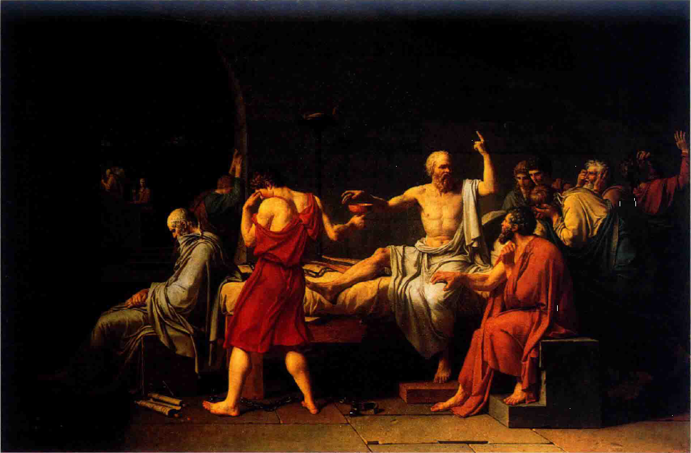

# 古典时期
* 到了18世纪中叶，**理性力量**的信念更加强大，已经开始逐渐动摇社会和宗教的权威；哲学家和作家们，特别是**伏尔泰**（Voltaire）和**狄德罗**（Denis Diderot）都认为他们的时代是历史上的转折点，将它称为“**启蒙时代**”
* 他们相信进步，认为**理性**而非习俗或传统是人类行为的最佳向导；他们对贵族和神职人员特权的抨击，反映了**中产阶级**为争取自身权利而斗争的愿望
* 18世纪的一些统治者们接受了启蒙运动的思想；例如，奥地利皇帝**约瑟夫二世**（1780——1790年在位）**废除了农奴制度**，关闭修道院和女修道院，并废除贵族在刑法上的特权
* 他不鼓励繁琐的宗教仪式，并下令葬礼应当**简朴**：虽然这条法令很快被废除，简朴的丧葬仪式很快成了**维也纳**的习惯；1791年，当古典时期最伟大的作曲家之一**沃尔夫冈·阿玛德乌斯·莫扎特**逝世时，他被装在麻袋里葬在一个不知名的公墓
* 1750一1820年间发生了一系列血腥的**政治和社会变革**，在此期间发生了七年战争、美国革命、法国革命以及拿破仑战争；政治和经济力量从贵族与教会转到中产阶级手中。社会变动如此剧烈，以至于拿破仑因**自身的天赋**而非血统关系最终当上**法国皇帝**
* 在18世纪前期，沉重、宏大的巴洛克风格被更为亲切的**洛可可**（rococo）风格取代，后者有明亮的色彩、曲折的线条和优雅的装饰；画家**安托万・华托**（Antoine Wattea）和**让-奥诺莱·弗拉戈纳尔**（Jean-Honore Fragonard）描绘了一个令人陶醉的世界，画中满是不断追逐享受的优雅的男女

* 然而到了18世纪末，洛可可风格逐渐被**新古典主义**（neoclassical）风格取代，后者试图再现古希腊罗马艺术中“高贵的简洁和宁静的庄严”；新古典艺术家们强调坚定的线条、清晰的结构和有道德意味的主题素材，曾参加法国大革命的画家**雅克-路易·大卫**（Jacques-Louis David）试图通过笔下的古罗马场景激发**英雄气概和爱国情操**

* **传统力量的衰退**在艺术领域中进一步反映在英国画家**威廉·荷加斯**（William Hogarth）和西班牙画家**弗朗西斯科·戈雅**（Francisco Goya）作品中，前者**社会意识强烈的画作**讽刺了英国贵族和中产阶级的行为与道德，后者以**高度个性化的视角**创造出抨击虚伪、压迫和残暴的作品

# 古典风格（1750——1820）
* 在音乐史上，从巴洛克风格到古典风格全盛期的过渡称为**前古典时期**（preclassical period），大约是1730——1770年
  * 甚至在巴赫和亨德尔创作巴洛克风格的伟大作品时，音乐风格的转变就已经开始了，新风格的重要先驱包括巴赫的儿子**卡尔·菲利普·埃曼纽尔·巴赫**（Carl Philipp Emanuel Bach）和**约翰・克里斯蒂安・巴赫**（Johann Christian Bach）；18世纪中期，作曲家着重表现**简明和清晰**，放弃了晚期巴洛克音乐的繁复，**悦耳的旋律**和**简洁的和声**取代了复调织体
  * 18世纪中期的作曲家用作品中情绪和主题的对比来娱乐听众，“**华丽风格**”（style galant）一词就是指这种轻松、优雅的音乐；音乐上的华丽风格类似于美术上的**洛可可风格**
* “**古典**”（classical）一词极易造成混淆，因为它的含义众多，它可以指**古希腊和罗马**，也可以指任何**长久受到喜爱的最高成就**（如movie classic）；许多人用“**古典音乐**”（classical music）一词表示爵士、摇滚、流行和民谣以外的音乐
  * 音乐史学家从**艺术史**领域借用了“古典”一词，这一术语在艺术领域更加贴切；18世纪后期和19世纪前期的绘画、建筑与雕塑深受**古希腊罗马典范**的影响，但同时期的音乐却**并未反映**出多少**与古代的直接联系**
  * “古典”音乐和“新古典”艺术之间显著的共同之处，是两者都强调**平衡**和**清晰的结构**；这些特征可以在发展成熟期的古典风格音乐中找到，而这恰是**本部分的重点**
## 古典风格的特征
### 情绪的对比
* 古典时期的音乐更加强调情绪的**丰富变化和对比**；晚期巴洛克作品表达**单一的情感**，而古典作品的情绪则**波动起伏**
  * 戏剧性、不稳定的音乐可能导向一段**轻松的舞曲曲调**，一个乐章内可能使用**互为对比的不同主题**，即使在同一个主题内也可能存在**明显的对比**
  * 古典风格音乐的情绪转变可能是**渐进**的，也可能是**突然**的，以表达情绪起伏和冲突；古典作曲家严格控制着这样的冲突和对比，海顿、莫扎特、贝多芬等大师都能够使情感变化多样的音乐具备统一性和逻辑感
### 节奏
* **节奏的灵活性**给古典风格音乐增添了变化；古典作品的节奏模式**丰富**，不同于巴洛克作品仅使用**反复出现**的少数节奏模式
  * 巴洛克作品表现出**持续不断的运动**，因此在音乐开始几小节后听众大概就能知道**整个乐章的节奏特征**；但古典风格作品会使用出人意料的休止、切分音和长短音符的**频繁转换**，从一种音符长度模式到另一种的改变可以是突然的，也可以是渐进的
### 织体
* 与晚期巴洛克音乐的**复调织体**相比，古典风格音乐主要为**主调织体**；不过，织体的运用和节奏一样**灵活**，音乐作品中织体的转换或平稳或突然
  * 一条旋律线和简单伴奏构成的**主调织体**开始，之后可能转为更复杂的**复调织体**，其中包含同时出现的**两条旋律**，或旋律片段在不同乐器间交替模仿
### 旋律
* 古典旋律特别悦耳动听、**容易记忆**，即使是特别复杂的作品也可能使用**民歌或流行风格**的旋律；有时作曲家也会直接借用一些**通俗曲调**
  * 莫扎特以法国歌曲《**哦，让我告诉你，妈妈**》（Ah，vos dirai-je，naman）的旋律为主题，写了一首**变奏曲**，该旋律即我们熟知的《**小星星**》
  * 古典旋律听起来较为平衡和对称，因为旋律通常由两个**长度相同**的乐句构成，第二个乐句的开头可能与第一个乐句类似，但结尾更具**终结感**，这种旋律朗朗上口，其形式可以记为aa'，它经常用于**童谣**，如《**玛丽有只小羊羔**》；相反，巴洛克旋律**较不对称**，更为精巧复杂，**较难演唱**
### 力度与钢琴
* 古典作曲家对情感表达的**细微差别**的兴趣，带来了渐进力度转换的广泛运用：**渐强**（crescendo）和**渐弱**（decrescendo）
  * 作曲家不局限于巴洛克音乐中典型的**阶梯力度**（突然的强弱转换）；渐强和渐弱可谓**令人震惊的新事物**，听众们有时甚至兴奋地从座位上起身
* 古典时期，作曲家对渐进力度变化的喜爱导致**羽管键琴**被**钢琴**取代；钢琴家可以通过控制**手指对琴键的压力**来控制音量
  * 虽然钢琴发明于**1700年左右**，但直到**1775年左右**才开始取代羽管键琴；海顿、莫扎特和贝多芬的大部分成熟的键盘作品都是为**钢琴**而非羽管键琴、楔槌键琴和管风琴等巴洛克时期流行的键盘乐器而作
  * 18世纪晚期的钢琴称为“**早期钢琴**”（fortepiano），它的重量比现代钢琴轻得多，**较细**的琴弦固定在**木制**而非金属的张弦系统上；早期钢琴的音域和音量**较小**，音的持续时间也**较短**
### 通奏低音的消失
* **通奏低音**在古典时期逐渐**被淘汰**；在海顿和莫扎特的作品中，羽管键琴家**不需要即兴演奏伴奏**
  * 通奏低音消失的原因之一在于更多的作品是为**业余爱好者**而作的，他们难以掌握通过数字低音即兴演奏的艰难技巧
  * 而且，古典作曲家希望有**更多的控制权**，他们更愿意自己写作伴奏部分而非让演奏者即兴发挥
## 古典时期的管弦乐队
* 古典时期出现了一种新的管弦乐队；巴洛克时期乐队的编制**依作品而异**，而古典时期的乐队则由四个标准部分构成：**弦乐器**、**木管乐器**、**铜管乐器**和**打击乐器**
  * 在莫扎特和海顿的**晚期器乐作品**中，乐队的编制大致如下，请注意木管乐器和铜管乐器都是**成对使用**的，且**单簧管**也加入了管弦乐队；海顿和莫扎特也使用**长号**，但仅用在歌剧和教会音乐中，不在纯器乐作品中使用

* 古典时期管弦乐队的乐手人数一般**比巴洛克时期多**，但也因地域不同而有所差别；海顿在1761——1790年间指挥的私人乐团只有二十五位乐手，而1795年他在伦敦的公开音乐会上指挥的乐团有六十名乐手
* 古典作曲家探索了乐队中不同乐器的**独特音色**，他们不会像巴洛克作曲家一样**以相同的方式处理不同乐器**
  * 古典作曲家不会让双簧管在整个乐章中重复小提琴旋律，古典作品有**丰富而频繁的音色变化**；一个音乐主题可以先由全体乐队奏出，然后移到弦乐器上，再由木管乐器重复
* 古典乐队的每个部分都有**各自的作用**
  * **弦乐**是最重要的，**第一小提琴**最常演奏**旋律**，**低音弦乐器**提供**伴奏**
  * **木管乐器**增加了**音色的对比**，并经常演奏**独奏旋律**
  * **圆号和小号**为强奏乐段**增添力量**，并增强**和声效果**，但它们很少演奏主旋律
  * **定音鼓**用于强调**节奏**
## 古典曲式
* 古典时期的器乐作品通常由几个速度和气质**各不相同的乐章**构成，一部作品通常包括下面的**四个乐章**

* **古典交响曲**和**弦乐四重奏**通常遵循这种四乐章模式，而**古典奏鸣曲**可以有二至四个乐章
  * **交响曲**（symphony）为**管弦乐团**而作；**弦乐四重奏**（string quartet）为两把小提琴、一把中提琴和一把大提琴而作；**奏鸣曲**则使用**一两件乐器**
* 古典作曲家可以使用**不同的曲式**来创作交响曲、弦乐四重奏或奏鸣曲的各个乐章；一首作品的某个乐章可能是ABA形式，另一个乐章则可能是主题与变奏
* 古典乐章中常常包含生动的**主题对比**，一个乐章可能包括二至四个，甚至更多气质各异的主题，这种对比性主题的运用使古典音乐区别于**巴洛克音乐**，后者通常只使用**一个主要主题**；古典作曲家有时用一个**短暂的休止**标志新主题的出现
* 古典乐章中较大的段落之间通常以令人满意的**对称方式**彼此平衡。远离主调的**不稳定段落**与强调主调的**稳定段落**相互平衡；音乐的张力在古典乐章结束时获得**纾解**
## 古典时期的作曲家、赞助人与公众
* 海顿、莫扎特与贝多芬——**三位伟大作曲家**——的创作时期正值剧烈的**政治与社会动荡**，正如我们在本部分开头所提到的；与其他人一样，音乐家们也深受社会变革的影响，通过三位大师的创作生涯，我们可以追溯作曲家们**逐渐获得解放**的经过
  * 首先是**约瑟夫·海顿**，他满足于大半生为一个富有的贵族家庭服务。从他的雇佣合同中可以看出，他被视为**有技术的仆人**，如同一位园丁或猎场看守人；他必须穿制服，“创作殿下所要求的音乐”，且应注意“避免饮食和谈话中的不文明行为” 
  * **沃尔夫冈·阿玛德乌斯·莫扎特**只比海顿晚出生二十四年，就可以不必忍受做一名仆人，他挣脱了**宫廷职位的束缚**，前往维也纳，试图成为一名**自由职业作曲家**；在最初几年中，他获得了巨大的成功，但之后他的声望下降，死时**债务缠身**
  * **路德维希·凡·贝多芬**的境况就比莫扎特好得多，仅仅在莫扎特逝世数年后，贝多芬就可以在维也纳当一位**独立音乐家**；他的成功基于中产阶级**更高的音乐需求**，也基于他的**强势个性**，使贵族愿意资助他并与他**平等交往**
* 在18世纪，更多人变得富裕，但蓬勃发展的中产阶级不仅需要物质生活，更需要贵族式的享受，如戏剧、文学和音乐 
  * 事实上，在古典时期，中产阶级对音乐有着巨大的影响，因为宫廷音乐会不对他们开放，市民们自行组织了**公共音乐会**，只要支付入场费就能欣赏到**最新的交响曲和协奏曲**
  * 不过，商人和律师们不满足于仅仅在音乐会上欣赏音乐，他们还希望自己**家中**弥漫着音乐气息，他们认为自己的子女应该像贵族子弟一样接受**音乐训练**；事实上，如果中产阶级的子女能够精通乐器演奏，他们可能被邀请到宫廷中，甚至获得与贵族联姻的机会
* 古典时期的作曲家开始重视**中产阶级的品位**
  * 他们创作业余爱好者也能**轻松演奏和理解**的作品；他们从正歌剧转向喜歌剧，从贵族喜爱的英雄性和神秘主义的情节转向中产阶级的主题和民歌旋律
  * 他们的喜歌剧有时甚至取笑贵族，舞曲乐章也不那么优雅和富于宫廷气息，而是更富于**活力和乡村气息**
* 严肃的作品也受到**民间和通俗音乐**的影响
  * 古典大师们有时用**熟悉的曲调**作为交响曲和变奏曲的主题，莫扎特喜欢看到人们在以他的**歌剧旋律**改编的圆舞曲伴奏下起舞；海顿、莫扎特和贝多芬都为维也纳的公共舞会创作过**舞曲**
### 维也纳
* 维也纳是古典时期欧洲的**音乐中心**之一，海顿、莫扎特和贝多芬都曾活跃于此
  * 作为**神圣罗马帝国**（包括现在奥地利、德国、意大利、匈牙利和捷克的部分地区的**首都**，它是一个繁荣的文化与商业中心，可谓是一座**大都会**；维也纳的人口近二十五万，是欧洲的**第四大城市**
  * 三位古典大师并非出生在维也纳，但他们都前往维也纳**学习并寻求发展**；在维也纳，**海顿**和**莫扎特**成了**亲密的朋友**，并互相影响了对方的音乐风格，**贝多芬**十六岁时到维也纳为莫扎特演奏，二十二岁时回到这里并师从海顿
* 帝国各地的贵族们都愿意在维也纳过冬，有时还带着他们的**私人乐队**；音乐是宫廷生活的重要部分，一支优秀的乐队是身份的象征
  * 许多贵族都是出色的音乐家，例如**玛丽亚·特蕾西亚**女皇年轻时曾在宫廷音乐会中演唱，**约瑟夫二世皇帝**是一位出色的大提琴手，**鲁道夫大公**（Archduke Rudolf）长期随贝多芬学习钢琴与作曲
* 维也纳也有许多轻松、通俗的**室外音乐活动**，弦乐器和木管乐器演奏者组成小型的**街头乐队**，在花园中的聚会或住宅窗下演奏，希望有人丢下赏钱
  * 海顿和莫扎特写了许多室外娱乐作品，称为**嬉游曲**（divertimento）或**小夜曲**（serenade）
## 奏鸣曲式
* 从古典时期到20世纪，数量惊人的重要作品都是用**奏鸣曲式**创作的
  * **奏鸣曲式**（sonata form，有时称为sonata-allegro form）是**一个乐章的曲式结构**，请勿将它与**奏鸣曲**混淆，后者是指由数个乐章构成的完整作品
  * 古典交响曲、奏鸣曲或弦乐四重奏中**快速的首乐章**通常使用奏鸣曲式；奏鸣曲式也用于**慢乐章**和**快速末乐章**
* 奏鸣曲式由**三个主要段落**构成：**呈示部**（exposition），呈示主题；**展开部**或**发展部**（development），以新的方式处理主题；**再现部**（recapitulation），主题回归；这三个主要段落后经常会跟着一个结束段落，称为**尾声**（coda），请记住这些段落都是在一个乐章之内

* 奏鸣曲式的快乐章有时会加用一个**慢引子**（introduction）以制造出一种**强烈的期待感**
### 呈示部
* 呈示部在**主调**和**新调**间，以及在**第一主题**（群）和**第二主题**（群）间制造出**激烈的冲突**
  * 它以主调上的**第一主题**开始，之后是一个**连接段**（bridge或transition），引导到新调上的**第二主题**；从主调到新调的转调制造出和声上的**紧张感**和不断前进的**运动感**
  * 第二主题通常与第一主题形成**情绪上的对比**，结尾段以第二主题的**新调性**结束呈示部；古典时期的呈示部末尾常常标有**反复记号**（：），表示整个呈示部应**重复演奏一次**
### 展开部
* 展开部通常是乐章中最具戏剧性的段落，音乐在**不同的调性**中不断变化，可能会使听众**失去平衡感**；通过不断的转调，**和声张力**得到强化
  * 在展开部中，主题得到**发展**，或以新的方式出现；它们被分割成片段或**动机**（motives），即在一首音乐作品中得到发展的**短小乐思**
  * 一个动机可以用来表现**完全不同**、出人意料的情感；例如，一个**喜剧性**的主题片段可能在改变旋律、节奏或力度后听起来有**侵略**、威胁的感觉
* 主题可以和**新的乐思**结合，主题的**织体**也可以改变，作曲家可以用不同乐器快速交替演奏一个动机以制造复杂的**复调织体**；在展开部中，和声与旋律的**不断变化**产生亟需解决的张力
### 再现部
* 再现部的开始使紧张感得到**解决**，因为**第一主题**重新出现在**主调**上
  * 在再现部中，第一主题、连接段、第二主题和结尾大致以和呈示部相同的方式呈示，但两者之间有**关键的差异**：再现部中所有的主要素材都在**主调**上；呈示部中主调的第一主题与新调的第二主题和结尾存在着**强烈的对比**，这一冲突在再现部中得到**缓解**

* 奏鸣曲式具有**灵活性**和无尽的变化能力，它不是一个僵化的模式，只能把音乐素材灌注进去；相反，它应被视为**一系列原则**，用来加强和统一**主题与调性的对比**
### 沃尔夫冈·阿玛德乌斯·莫扎特：G小调第40交响曲，K.550（1788）
#### 第四乐章：极快的快板（Allegro assai）
* 莫扎特G小调第40交响曲K.550急速的**奏鸣曲式末乐章**表达了一种**有节制的紧张感**
  * 开头的主题在**G小调**上，包含夸张的力度和节奏对比；一个弱的上行琶音（分解和弦）与一个强的快速乐句**反复交替**

  * 较长的**连接段**中保持着**激动的情绪**，它由主题中**强有力的快速乐句**产生；**过渡段**以短小的休止**明确地结束**，乐章中的其他段落也是如此
  * **温柔抒情**的**第二主题**在新调**降B大调**上，与喧闹的开头主题形成对比；它力度较轻，音乐平稳，使用时值较长的音
  * 莫扎特的**展开部**几乎都建立在第一主题的**上行琶音**基础上，在最初几秒，乐队齐奏琶音的变奏和一系列刺耳的下行跳进音程时，音乐形成了**强烈的爆发**；随着展开部的进行，音乐变为**复调织体**，与呈示部的主调织体形成对比，琶音在各声部间**快速模仿**，**迅速的转调**产生了无休止的紧张感
  * **再现部**中，第一和第二主题都回到了主调G小调上；小调为温柔的第二主题增添了**忧郁感**，它之前则以大调呈示

