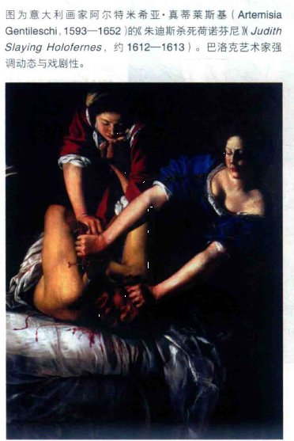
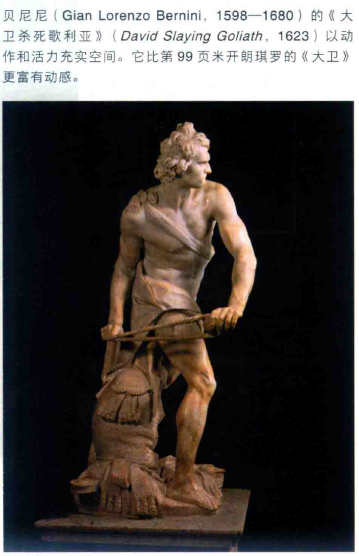
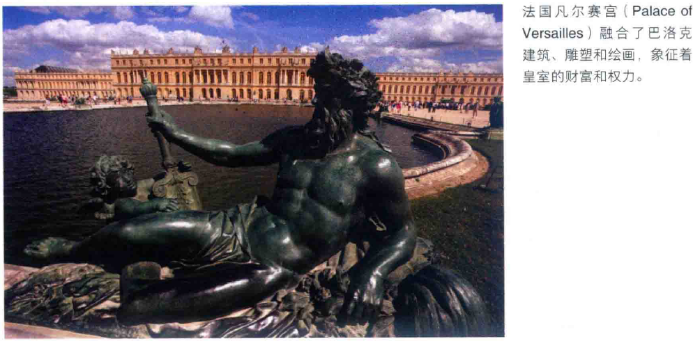
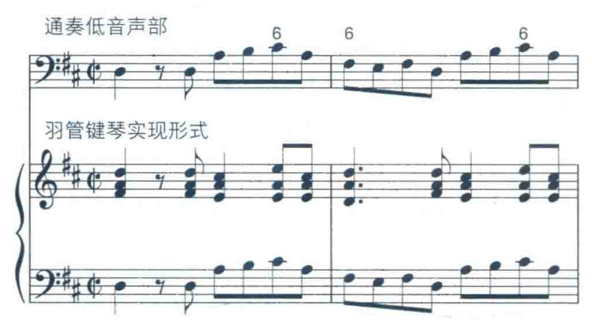
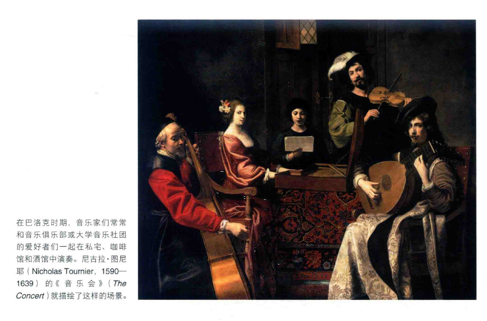

# 巴洛克
* **巴洛克**（baroque）一词在不同时代有着奇怪、俗丽或装饰精巧等诸多含义，而现代历史学家们只是用这个词来指代一种特定的艺术风格
* 一种过于简单但仍然有用的概括是，巴洛克风格用**动作与活力**充实画布、石材或音响的空间；画家、雕刻家和建筑师们希望营造出像舞台设计一样的**整体感**，卡拉瓦乔、真蒂莱斯基、贝尼尼、鲁本斯和伦勃朗等画家致力于拓展色彩、深度和明暗对比的戏剧潜力，力图创造出结构完整的艺术世界

* 这样的艺术风格特别符合**贵族**的需要，因为贵族们也向往这样一种完善的结构；在17一18世纪，贵族的**财富和权势**惊人，虽然大部分欧洲人都只能艰难生存，但统治者们却穷奢极欲

* 王公贵族通过**豪华的宫殿**和**奢华的宫廷娱乐**（如舞会、宴会、芭蕾、歌剧和戏剧）来显示权威；实际上，娱乐活动是必不可少的，许多朝臣平时无所事事，需要这些消遣以免无聊

* **巴洛克时代**（1600——1750）同时也是“专制时代”，因为许多统治者们都有着**绝对的权威**；例如，在德国，魏玛大公将他的宫廷音乐家约翰·塞巴斯蒂安·巴赫下狱一个月，因为巴赫坚持要离职
* 除了贵族之外，**教会**也深刻影响了巴洛克风格的形成，教会利用艺术的情感和戏剧力量使礼拜仪式更吸引人；在巴洛克时代，欧洲分为**天主教和新教地区**：法国、西班牙、意大利和奥地利帝国主要流行天主教，英格兰、荷兰、丹麦、瑞典和德国部分地区流行新教
* **伽利略**（1564——1642）和**牛顿**（1642——1727）的成就代表了基于数学和实验的新的**科学**方法，他们发现了支配物体运动的数学原理；巴洛克时期的这些科学发现促进了医学、采矿、航海和工业上的新发明与进步
# 巴洛克音乐（1600——1750）
* 巴洛克风格的音乐盛行于1600——1750年间，巴洛克时期的两位伟大作曲家是**乔治·弗里德里克·亨德尔**和**约翰·塞巴斯蒂安·巴赫**；巴赫死于1750年，这标志着**巴洛克时期的结束**
* 其他重要的巴洛克作曲家，如克劳迪奥·蒙特威尔第、亨利·普赛尔、阿尔坎杰罗·科雷利和安东尼奥·维瓦尔第，都曾**长期被遗忘**，直到20世纪才重新引起注意；LP唱片在20世纪40年代后期的出现引发了一次“**巴洛克复兴**”，使这些作曲家重新为音乐爱好者所熟知
* 巴洛克时期可以分为三个阶段：**早期**（1600一1640），**中期**（1640一1690）和**晚期**（1690一1750）；今天人们熟悉的巴洛克音乐多数来自**晚期**，而**早期**则是音乐史上最具革命性的时代之一
* 在意大利，作曲家为表达歌词中**强烈的感情**而作曲，歌词支配着音乐；对**戏剧性和歌词**的重视使早期巴洛克意大利作曲家们创造了**歌剧**——由管弦乐队伴奏的歌唱戏剧，他们的作品旋律常常**模仿**说话的节奏和语气
* 早期巴洛克作曲家偏爱**主调织体**而非文艺复兴时期的复调织体，他们认为只用一条主旋律加上和弦伴奏能更好地表达歌词内容；这种对主调织体的强调只是早期巴洛克风格的特征，到了晚期，**复调织体**又获得了作曲家们的青睐
* 为表达歌词的强烈情感，早期巴洛克作曲家更自由地运用**不协和音**和**不稳定的和弦**，**音色的对比**也更经常使用，如一个或多个独唱者与合唱团或人声与乐器的对比；文艺复兴合唱音乐即使使用乐器，也仅仅是用来重复声乐旋律，而在巴洛克早期，作曲家创作**独立的乐器伴奏声部**
* 在巴洛克时代中期（1640一1690），新的音乐风格从意大利传播到欧洲各地，几个世纪以来统治着欧洲音乐的**中世纪调式**（教会调式）逐渐被大小调式所取代；到了大约1690年，**大小调式**成为大多数音乐作品的基础
* 巴洛克时代中期的另一特征是**器乐**获得新的重视；作曲家为特定的乐器谱写音乐，**提琴族乐器**广为流行
## 巴洛克音乐的特征
### 情感的统一
* 一首巴洛克乐曲通常只表达**一种基本情绪**，音乐表现快乐、悲伤、激动等情绪状态——在当时被称为**情感**（affections）；作曲家使用一种**特定的音乐语言**以表达情感，特定的节奏或旋律形态与特定的情感相联系，这种通用的音乐语言使很多晚期巴洛克作品听上去很**相似**
* 巴洛克音乐的情绪一致性并不存在于**声乐作品**中，当歌词出现明显的情绪变化时，音乐也会有相应的变化；即使在这样的情况下，一种情绪也会稳定地持续一段时间才发生变化
### 节奏
* 巴洛克音乐的情绪一致性首先是由**节奏的持续性**导致的，一首作品开头的节奏型往往会贯穿整首乐曲
* 这种节奏的持续性形成难以抗拒的动力，一种极少被打断的向前运动；与大多数文艺复兴音乐相比，巴洛克音乐更加强调**节拍**
### 旋律
* 巴洛克旋律同样有**持续感**，乐曲开头的旋律会在一首巴洛克乐曲中**反复出现**；即使旋律发生变化，其基本特性也保持不变
* 旋律不断地扩展，有方向的运动感经常来自于旋律的**模进**（一个乐思在不同音高上不断重复）；许多巴洛克旋律听上去精致、富于装饰，并且**难以演唱和记忆**
* 巴洛克旋律常常给人留下**流动地扩展**而非平衡、对称的印象；在一个简短的开头乐句后，往往会是一段由不间断的快速音符组成的**长乐句**
### 力度 
* 在一段时间内，音乐的力度倾向于**保持不变**；如力度变化，则通常为**突然变化**，就像由一级台阶跳到另一级台阶
* 这种力度强弱的变化方式称为**阶梯式力度**（terraced dynamics），渐强和渐弱这样的力度渐变在巴洛克音乐中**不常使用**；不过，出于表达上的需要，歌手和器乐演奏者也会做一些细微的力度变化
* 巴洛克时期的主要键盘乐器是**管风琴**和**羽管键琴**，它们都适合持续的力度；管风琴和羽管键琴都无法像现代钢琴一样通过改变手指触键的力度来获得渐强渐弱效果
* 另一种键盘乐器**楔槌键琴**（clavichord）可以演奏力度的渐变，但范围很小，局限于PPP到mP
### 织体
* 晚期巴洛克音乐多使用**复调织体**：两条或多条旋律线一同出现；通常，**高音和低音旋律**更为重要
* **声部间的模仿**是一种常见的织体，在一个声部上出现的旋律常常也会出现在其他声部
* 不过，并非所有晚期巴洛克音乐都是复调的，特别是在声乐中，由于歌词情绪的改变，音乐作品的织体也会发生变化；不同的作曲家对织体的处理也不同，**巴赫**喜欢在整首作品中使用复调织体，**亨德尔**喜欢使用复调织体和主调织体的对比
### 和弦与通奏低音
* 在巴洛克时期，**和弦**变得更加重要；之前，人们更关注每条旋律各自的美感而非各旋律一同呈示时形成的和弦，某种意义上，和弦只是旋律运动带来的**副产品**，但在巴洛克时期，和弦自身的重要性增加
* 对和弦的兴趣使音乐的**低音声部**更为重要，因为它是**和声的基础**，音乐的整体结构建立在低音声部之上
* 对和弦与低音声部的强调导致了巴洛克音乐最主要特征的产生：一种称为**通奏低音**（basso continuo，原文为意大利文）的伴奏方式；通奏低音（简称为continuo）至少需要**两件乐器**：管风琴或羽管键琴等**键盘乐器**和大提琴或大管等**低音乐器**
* 管风琴或羽管键琴的**左手部分**演奏低音声部，由大提琴或大管重复；键盘乐器演奏者的**右手**按照乐谱上标记于低音声部上方的数字即兴演奏**和弦**
* 这种带有数字标记的低音声部称为**数字低音**（figured bass），这些数字只是基本的和弦结构，而非具体的演奏方式，给予演奏者很大的自由；下图为巴赫《勃兰登堡协奏曲》第五首，以及在羽管键琴上可能的实现形式

* 通奏低音除了使和弦稳定进行之外，还能**突出低音声部**；在实践中，使用数字标记而非写出和弦的每一个音还可以节省作曲家的时间，在纸价昂贵的时代也节省了不少开支
### 歌词
* 与音乐与文艺复兴时代的前辈们一样，巴洛克作曲家用音乐描绘歌词的内涵；“天堂”这个词可能配以高音，“地狱”可能配以低音，**上行音阶**表示向上运动，**下行音阶**则相反，**下行半音阶**往往代表痛苦和悲伤
* 巴洛克作曲家经常为一个音节配上**许多快速音符**来强调某个特定的词，这一技法也同时展现了歌手的精湛技巧；随着音乐的展开，歌词中相同的词句不断重复
## 巴洛克乐队
* 在巴洛克时期，管弦乐队的重心逐渐落到**提琴族乐器**上
* 以今天的标准来看，巴洛克乐队的规模**很小**，只有十至三四十人；乐队的**乐器组成**并不固定，依作品而异
* 乐队的核心是**通奏低音**（羽管键琴加上大提琴、低音提琴或大管）和**高音弦乐器**（第一、第二小提琴和中提琴）；木管乐器、铜管乐器和打击乐器的使用**并不固定**
* 作曲家在通奏低音和高音弦乐器外可以加用竖笛、长笛、双簧管、小号、圆号、长号或定音鼓等乐器，小号和定音鼓经常用于**节日气氛**的乐曲中；这种**富于弹性的乐队组成方式**与后来的标准编制（弦乐、木管、铜管和打击乐器四个部分）形成对比
* **巴洛克小号**（和早期圆号一样）**没有活塞**，但经常用于演奏快速、复杂的高音旋律；因小号**不易演奏**，且传统上**与皇室相联系**，小号手堪称巴洛克乐队中的贵族，当战争中交换战俘时，被俘的小号手会受到军官的礼遇
* 巴赫、亨德尔、维瓦尔第和其他作曲家精心挑选乐队的组成乐器，以使用特定的音色获取良好效果，他们乐于实验**不同的乐器组合**；不过，在巴洛克时期，**音色**显然不如其他的音乐要素——旋律、节奏与和声重要
* 作曲家常常以**相同的方式**处理不同的乐器；双簧管会和小提琴演奏相同的旋律，长笛也会和小号在乐曲的展开部分相互模仿
## 巴洛克曲式
* 巴洛克音乐，特别是器乐作品常常体现出**情绪的统一**；不过，许多巴洛克作品包括**不同的部分**或乐章，各部分之间形成**对比**
* **乐章**（movement）是一段相当完整、**独立**的音乐，同时又是较大作品的**一部分**；不同乐章常常有各自的音乐主题，有明确的结尾，并以**短暂的休止**与下一乐章分隔
* 无论曲式为何，巴洛克音乐经常使用**对比**；乐曲经常以一小组乐器和一大组乐器，或乐器和带乐器伴奏的人声形成对比
## 巴洛克社会中的音乐
* 19世纪之前，大多数音乐作品都是**应约创作**，主要为了满足教会和贵族宫廷的需求；歌剧院和市民也一直需要音乐，不论哪种情况下，听众们都要求**新作品**，他们不想听“过时”的音乐
* 音乐是**贵族宫廷的主要娱乐方式**；一座宫廷可能会雇用一支管弦乐队、一个唱诗班和一些歌剧歌手，能雇用多少人取决于宫廷的财力
  * **宫廷乐长**负责监督音乐演出并谱写需要的音乐作品，包括歌剧、宗教音乐、宴会音乐和宫廷音乐会需要的作品；工作繁忙的乐长们还需要培训管理其他音乐家，以及保管乐器和乐谱收藏
  * **宫廷乐长**的工作有利有弊，他们的**薪酬和名望**都相当高，创作的作品也一定能得到**演出机会**；不过无论他多么伟大，作曲家都是贵族的仆人，未经允许**不得离职和休假**
  * 有些统治者本人就是优秀的音乐家，18世纪中叶的普鲁士国王**腓特烈大帝**（Frederick the Great）是一位出色的**长笛演奏家**和**作曲家**，也是令人生畏的统帅
* 教会也需要音乐，**宗教音乐**通常是**壮丽宏伟**的，在管风琴和唱诗班之外，许多巴洛克教堂还经常使用**管弦乐队**为礼拜仪式伴奏；实际上，大多数**普通民众**只有在教堂中才能听音乐，当时很少有公共音乐会，一般人也没什么机会进人宫廷
  * **教堂的乐长**，和宫廷乐长一样，也需要不断创作新的作品，并在教会学校中负责唱诗班的训练；优秀的**宗教音乐**能够提高城市的声誉，因此城市之间为争取优秀的音乐家而相互竞争
  * 不过，为教堂工作的音乐家们收入和地位都不如**宫廷音乐家**，他们靠柴火和食物津贴以及**婚丧仪式的额外收入**来贴补微薄的工资
* 较大的**城镇**为许多场合雇用音乐家：在教堂、游行、欢迎来访贵族的仪式或大学毕业典礼中演奏；这些城镇音乐家们常常和音乐俱乐部或大学音乐社团的爱好者们一起在私宅、咖啡馆和酒馆中演奏

* 有些巴洛克音乐家也通过为商业歌剧院**创作歌剧**来赚钱，这样的歌剧院大都集中在**意大利**；在当时只有12.5万人的威尼斯，1680一1700之间共有六座歌剧院并存
  * 在伦敦，**亨德尔**于1719年当上了一家商业歌剧公司的音乐指导，这是一家由英国贵族出资的股份公司，在伦敦股票交易所上市；这家公司于1728年破产后，亨德尔成立了**自己的公司**，他亲自写作歌剧并担任指挥、公司经理和剧院经理，身兼数职的亨德尔因此被视为历史上**第一位伟大的“自由职业”音乐家**
* 在巴洛克时期，成为音乐家常见的情况是**子承父业**，许多重要作曲家，包括巴赫、维瓦尔第、普赛尔、库普兰和拉莫都出身于音乐世家
  * 有时男孩会被送到城镇音乐家的家中**居住学艺**，作为回报，他们需要承担一些零活，如**抄写乐谱**；许多巴洛克作曲家以**唱诗班歌童**的身份开始音乐生涯，并在**教会学校**中学习音乐
  * 在意大利，音乐学校常常与**孤儿院**相联系（**音乐学院**Conservatory一词源于意大利语，原为“孤儿院”之意）；在孤儿院中，孤儿、弃儿和穷人的子女们**接受音乐训练**，其中有些成为闻名欧洲的歌剧歌手和演奏家，维瓦尔第等有名望的作曲家**受聘于**孤儿院，以指导音乐会的演出
  * **维瓦尔第**在威尼斯指挥的**女性乐队**被认为是意大利最好的乐队之一；在巴洛克时期，**女性**无法成为宫廷乐队或歌剧院乐队的指挥或乐手，不过，一些女性，包括**弗朗切斯卡·卡契尼**（Francesca Caccini）、**芭芭拉·斯特**（Barbara Strozzi）成为受人尊敬的**作曲家**
  * 为了找到工作，音乐家们常常要通过一次**艰难的考试**，演奏并提交个人作品；有时职位要求还包括一些**与音乐无关的事项**，申请职位的人可能被要求给城镇金库“自愿捐款”，甚至和前任音乐家的女儿结婚
* **作曲家**是巴洛克社会整体中的一部分，为宫廷、教堂、城镇和商业歌剧院工作；尽管他们为特定需求而作曲，但他们的音乐质量如此之高，以致许多作品都成了今天的**音乐会保留曲目**
